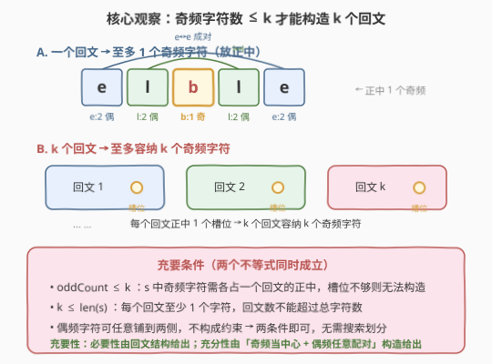
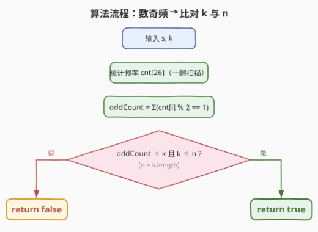
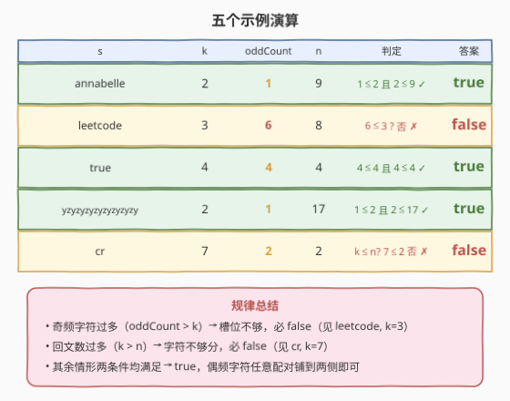

# LeetCode 构造 K 个回文字符串 题解

## 1. 题目概述

- **标题 / 题号**：构造 K 个回文字符串（#1400，medium）
- **链接**：https://leetcode.cn/problems/construct-k-palindrome-strings/
- **难度**：中等
- **标签**：贪心、哈希表、字符串、回文

**题意**：给你一个字符串 `s` 和一个整数 `k`。请你用 `s` 的**所有字符**构造 `k` 个**回文串**。

如果可以用 `s` 的全部字符构造出 `k` 个回文串，返回 `true`；否则返回 `false`。

**示例 1**：

```text
输入：s = "annabelle", k = 2
输出：true
解释：用所有字符可以构造 2 个回文串，例如 "anna" 与 "elble"。
```

**示例 2**：

```text
输入：s = "leetcode", k = 3
输出：false
解释：无法用 "leetcode" 的所有字符构造 3 个回文串。
```

**示例 3**：

```text
输入：s = "true", k = 4
输出：true
解释：唯一可行的方案是把每个字符单独作为一个回文串："t"、"r"、"u"、"e"。
```

**示例 4**：

```text
输入：s = "yzyzyzyzyzyzyzyzy", k = 2
输出：true
解释：可构造 "yyz" 与 "zyzyzyzyzyzyzyz" 两个回文串。
```

**示例 5**：

```text
输入：s = "cr", k = 7
输出：false
```

**约束**：

- $1 \le \text{s.length} \le 10^5$
- `s` 由小写英文字母组成
- $1 \le k \le 10^5$

> 💡 本题不要求给出具体构造方案，只问「能否」。一旦想到**回文对字符奇偶性的约束**，问题就退化为一个**频次统计 + 两个不等式判断**的 $O(n)$ 贪心，无需任何搜索或划分枚举。

## 2. 解题思路

### 2.1 暴力思路：枚举所有划分

最直观的做法：把 `s` 的 $n$ 个字符划分成 $k$ 个非空子串，对每种划分逐个判回文（每段字符可重排成回文即视为合法段），只要有任一划分全部合法就返回 `true`。

问题在于——

- **划分数指数级**：将 $n$ 个字符分成 $k$ 个非空段的方案数是第二类 Stirling 数量级，$n$ 可达 $10^5$，完全不可行；
- **判回文重复开销**：每种划分都要对 $k$ 段各自校验频次，没有利用「整体频次」这一全局信息。

> ⚠️ 这种「枚举划分」的思路完全忽略了回文的**结构性质**——回文能容纳的「奇频字符数」是有上界的。利用这条性质，划分是否可行可以**不依赖具体怎么分**而直接由全局频次判定。

### 2.2 核心观察：奇频字符数 ≤ k 是充要条件



关键洞察分两层：

**第一层：单个回文至多容纳 1 个奇频字符。** 回文两侧天然对称，每种字符总是**成对出现**（左侧一个、右侧一个）。因此成对的字符频次为偶；唯一能「落单」的是正中间那个位置，至多放 1 个频次为奇的字符。例如 `"elble"`：`e×2`、`l×2` 成对铺在两侧，`b×1` 居中。

**第二层：k 个回文至多容纳 k 个奇频字符。** 每个回文给一个「中心槽位」，$k$ 个回文共 $k$ 个槽位。设 `s` 中奇频字符共 $\text{oddCount}$ 个，每个都必须占据某个回文的正中（因为偶频字符能成对铺两侧、奇频字符必有 1 个落单）。所以必要条件是：

$$\text{oddCount} \le k$$

> ⚠️ **为何 $\text{oddCount} \le k$ 也是充分的？** 把 $\text{oddCount}$ 个奇频字符各放进一个回文当中心（用掉 $\text{oddCount}$ 个槽位，剩余 $k - \text{oddCount}$ 个回文用任意偶频字符凑中心或留空配对均可）；所有偶频字符可任意拆成成对、铺到任意回文的两侧。这样 $k$ 个回文都能构造出来。故充要条件为：$\text{oddCount} \le k$ **且** $k \le n$（每个回文至少 1 个字符，回文数不能超过总字符数）。

> 💡 还有一个等价视角：$k$ 个回文的奇频字符总数 $\le k$，而**整体频次的奇偶性在重排/划分下不变**——`s` 的 $\text{oddCount}$ 恰好等于「分到各回文后，各回文奇频字符数之和」（因为偶数被成对搬走不改变奇偶，奇数搬走后落单的那 1 个仍计入该回文的奇频）。所以 $\text{oddCount} \le k$ 既是必要也是充分。

### 2.3 算法流程图



**完整步骤**：

1. 令 $n = \text{s.length}$。若 $k > n$，直接返回 `false`（字符不够分）。
2. 统计 `s` 中每个字符的频次（长度为 26 的数组即可，`s` 只含小写字母）。
3. 统计奇频字符数 $\text{oddCount}$（即 `cnt[i] % 2 == 1` 的个数）。
4. 返回 $\text{oddCount} \le k$。

> 💡 **提前剪枝**：先判 $k > n$ 可在 $O(1)$ 内短路掉示例 5 那类情形，免去无谓的频次统计。两条件顺序无关，但把 $O(1)$ 的判断放前面是更好的工程习惯。

### 2.4 示例演算

五个官方示例的演算：



| `s` | `k` | oddCount | $n$ | 判定 | 答案 |
|-----|-----|----------|-----|------|------|
| `annabelle` | 2 | 1（`b`） | 9 | $1 \le 2$ 且 $2 \le 9$ ✓ | `true` |
| `leetcode` | 3 | 6（`l,e,t,c,o,d`，`e=3` 也算奇） | 8 | $6 \le 3$? 否 ✗ | `false` |
| `true` | 4 | 4（`t,r,u,e`） | 4 | $4 \le 4$ 且 $4 \le 4$ ✓ | `true` |
| `yzyzyzyzyzyzyzyzy` | 2 | 1（`y=9`，`z=8` 偶） | 17 | $1 \le 2$ 且 $2 \le 17$ ✓ | `true` |
| `cr` | 7 | 2（`c,r`） | 2 | $k \le n$? $7 \le 2$ 否 ✗ | `false` |

以 `s = "leetcode"`、`k = 3` 为例逐位核对频次：

| 字符 | l | e | t | c | o | d | e |
|------|---|---|---|---|---|---|---|
| 频次 | 1 | 3 | 1 | 1 | 1 | 1 | （e 已计） |

合并后：`l=1, e=3, t=1, c=1, o=1, d=1`，奇频字符共 6 个（`e=3` 是奇数也计入）。要把 6 个奇频字符塞进 3 个回文，每个回文中心只能放 1 个，槽位不够，故 `false`。

## 3. 参考代码

### 方法一：频次统计 + 双不等式判断（推荐）

### C++

```cpp
class Solution {
public:
    bool canConstruct(string s, int k) {
        int n = s.size();
        if (k > n) return false;
        int cnt[26] = {0};
        for (char c : s) cnt[c - 'a']++;
        int oddCount = 0;
        for (int i = 0; i < 26; i++)
            if (cnt[i] % 2 == 1) oddCount++;
        return oddCount <= k;
    }
};
```

### Python

```python
class Solution:
    def canConstruct(self, s: str, k: int) -> bool:
        if k > len(s):
            return False
        from collections import Counter
        oddCount = sum(v & 1 for v in Counter(s).values())
        return oddCount <= k
```

> 💡 **实现细节**：① 先判 `k > len(s)` 做 $O(1)$ 短路，避免无谓统计。② `v & 1` 等价于 `v % 2 == 1`，位运算更简洁。③ C++ 用定长数组 `cnt[26]` 比 `unordered_map` 更快，字母表只有 26 种。④ 只关心奇偶性，无需知道具体哪个字符奇频，故统计时只累加 `oddCount` 即可。

### 方法二：边统计边翻转奇偶（O(1) 额外状态）

> 💡 **另一思路**：不必存完整频次表，只用一个 `oddCount` 在扫描时**翻转奇偶**——每遇到一个字符，把它对应的「是否奇频」状态翻转一次（`oddCount += (cnt[c-'a'] ^= 1) ? 1 : -1`）。等价但省去第二次遍历。仍需 26 大小的状态数组记录每个字符当前奇偶，故额外空间仍为 $O(|\Sigma|)$，仅减少一轮循环。

```cpp
class Solution {
public:
    bool canConstruct(string s, int k) {
        int n = s.size();
        if (k > n) return false;
        int oddCount = 0;
        bool odd[26] = {false};
        for (char c : s) {
            int i = c - 'a';
            odd[i] = !odd[i];
            oddCount += odd[i] ? 1 : -1;
        }
        return oddCount <= k;
    }
};
```

```python
class Solution:
    def canConstruct(self, s: str, k: int) -> bool:
        if k > len(s):
            return False
        odd = [False] * 26
        oddCount = 0
        for c in s:
            i = ord(c) - ord('a')
            odd[i] = not odd[i]
            oddCount += 1 if odd[i] else -1
        return oddCount <= k
```

> ⚠️ **边界 `k == n`**：每个字符单独成回文，此时 $\text{oddCount}$ 必然 $\le n = k$（奇频字符数不超过字符种类数 $\le 26 \le n$），故恒返回 `true`，与方法一一致。边界 `k == 1` 退化为「整串能否重排成回文」，即经典的至多 1 个奇频判定，同样被 $\text{oddCount} \le 1$ 覆盖。

## 4. 复杂度分析

| 维度 | 复杂度 | 说明 |
|------|--------|------|
| **时间** | $O(n)$ | 一趟扫描统计频次（或翻转奇偶）+ 至多 26 次的奇频计数，$n$ 为主导项 |
| **空间** | $O(|\Sigma|)$ | 频次/奇偶数组大小为字母表大小，小写字母 $|\Sigma| = 26$，可视为 $O(1)$ |
| **额外空间** | $O(1)$ | 仅常数个整型变量，无递归、无辅助数据结构 |

> 本题 $n \le 10^5$，$O(n)$ 一趟扫描远在时限内。空间上 $O(1)$ 已是理论下界（输出只需一个布尔值）。关键在于把指数级划分枚举降到线性，全靠「奇偶性充要条件」这一结构洞察。

## 5. 扩展：若要输出具体构造方案

本题只问可行性。若进一步要求**输出 $k$ 个回文串的具体内容**，可在判定可行的前提下贪心构造：

1. 把 $\text{oddCount}$ 个奇频字符各取 1 个，分配到任意 $\text{oddCount}$ 个回文的中心；剩余 $k - \text{oddCount}$ 个回文暂留空（用任意偶频字符补中心或留空串——但题目要求非空，故至少各放 1 个字符）。
2. 所有字符的**剩余频次**（奇频字符扣掉中心 1 个后变偶）全为偶数，可任意拆成成对，铺到任意回文的两侧（左 1 个、右 1 个）。
3. 注意保证每个回文非空：先给每个回文至少放 1 个字符（中心或一对），再分配剩余成对字符。

整体仍为 $O(n)$。这把「判定」升级为「构造」，但核心仍是「奇频当中心 + 偶频任意配对」。

> 💡 **相关对照**：[409. 最长回文串](../0401-0500/409_最长回文串.md) 是「用给定字符构造**最长**的**一个**回文」——同样是奇偶性洞察，但目标从「能否分 $k$ 个」变成「一个回文能多长」，把奇频字符的「落单 1 个」尽量只留 1 个当中心，其余奇频各扣 1 个转偶。两题共享同一基础观察，方向不同。

## 6. 面试要点

1. **为什么奇频字符数 $\le k$ 是充要条件？**

   > 必要性：每个回文至多 1 个奇频字符（正中），$k$ 个回文至多容纳 $k$ 个奇频字符，故 $\text{oddCount} > k$ 时不可能。充分性：$\text{oddCount} \le k$ 时，把每个奇频字符的 1 个落单者放进一个回文当中心，所有偶频字符（含奇频字符扣 1 后的剩余偶数）成对铺到任意回文两侧，即可构造 $k$ 个回文。

2. **为什么还需要 $k \le n$？**

   > 每个回文至少含 1 个字符，$k$ 个非空回文至少需要 $k$ 个字符。若 $k > n$ 字符不够分，必为 `false`（见示例 5 `cr, k=7`）。这条与奇偶性无关，是基本的计数约束。

3. **不实际构造，如何确信充分性成立？**

   > 关键在于偶频字符「成对」的性质：任何偶频字符可拆成若干对，每对在任一回文的左右各放 1 个不破坏回文性。因此偶频字符的分配毫无约束，真正受限的只有奇频字符的落单部分。把落单者各占一个中心后，剩余全是偶数，必可任意配对铺完。

4. **`k == 1` 时退化成什么？**

   > 退化为「整串能否重排成一个回文」，即经典判定：至多 1 个字符频次为奇。被 $\text{oddCount} \le 1$ 自然覆盖，无需特判。

5. **若字母表扩大到 Unicode 全集会怎样？**

   > 奇偶性结论不变，只是频次统计改用哈希表，空间从 $O(26)$ 变为 $O(m)$（$m$ 为实际出现的字符种数）。时间仍是 $O(n)$。本题限定小写字母，定长数组最快。

> 💡 **一句话总结**：1400 的本质是「回文的奇偶性约束」——一个回文至多 1 个奇频字符，故 $k$ 个回文至多 $k$ 个奇频字符；加上 $k \le n$ 的计数约束，两个不等式即定答案，$O(n)$ 一趟扫描。

## 同类练习题

| # | 题目 | 与本题的关联 |
|---|------|-------------|
| 409 | [最长回文串](https://leetcode.cn/problems/longest-palindrome/)（[题解](../0401-0500/409_最长回文串.md)） | 共享「奇偶性决定回文」的核心观察，目标是构造**最长的一个**回文，把奇频落单者尽量只留 1 个，方向互补 |
| 1332 | [删除回文子序列](https://leetcode.cn/problems/remove-palindromic-subsequences/)（[题解](../1301-1400/1332_删除回文子序列.md)） | 字符串 + 回文 + 脑筋急转弯，答案被结构压缩到 $\{1, 2\}$，与本题「靠结构性质免去搜索」同味 |
| 1374 | [生成每种字符都是奇数个的字符串](https://leetcode.cn/problems/generate-a-string-with-characters-that-have-odd-counts/)（[题解](../1301-1400/1374_生成每种字符都是奇数个的字符串.md)） | 奇偶性构造题，利用「奇 + 奇 = 偶」拼合法串，巩固对奇偶性的直觉 |
| 132 | [分割回文串 II](https://leetcode.cn/problems/palindrome-partitioning-ii/)（[题解](../0101-0200/132_分割回文串II.md)） | 把串**连续**分割成最少数回文子串，需 $O(n^2)$ DP，对照体会本题「重排 + 结构性质」带来的降维打击 |
| 9 | [回文数](https://leetcode.cn/problems/palindrome-number/)（[题解](../0001-0100/9_回文数.md)） | 回文判定的基础题，反转一半数字，巩固「回文对称性」的底层直觉 |
