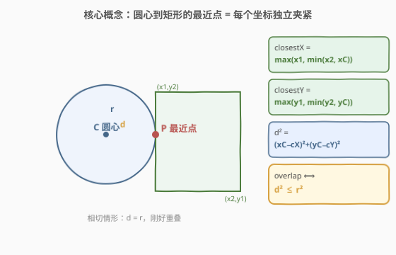
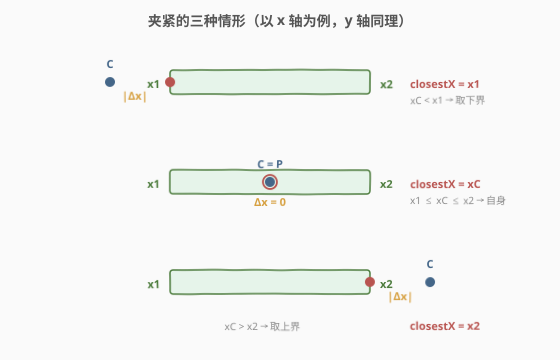
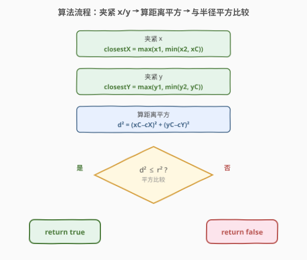
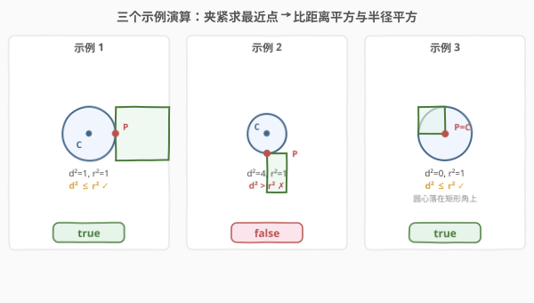

# 圆和矩形是否有重叠

- **题目名称**：圆和矩形是否有重叠
- **链接**：[1401. 圆和矩形是否有重叠](https://leetcode.cn/problems/circle-and-rectangle-overlapping/)
- **难度**：中等
- **标签**：几何、数学

## 1. 题目概述

给定一个以 `(radius, xCenter, yCenter)` 表示的**圆**，和一个与坐标轴平行的**矩形** `(x1, y1, x2, y2)`，其中 `(x1, y1)` 是矩形左下角、`(x2, y2)` 是右上角。若圆与矩形有重叠（含边界相切），返回 `true`，否则返回 `false`。

换句话说，检测是否存在点 `(xi, yi)` 同时落在圆和矩形上（含边界）。

**示例 1**：

```text
输入：radius = 1, xCenter = 0, yCenter = 0, x1 = 1, y1 = -1, x2 = 3, y2 = 1
输出：true
解释：圆和矩形存在公共点 (1, 0)。
```

**示例 2**：

```text
输入：radius = 1, xCenter = 1, yCenter = 1, x1 = 1, y1 = -3, x2 = 2, y2 = -1
输出：false
```

**示例 3**：

```text
输入：radius = 1, xCenter = 0, yCenter = 0, x1 = -1, y1 = 0, x2 = 0, y2 = 1
输出：true
```

**约束条件**：

- $1 \le \text{radius} \le 2000$
- $-10^4 \le \text{xCenter}, \text{yCenter} \le 10^4$
- $-10^4 \le \text{x1} < \text{x2} \le 10^4$
- $-10^4 \le \text{y1} < \text{y2} \le 10^4$

> 💡 本题是经典「几何位置关系」题。圆是连续体、矩形也是连续体，二者是否重叠本质是**最小距离是否超过半径**。难点不在算法复杂度，而在想清楚「圆心到矩形的最短距离」如何 O(1) 求出——核心是把每个坐标轴独立做**夹紧（clamp）**。

---

## 2. 解题思路

### 2.1 暴力思路：枚举矩形内所有点

最朴素的判定法：枚举矩形区域内每一个点，逐点判断它是否落在圆内（$(x-\text{xCenter})^2 + (y-\text{yCenter})^2 \le \text{radius}^2$），只要命中一个即返回 `true`。

```text
for x in x1..x2:
    for y in y1..y2:
        if (x-xC)^2 + (y-yC)^2 <= r^2:
            return true
return false
```

> ⚠️ 坐标范围达 $[-10^4, 10^4]$，矩形最多含约 $4 \times 10^8$ 个整数点（更别说连续点），必然超时。即便只在边界上采样也容易漏掉真正的最近点。**破局关键**：与其枚举所有点，不如直接求出离圆心最近的那一个点——只要它都在圆外，其余点必然更远。

**常见错误：只检查 4 个顶点**。不少人会退化成「判断矩形 4 个角是否在圆内」。这只覆盖了「圆心在矩形外、且最近点恰好是某个角」的情形；当圆心正对某条边时（如示例 1：圆心 $(0,0)$ 正对矩形左边 $x=1$），最近点是边上的 $(1,0)$ 而非任何顶点，4 角检查会漏判。正确做法是求**圆心到矩形（作为区域）的最近点**。

### 2.2 核心观察：夹紧法求最近点



矩形是**轴对齐**的，这一约束带来一个关键性质：求圆心到矩形的最近点时，**x、y 两个方向可以独立处理**。

对每个坐标轴，圆心投影相对矩形区间只有三种位置：

- 圆心在区间**左侧**（小于下界）→ 最近点取下界；
- 圆心在区间**内部** → 最近点取圆心自身（该方向距离为 0）；
- 圆心在区间**右侧**（大于上界）→ 最近点取上界。

这正是**夹紧（clamp）**运算：

$$\text{closestX} = \max(x_1,\; \min(x_2,\; \text{xCenter}))$$
$$\text{closestY} = \max(y_1,\; \min(y_2,\; \text{yCenter}))$$

> 💡 **为什么夹紧给出的是最近点？** 轴对齐矩形的边界由两个独立区间 $[x_1, x_2] \times [y_1, y_2]$ 描述。距离平方 $d^2 = (\Delta x)^2 + (\Delta y)^2$ 是两项非负之和，要最小化 $d^2$，只需分别最小化 $|\Delta x|$ 和 $|\Delta y|$——而每项的最小值恰由 clamp 给出。两轴独立、互不干扰，是本题能在 $O(1)$ 解决的根本原因。

得到最近点 $(\text{closestX}, \text{closestY})$ 后，判定它与圆心距离是否超过半径即可：

$$\text{overlap} \iff (\text{xCenter} - \text{closestX})^2 + (\text{yCenter} - \text{closestY})^2 \le \text{radius}^2$$



> ⚠️ **用平方比较，不要开方**。比较 $d^2 \le r^2$ 而非 $\sqrt{d^2} \le r$，避免浮点 `sqrt` 引入精度误差与性能开销，全程整数运算。题目允许整数坐标与整数半径，平方比较天然精确。

**特例自洽**：当圆心落在矩形内部时，clamp 后 $\text{closestX} = \text{xCenter}$、$\text{closestY} = \text{yCenter}$，距离为 $0 \le r^2$，返回 `true`——这正是「圆心在矩形内必重叠」的几何事实，无需单独写 if 分支。

### 2.3 算法流程图



四步纯算术，无循环无递归：

1. 夹紧 x：$\text{closestX} = \max(x_1, \min(x_2, \text{xCenter}))$；
2. 夹紧 y：$\text{closestY} = \max(y_1, \min(y_2, \text{yCenter}))$；
3. 算距离平方：$d^2 = (\text{xCenter} - \text{closestX})^2 + (\text{yCenter} - \text{closestY})^2$；
4. 返回 $d^2 \le \text{radius}^2$。

### 2.4 示例演算



| 示例 | 圆心 | 半径 | 矩形 x/y 区间 | closestX | closestY | $d^2$ | $r^2$ | 结论 |
|------|------|------|---------------|----------|----------|-------|-------|------|
| 1 | (0, 0) | 1 | $[1,3] / [-1,1]$ | $\max(1,\min(3,0))=1$ | $\max(-1,\min(1,0))=0$ | $(-1)^2+0^2=1$ | 1 | $1\le1$ → true |
| 2 | (1, 1) | 1 | $[1,2] / [-3,-1]$ | $\max(1,\min(2,1))=1$ | $\max(-3,\min(-1,1))=-1$ | $0^2+2^2=4$ | 1 | $4\le1$ → false |
| 3 | (0, 0) | 1 | $[-1,0] / [0,1]$ | $\max(-1,\min(0,0))=0$ | $\max(0,\min(1,0))=0$ | $0+0=0$ | 1 | $0\le1$ → true |

以**示例 2** 拆解：圆心 $(1,1)$，矩形在 $y \in [-3,-1]$ 整段位于圆心下方。x 方向圆心 $1 \in [1,2]$，夹紧得 $\text{closestX}=1$（距离 0）；y 方向圆心 $1 > y_2=-1$，夹紧得 $\text{closestY}=-1$（距离 $2$）。最近点 $(1,-1)$ 到圆心距离平方 $0+4=4$，而 $r^2=1$，$4 > 1$ 故无重叠——矩形整块「吊」在圆下方，连最近点都差了 $2$ 个单位。

**示例 3** 是圆心落在矩形边界上的特例：圆心 $(0,0)$ 恰好是矩形的左下角，夹紧后最近点就是圆心自己，距离 $0$，自然重叠。

---

## 3. 参考代码

### C++

```cpp
class Solution {
public:
    bool checkOverlap(int radius, int xCenter, int yCenter,
                      int x1, int y1, int x2, int y2) {
        int closestX = max(x1, min(x2, xCenter));
        int closestY = max(y1, min(y2, yCenter));
        int dx = xCenter - closestX;
        int dy = yCenter - closestY;
        return dx * dx + dy * dy <= radius * radius;
    }
};
```

### Python

```python
class Solution:
    def checkOverlap(self, radius: int, xCenter: int, yCenter: int,
                     x1: int, y1: int, x2: int, y2: int) -> bool:
        closest_x = max(x1, min(x2, xCenter))
        closest_y = max(y1, min(y2, yCenter))
        dx = xCenter - closest_x
        dy = yCenter - closest_y
        return dx * dx + dy * dy <= radius * radius
```

> 💡 **实现细节**：① `max(lo, min(hi, v))` 是 clamp 的标准写法，等价于「先盖上界再盖下界」；② 全程整数运算，`radius` 最大 $2000$，平方 $4 \times 10^6$，坐标差最大 $2 \times 10^4$，平方 $4 \times 10^8$，均在 32 位 `int` 范围内，无需 `long long`；③ 圆心在矩形内的特例由 clamp 自然给出距离 $0$，不必单独判分支。

---

## 4. 复杂度分析

| 维度 | 复杂度 | 说明 |
|------|--------|------|
| 时间复杂度 | $O(1)$ | 两次 `min`/`max`、两次乘法与一次比较，常数次运算 |
| 空间复杂度 | $O(1)$ | 仅几个整型变量 |

> ⚠️ 本题是「想清楚公式即赢」的几何题，输入规模再大也不影响复杂度。瓶颈在思路而非实现。

---

## 5. 扩展：圆与圆、点在线段上的最近距离

**圆与圆重叠**：两圆心距离 $d \le r_1 + r_2$ 即重叠，平方比较 $d^2 \le (r_1+r_2)^2$。

**圆与任意旋转矩形**：矩形不再轴对齐时，两轴无法独立 clamp。通用做法是把圆心**变换到矩形局部坐标系**（绕矩形中心旋转 $-\theta$），在新坐标系下矩形重新轴对齐，于是又回到本题的 clamp 流程；求出局部最近点后再判断距离。

**点到线段的最近点**：clamp 思想可推广到一维线段——把圆心投影到线段方向上，再用 clamp 把投影参数夹紧到 $[0,1]$，对应线段上最近点。本题的「圆心到矩形」是它的二维版：x/y 各做一次一维 clamp。

> 💡 **一句话总结**：轴对齐几何体的「最近点」可分解为各坐标轴独立的 clamp；得到最近点后比距离平方与半径平方。本题是这一思想的最小二维实例。

---

## 6. 面试要点

1. **为什么只需求「最近点」而非枚举所有点？**

   > 距离函数 $d(\text{圆心}, \cdot)$ 在矩形区域上是连续的，最小值唯一存在。若最近点都在圆外（$d > r$），则矩形上所有点 $d' \ge d > r$，全在圆外；若最近点在圆内或边界（$d \le r$），则该点即公共点。故只需考察最近点一个点即可下结论。

2. **夹紧 $\max(\min(\cdot))$ 的几何含义？**

   > 把圆心坐标投影到矩形区间上：若圆心在该轴区间内，投影就是自身（该轴距离为 0）；若在区间外，投影到最近的端点。两轴独立投影得到的二维点就是矩形上离圆心最近的点。

3. **为什么用 $d^2 \le r^2$ 而非 $\sqrt{d^2} \le r$？**

   > 平方比较避免 `sqrt` 的浮点误差和开销，全程整数运算精确无误。坐标与半径均为整数，平方仍落在 32 位 `int` 内（最大约 $4 \times 10^8$）。

4. **圆心落在矩形内部时公式还成立吗？**

   > 成立。此时 clamp 后 $\text{closestX}=\text{xCenter}$、$\text{closestY}=\text{yCenter}$，$d^2=0 \le r^2$，返回 `true`。这正是「圆心在矩形内必有重叠」的几何事实，公式自洽，无需特判。

5. **只检查 4 个顶点为什么会错？**

   > 顶点只是矩形的 4 个角，最近点可能落在边上而非角上。如圆心正对某条边时，最近点是圆心在该边上的垂直投影（示例 1 的 $(1,0)$）。必须用 clamp 求真正的最近点，而非枚举有限个角点。

---

## 7. 同类练习题

- [836. 矩形重叠](https://leetcode.cn/problems/rectangle-overlap/)：两个轴对齐矩形是否重叠，把「重叠」翻译成坐标不等式，同为几何位置关系判定入门题
- [223. 矩形面积](https://leetcode.cn/problems/rectangle-area/)：求两轴对齐矩形并集面积，需先判定重叠并算出相交矩形，巩固「坐标区间求交」思路
- [972. 相等的有理数](https://leetcode.cn/problems/equal-rational-numbers/)：看似与几何无关，但同样考察「把连续量离散化精确比较」的工程习惯，可对比平方比较的精度处理
- [1344. 时钟指针的夹角](https://leetcode.cn/problems/angle-between-hands-of-a-clock/)（[题解](../1301-1400/1344_时钟指针的夹角.md)）：纯几何量转公式，与本题为同系列的「几何数学」题，对照一维角度与二维距离的处理
