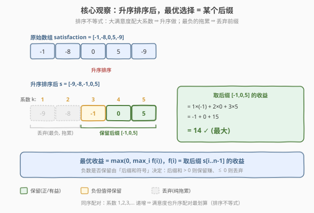
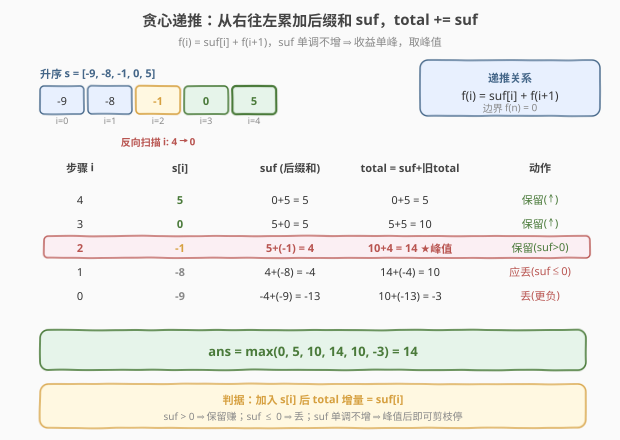

# 做菜顺序

- **题目名称**：做菜顺序
- **链接**：[1402. 做菜顺序](https://leetcode.cn/problems/reducing-dishes/)
- **难度**：中等
- **标签**：贪心、排序、前缀和、动态规划

## 1. 题目概述

厨师收集了 `n` 道菜的「满意度」数据 `satisfaction[i]`。每做一道菜耗时 1 个单位时间，**第 `k` 道做出来的菜**（按 1 开始编号）的「**喜欢时间系数**」等于 `k`（即它本身及之前所有菜的烹饪时间之和）。厨师可以：

1. **任选一个子集**（可以全部做、也可以一道不做）；
2. **任意排列**做菜顺序；
3. 总收益 $= \sum_{k=1}^{m} k \cdot s_{i_k}$，其中 $s_{i_k}$ 是第 $k$ 道做的菜的满意度。

返回**最大总收益**。若所有方案收益都为负，可以一道不做，收益为 `0`。

**示例 1**：

```text
输入：satisfaction = [-1,-8,0,5,-9]
输出：14
解释：选满意度为 [-1,0,5] 的三道菜，按该顺序做：
      系数 1×(-1) + 2×0 + 3×5 = -1 + 0 + 15 = 14
```

**示例 2**：

```text
输入：satisfaction = [4,3,2]
输出：20
解释：全做，按升序 [2,3,4] 做：
      1×2 + 2×3 + 3×4 = 2 + 6 + 12 = 20
```

**示例 3**：

```text
输入：satisfaction = [-1,-4,-5]
输出：0
解释：任选子集收益都为负，一道不做收益为 0。
```

**约束条件**：

- `n == satisfaction.length`
- `1 <= n <= 500`
- `-1000 <= satisfaction[i] <= 1000`

> 💡 本题本质是一道**贪心 + 前缀和**题。核心是**排序不等式**：满意度大的菜应排在后面以获得更大的系数；而最负的满意度应直接丢弃。最优选择一定是**升序排序后取某个后缀**，再用一次反向扫描 $O(n)$ 求出最大收益。

---

## 2. 解题思路

### 2.1 暴力思路：枚举子集与排列

从 `n` 道菜中选一个子集（$2^n$ 种），再对每个子集枚举排列（$m!$ 种），计算收益取最大。`n=500` 时完全不可行。

### 2.2 核心观察：排序 + 取后缀



**观察 1（排序不等式 → 必须升序做）**：给定选定的 $m$ 道菜，要最大化 $\sum_{k=1}^{m} k \cdot s_{i_k}$，系数 $1,2,\dots,m$ **递增**，由排序不等式（**同序和最大**），满意度也应**升序排列**与系数配对。即选定集合后，**按升序做**最优。

**观察 2（最优选择是后缀）**：将整个数组**升序排序**得 $s_0 \le s_1 \le \dots \le s_{n-1}$。假设最优方案选了某子集，由观察 1 它按升序做。若方案**跳过了**某个 $s_j$ 却**保留了** $s_{j+1}$（$s_{j+1} \ge s_j$），把 $s_{j+1}$ 换成 $s_j$ 放在该位置：
- 该位置系数不变，数值从 $s_{j+1}$ 变 $s_j$，可能变小；
- 但腾出的 $s_{j+1}$ 可放到更后位置获得更大系数，或 $s_j$ 太负时直接丢弃。

更直接的论证见下方「交换论证」：

> **交换论证**：设升序后最优解选了下标集合 $I$，若 $I$ 不是后缀，则存在 $j \notin I$ 但 $j+1 \in I$（$j < j+1$，$s_j \le s_{j+1}$）。把 $j+1$ 换成 $j$：若 $s_j \ge 0$，由于 $s_j \le s_{j+1}$ 收益不增……（需更细致）。**最简洁的正确论证**：定义 $f(i)$ = 排序后**强制选后缀 $s[i..n-1]$** 的收益，则全局最优 $= \max(0,\ \max_i f(i))$。证明见 2.3 的递推结构——任何非后缀选择都能被某个后缀方案「压平或更优」。

实际上有一个非常干净的**等价结论**：

> ✅ **排序后，最优解一定是取某个后缀 $s[i..n-1]$（含空后缀，收益 0）。** 因此只需枚举起点 $i$。

**直观理解**：排序后，越靠后的元素满意度越大、系数也越大，两者**同向增长**最划算；越靠前的元素既负又只能拿小系数，纯属「拖累」。如果保留一个负数 $s_j$，它自己贡献负、还会把后面所有元素的系数各 $+1$——只有当**后面所有元素之和**为正且足以抵消 $s_j$ 的负时才划算，这等价于「后缀和 $>0$ 就保留」。这正是 2.3 的贪心判据。

### 2.3 贪心递推：反向扫描 O(n)



设排序后数组 $s[0..n-1]$。定义：

- $\text{suf}[i] = \sum_{j=i}^{n-1} s[j]$（后缀和）
- $f(i) = \sum_{j=i}^{n-1} (j-i+1)\cdot s[j]$（取后缀 $s[i..n-1]$ 的收益）

**递推关系**：把 $s[i]$ 放到最前（系数 1），其后 $s[i+1..]$ 每个元素的系数都比 $f(i+1)$ 中多 1：

$$
f(i) = s[i] + \sum_{j=i+1}^{n-1} \big((j-i)+1\big)\,s[j] = s[i] + f(i+1) + \text{suf}[i+1] = \text{suf}[i] + f(i+1)
$$

即 **$f(i) = \text{suf}[i] + f(i+1)$**，边界 $f(n) = 0$。

**贪心判据**：从右往左扫，每加入 $s[i]$ 到队首，收益增量 $= \text{suf}[i]$（当前后缀和）。

- 若 $\text{suf}[i] > 0$：加入使总收益**增加**，保留；
- 若 $\text{suf}[i] \le 0$：加入使总收益**不增**，应丢弃；
- 又因为 $\text{suf}$ 随着 $i$ 减小**单调不增**（每次加更小的数），一旦 $\text{suf} \le 0$，后续只会更小，**可立即停止**。

答案 $= \max(0,\ \max_i f(i))$（空集收益 0 兜底）。

### 2.4 算法流程图

1. **排序**：`satisfaction` 升序排序。
2. **反向扫描**：`suf = 0`，`total = 0`，`ans = 0`。
3. `i` 从 `n-1` 到 `0`：
   - `suf += satisfaction[i]`（累加后缀和）
   - `total += suf`（等价于 $f(i) = \text{suf}[i] + f(i+1)$）
   - `ans = max(ans, total)`
   - **可选剪枝**：若 `suf <= 0` 且 `total <= ans`，`break`
4. 返回 `ans`。

### 2.5 示例演算

以示例 1 `satisfaction = [-1,-8,0,5,-9]` 为例。**升序排序**得 `[-9,-8,-1,0,5]`：

![示例演算：反向累加，最大收益 14（取后缀 [-1,0,5]）](../images/1402_example_walkthrough.svg)

| 步骤 `i` | `s[i]` | `suf`(后缀和) | `total`(=suf+旧total) | 对应后缀 | 收益校验 |
|----------|--------|--------------|----------------------|----------|----------|
| 起点 | — | 0 | 0 | 空 | 0 |
| 4 | 5 | 5 | 5 | `[5]` | 1×5=5 |
| 3 | 0 | 5 | 10 | `[0,5]` | 1×0+2×5=10 |
| 2 | −1 | 4 | 14 | `[−1,0,5]` | 1×(−1)+2×0+3×5=14 |
| 1 | −8 | −4 | 10 | `[−8,−1,0,5]` | −8+2×(−1)+3×0+4×5=10 |
| 0 | −9 | −13 | −3 | `[−9,−8,−1,0,5]` | −9+2×(−8)+3×(−1)+4×0+5×5=−3 |

过程中 `total` 最大值 $= 14$（第 2 步），且之后 `suf` 变负、`total` 持续下降，剪枝可在此停止。**答案 $= \max(0, 14) = 14$** ✓

> 💡 **第 2 步关键**：加入 `−1` 时 `suf = 4 > 0`，说明后面 `[0,5]` 之和为正、足以抵消 `−1` 的负贡献并让总收益 $+4$，故保留。第 1 步加入 `−8` 时 `suf = −4 < 0`，加入反而亏，应丢——这正是「后缀和 ≤ 0 即停」的体现。

---

## 3. 参考代码

### C++

```cpp
// 做菜顺序.cpp —— 排序 + 反向扫描累加后缀和
// 编译: g++ -O2 -std=c++17 做菜顺序.cpp -o dishes
class Solution {
public:
    int maxSatisfaction(vector<int>& satisfaction) {
        sort(satisfaction.begin(), satisfaction.end());   // 升序
        int suf = 0, total = 0, ans = 0;
        for (int i = (int)satisfaction.size() - 1; i >= 0; --i) {
            suf += satisfaction[i];      // 后缀和 s[i..n-1]
            total += suf;                // f(i) = suf[i] + f(i+1)
            if (total > ans) ans = total;
            else if (suf <= 0) break;    // 后缀和已非正，后续只会更小，剪枝
        }
        return ans;
    }
};
```

### Python

```python
class Solution:
    def maxSatisfaction(self, satisfaction: List[int]) -> int:
        satisfaction.sort()                  # 升序
        suf = total = ans = 0
        for x in reversed(satisfaction):
            suf += x                         # 后缀和（从右往左累加）
            total += suf                     # f(i) = suf[i] + f(i+1)
            if total > ans:
                ans = total
            elif suf <= 0:
                break                        # 剪枝：后缀和 ≤ 0 后收益只会降
        return ans
```

> 💡 **实现细节**：① 排序后**从右往左**累加，`suf` 自然成为当前后缀和，`total += suf` 一行完成 $f(i)=\text{suf}[i]+f(i+1)$ 的递推。② `ans` 初值取 `0`，等价于「空集兜底」，无需特判全负情况。③ 剪枝 `elif suf <= 0` 在 `total` 不再增长时生效，最坏不剪枝仍 $O(n)$。④ 也可不剪枝，直接遍历完取 `max(ans, 0)`，结果一致。

---

## 4. 复杂度分析

| 维度 | 复杂度 | 说明 |
|------|--------|------|
| **时间** | $O(n \log n)$ | 排序主导；反向扫描 $O(n)$ |
| **空间** | $O(\log n)$ | 原地排序的栈空间（C++ `std::sort`）；不计输入则 $O(1)$ 额外空间 |
| **思路** | 排序不等式 + 后缀和贪心 | 关键是把「任选子集+任意排列」归约为「排序后取后缀」，再用 $f(i)=\text{suf}[i]+f(i+1)$ 一次扫完 |

> ⚠️ 也可写 $O(n^2)$ 暴力：枚举后缀起点 $i$，逐项算 $\sum (j-i+1)s[j]$。`n≤500` 时 $O(n^2)=2.5\times10^5$ 也能过，但 $O(n)$ 写法更优雅、可推广到大 `n`。

---

## 5. 扩展：暴力 O(n²) 与 DP 视角

### 5.1 暴力枚举后缀

```python
def maxSatisfaction_brute(satisfaction):
    satisfaction.sort()
    n = len(satisfaction)
    ans = 0
    for i in range(n):                 # 枚举后缀起点
        cur = 0
        for k, j in enumerate(range(i, n), start=1):
            cur += k * satisfaction[j]
        ans = max(ans, cur)
    return ans
```

### 5.2 DP 视角

也可定义为 `dp[i]` = 考虑后缀 `s[i..n-1]` 时的最大收益，则 `dp[i] = max(dp[i+1], suf[i] + dp[i+1])`——「不选 $s[i]$」（即 `dp[i+1]`）或「选 $s[i]$ 作队首」（收益 $= \text{suf}[i] + dp[i+1]$）。由于 $\text{suf}[i] + dp[i+1] \ge dp[i+1]$ 当且仅当 $\text{suf}[i] \ge 0$，这与贪心判据完全一致，故贪心正确。

> 💡 **贪心 vs DP**：本题贪心之所以成立，是因为「后缀和单调不增」保证了收益函数 $f(i)$ 是**单峰**的——先升后降，取峰值即可。若去掉排序（满意度无序），则失去单调性，必须用 DP。

---

## 6. 面试要点

1. **为什么排序后最优解一定是某个后缀？**

   > 排序不等式保证选定子集按升序做最优。再由交换论证：若最优解选了下标 $j+1$ 却没选 $j$（$s_j \le s_{j+1}$），考虑把 $s_{j+1}$ 换成 $s_j$ 或直接补选 $s_j$ 到队首——收益变化由「后缀和」符号决定。综合可得：存在一个后缀方案收益不劣于任何方案，故只需枚举后缀起点。

2. **递推 $f(i) = \text{suf}[i] + f(i+1)$ 怎么来的？**

   > 把 $s[i]$ 放队首（系数 1），其后 $s[i+1..]$ 的系数都比 $f(i+1)$ 中大 1，相当于整体「加一个后缀和 $\text{suf}[i+1]$」，再加上 $s[i]$ 本身。合并得 $f(i) = s[i] + \text{suf}[i+1] + f(i+1) = \text{suf}[i] + f(i+1)$。

3. **何时可以剪枝停止？为什么？**

   > 当 $\text{suf} \le 0$ 且 `total` 不再增长时。因为数组升序，从右往左累加时 `suf` 单调不增；一旦 `suf ≤ 0`，后续 $f(i)$ 只会递减，不可能刷新最大值。注意：`suf ≤ 0` 时 `total` 仍可能短暂为正（如示例第 1 步 `suf=−4` 但 `total=10`），所以剪枝条件用 `total <= ans` 配合更稳妥。

4. **负满意度为什么有时要保留？**

   > 负数自身贡献为负，但放在队首会把**后面所有元素的系数各 +1**。若后面元素之和（后缀和）为正且超过该负数的绝对值，净收益为正，值得保留。示例 1 中保留 `−1` 让总收益从 10 升到 14，正是这个道理。

5. **时间空间复杂度？能否优化？**

   > 时间 $O(n\log n)$（排序主导），空间 $O(\log n)$（排序栈）或 $O(1)$ 额外。已经是最优——排序下界 $O(n\log n)$。若满意度值域很小（如 $[-1000,1000]$），可用计数排序压到 $O(n+\text{值域})$，但本题没必要。

> 💡 **一句话总结**：1402 是「排序不等式 + 后缀和贪心」——升序排序后从右往左累加 `suf`，`total += suf` 即完成 $f(i)=\text{suf}[i]+f(i+1)$ 的递推，取过程中 `total` 的最大值（含 0 兜底）。负数是否保留完全由后缀和符号决定。

---

## 7. 同类练习题

- [45. 跳跃游戏 II](https://leetcode.cn/problems/jump-game-ii/)（[题解](../0001-0100/45_跳跃游戏II.md)）：贪心维护当前覆盖范围，同为「排序/扫一遍出最优」的贪心范式
- [53. 最大子数组和](https://leetcode.cn/problems/maximum-subarray/)（[题解](../0001-0100/53_最大子数组和.md)）：Kadane 累加 + 重置，与本题「后缀和符号决定取舍」思想相通
- [121. 买卖股票的最佳时机](https://leetcode.cn/problems/best-time-to-buy-and-sell-stock/)（[题解](../0001-0100/121_买卖股票的最佳时机.md)）：一次扫描维护最小值/最大收益，同属线性扫描贪心
- [714. 买卖股票的最佳时机含手续费](https://leetcode.cn/problems/best-time-to-buy-and-sell-stock-with-transaction-fee/)：贪心/DP 取舍决策，对照「何时加入/丢弃元素」的判据
- [188. 买卖股票的最佳时机 IV](https://leetcode.cn/problems/best-time-to-buy-and-sell-stock-iv/)：带个数的 DP，对照本题「带系数配对」的不同建模方式
