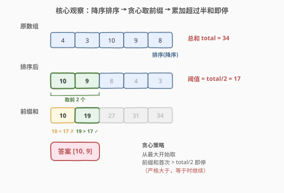
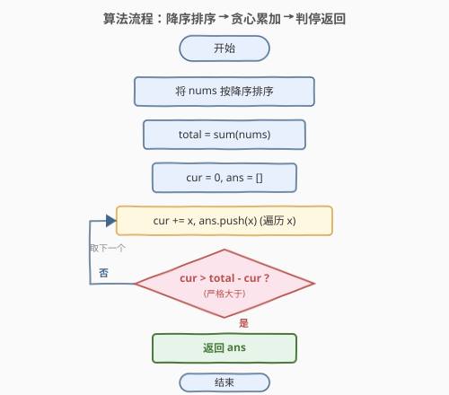
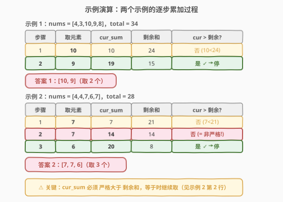

# 非递增顺序的最小子序列

- **题目名称**：非递增顺序的最小子序列
- **链接**：[1403. 非递增顺序的最小子序列](https://leetcode.cn/problems/minimum-subsequence-in-non-increasing-order/)
- **难度**：简单
- **标签**：贪心、数组、排序

## 1. 题目概述

给你一个数组 `nums`，请你从中抽取一个子序列，满足该子序列的元素之和**严格大于**未包含在该子序列中的各元素之和。

- 如果存在多个解决方案，只需返回**长度最小**的子序列；
- 如果仍然有多个解决方案，则返回**元素之和最大**的子序列。

题目数据保证满足所有约束条件的解决方案是**唯一**的。返回的答案应当按**非递增顺序**排列。

> 「子序列」不强调元素在原数组中的连续性，可以通过从数组中分离一些元素得到——这意味着我们可以**自由排序**后再选取，无需保持原始相对顺序。

**示例 1**：

```text
输入：nums = [4,3,10,9,8]
输出：[10,9]
解释：子序列 [10,9] 和 [10,8] 都是最小的、满足元素之和大于其他各元素之和的子序列。
     但 [10,9] 的元素之和最大。
```

**示例 2**：

```text
输入：nums = [4,4,7,6,7]
输出：[7,7,6]
解释：子序列 [7,7] 的和为 14，不严格大于剩下的其他元素之和（14 = 4+4+6）。
     因此 [7,7,6] 是满足题意的最小子序列。注意，元素按非递增顺序返回。
```

**约束条件**：

- $1 \le \text{nums.length} \le 500$
- $1 \le \text{nums}[i] \le 100$

> 💡 **关键点**：题目要求子序列和**严格大于**剩余和，即 $\text{cur\_sum} > \text{total} - \text{cur\_sum}$，等价于 $2 \cdot \text{cur\_sum} > \text{total}$。当 $\text{cur\_sum} = \text{total}/2$ 时**不算**满足条件（如示例 2 中 $[7,7]$ 和为 14 = 剩余 14），必须继续取。

---

## 2. 解题思路

### 2.1 暴力思路：枚举所有子序列

最直观的做法：枚举 `nums` 的所有 $2^n$ 个子序列，对每个子序列计算其元素和 `cur_sum`，若 $\text{cur\_sum} > \text{total} - \text{cur\_sum}$ 则记录其长度与和，最终在所有合法子序列中先取长度最小、再取和最大者。

- **指数级不可行**：$n = 500$ 时 $2^{500}$ 完全无法枚举；
- **未利用结构**：题目只关心「子和 vs 剩余和」的大小关系，与子序列的具体组合无关——先排序能消除「选哪些元素」的搜索空间。

> ⚠️ 暴力法的瓶颈在于「**无序枚举**」：在原始顺序下搜索子序列，每个位置有选/不选两分支。但题目允许子序列乱序（只要求输出非递增），排序后「取哪些」退化为「取前几个」——搜索空间从 $2^n$ 降到 $n$。

### 2.2 核心观察：降序排序 + 贪心取前缀



**关键洞察**：将数组**降序排序**后，问题变为——找到最小的 $k$，使前 $k$ 个元素之和 $> \text{total}/2$。贪心地从最大元素开始取，累加前缀和，一旦**严格超过**总和的一半就停止。

三步走：

1. **降序排序**：`sort(nums.begin(), nums.end(), greater<int>())`；
2. **贪心累加**：从左到右遍历，`cur += nums[i]`，将 `nums[i]` 加入答案；
3. **判停**：一旦 $\text{cur} > \text{total} - \text{cur}$（即 $2 \cdot \text{cur} > \text{total}$），立即停止。

> 以示例 1 为例：`nums = [4,3,10,9,8]`，`total = 34`，阈值 $= 17$。排序后 $[10, 9, 8, 4, 3]$，前缀和 $[10, 19, 27, 31, 34]$。第一个超过 17 的前缀和是 19（取 2 个元素），答案 $[10, 9]$。

> 以示例 2 为例：`nums = [4,4,7,6,7]`，`total = 28`，阈值 $= 14$。排序后 $[7, 7, 6, 4, 4]$，前缀和 $[7, 14, 20, 24, 28]$。注意 $14$ **不严格大于** 14，需继续取。第一个超过 14 的是 20（取 3 个元素），答案 $[7, 7, 6]$。

> 💡 **为什么贪心正确？** 三个要求的满足方式各不相同：
> - **长度最小**：要从尽可能少的元素达到 $\text{sum} > \text{total}/2$，就该取最大的元素——大元素「性价比」最高，一个顶几个。降序排列后取前缀天然是「用最少元素达到目标和」的最优策略。
> - **和最大**：在长度相同（都取 $k$ 个）的子序列中，取最大的 $k$ 个元素之和显然最大。降序排列后前 $k$ 个就是最大的 $k$ 个。
> - **非递增顺序**：降序排序后顺序取，答案天然是非递增的。
>
> 严格证明见第 5 节的交换论证。

### 2.3 算法流程图



整体只有一趟排序 + 一趟遍历，遍历在条件满足时提前终止。

### 2.4 示例演算

以两个示例分别演算：



**示例 1**（`nums = [4,3,10,9,8]`，`total = 34`）：

| 步骤 | 取元素 | $\text{cur\_sum}$ | 剩余和 $= 34 - \text{cur}$ | $\text{cur} > \text{剩余}$? |
|------|--------|-------------------|---------------------------|------------------------------|
| 1 | 10 | 10 | 24 | 否 |
| 2 | 9 | 19 | 15 | **是** ✓ → 停 |

取 2 个元素，答案 $[10, 9]$。

**示例 2**（`nums = [4,4,7,6,7]`，`total = 28`）：

| 步骤 | 取元素 | $\text{cur\_sum}$ | 剩余和 $= 28 - \text{cur}$ | $\text{cur} > \text{剩余}$? |
|------|--------|-------------------|---------------------------|------------------------------|
| 1 | 7 | 7 | 21 | 否 |
| 2 | 7 | 14 | 14 | 否（$=$，非严格大于） |
| 3 | 6 | 20 | 8 | **是** ✓ → 停 |

取 3 个元素，答案 $[7, 7, 6]$。

> ⚠️ 示例 2 的第 2 步是关键边界：$\text{cur} = 14 = \text{剩余}$，**不满足**严格大于，必须继续取第 3 个元素。若误用 $\geq$ 会得到错误答案 $[7, 7]$。

---

## 3. 参考代码

### C++

```cpp
class Solution {
public:
    vector<int> minSubsequence(vector<int>& nums) {
        sort(nums.begin(), nums.end(), greater<int>());
        int total = accumulate(nums.begin(), nums.end(), 0);
        int cur = 0;
        vector<int> ans;
        for (int x : nums) {
            cur += x;
            ans.push_back(x);
            if (cur > total - cur) break;  // 严格大于
        }
        return ans;
    }
};
```

### Python

```python
class Solution:
    def minSubsequence(self, nums: List[int]) -> List[int]:
        nums.sort(reverse=True)
        total = sum(nums)
        cur = 0
        ans = []
        for x in nums:
            cur += x
            ans.append(x)
            if cur > total - cur:   # 严格大于
                break
        return ans
```

> 💡 **实现要点**：① 排序用 `greater<int>()` / `reverse=True` 直接得到非递增序，答案无需再排序。② 判停条件 `cur > total - cur` 等价于 `2 * cur > total`，写前者更直观地对应题意「子和 > 剩余和」。③ `break` 后 `ans` 中已包含当前元素——因为取了 `x` 后 `cur` 才超过剩余，`x` 必须包含在答案中。

---

## 4. 复杂度分析

| 维度 | 贪心 + 排序（推荐） | 暴力枚举 |
|------|---------------------|----------|
| **时间复杂度** | $O(n \log n)$ | $O(2^n \cdot n)$ |
| **空间复杂度** | $O(\log n)$（排序栈） | $O(n)$（存子序列） |
| **实际运算量** | $n=500$ 时约 $500 \cdot 9 \approx 4500$ 次比较 | 不可行 |

- **排序主导**：时间瓶颈在降序排序 $O(n \log n)$；遍历累加 $O(n)$（最坏取全部 $n$ 个元素才超过半和），但 $n \le 500$ 时排序约 $500 \times 9 \approx 4500$ 次比较，毫秒级。
- **空间**：原地排序仅需 $O(\log n)$ 递归栈；答案数组不计入额外空间（输出要求）。

> 💡 **能否 $O(n)$？** 可以。由于 $\text{nums}[i] \le 100$ 且 $n \le 500$，值域 $[1, 100]$ 有常数上界，可用**计数排序**（101 长数组）将排序降到 $O(n + 100) = O(n)$。但 $n \le 500$ 极小，$O(n \log n)$ 已足够快，计数排序仅作理论优化。

---

## 5. 扩展：贪心最优性的交换论证

贪心策略「降序排列后取前缀直到和超过半和」为何同时满足「长度最小」和「和最大」？用交换论证分两步证明。

### 5.1 长度最小

设最优解 $S^*$ 的长度为 $k^*$，但 $S^*$ 中存在某个元素 $a$ **不**是前 $k^*$ 大的元素之一。令 $b$ 为前 $k^*$ 大但不在 $S^*$ 中的元素，则 $b > a$（因 $b$ 排名更靠前）。

将 $a$ 替换为 $b$：新和 $= \text{sum}(S^*) - a + b > \text{sum}(S^*) > \text{total}/2$，仍合法，长度不变。故存在一个「由前 $k^*$ 大元素构成」的最优解。而贪心取的恰是前 $k$ 大元素（$k$ 为最小使前缀和 $> \text{total}/2$ 的下标），故 $k \le k^*$；又因 $k^*$ 是最优（最小），$k \ge k^*$，故 $k = k^*$。

### 5.2 和最大

在所有长度为 $k^*$ 的子序列中，取前 $k^*$ 大元素之和显然最大——这是「从 $n$ 个数中取 $k$ 个使和最大」的平凡最优（取最大的 $k$ 个）。贪心取的恰是前 $k^*$ 大元素，故和最大。

> 💡 两个性质的核心都归结为「**取前 $k$ 大元素**」这一事实：长度最小要求「用最大的元素尽快达阈值」，和最大要求「固定长度下取最大的那些」。降序排序 + 前缀累加恰好同时满足二者。

---

## 6. 面试要点

1. **怎么想到贪心的？**

   > 题目要「最小长度」+「最大和」两个目标。最小长度意味着「用尽量少的大元素凑够阈值」——大元素性价比最高，优先取。这正是「**有限名额下最大化收益**」的贪心信号，与 [1338. 数组大小减半](../1301-1400/1338_数组大小减半.md) 中「频率大的优先选」同源。排序后取前缀是这一贪心直觉的直接实现。

2. **「严格大于」和「大于等于」有什么区别？**

   > 题目要求子序列和**严格大于**剩余和，即 $\text{cur} > \text{total} - \text{cur}$。当 $\text{cur} = \text{total}/2$ 时不算满足（如示例 2 取两个 7 后和为 14 = 剩余 14）。若误用 $\geq$，会提前停止得到错误答案。代码中写 `cur > total - cur` 而非 `cur >= total - cur`，差一个等号结果可能不同。

3. **为什么答案天然是非递增顺序？**

   > 因为我们先对数组做了降序排序，然后从左到右依次取元素。取出的子序列保持了降序排列，即非递增顺序，无需额外排序。题目要求非递增恰好与我们的排序方向一致——这是排序方向选择的一个考量。

4. **和 416. 分割等和子集 有什么区别？**

   > 416 判定能否将数组**等分**为两个和相等的子集（$\text{sum}/2$ 的 0-1 背包 DP），是「**能否**」问题；1403 要求找到一个子序列使其和**严格超过**剩余和，且长度最小、和最大，是「**构造**」问题。416 需要精确凑 $\text{total}/2$（需 DP），1403 只需超过 $\text{total}/2$（贪心即可）——「等分」比「超过」更严格，故 416 需 DP 而 1403 贪心足矣。

5. **如果 $n$ 很大（如 $10^6$）怎么办？**

   > 排序 $O(n \log n)$ 仍是主瓶颈。若值域有界（如 $\text{nums}[i] \le 100$），可用计数排序将排序降到 $O(n + V)$（$V$ 为值域大小），整体 $O(n)$。遍历累加仍为 $O(n)$。本题 $n \le 500$ 无需此优化，但面试中可主动提及。

> 💡 **一句话总结**：1403 的灵魂是「**降序排序 + 贪心取前缀，前缀和首次严格超过 total/2 即停**」。排序保证了长度最小（大元素优先）与和最大（取最大的 $k$ 个）两个目标同时达成，且答案天然非递增。判停条件务必用「严格大于」。

---

## 7. 同类练习题

- [1338. 数组大小减半](https://leetcode.cn/problems/reduce-array-size-to-the-half/)（[题解](../1301-1400/1338_数组大小减半.md)）：同为「排序 + 贪心累加到阈值即停」，但按频率排序、目标是删一半元素，对照 1403 的「按值排序、目标和超过半和」——同一贪心模板的不同应用
- [416. 分割等和子集](https://leetcode.cn/problems/partition-equal-subset-sum/)（[题解](../0401-0500/416_分割等和子集.md)）：将数组等分为两个和相等的子集（0-1 背包 DP），对照 1403 的「子和超过剩余」——「精确等分」需 DP、「超过」贪心即可，体会阈值严格性对方法选择的影响
- [1005. K 次取反后最大化的数组和](https://leetcode.cn/problems/maximize-sum-of-array-after-k-negations/)（[题解](../1001-1100/1005_K次取反后最大化的数组和.md)）：同为「排序 + 贪心」，但贪心策略是「按绝对值排序后翻负数为正」，对照 1403 的「降序取前缀」——排序方向与贪心下游的不同
- [881. 救生艇](https://leetcode.cn/problems/boats-to-save-people/)：同为「排序 + 贪心」，但用双指针（最重+最轻配对），对照 1403 的「单向前缀累加」——排序后贪心的两种典型模式
