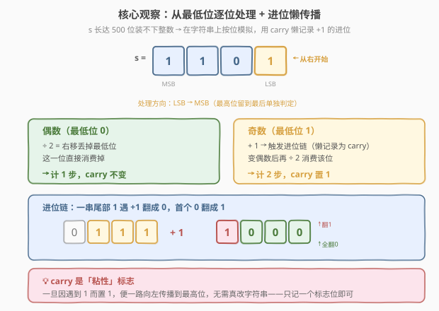
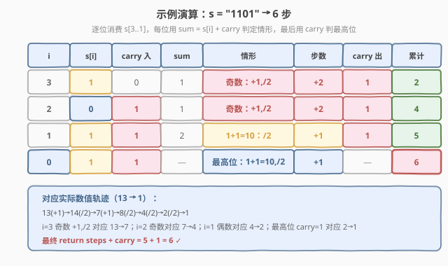

# 将二进制表示减到 1 的步骤数

- **题目名称**：将二进制表示减到 1 的步骤数
- **链接**：[1404. 将二进制表示减到 1 的步骤数](https://leetcode.cn/problems/number-of-steps-to-reduce-a-number-in-binary-representation-to-one/)
- **难度**：中等
- **标签**：字符串、位运算、模拟、贪心

## 1. 题目概述

给你一个以二进制形式表示的数字 `s`。返回按下述规则将其减少到 `1` 所需要的**步骤数**：

- 如果当前数字为**偶数**，则将其**除以 `2`**；
- 如果当前数字为**奇数**，则将其**加上 `1`**。

题目保证总是可以按上述规则将测试用例变为 `1`。

**示例 1**：

```text
输入：s = "1101"
输出：6
解释："1101" 表示十进制数 13。
Step 1) 13 是奇数，加 1 得到 14
Step 2) 14 是偶数，除 2 得到 7
Step 3) 7  是奇数，加 1 得到 8
Step 4) 8  是偶数，除 2 得到 4
Step 5) 4  是偶数，除 2 得到 2
Step 6) 2  是偶数，除 2 得到 1
```

**示例 2**：

```text
输入：s = "10"
输出：1
解释："10" 表示十进制数 2。
Step 1) 2 是偶数，除 2 得到 1
```

**示例 3**：

```text
输入：s = "1"
输出：0
```

**约束条件**：

- $1 \le \text{s.length} \le 500$
- `s` 由字符 `'0'` 或 `'1'` 组成。
- `s[0] == '1'`

> 💡 **关键点**：`s` 长度可达 500，意味着数值最大可达 $2^{500}$（约 $10^{150}$），远超 64 位甚至 128 位整数的表示范围。因此**不能在 C++ 中直接转成整数模拟**——必须回到「字符串 / 位」层面操作。这也正是本题区别于 [1342. 将数字变成 0 的操作步骤数](../1301-1400/1342_将数字变成0的操作步骤数.md)（数值装得下、有闭式解）的核心所在。

---

## 2. 解题思路

### 2.1 暴力思路：转整数直接模拟

最直观的做法：把 `s` 转成整数 `n`，然后按规则循环——偶数 `n /= 2`、奇数 `n += 1`，直到 `n == 1`，累计步数。

- **Python 可行**：`int` 任意精度，`int(s, 2)` 能装下 500 位二进制数。但每次算术运算作用于 $O(n)$ 位的整数需 $O(n)$ 时间，而总步数又是 $O(n)$ 量级，合计 $O(n^2)$。对 $n \le 500$ 能过，但并非最优。
- **C++ 不可行**：没有原生大整数类型，要写就得手撕大数加减，等于把本题做成了「大数运算」题，喧宾夺主。

> ⚠️ 暴力法的瓶颈在于「**把整个数当整体反复算术运算**」。破局思路是**不要维护数值本身，只盯最低位**：除以 2 等价于「右移丢掉最低位」，加 1 等价于「在最低位触发一条进位链」。一旦切换到「位视角」，就不再需要大整数，一个 `carry` 标志位即可记录所有进位信息。

### 2.2 核心观察：逐位处理 + 进位懒传播



把两条规则翻译成「位操作」语言：

| 规则 | 数值操作 | 位视角等价 |
|------|----------|------------|
| 偶数 | `n / 2` | 右移，**丢掉最低位**（这一位已被消费） |
| 奇数 | `n + 1`，再 `/ 2` | 最低位 `1` 加 `1` 触发**进位链**，变偶数后右移丢位 |

于是我们从**最低位（LSB）向最高位（MSB）逐位消费**，用一个 `carry`（0/1）**懒记录**当前是否有待向上传播的进位：

> 💡 **为什么叫「懒传播」？** 真要在字符串上执行 `+1`，得把一串尾部 `1` 逐个翻成 `0`、再把首个 `0` 翻成 `1`（如 `0111 + 1 = 1000`）。但其实我们**根本不需要改字符串**——只需记住「这里有一个进位待处理」，等处理下一位时把它叠到该位上即可。一个 `carry` 标志位就把整条进位链压缩成了 $O(1)$ 状态。

**关键洞察**：把判定条件建在「有效位」`sum = s[i] + carry` 上，分三种情形：

| `sum = s[i] + carry` | 有效最低位 | 奇偶 | 操作 | 步数 | 新 carry |
|----------------------|------------|------|------|------|----------|
| `0`（位 0，无进位） | 0 | 偶 | ÷2 丢位 | $+1$ | `0` |
| `1`（位 1 无进位，或 位 0 有进位） | 1 | 奇 | +1 再 ÷2 | $+2$ | `1` |
| `2`（位 1 且有进位，`1+1=10`） | 0 | 偶 | ÷2 丢位 | $+1$ | `1` |

> ⚠️ 注意 `sum == 1` 涵盖两种来源——「位 1 + 无进位」和「位 0 + 有进位」——它们的有效最低位都是 `1`（奇数），处理方式完全一致（+1 再 /2，产生新进位）。这正是「懒传播」的妙处：不管进位从哪来，叠到当前位后再按有效位判定即可。

> 💡 **carry 是「粘性」标志**：观察上表，`carry` 一旦因遇到 `1` 而置 `1`，后续无论位是 `0` 还是 `1`，新 carry 都仍是 `1`——它**一路向左传播到最高位，中途不会归零**。原因是：进位遇到 `1` 则 `1+1=10`（有效位 0，偶数，丢位，进位继续）；遇到 `0` 则 `0+1=1`（奇数，再 +1 又产生进位）。所以进位像波浪一样推到 MSB 才停。

### 2.3 算法流程图

![算法流程：sum = s[i] + carry 的三分支决策](../images/1404_algorithm_flow.svg)

**完整步骤**：

1. **初始化** `steps = 0, carry = 0`；
2. **逐位循环** `i` 从 `n-1`（LSB）到 `1`（跳过最高位 `i=0`）：
   - 计算 `sum = (s[i] - '0') + carry`；
   - `sum == 0`：偶数，`steps += 1`，`carry = 0`；
   - `sum == 1`：奇数，`steps += 2`，`carry = 1`；
   - `sum == 2`：`1+1=10` 有效位 0 偶数，`steps += 1`，`carry = 1`；
3. **处理最高位** `i=0`（其值必为 `'1'`）：若 `carry == 1`，则 `1+1=10`（=2），需再 ÷2 一次 → `steps += 1`；若 `carry == 0`，已是 `"1"`，无需操作；
4. **返回** `steps + carry`（`carry` 恰好是最高位那一步的增量）。

> 💡 **循环为何跳过最高位？** 题目目标是减到 `"1"`，而 `s[0] == '1'` 保证最高位本身就是 `1`。我们逐位消费的是「需要被除掉的低位」，最高位是终点而非过程——它只在最后由 `carry` 决定是否多做一次 ÷2。若 `carry == 1`，最高位 `1` 被进位顶成 `10`（=2），再 ÷2 回到 `1`；否则原封不动就是 `1`。

### 2.4 示例演算

以示例 1 的 `s = "1101"`（=13）为例，逐位演算：



| 步骤 | $i$ | $s[i]$ | carry 入 | $\text{sum}$ | 情形 | 步数 | carry 出 | 累计 |
|------|-----|--------|----------|--------------|------|------|----------|------|
| 1 | 3 | 1 | 0 | 1 | 奇数：+1,/2 | $+2$ | 1 | 2 |
| 2 | 2 | 0 | 1 | 1 | 奇数：+1,/2 | $+2$ | 1 | 4 |
| 3 | 1 | 1 | 1 | 2 | $1+1=10$：/2 | $+1$ | 1 | 5 |
| 4 | 0（最高位） | 1 | 1 | — | $1+1=10$，/2 | $+1$ | — | 6 |

对应数值轨迹：$13 \xrightarrow{+1} 14 \xrightarrow{/2} 7 \xrightarrow{+1} 8 \xrightarrow{/2} 4 \xrightarrow{/2} 2 \xrightarrow{/2} 1$，共 6 步 ✓。

> 💡 **对照「位处理」与「数值轨迹」**：第 1 步（$i=3$，奇数 +2 步）= 数值 $13 \to 7$；第 2 步（$i=2$，`0`+进位仍奇 +2 步）= $7 \to 4$；第 3 步（$i=1$，`1`+进位=`10` 偶 +1 步）= $4 \to 2$；第 4 步（最高位 carry=1 +1 步）= $2 \to 1$。可见「逐位」与「整体数值」的每一步都严格对应，只是位视角把进位链压缩成了标志位。

> 以示例 2 的 `s = "10"`（=2）为例：$i=1$，$s[1]=0$，carry=0，sum=0 → 偶数 +1 步，carry=0；最高位 carry=0 不加步。返回 $1+0=1$ ✓。示例 3 的 `s = "1"`：循环不执行（`n=1`，`i>0` 为假），返回 $0+0=0$ ✓。

---

## 3. 参考代码

### C++

```cpp
class Solution {
public:
    int numSteps(string s) {
        int steps = 0, carry = 0;
        for (int i = (int)s.size() - 1; i > 0; i--) {
            int sum = (s[i] - '0') + carry;
            if (sum == 0) {
                steps += 1;          // 偶数：÷2 丢位
            } else if (sum == 1) {
                steps += 2;          // 奇数：+1 再 ÷2
                carry = 1;
            } else {                 // sum == 2，1+1=10，有效位 0 偶数
                steps += 1;          // ÷2 丢位，进位继续传
            }
        }
        return steps + carry;        // 最高位 carry=1 时再 ÷2 一次
    }
};
```

### Python

```python
class Solution:
    def numSteps(self, s: str) -> int:
        steps = carry = 0
        for i in range(len(s) - 1, 0, -1):
            total = int(s[i]) + carry
            if total == 0:
                steps += 1
            elif total == 1:
                steps += 2
                carry = 1
            else:  # total == 2
                steps += 1
        return steps + carry
```

> 💡 **实现要点**：① 循环 `i` 从 `n-1` 到 `1`，**跳过最高位** `i=0`——它是终点 `1`，留到最后由 `carry` 判定。② 三分支按 `sum` 取值划分，与流程图一一对应，自解释。③ 末尾 `return steps + carry` 把「最高位是否多做一次 ÷2」折叠进返回值：`carry` 为 1 时 +1，为 0 时 +0，无需额外 `if`。

> 💡 **更紧凑的写法**：利用「carry 一旦置 1 就不再归零」的粘性，`sum==0` 时 carry 本就是 0、`sum==2` 时 carry 本就是 1，故 `else` 分支可省去对 carry 的赋值：
> ```cpp
> int numSteps(string s) {
>     int steps = 0, carry = 0;
>     for (int i = (int)s.size() - 1; i > 0; i--)
>         if (s[i] - '0' + carry == 1) { carry = 1; steps += 2; }
>         else steps += 1;
>     return steps + carry;
> }
> ```
> `else` 涵盖 `sum==0`（carry 保持 0）与 `sum==2`（carry 保持 1）两种偶数情形，步数都是 $+1$。面试建议先写三分支版讲清逻辑，再提此版作为「利用粘性化简」的收尾。

---

## 4. 复杂度分析

| 维度 | 位 + 进位模拟（推荐） $O(n)$ | Python 大整数模拟（第 5 节） $O(n^2)$ |
|------|------------------------------|----------------------------------------|
| **时间复杂度** | $O(n)$ | $O(n^2)$ |
| **空间复杂度** | $O(1)$ | $O(n)$（存大整数） |
| **是否依赖大整数** | 否（C++/Python 通用） | 是（需任意精度整数） |
| **常数** | 单趟扫描，每位 $O(1)$ | 每步对 $O(n)$ 位数运算，步数 $O(n)$ |

- **位 + 进位模拟**：单趟从 LSB 扫到 MSB，每位做 $O(1)$ 的整数加法与分支，合计 $O(n)$；只额外用 `steps`、`carry` 两个变量，空间 $O(1)$。是本题的最优解，且**不依赖任何大整数类型**，C++ 与 Python 同写法。
- **大整数模拟**：`int(s, 2)` 建 $O(n)$ 位整数需 $O(n)$，之后每步算术运算作用于 $O(n)$ 位数需 $O(n)$，总步数 $O(n)$，合计 $O(n^2)$。$n \le 500$ 时实测毫秒级通过，但理论复杂度劣于位模拟，且 C++ 无法直接使用。

> ⚠️ 本题 $n \le 500$，两种方法都能通过。面试中写出位 + 进位模拟版即可体现对「超大数不能转整数」这一关键约束的把握，大整数版仅作 Python 的对照补充。

---

## 5. 扩展：Python 大整数直接模拟

Python 的 `int` 任意精度，可直接 `int(s, 2)` 转数后按规则模拟，代码极简：

### Python

```python
class Solution:
    def numSteps(self, s: str) -> int:
        n = int(s, 2)
        steps = 0
        while n != 1:
            if n & 1:
                n += 1
            else:
                n >>= 1
            steps += 1
        return steps
```

> 💡 **位运算写法**：`n & 1` 判奇偶、`n >>= 1` 代替 `/ 2`、`n += 1` 处理奇数，语义与第 2 节「位视角」完全一致，只是作用在整体大整数上。`int(s, 2)` 直接解析二进制字符串，省去手写进制转换。

> ⚠️ **复杂度陷阱**：看似 `while` 循环 $O(n)$ 步、每步 $O(1)$，但 `n += 1` 与 `n >>= 1` 作用在 $O(n)$ 位的大整数上，单次操作实际是 $O(n)$。故总时间为 $O(n^2)$ 而非 $O(n)$——这与 [415. 字符串相加](../0401-0500/415_字符串相加.md) 中「大数加法按位模拟才 $O(n)$」是同一道理：**大整数的算术运算不是常数时间**。$n \le 500$ 时差异不显著，但理解这点能解释为何位 + 进位模拟才是「真 $O(n)$」。

| 写法 | 时间 | 空间 | 适用语言 | 联系 |
|------|------|------|----------|------|
| 位 + 进位模拟 | $O(n)$ | $O(1)$ | C++ / Python 通用 | 把大数 +1 的进位链压缩成 `carry` 标志位 |
| 大整数模拟 | $O(n^2)$ | $O(n)$ | 仅 Python（任意精度） | [67. 二进制求和](../0001-0100/67_二进制求和.md) 的大数加法同源 |

---

## 6. 面试要点

1. **为什么不能直接转成 `long long` 模拟？**

   > `s` 长度可达 500，数值最大 $2^{500} \approx 10^{150}$，远超 64 位（$\sim 1.8 \times 10^{19}$）与 128 位整数的范围。C++ 无原生大整数，直接转数会溢出。必须切到「位 / 字符串」视角，用 `carry` 标志位代替真实进位链，把每步操作降到 $O(1)$。

2. **「懒传播」的 carry 为什么能代表整条进位链？**

   > 真正的 `+1` 会把尾部一串 `1` 翻成 `0`、首个 `0` 翻成 `1`（如 `0111 + 1 = 1000`）。但我们**不改字符串**，只记一个 `carry = 1` 表示「有进位待处理」。处理下一位时把它叠到该位上，按 `sum = s[i] + carry` 重新判定——进位链的影响被「摊」到了后续每一位的判定里，无需一次性算完。一个标志位状态压缩了整条链。

3. **carry 为什么是「粘性」的——置 1 后不会归零？**

   > `carry = 1` 时：遇位 `1` 则 `1+1=10`，有效位 0（偶数），丢位后进位继续为 1；遇位 `0` 则 `0+1=1`（奇数），再 `+1` 又产生新进位 1。两种情形新 carry 都是 1，故进位一旦产生就一路推到最高位才停。这使得「最高位是否多做一次 ÷2」完全由最终的 `carry` 取值决定，即 `return steps + carry`。

4. **循环为什么到 `i > 0` 为止，最高位单独处理？**

   > 题目目标是减到 `"1"`，而 `s[0] == '1'` 保证最高位本就是 `1`——它是**终点**，不是被除掉的过程位。逐位循环消费的是需要 ÷2 丢掉的低位；最高位只在最后由 `carry` 决定：`carry = 1` 时 `1+1=10`（=2）需再 ÷2 一次回到 `1`，`carry = 0` 时原封不动即 `1`。

5. **本题与 [1342. 将数字变成 0 的操作步骤数](../1301-1400/1342_将数字变成0的操作步骤数.md) 的核心差异？**

   > 三点：① **奇数规则**——1342 是 `n - 1`（单调递减、无进位），1404 是 `n + 1`（产生进位链、非单调）；② **终点**——1342 减到 `0`，1404 减到 `1`；③ **数值规模**——1342 的 `num` 装得下 32 位整数，有闭式 $\text{popcount} + \text{bitlen} - 1$；1404 的 `s` 长达 500 位装不下，必须位级模拟，且因 `+1` 进位链无简单闭式。两者同名「数步数归约」却因奇数规则一字之差走向完全不同的解法。

> 💡 **一句话总结**：1404 的灵魂是「**用 carry 标志位懒记录 +1 的进位链**」——从 LSB 逐位消费，按 `sum = s[i] + carry` 三分支计步（偶数 +1 步、奇数 +2 步、`1+1=10` 偶数 +1 步），末尾 `return steps + carry` 收尾。$O(n)$ 时间、$O(1)$ 空间，且不依赖大整数类型，C++/Python 通用。

---

## 7. 同类练习题

- [1342. 将数字变成 0 的操作步骤数](https://leetcode.cn/problems/number-of-steps-to-reduce-a-number-to-zero/)（[题解](../1301-1400/1342_将数字变成0的操作步骤数.md)）：同胞兄弟题，奇数规则是 $-1$（无进位、单调递减、有闭式 $\text{popcount}+\text{bitlen}-1$），对照 1404 奇数 $+1$（有进位链、非单调、需位级模拟），一字之差决定能否闭式求解
- [397. 整数替换](https://leetcode.cn/problems/integer-replacement/)（[题解](../0301-0400/397_整数替换.md)）：奇数**可选** $-1$ 或 $+1$、求减到 1 的最少步数（记忆化/贪心），1404 是其「奇数固定 $+1$」的特例，对照「有选择 vs 无选择」如何改变最优策略
- [67. 二进制求和](https://leetcode.cn/problems/add-binary/)（[题解](../0001-0100/67_二进制求和.md)）：二进制大数加法的进位链处理，正是 1404 中「奇数 +1 触发进位」的母题，体会「进位链」在加法与归约两种场景下的复用
- [191. 位 1 的个数](https://leetcode.cn/problems/number-of-1-bits/)（[题解](../0001-0100/191_位1的个数.md)）：`n & (n-1)` 消最低位 1 的位运算基础，巩固「位视角」看奇偶与进位，是 1342 闭式与 1404 位模拟共同的位运算底座
