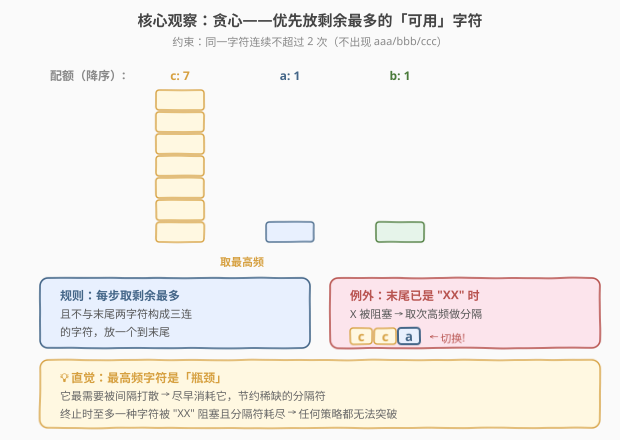
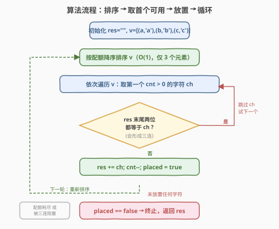
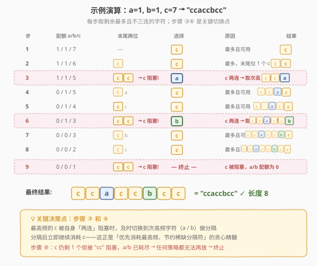

# 最长快乐字符串

- **题目名称**：最长快乐字符串
- **链接**：[1405. 最长快乐字符串](https://leetcode.cn/problems/longest-happy-string/)
- **难度**：中等
- **标签**：贪心、字符串、堆

## 1. 题目概述

只包含字母 `'a'`、`'b'`、`'c'` 的字符串称为**快乐字符串**，需满足：该字符串中**不包含** `aaa`、`bbb`、`ccc` 中的任意一个作为子串（即任意字符**连续出现不超过两次**）。

给定三个整数 $a$、$b$、$c$，返回**最长**的快乐字符串，其中 `'a'` 最多出现 $a$ 次、`'b'` 最多出现 $b$ 次、`'c'` 最多出现 $c$ 次。若有多个最长解，返回任意一个；若无正长度解，返回 `""`。

**示例 1**：

```text
输入：a = 1, b = 1, c = 7
输出："ccaccbcc"
解释：c 出现 6 次，a 和 b 各 1 次，总长 8。任何更长的串都会出现 "ccc"。
```

**示例 2**：

```text
输入：a = 2, b = 2, c = 1
输出："aabbc"
解释：每个字符最多 2 个，不可能出现三连，总长 5 = a+b+c 全部用完。
```

**示例 3**：

```text
输入：a = 7, b = 1, c = 0
输出："aabaa"
解释：只有 a 和 b，b 仅 1 个做分隔，最多放 4 个 a（两组 ×2），总长 5。
```

**约束条件**：

- $0 \le a, b, c \le 100$
- $a + b + c \ge 1$

> 💡 **核心约束翻译**：「不出现 `aaa`」等价于「每个字符连续出现**至多 2 次**」。于是问题变成：在三种字符各有配额的前提下，贪心地拼接，使总长最大且无三连。

---

## 2. 解题思路

### 2.1 暴力思路：回溯枚举

逐位回溯：每个位置尝试放 `'a'`/`'b'`/`'c'`，若不与末尾两位构成三连则递归。维护全局最优解。

问题在于：搜索树宽度恒为 3、深度最高 $a+b+c \le 300$，最坏分支数 $3^{300}$，完全不可行。且无法快速剪枝——很难判断「当前局面是否一定劣于已找到的最优」。

> 💡 暴力的核心痛点：没有利用**频率结构**。三种字符的配额决定了谁「最危险」——配额最多的字符最需要被均匀打散，而回溯盲目尝试浪费了这一信息。

### 2.2 核心观察：贪心——优先放剩余最多的可用字符



关键直觉与 [767. 重构字符串](../0701-0800/767_重构字符串.md) **一脉相承**，但约束从「不相邻」放宽到「不三连」：

| 题 | 约束 | 同字符最大连续 | 套路 |
|----|------|----------------|------|
| 767 | 任意两相邻不同 | 1 | 大根堆每次取两个最高频交替 |
| **1405** | **任意三连续不同** | **2** | **每次取最高频的「可用」字符放一个** |

**贪心策略**：每一步在三种字符中，选**剩余次数最多**且**不会形成三连**的那一个，放一个到末尾。

- **为什么选最多的？** 剩余最多的字符是「瓶颈」——它最需要被间隔打散。尽早消耗它，能避免末尾堆积成一串无法放置的三连。这就像 [767](../0701-0800/767_重构字符串.md) 中优先消耗高频字符的思路，只是 1405 允许连续放 2 个，不需要每次弹两个交替。

- **什么叫「可用」？** 若结果末尾已经是 `"XX"`（同一字符连续两次），则 `X` 此刻**不可用**——再放会形成 `"XXX"`。此时必须选一个不同的字符做「分隔」。若所有不同字符配额已耗尽，贪心终止。

> ⚠️ **关键区别于 767**：767 每次弹两个不同字符交替放置（保证不相邻）；1405 每次只放一个，允许连续 2 个相同，只在「末尾已两连」时才被迫切换。这使得 1405 可以用更简单的「排序 + 取第一个可用」实现，无需维护堆。

**贪心何时终止？** 两种情况：

1. **所有配额耗尽**——三种字符全部用完，显然最优。
2. **唯一剩余的字符被自身三连阻塞**——末尾已是 `"XX"`，而其他两种字符配额为 0。此时无论怎么排列都无法再多放一个 `X`，贪心已达最优。

> 💡 **为什么贪心是最优的？** 直觉证明：贪心终止时，至多一种字符 `X` 还有剩余，且被 `"XX"` 阻塞——即分隔符（其他字符）已耗尽。要再多放一个 `X`，需要额外一个分隔符，但分隔符已用完，任何策略都无法做到。而贪心每一步都优先消耗最充沛的字符、节约稀缺分隔符，保证了分隔符不会被「浪费」在不需要的地方。形式化证明可用交换论证：若最优解在某步放了次高频字符而贪心放了最高频，可将最优解中后续的一个最高频字符提前交换，不减少总长也不破坏合法性。

### 2.3 算法流程图



**完整步骤**：

1. 将 `(配额, 字符)` 三元组放入列表，初始化空结果串 `res`。
2. **每轮循环**：
   - 按**配额降序**排序三种字符；
   - 依次尝试，取第一个**配额 > 0** 且**不与 `res` 末尾两字符构成三连**的字符；
   - 找到 → 追加到 `res`，配额减 1，回到步骤 2；
   - 未找到（所有字符要么配额为 0、要么会三连）→ **终止**。
3. 返回 `res`。

> 💡 由于只有 3 个字符，每轮排序是 $O(1)$（常数次比较），循环最多执行 $a+b+c$ 次，总时间 $O(a+b+c)$。

### 2.4 示例演算

以示例 1 `a=1, b=1, c=7` 为例，逐步演算贪心决策：



| 步骤 | 配额 (a/b/c) | 末尾两字符 | 排序后（降序） | 选择 | 原因 | 结果 |
|------|-------------|-----------|---------------|------|------|------|
| 1 | 1/1/7 | — | c,a,b | c | 最多且可用 | `"c"` |
| 2 | 1/1/6 | `"c"` | c,a,b | c | 最多且末尾仅 1 个 c | `"cc"` |
| 3 | 1/1/5 | `"cc"` | c,a,b | **a** | c 被两连阻塞 → 取次高 a | `"cca"` |
| 4 | 0/1/5 | `"ca"` | c,b,a | c | 最多且可用 | `"ccac"` |
| 5 | 0/1/4 | `"ac"` | c,b,a | c | 最多且可用 | `"ccacc"` |
| 6 | 0/1/3 | `"cc"` | c,b,a | **b** | c 被两连阻塞 → 取次高 b | `"ccaccb"` |
| 7 | 0/0/3 | `"cb"` | c,b,a | c | 最多且可用 | `"ccaccbc"` |
| 8 | 0/0/2 | `"bc"` | c,b,a | c | 最多且可用 | `"ccaccbcc"` |
| 9 | 0/0/1 | `"cc"` | c,b,a | — | c 被阻塞，a/b 配额为 0 → **终止** | — |

最终 `"ccaccbcc"`，长度 8 ✓。步骤 3 和 6 是贪心的关键决策点：最高频的 c 被自身两连阻塞时，及时切换到次高频字符做分隔，随后继续消耗 c。

> 💡 **对比示例 3** `a=7, b=1, c=0`：只有 a 和 b，b 仅 1 个。贪心放 `aa` → 被阻塞 → 放 `b`（唯一分隔符）→ 放 `aa` → 被阻塞 → b 已耗尽 → 终止。结果 `"aabaa"`，用了 4 个 a + 1 个 b。7 个 a 中有 3 个「放不下」——因为 1 个分隔符最多支撑 2 组 × 2 = 4 个 a，这是任何策略的理论上限。

---

## 3. 参考代码

### C++

```cpp
class Solution {
public:
    string longestDiverseString(int a, int b, int c) {
        string res;
        vector<pair<int, char>> v = {{a, 'a'}, {b, 'b'}, {c, 'c'}};
        while (true) {
            // 按配额降序排序（仅 3 个元素，O(1)）
            sort(v.begin(), v.end(), [](const auto& x, const auto& y) {
                return x.first > y.first;
            });
            bool placed = false;
            for (auto& [cnt, ch] : v) {
                if (cnt == 0) break;          // 配额耗尽，后续更少，直接跳出
                int n = res.size();
                if (n >= 2 && res[n - 1] == ch && res[n - 2] == ch)
                    continue;                 // 末尾已两连，放它必三连 → 跳过
                res += ch;
                cnt--;
                placed = true;
                break;                        // 每轮只放一个
            }
            if (!placed) break;               // 无可用字符 → 终止
        }
        return res;
    }
};
```

### Python

```python
class Solution:
    def longestDiverseString(self, a: int, b: int, c: int) -> str:
        res = []
        cnt = {'a': a, 'b': b, 'c': c}
        while True:
            placed = False
            for ch in sorted(cnt, key=lambda x: -cnt[x]):
                if cnt[ch] == 0:
                    break                     # 配额耗尽，后续更少
                if len(res) >= 2 and res[-1] == ch and res[-2] == ch:
                    continue                  # 末尾已两连 → 跳过
                res.append(ch)
                cnt[ch] -= 1
                placed = True
                break                         # 每轮只放一个
            if not placed:
                break                         # 无可用字符 → 终止
        return ''.join(res)
```

> 💡 **实现要点**：① 每轮**只放一个字符**后立即 `break` 重新排序——因为放置后配额变化可能改变排序顺序（如 a 与 b 配额接近时，放一个就可能逆转）。② `sorted(cnt, key=...)` 每轮重新排序保证始终取当前最高频。③ 判断三连只需检查 `res` 末尾两个字符是否都等于 `ch`，$O(1)$ 完成。

> ⚠️ **常见错误**：若不每轮重新排序，而是固定顺序轮流放，会错失「优先消耗最高频」的核心优势。例如 `a=1, b=1, c=7` 时固定轮换 `a→b→c` 会过早消耗 a 和 b，导致后续大量 c 无法被间隔，总长远小于最优。

---

## 4. 复杂度分析

| 维度 | 复杂度 | 说明 |
|------|--------|------|
| 时间复杂度 | $O(a+b+c)$ | 循环最多执行 $a+b+c$ 次（每次放一个字符）；每轮排序 3 个元素为 $O(1)$，总体线性 |
| 空间复杂度 | $O(a+b+c)$ | 结果字符串长度上限为 $a+b+c$ |

> 💡 由于字符种类恒为 3，排序开销为常数。若将此题泛化为 $k$ 种字符（每种至多连续 $L$ 次），时间变为 $O(n \cdot k \log k)$，可用堆优化到 $O(n \log k)$——但本题 $k=3$，排序法最简洁。

---

## 5. 扩展：最大长度的闭式公式

贪心能构造具体串，但若只需**最大长度**（不需具体串），有闭式公式：

设 $S = a + b + c$，$M = \max(a, b, c)$，其余两种之和 $R = S - M$。

- **若 $M \le 2(R + 1)$**：最高频字符不会「溢出」，所有字符都能用完，最大长度 $= S$。
- **若 $M > 2(R + 1)$**：最高频字符被分隔符限制，最多放 $2(R+1)$ 个，最大长度 $= 2(R+1) + R = 3R + 2$。

$$
\text{maxLen} = \min\!\big(S,\; 2(R+1) + R\big) = \min\!\big(S,\; 3R + 2\big)
$$

**验证**：

| 输入 | $M$ | $R$ | $2(R+1)$ | $M \le 2(R+1)$? | 公式 | 实际 | ✓ |
|------|-----|-----|----------|-----------------|------|------|---|
| 1,1,7 | 7 | 2 | 6 | 否（7>6） | $3 \times 2 + 2 = 8$ | 8 | ✓ |
| 2,2,1 | 2 | 3 | 8 | 是 | $S = 5$ | 5 | ✓ |
| 7,1,0 | 7 | 1 | 4 | 否（7>4） | $3 \times 1 + 2 = 5$ | 5 | ✓ |

> 💡 **直觉**：$R$ 个分隔符可以把最高频字符分成 $R+1$ 组，每组至多 2 个，故最高频上限 $2(R+1)$。这与 [767](../0701-0800/767_重构字符串.md) 中「$n$ 个位置最多放 $\lceil n/2 \rceil$ 个相同字符且不相邻」是同一思想——767 每组至多 1 个（间隔 1），1405 每组至多 2 个（间隔 2）。

---

## 6. 面试要点

1. **为什么每轮只放一个字符就重新排序？**

   > 放置一个字符后配额发生变化，可能逆转排序顺序。例如 `a=3, b=3, c=0`：放 a 后 a=2、b=3，下一轮 b 变成最高频。若不重新排序而继续按旧顺序，会错过优先消耗最高频的机会，可能得到次优解。每轮重排保证始终优先消耗当前最充沛的字符。

2. **贪心何时终止？为什么终止时一定最优？**

   > 终止于「无可用字符」：所有配额为 0，或唯一有剩余的字符被末尾两连阻塞且分隔符耗尽。后一种情况下，要多放一个该字符必须额外消耗一个分隔符，但分隔符已用完——任何策略都无法突破。贪心每步优先消耗最充沛字符、节约稀缺分隔符，保证分隔符不浪费。

3. **和 767 重构字符串的联系与区别？**

   > 两者都是「按频率贪心安排字符位置」。767 约束是「不相邻」（同字符最大连续 1），用大根堆每次弹两个最高频交替放置；1405 约束是「不三连」（同字符最大连续 2），每轮只放一个最高频可用字符，被两连阻塞时切换。767 是 1405 在「连续上限 = 1」时的特例。

4. **为什么不用大根堆？**

   > 只有 3 种字符，每轮排序 3 个元素是 $O(1)$，与堆的 $O(\log 3)$ 无实质差异，而排序法代码更简洁。若泛化为 $k$ 种字符，堆的 $O(\log k)$ 优势才显现——此时用堆更合适。

5. **如何判断某个字符此刻「可用」？**

   > 检查结果串末尾两个字符：若 `res[-1] == res[-2] == ch`，则放 `ch` 会形成三连，不可用；否则可用。只需 $O(1)$ 比较末尾两位，无需扫描整个串。

---

## 7. 同类练习题

- [767. 重构字符串](https://leetcode.cn/problems/reorganize-string/)（[题解](../0701-0800/767_重构字符串.md)）：同属「按频率贪心安排字符」，约束为不相邻（最大连续 1），大根堆每次弹两个交替，1405 是其「最大连续 2」的泛化
- [621. 任务调度器](https://leetcode.cn/problems/task-scheduler/)（[题解](../0601-0700/621_任务调度器.md)）：同属「按频率贪心 + 间隔约束」，增加冷却期 $n$（相同任务间隔至少 $n$ 个槽），是 767/1405 系列的进一步泛化
- [358. K 距离间隔重排字符串](https://leetcode.cn/problems/rearrange-string-k-distance-apart/)（会员题）：要求相同字符间隔至少为 $k$，767 是 $k=2$ 的特例、1405 可看作 $k=1$（允许连续 2 个即间隔 0）
- [1054. 距离相等的条形码](https://leetcode.cn/problems/distant-barcodes/)：与 767 完全同构（不相邻），输入为数字数组，巩固「按频率贪心」模板
- [984. 不含 AAA 或 BBB 的字符串](https://leetcode.cn/problems/string-without-aaa-or-bbb/)：1405 的两种字符退化版（只有 a 和 b，不出现 aaa/bbb），贪心策略完全一致，适合作为 1405 的热身
