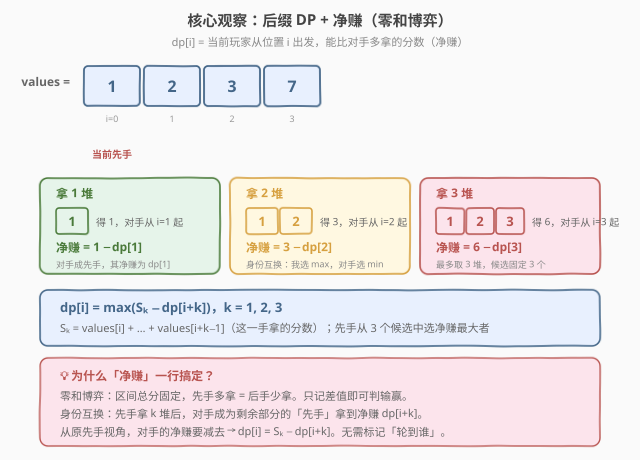
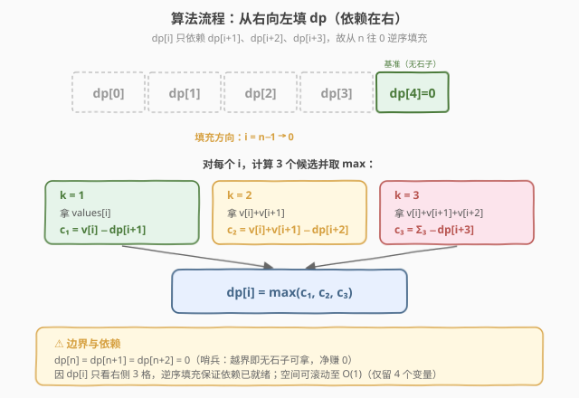

# 石子游戏 III

- **题目名称**：石子游戏 III
- **链接**：[1406. 石子游戏 III](https://leetcode.cn/problems/stone-game-iii/)
- **难度**：困难
- **标签**：数组、动态规划、博弈型 DP

## 1. 题目概述

`stoneValue` 是一排石子堆，每堆对应一个得分（**可为负**）。Alice 和 Bob 轮流取石子，**Alice 先手**，每次可拿走剩余石子中**最前面的 1、2 或 3 堆**。比赛持续到所有石子被拿完。每人最终得分为所拿每堆得分之和，初始均为 0。两人都采取**最优策略**。若 Alice 得分高返回 `"Alice"`，Bob 高返回 `"Bob"`，相同返回 `"Tie"`。

**示例 1**：

```text
输入：values = [1,2,3,7]
输出："Bob"
解释：Alice 总会输。她的最佳选择是拿走前三堆，得分 6；但 Bob 拿走末堆得 7，Bob 获胜。
```

**示例 2**：

```text
输入：values = [1,2,3,-9]
输出："Alice"
解释：Alice 要想获胜就必须第一回合拿走前三堆（得 6），给 Bob 留下负分 −9。
若 Alice 只拿第一堆（得 1），Bob 拿第二、三堆（得 5），Alice 只能拿到 −9，输。
若 Alice 拿前两堆（得 3），Bob 拿第三堆（得 3），Alice 只能拿到 −9，同样输。
两人都采取最优策略，故 Alice 选择拿前三堆获胜。
```

**示例 3**：

```text
输入：values = [1,2,3,6]
输出："Tie"
解释：Alice 无法赢。她选择前三堆可与 Bob 打平（6 vs 6），否则必输。
```

**约束条件**：

- $1 \le \text{stoneValue.length} \le 5 \times 10^4$
- $-1000 \le \text{stoneValue[i]} \le 1000$

> 💡 本题是 [1140. 石子游戏 II](../1101-1200/1140_石子游戏II.md) 的进一步演化：取法固定为「前 1/2/3 堆」，不再有动态参数 `M`，状态退化为**一维** `dp[i]`；同时 `stoneValue[i]` **可为负**，使贪心彻底失效、平局成为可能。核心仍是**零和博弈 DP + 净赚**，是 [877. 石子游戏](../0801-0900/877_石子游戏.md) 系列的最简洁一维形态。

---

## 2. 解题思路

### 2.1 暴力思路

每一步当前玩家可在「拿 1 / 2 / 3 堆」中三选一，选定后身份互换、对手在剩余部分继续先手。递归枚举所有分支，复杂度 $O(3^n)$，$n = 5 \times 10^4$ 必爆。同一「起始位置 `i`」会被反复求解——天然适合记忆化 DP。

### 2.2 核心观察：一维后缀 DP + 净赚（零和转化）



**状态定义**：

> `dp[i]` = 当前玩家从位置 `i` 出发（面对 `stoneValue[i..n-1]`）时，能比对手**多拿**的分数（净赚）。

> 💡 **为什么记「净赚」而非两人各自得分？** 博弈是**零和**的：从位置 `i` 到末尾的总分固定，先手多拿多少，后手就少拿多少。只关心「差值」即可判输赢，且每次递归**身份互换**——当前玩家拿完后，对手成为剩余部分的先手，递归值 `dp[i+k]` 即对手的净赚，无需额外标记「轮到谁」。

对位置 `i`，先手只有三种拿法（拿前 `k` 堆，$k = 1, 2, 3$）：

- 拿 `k` 堆立即获得 $S_k = \text{stoneValue}[i] + \cdots + \text{stoneValue}[i+k-1]$；
- 剩余 `stoneValue[i+k..]` 交给对手先手，对手净赚 `dp[i+k]`；
- 从原先手视角，对手的净赚要**减去**，故先手净赚 $= S_k - \text{dp}[i+k]$。

先手从三个候选中选最大：

$$
\text{dp}[i] = \max_{k \in \{1,2,3\}}\bigl(S_k - \text{dp}[i+k]\bigr)
$$

**边界**：$\text{dp}[n] = 0$（无石子可拿，净赚 0）。为避免越界特判，设 $\text{dp}[n] = \text{dp}[n+1] = \text{dp}[n+2] = 0$ 作哨兵。

> ⚠️ **减号的含义**：先手这一手拿了 $S_k$，但随后对手在剩余区间里成为「先手」并拿到净赚 `dp[i+k]`；从先手视角这部分是**对手的**收益，要扣除。这正是 Minimax「我选最大、对手选最小对我」的紧凑表达——与 877 中 `piles[i] − dp[i+1][j]`、1140 中 `suffix[i] − dp[i+X][M']` 完全同源，只是本题取法固定为 3 个、状态退化为一维。

### 2.3 算法流程图



`dp[i]` 只依赖**右侧三个**值 `dp[i+1]`、`dp[i+2]`、`dp[i+3]`，故按 `i` 从 `n−1` 递减到 `0` 填充即可保证依赖就绪。

**完整步骤**：

1. **建哨兵** `dp[n] = dp[n+1] = dp[n+2] = 0`；
2. **逆序填充** `i` 从 `n−1` 到 `0`：
   - 累计 `take = 0`，枚举 $k = 1, 2, 3$（且 `i+k−1 < n`）：
     - `take += stoneValue[i+k−1]`（即 $S_k$）；
     - 候选 `c_k = take − dp[i+k]`，记录最大值 `best`；
   - `dp[i] = best`；
3. **判定** `dp[0]`（Alice 先手净赚）：`> 0` → `"Alice"`，`< 0` → `"Bob"`，`== 0` → `"Tie"`。

> 💡 **为何不用前缀/后缀和？** 1140 需要 `suffix[i]` 是因为 $X$ 范围可达 $2M$（最多 $n$ 堆），逐堆累加会退化到 $O(n)$ 转移。本题 $k \le 3$，**内联累计** `take` 即可在 $O(1)$ 内得到 $S_k$，无需预处理前缀和，代码更简洁。

### 2.4 示例演算

以示例 1 的 `values = [1,2,3,7]` 为例，从右向左填 `dp`（`n = 4`，哨兵 `dp[4] = 0`）：

![示例演算：values = [1, 2, 3, 7]](../images/stonegame3_dp_table.svg)

| $i$ | $c_1 = S_1 - \text{dp}[i+1]$ | $c_2 = S_2 - \text{dp}[i+2]$ | $c_3 = S_3 - \text{dp}[i+3]$ | $\text{dp}[i]$ |
|-----|------------------------------|------------------------------|------------------------------|----------------|
| 4 | — | — | — | 0（基准） |
| 3 | $7 - 0 = 7$ | （仅剩 1 堆） | — | 7 |
| 2 | $3 - 7 = -4$ | $(3+7) - 0 = 10$ | — | 10 |
| 1 | $2 - 10 = -8$ | $(2+3) - 7 = -2$ | $(2+3+7) - 0 = 12$ | 12 |
| 0 | $1 - 12 = -11$ | $(1+2) - 10 = -7$ | $(1+2+3) - 7 = -1$ | **−1** |

`dp[0] = −1 < 0` → `"Bob"` ✓。Alice 三个候选全为负——拿 3 堆得 6 但 Bob 拿 7，净亏 1，已是最佳。

> 💡 **对照示例 2** `values = [1,2,3,−9]`：`dp[3]=−9`，`dp[2]=12`（拿 3 留 −9 给对手 → $3−(−9)=12$），`dp[1]=14`，`dp[0]=15`（$c_3 = (1+2+3)−(−9) = 15$）→ `"Alice"`。Alice 主动拿走前 3 堆正分、把负堆甩给 Bob，正是「负值」让博弈出现「宁可少拿也要甩锅」的反直觉最优。

---

## 3. 参考代码

### C++

```cpp
class Solution {
public:
    string stoneGameIII(vector<int>& stoneValue) {
        int n = stoneValue.size();
        vector<int> dp(n + 1, 0);               // dp[n]=0 哨兵；循环条件 i+k-1<n 保证 i+k≤n 不越界
        for (int i = n - 1; i >= 0; i--) {
            int best = INT_MIN, take = 0;
            for (int k = 1; k <= 3 && i + k - 1 < n; k++) {
                take += stoneValue[i + k - 1];  // S_k 内联累计
                best = max(best, take - dp[i + k]);
            }
            dp[i] = best;
        }
        if (dp[0] > 0) return "Alice";
        if (dp[0] < 0) return "Bob";
        return "Tie";
    }
};
```

### Python

```python
class Solution:
    def stoneGameIII(self, stoneValue: List[int]) -> str:
        n = len(stoneValue)
        dp = [0] * (n + 1)                      # dp[n]=0 哨兵
        for i in range(n - 1, -1, -1):
            best = float('-inf')
            take = 0
            for k in range(1, 4):
                if i + k - 1 >= n:
                    break
                take += stoneValue[i + k - 1]  # S_k 内联累计
                best = max(best, take - dp[i + k])
            dp[i] = best
        if dp[0] > 0:
            return "Alice"
        if dp[0] < 0:
            return "Bob"
        return "Tie"
```

> 💡 **实现要点**：① `dp` 数组开 `n+1`，`dp[n]=0` 作哨兵；访问 `dp[i+k]` 当 `i+k` 超过 `n` 时只需保证取到 0——C++ 中 `dp` 大小为 `n+1`，`i+k` 最大为 `n+2`，故 `k=2,3` 越界时要靠外层 `i+k-1 < n` 的条件拦截（保证只枚举合法的 `k`）。② `take` 内联累计 $S_k$，避免预处理前缀和。③ 末尾三分支判定，与示例演算表一一对应。

> 💡 **更紧凑的 Python 记忆化写法**：用 `@cache` 自顶向下，语义与转移方程完全同形，适合面试时先讲思路再落代码：
> ```python
> from functools import cache
> class Solution:
>     def stoneGameIII(self, stoneValue: List[int]) -> str:
>         @cache
>         def dp(i: int) -> int:
>             best = float('-inf')
>             take = 0
>             for k in range(1, 4):
>                 if i + k > len(stoneValue):
>                     break
>                 take += stoneValue[i + k - 1]
>                 best = max(best, take - dp(i + k))
>             return best if best != float('-inf') else 0
>         ans = dp(0)
>         return "Alice" if ans > 0 else "Bob" if ans < 0 else "Tie"
> ```

---

## 4. 复杂度分析

| 维度 | 复杂度 | 说明 |
|------|--------|------|
| 时间复杂度 | $O(n)$ | 每个位置 `i` 做 $O(1)$（固定 3 个候选，内联累计），共 $n$ 个状态 |
| 空间复杂度 | $O(n)$ | `dp` 数组长度 $n+1$；滚动可优化至 $O(1)$（见第 5 节） |

> ⚠️ 本题 $n \le 5 \times 10^4$，$O(n)$ 时间、$O(n)$ 空间均远在限制内。对比 [1140. 石子游戏 II](../1101-1200/1140_石子游戏II.md) 的 $O(n^3)$ 时间、$O(n^2)$ 空间——本题因取法固定为 3、无动态参数 `M`，复杂度大幅降阶，是石子游戏系列中「最轻量」的一维形态。

---

## 5. 扩展：O(1) 空间滚动

`dp[i]` 只依赖右侧 3 格 `dp[i+1]`、`dp[i+2]`、`dp[i+3]`，可用**大小为 4 的循环数组**滚动，空间降到 $O(1)$：

### C++

```cpp
class Solution {
public:
    string stoneGameIII(vector<int>& stoneValue) {
        int n = stoneValue.size();
        int dp[4] = {0, 0, 0, 0};               // dp[i%4]，初值全 0 充当哨兵
        for (int i = n - 1; i >= 0; i--) {
            int best = INT_MIN, take = 0;
            for (int k = 1; k <= 3 && i + k - 1 < n; k++) {
                take += stoneValue[i + k - 1];
                best = max(best, take - dp[(i + k) % 4]);
            }
            dp[i % 4] = best;
        }
        int ans = dp[0];                        // i=0 → dp[0%4]=dp[0]
        if (ans > 0) return "Alice";
        if (ans < 0) return "Bob";
        return "Tie";
    }
};
```

> 💡 **滚动原理**：`dp[i % 4]` 复用同一格存储。读 `dp[(i+k) % 4]` 时，因 `i+k > i`，对应位置要么是已写入的更靠右状态，要么是未触碰的初值 0（哨兵）——两者都正确。$n \le 5 \times 10^4$ 时 $O(n)$ 数组本就无压力，此版仅作「空间极限优化」的展示，面试中提出即可加分。

| 写法 | 时间 | 空间 | 说明 |
|------|------|------|------|
| 一维数组 | $O(n)$ | $O(n)$ | 主解，清晰直观 |
| 循环数组滚动 | $O(n)$ | $O(1)$ | 仅用 4 个变量，依赖窗口宽度为 3 |

---

## 6. 面试要点

1. **为什么 `dp` 定义为「净赚」而非两人各自得分？**

   > 博弈是零和的：从位置 `i` 到末尾的总分固定，先手多拿的即后手少拿的。用「差值」一维量即可刻画状态，转移只需一个 `max`，比维护 `(我的分, 对手分)` 二元组更简洁，也天然消除「当前轮到谁」的额外维度——每次递归身份互换，`dp[i+k]` 直接是对手作为先手的净赚。

2. **状态为什么是一维 `dp[i]`，而 877 是二维、1140 也是二维？**

   > 取法决定状态维度。877 可取**左或右端**，需用区间 `[i, j]` 两端才能确定剩余 → 二维；1140 从左端取 `X` 堆但 `X` 上界 `2M` 随取法增长，需记 `(i, M)` → 二维；本题取法固定为「前 1/2/3 堆」，剩余部分完全由起始位置 `i` 决定，无额外参数 → 一维。取法越受限、状态越简洁。

3. **为什么不能贪心——每次拿得分最多的？**

   > 两个原因：① **负值**让「多拿」未必赚——`values = [1,2,3,-9]` 中拿 3 堆得 6 但把 −9 甩给对手才是最优，贪心可能错选；② **博弈联动**——这一手拿得多，剩余格局对对手更有利或更不利，必须枚举 3 个候选取 `max` 才能刻画「我选最大、对手选最小对我」。877 全正且奇数总和可被数学结论秒杀，但本题有负值，数学结论失效，必须 DP。

4. **哨兵 `dp[n] = dp[n+1] = dp[n+2] = 0` 的作用？**

   > 当 `i` 靠近末尾时，`k = 2` 或 `3` 可能越过 `n`（如 `i = n−1` 时只有 `k = 1` 合法）。设越界位置 `dp` 值为 0，含义是「无石子可拿，对手净赚 0」，使转移方程 `S_k − dp[i+k]` 无需特判越界。代码中靠 `i+k−1 < n` 拦截非法 `k`，剩余合法 `k` 的 `dp[i+k]` 自然落在哨兵或已填区。

5. **本题与 [877. 石子游戏](../0801-0900/877_石子游戏.md) / [1140. 石子游戏 II](../1101-1200/1140_石子游戏II.md) 的核心差异？**

   > 三点：① **取法**——877 取左/右端单堆，1140 取左端 `X∈[1,2M]` 堆，本题取左端 1/2/3 堆。② **状态维度**——877 区间 `[i,j]`（二维），1140 `(i,M)`（二维），本题 `(i,)`（一维）。③ **数值符号**——877 全正且奇数总和（先手必胜、无平局），1140 全正，本题**允许负值**（贪心失效、平局可能）。三者共享「零和 + 净赚 + 身份互换」的内核，差别在取法如何决定状态空间与转移代价。

> 💡 **一句话总结**：1406 的灵魂是「**一维后缀 DP + 净赚**」——`dp[i] = max(Sₖ − dp[i+k])`（$k=1,2,3$），从右向左逆序填充，`dp[0]` 的符号直接判定 Alice/Bob/Tie。负值是本题区别于 877/1140 的关键，让「主动拿负堆甩锅」成为合法最优，贪心彻底失效，必须枚举 3 候选取 max。

---

## 7. 同类练习题

- [877. 石子游戏](https://leetcode.cn/problems/stone-game/)（[题解](../0801-0900/877_石子游戏.md)）：博弈型区间 DP 母模板，取两端单堆，全正且奇数总和可数学秒杀，对比本题一维后缀 DP + 负值的差异
- [1140. 石子游戏 II](https://leetcode.cn/problems/stone-game-ii/)（[题解](../1101-1200/1140_石子游戏II.md)）：从左端取 `X∈[1,2M]` 堆，状态 `(i, M)` 二维、需后缀和，对比本题取法固定为 3、状态退化为一维
- [486. 预测赢家](https://leetcode.cn/problems/predict-the-winner/)：877 的无特殊约束版（奇数长度、允许平局），同一套区间 DP 框架，判定改为 `>= 0`
- [1690. 石子游戏 VII](https://leetcode.cn/problems/stone-game-vii/)：拿走一堆后得分由「区间剩余和」决定，转移用 `min` 而非 `max`（对手让你拿得少），仍是博弈型区间 DP
- [1563. 石子游戏 V](https://leetcode.cn/problems/stone-game-v/)：取连续子数组后按较小半段得分，区间 DP + 前缀和，状态切分更复杂
