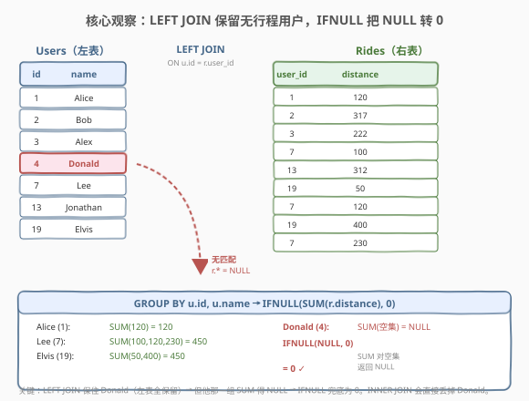
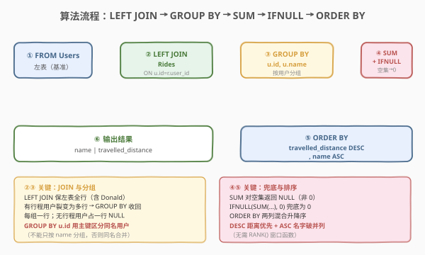
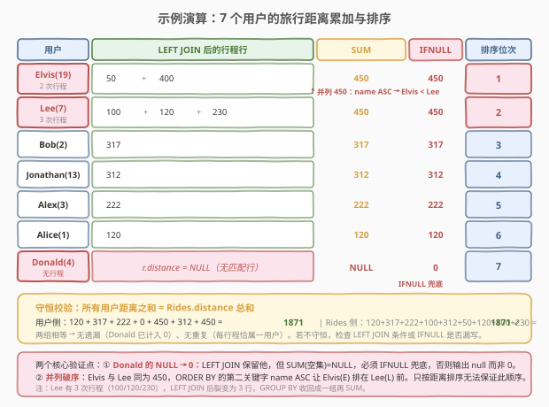

# 排名靠前的旅行者

- **题目名称**：排名靠前的旅行者
- **链接**：[1407. 排名靠前的旅行者](https://leetcode.cn/problems/top-travellers/)
- **难度**：简单
- **标签**：数据库、SQL、LEFT JOIN、GROUP BY、SUM、IFNULL/COALESCE、ORDER BY、聚合

## 1. 题目概述

给定 `Users` 表与 `Rides` 表。`Users` 每行记录一个用户（`id`、`name`）；`Rides` 每行记录一次行程（`id`、`user_id`、`distance`）。请编写 SQL，报告**每个用户的旅行距离**（即该用户所有行程的 `distance` 之和），并按 `travelled_distance` **降序**排列；若距离相同，再按 `name` **升序**排列。

> ⚠️ 关键陷阱：**没有行程的用户也要出现在结果里**，且其旅行距离为 `0`（而非被过滤掉）。这决定了必须用 `LEFT JOIN` 而非 `INNER JOIN`——否则「零行程用户」会被丢弃。同时 `SUM` 对空集返回 `NULL`，需要 `IFNULL`/`COALESCE` 把它转成 `0`。

**表结构**：

```text
Table: Users
+---------------+---------+
| Column Name   | Type    |
+---------------+---------+
| id            | int     |  ← 主键
| name          | varchar |  ← 用户名
+---------------+---------+

Table: Rides
+---------------+---------+
| Column Name   | Type    |
+---------------+---------+
| id            | int     |  ← 主键
| user_id       | int     |  ← 外键 → Users.id
| distance      | int     |  ← 本次行程距离
+---------------+---------+
```

- `Users.id` 是该表主键（唯一）。
- `Rides.id` 是该表主键；`user_id` 指向发起行程的用户，`distance` 为该次行程距离。
- 一个用户可有**多次行程**，需把所有行程距离累加。

**示例 1**：

```text
输入：
Users 表：
+------+-----------+
| id   | name      |
+------+-----------+
| 1    | Alice     |
| 2    | Bob       |
| 3    | Alex      |
| 4    | Donald    |
| 7    | Lee       |
| 13   | Jonathan  |
| 19   | Elvis     |
+------+-----------+
Rides 表：
+------+----------+----------+
| id   | user_id  | distance |
+------+----------+----------+
| 1    | 1        | 120      |
| 2    | 2        | 317      |
| 3    | 3        | 222      |
| 4    | 7        | 100      |
| 5    | 13       | 312      |
| 6    | 19       | 50       |
| 7    | 7        | 120      |
| 8    | 19       | 400      |
| 9    | 7        | 230      |
+------+----------+----------+

输出：
+----------+--------------------+
| name     | travelled_distance |
+----------+--------------------+
| Elvis    | 450                |
| Lee      | 450                |
| Bob      | 317                |
| Jonathan | 312                |
| Alex     | 222                |
| Alice    | 120                |
| Donald   | 0                  |
+----------+--------------------+
```

**解释**：

| 用户 | 行程明细 | 累加 | travelled_distance |
|------|---------|------|-------------------|
| Elvis | 50 + 400 | 450 | 450 |
| Lee | 100 + 120 + 230 | 450 | 450 |
| Bob | 317 | 317 | 317 |
| Jonathan | 312 | 312 | 312 |
| Alex | 222 | 222 | 222 |
| Alice | 120 | 120 | 120 |
| Donald | （无行程） | — | 0 |

> 💡 Elvis 与 Lee 都旅行了 450 英里，并列第一。题目要求距离相同时按 `name` **升序**排，`Elvis` 字典序小于 `Lee`，故 Elvis 排在前。Donald 没有任何行程，仍需出现在结果中且距离为 `0`——这是本题的两个核心考点：`LEFT JOIN` 保留无行程用户、`IFNULL` 把 `NULL` 转 `0`。

**约束条件**：

- `Rides.user_id` 是 `Users.id` 的外键。
- 结果列：`name`、`travelled_distance`。
- 排序：`travelled_distance` 降序，`name` 升序。

---

## 2. 解题思路

### 2.1 暴力思路：INNER JOIN + 事后补零

最直觉的做法：用 `INNER JOIN` 把 `Users` 和 `Rides` 连起来，按用户分组求和，再排序。

```sql
SELECT u.name, SUM(r.distance) AS travelled_distance
FROM Users u
JOIN Rides r ON u.id = r.user_id
GROUP BY u.id, u.name
ORDER BY travelled_distance DESC, u.name;
```

- **两个致命问题**：
  1. **Donald 被丢了**：`INNER JOIN` 只保留两表都匹配的行，Donald（`id=4`）在 `Rides` 中无任何记录，连接后直接消失，结果里看不到他——违反「每个用户都要报告」。
  2. **即便补上 Donald，他的 `SUM` 是 `NULL`**：如果改用 `LEFT JOIN`，Donald 那组的 `r.distance` 全是 `NULL`，`SUM(NULL)` 结果是 `NULL` 而非 `0`，与题意「距离为 0」不符。

> ⚠️ **`SUM` 对空集返回 `NULL`**。这是 SQL 标准行为：`SUM` / `MAX` / `MIN` / `AVG` 对空集都返回 `NULL`，只有 `COUNT(*)` 返回 `0`。因此「无行程用户」的 `SUM(distance)` 是 `NULL`，必须用 `IFNULL`（MySQL）/ `COALESCE`（标准）兜底为 `0`。

### 2.2 核心观察：LEFT JOIN 保留无匹配行 + IFNULL 兜底空集



**关键洞察**：本题的难点不在「累加」（`GROUP BY + SUM` 是常规操作），而在两个边界处理：

1. **保留无行程用户**：用 `LEFT JOIN` 而非 `INNER JOIN`。`LEFT JOIN` 保证左表（`Users`）的每一行都出现在结果中，即使右表（`Rides`）无匹配——Donald 因此被保留，只是他那一行的 `r.distance` 全为 `NULL`。

2. **空集 SUM 兜底**：Donald 那组的 `SUM(distance)` 是 `NULL`（对空集求和），需用 `IFNULL(SUM(r.distance), 0)` 或 `COALESCE(SUM(r.distance), 0)` 转成 `0`。

> 💡 **`LEFT JOIN` 的本质**：它是一种「保左连接」——左表行无条件保留，右表无匹配时填 `NULL`。可理解为「以左表为基准，去右表里找补充信息，找不到就用 `NULL` 占位」。本题以 `Users` 为基准，`Rides` 是补充信息；Donald 在 `Rides` 里找不到补充，得到 `NULL`，再被 `IFNULL` 转成 `0`。

**排序的兜底**：题目要求距离相同按 `name` 升序。`ORDER BY travelled_distance DESC, name ASC` 直接用两列排序即可——**无需 `RANK()` 窗口函数**。`ORDER BY` 天然支持多列、混合升降序，是 SQL 处理「并列排名」最简洁的方式。

### 2.3 算法流程图



**五步流水线**：

1. **`FROM Users u`**：以用户表为基准（左表），保证每个用户都出现。
2. **`LEFT JOIN Rides r ON u.id = r.user_id`**：左连接行程表。有行程的用户复制成多行（每次行程一行），无行程的用户保留一行（`r.*` 为 `NULL`）。
3. **`GROUP BY u.id, u.name`**：按用户分组。`id` 是主键唯一标识用户；`name` 一并分组以便 `SELECT` 输出（MySQL 5.7 默认 `ONLY_FULL_GROUP_BY` 关闭可省，但显式写出更规范、跨版本安全）。
4. **`IFNULL(SUM(r.distance), 0)`**：组内累加行程距离，空集（无行程）的 `NULL` 兜底为 `0`。
5. **`ORDER BY travelled_distance DESC, name ASC`**：先按距离降序，再按名字升序破并列。

> 💡 **为什么 `GROUP BY u.id, u.name` 而非只 `GROUP BY u.name`？** 若两个用户同名（题面未保证 `name` 唯一），只按 `name` 分组会把他们的距离合并成一行——错误。`id` 是主键，按 `id` 分组才能区分不同用户；`name` 一并写出满足 `ONLY_FULL_GROUP_BY` 语义。即使题目实际保证 `name` 唯一，显式按主键分组也是更稳健的工程习惯。

### 2.4 示例演算

以示例 1 的 7 个用户为例，跟踪「LEFT JOIN → 分组累加 → 兜底 → 排序」全过程：



| 用户 | LEFT JOIN 后的行 | SUM(distance) | IFNULL 兜底 | 排序后位次 |
|------|-----------------|---------------|------------|-----------|
| Alice (1) | 120 | 120 | 120 | 6 |
| Bob (2) | 317 | 317 | 317 | 3 |
| Alex (3) | 222 | 222 | 222 | 5 |
| Donald (4) | （NULL 行） | NULL | **0** | 7 |
| Lee (7) | 100, 120, 230 | 450 | 450 | 2 |
| Jonathan (13) | 312 | 312 | 312 | 4 |
| Elvis (19) | 50, 400 | 450 | 450 | 1 |

**关键验证点**：

- **Donald 的 NULL → 0**：Donald 经 `LEFT JOIN` 后得到一行 `r.distance = NULL`，`SUM(NULL 集合) = NULL`，`IFNULL` 转成 `0`。若漏掉 `IFNULL`，输出会显示 `null` 而非 `0`，判题失败。
- **Lee 的三段累加**：Lee 有 3 次行程（100、120、230），`LEFT JOIN` 后变成 3 行，`GROUP BY` 把它们收成一组，`SUM = 450`。
- **并列破序**：Elvis 和 Lee 都是 450。`ORDER BY travelled_distance DESC, name ASC` 中，第二关键字 `name` 升序让 `Elvis`（E）排在 `Lee`（L）前。若只按距离排序，两人的相对顺序不确定（依赖数据库实现），不符合题意。

> 💡 **守恒校验**：所有用户的 `travelled_distance` 之和应等于 `Rides.distance` 总和。示例中 $120+317+222+0+450+312+450 = 1871$，而 `Rides` 总和 $120+317+222+100+312+50+120+400+230 = 1871$ ✓。这验证了「无遗漏、无重复」。

---

## 3. 参考代码

### MySQL（解法 A：`LEFT JOIN` + `IFNULL`，推荐）

```sql
# 1407. 排名靠前的旅行者
# 思路：LEFT JOIN 保留无行程用户 → GROUP BY 用户 → SUM 累加 → IFNULL 兜底 NULL → ORDER BY 排序
SELECT
    u.name,
    IFNULL(SUM(r.distance), 0) AS travelled_distance
FROM Users u
LEFT JOIN Rides r
    ON u.id = r.user_id
GROUP BY u.id, u.name
ORDER BY travelled_distance DESC, u.name ASC;
```

> 💡 **写法要点**：
> - **`LEFT JOIN`**：保证 `Users` 每一行都出现在结果（含无行程的 Donald）。若误用 `INNER JOIN`，Donald 被丢弃。
> - **`IFNULL(SUM(r.distance), 0)`**：`SUM` 对空集返回 `NULL`，`IFNULL` 把它转成 `0`。也可写 `COALESCE(SUM(r.distance), 0)`（SQL 标准，跨库通用）。注意 `IFNULL`/`COALESCE` 必须包在 `SUM` **外面**——若写成 `SUM(IFNULL(r.distance, 0))` 也能过（因为 `IFNULL(NULL,0)=0`，`SUM` 加 0 不影响），但语义上是「先把每行 NULL 转 0 再求和」，不如「先求和再兜底」直白；两者对「全 NULL 组」结果一致（都得 0）。
> - **`GROUP BY u.id, u.name`**：按主键 `id` 分组区分用户，`name` 一并写出满足 `ONLY_FULL_GROUP_BY`。即使 `name` 唯一，按 `id` 分组也是最稳妥的。
> - **`ORDER BY travelled_distance DESC, u.name ASC`**：两列混合升降序，`DESC` 距离优先、`ASC` 名字破并列。`ORDER BY` 可引用 `SELECT` 别名 `travelled_distance`（MySQL 允许）。
> - 需 MySQL 5.7+（`LEFT JOIN`/`IFNULL`/`GROUP BY` 均老版本即支持，无需窗口函数）。

### MySQL（解法 B：先聚合 `Rides` 再 `LEFT JOIN Users`）

```sql
# 思路：先在 Rides 内部 GROUP BY 求每用户总和，再 LEFT JOIN Users 补名字与零行程用户
SELECT
    u.name,
    IFNULL(t.total, 0) AS travelled_distance
FROM Users u
LEFT JOIN (
    SELECT user_id, SUM(distance) AS total
    FROM Rides
    GROUP BY user_id
) t
    ON u.id = t.user_id
ORDER BY travelled_distance DESC, u.name ASC;
```

> 💡 **解法 B 的思路**：把聚合**下推到子查询**——先在 `Rides` 内部按 `user_id` 分组求和得到 `t`，再让 `Users` 左连接 `t`。Donald 在 `t` 中无记录，`LEFT JOIN` 后 `t.total = NULL`，`IFNULL` 转成 `0`。
> - **与解法 A 的区别**：解法 A 是「先 JOIN 再 GROUP BY」（连接产生多行后分组）；解法 B 是「先 GROUP BY 再 JOIN」（聚合后再连接）。两者结果相同，但执行计划可能不同。
> - **何时选 B？** 若 `Rides` 很大且有 `user_id` 索引，先在子查询里聚合可让 JOIN 的右表变小（每用户一行），减少 JOIN 的行数规模。本题数据量小，两种写法性能相当，解法 A 更简洁、更易读，面试首选。

### MySQL（解法 C：相关子查询，无需 GROUP BY）

```sql
# 思路：对每个用户，用相关子查询直接算其行程总和；LEFT JOIN 退化为标量子查询
SELECT
    u.name,
    IFNULL(
        (SELECT SUM(r.distance) FROM Rides r WHERE r.user_id = u.id),
        0
    ) AS travelled_distance
FROM Users u
ORDER BY travelled_distance DESC, u.name ASC;
```

> 💡 **解法 C 的思路**：完全不用 `JOIN` 与 `GROUP BY`——对 `Users` 的每一行，用一个**相关子查询**算出该用户的行程总和。子查询返回 `SUM`（无匹配行时为 `NULL`），外层 `IFNULL` 兜底。
> - **优点**：语义最直白——「每个用户的距离 = 该用户所有行程的 SUM」，无连接、无分组，可读性强。
> - **缺点**：相关子查询对 `Users` 的每行执行一次，若 `Users` 有 $n$ 行、`Rides` 无索引，复杂度退化为 $O(n \cdot m)$（$m$ = `Rides` 行数）。相比之下解法 A 的 `LEFT JOIN + GROUP BY` 优化器通常能走 Hash Join / Index Merge 做到接近 $O(n + m)$。
> - **何时用？** 数据量小或 `Rides.user_id` 有索引时，子查询可走索引快速定位，性能可控。写法清晰适合面试时口述思路，落地仍推荐解法 A。

### Python（pandas）

```python
import pandas as pd

def top_travellers(users: pd.DataFrame, rides: pd.DataFrame) -> pd.DataFrame:
    if rides.empty:
        users['travelled_distance'] = 0
    else:
        total = rides.groupby('user_id')['distance'].sum()
        users['travelled_distance'] = users['id'].map(total).fillna(0).astype(int)
    return (users.sort_values(['travelled_distance', 'name'], ascending=[False, True])
                  [['name', 'travelled_distance']]
                  .reset_index(drop=True))
```

> 💡 **pandas 对照**：
> - `rides.groupby('user_id')['distance'].sum()` 对应 `Rides` 内部 `GROUP BY user_id` + `SUM(distance)`（解法 B 的子查询部分）。
> - `users['id'].map(total).fillna(0)` 对应 `LEFT JOIN` + `IFNULL`：`map` 把每用户的总和映射回去，无行程的用户 `map` 得 `NaN`，`fillna(0)` 兜底为 0——这正是 `LEFT JOIN` 保留无匹配行 + `IFNULL` 兜底 NULL 的 pandas 翻译。
> - `sort_values(ascending=[False, True])` 对应 `ORDER BY travelled_distance DESC, name ASC`，第一列降序、第二列升序。
> - `reset_index(drop=True)` 重置索引保证输出整洁（题面未要求，但符合惯例）。
> - `rides.empty` 特判：空 `Rides` 时 `groupby` 返回空 Series，`map` 全 `NaN`，`fillna(0)` 仍正确——特判可省，但写出更清晰。

---

## 4. 复杂度分析

| 维度 | 解法 A（LEFT JOIN+GROUP BY） | 解法 B（先聚合再 JOIN） | 解法 C（相关子查询） |
|------|------------------------------|------------------------|---------------------|
| **时间** | $O(n + m)$（优化器走 Hash/索引） | $O(n + m)$ | $O(n \cdot m)$（无索引时） / $O(n \log m)$（有索引） |
| **空间** | $O(n)$（分组中间表） | $O(n)$（子查询结果） | $O(1)$（标量子查询） |
| **可读性** | ✓ 简洁直白 | △ 多一层子查询 | ✓ 语义最直白 |
| **推荐度** | ✓ **首选** | △ 大数据可下推聚合 | △ 小数据可读性好 |

> - $n$ = `Users` 行数，$m$ = `Rides` 行数。
> - **解法 A**：`LEFT JOIN` 后产生 $m$ 行（有行程的用户每行程一行，无行程用户占一行，总数 $\le n + m$），`GROUP BY` 走哈希聚合 $O(n+m)$。若 `Rides.user_id` 有索引，JOIN 可走索引加速。
> - **解法 B**：子查询先在 `Rides` 上聚合得到 $\le n$ 行（每用户一行），再与 `Users` 做 `LEFT JOIN`，整体 $O(n + m)$。优势在 JOIN 右表已收缩到 $n$ 行，适合 `Rides` 远大于 `Users` 的场景。
> - **解法 C**：相关子查询对 `Users` 每行执行一次 `SELECT SUM ... WHERE user_id = u.id`。无索引时每趟全扫 `Rides`，$O(nm)$；有 `user_id` 索引时每趟 $O(\log m)$ 定位 + 求和，$O(n \log m)$。
> - **排序**：三种解法末尾都需 `ORDER BY`，$O(n \log n)$（$n$ 个用户排序）。

> ⚠️ 本题数据量小（示例级），任何正确写法都能过。复杂度分析的价值在于**可扩展性**：若 `Rides` 达千万行，解法 A/B 走索引可线性扫描，解法 C 无索引会退化到平方级——这正是面试官追问「数据量很大时怎么办」的考点。

---

## 5. 扩展：LEFT JOIN vs INNER JOIN 与聚合函数的空集行为

### 5.1 LEFT JOIN 何时不可替代

`LEFT JOIN` 的核心价值是「保左表行」。凡题目要求「**左表所有实体都要出现**，即使右表无匹配」时，必须用 `LEFT JOIN`：

| 场景 | 左表 | 右表 | 为什么用 LEFT JOIN |
|------|------|------|-------------------|
| 本题：每个用户的旅行距离 | Users | Rides | Donald 无行程也要出现（距离 0） |
| 每个部门的员工数 | Departments | Employees | 无员工的部门也要显示（计数 0） |
| 每个学生的选课数 | Students | Enrollments | 未选课的学生也要列出（0 门） |
| 每个客户的订单总额 | Customers | Orders | 未下单客户也要报告（金额 0） |

> 💡 **判断口诀**：题目说「**每个**……都……」「**所有**……都要」「即使没有……也……」→ `LEFT JOIN`。题目说「**有**……的」「**存在**……」→ `INNER JOIN`。

### 5.2 聚合函数对空集的返回值

SQL 标准规定，聚合函数对空集（0 行）的返回值如下：

| 函数 | 空集返回值 | 说明 |
|------|-----------|------|
| `COUNT(*)` | `0` | 唯一对空集返回非 `NULL` 的聚合 |
| `COUNT(col)` | `0` | 统计非 NULL 行数，空集自然 0 |
| `SUM(col)` | `NULL` | ⚠️ 本题陷阱 |
| `AVG(col)` | `NULL` | 空集无平均 |
| `MAX(col)` | `NULL` | 空集无最大 |
| `MIN(col)` | `NULL` | 空集无最小 |

> 💡 **记忆要点**：除 `COUNT` 外，所有聚合对空集都返回 `NULL`。因此凡 `LEFT JOIN` 后对右表列做 `SUM`/`MAX`/`MIN`/`AVG`，都要用 `IFNULL`/`COALESCE` 兜底——否则无匹配行的那组会得到 `NULL` 而非 `0`。`COUNT(r.distance)` 对无行程用户返回 `0`（无需兜底），但 `SUM(r.distance)` 返回 `NULL`（需兜底），这是本题用 `SUM` 而非 `COUNT` 决定的。

### 5.3 IFNULL vs COALESCE

| 函数 | 语法 | 标准性 | 参数个数 |
|------|------|--------|---------|
| `IFNULL(a, b)` | MySQL 专有 | MySQL only | 恰好 2 个 |
| `COALESCE(a, b, ...)` | SQL 标准 | 跨库通用 | $\ge 2$ 个，返回首个非 NULL |

> 💡 `COALESCE` 是 SQL 标准，PostgreSQL / SQL Server / SQLite / Oracle 均支持，且可接受多参数（返回第一个非 NULL）。`IFNULL` 是 MySQL 简写，只接受两参数。面试中写 `COALESCE` 更显「标准意识」，写 `IFNULL` 在 MySQL 环境更简洁。本题 LeetCode 用 MySQL，两者皆可。

---

## 6. 面试要点

1. **为什么用 `LEFT JOIN` 而非 `INNER JOIN`？**

   > 因为题目要求「**每个用户**都要报告」，包括没有行程的用户（如 Donald）。`INNER JOIN` 只保留两表都有匹配的行，Donald 在 `Rides` 中无记录会被丢弃；`LEFT JOIN` 保证 `Users`（左表）的每一行都出现在结果中，右表无匹配时填 `NULL`。判断口诀：题面出现「每个……都」「即使没有……也」→ `LEFT JOIN`。

2. **为什么需要 `IFNULL(SUM(r.distance), 0)`？**

   > 因为 `SUM` 对空集返回 `NULL`（SQL 标准行为，除 `COUNT` 外所有聚合都如此）。Donald 经 `LEFT JOIN` 后那一组的 `r.distance` 全为 `NULL`，`SUM` 得 `NULL`，与题意「距离为 0」不符。`IFNULL`（或标准 `COALESCE`）把 `NULL` 转成 `0`。注意 `IFNULL` 要包在 `SUM` **外面**——先求和再兜底。

3. **`GROUP BY u.id, u.name` 中的 `u.name` 能省吗？**

   > 在 MySQL `ONLY_FULL_GROUP_BY` 关闭时可省（MySQL 5.7 默认关闭，5.7+ 默认开启）。但显式写出更规范、跨版本安全：`name` 在 `SELECT` 中输出，按 SQL 标准应出现在 `GROUP BY` 中。更重要的是**不能只 `GROUP BY u.name`**——若两用户同名，会被错误合并成一行；`id` 是主键，按 `id` 分组才能区分不同用户。

4. **距离相同时如何保证按 `name` 升序？**

   > `ORDER BY travelled_distance DESC, name ASC` 用两列排序：第一关键字距离降序，第二关键字名字升序。`ORDER BY` 天然支持多列混合升降序，是处理「并列排名」最简洁的方式，**无需 `RANK()` 窗口函数**。Elvis 与 Lee 同为 450，`name` 升序让 `Elvis`（E）排在 `Lee`（L）前。

5. **解法 A（先 JOIN 再 GROUP BY）与解法 B（先 GROUP BY 再 JOIN）有何区别？**

   > 语义等价、结果相同，但执行顺序不同：A 先连接产生 $m$ 行再分组收缩到 $n$ 行；B 先在 `Rides` 内聚合收缩到 $n$ 行再连接。B 的优势在 JOIN 右表已预收缩，适合 `Rides` 远大于 `Users` 的场景。本题数据量小，A 更简洁可读，面试首选；若面试官追问大数据优化，提出 B 展示「聚合下推」意识。

6. **如果 `Rides` 有千万行，如何优化？**

   > 三点：① 在 `Rides.user_id` 上建索引，加速 `LEFT JOIN` 与相关子查询的定位；② 用解法 B 把聚合下推到子查询，让 JOIN 右表预收缩到每用户一行；③ 避免解法 C 的相关子查询（无索引时 $O(nm)$ 退化）。本题解法 A/B 在有索引时均可接近 $O(n + m)$ 线性扫描。

> 💡 **一句话总结**：1407 是 SQL **「`LEFT JOIN` 保留无匹配行 + 聚合空集兜底」** 的招牌题——核心不在累加（`GROUP BY + SUM` 是常规操作），而在两个边界：`LEFT JOIN` 保住 Donald、`IFNULL` 把 `SUM(NULL)` 转 `0`。记住「`LEFT JOIN` 保左表 + `SUM` 空集得 `NULL` 需 `IFNULL` 兜底 + `ORDER BY` 多列破并列」，所有「每个实体都要出现，即使无关联记录」类 SQL 题都能套用。

---

## 7. 同类练习题

- [511. 游戏玩法分析 I](https://leetcode.cn/problems/game-play-analysis-i/)（[题解](../0501-0600/511_游戏玩法分析I.md)）：`GROUP BY + MIN` 分组取最值——SQL 聚合入门，对比 1407 理解「单表聚合」与「多表 JOIN 后聚合」的层级关系
- [586. 订单最多的客户](https://leetcode.cn/problems/customer-placing-the-largest-number-of-orders/)：`GROUP BY + COUNT + LIMIT 1`——同样是「分组聚合后取最值」，对比 1407 的「分组聚合后全量排序输出」
- [602. 好友申请 II 谁有最多的好友](https://leetcode.cn/problems/friend-requests-ii-who-has-the-most-friends/)（[题解](../0601-0700/602_好友申请II谁有最多的好友.md)）：`UNION ALL + GROUP BY + LIMIT`——无向图度数的 SQL 表达，对比 1407 理解「单列外键聚合」与「双列合并后聚合」的差异
- [181. 超过经理收入的员工](https://leetcode.cn/problems/employees-earning-more-than-their-managers/)：`SELF JOIN` 同表连接——对照 1407 的「两表外键连接」，理解「自连接」与「外键连接」的 JOIN 范式区别
- [1068. 产品销售分析 I](https://leetcode.cn/problems/product-sales-analysis-i/)：`INNER JOIN + GROUP BY + SUM`——同样是「JOIN 后分组求和」，但用 `INNER JOIN`（销售记录必然有产品），对比 1407 何时必须 `LEFT JOIN`
