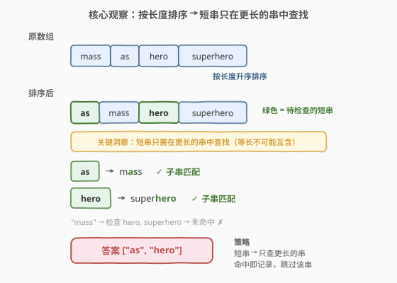
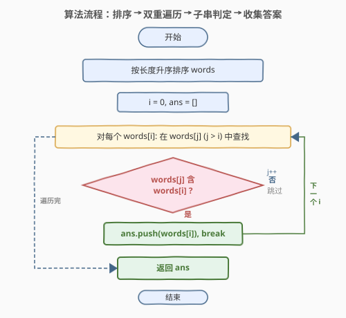
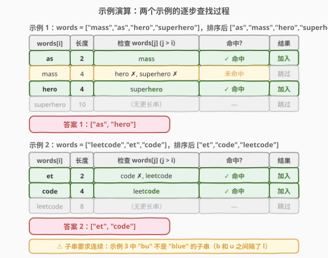

# 数组中的字符串匹配

- **题目名称**：数组中的字符串匹配
- **链接**：[1408. 数组中的字符串匹配](https://leetcode.cn/problems/string-matching-in-an-array/)
- **难度**：简单
- **标签**：字符串、暴力、排序

## 1. 题目概述

给你一个字符串数组 `words`，数组中的每个字符串都可以看作是一个单词。请你按**任意顺序**返回 `words` 中是其他单词的**子字符串**的所有单词。

**示例 1**：

```text
输入：words = ["mass","as","hero","superhero"]
输出：["as","hero"]
解释："as" 是 "mass" 的子字符串，"hero" 是 "superhero" 的子字符串。
["hero","as"] 也是有效的答案。
```

**示例 2**：

```text
输入：words = ["leetcode","et","code"]
输出：["et","code"]
解释："et" 和 "code" 都是 "leetcode" 的子字符串。
```

**示例 3**：

```text
输入：words = ["blue","green","bu"]
输出：[]
```

**约束条件**：

- $1 \le \text{words.length} \le 100$
- $1 \le \text{words}[i].\text{length} \le 30$
- `words[i]` 仅包含小写英文字母
- 题目数据保证 `words` 的每个字符串都是**独一无二**的

> 💡 **关键点**：要判断一个字符串是否是另一个字符串的子串，核心操作是**子串查找**（`find` / `in`）。关键观察是：短串只可能是更长串的子串——等长的两个不同字符串不可能互为子串。

---

## 2. 解题思路

### 2.1 暴力思路：双重遍历检查所有配对

最直观的做法：对每个 `words[i]`，遍历所有其他 `words[j]`（$j \ne i$），检查 `words[i]` 是否是 `words[j]` 的子串。一旦找到就加入答案并跳出。

- $n$ 个字符串两两配对，共 $O(n^2)$ 对；
- 每对做一次子串查找，朴素算法 $O(L^2)$（$L$ 为最大串长）；
- 总时间 $O(n^2 \cdot L^2)$，$n \le 100$、$L \le 30$ 时约 $9 \times 10^6$，完全可行。

> ⚠️ 暴力法的问题在于**无方向性**：它也会检查长串是否是短串的子串（不可能命中），以及等长串之间的互查（同样不可能命中），浪费了一半以上的比较。

### 2.2 核心观察：按长度排序 → 短串只在更长的串中查找



**关键洞察**：由于 `words` 中每个字符串都是**独一无二**的，两个**等长**的不同字符串不可能互为子串（子串要求连续且完全匹配，等长则必须完全相同）。因此：

- 一个字符串只可能是**比它更长**的字符串的子串；
- 将 `words` 按**长度升序排序**后，`words[i]` 只需要在 `words[i+1..n-1]`（更长的串）中查找；
- 一旦命中即加入答案、跳出内层循环。

三步走：

1. **按长度升序排序**：`sort(words, key=len)`；
2. **双重遍历**：外层 `i` 从短到长，内层 `j` 从 `i+1` 到末尾（只查更长的串）；
3. **命中即停**：`words[j].find(words[i])` 命中则加入 `ans` 并 `break`。

> 以示例 1 为例：`words = ["mass","as","hero","superhero"]`，排序后 `["as","mass","hero","superhero"]`。检查 `"as"` → 在 `"mass"` 中找到 ✓；检查 `"mass"` → `"hero"`、`"superhero"` 中均未找到；检查 `"hero"` → 在 `"superhero"` 中找到 ✓。答案 `["as","hero"]`。

> 💡 **为什么排序有效？** 排序本身 $O(n \log n \cdot L)$（字符串比较需逐字符），不会成为瓶颈。排序后内层只遍历 $j > i$ 的位置，避免了「长串查短串」和「等长互查」的无效比较。虽然最坏复杂度仍为 $O(n^2 \cdot L^2)$，但实际比较次数显著减少。

### 2.3 算法流程图



排序后一趟双重遍历，外层枚举短串、内层在更长串中查找，命中即收集。

### 2.4 示例演算

以示例 1 和示例 2 分别演算：



**示例 1**（`words = ["mass","as","hero","superhero"]`，排序后 `["as","mass","hero","superhero"]`）：

| words[i] | 长度 | 检查 words[j] (j>i) | 命中? | 结果 |
|----------|------|----------------------|-------|------|
| as | 2 | mass | ✓（m**as**s） | 加入 ans |
| mass | 4 | hero, superhero | ✗ | 跳过 |
| hero | 4 | superhero | ✓（super**hero**） | 加入 ans |
| superhero | 10 | （无更长串） | — | 跳过 |

答案 `["as","hero"]`。

**示例 2**（`words = ["leetcode","et","code"]`，排序后 `["et","code","leetcode"]`）：

| words[i] | 长度 | 检查 words[j] (j>i) | 命中? | 结果 |
|----------|------|----------------------|-------|------|
| et | 2 | code ✗, leetcode | ✓（le**et**code） | 加入 ans |
| code | 4 | leetcode | ✓（leet**code**） | 加入 ans |
| leetcode | 8 | （无更长串） | — | 跳过 |

答案 `["et","code"]`。

> ⚠️ 示例 3 中 `"bu"` 不是 `"blue"` 的子串：`"blue"` = b-l-u-e，`"bu"` 的 b 和 u 不连续，故不匹配。子串要求**连续**，这是与子序列的关键区别。

---

## 3. 参考代码

### C++

```cpp
class Solution {
public:
    vector<string> stringMatching(vector<string>& words) {
        sort(words.begin(), words.end(), [](const auto& a, const auto& b) {
            return a.size() < b.size();
        });
        vector<string> ans;
        for (int i = 0; i < (int)words.size(); i++) {
            for (int j = i + 1; j < (int)words.size(); j++) {
                if (words[j].find(words[i]) != string::npos) {
                    ans.push_back(words[i]);
                    break;
                }
            }
        }
        return ans;
    }
};
```

### Python

```python
class Solution:
    def stringMatching(self, words: List[str]) -> List[str]:
        words.sort(key=len)
        ans = []
        for i, w in enumerate(words):
            if any(w in words[j] for j in range(i + 1, len(words))):
                ans.append(w)
        return ans
```

> 💡 **实现要点**：① 排序用 `a.size() < b.size()` / `key=len` 按长度升序。② 内层 `j` 从 `i+1` 开始，只查更长的串。③ 命中后 `break`（C++）/ `any` 短路（Python），避免重复加入。④ `string::npos` 是 `find` 未找到的返回值；Python 的 `in` 运算符直接返回布尔值。

---

## 4. 复杂度分析

| 维度 | 排序 + 双重遍历（推荐） | 暴力双重遍历 |
|------|------------------------|-------------|
| **时间复杂度** | $O(n \log n \cdot L + n^2 \cdot L^2)$ | $O(n^2 \cdot L^2)$ |
| **空间复杂度** | $O(\log n)$（排序栈） | $O(1)$ |
| **实际运算量** | $n=100, L=30$ 时约 $9 \times 10^6$ | 同左 |

- **排序**：$O(n \log n \cdot L)$（字符串比较需逐字符，$L$ 为最大串长），$n \le 100$ 时可忽略。
- **双重遍历**：最坏 $\frac{n(n-1)}{2}$ 对，每对 `find` 朴素 $O(L^2)$，总计 $O(n^2 \cdot L^2)$。$n=100, L=30$ 时约 $100^2 \times 30^2 \approx 9 \times 10^6$，毫秒级。
- **空间**：原地排序 $O(\log n)$ 递归栈；答案数组不计入额外空间。

> 💡 **能否更快？** 若 $n$ 很大（如 $10^5$），可用 **KMP** 将每次 `find` 降到 $O(L)$，总计 $O(n^2 \cdot L)$。但本题 $n \le 100$，标准库 `find` 已足够，KMP 仅作理论优化。更激进的方案见第 5 节的拼接字符串技巧。

---

## 5. 扩展：拼接字符串 + find/rfind 一行判定

有一种更简洁的写法：将所有字符串用分隔符（如 `#`，不在字母表中）拼接成一个大字符串，然后对每个单词检查它在拼接串中是否**出现多次**。

```cpp
class Solution {
public:
    vector<string> stringMatching(vector<string>& words) {
        string joined;
        for (const auto& w : words) joined += w + "#";
        vector<string> ans;
        for (const auto& w : words) {
            if (joined.find(w) != joined.rfind(w))  // 出现多次 → 是子串
                ans.push_back(w);
        }
        return ans;
    }
};
```

**原理**：

1. 拼接串 `joined` 中每个单词至少出现一次（在它自己的位置）；
2. 若单词 `w` 还是另一个单词的子串，则 `w` 在 `joined` 中会**额外出现**一次（在包含它的那个单词内部）；
3. `find` 返回首次出现位置，`rfind` 返回最后一次出现位置。若两者不同，说明 `w` 出现了多次，即 `w` 是某个其他单词的子串。

> ⚠️ **分隔符的必要性**：用 `#` 分隔可防止 `w` 跨越两个单词的边界匹配。由于 `words[i]` 只含小写字母、`#` 不在字母表中，`w` 不可能匹配到 `#`，因此不会产生跨边界的误匹配。

> 💡 **复杂度**：拼接 $O(n \cdot L)$，每次 `find`/`rfind` $O(\text{total}^2)$ 朴素，总计 $O(n \cdot (nL)^2)$——比排序法更差。但代码极简，适合追求简洁的场合。若配合 KMP 可降到 $O(n \cdot nL) = O(n^2 L)$。

---

## 6. 面试要点

1. **怎么想到按长度排序的？**

   > 题目要求找一个串是否是另一个串的子串。子串要求被包含的串**更短**（至少等长）。又因所有单词唯一，等长的两个不同串不可能互含。所以只需检查「短串是否在长串中」——排序后自然形成「短→长」的顺序，内层只需查 $j > i$。

2. **子串和子序列有什么区别？**

   > 子串（substring）要求**连续**，如 `"as"` 是 `"mass"` 的子串。子序列（subsequence）不要求连续，如 `"bu"` 是 `"blue"` 的子序列但不是子串。本题明确要求子串，因此 `"bu"` 不是 `"blue"` 的子串（b 和 u 之间隔了 l）。

3. **`find` 的时间复杂度是多少？能用 KMP 优化吗？**

   > C++ `string::find` 和 Python `in` 通常实现为朴素算法，最坏 $O(L_1 \cdot L_2)$。KMP 可将每次查找优化到 $O(L_1 + L_2)$（预处理 $O(L_2)$ + 匹配 $O(L_1)$）。本题 $n \le 100, L \le 30$，朴素法已足够；若 $n$ 或 $L$ 很大则值得用 KMP。

4. **拼接字符串技巧为什么有效？分隔符能省略吗？**

   > 每个单词在拼接串中至少出现一次（自身位置）。若它还是另一个单词的子串，则在那个单词内部又出现一次，`find != rfind` 即可判定。分隔符 `#` 不可省略：否则一个单词的末尾可能与下一个单词的开头拼成匹配，产生误报。分隔符必须不在字母表中（本题仅小写字母，用 `#` 安全）。

5. **如果要求返回所有包含关系（而不仅是「是子串的单词」）怎么办？**

   > 需记录每个短串被哪个长串包含。在内层命中时不 `break`，而是记录 `(words[i], words[j])` 配对，继续查找可能包含 `words[i]` 的其他长串。复杂度不变，但输出从一维列表变为二维配对列表。

> 💡 **一句话总结**：1408 的灵魂是「**按长度排序，短串只在更长的串中查找**」。排序消除了「长查短」和「等长互查」的无效比较，命中即收、break 即走。核心操作是子串查找，数据规模小用标准库 `find` 足矣。

---

## 7. 同类练习题

- [28. 找出字符串中第一个匹配项的下标](https://leetcode.cn/problems/find-the-index-of-the-first-occurrence-in-a-string/)（[题解](../0001-0100/28_找出字符串中第一个匹配项的下标.md)）：子串查找的基础母题，手撕 KMP / 朴素匹配，1408 的 `find` 操作的底层实现
- [459. 重复的子字符串](https://leetcode.cn/problems/repeated-substring-pattern/)（[题解](../0401-0500/459_重复的子字符串.md)）：判断字符串是否由某子串重复构成，巧用「拼接去首尾」判定，与 1408 的拼接技巧异曲同工
- [796. 旋转字符串](https://leetcode.cn/problems/rotate-string/)（[题解](../0701-0800/796_旋转字符串.md)）：判断两字符串是否互为旋转，巧用 `s+s` 包含 `goal`，与 1408 的「拼接后查找」思路同源
- [1455. 检查单词是否为句中的单词前缀](https://leetcode.cn/problems/check-if-a-word-occurs-as-a-prefix-of-any-word-in-a-sentence/)：前缀匹配而非子串匹配，对照 1408 的子串匹配——同为字符串包含关系的不同变体
