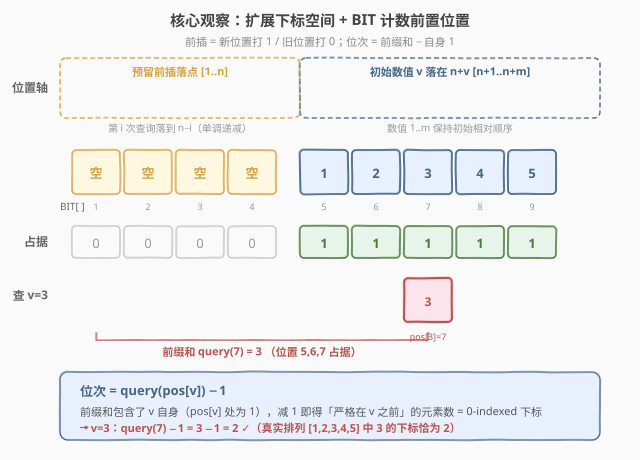
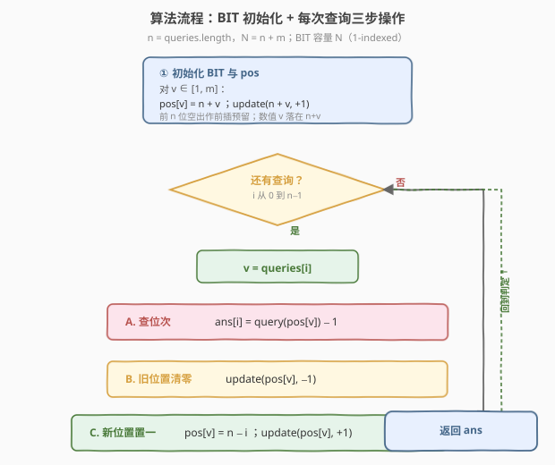

# 查询带键的排列

- **题目名称**：查询带键的排列
- **链接**：[1409. 查询带键的排列](https://leetcode.cn/problems/queries-on-a-permutation-with-key/)
- **难度**：中等
- **标签**：树状数组、数组、模拟

## 1. 题目概述

给定一个正整数 `m` 和一个查询数组 `queries`（元素取值在 $1$ 到 $m$ 之间）。初始时有一个排列 $P = [1, 2, 3, \dots, m]$。需要按顺序处理每一个 `queries[i]`（$i$ 从 $0$ 到 `queries.length - 1`），处理规则如下：

- 在**当前**排列 $P$ 中找到 `queries[i]` 的位置（下标从 $0$ 开始），把该位置记入答案；
- 然后把 `queries[i]` 这个元素**移动到 $P$ 的最前面**（其余元素的相对顺序不变）。

返回由每次查询得到的位置组成的数组。

**示例 1**：

```text
输入：queries = [3,1,2,1], m = 5
输出：[2,1,2,1]
解释：
- i=0: P=[1,2,3,4,5]，3 在位置 2，移到最前 → P=[3,1,2,4,5]
- i=1: P=[3,1,2,4,5]，1 在位置 1，移到最前 → P=[1,3,2,4,5]
- i=2: P=[1,3,2,4,5]，2 在位置 2，移到最前 → P=[2,1,3,4,5]
- i=3: P=[2,1,3,4,5]，1 在位置 1，移到最前 → P=[1,2,3,4,5]
```

**示例 2**：

```text
输入：queries = [4,1,2,2], m = 5
输出：[3,1,2,0]
解释：
- i=0: P=[1,2,3,4,5]，4 在位置 3，移到最前 → P=[4,1,2,3,5]
- i=1: P=[4,1,2,3,5]，1 在位置 1，移到最前 → P=[1,4,2,3,5]
- i=2: P=[1,4,2,3,5]，2 在位置 2，移到最前 → P=[2,1,4,3,5]
- i=3: P=[2,1,4,3,5]，2 在位置 0，移到最前 → P=[2,1,4,3,5]
```

**约束条件**：

- $1 \le m \le 10^3$
- $1 \le \text{queries.length} \le m$
- $1 \le \text{queries[i]} \le m$

> 💡 **关键点**：本质是「**反复查询某元素在动态排列中的位次，再把它提到队首**」。直接模拟（用数组/链表维护 $P$，每次线性查找 + 前插）对 $m \le 10^3$ 完全够用（$O(m^2)$）；但当 $m$ 放大到 $10^5$ 时，线性查找与前插都会退化。能否把「**查询位次**」与「**前插**」都降到 $O(\log m)$？答案是**树状数组**——把「前插」转译成「在新位置打 1、旧位置打 0」，把「位次」转译成「前缀计数」。

---

## 2. 解题思路

### 2.1 暴力思路：数组模拟前插

最直观的做法：用一个数组 `P = [1, 2, ..., m]` 真实地维护排列，对每个查询 $v$：

1. 线性扫描 `P` 找到 $v$ 的下标 `idx`，记入答案；
2. 把 `P[idx]` 删除，再插到 `P` 的头部。

每一步的「查找」与「前插」都是 $O(m)$，共 `n = queries.length` 次查询，总时间 $O(n \cdot m)$。对 $m \le 10^3$ 这是 $10^6$ 量级，可以 AC。

> ⚠️ 暴力法的瓶颈在于「**前插导致整段平移**」——把一个元素提到队首，意味着它后面所有元素的位次都要 $+1$。如果我们直接维护 $P$，每次前插都伴随 $O(m)$ 的搬移。破局思路是**不要真的搬移元素，只记录每个元素的「逻辑位置」**，并用一个支持「单点修改 + 前缀求和」的结构把位次查询压到 $O(\log)$。

### 2.2 核心观察：扩展下标空间 + 树状数组计数前置位置



关键洞察是**把「前插」翻译成「在更靠左的新坐标打上占位标记」**，从而避免任何元素平移。具体做法分三步：

**① 扩展下标空间**。令 $n = \text{queries.length}$，把坐标轴从 $[1, m]$ 扩展到 $[1, n + m]$。初始时让数值 $v$ 占据位置 $n + v$（即数值 $1$ 在 $n+1$，数值 $m$ 在 $n+m$）。这样前 $n$ 个位置 $[1, n]$ 全部空出，作为后续「前插」的预留落点。

> 💡 **为什么要预留 $n$ 个空位？** 每次查询都会把一个元素提到最前，最多提 $n$ 次，每次需要一个比所有现存元素都靠前的新位置。我们把第 $i$ 次查询（$i$ 从 $0$ 起）提到的新位置定为 $n - i$——即 $n, n-1, n-2, \dots, 1$。这些位置**单调递减**，天然保证「新队首」始终在「上一任队首」的左边，无需搬移任何人。

**② 用 BIT 维护「占位标记」**。建立一个长度为 $n + m$ 的树状数组 `BIT`，`BIT` 的语义是「**位置 $p$ 是否被某个元素占据**」：占据为 $1$，空位为 $0$。初始时在位置 $n+1, n+2, \dots, n+m$ 各打一个 $1$（数值 $v$ 占据 $n+v$）。

于是数值 $v$ 在当前排列中的**位次**（0-indexed）= 它前面有多少个被占据的位置 = $\text{prefixSum}(\text{pos}[v]) - 1$。其中 `pos[v]` 记录数值 $v$ 的当前位置，`prefixSum(p)` 是 BIT 对 $[1, p]$ 的求和。

> 💡 **为什么位次 = 前缀和 − 1？** 因为 `pos[v]` 自身被占据（记 $1$），所以前缀和包含了它自己。减去这 $1$ 即得「严格在它之前」的元素个数，恰好就是它在新排列里的 0-indexed 下标。

**③ 前插 = 旧位置清零 + 新位置置一**。对第 $i$ 次查询 $v$：

1. 查询位次：`ans = query(pos[v]) - 1`；
2. 旧位置清零：`update(pos[v], -1)`；
3. 新位置置一：`pos[v] = n - i`，`update(pos[v], +1)`。

三步都是 $O(\log(n+m))$，完全规避了元素平移。

### 2.3 算法流程图



**完整步骤**：

1. **初始化**：$n = \text{queries.length}$，BIT 容量 $= n + m$；对 $v \in [1, m]$：`pos[v] = n + v`，`update(n + v, +1)`；
2. **逐次处理查询**（$i$ 从 $0$ 到 $n-1$），令 $v = \text{queries}[i]$：
   - **查位次**：`ans[i] = query(pos[v]) - 1`；
   - **旧位置清零**：`update(pos[v], -1)`；
   - **新位置置一**：`pos[v] = n - i`，`update(pos[v], +1)`；
3. **返回** `ans`。

> 💡 **BIT 的两个基本操作**：`update(p, delta)` 把位置 $p$ 的值加上 `delta`（单点修改，$O(\log N)$）；`query(p)` 返回前缀 $[1, p]$ 之和（前缀求和，$O(\log N)$）。二者都借助 `lowbit(x) = x & (-x)` 在树形索引上跳跃实现。本题把「占据/空位」作为可加的 $0/1$ 量，正是 BIT 的经典应用——**动态前缀计数**。

### 2.4 示例演算

以示例 1 的 `queries = [3,1,2,1], m = 5` 为例，$n = 4$，扩展空间大小 $= n + m = 9$。初始占据位置 $5,6,7,8,9$（数值 $1\sim5$ 分别在 $5,6,7,8,9$）。

![示例演算：queries = [3,1,2,1] → [2,1,2,1]](../images/1409_example_walkthrough.svg)

| $i$ | $v$ | $\text{pos}[v]$（旧） | $\text{query}(\text{pos})-1$ | 新位置 $n-i$ | 占据位变化 | 当前排列（按位置升序） |
|-----|-----|----------------------|------------------------------|--------------|------------|------------------------|
| 0 | 3 | 7 | $3 - 1 = \mathbf{2}$ | 4 | 清 7，置 4 | $[3,1,2,4,5]$ |
| 1 | 1 | 5 | $2 - 1 = \mathbf{1}$ | 3 | 清 5，置 3 | $[1,3,2,4,5]$ |
| 2 | 2 | 6 | $3 - 1 = \mathbf{2}$ | 2 | 清 6，置 2 | $[2,1,3,4,5]$ |
| 3 | 1 | 3 | $2 - 1 = \mathbf{1}$ | 1 | 清 3，置 1 | $[1,2,3,4,5]$ |

最终答案 `[2,1,2,1]` ✓。

> 💡 **对照「BIT 视角」与「真实排列」**：以 $i=2$ 查询 $v=2$ 为例。此时占据位为 $\{2_{\text{(原3)},3_{\text{(原1)}},4_{\text{(原2)}},8,9\}$... 不，更准确地说 $i=1$ 后占据位是 $\{3,4,6,8,9\}$（数值 1 在 3、数值 3 在 4、数值 2 在 6、数值 4 在 8、数值 5 在 9）。查询 $v=2$ 时 `pos[2]=6`，前缀和 `query(6)` 数位置 $\{3,4,6\}$ 共 $3$ 个，`ans = 3-1 = 2`，与真实排列 $[1,3,2,4,5]$ 中 $2$ 的下标 $2$ 完全一致 ✓。可见「占据位的前缀计数」忠实还原了真实位次，而无需搬移任何元素。

---

## 3. 参考代码

### C++

```cpp
class Solution {
public:
    vector<int> processQueries(vector<int>& queries, int m) {
        int n = queries.size();
        int N = n + m;
        vector<int> bit(N + 1, 0);
        auto lowbit = [](int x) { return x & (-x); };
        auto update = [&](int p, int delta) {
            for (; p <= N; p += lowbit(p)) bit[p] += delta;
        };
        auto query = [&](int p) {
            int s = 0;
            for (; p > 0; p -= lowbit(p)) s += bit[p];
            return s;
        };

        vector<int> pos(m + 1);
        for (int v = 1; v <= m; v++) {
            pos[v] = n + v;
            update(n + v, 1);
        }

        vector<int> ans(n);
        for (int i = 0; i < n; i++) {
            int v = queries[i];
            ans[i] = query(pos[v]) - 1;
            update(pos[v], -1);
            pos[v] = n - i;
            update(pos[v], 1);
        }
        return ans;
    }
};
```

### Python

```python
class Solution:
    def processQueries(self, queries: List[int], m: int) -> List[int]:
        n = len(queries)
        N = n + m
        bit = [0] * (N + 1)

        def lowbit(x: int) -> int:
            return x & (-x)

        def update(p: int, delta: int) -> None:
            while p <= N:
                bit[p] += delta
                p += lowbit(p)

        def query(p: int) -> int:
            s = 0
            while p > 0:
                s += bit[p]
                p -= lowbit(p)
            return s

        pos = [0] * (m + 1)
        for v in range(1, m + 1):
            pos[v] = n + v
            update(n + v, 1)

        ans = []
        for i, v in enumerate(queries):
            ans.append(query(pos[v]) - 1)
            update(pos[v], -1)
            pos[v] = n - i
            update(pos[v], 1)
        return ans
```

> 💡 **实现要点**：① BIT 容量取 $N = n + m$，**1-indexed**，故数组开 `N + 1` 长度。② 初始化时数值 $v$ 落在 `n + v`，保证前 $n$ 位空出作前插预留。③ 每次查询的三步顺序**不可换**——必须先读 `ans`，再清旧位、置新位；若先清旧位再读，会少计自己。④ `pos` 数组按数值索引（`pos[v]`），$v \in [1, m]$，故开 `m + 1` 长度。

> 💡 **暴力对照版**（$O(nm)$，$m \le 10^3$ 足够）：直接维护 `P = list(range(1, m+1))`，每次 `idx = P.index(v); ans.append(idx); P.pop(idx); P.insert(0, v)`。代码极简，适合面试时先讲清题意再优化。当面试官追问「$m$ 放大到 $10^5$ 怎么办」时再上 BIT 版。

---

## 4. 复杂度分析

| 维度 | 树状数组（推荐） | 数组模拟（暴力） |
|------|------------------|------------------|
| **时间复杂度** | $O((n + m) \log(n + m))$ | $O(n \cdot m)$ |
| **空间复杂度** | $O(n + m)$ | $O(m)$ |
| **是否支持 $m \sim 10^5$** | 是 | 否（$10^{10}$ 超时） |
| **常数** | BIT 的 `update`/`query` 各 $O(\log N)$ | 线性查找 + 前插各 $O(m)$ |

- **树状数组**：初始化 $m$ 次 `update` 共 $O(m \log(n+m))$；$n$ 次查询每次 $2$ 次 `update` + $1$ 次 `query` 共 $O(n \log(n+m))$；合计 $O((n+m)\log(n+m))$。空间上 BIT 与 `pos` 各 $O(n+m)$。
- **数组模拟**：每次查询的 `index` + `pop` + `insert` 都是 $O(m)$，共 $n$ 次，合计 $O(nm)$。$m \le 10^3$ 时 $nm \le 10^6$ 毫秒级通过。

> ⚠️ 本题 $m \le 10^3$，两种方法都能过。但树状数组版体现了「**把前插转译成单点修改 + 前缀求和**」的核心建模思想——这是动态位次查询问题的通用范式，面试中写出 BIT 版能直接应对「放大 $m$」的追问。

---

## 5. 扩展：用「数值映射 + 偏移」的 $O(m)$ 简化思路

若不追求对数复杂度，本题还有一种比数组模拟更高效的 $O(n + m)$ 思路，核心是**只关心被查询过的元素**：

观察到「**未被查询过的元素之间的相对顺序始终不变**」——它们只是被查询过的元素「挤到」后面。可以维护一个偏移表，对每个查询 $v$，其位次 = 它在「已查询元素去重序列」中的位置 + 它在「未查询元素」中比自己小的个数。

实现上：用一个哈希/数组记录每个数值是否被查询过、以及被查询的先后序号；位次由「已查询且序号更晚的元素个数」与「未查询且小于 $v$ 的元素个数」两部分拼出。此法达到 $O(n + m)$，但逻辑较绕、常数在 $m$ 小时不占优，**仅作为思路拓展**，面试主答仍推荐 BIT。

| 写法 | 时间 | 空间 | 思想 | 适用场景 |
|------|------|------|------|----------|
| 树状数组 | $O((n+m)\log(n+m))$ | $O(n+m)$ | 前插=单点改，位次=前缀和 | 通用，$m$ 大时首选 |
| 数组模拟 | $O(nm)$ | $O(m)$ | 真实维护排列 | $m$ 极小时最简 |
| 偏移计数 | $O(n+m)$ | $O(m)$ | 区分已查/未查元素 | 理论最优，常数与实现复杂度高 |

---

## 6. 面试要点

1. **为什么要把下标空间从 $[1, m]$ 扩展到 $[1, n+m]$？**

   > 为了给「前插」预留单调递减的落点。每次查询都把一个元素提到最前，最多 $n$ 次，每次需要一个比所有现存元素都靠前的新位置。预留前 $n$ 位（$n, n-1, \dots, 1$）作为前插落点，新位置单调递减天然保证「新队首」始终在「上一任队首」左边，从而**完全规避元素平移**。初始数值 $v$ 放在 $n+v$，既不与预留区冲突，又保持初始相对顺序。

2. **位次为什么等于 `query(pos[v]) - 1`？**

   > BIT 维护的是「位置是否被占据」（$0/1$）。`pos[v]` 自身被占据（贡献 $1$），故前缀和 `query(pos[v])` 包含了 $v$ 自己。减去这 $1$ 即得「严格在 $v$ 之前」的元素个数，正是它在当前排列中的 0-indexed 下标。这与真实排列的下标定义完全一致——本题样例已验证。

3. **「前插」为什么能拆成「旧位置清零 + 新位置置一」两步？**

   > 因为我们从不搬移任何元素，只改「占据标记」。元素 $v$ 的逻辑位置完全由 `pos[v]` 决定：旧位置标记从 $1$ 改 $0$（腾出），新位置标记从 $0$ 改 $1$（入驻）。BIT 的前缀和是这些 $0/1$ 标记之和，自动反映新位次。这把「$O(m)$ 的整段平移」压缩成了两次 $O(\log N)$ 的单点修改。

4. **本题与 [315. 计算右侧小于当前元素的个数](../0201-0300/315_计算右侧小于当前元素的个数.md) 的树状数组用法有何异同？**

   > 两者都用 BIT 做「动态前缀计数」，但语义相反：315 在元素**从右向左**扫入时统计右侧更小者（BIT 维护值域出现计数，查询 `< 当前值` 的前缀）；1409 用 BIT 维护**位置轴**的占据标记，查询「当前位置之前」的占据数。前者是「**值域 BIT**」做权值计数，后者是「**下标 BIT**」做位置计数——同一数据结构的两种经典建模方向。

5. **如果 $m$ 放大到 $10^9$ 但查询数 $n$ 仍很小，怎么做？**

   > 坐标压缩：只对「初始 $n + v$（$v$ 仅限查询涉及的数值）」与「前插落点 $n-i$」这些**实际用到的位置**离散化，再建 BIT。位置总数从 $n + m$ 降到 $O(n)$，时间 $O(n \log n)$。这是「稀疏位置 + BIT」的通用优化，承接 [315](../0201-0300/315_计算右侧小于当前元素的个数.md) 的值域压缩思想。

> 💡 **一句话总结**：1409 的灵魂是「**把前插翻译成单点修改、把位次翻译成前缀求和**」——扩展下标空间预留前插落点，用 BIT 维护位置轴的 $0/1$ 占据标记，`ans = query(pos[v]) - 1`。$O((n+m)\log(n+m))$ 时间，是动态位次查询的通用范式。

---

## 7. 同类练习题

- [315. 计算右侧小于当前元素的个数](https://leetcode.cn/problems/count-of-smaller-numbers-after-self/)（[题解](../0201-0300/315_计算右侧小于当前元素的个数.md)）：树状数组做「值域 BIT」统计右侧更小元素，对照 1409 的「下标 BIT」做位置计数，同一数据结构的两种建模方向
- [307. 区域和检索 - 数组可修改](https://leetcode.cn/problems/range-sum-query-mutable/)：树状数组支持单点修改 + 区间求和的母题，巩固 `update`/`query` 与 `lowbit` 跳跃，是 1409 中 BIT 操作的直接底座
- [493. 翻转对](https://leetcode.cn/problems/reverse-pairs/)：树状数组/归并做动态计数，巩固「边扫入边查询前缀」的范式，与 1409「边查询边改标记」思路同源
- [327. 区间和的个数](https://leetcode.cn/problems/count-of-range-sum/)：前缀和 + 树状数组做区间计数，进一步体会 BIT 在「动态前缀统计」类问题中的通用性
