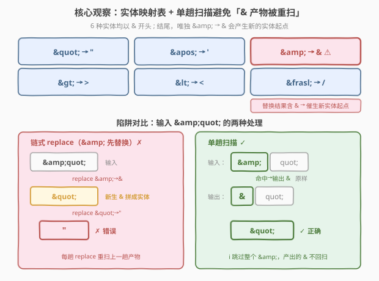
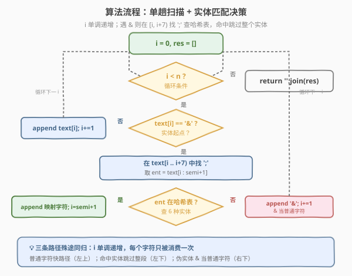
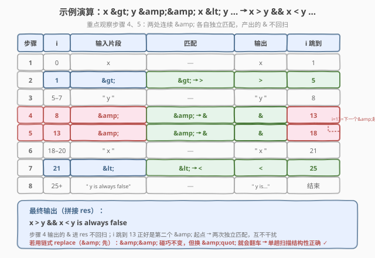

# HTML 实体解析器

- **题目名称**：HTML 实体解析器
- **链接**：[1410. HTML 实体解析器](https://leetcode.cn/problems/html-entity-parser/)
- **难度**：中等
- **标签**：字符串、模拟、哈希表

## 1. 题目概述

实现一个 HTML 实体解析器：给定输入字符串 `text`，将其中的**字符实体**替换为对应字符，返回解析结果。需识别的实体共 6 种：

| 字符实体 | 替换为 | 字符含义 |
|----------|--------|----------|
| `&quot;` | `"` | 双引号 |
| `&apos;` | `'` | 单引号 |
| `&amp;` | `&` | 与符号 |
| `&gt;` | `>` | 大于号 |
| `&lt;` | `<` | 小于号 |
| `&frasl;` | `/` | 斜线号 |

**示例 1**：

```text
输入：text = "&amp; is an HTML entity but &ambassador; is not."
输出："& is an HTML entity but &ambassador; is not."
解释：解析器把字符实体 &amp; 用 & 替换；&ambassador; 不是上述 6 种实体之一，原样保留。
```

**示例 2**：

```text
输入：text = "and I quote: &quot;...&quot;"
输出："and I quote: \"...\""
```

**示例 3**：

```text
输入：text = "Stay home! Practice on Leetcode :)"
输出："Stay home! Practice on Leetcode :)"
```

**示例 4**：

```text
输入：text = "x &gt; y &amp;&amp; x &lt; y is always false"
输出："x > y && x < y is always false"
```

**示例 5**：

```text
输入：text = "leetcode.com&frasl;problemset&frasl;all"
输出："leetcode.com/problemset/all"
```

**约束条件**：

- $1 \le \text{text.length} \le 10^5$
- 字符串可能包含 256 个 ASCII 字符中的任意字符。

> 💡 **关键点**：6 种实体均以 `&` 开头、`;` 结尾，长度 4–7 不等。难点不在「替换」本身，而在于 `&amp;` → `&` 会**产生新的 `&`**——若用链式 `str.replace` 且顺序不当，新生的 `&` 会被后续替换误识别为实体起点。这正是本题区别于普通「查表替换」的陷阱所在。

---

## 2. 解题思路

### 2.1 暴力思路：链式 `str.replace`

最直观的做法：对 6 种实体逐一调用 `str.replace`，全局替换。代码极简：

```python
text = text.replace("&quot;", '"').replace("&apos;", "'").replace("&gt;", ">") \
           .replace("&lt;", "<").replace("&frasl;", "/").replace("&amp;", "&")
```

- **能过**：本题这样写可以通过，因为上例刻意把 `&amp;` 放在**最后**替换。
- **陷阱**：若把 `&amp;` 放在**前面**替换，`&amp;quot;` 会先变成 `&quot;`，再被后续 `&quot;` → `"` 替换，得到 `"`——而正确答案应是 `&quot;`（`&` 来自 `&amp;`，`quot;` 是普通文本）。

> ⚠️ **`&amp;` 必须最后替换的原因**：其余 5 种实体的替换结果（`"`、`'`、`>`、`<`、`/`）**不含 `&`**，不会催生新实体；唯独 `&amp;` → `&` 会产生新的实体起点 `&`。把 `&amp;` 留到最后，新生的 `&` 不再参与任何替换，结果正确。但这一「正确顺序」是经验技巧，缺乏普适性——一旦实体表扩展（如出现嵌套实体），链式替换立刻失效。

### 2.2 核心观察：单趟扫描——`&` 产物不会被重扫



破局思路：**从左到右单趟扫描**，遇到 `&` 就尝试匹配实体，命中则输出替换字符并**跳过整个实体**，未命中或非 `&` 则原样输出。关键在于——`&amp;` 替换出的 `&` **直接写入结果，不再回到输入扫描**，从结构上杜绝了「新生 `&` 被误识别」。

| 方案 | `&amp;quot;` 的处理 | 结果 | 正确？ |
|------|---------------------|------|--------|
| 链式 replace（`&amp;` 先） | `&amp;quot;` → `&quot;` → `"` | `"` | ✗ |
| 单趟扫描 | 匹配 `&amp;`→输出 `&`、跳到 `quot;` 原样输出 | `&quot;` | ✓ |

> 💡 **为什么单趟扫描天然正确？** 扫描指针 `i` 只前进不后退。匹配 `&amp;` 后 `i` 跳到 `;` 之后，输出的 `&` 进了结果串 `res`、不进扫描窗口——后续 `quot;` 里没有 `&`，不会被当作实体。即便结果串里出现了 `&quot;` 这样的子串，它也只是「碰巧长得像实体」的普通文本，不会被二次处理。

**匹配策略**：6 种实体长度 4–7，均以 `;` 结尾。遇到 `&` 时，只需在 `text[i .. i+7)` 范围内找 `;`，取出 `text[i .. semi+1]` 在哈希表中查一次即可。查不到说明不是合法实体，`&` 按普通字符输出。

### 2.3 算法流程图



**完整步骤**：

1. **初始化** `res = []`（结果串，用列表拼接避免字符串频繁扩容），`i = 0`；
2. **循环** `i` 从 `0` 到 `n-1`：
   - 若 `text[i] != '&'`：`res.append(text[i])`，`i += 1`；
   - 若 `text[i] == '&'`：在 `text[i .. i+7)` 中找 `;` 的位置 `semi`；
     - **找到**且 `text[i .. semi+1]` 在哈希表中：`res.append(映射字符)`，`i = semi + 1`（跳过整个实体）；
     - **未找到**或不在表中：`res.append('&')`，`i += 1`（`&` 按普通字符处理）；
3. **返回** `''.join(res)`。

> 💡 **为何搜索范围限 `i+7`？** 最长实体 `&frasl;` 长 7 字符，`;` 最远在 `i+6`。限定搜索窗口有两重好处：① 保证 $O(n)$ 复杂度——每次 `&` 最多扫描 7 个字符，而非扫到串尾；② 天然过滤超长伪实体（如 `&ambassador;` 中 `;` 在 `i+9`，超出窗口直接判否）。

### 2.4 示例演算

以示例 4 的 `text = "x &gt; y &amp;&amp; x &lt; y is always false"` 为例，重点观察两处连续 `&amp;` 的处理：



| 步骤 | $i$ | 输入片段 | 匹配 | 输出 | $i$ 跳到 |
|------|-----|----------|------|------|----------|
| 1 | 0 | `x` | — | `x` | 1 |
| 2 | 1 | `&gt;` | `&gt;` → `>` | `>` | 5 |
| 3 | 5–7 | `" y "` | — | `" y "` | 8 |
| 4 | 8 | `&amp;` | `&amp;` → `&` | `&` | 13 |
| 5 | 13 | `&amp;` | `&amp;` → `&` | `&` | 18 |
| 6 | 18–20 | `" x "` | — | `" x "` | 21 |
| 7 | 21 | `&lt;` | `&lt;` → `<` | `<` | 25 |
| 8 | 25+ | `" y is always false"` | — | `" y is always false"` | 结束 |

最终输出：`x > y && x < y is always false` ✓。

> 💡 **关键对照——步骤 4 与 5**：第 4 步匹配 `&amp;`（$i=8..12$）输出 `&` 后，$i$ **跳到 13**，正好是第二个 `&amp;` 的起点。输出的 `&` 进了 `res`，不进扫描窗口——若误用链式替换（`&amp;` 先），`&amp;&amp;` 会先变成 `&&`，虽本例碰巧不出错，但换 `&amp;quot;` 就会翻车。单趟扫描从结构上规避了这一类风险。

> 以示例 1 的 `&ambassador;` 为例：`&` 后 `;` 在 $i+9$，超出 `i+7` 窗口，直接判否，`&` 按普通字符输出，后续 `ambassador;` 原样保留 → `&ambassador;` ✓。示例 3 全程无 `&`，原样返回 ✓。

---

## 3. 参考代码

### C++

```cpp
class Solution {
public:
    string entityParser(string text) {
        vector<pair<string, char>> ents = {
            {"&quot;", '"'}, {"&apos;", '\''}, {"&amp;", '&'},
            {"&gt;", '>'},   {"&lt;", '<'},    {"&frasl;", '/'}
        };
        string res;
        int n = text.size();
        for (int i = 0; i < n; ) {
            if (text[i] == '&') {
                bool hit = false;
                for (auto& [e, c] : ents) {
                    if (i + e.size() <= n && text.compare(i, e.size(), e) == 0) {
                        res += c;
                        i += e.size();
                        hit = true;
                        break;
                    }
                }
                if (hit) continue;
            }
            res += text[i++];
        }
        return res;
    }
};
```

### Python

```python
class Solution:
    def entityParser(self, text: str) -> str:
        ents = {
            "&quot;": '"', "&apos;": "'", "&amp;": "&",
            "&gt;": ">", "&lt;": "<", "&frasl;": "/",
        }
        res = []
        i, n = 0, len(text)
        while i < n:
            if text[i] == '&':
                semi = text.find(';', i, i + 7)
                if semi != -1:
                    ent = text[i:semi + 1]
                    if ent in ents:
                        res.append(ents[ent])
                        i = semi + 1
                        continue
            res.append(text[i])
            i += 1
        return ''.join(res)
```

> 💡 **实现要点**：① C++ 用 `vector<pair>` 存映射表，`text.compare(i, len, ent)` 做子串比较，避免 `substr` 拷贝；命中后 `i += e.size()` 一次跳过整个实体。② Python 用 `text.find(';', i, i+7)` **限定搜索窗口**为 `[i, i+7)`，保证 $O(n)$；找到 `;` 后取 `text[i:semi+1]` 查哈希表。③ 两种语言都先判 `text[i] == '&'` 再尝试匹配，普通字符走快路径，常数极小。

> 💡 **Python 为何用 `res = []` + `join` 而非 `res += char`？** 字符串在 Python 中不可变，`+=` 每次创建新串，$n$ 次拼接是 $O(n^2)$；用列表 `append` 再 `join` 是 $O(n)$。$n \le 10^5$ 时差异显著。

---

## 4. 复杂度分析

| 维度 | 单趟扫描（推荐） $O(n)$ | 链式 replace（第 5 节） $O(n)$ |
|------|------------------------|-------------------------------|
| **时间复杂度** | $O(n)$ | $O(n)$（6 趟 $\times$ 每趟 $O(n)$） |
| **空间复杂度** | $O(n)$（结果串） | $O(n)$（每趟生成新串） |
| **正确性** | 结构性保证，无需关心顺序 | 依赖 `&amp;` 放最后的经验顺序 |
| **常数** | 单趟，普通字符 $O(1)$ 快路径 | 6 趟全串扫描，常数约 6 倍 |
| **可扩展性** | 实体表可任意扩展 | 实体表扩展需重新推导顺序 |

- **单趟扫描**：指针 `i` 单调递增，每个字符至多被「快路径直接输出」或「实体匹配窗口内比较」消费一次。匹配窗口长 7，故每个 `&` 触发至多 7 次字符比较，合计 $O(7n) = O(n)$。结果串空间 $O(n)$。是本题的最优解，且**正确性不依赖替换顺序**，实体表可自由扩展。
- **链式 replace**：每趟 `str.replace` 扫描全串 $O(n)$，共 6 趟，合计 $O(6n) = O(n)$。每趟生成新串，峰值空间约 $6n$。能过但常数大、且依赖 `&amp;` 最后替换的经验技巧。

> ⚠️ 两者同为 $O(n)$，但单趟扫描只需一趟、常数更优，且无需记忆替换顺序。面试中写出单趟扫描版更能体现对「`&amp;` 产生新 `&`」这一陷阱的把握。

---

## 5. 扩展：链式 `str.replace` 的正确顺序

若追求极致代码简短，链式 `replace` 在**固定顺序**下也可正确：

### Python

```python
class Solution:
    def entityParser(self, text: str) -> str:
        return (text.replace("&quot;", '"')
                    .replace("&apos;", "'")
                    .replace("&gt;", ">")
                    .replace("&lt;", "<")
                    .replace("&frasl;", "/")
                    .replace("&amp;", "&"))
```

> 💡 **为何正确？** 前 5 种实体的替换结果（`"`、`'`、`>`、`<`、`/`）均不含 `&`，互不干扰、也不会催生新实体。`&amp;` 放最后：此前已无实体替换待执行，新生的 `&` 不会再被处理。但若把 `&amp;` 提前，`&amp;quot;` → `&quot;` → `"` 就错了。

> ⚠️ **不可推广**：这一「`&amp;` 最后」的技巧是针对本题 6 种实体的特解。若实体表扩展出替换结果含 `&` 之外字符且该字符能开启新实体的情况，链式替换将无法保证正确——此时单趟扫描是唯一普适解。面试建议：先用链式 replace 说清陷阱，再升级到单趟扫描展现稳健设计。

| 写法 | 时间 | 空间 | 正确性保证 | 适用场景 |
|------|------|------|-----------|----------|
| 单趟扫描 | $O(n)$ | $O(n)$ | 结构性（顺序无关） | 实体表可扩展，面试推荐 |
| 链式 replace | $O(n)$ | $O(n)$ | 经验性（`&amp;` 最后） | 固定 6 实体、追求简短 |

---

## 6. 面试要点

1. **为什么不能随意顺序做链式 `str.replace`？**

   > `&amp;` → `&` 会产生新的 `&`，而 `&` 是所有实体的起始符。若 `&amp;` 不放最后，新生 `&` 会与后续文本拼成伪实体被误替换。例如 `&amp;quot;` 在 `&amp;` 先替换时变为 `&quot;`，再被替换成 `"`，而正确结果应是 `&quot;`。根本原因：链式 replace 的每趟都会**重新扫描上一趟的产物**。

2. **单趟扫描为何能结构性避免这一陷阱？**

   > 扫描指针 `i` 只前进。匹配 `&amp;` 后 `i` 跳到 `;` 之后，输出的 `&` 进入结果串 `res`、不进入扫描窗口——后续文本中没有 `&`（除非原本就有），不会被当作实体起点。即便 `res` 中恰好出现 `&quot;` 这样的子串，它也只是普通文本，不会被二次处理。「产物不回扫」是单趟方案正确性的核心保证。

3. **为什么搜索 `;` 时要限定 `i+7` 窗口？**

   > 两个原因：① **复杂度**——若用 `text.find(';', i)` 不限窗口，遇到一长串 `&&&...` 每个 `&` 都会扫到串尾找 `;`，退化为 $O(n^2)$。限定 `[i, i+7)` 后每次最多比较 7 字符，保证 $O(n)$。② **正确性**——最长实体 `&frasl;` 长 7，`;` 最远在 `i+6`；超出的 `;`（如 `&ambassador;` 的 `;` 在 `i+9`）必然不是合法实体，窗口直接判否。

4. **本题与 [833. 字符串中的查找与替换](../0801-0900/833_字符串中的查找与替换.md) 的核心差异？**

   > 833 是**按索引替换**——给定若干 `(index, source, target)` 三元组，在指定位置精确匹配 `source` 并替换为 `target`，替换互不干扰、不产生连锁。1410 是**按模式替换**——实体可出现在任意位置，且 `&amp;` → `&` 会催生新的模式起点，存在连锁风险。因此 833 可按索引排序后逐个替换，1410 必须单趟扫描规避连锁。

5. **如果实体表会动态扩展（用户自定义实体），该怎么做？**

   > 单趟扫描天然支持——只需把哈希表 `ents` 换成动态字典，扫描逻辑不变。若自定义实体的替换结果也可能含 `&`（开启新实体），链式 replace 彻底失效，单趟扫描是唯一可行方案。进一步可用 **Trie** 组织实体表，将匹配从「逐一比较 6 种实体」优化为「沿 Trie 路径一次走完」，实体数很多时更高效。

> 💡 **一句话总结**：1410 的灵魂是「**单趟扫描让 `&amp;` 产出的 `&` 不回扫**」——遇到 `&` 在 `i+7` 窗口内查哈希表，命中则输出替换字符并跳过整个实体，否则 `&` 按普通字符输出。$O(n)$ 时间、$O(n)$ 空间，正确性不依赖替换顺序，实体表可自由扩展。

---

## 7. 同类练习题

- [833. 字符串中的查找与替换](https://leetcode.cn/problems/find-and-replace-in-string/)（[题解](../0801-0900/833_字符串中的查找与替换.md)）：按索引精确替换 source→target，替换互不干扰，对照 1410 按模式替换且 `&amp;` 会催生新模式起点的连锁风险
- [1309. 解码字母到整数映射](https://leetcode.cn/problems/decrypt-string-from-alphabet-to-integer-mapping/)（[题解](../1301-1400/1309_解码字母到整数映射.md)）：映射表解码（`1..26`→`a..z`，`10#` 等带终止符），与 1410 的 `&...;` 带终止符实体同构，均为「定界符 + 查表」单趟扫描
- [394. 字符串解码](https://leetcode.cn/problems/decode-string/)（[题解](../0301-0400/394_字符串解码.md)）：嵌套结构解码（`3[a2[c]]`→`accaccacc`），用栈处理嵌套，对照 1410 无嵌套的扁平替换，体会「定界符扫描」到「嵌套结构解析」的升级
- [13. 罗马数字转整数](https://leetcode.cn/problems/roman-to-integer/)（[题解](../0001-0100/13_罗马数字转整数.md)）：符号表 + 单趟扫描解析（左小右大则减），与 1410 同为「查表 + 逐字符扫描」范式，但 1410 需处理多字符定界实体
