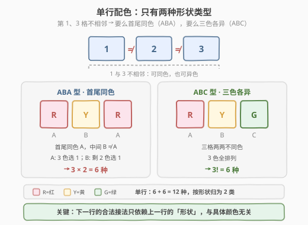
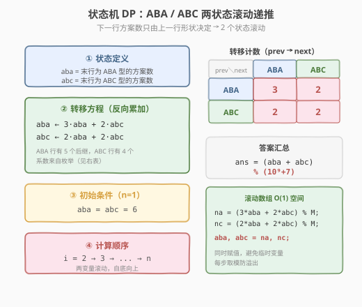
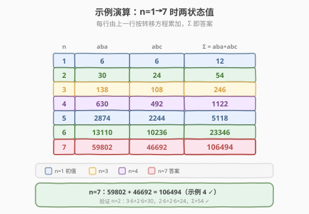

# LeetCode 给 N x 3 网格图涂色的方案数 题解

## 1. 题目概述

- **标题 / 题号**：给 N x 3 网格图涂色的方案数（#1411，hard）
- **链接**：https://leetcode.cn/problems/number-of-ways-to-paint-n-3-grid/
- **难度**：困难
- **标签**：动态规划、状态机、计数

**题意**：你有一个 `n x 3` 的网格图 `grid`，需要用**红、黄、绿**三种颜色之一给每一个格子上色，且确保**相邻格子颜色不同**（即共享水平边或垂直边的格子颜色不同）。

给定网格图的行数 `n`，返回涂色方案数。由于答案可能非常大，返回对 $10^9 + 7$ 取余的结果。

**示例 1**：

```text
输入：n = 1
输出：12
解释：总共有 12 种可行的方法。
```

**示例 2**：

```text
输入：n = 2
输出：54
```

**示例 3**：

```text
输入：n = 3
输出：246
```

**示例 4**：

```text
输入：n = 7
输出：106494
```

**示例 5**：

```text
输入：n = 5000
输出：30228214
```

**约束**：

- `n == grid.length`
- `grid[i].length == 3`
- $1 \le n \le 5000$

> 💡 这是一道**按行状态压缩的计数 DP**：每行只有 3 格、3 色，单行合法配色仅 12 种，且能归为**两种形状类型**（首尾同色 / 三色各异）。于是 `n` 行的方案数由 2 个状态滚动递推即可，时间 $O(n)$、空间 $O(1)$。它和 [1220. 统计元音字母序列的数目](../1201-1300/1220_统计元音字母序列的数目.md) 是同一套「状态机计数 DP」骨架——把后继规则建模成状态图，反向写出转移方程。

## 2. 解题思路

### 2.1 暴力思路：逐格枚举所有涂法

最直观的做法：从第 1 行第 1 格开始，每个格子尝试 3 种颜色，DFS 枚举所有满足「左右、上下相邻不同色」的涂法，涂满 `n×3` 时计数 +1。

时间复杂度约为 $O(3^{3n}) = O(27^n)$，`n=5000` 时天文数字，**严重超时**。

> ⚠️ 暴力法的问题在于**没有利用「行的同构性」**：以「ABA 型」结尾的第 `i-1` 行，无论具体涂成 121、232 还是 313，第 `i` 行的合法接法数完全相同——因为三种颜色地位对称，任意 ABA 涂法可经颜色置换相互映射。这一「只看形状、不看具体颜色」的观察，正是把 12 种配色压缩成 2 个状态的钥匙。

### 2.2 核心观察：按行配色形状分类（ABA / ABC）

**第一步：数清单行的合法配色。** 一行 3 格，相邻格颜色不同（第 1≠2 格、第 2≠3 格）。注意**第 1 格与第 3 格不相邻**（无公共边），所以它们可同色也可异色。据此单行配色恰分两类：



- **ABA 型**（首尾同色）：第 1、3 格同色 `A`，第 2 格取 `B ≠ A`。选 `A` 有 3 色、选 `B` 有 2 色 → $3 \times 2 = 6$ 种。
- **ABC 型**（三色各异）：三格两两不同，即 3 色全排列 → $3! = 6$ 种。

单行共 $6 + 6 = 12$ 种合法配色，按**形状**归为 2 类。

> 💡 **为什么只看形状就够了？** 颜色置换（红↔黄↔绿的任意重排）保持「相邻不同色」约束不变，也保持 ABA/ABC 类型不变。于是任意一个 ABA 涂法（如 121）与任意另一个 ABA 涂法（如 232）之间存在双射，它们向下一行的合法扩展数完全一致。同理所有 ABC 涂法也彼此等价。所以 12 种配色塌缩成 **2 个等价类**，只需追踪「末行为 ABA 型的方案数」和「末行为 ABC 型的方案数」。

**第二步：枚举两类形状的转移系数。** 取每类的一个代表——ABA 取 `121`、ABC 取 `123`，穷举所有合法的下一行，统计其落 入 ABA / ABC 的数量：

**上一行 ABA = 121**（约束：`c1≠1, c2≠2, c3≠1, c1≠c2, c2≠c3`）：

| 下一行 | 形状 |
|--------|------|
| 212 | ABA |
| 213 | ABC |
| 232 | ABA |
| 312 | ABC |
| 313 | ABA |

共 5 个后继 → **3 个 ABA + 2 个 ABC**。

**上一行 ABC = 123**（约束：`c1≠1, c2≠2, c3≠3, c1≠c2, c2≠c3`）：

| 下一行 | 形状 |
|--------|------|
| 212 | ABA |
| 231 | ABC |
| 232 | ABA |
| 312 | ABC |

共 4 个后继 → **2 个 ABA + 2 个 ABC**。

> ⚠️ 这两组系数是**整道题的命门**——务必亲手枚举一遍验证。由于颜色对称性，对任意 ABA 涂法枚举都得到 `3 ABA + 2 ABC`，对任意 ABC 涂法都得到 `2 ABA + 2 ABC`，与代表选取无关。

**第三步：写出转移方程。** 设 `aba[i]`、`abc[i]` 分别为前 `i` 行、末行为 ABA / ABC 型的方案数。反向累加（「谁贡献给我」）：

$$
\begin{aligned}
aba[i] &= 3 \cdot aba[i{-}1] + 2 \cdot abc[i{-}1] \\
abc[i] &= 2 \cdot aba[i{-}1] + 2 \cdot abc[i{-}1]
\end{aligned}
$$

初始条件 `aba[1] = abc[1] = 6`，答案 $= (aba[n] + abc[n]) \bmod (10^9+7)$。

### 2.3 算法流程图

套用 DP 四步法，两变量滚动：



**四步法**：

1. **状态定义**：`aba`、`abc` = 当前末行为 ABA / ABC 型的方案数（2 变量滚动）。
2. **转移方程**：见 2.2 的两式，系数 `3/2/2/2` 来自枚举。
3. **初始条件**：`aba = abc = 6`（`n=1` 时单行 6 + 6 = 12 种）。
4. **计算顺序**：`i = 2 → 3 → ... → n`，自底向上，每步用旧值算新值后整体覆盖。

> 💡 **两变量同时赋值**：与 [1220](../1201-1300/1220_统计元音字母序列的数目.md) 的 5 变量滚动同源——右边读旧值、左边一次性写新值，省去临时变量，避免覆盖顺序陷阱。

### 2.4 示例演算

以 `n=1→7` 为例，看两个状态如何从初值递推到示例 4 的答案 `106494`：



| n | aba | abc | $\Sigma$ |
|---|-----|-----|----------|
| 1 | 6 | 6 | **12** |
| 2 | 30 | 24 | **54** |
| 3 | 138 | 108 | **246** |
| 4 | 630 | 492 | **1122** |
| 5 | 2874 | 2244 | **5118** |
| 6 | 13110 | 10236 | **23346** |
| 7 | 59802 | 46692 | **106494** |

以 `n=2` 验证：`aba = 3·6+2·6 = 30`，`abc = 2·6+2·6 = 24`，$\Sigma = 54$ ✓（示例 2）。以 `n=7` 验证：`aba = 3·13110+2·10236 = 59802`，`abc = 2·13110+2·10236 = 46692`，$\Sigma = 106494$ ✓（示例 4）。

> 💡 每行只依赖上一行的 2 个值，**无需存整个二维表**——2 个变量滚动即可，空间 $O(1)$。

## 3. 参考代码

### C++

```cpp
// 给 N x 3 网格图涂色的方案数.cpp —— 状态机 DP + 滚动数组
// 编译: g++ -O2 -std=c++17 给Nx3网格图涂色的方案数.cpp -o paint
using ll = long long;

class Solution {
  public:
    int numOfWays(int n) {
        const ll MOD = 1e9 + 7;
        ll aba = 6, abc = 6; // n=1 初值
        for (int i = 2; i <= n; ++i) {
            ll naba = (3 * aba + 2 * abc) % MOD;
            ll nabc = (2 * aba + 2 * abc) % MOD;
            aba = naba;
            abc = nabc;
        }
        return (int)((aba + abc) % MOD);
    }
};
```

### Python

```python
class Solution:
    def numOfWays(self, n: int) -> int:
        MOD = 10**9 + 7
        aba = abc = 6
        for _ in range(2, n + 1):
            aba, abc = (
                (3 * aba + 2 * abc) % MOD,
                (2 * aba + 2 * abc) % MOD,
            )
        return (aba + abc) % MOD
```

> 💡 Python 的多变量同时赋值是关键：右边的 `aba`、`abc` 都是**旧值**，一次性算完两个新值再整体覆盖，无需临时变量。这与 [1220](../1201-1300/1220_统计元音字母序列的数目.md) 的 5 变量版本、[70. 爬楼梯](../0001-0100/70_爬楼梯.md) 的 2 变量版本是同一技巧。

## 4. 复杂度分析

| 维度 | 复杂度 | 说明 |
|------|--------|------|
| **时间复杂度** | $O(n)$ | 单层循环 `n-1` 轮，每轮 4 次乘加 + 取模 |
| **空间复杂度（滚动）** | $O(1)$ | 仅 `aba`、`abc` 两个变量 |
| **空间复杂度（二维表）** | $O(n)$ | 若保留整个 `dp[n][2]` 表 |
| **最优时间** | $O(\log n)$ | 矩阵快速幂（见扩展） |

## 5. 扩展：矩阵快速幂 $O(\log n)$

两个状态的线性递推可写成矩阵形式。令列向量 $\mathbf{v}_i = \begin{pmatrix} aba[i] \\ abc[i] \end{pmatrix}$，则 $\mathbf{v}_i = M \cdot \mathbf{v}_{i-1}$，其中转移矩阵 $M$ 为：

$$
M = \begin{pmatrix}
3 & 2 \\
2 & 2
\end{pmatrix}
$$

迭代展开：$\mathbf{v}_n = M^{n-1} \cdot \mathbf{v}_1$，其中 $\mathbf{v}_1 = (6, 6)^T$。

矩阵幂用**快速幂**（平方加速）可在 $O(\log n)$ 内算出（每次 2×2 矩阵乘仅 8 次乘法）。$n \le 5000$ 时 DP 已足够快，但若 `n` 放大到 $10^{18}$，矩阵快速幂是唯一可行解法。

> 💡 $M$ 的特征值为 $\lambda = \dfrac{5 \pm \sqrt{17}}{2}$（迹 5、行列式 2），存在含 $\sqrt{17}$ 的闭式但并不整洁，故工程上仍以矩阵快速幂为标准加速手段。这与 [1220](../1201-1300/1220_统计元音字母序列的数目.md) 的 5×5 矩阵快速幂完全同构——任何「常量状态数的线性递推」都能写成矩阵幂形式，复杂度 $O(s^3 \log n)$（$s$ 为状态数）。

## 6. 面试要点

1. **为什么把 12 种配色压成 2 个状态？**

   > 三种颜色地位对称：任意颜色置换保持「相邻不同色」与 ABA/ABC 类型不变，于是所有 ABA 涂法两两等价、所有 ABC 涂法两两等价。下一行的合法接法数只依赖上一行的**形状**而非具体颜色，故只需 2 个状态 `aba`、`abc`。

2. **转移系数 `3/2/2/2` 怎么来的，怎么记？**

   > 取代表 ABA=`121`、ABC=`123` 各枚举一遍下一行：ABA 行有 5 个后继（3 ABA + 2 ABC），ABC 行有 4 个后继（2 ABA + 2 ABC）。于是 `aba ← 3·aba + 2·abc`、`abc ← 2·aba + 2·abc`。面试时务必当场枚举一遍，不要死记。

3. **为什么用「反向拉值」而不是「正向填表」？**

   > 两者等价。反向（从上一行拉值填当前行）每个新值独立计算，天然适合两变量同时赋值；正向（把我的值推给后继）要同时更新多个后继，需小心覆盖顺序。面试推荐反向写法，2 行赋值清晰无歧义。

4. **为什么每步都要取模？**

   > $n=5000$ 时方案数极大（远超 `long long`），必须在**每次乘加后立即取模**。`long long` 存中间值安全：`3·aba` 最多约 $3 \times 10^9$，加 `2·abc` 后仍在 `long long`（上限约 $9.2 \times 10^{18}$）范围内，取模后回到 `int` 范围。

5. **若列数从 3 推广到 `m`，思路如何延展？**

   > 单行合法配色数随 `m` 指数增长，但「形状等价类」仍有限——关键是按「与上一行逐格的相同/相异关系」归类。对固定小 `m`，仍可用状态机 DP（状态数随 `m` 指数但为常数）；大 `m` 时则需转向轮廓线 DP（状压上一行配色）。`m=3` 恰是「形状分类」最甜的甜区。

> 💡 **一句话总结**：本题是「状态机计数 DP」的招牌题——单行 12 种配色按形状归为 ABA / ABC 两类，枚举得转移系数 `3/2/2/2`，两变量滚动 $O(n)$/$O(1)$ 解决，矩阵快速幂作升级装甲应对极大 `n`。

## 同类练习题

| # | 题目 | 与本题的关联 |
|---|------|-------------|
| 1220 | [统计元音字母序列的数目](https://leetcode.cn/problems/count-vowels-permutation/)（[题解](../1201-1300/1220_统计元音字母序列的数目.md)） | 同胞骨架题，5 节点状态机计数 DP，反向写转移方程 + 滚动数组 + 矩阵快速幂，1411 是其「2 状态」精简版 |
| 276 | [栅栏涂色](https://leetcode.cn/problems/paint-fence/)（[题解](../0201-0300/276_栅栏涂色.md)） | 一维栅栏涂色计数 DP，按「末两根是否同色」分 2 状态滚动，与 1411 同属「相邻不同/限制连续」涂色家族 |
| 70 | [爬楼梯](https://leetcode.cn/problems/climbing-stairs/)（[题解](../0001-0100/70_爬楼梯.md)） | 一维计数 DP 入门，同样的两变量滚动骨架（2 状态的最简形态） |
| 790 | [多米诺和托米诺平铺](https://leetcode.cn/problems/domino-and-tromino-tiling/) | 平铺计数 DP，按「末列填充状态」分 3 状态滚动递推，同属「状态类型分类 + 线性转移」计数家族 |
