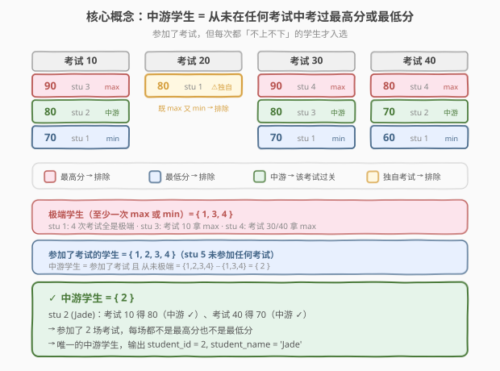
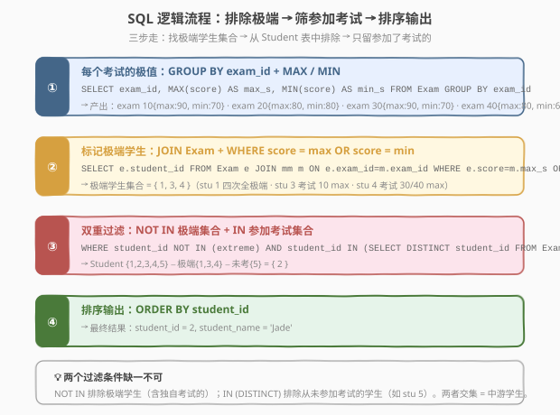
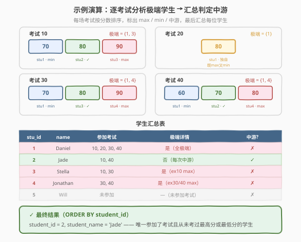

# LeetCode 查找成绩处于中游的学生 题解

## 1. 题目概述

- **标题 / 题号**：查找成绩处于中游的学生（#1412，hard）
- **链接**：https://leetcode.cn/problems/find-the-quiet-students-in-all-exams/
- **难度**：困难
- **标签**：SQL、GROUP BY、MAX、MIN、JOIN、NOT IN、子查询、集合差

**题意**：给定 `Student` 和 `Exam` 两张表。`Student` 记录学生 ID 与姓名，`Exam` 记录每场考试中各学生的分数。**中游学生**（quiet student）满足以下两个条件：

1. **至少参加了一场考试**；
2. **在参加的每一场考试中，成绩既不是该场考试的最高分，也不是最低分**。

> ⚠️ **关键边界**：如果一场考试只有一名学生参加，该学生既是最高分也是最低分，因此**不算中游学生**。这条隐含规则是本题的主要陷阱。

编写 SQL 查询，找出所有中游学生，返回 `student_id` 和 `student_name`，按 `student_id` 升序排列。

**表结构**：

```text
Table: Student
+-------------+-----------+
| Column Name | Type      |
+-------------+-----------+
| student_id  | int       |  ← 主键
| student_name| varchar   |
+-------------+-----------+

Table: Exam
+-------------+-----------+
| Column Name | Type      |
+-------------+-----------+
| exam_id     | int       |
| student_id  | int       |  ← 外键 → Student
| score       | int       |
+-------------+-----------+
（exam_id, student_id）为联合主键——同一学生不会在同一考试中出现两次
```

**示例**：

```text
Student 表：
+------------+--------------+
| student_id | student_name |
+------------+--------------+
| 1          | Daniel       |
| 2          | Jade         |
| 3          | Stella       |
| 4          | Jonathan     |
| 5          | Will         |
+------------+--------------+

Exam 表：
+---------+------------+-------+
| exam_id | student_id | score |
+---------+------------+-------+
| 10      | 1          | 70    |
| 10      | 2          | 80    |
| 10      | 3          | 90    |
| 20      | 1          | 80    |
| 30      | 1          | 70    |
| 30      | 3          | 80    |
| 30      | 4          | 90    |
| 40      | 1          | 60    |
| 40      | 2          | 70    |
| 40      | 4          | 80    |
+---------+------------+-------+

输出：
+------------+--------------+
| student_id | student_name |
+------------+--------------+
| 2          | Jade         |
+------------+--------------+
```

**解释**：

| 考试 | 参加者（分数） | 最高分 | 最低分 | 极端学生 |
|------|----------------|--------|--------|----------|
| 10 | stu1(70), stu2(80), stu3(90) | 90 → stu3 | 70 → stu1 | {1, 3} |
| 20 | stu1(80) | 80 → stu1 | 80 → stu1 | {1}（独自参加，既 max 又 min） |
| 30 | stu1(70), stu3(80), stu4(90) | 90 → stu4 | 70 → stu1 | {1, 4} |
| 40 | stu1(60), stu2(70), stu4(80) | 80 → stu4 | 60 → stu1 | {1, 4} |

- 极端学生集合（至少一次 max 或 min）= $\{1, 3, 4\}$
- 参加了考试的学生 = $\{1, 2, 3, 4\}$（stu 5 未参加任何考试）
- 中游学生 = $\{1,2,3,4\} - \{1,3,4\} = \{2\}$ → **Jade** ✓

> 💡 **关键点**：本题的本质是**集合差**——「参加了考试的学生集合」减去「极端学生集合」。核心在于高效地求出「极端学生集合」，即那些在至少一场考试中考过最高分或最低分的学生。

**约束**：

- `student_id` 在 `Student` 表中是主键
- `(exam_id, student_id)` 在 `Exam` 表中是联合主键
- `score` 为整数，同一考试中可能出现并列分数

## 2. 解题思路

### 2.1 暴力思路：逐学生逐考试检查

最直觉的做法是遍历每个学生，对其参加的每场考试检查成绩是否为最高或最低：

1. 对每个学生 `s`，查询其参加的所有考试；
2. 对每场考试，计算该考试的 `MAX(score)` 和 `MIN(score)`；
3. 若 `s.score == max` 或 `s.score == min`，则 `s` 不是中游学生；
4. 若所有考试都通过，且 `s` 至少参加了一场考试，则 `s` 是中游学生。

这在过程式语言中很自然，但**纯 SQL 没有循环语句**——需要把「逐学生检查」转为「集合运算」。而且这种「正向枚举」的思路在 SQL 中实现起来较为冗长（需要 `NOT EXISTS` 嵌套子查询，见解法 C）。

> ⚠️ **思路转换**：与其逐个学生判定「是否中游」，不如**反向排除**——先找出所有「不中游」的学生（即在至少一场考试中拿过 max 或 min 的），再用集合差减去他们。这是 SQL 的强项：**集合操作比逐行判定更简洁高效**。

### 2.2 核心观察：集合差——参加了考试的 − 极端的



把「中游学生」的定义翻译成集合语言：

$$\text{中游学生} = \underbrace{\{\text{参加了考试的学生}\}}_{\text{集合 A}} \setminus \underbrace{\{\text{至少一次 max 或 min 的学生}\}}_{\text{集合 B}}$$

**两个集合的求法**：

| 集合 | SQL 求法 | 示例结果 |
|------|----------|----------|
| **集合 A**：参加了考试的学生 | `SELECT DISTINCT student_id FROM Exam` | $\{1, 2, 3, 4\}$ |
| **集合 B**：极端学生 | `Exam` JOIN `(GROUP BY exam_id + MAX/MIN)` → `WHERE score = max OR score = min` | $\{1, 3, 4\}$ |
| **A − B**：中游学生 | `WHERE student_id IN A AND student_id NOT IN B` | $\{2\}$ |

> 💡 **为什么用「集合差」而非「逐学生判定」？** SQL 天然擅长集合运算——`IN` / `NOT IN` 直接表达集合的交与差，比 `NOT EXISTS` 嵌套子查询更简洁。而且集合 B 可以通过 `GROUP BY` + `JOIN` 一次性求出，无需对每个学生重复扫描。

**关键洞察：独自参加考试 → 自动极端**

当一场考试只有一名学生时，`MAX(score) = MIN(score) = 该学生分数`。因此 `WHERE score = max OR score = min` 会匹配到该学生——他们被自动归入极端集合 B，无需额外处理。这是 SQL 集合运算的优雅之处：**边界情况被统一逻辑自然覆盖**。

### 2.3 算法流程图



**完整步骤**：

| 步骤 | SQL 子句 | 作用 | 数据变化 |
|------|----------|------|----------|
| ① | `GROUP BY exam_id` + `MAX/MIN` | 求每场考试的极值 | $n$ 行 Exam → $k$ 行极值表（$k$ = 考试数） |
| ② | `Exam JOIN 极值表` + `WHERE score = max OR score = min` | 标记极端学生 | $n$ 行 → 极端学生集合 $\{1, 3, 4\}$ |
| ③ | `Student WHERE NOT IN (极端) AND IN (DISTINCT student_id)` | 集合差 | 5 名学生 → $\{2\}$ |
| ④ | `ORDER BY student_id` | 排序输出 | $\{2\}$ → `student_id=2, student_name='Jade'` |

> 💡 **执行顺序**：① 子查询 `GROUP BY` 先求出每场考试的 `max_score` / `min_score` → ② `JOIN` 后 `WHERE` 筛出极端学生 `student_id` 集合 → ③ 外层 `NOT IN` + `IN` 双重过滤 → ④ `ORDER BY` 排序。整个查询是**一条 SQL**，数据库引擎自动决定执行计划。

### 2.4 示例演算

以题目示例逐步演算：



**第一步：逐考试求极值并标记极端学生**

| 考试 | 分数排序（升序） | MAX | MIN | 极端学生 |
|------|------------------|-----|-----|----------|
| 10 | 70(stu1), 80(stu2), 90(stu3) | 90 | 70 | {1, 3} |
| 20 | 80(stu1) | 80 | 80 | {1}（独自参加） |
| 30 | 70(stu1), 80(stu3), 90(stu4) | 90 | 70 | {1, 4} |
| 40 | 60(stu1), 70(stu2), 80(stu4) | 80 | 60 | {1, 4} |

> ⚠️ **注意考试 20**：只有 stu1 参加，`MAX = MIN = 80`，stu1 的分数同时等于 max 和 min → 自动归入极端集合。无需写 `WHERE COUNT(*) > 1` 之类的额外条件——`score = max OR score = min` 已经覆盖了这种情况。

**第二步：汇总每位学生**

| stu_id | name | 参加考试 | 极端详情 | 中游? |
|--------|------|----------|----------|-------|
| 1 | Daniel | 10, 20, 30, 40 | 是（4 场全极端） | ✗ |
| 2 | Jade | 10, 40 | 否（每次中游） | ✓ |
| 3 | Stella | 10, 30 | 是（考试 10 拿 max） | ✗ |
| 4 | Jonathan | 30, 40 | 是（考试 30/40 拿 max） | ✗ |
| 5 | Will | 未参加 | —（未参加考试） | ✗ |

**第三步：集合差**

$$\text{中游} = \underbrace{\{1,2,3,4\}}_{\text{参加了考试}} \setminus \underbrace{\{1,3,4\}}_{\text{极端}} = \{2\}$$

> 💡 **stu 3 的陷阱**：在考试 30 中 stu 3 得 80（中游 ✓），但在考试 10 中得 90（max ✗）。只要**任意一场**考试极端就不中游——这正体现了 `NOT IN` 的语义：集合 B 中出现一次即被排除。对比 `NOT EXISTS` 写法需要逐场检查，`NOT IN` 的一条 `WHERE` 天然表达「任意一次」。

## 3. 参考代码

### SQL（解法 A：NOT IN + JOIN + GROUP BY，推荐）

```sql
SELECT student_id, student_name
FROM Student
WHERE student_id NOT IN (
    -- 集合 B：极端学生（至少一次 max 或 min）
    SELECT e.student_id
    FROM Exam e
    JOIN (
        SELECT exam_id, MAX(score) AS max_score, MIN(score) AS min_score
        FROM Exam
        GROUP BY exam_id
    ) m ON e.exam_id = m.exam_id
    WHERE e.score = m.max_score OR e.score = m.min_score
)
AND student_id IN (
    -- 集合 A：参加了至少一场考试的学生
    SELECT DISTINCT student_id FROM Exam
)
ORDER BY student_id;
```

> 💡 **写法要点**：
> - 内层子查询 `GROUP BY exam_id` + `MAX/MIN` 求每场考试的极值，产出极值表 `m`。
> - `JOIN` 将 `Exam` 与极值表对齐，`WHERE e.score = max_score OR e.score = min_score` 筛出极端学生的 `student_id`（集合 B）。
> - 外层 `NOT IN (集合 B)` 排除极端学生，`IN (DISTINCT student_id)` 排除未参加考试的学生（如 stu 5）。
> - **两个过滤条件缺一不可**：`NOT IN` 排除极端，`IN` 排除未参加。少了 `IN` 则 stu 5 会被错误包含（它不在极端集合中，但也没参加考试）。

### SQL（解法 B：窗口函数，单趟扫描）

```sql
SELECT student_id, student_name
FROM Student
WHERE student_id IN (
    SELECT student_id
    FROM (
        SELECT 
            student_id,
            CASE 
                WHEN score = MAX(score) OVER (PARTITION BY exam_id) THEN 1
                WHEN score = MIN(score) OVER (PARTITION BY exam_id) THEN 1
                ELSE 0
            END AS is_extreme
        FROM Exam
    ) t
    GROUP BY student_id
    HAVING MAX(is_extreme) = 0   -- 从未极端
)
ORDER BY student_id;
```

> 💡 **窗口函数写法**：`MAX(score) OVER (PARTITION BY exam_id)` 为每行附加该考试的 max 分数（不改变行数），`CASE WHEN` 判定该行是否极端。外层 `GROUP BY student_id` + `HAVING MAX(is_extreme) = 0` 筛出「从未极端」的学生——`MAX(is_extreme) = 0` 意味着所有行的 `is_extreme` 都是 0。
>
> 此写法**无需 `IN (DISTINCT student_id)`**——因为子查询的 `FROM Exam` 已确保只出现参加了考试的学生。窗口函数不改变行数，所以 `GROUP BY student_id` 的结果天然排除了未参加考试的学生。

### SQL（解法 C：NOT EXISTS，逐学生判定）

```sql
SELECT s.student_id, s.student_name
FROM Student s
WHERE s.student_id IN (SELECT DISTINCT student_id FROM Exam)
  AND NOT EXISTS (
    SELECT 1
    FROM Exam e1
    WHERE e1.student_id = s.student_id
      AND (e1.score = (SELECT MAX(score) FROM Exam e2 WHERE e2.exam_id = e1.exam_id)
           OR e1.score = (SELECT MIN(score) FROM Exam e2 WHERE e2.exam_id = e1.exam_id))
  )
ORDER BY s.student_id;
```

> 💡 **NOT EXISTS 写法**：对每位学生 `s`，检查是否**不存在**一场考试使其分数等于该考试的 max 或 min。逻辑与解法 A 等价，但用相关子查询逐学生判定。可读性不如 `NOT IN` 的集合差写法，但避免了 `NOT IN` 的 NULL 陷阱（见第 5 节）。

### Python（pandas）

```python
import pandas as pd

def find_quiet_students(student: pd.DataFrame, exam: pd.DataFrame) -> pd.DataFrame:
    if exam.empty:
        return pd.DataFrame(columns=['student_id', 'student_name'])
    
    exam_stats = exam.groupby('exam_id')['score'].agg(['max', 'min']).reset_index()
    merged = exam.merge(exam_stats, on='exam_id')
    merged['is_extreme'] = (merged['score'] == merged['max']) | (merged['score'] == merged['min'])
    
    extreme_ids = set(merged.loc[merged['is_extreme'], 'student_id'])
    took_exam = set(exam['student_id'])
    
    quiet = student[
        student['student_id'].isin(took_exam) &
        ~student['student_id'].isin(extreme_ids)
    ]
    return quiet.sort_values('student_id')[['student_id', 'student_name']]
```

> 💡 **pandas 对照**：`groupby('exam_id')['score'].agg(['max', 'min'])` 对应 SQL 的 `GROUP BY exam_id` + `MAX/MIN`；`merge` 对应 `JOIN`；`(score == max) | (score == min)` 对应 `WHERE` 条件；`isin(took_exam) & ~isin(extreme_ids)` 对应 `IN ... AND NOT IN ...`。逻辑与 SQL 解法 A 完全一致，只是从「集合操作」变成「布尔掩码」。

## 4. 复杂度分析

| 维度 | 复杂度 | 说明 |
|------|--------|------|
| **时间** | $O(n)$ | $n$ = `Exam` 行数。`GROUP BY` 哈希聚合 $O(n)$；`JOIN` 哈希连接 $O(n)$；`NOT IN` 哈希查找 $O(n)$。整体单趟扫描 $O(n)$ |
| **空间** | $O(k + m)$ | $k$ = 不同 `exam_id` 数（极值表大小）；$m$ = 极端学生数（`NOT IN` 子查询结果集） |
| **结果行数** | $O(s)$ | $s$ = 中游学生数，最多 $s \le$ 学生总数 |

> ⚠️ 实际执行计划取决于数据库：若无索引，`GROUP BY` 可能排序后分组 $O(n \log n)$；若 `exam_id` 有索引，可直接利用索引顺序分组 $O(n)$。面试中说明「哈希聚合单趟扫描 $O(n)$，空间 $O(k)$」即可。

| 维度 | 解法 A（NOT IN + JOIN） | 解法 B（窗口函数） | 解法 C（NOT EXISTS） |
|------|------------------------|--------------------|-----------------------|
| **时间** | $O(n)$（哈希 JOIN） | $O(n \log n)$（排序开窗） | $O(n \times e)$（相关子查询，$e$ = 考试数） |
| **空间** | $O(k + m)$ | $O(n)$（窗口中间结果） | $O(1)$ |
| **可读性** | ★★★ 集合差直观 | ★★ 窗口 + HAVING | ★★ 相关子查询 |
| **推荐度** | ✅ 首选 | 替代 | 备选 |

## 5. 扩展

### 5.1 NOT IN 的 NULL 陷阱

SQL 中 `NOT IN` 有一个经典陷阱：如果子查询结果包含 `NULL`，则 `NOT IN` 对所有行返回 `UNKNOWN`（非 `TRUE`），导致查询返回空结果集。

```sql
-- 如果极端学生子查询返回了 NULL：
SELECT student_id FROM Student WHERE student_id NOT IN (1, 3, 4, NULL);
-- 等价于 student_id <> 1 AND student_id <> 3 AND student_id <> 4 AND student_id <> NULL
-- student_id <> NULL → UNKNOWN → 整个 AND 链 → UNKNOWN → 0 行返回 ❌
```

> ⚠️ **本题是否受影响？** 本题 `Exam.student_id` 不为 `NULL`（它是外键，且联合主键的一部分），故 `NOT IN` 子查询不会产生 `NULL`，**安全使用**。但在生产环境中，若子查询的列可能为 `NULL`，应改用 `NOT EXISTS` 或在子查询中加 `WHERE student_id IS NOT NULL` 过滤。

| 场景 | `NOT IN` | `NOT EXISTS` |
|------|----------|--------------|
| 子查询无 NULL | ✅ 正确 | ✅ 正确 |
| 子查询有 NULL | ❌ 返回空集 | ✅ 正确（不受 NULL 影响） |
| 可读性 | 集合差，直观 | 逐行判定，稍绕 |

### 5.2 并列极端分数的处理

如果一场考试中多名学生拿到相同的最高分（或最低分），他们都应被排除。本题的 SQL 天然处理了这种情况：

```text
假设考试 50 有三名学生都得 90（并列 max）：
exam_id | student_id | score
   50   |    1       |  90   ← max（并列）
   50   |    2       |  90   ← max（并列）
   50   |    3       |  85   ← min
```

`JOIN` + `WHERE score = max_score` 会匹配到 stu1 和 stu2（两人分数都等于 90），都被正确归入极端集合。无需额外去重——`NOT IN` 对集合中的重复值天然兼容。

### 5.3 变体：如果「中游」定义为「从未进入前 K 名或后 K 名」？

本题是 $K = 1$ 的特例（最高 = 前 1，最低 = 后 1）。若推广为 $K > 1$，需用 `RANK()` / `DENSE_RANK()` 窗口函数替代 `MAX` / `MIN`：

```sql
-- 找从未进入任何考试前 2 名或后 2 名的学生
SELECT student_id, student_name
FROM Student
WHERE student_id NOT IN (
    SELECT student_id
    FROM (
        SELECT 
            student_id,
            DENSE_RANK() OVER (PARTITION BY exam_id ORDER BY score DESC) AS r_high,
            DENSE_RANK() OVER (PARTITION BY exam_id ORDER BY score ASC)  AS r_low
        FROM Exam
    ) t
    WHERE r_high <= 2 OR r_low <= 2
)
AND student_id IN (SELECT DISTINCT student_id FROM Exam)
ORDER BY student_id;
```

> 💡 用 `DENSE_RANK()` 而非 `RANK()` 是因为并列分数应算同一名次——两个并列第 1 后，下一个是第 2（而非第 3），`DENSE_RANK` 不跳号，保证「前 K 名」的语义正确。

## 6. 面试要点

1. **为什么需要两个过滤条件（`NOT IN` + `IN`），少一个行不行？**

   > 少了 `NOT IN`：极端学生不会被排除，stu1/stu3/stu4 会错误入选。少了 `IN (DISTINCT student_id)`：从未参加考试的学生（如 stu5）不在极端集合中，会被错误包含——但题目要求中游学生必须「至少参加一场考试」。两个条件分别排除两类不合格学生：`NOT IN` 排除极端的，`IN` 排除未参加的，交集即为中游。

2. **独自参加考试的学生为什么不算中游？**

   > 当一场考试只有一名学生时，`MAX(score) = MIN(score) = 该学生分数`。`WHERE score = max OR score = min` 会匹配到该学生，使其被归入极端集合。这是 SQL 集合运算的自然结果——无需写 `WHERE COUNT(*) > 1` 之类的额外条件，逻辑已统一覆盖。

3. **`NOT IN` 子查询中如果出现 `NULL` 会怎样？**

   > SQL 三值逻辑中 `x <> NULL` 结果为 `UNKNOWN`，`NOT IN` 等价于一串 `<>` 用 `AND` 串联。只要子查询结果含一个 `NULL`，整条 `AND` 链对任何值都返回 `UNKNOWN`，`WHERE` 只保留 `TRUE`，故查询返回 0 行。本题 `Exam.student_id` 不为 `NULL`（外键 + 主键），安全使用。生产环境中可改用 `NOT EXISTS`（不受 `NULL` 影响）或在子查询中加 `WHERE student_id IS NOT NULL`。

4. **解法 A（NOT IN）和解法 B（窗口函数）哪个更优？**

   > 解法 A 用 `GROUP BY` + `JOIN` + `NOT IN`，哈希聚合 + 哈希连接，整体 $O(n)$，空间 $O(k + m)$。解法 B 用 `MAX/MIN OVER` 窗口函数，底层需排序分区，$O(n \log n)$，空间 $O(n)$（中间结果保留所有行）。数据量大时解法 A 更优；解法 B 的优势是**无需 `IN (DISTINCT)`**——窗口函数不改变行数，`GROUP BY student_id` 的结果天然排除了未参加考试的学生，代码更短。

5. **如果有并列最高分怎么办？**

   > `JOIN` + `WHERE score = max_score` 会匹配所有分数等于 max 的学生——并列最高者都被归入极端集合。`NOT IN` 对重复值天然兼容（集合语义），无需 `DISTINCT`。这与 [184. 部门最高工资](https://leetcode.cn/problems/department-highest-salary/) 中 `JOIN ... WHERE salary = max_salary` 的思路一致。

> 💡 **一句话总结**：1412 的灵魂是「**集合差**」——中游学生 = 参加了考试的学生 − 极端学生。核心三步：① `GROUP BY exam_id` + `MAX/MIN` 求极值 → ② `JOIN` + `WHERE` 标记极端学生 → ③ `NOT IN` + `IN` 双重过滤。独自考试的边界情况被 `MAX = MIN` 的逻辑自然覆盖，无需额外判断。

## 同类练习题

| # | 题目 | 与本题的关联 |
|---|------|-------------|
| 184 | [部门最高工资](https://leetcode.cn/problems/department-highest-salary/) | SQL `GROUP BY` + `MAX` + `JOIN`——找每个部门工资最高的员工，是 1412「求每组极值」的基础版（只求 max，不求 min，不涉及排除） |
| 185 | [部门工资前三高](https://leetcode.cn/problems/department-top-three-salaries/) | SQL `DENSE_RANK() OVER (PARTITION BY)`——按部门分区取前三高，与 1412 的第 5.3 节「前 K 名变体」共享窗口函数范式 |
| 569 | [员工薪水中位数](https://leetcode.cn/problems/find-median-given-frequency-of-even-numbers/) | SQL 窗口函数 + 按部门分组求中位数——同样是「每组内定位某个位置的学生/员工」，从 max/min 换成中位数（`ROW_NUMBER` / `COUNT` 帧计算） |
| 176 | [第二高的薪水](https://leetcode.cn/problems/second-highest-salary/) | SQL 子查询 + `MAX` 找第二高——「不是最高」的筛选思路与 1412 的「不是 max 也不是 min」互补 |
| 180 | [连续出现的数字](https://leetcode.cn/problems/consecutive-numbers/)（[题解](../0101-0200/180_连续出现的数字.md)） | SQL `GROUP BY` + `HAVING COUNT` 模板——同样使用 `GROUP BY` + `HAVING` 做集合筛选，对比 1412 的 `GROUP BY` + `JOIN` + `NOT IN` 理解不同场景下的集合操作范式 |
