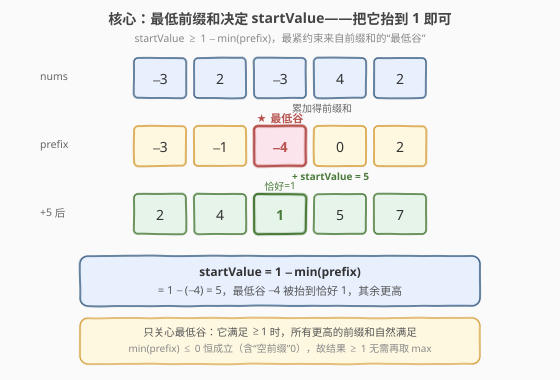
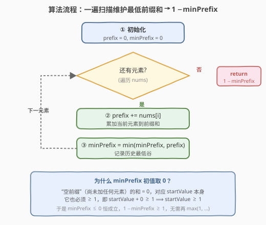
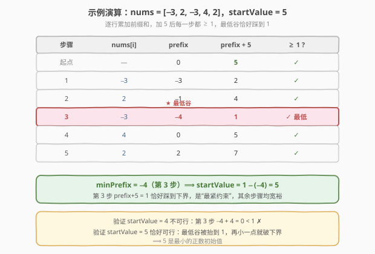

# LeetCode 逐步求和得到正数的最小值 题解

## 1. 题目概述

- **标题 / 题号**：逐步求和得到正数的最小值（#1413，easy）
- **链接**：https://leetcode.cn/problems/minimum-value-to-get-positive-step-by-step-sum/
- **难度**：简单
- **标签**：数组、前缀和、贪心

**题意**：给你一个整数数组 `nums`。请你从某个**正数**初始值 `startValue` 开始，依次将 `nums` 的每个元素累加到当前值上。要求在累加的**每一步**（包括初始值本身），当前值都**严格大于等于 1**。返回满足条件的最小正数 `startValue`。

**示例 1**：

```text
输入：nums = [-3,2,-3,4,2]
输出：5
解释：选择 startValue = 5，逐步累加：
  step 1) 5 + (-3) = 2  ≥ 1 ✓
  step 2) 2 + 2    = 4  ≥ 1 ✓
  step 3) 4 + (-3) = 1  ≥ 1 ✓
  step 4) 1 + 4    = 5  ≥ 1 ✓
  step 5) 5 + 2    = 7  ≥ 1 ✓
若选 startValue = 4，第 3 步得到 4+(-3)+2+(-3) = 0 < 1 ✗，故 4 不可行。
```

**示例 2**：

```text
输入：nums = [1,2]
输出：1
解释：startValue = 1 即可：1+1=2 ≥ 1，2+2=4 ≥ 1。
```

**示例 3**：

```text
输入：nums = [1,-2,-3]
输出：5
解释：startValue = 5：5+1=6，6+(-2)=4，4+(-3)=1 ≥ 1 ✓。
```

**约束**：

- $1 \le \text{nums.length} \le 100$
- $-100 \le \text{nums}[i] \le 100$

> 💡 **关键点**：每一步的当前值 = `startValue + 前缀和`。要让**所有**前缀和加上 `startValue` 后都 $\ge 1$，最紧的约束来自前缀和的**最低谷**——把它抬到 1，其余位置自然满足。这是一道披着「模拟」外衣的**前缀和**题。

## 2. 解题思路

### 2.1 暴力思路：递增枚举 startValue

最直观的做法：从 `startValue = 1` 开始枚举，对每个候选值模拟一遍累加过程，检查是否每步都 $\ge 1$；不满足就 `+1` 重试，直到找到第一个可行的值。

- **正确**：答案一定存在（`startValue` 足够大时必然可行）。
- **低效**：每个候选要 $O(n)$ 验证，最坏要枚举到 $1 - \min(\text{prefix})$ 次。本题数据小（$n \le 100$，元素 $\ge -100$，答案 $\le 10001$）能过，但完全没有利用结构。

> ⚠️ 暴力的浪费在于「**反复模拟整条累加链**」。其实每一步的当前值就是 `startValue + 前缀和`，前缀和是**一次性**就能算好的。把前缀和的最小值抓出来，答案直接闭式给出——无需任何枚举。

### 2.2 核心观察：前缀和的最低谷决定 startValue



设第 $i$ 步（从 0 开始）的前缀和 $P_i = \sum_{k=0}^{i} \text{nums}[k]$，则第 $i$ 步的当前值为：

$$\text{current}_i = \text{startValue} + P_i$$

要求 $\text{current}_i \ge 1$ 对所有 $i$ 成立，等价于：

$$\text{startValue} \ge 1 - P_i \quad \forall i$$

取所有 $i$ 中**最紧**的约束（即 $P_i$ **最小**的那个），就得到：

$$\text{startValue} \ge 1 - \min_i P_i$$

**关键洞察**：把「空前缀」$P_{\text{start}} = 0$（即尚未累加任何元素、当前值就是 `startValue` 本身）也纳入考虑。它要求 `startValue + 0 ≥ 1`，即 `startValue ≥ 1`。于是令：

$$\text{minPrefix} = \min\bigl(\,0,\; \min_i P_i\,\bigr) \le 0$$

则 $\text{startValue} = 1 - \text{minPrefix}$，且因 $\text{minPrefix} \le 0$ 恒成立，结果 $\ge 1$ 自动满足「正数」要求，无需再 `max(1, …)`。

> 💡 **一句话**：只关心前缀和的**最低谷**——最低谷被抬到 1 时，所有更高的位置都 $> 1$，自然满足。`minPrefix` 初值取 0，把 `startValue ≥ 1` 这一约束优雅地折叠进前缀和框架。

> ⚠️ **为什么是 `1 − minPrefix` 而非 `−minPrefix`？** 因为下界是 $\ge 1$（不是 $\ge 0$）。最低谷 `minPrefix` 需被抬到恰好 1，故补值 $= 1 - \text{minPrefix}$。示例 1 中 `minPrefix = −4`，补值 $1 - (-4) = 5$，最低谷 $-4$ 被抬到 $-4 + 5 = 1$，恰好踩线。

### 2.3 算法流程图



**完整步骤**：

1. **初始化** `prefix = 0`，`minPrefix = 0`（初值 0 代表「空前缀」）；
2. **遍历** `nums` 中每个元素 `num`：
   - `prefix += num`（累加得到当前前缀和）；
   - `minPrefix = min(minPrefix, prefix)`（更新历史最低谷）；
3. **返回** `1 - minPrefix`。

> 💡 整个算法只需**一趟扫描**、两个变量，无需存储完整前缀和数组。`minPrefix` 始终 $\le 0$，故 `1 - minPrefix ≥ 1`，天然满足「正数初始值」。

### 2.4 示例演算

以示例 1 的 `nums = [-3, 2, -3, 4, 2]` 为例：



| 步骤 | $\text{nums}[i]$ | $\text{prefix}$ | $\text{prefix} + 5$ | $\ge 1$? |
|------|------------------|-----------------|---------------------|----------|
| 起点 | — | 0 | 5 | ✓ |
| 1 | −3 | −3 | 2 | ✓ |
| 2 | 2 | −1 | 4 | ✓ |
| 3 | −3 | **−4** ★最低谷 | **1** | ✓（恰好踩线） |
| 4 | 4 | 0 | 5 | ✓ |
| 5 | 2 | 2 | 7 | ✓ |

`minPrefix = −4`（第 3 步），`startValue = 1 − (−4) = 5`。第 3 步 `prefix + 5 = 1` 恰好踩到下界，是最紧约束；若 `startValue = 4`，则 $-4 + 4 = 0 < 1$ 失败。

> 以示例 2 的 `nums = [1, 2]` 为例：`prefix` 依次为 `1, 3`，`minPrefix = min(0, 1, 3) = 0`，`startValue = 1 − 0 = 1` ✓。示例 3 的 `nums = [1, -2, -3]`：`prefix` 依次为 `1, -1, -4`，`minPrefix = -4`，`startValue = 5` ✓。

## 3. 参考代码

### C++

```cpp
class Solution {
public:
    int minStartValue(vector<int>& nums) {
        int prefix = 0, minPrefix = 0;
        for (int num : nums) {
            prefix += num;
            minPrefix = min(minPrefix, prefix);
        }
        return 1 - minPrefix;
    }
};
```

### Python

```python
class Solution:
    def minStartValue(self, nums: list[int]) -> int:
        prefix = min_prefix = 0
        for num in nums:
            prefix += num
            min_prefix = min(min_prefix, prefix)
        return 1 - min_prefix
```

> 💡 **实现要点**：① `min_prefix` 初值取 `0` 而非 `float('inf')`——它代表「空前缀」，把 `startValue ≥ 1` 约束折叠进前缀和，省去末尾的 `max(1, …)`。② 一趟扫描、两变量，无需前缀和数组，空间 $O(1)$。③ 返回 `1 - min_prefix`：因 `min_prefix ≤ 0`，结果恒 $\ge 1$。

## 4. 复杂度分析

| 维度 | 前缀和最低谷 $O(n)$（推荐） | 暴力枚举 $O(n \cdot \text{ans})$ |
|------|----------------------------|----------------------------------|
| **时间复杂度** | $O(n)$ | $O(n \cdot \text{ans})$，$\text{ans} \le 10001$ |
| **空间复杂度** | $O(1)$ | $O(1)$ |
| **是否一次扫描** | 是 | 否，每个候选都全量模拟 |
| **数据敏感性** | 与元素值无关 | 答案越大越慢 |

- **前缀和最低谷**：单趟扫描，每个元素做一次加法与一次 `min`，合计 $O(n)$；只额外用 `prefix`、`minPrefix` 两个变量，空间 $O(1)$。是本题的最优解。
- **暴力枚举**：每个候选 $O(n)$ 验证，最坏枚举约 $10^4$ 次，合计 $\sim 10^6$，$n \le 100$ 时毫秒级通过，但理论复杂度劣于前缀和，且未利用任何结构。

> ⚠️ 本题 $n \le 100$、元素 $\ge -100$，两种方法都能过。面试中写出前缀和版即体现对「累加链 = 前缀和 + 偏移」这一结构的把握。

## 5. 扩展：闭式解与「下界」的取法

本题可看作一个更一般的**「偏移量」模型**：给定一条序列 $P_0, P_1, \dots, P_{n-1}$（前缀和），求最小正数偏移 $s$，使 $s + P_i \ge L$ 对所有 $i$ 成立（$L$ 为下界）。闭式解为：

$$s = \max\bigl(L,\; L - \min_i P_i\bigr) = L - \min\bigl(0, \min_i P_i\bigr)$$

- 本题 $L = 1$，故 $s = 1 - \min(0, \min_i P_i)$。
- 若把「空前缀 0」纳入 $\min$，则 $\min(0, \min_i P_i) \le 0$，$s \ge L$ 自动成立，$\max$ 可省。
- 若下界改为 $L = 0$（允许等于 0），则 $s = -\min(0, \min_i P_i) = \max(0, -\min_i P_i)$，退化为「补到非负」。

> 💡 这正是 [1732. 找到最高海拔](https://leetcode.cn/problems/find-the-highest-altitude/) 的镜像问题——1732 求 $\max_i P_i$（最高点），本题求 $1 - \min_i P_i$（把最低点抬到 1）。一升一降，同源前缀和。

## 6. 面试要点

1. **如何想到前缀和？**

   > 每一步的当前值 = `startValue + (nums[0] + … + nums[i])`，括号内正是前缀和。一旦把当前值拆成「偏移 + 前缀和」，问题就从「模拟累加链」变成「找前缀和的最值」——这是 [303. 区域和检索](../0301-0400/303_区域和检索_数组不可变.md) 以来前缀和的经典应用范式。

2. **为什么 `minPrefix` 初值取 0 而不是 `+∞`？**

   > 「空前缀」（尚未累加任何元素）的和为 0，对应当前值就是 `startValue` 本身，它也要求 $\ge 1$，即 `startValue ≥ 1`。把 0 纳入 `minPrefix` 后，这一约束被折叠进 `1 - minPrefix`，因 `minPrefix ≤ 0` 恒成立，结果 $\ge 1$，省去末尾的 `max(1, …)`。若初值取 `+∞` 则漏掉空前缀，需额外 `max(1, 1 - minPrefix)` 兜底。

3. **为什么只看最低谷，不用检查每一步？**

   > 约束 `startValue ≥ 1 - P_i` 对所有 $i$ 成立，等价于 `startValue ≥ max_i(1 - P_i) = 1 - min_i P_i`。最紧约束来自最小的 $P_i$（最低谷）。最低谷被抬到 1 时，所有更高的 $P_i$ 加上同一个 `startValue` 后都 $> 1$，自然满足——**木桶效应**：最短板决定容量。

4. **暴力枚举为什么低效？能给出最坏用例吗？**

   > 暴力对每个候选 `startValue` 全量模拟 $O(n)$。最坏用例：`nums = [-100, -100, …, -100]`（100 个 -100），前缀和一路下探到 -10000，`startValue` 要枚举到 10001，合计 $\sim 10^6$ 次操作。前缀和法只需 100 次加法，差距来自是否利用「前缀和一次算清」这一结构。

5. **本题与 [1732. 找到最高海拔](https://leetcode.cn/problems/find-the-highest-altitude/) 的关系？**

   > 1732 给定 `gain` 数组，求前缀和的**最大值**（最高海拔）；1413 求把前缀和**最小值**抬到 1 所需的偏移。两者同源前缀和，一求 `max` 一求 `min`，互为镜像。掌握其一即可秒杀另一题。

> 💡 **一句话总结**：1413 的灵魂是「**前缀和的最低谷决定偏移量**」——一趟扫描维护 `minPrefix`（初值 0 折叠 `startValue ≥ 1` 约束），返回 `1 - minPrefix`。$O(n)$ 时间、$O(1)$ 空间，闭式解无需枚举。

## 同类练习题

| # | 题目 | 与本题的关联 |
|---|------|-------------|
| 1732 | [找到最高海拔](https://leetcode.cn/problems/find-the-highest-altitude/) | 镜像题，给定 gain 数组求前缀和的**最大值**（最高海拔），对照 1413 求前缀和**最小值**的偏移，同源前缀和一升一降 |
| 303 | [区域和检索 - 数组不可变](../0301-0400/303_区域和检索_数组不可变.md) | 前缀和模板题，预处理前缀和数组支持 $O(1)$ 区间和查询，是 1413「把累加链拆成偏移 + 前缀和」的母题 |
| 724 | [寻找数组的中心下标](../0701-0800/724_寻找数组的中心下标.md) | 前缀和应用题，用左侧和 = 右侧和（总和 − 前缀和）找中心点，对照 1413「前缀和最值定答案」的另一种用法 |
| 53 | [最大子数组和](../0001-0100/53_最大子数组和.md) | 前缀和衍生题，用「当前前缀和 − 历史最小前缀和」求最大子数组和，对照 1413 维护「历史最小前缀和」的同一技巧 |
| 525 | [连续数组](../0501-0600/525_连续数组.md) | 前缀和 + 哈希进阶，把 0 当 -1 转换后存最早下标，承接 1413 对前缀和的灵活定义 |
