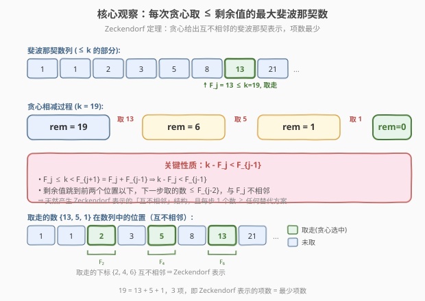
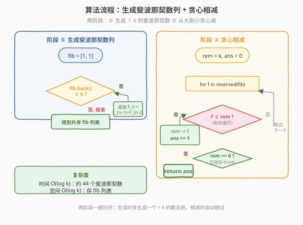
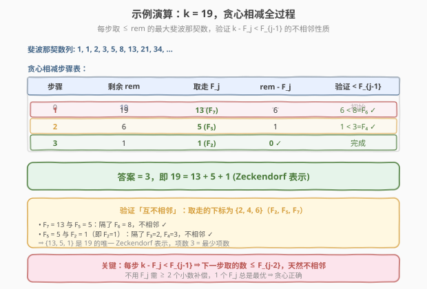

# LeetCode 和为 K 的最少斐波那契数字数目 题解

## 1. 题目概述

- **标题 / 题号**：和为 K 的最少斐波那契数字数目（#1414，medium）
- **链接**：https://leetcode.cn/problems/find-the-minimum-number-of-fibonacci-numbers-whose-sum-is-k/
- **难度**：中等
- **标签**：贪心、数学、斐波那契

**题意**：给定一个正整数 `k`，返回**和为 `k` 的最少斐波那契数字数目**。同一个斐波那契数字可以**使用多次**。

斐波那契数列定义如下：

- $F_1 = 1,\ F_2 = 1$
- $F_n = F_{n-1} + F_{n-2}$（$n > 2$）

即数列为 `1, 1, 2, 3, 5, 8, 13, 21, 34, 55, ...`。

**示例 1**：

```text
输入：k = 7
输出：2
解释：Fibonacci 数 <= 7 的有 1, 1, 2, 3, 5
      7 = 5 + 2，用到 2 个斐波那契数字，是最少数目。
```

**示例 2**：

```text
输入：k = 10
输出：2
解释：10 = 8 + 2，用到 2 个斐波那契数字。
```

**示例 3**：

```text
输入：k = 19
输出：3
解释：19 = 13 + 5 + 1，用到 3 个斐波那契数字。
```

**约束**：

- $1 \le k \le 10^9$

> 💡 本题本质是一道**贪心**题。核心观察：**每次取不超过剩余值的最大斐波那契数**，反复相减直到剩余为 0，所需次数即为答案。这背后是著名的 **Zeckendorf 定理**——每个正整数都可以唯一地表示为若干个**互不相邻**的斐波那契数之和，而贪心策略恰好给出这个表示，且项数最少。

## 2. 解题思路

### 2.1 暴力思路：完全背包 / DP

把"用最少数量的斐波那契数字凑成和 `k`"看成一个**完全背包求最少硬币数**问题（硬币面值 = 所有 $\le k$ 的斐波那契数，每种可用无限次，目标金额 `k`，求最少硬币数）。

令 `dp[i]` = 凑出和 `i` 所需的最少斐波那契数字数，则：

$$
\text{dp}[i] = \min_{F \le i} \big(\text{dp}[i - F] + 1\big), \quad \text{dp}[0] = 0
$$

斐波那契数 $\le 10^9$ 的约有 44 个，`dp` 数组大小 $10^9$——**空间爆炸**，不可行。即使 `k` 较小，$O(k \cdot 44)$ 的时间也不理想。

### 2.2 核心观察：贪心 —— 每次取最大斐波那契数



**贪心策略**：设剩余值为 `rem`（初始 `rem = k`），每一步取**不超过 `rem` 的最大斐波那契数** $F_j$，令 `rem -= F_j`，计数 `+1`，直到 `rem = 0`。

**为什么贪心正确？** 关键在于以下两个性质：

**性质 1（剩余严格缩小到不相邻位）**：设 $F_j \le k < F_{j+1}$，由于 $F_{j+1} = F_j + F_{j-1}$，有：

$$
k - F_j < F_{j+1} - F_j = F_{j-1}
$$

即**剩余值 $k - F_j < F_{j-1}$**。这意味着下一步贪心选取的斐波那契数 $\le F_{j-2}$，与 $F_j$ **至少隔了一位**——天然产生 Zeckendorf 表示中的"不相邻"结构。

**性质 2（不用 $F_j$ 不会更优）**：若某方案不取 $F_j$，则只能用 $\le F_{j-1}$ 的数凑 $k \ge F_j$。单个 $F_{j-1} < F_j$ 不足以覆盖，至少需要 **2 个数**才能凑到 $F_j$ 的量级；而直接取 $F_j$ 只需 **1 个数**。再由性质 1，剩余 $k - F_j$ 的最优解独立递归，故贪心每步都不劣于任何其他选择。

> ⚠️ **注意**：题目允许同一个斐波那契数字重复使用，但贪心产生的 Zeckendorf 表示天然**不重复**（不相邻 ⇒ 不重复），项数已最少，重复使用不会带来更优解。

### 2.3 算法流程图



1. **生成斐波那契数列**：从 $F_1=1, F_2=1$ 开始，不断追加 $F_n = F_{n-1}+F_{n-2}$，直到某个 $F_n > k$ 停止。得到所有 $\le k$ 的斐波那契数（升序排列）。
2. **贪心相减**：从**最大**的斐波那契数开始倒序扫描，若 $F \le \text{rem}$，则 `rem -= F`，`ans += 1`。
3. 当 `rem == 0` 时返回 `ans`。

> 💡 **实现技巧**：贪心相减时不需要二分找"最大 $\le$ rem 的斐波那契数"——直接从大到小遍历即可。因为每取走一个 $F_j$，剩余值就缩小到 $< F_{j-1}$，后续更大的数自然不会再被选中，一趟倒序扫描即可，总计 $O(\text{斐波那契数个数}) = O(\log k)$。

### 2.4 示例演算

以 `k = 19` 为例。先生成 $\le 19$ 的斐波那契数列：`1, 1, 2, 3, 5, 8, 13`。



| 步骤 | 剩余 rem | 取走的斐波那契数 F | rem − F | 计数 |
|------|---------|-------------------|---------|------|
| 0 | 19 | — | — | 0 |
| 1 | 19 | 13 | 6 | 1 |
| 2 | 6 | 5 | 1 | 2 |
| 3 | 1 | 1 | 0 | 3 |

**答案 = 3**，即 $19 = 13 + 5 + 1$。✓

> 💡 **验证性质 1**：第 1 步取 13，剩余 $19 - 13 = 6 < 8 = F_6$（13 的前一个），下一步只能取 $\le 5$ 的数，与 13 不相邻。第 2 步取 5，剩余 $6 - 5 = 1 < 3 = F_4$（5 的前一个），与 5 不相邻。最终得到 $\{13, 5, 1\}$——恰好是 19 的 Zeckendorf 表示（互不相邻）。

## 3. 参考代码

### C++

```cpp
// 和为K的最少斐波那契数字数目.cpp —— 贪心 + Zeckendorf 定理
// 编译: g++ -O2 -std=c++17 和为K的最少斐波那契数字数目.cpp -o fibsum
class Solution {
public:
    int findMinFibonacciNumbers(int k) {
        // 1. 生成所有 <= k 的斐波那契数
        vector<int> fib = {1, 1};
        while (fib.back() <= k) {
            fib.push_back(fib.back() + fib[fib.size() - 2]);
        }
        // 2. 从大到小贪心相减
        int ans = 0, rem = k;
        for (int i = (int)fib.size() - 1; i >= 0 && rem > 0; --i) {
            if (fib[i] <= rem) {
                rem -= fib[i];
                ++ans;
            }
        }
        return ans;
    }
};
```

### Python

```python
class Solution:
    def findMinFibonacciNumbers(self, k: int) -> int:
        # 1. 生成所有 <= k 的斐波那契数
        fib = [1, 1]
        while fib[-1] <= k:
            fib.append(fib[-1] + fib[-2])
        # 2. 从大到小贪心相减
        ans = 0
        rem = k
        for f in reversed(fib):
            if f <= rem:
                rem -= f
                ans += 1
            if rem == 0:
                break
        return ans
```

> 💡 **实现细节**：① 生成斐波那契数列时用 `while fib.back() <= k` 多生成一个 `> k` 的数也无妨，相减时会被跳过。② 贪心相减从大到小遍历，无需二分——由性质 1，每取一个数后剩余值跳到不相邻位，更大的数自动失效。③ `k ≤ 10⁹` 时斐波那契数约 44 个，循环常数极小。

## 4. 复杂度分析

| 维度 | 复杂度 | 说明 |
|------|--------|------|
| **时间** | $O(\log k)$ | 生成 $\le k$ 的斐波那契数约 $\log_\phi k \approx 44$ 个（$k = 10^9$ 时）；贪心相减同样遍历约 44 个，总体线性于斐波那契数个数 |
| **空间** | $O(\log k)$ | 存储斐波那契数列表，约 44 个 `int`；若边生成边贪心可压到 $O(1)$ 额外空间 |
| **思路** | 贪心 + Zeckendorf 定理 | 关键观察：剩余 $k - F_j < F_{j-1}$ 保证不相邻结构与贪心最优性 |

> ⚠️ 对比完全背包 DP 的 $O(k \cdot \log k)$，贪心把指数级的 $k$ 降为对数级的 $\log k$，这是"贪心选择性质"带来的巨大优势。$k = 10^9$ 时背包完全不可行，贪心瞬间完成。

## 5. 扩展：Zeckendorf 定理与贪心正确性证明

### 5.1 Zeckendorf 定理

> **定理**（Zeckendorf, 1972）：每个正整数 $n$ 都可以**唯一**地表示为若干个**互不相邻**的斐波那契数之和（使用 $F_2=1, F_3=2, F_4=3, F_5=5, \dots$，不含重复的 $F_1$）。

**贪心算法恰好给出这个 Zeckendorf 表示**：每步取最大 $\le$ 剩余值的斐波那契数，由性质 1 保证取走的数互不相邻。

### 5.2 贪心最优性的形式化证明

**定理**：贪心策略给出的项数 = 最少项数（即使允许重复使用同一个斐波那契数）。

**证明**（对 $k$ 施加强归纳）：

- **基础**：$k = 1$，贪心取 $F_2 = 1$，项数 1，显然最少。✓

- **归纳步**：设 $F_j \le k < F_{j+1}$，贪心取 $F_j$ 后剩余 $k' = k - F_j$。由性质 1，$k' < F_{j-1}$。由归纳假设，$\text{greedy}(k')$ 是 $k'$ 的最少项数。

  设 $\text{OPT}$ 是 $k$ 的一个最优表示（项数最少），分两种情况：

  **情况 1**：$\text{OPT}$ 含 $F_j$。去掉 $F_j$ 后得到 $k'$ 的一个合法表示，故 $|\text{OPT}| - 1 \ge \text{greedy}(k')$，即 $|\text{OPT}| \ge 1 + \text{greedy}(k') = \text{greedy}(k)$。✓

  **情况 2**：$\text{OPT}$ 不含 $F_j$（也不含任何 $> F_j$ 的数，因为它们 $> k$），所有项 $\le F_{j-1}$。
  - 若 $k = F_j$：单个 $\le F_{j-1}$ 的数无法凑出 $F_j$，至少需 $2$ 项（$F_{j-1} + F_{j-2} = F_j$），而 $\text{greedy}(F_j) = 1$，故 $|\text{OPT}| \ge 2 > 1 = \text{greedy}(k)$。✓
  - 若 $k > F_j$：$k' > 0$。$\text{OPT}$ 全用 $\le F_{j-1}$ 的数凑 $k$。将 $\text{OPT}$ 的项分为"凑 $F_j$ 部分"和"凑 $k'$ 部分"：由于每项 $\le F_{j-1} < F_j$，凑出 $F_j$ 至少需 $2$ 项；剩余 $k'$ 部分至少需 $\text{greedy}(k')$ 项（归纳假设）。故 $|\text{OPT}| \ge 2 + \text{greedy}(k') \ge 1 + \text{greedy}(k') = \text{greedy}(k)$。✓

  > 这里"凑 $F_j$ 至少需 2 项"的严格化：把 $\text{OPT}$ 中所有 $\le F_{j-1}$ 的项按贪心归约，任何 $\le F_{j-1}$ 的单项 $< F_j$，故覆盖 $F_j$ 的份额至少需 $2$ 项。加上 $k'$ 部分的归纳下界，总数 $\ge 2 + \text{greedy}(k') > 1 + \text{greedy}(k')$。

综上，$\text{greedy}(k) \le |\text{OPT}|$ 对任意 $\text{OPT}$ 成立，贪心最优。$\blacksquare$

### 5.3 为什么允许重复不会更优？

贪心产生 Zeckendorf 表示（不相邻 ⇒ 不重复）。若某方案用了重复项 $2 \cdot F_i$，可做归约：

$$
2 F_i = F_i + F_i = (F_{i-1} + F_{i-2}) + F_i = F_{i+1} + F_{i-2}
$$

该归约**不增加项数**（$2 \to 2$），但把重复项推向更大的不相邻项。反复归约最终收敛到 Zeckendorf 表示，项数只减不增。故重复使用不会比贪心更优。

## 6. 面试要点

1. **为什么贪心取最大斐波那契数是最优的？**

   > 关键性质：$F_j \le k < F_{j+1} = F_j + F_{j-1}$，所以 $k - F_j < F_{j-1}$。不用 $F_j$ 则只能用 $\le F_{j-1}$ 的数凑 $k \ge F_j$，至少需 2 项；取 $F_j$ 只需 1 项且剩余独立递归。由归纳法，贪心每步不劣于其他选择。

2. **Zeckendorf 定理是什么？和本题有什么关系？**

   > 每个正整数可唯一表示为互不相邻的斐波那契数之和。贪心算法恰好产生这个 Zeckendorf 表示，且其项数即为最少项数。本题本质就是求 Zeckendorf 表示的项数。

3. **题目允许重复使用斐波那契数，重复会不会更优？**

   > 不会。重复项 $2F_i$ 可归约为 $F_{i+1} + F_{i-2}$（项数不变），反复归约收敛到 Zeckendorf 表示，项数只减不增。故 Zeckendorf 表示（不重复）已是最优。

4. **为什么不用完全背包 DP？**

   > 完全背包 DP 空间 $O(k)$、时间 $O(k \cdot \log k)$，$k = 10^9$ 时空间爆炸。而贪心利用斐波那契数的结构性质，将复杂度降到 $O(\log k)$，远优于 DP。

5. **时间空间复杂度？**

   > 时间 $O(\log k)$：$\le k$ 的斐波那契数约 $\log_\phi k \approx 44$ 个（$k = 10^9$），生成和贪心各遍历一次。空间 $O(\log k)$ 存斐波那契列表，可优化到 $O(1)$（边生成边贪心）。

> 💡 **一句话总结**：1414 是"贪心 + Zeckendorf 定理"——每次取不超过剩余值的最大斐波那契数，剩余 $k - F_j < F_{j-1}$ 保证不相邻结构，归纳可证贪心最优，$O(\log k)$ 一趟扫完。

## 同类练习题

| # | 题目 | 与本题的关联 |
|---|------|-------------|
| 322 | [零钱兑换](https://leetcode.cn/problems/coin-change/)（[题解](../0301-0400/322_零钱兑换.md)） | 完全背包求最少硬币数，对照本题贪心如何利用面值的特殊结构（斐波那契）把 DP 降为贪心 |
| 279 | [完全平方数](https://leetcode.cn/problems/perfect-squares/) | 完全背包求最少平方数之和，与本题同为"最少数目求和"问题，但平方数无贪心性质须 DP |
| 343 | [整数拆分](https://leetcode.cn/problems/integer-break/)（[题解](../0301-0400/343_整数拆分.md)） | 切分型 DP + 数学贪心（切成 3 最优），同为"利用数学结构优化贪心"的思路 |
| 509 | [斐波那契数](https://leetcode.cn/problems/fibonacci-number/)（[题解](../0501-0600/509_斐波那契数.md)） | 斐波那契数列基础题，理解数列生成方式是本题的前置 |
| 264 | [丑数 II](https://leetcode.cn/problems/ugly-number-ii/)（[题解](../0201-0300/264_丑数II.md)） | 三指针多路归并生成序列，对照本题斐波那契数列的生成方式 |
