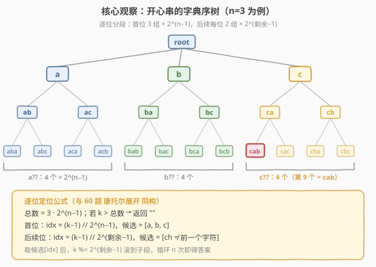
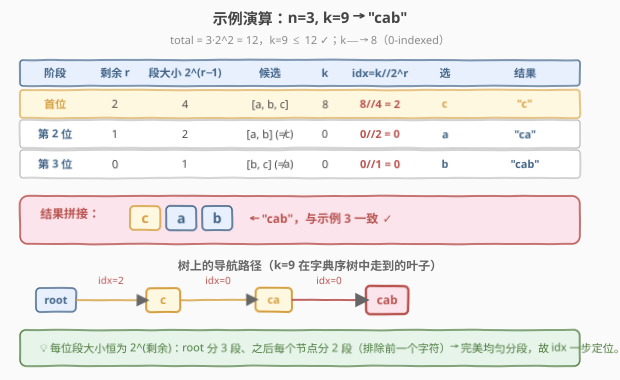

# LeetCode 长度为 n 的开心字符串中字典序第 k 小的字符串 题解

## 1. 题目概述

- **标题 / 题号**：长度为 n 的开心字符串中字典序第 k 小的字符串（#1415，medium）
- **链接**：https://leetcode.cn/problems/the-k-th-lexicographical-string-of-all-happy-strings-of-length-n/
- **难度**：中等
- **标签**：字符串、回溯、数学、康托尔展开（逐位构造）

**题意**：一个「开心字符串」定义为：

- 仅包含小写字母 `['a', 'b', 'c']`；
- 对所有 $i \in [1, \text{len}-1]$，满足 $s[i] \neq s[i+1]$（**相邻两字符不同**）。

例如 `"abc"`、`"ac"`、`"b"`、`"abcbabcbcb"` 都是开心字符串；`"aa"`、`"baa"`、`"ababbc"` 都不是。

给定整数 $n$ 和 $k$，把**长度为 $n$** 的所有开心字符串按**字典序**排序，返回第 $k$ 个；若不足 $k$ 个，返回 `""`。

**示例 1**：

```text
输入：n = 1, k = 3
输出："c"
解释：长度为 1 的开心字符串共 3 个 ["a", "b", "c"]，第 3 个为 "c"。
```

**示例 2**：

```text
输入：n = 1, k = 4
输出：""
解释：长度为 1 的开心字符串只有 3 个，不足 4 个。
```

**示例 3**：

```text
输入：n = 3, k = 9
输出："cab"
解释：长度为 3 的开心字符串共 12 个：
["aba","abc","aca","acb","bab","bac","bca","bcb","cab","cac","cba","cbc"]
第 9 个为 "cab"。
```

**示例 4**：

```text
输入：n = 2, k = 7
输出：""
```

**示例 5**：

```text
输入：n = 10, k = 100
输出："abacbabacb"
```

**约束**：

- $1 \le n \le 10$
- $1 \le k \le 100$

> 💡 **核心约束翻译**：「相邻字符不同」意味着：第 1 位有 3 种选择（`a`/`b`/`c`），其后每一位只要**不与前一位相同**即可，各有 2 种选择。因此长度为 $n$ 的开心字符串总数恒为 $3 \cdot 2^{n-1}$。这一恒定的「均匀分段」结构，是本题能用「逐位定位」替代「回溯枚举」的关键——与 [60. 第 k 个排列](../0001-0100/60_第k个排列.md) 的康托尔展开**完全同构**。

## 2. 解题思路

### 2.1 暴力思路：回溯枚举到第 k 个

最直觉的做法：套用 [46. 全排列](../0001-0100/46_全排列.md) 的回溯模板，**按字典序**（每位按 `a < b < c` 顺序尝试、跳过与前一位相同者）DFS 生成所有开心字符串，收集到第 $k$ 个即停。

- 第 1 位 3 种选择，其后每位 2 种选择，总数 $3 \cdot 2^{n-1}$；
- $n=10$ 时总数 $= 3 \cdot 2^9 = 1536$，回溯**完全可行**，配上「收集满 $k$ 个就剪枝返回」更快。

> ⚠️ **核心浪费**：我们**只要第 k 个**，却从第 1 个开始逐个生成。尽管 $n \le 10$ 让暴力也能 AC，但题目本质是一个**字典序树上的均匀分段**问题——能否像 [60 题](../0001-0100/60_第k个排列.md) 那样，根据 $k$ **直接算出每一位填什么**，跳过前 $k-1$ 个？这正是下面的构造法。

### 2.2 核心观察：构造法——开心串字典序树上的「康托尔展开」



**关键观察**：长度为 $n$ 的所有开心字符串，可看作一棵**深度为 $n$ 的字典序树**（trie）的叶子：

- **根**有 3 个子节点 `a`、`b`、`c`（首位）；
- **之后每个节点**恰好有 2 个子节点——即 `[a, b, c]` 中**排除前一个字符**后的那两个（保持字典序）；
- **每个深度相同子树**的叶子数**完全相等** $= 2^{\text{剩余位数}}$。

因此叶子按字典序排列时，**每一位都把序列均匀分段**：

| 位置 | 候选数 | 每段大小 | 段数 |
|------|--------|----------|------|
| 第 1 位（首位） | 3 | $2^{n-1}$ | 3 |
| 第 2 位 | 2 | $2^{n-2}$ | $3 \times 2$ |
| 第 $i$ 位 | 2 | $2^{n-i}$ | $3 \times 2^{i-1}$ |
| 第 $n$ 位（末位） | 2 | $2^{0}=1$ | $3 \times 2^{n-1}$（每个段就是 1 个串） |

给定 $k$（1-indexed），**每一位选谁**可一步算出：

$$\text{idx} = \left\lfloor \frac{k-1}{2^{\text{剩余位数}}} \right\rfloor$$

其中「剩余位数」= 当前位之后还要填的位数（首位时为 $n-1$，末位时为 $0$）。

> 💡 **为什么是 $k-1$？** 与 60 题完全同理：$k$ 是 1-indexed，而候选下标 `idx` 是 0-indexed。$k-1$ 把「第 k 个」对齐到「前 $k-1$ 个的计数」，再除以段大小取整即得段号。若在循环前**先做一次 `k--`**（转 0-indexed），循环内就是干净的 `idx = k // 2^r`、`k %= 2^r`。

**与 60 题康托尔展开的对照**：

| 维度 | 60 题（全排列） | **1415（开心串）** |
|------|----------------|---------------------|
| 候选集 | $n$ 个数字，每轮删 1 个 | 首位 `[a,b,c]`；后续 `[ch ≠ prev]` |
| 段大小 | $(n-1)!$、$(n-2)!$ …（阶乘递减） | $2^{n-1}$、$2^{n-2}$ …（2 的幂递减） |
| 每位候选数 | 递减（$n, n-1, \dots, 1$） | 首位 3，之后恒为 2 |
| 每轮删除 | `candidates.erase(idx)` $O(n)$ | **无需删除**，靠「排除前一个字符」即时生成候选 $O(1)$ |
| 总复杂度 | $O(n^2)$ | **$O(n)$** |

> 💡 1415 比 60 题更简单：候选数恒为 2（首位 3），段大小是 2 的幂，**无需维护动态候选列表**，每轮用 `[c for c in "abc" if c != prev]` 即时生成。本质是把 $k-1$ 写成「2 的幂加权和」，每位系数 $\in \{0,1\}$（首位 $\in \{0,1,2\}$）——可看作一种**受限的阶乘进制**。

**总数预判**：若 $k > 3 \cdot 2^{n-1}$，直接返回 `""`，无需进入构造。

### 2.3 算法流程图


**完整步骤**：

1. **算总数**：$\text{total} = 3 \cdot 2^{n-1}$；若 $k > \text{total}$，返回 `""`。
2. **预减 $k$**：`k--`，转 0-indexed（语义 = 目标串之前有多少个串）。
3. **首位**：`idx = k // 2^(n-1)`，取 `[a,b,c][idx]`；`k %= 2^(n-1)`；记 `prev`。
4. **循环** $i$ 从 $n-2$ 降到 $0$：
   - 生成候选 `cand = [c for c in "abc" if c != prev]`（恒 2 个，保持字典序）；
   - `idx = k // 2^i`；取 `cand[idx]`；`k %= 2^i`；更新 `prev`。
5. 返回拼接结果。

> 💡 **关键不变量**：每轮的 `k` 始终是「当前子段内 0-indexed 偏移」，`k %= 2^i` 把它滚动到下一层子段，等价于 `k -= idx * 2^i`。与 60 题的 `k %= fact` 完全同理。

### 2.4 示例演算

以示例 3 `n=3, k=9` 为例（$\text{total} = 3 \cdot 2^2 = 12$，$k=9 \le 12$ ✓，`k-- → 8`），逐步追踪：



| 阶段 | 剩余 $r$ | 段大小 $2^r$ | 候选 | $k$ | $\text{idx}=k//2^r$ | 选 | 结果 |
|------|----------|--------------|------|-----|---------------------|----|----|
| 首位 | 2 | 4 | `[a, b, c]` | 8 | $8//4 = 2$ | c | `"c"` |
| 第 2 位 | 1 | 2 | `[a, b]`（≠c） | 0 | $0//2 = 0$ | a | `"ca"` |
| 第 3 位 | 0 | 1 | `[b, c]`（≠a） | 0 | $0//1 = 0$ | b | `"cab"` |

- **首位**：$8 // 4 = 2$ → 选 `[a,b,c][2] = c`；$k = 8 \% 4 = 0$（落入 c 子树的第 0 个，即 `"ca??"` 4 个串中的第 0 个）。
- **第 2 位**：前一位是 c，候选 `[a, b]`；$0 // 2 = 0$ → 选 a；$k = 0$。
- **第 3 位**：前一位是 a，候选 `[b, c]`；$0 // 1 = 0$ → 选 b。

最终 `"cab"`，与示例 3 一致 ✓。

> 💡 **对比示例 5** `n=10, k=100`：$\text{total}=1536$，$k-1=99$。首位 $99//512=0$ → `a`；之后逐位 $99//256, 99//128 \dots$ 多为 0，直到第 4 位 $35//64=1$ 切换到候选第 2 个……每一步都由 `idx` 直接定位，无需生成前 99 个串。结果 `"abacbabacb"` ✓。

## 3. 参考代码

### C++（构造法，$O(n)$）

```cpp
class Solution {
public:
    string getHappyString(int n, int k) {
        int total = 3;
        for (int i = 1; i < n; i++) total <<= 1;   // total = 3 * 2^(n-1)
        if (k > total) return "";

        k--;                                         // 1-indexed -> 0-indexed
        string chars = "abc";
        string ans;
        char prev = 0;
        for (int i = 0; i < n; i++) {
            int rem = n - 1 - i;                     // 当前位之后的剩余位数
            int seg = 1 << rem;                      // 段大小 = 2^rem
            string cand;                             // 候选：排除前一个字符，保持字典序
            for (char c : chars) if (c != prev) cand.push_back(c);
            int idx = k / seg;
            ans.push_back(cand[idx]);
            prev = cand[idx];
            k %= seg;                                // 滚到子段内
        }
        return ans;
    }
};
```

### Python（构造法，$O(n)$）

```python
class Solution:
    def getHappyString(self, n: int, k: int) -> str:
        total = 3 * (1 << (n - 1))
        if k > total:
            return ""

        k -= 1                                       # 1-indexed -> 0-indexed
        chars = "abc"
        ans = []
        prev = ""
        for i in range(n):
            seg = 1 << (n - 1 - i)                   # 段大小 = 2^rem
            cand = [c for c in chars if c != prev]   # 候选（恒 2 个，首位 3 个）
            idx = k // seg
            ans.append(cand[idx])
            prev = cand[idx]
            k %= seg
        return "".join(ans)
```

> 💡 **实现要点**：① 候选**即时生成** `[c for c in "abc" if c != prev]`，无需维护动态候选列表（对比 60 题每轮 `erase`）。② `prev` 初始为空字符/`0`，保证首位 3 个候选全部保留。③ `seg = 1 << (n-1-i)` 即 $2^{\text{剩余位数}}$，末位 `seg=1`，`idx` 必为 0，自然收尾。

> ⚠️ **常见错误**：忘记 `k--` 会导致 1-indexed 与 0-indexed 错位——例如 `n=3, k=1`（应为 `"aba"`）若用 `k // 4 = 0` 似乎也对，但 `k=4`（应为 `"acb"`）会算成 `4//4=1` 选 `b`（错），而正确的是 `(4-1)//4 = 0` 选 `a`。预减一次 `k` 后循环内统一用 0-indexed 即无此患。

## 4. 复杂度分析

| 维度 | 复杂度 | 说明 |
|------|--------|------|
| 时间复杂度 | $O(n)$ | 外层 $n$ 轮；每轮生成候选（遍历 3 个字符）+ 一次除法/取模，均为 $O(1)$ |
| 空间复杂度 | $O(n)$ | 结果字符串 $O(n)$；候选串长度 $\le 3$ 为 $O(1)$ |

> 💡 **与暴力回溯对比**：回溯法最坏生成 $3 \cdot 2^{n-1}$ 个串、每个 $O(n)$，总时间 $O(n \cdot 2^{n-1})$；$n=10$ 时约 $1.5 \times 10^4$ 次操作（仍可 AC）。构造法 $O(n) = 10$ 次操作，**快约 1500 倍**，且不受 $n$ 增长影响（若 $n$ 放宽到 $10^5$，只有构造法可行）。这正是「用数学结构换搜索成本」的又一范例——与 60 题把 $O(n \cdot n!)$ 降为 $O(n^2)$ 同出一辙。

## 5. 扩展：回溯法（DFS 早停）

当 $n$ 较小（$\le 10$）时，回溯法代码更直白、面试中可作为「先写对再优化」的第一版。关键是**按字典序尝试** + **收集满 $k$ 个即全局剪枝**：

### Python（回溯 + 早停）

```python
class Solution:
    def getHappyString(self, n: int, k: int) -> str:
        chars = "abc"
        res = []

        def dfs(path: list) -> None:
            if len(res) >= k:          # 已收满 k 个，全局剪枝
                return
            if len(path) == n:
                res.append("".join(path))
                return
            for c in chars:            # 按 a<b<c 字典序尝试
                if path and path[-1] == c:
                    continue           # 相邻相同，跳过
                path.append(c)
                dfs(path)
                path.pop()

        dfs([])
        return res[k - 1] if len(res) >= k else ""
```

### C++（回溯 + 早停）

```cpp
class Solution {
public:
    string getHappyString(int n, int k) {
        string chars = "abc";
        vector<string> res;
        string path;
        function<void()> dfs = [&]() {
            if ((int)res.size() >= k) return;       // 全局剪枝
            if ((int)path.size() == n) { res.push_back(path); return; }
            for (char c : chars) {
                if (!path.empty() && path.back() == c) continue;
                path.push_back(c);
                dfs();
                path.pop();
            }
        };
        dfs();
        return (int)res.size() >= k ? res[k - 1] : "";
    }
};
```

> 💡 **早停剪枝的价值**：无剪枝时回溯遍历整棵树 $O(3 \cdot 2^{n-1})$；加上 `len(res) >= k` 全局剪枝后，最多生成前 $k$ 个串即停，$k \le 100$ 时实际只访问 $O(k \cdot n)$ 个节点——比 $1536$ 个全量生成快一个量级。但本质仍是「逐个生成」，构造法 $O(n)$ 的优势在 $k$ 较大或 $n$ 放宽时才决定性。

> ⚠️ **回溯必须按字典序尝试**：候选循环 `for c in "abc"` 严格按 `a < b < c` 顺序，DFS 先访问的叶子字典序更小。若打乱顺序（如 `for c in "cba"`），收集到的 `res` 不再是字典序，`res[k-1]` 就错了。构造法天然保证字典序——候选 `[c for c in "abc" if c != prev]` 已是有序的。

## 6. 面试要点

1. **总数为什么是 $3 \cdot 2^{n-1}$？**

   > 第 1 位有 3 种选择（`a`/`b`/`c`）；其后每一位只需「不与前一位相同」，各有 2 种选择。共 $n-1$ 个「2 选择」位，由乘法原理得 $3 \cdot 2^{n-1}$。这也给出越界判定：$k > 3 \cdot 2^{n-1}$ 时直接返回 `""`。

2. **为什么构造法每段大小恰好是 $2^{\text{剩余}}$？**

   > 因为字典序树是**完美均匀**的：首位 3 个子节点，之后每个节点恒有 2 个子节点（排除前一个字符）。任意深度相同的子树，叶子数都等于 $2^{\text{该子树高度}}$。所以每一位把序列均分成相等的段，`idx = k // 段大小` 一步定位。对比 60 题，全排列的段大小是阶乘（因为候选数递减 $n, n-1, \dots$），而本题候选数恒为 2，段大小是 2 的幂——更规整、更简单。

3. **为什么代码里只减一次 `k--`，循环内不用再减？**

   > 循环外 `k--` 把 $k$ 转成 0-indexed（语义 = 目标串之前有多少个串）。此后每轮 `idx = k // seg`、`k %= seg`，$k$ 始终保持 0-indexed 语义滚动到子段。这与「循环内每轮 `(k-1)//seg`、`k -= idx*seg`」完全等价，只是把重复的减 1 提到循环外做一次，循环体更干净。与 60 题的处理一模一样。

4. **和 60 题（第 k 个排列）的联系与区别？**

   > 两者都是「字典序树逐位定位」——把 $k-1$ 写成一种**混合进制**，每位系数决定取候选的第几个。区别在候选结构：60 题每轮从动态候选列表删除一个元素（$O(n)$，总计 $O(n^2)$），候选数递减；1415 候选数恒为 2，靠「排除前一个字符」即时生成（$O(1)$，总计 $O(n)$），更简单。可把 1415 视为 60 题在「固定字符集 + 相邻不同」约束下的**特化版**。

5. **回溯法和构造法分别什么时候用？**

   > $n \le 10$ 时两者都能 AC。回溯法直白、易写对，适合作为「先写对」的第一版，配合 `len(res) >= k` 早停剪枝实际访问 $O(kn)$ 节点。构造法 $O(n)$ 最优，且当 $n$ 放宽（如 $n \le 10^5$）时是唯一可行解。面试策略：先讲回溯建立直觉，再点出「均匀分段」观察升级为构造法，与 60 题康托尔展开呼应——展示「从搜索到数学」的优化路径。

## 同类练习题

| # | 题目 | 与本题的关联 |
|---|------|-------------|
| 60 | [第 k 个排列](https://leetcode.cn/problems/permutation-sequence/)（[站内题解](../0001-0100/60_第k个排列.md)） | 同属「字典序树逐位定位 / 康托尔展开」，段大小为阶乘、候选数递减，1415 是其在「固定字符集 + 相邻不同」下的特化版（段大小为 2 的幂、候选恒 2） |
| 1405 | [最长快乐字符串](https://leetcode.cn/problems/longest-happy-string/)（[站内题解](1405_最长快乐字符串.md)） | 同属「`abc` 构造字符串」家族，但目标是「最长」（贪心按频率放置，允许连续 2 个），1415 是「第 k 个字典序」（构造法逐位定位，要求相邻不同）——一贪心一数学，对照鲜明 |
| 46 | [全排列](https://leetcode.cn/problems/permutations/)（[站内题解](../0001-0100/46_全排列.md)） | 回溯生成全排列的母题；1415 的回溯解法是其「字符集固定为 abc + 相邻不同约束」的变体 |
| 1291 | [顺次数](https://leetcode.cn/problems/sequential-digits/) | 同为「按字典序枚举满足数字约束的序列」，可用回溯或构造；体会「字典序树」在数字序列上的同构应用 |
| 17 | [电话号码的字母组合](https://leetcode.cn/problems/letter-combinations-of-a-phone-number/) | 每位候选由前驱约束（数字键映射）的回溯生成，与 1415 回溯版结构相近，巩固「逐位回溯 + 候选随前驱变化」模板 |
