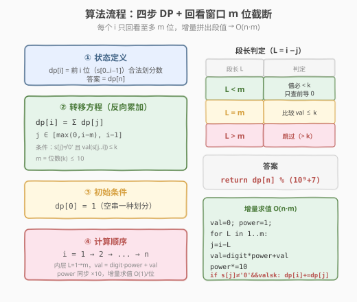
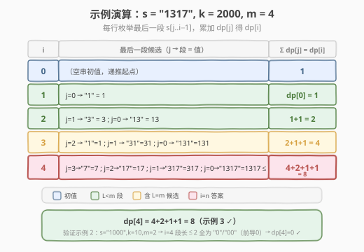

# 恢复数组

- **题目名称**：恢复数组
- **链接**：[1416. 恢复数组](https://leetcode.cn/problems/restore-the-array/)
- **难度**：困难
- **标签**：动态规划、字符串、划分型 DP

## 1. 题目概述

某个程序本来应该输出一个整数数组（数组中所有整数都在 `[1, k]` 之间，且都没有前导 0）。但程序忘记输出空格了，以致输出了一个数字字符串 `s`。请你根据 `s` 和 `k`，返回所有可能输出该字符串的数组方案数。

由于方案数可能很大，返回对 $10^9 + 7$ **取余**后的结果。

**示例 1**：

```text
输入：s = "1000", k = 10000
输出：1
解释：唯一一种可能的数组方案是 [1000]
```

**示例 2**：

```text
输入：s = "1000", k = 10
输出：0
解释：不存在任何数组方案满足所有整数都 >= 1 且 <= 10 同时输出结果为 s。
```

**示例 3**：

```text
输入：s = "1317", k = 2000
输出：8
解释：可行的数组方案为 [1317]，[131,7]，[13,17]，[1,317]，[13,1,7]，[1,31,7]，[1,3,17]，[1,3,1,7]
```

**示例 4**：

```text
输入：s = "2020", k = 30
输出：1
解释：唯一可能的数组方案是 [20,20]。[2020] 不可行（2020 > 30）；[2,020] 不可行（020 含前导 0）。
```

**示例 5**：

```text
输入：s = "1234567890", k = 90
输出：34
```

**约束条件**：

- $1 \le \text{s.length} \le 10^5$
- `s` 只包含数字且不包含前导 0
- $1 \le k \le 10^9$

> 💡 这是一道典型的**划分型 DP**：在数字串上找切分点，把串切成若干段，每段是一个无前导 0 且值在 $[1, k]$ 的整数。它和 [139. 单词拆分](../0101-0200/139_单词拆分.md) 的骨架完全同构——`dp[i] = 前 i 位能形成的合法划分数`，枚举最后一段的起点 `j` 累加 `dp[j]`。区别在于本题的「字典」是隐式的（值域 $[1,k]$），且 $k \le 10^9$ 只有至多 10 位，因此每个位置只回看至多 $m = \operatorname{len}(\operatorname{str}(k))$ 位，把 $O(n^2)$ 压成 $O(n \cdot m) = O(n)$。

---

## 2. 解题思路

### 2.1 暴力思路：枚举所有切分点

数字串 `s` 有 $n-1$ 个「间隙」，每个间隙「切 / 不切」二选一，共 $2^{n-1}$ 种切法。对每种切法逐段检查：无前导 0 且值 $\le k$。`n=10^5` 时 $2^{99999}$ 天文数字，**严重超时**。

> ⚠️ 暴力法的问题在于**重复子问题没被复用**：前 `i` 位的合法划分数，与「第 `i` 位之后怎么切」无关——无论后面怎么接，前 `i` 位的方案数是固定值。这一「前缀独立性」正是 DP 的切入点。

### 2.2 核心观察：划分型 DP + 回看窗口截断

**第一步：状态定义。** 设 `dp[i]` = 数字串 `s` 的前 `i` 位（即 `s[0..i-1]`）能形成的合法划分数。空串 `dp[0] = 1`（一种空划分，作为递推起点）。答案为 `dp[n]`。

**第二步：转移方程（枚举最后一段）。** 前 `i` 位的最后一段是 `s[j..i-1]`（长度 `L = i - j`），它必须满足：

1. **无前导 0**：`s[j] != '0'`（否则段值被当成 0 或前导 0，非法；注意单独的 `"0"` 也不在 $[1,k]$ 内）；
2. **值 $\le k$**：`val(s[j..i-1]) <= k`。

满足时，前 `j` 位任意一种合法划分 + 这最后一段，就贡献一种前 `i` 位的划分。于是：

$$
\text{dp}[i] = \sum_{\substack{0 \le j < i \\ s[j] \neq '0' \\ \text{val}(s[j{:}i]) \le k}} \text{dp}[j]
$$

![划分型 DP：枚举最后一段 s[j..i-1]，累加 dp[j]](../images/restore_array_dp_concept.svg)

**第三步：关键剪枝——回看窗口。** `k <= 10^9` 意味着 `k` 的十进制位数 $m = \operatorname{len}(\operatorname{str}(k)) \le 10$。任何长度 $> m$ 的段，位数比 `k` 多，值必 $> k$，**直接非法**。所以对每个 `i`，`j` 只需从 $i-1$ 回看到 $\max(0,\, i-m)$——至多 $m \le 10$ 个候选：

$$
\text{dp}[i] = \sum_{j=\max(0,\,i-m)}^{i-1} [\,s[j] \neq '0' \;\land\; \text{val}(s[j{:}i]) \le k\,] \cdot \text{dp}[j]
$$

> 💡 **为什么 $m \le 10$ 是降维的钥匙？** 没有这个剪枝，朴素划分型 DP 是 $O(n^2)$（每个 `i` 回看到 0），`n=10^5` 时 $10^{10}$ 必超时。而 `k` 的位数被 $10^9$ 封顶到 10，于是回看窗口是常数，整体退化为 $O(n)$。这正是「值域上界约束了段长」的典型 exploitation——和 [139. 单词拆分](../0101-0200/139_单词拆分.md) 里「单词最长长度 `maxLen` 截断回看窗口」是同一招。

> ⚠️ **段值比较的两段式判定**：设当前段长 $L = i - j$，`m` 为 `k` 的位数。
> - $L < m$：段值位数比 `k` 少，必然 $< k$（前提 `s[j] != '0'` 保证段值 $\ge 1$），**只需查前导 0**；
> - $L = m$：段值与 `k` 同位数，需比较 `val <= k`；
> - $L > m$：必 $> k$，**跳过**。
>
> 代码里可统一写成 `if (s[j]!='0' && val <= k)`，因为 $L < m$ 时 `val <= k` 恒成立，多判一次无副作用。

### 2.3 算法流程图

套用 DP 四步法，外加「回看窗口」剪枝：



**四步法**：

1. **状态定义**：`dp[i]` = 前 `i` 位的合法划分数，`dp[0] = 1`。
2. **转移方程**：`dp[i] = Σ dp[j]`，`j` 在回看窗口 $\max(0,i-m) \dots i-1$ 内，且 `s[j]!='0'`、`val(s[j:i]) <= k`。
3. **初始条件**：`dp[0] = 1`（空串一种划分）。
4. **计算顺序**：`i = 1 → 2 → ... → n`，自左向右；每个 `i` 内部 `j` 由近及远（段长 `L = 1 → m`），**增量拼出段值** `val = digit·10^(L-1) + prev`，避免重复求值。

> 💡 **增量求值**：固定 `i`，让段长 `L` 从 1 递增到 `m`，每次把 `s[i-L]` 作为新的最高位拼到 `val` 前：`val = (s[i-L]-'0') * power + val`，`power *= 10`。这样内层 $O(m)$ 而非 $O(m^2)$，整体严格 $O(n \cdot m)$。

### 2.4 示例演算

以示例 3 `s="1317", k=2000, m=4` 为例，看 `dp` 如何从初值推到答案 `8`：



| i | 最后一段候选（j, 段, 值） | 贡献 | dp[i] |
|---|---------------------------|------|-------|
| 0 | —（空串初值） | — | **1** |
| 1 | (0, "1", 1) | dp[0]=1 | **1** |
| 2 | (1, "3", 3); (0, "13", 13) | 1 + 1 | **2** |
| 3 | (2, "1", 1); (1, "31", 31); (0, "131", 131) | 2 + 1 + 1 | **4** |
| 4 | (3, "7", 7); (2, "17", 17); (1, "317", 317); (0, "1317", 1317≤2000) | 4 + 2 + 1 + 1 | **8** |

逐项验证 `i=4`：段长 1→4 分别是 `"7"`/`"17"`/`"317"`/`"1317"`，均无前导 0 且值 $\le 2000$，贡献 `dp[3]+dp[2]+dp[1]+dp[0] = 4+2+1+1 = 8` ✓（示例 3）。

再看示例 2 `s="1000", k=10, m=2`：`i=4` 时段长 1→2 为 `"0"`（前导 0，跳过）、`"00"`（前导 0，跳过），更长段 $L>2=m$ 直接跳过 → `dp[4] = 0` ✓。

> 💡 注意示例 4 `s="2020", k=30`：`i=4` 时段长 1 的 `"0"` 跳过（前导 0），段长 2 的 `"20"`（值 20 ≤ 30）贡献 `dp[2]=1`，段长 $>2=m$ 跳过 → `dp[4]=1`，即唯一方案 `[20,20]`。

---

## 3. 参考代码

### C++

```cpp
// 恢复数组.cpp —— 划分型 DP + 回看窗口截断
// 编译: g++ -O2 -std=c++17 恢复数组.cpp -o restore
class Solution {
  public:
    int numberOfArrays(string s, int k) {
        const long long MOD = 1e9 + 7;
        int n = s.size();
        int m = to_string((long long)k).size();   // k 的位数 = 最长合法段长
        vector<long long> dp(n + 1, 0);
        dp[0] = 1;                                 // 空串：一种划分
        for (int i = 1; i <= n; ++i) {
            long long val = 0, power = 1;          // 增量拼段值
            // 段长 L = 1..m，起点 j = i - L
            for (int L = 1; L <= m && i - L >= 0; ++L) {
                int j = i - L;
                val = (long long)(s[j] - '0') * power + val;  // 拼最高位
                power *= 10;
                if (s[j] != '0' && val <= k) {                 // 无前导0 且 <= k
                    dp[i] = (dp[i] + dp[j]) % MOD;
                }
            }
        }
        return (int)dp[n];
    }
};
```

### Python

```python
class Solution:
    def numberOfArrays(self, s: str, k: int) -> int:
        MOD = 10**9 + 7
        n = len(s)
        m = len(str(k))              # k 的位数 = 最长合法段长
        dp = [0] * (n + 1)
        dp[0] = 1                    # 空串：一种划分
        for i in range(1, n + 1):
            val = 0
            power = 1                # 增量拼段值
            for L in range(1, m + 1):
                j = i - L
                if j < 0:
                    break
                val = int(s[j]) * power + val      # 拼最高位
                power *= 10
                if s[j] != '0' and val <= k:        # 无前导0 且 <= k
                    dp[i] = (dp[i] + dp[j]) % MOD
        return dp[n]
```

> 💡 **增量拼值的方向**：内层按段长 `L` 从 1 递增，每次把 `s[i-L]`（更靠左的位）当最高位拼到 `val` 前。`val` 始终代表当前段 `s[i-L..i-1]` 的数值，即便中途某长度因前导 0 被跳过，`val/power` 仍正确递推到更长段——因为更长段的低位正是刚才那一段。这把内层从 $O(m^2)$（每次重新 `substr` 求值）降到 $O(m)$。

---

## 4. 复杂度分析

| 维度 | 复杂度 | 说明 |
|------|--------|------|
| **时间复杂度** | $O(n \cdot m)$ | 外层 $n$ 个位置，内层回看至多 $m = \operatorname{len}(\operatorname{str}(k)) \le 10$ 位，增量求值 $O(1)$/位 |
| **时间复杂度（等价）** | $O(n)$ | $m \le 10$ 为常数，故 $O(n \cdot m) = O(n)$ |
| **空间复杂度** | $O(n)$ | `dp` 数组长度 $n+1$ |
| **空间复杂度（滚动）** | $O(m)$ | 仅需保留窗口内 `dp[j]`（理论可行，但 `m` 极小，工程上无必要） |

> ⚠️ **为何不能用 $O(n^2)$？** `n=10^5` 时 $n^2 = 10^{10}$，远超 1 秒时限（约 $10^8$ 量级）。回看窗口把内层从 $O(n)$ 降到 $O(m) \le O(10)$，是本题从 TLE 到 AC 的关键。

---

## 5. 扩展：段值比较的字符串写法与边界

代码中用 `long long` 增量拼出 `val` 再与 `k` 比较，依赖 `val` 不溢出。由于 $m \le 10$，`val` 最大约 $10^{10}$（段 `"9999999999"`），远在 `long long`（上限 $\approx 9.2 \times 10^{18}$）范围内，**安全**。但若题目把 $k$ 放大到 $10^{18}$，数值法会溢出，此时改用**字符串字典序比较**：

- 段长 $L < m$：必然 $< k$，只查前导 0；
- 段长 $L = m$：`s[j:i] <= str(k)`（同位数、均无前导 0 时，字典序 = 数值序）；
- 段长 $L > m$：跳过。

```cpp
// 字符串比较版（应对超大 k，无溢出风险）
string ks = to_string(k);
int m = ks.size();
// ... 内层：
if (s[j] != '0') {
    int L = i - j;
    bool ok = (L < m) || (L == m && s.compare(j, L, ks) <= 0);
    if (ok) dp[i] = (dp[i] + dp[j]) % MOD;
}
```

> 💡 这一写法和 [165. 比较版本号](../0101-0200/165_比较版本号.md) 的「逐段比较」、[166. 分数到小数](../0101-0200/166_分数到小数.md) 的长除法模拟同属「字符串大数处理」家族——当数值可能溢出内置类型时，用字符串/字典序绕过数值运算。

---

## 6. 面试要点

1. **为什么是划分型 DP 而不是回溯？**

   > 划分型 DP 的标志是「在序列上找切分点，每段满足某条件，求方案数/最值」。本题求方案数，且前 `i` 位的方案数与后面怎么切无关——前缀独立，最优子结构成立。回溯会重复枚举相同前缀，DP 用 `dp[i]` 把前缀方案数存下来复用。

2. **回看窗口 $m$ 怎么来的，为什么能降到 $O(n)$？**

   > $k \le 10^9$，故 $k$ 至多 10 位，合法段长 $\le m = \operatorname{len}(\operatorname{str}(k)) \le 10$。每个 `i` 只回看至多 $m$ 个 `j`，内层 $O(m)$ 是常数，整体 $O(n)$。若没有这个上界（如 $k$ 无限大），则退化为 $O(n^2)$。

3. **前导 0 怎么处理？单独的 `"0"` 算不算合法？**

   > 题目要求数字在 $[1, k]$ 且无前导 0。单独 `"0"` 值为 0，不在 $[1,k]$，非法；多位的 `"0xx"` 有前导 0，也非法。统一用 `s[j] != '0'` 一刀切：只要段的首字符是 `'0'` 就跳过，同时保证了段值 $\ge 1$。

4. **增量拼 `val` 时，遇到前导 0 被跳过的长度，`val` 还对吗？**

   > 对。`val` 按「低位 → 高位」递增拼，`val` 始终是 `s[i-L..i-1]` 的真实数值，与是否跳过无关。跳过只影响「要不要把 `dp[j]` 加进 `dp[i]`」，不影响 `val` 的递推。因此即便中途某长度因前导 0 跳过，更长段的 `val` 仍正确。

5. **为什么 `dp[0] = 1` 而不是 0？**

   > `dp[0]` 表示「空串的划分数」。空串有一种划分（什么都不切），它作为「前 0 位 + 整个串作为最后一段」这种方案的递推起点。若 `dp[0]=0`，则「整个串恰好是一段」这种方案永远累加不上，导致全 0。

> 💡 **一句话总结**：本题是「划分型 DP」招牌题——`dp[i] = Σ dp[j]` 枚举最后一段，用 `k` 的位数 $m$ 截断回看窗口把 $O(n^2)$ 降到 $O(n)$，前导 0 与值域判定是两个边界条件。骨架与 [139. 单词拆分](../0101-0200/139_单词拆分.md) 完全同构，只是「字典」从显式单词集换成了隐式值域。

---

## 7. 同类练习题

- [139. 单词拆分](https://leetcode.cn/problems/word-break/)（[题解](../0101-0200/139_单词拆分.md)）：同胞骨架题，`dp[i] = Σ dp[j]` 枚举最后一段单词查字典，用「单词最长长度」截断回看窗口，1416 是其「字典=值域」版
- [91. 解码方法](https://leetcode.cn/problems/decode-ways/)（[题解](../0001-0100/91_解码方法.md))：把数字串切成 1–26 的段计数方案数，`k=26` 固定、段长 $\le 2$，是 1416 的「小常数 k」退化版
- [140. 单词拆分 II](https://leetcode.cn/problems/word-break-ii/)（[题解](../0101-0200/140_单词拆分II.md))：139 的「枚举全部方案」版，记忆化 DFS 返回所有切法，与 1416 对照「计数 vs 枚举」
- [127. 单词接龙](https://leetcode.cn/problems/word-ladder/)（[题解](../0101-0200/127_单词接龙.md))：字符串变换的最短路径，同属字符串 DP/图论家族，但视角从「划分」转为「状态转移图」
