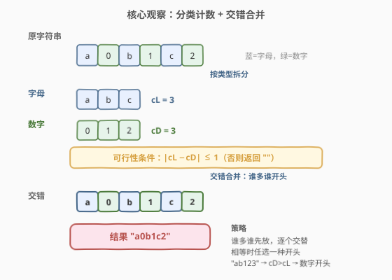
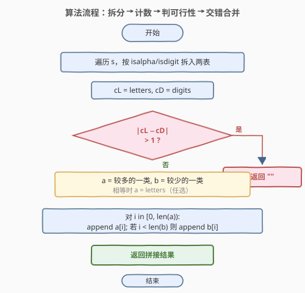
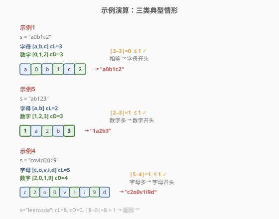

# 重新格式化字符串

- **题目名称**：重新格式化字符串
- **链接**：[1417. 重新格式化字符串](https://leetcode.cn/problems/reformat-the-string/)
- **难度**：简单
- **标签**：字符串、模拟、双指针/交错合并

## 1. 题目概述

给你一个混合了数字和字母的字符串 `s`（字母均为小写英文字母）。请将字符串**重新格式化**，使得**任意两个相邻字符的类型都不同**（字母后跟数字，数字后跟字母）。返回重新格式化后的字符串；如果无法按要求重新格式化，则返回**空字符串**。

**示例 1**：

```text
输入：s = "a0b1c2"
输出："0a1b2c"
解释："0a1b2c" 中任意两个相邻字符的类型都不同。"a0b1c2"、"0a1b2c"、"0c2a1b" 也都满足要求。
```

**示例 2**：

```text
输入：s = "leetcode"
输出：""
解释："leetcode" 中只有字母，无法满足重新格式化的条件。
```

**示例 3**：

```text
输入：s = "1229857369"
输出：""
解释："1229857369" 中只有数字，无法满足重新格式化的条件。
```

**示例 4**：

```text
输入：s = "covid2019"
输出："c2o0v1i9d"
```

**示例 5**：

```text
输入：s = "ab123"
输出："1a2b3"
```

**约束条件**：

- $1 \le \text{s.length} \le 500$
- `s` 仅由小写英文字母和/或数字组成

> 💡 **关键点**：字符只有「字母 / 数字」两类，要求相邻不同类型 ⟺ 两类字符必须**严格交替**排列。能否交替由两类数量的差值决定。

---

## 2. 解题思路

### 2.1 暴力思路：枚举全排列

最朴素的做法：枚举 `s` 的所有排列，逐个检查是否满足「相邻字符类型不同」，返回第一个满足的。

- 长度为 $n$ 的字符串共有 $n!$ 个排列，每个检查 $O(n)$；
- 总时间 $O(n! \cdot n)$，$n \le 500$ 时完全不可行（$500!$ 是天文数字）。

> ⚠️ 暴力法的问题在于**忽视了问题的结构**：它把所有字符当作彼此不同来排列，但本题只关心字符的**类型**（字母 vs 数字），同类型的字符互相替换不影响合法性。把视角从「字符排列」退到「类型交替」是破局关键。

### 2.2 核心观察：分类计数 + 交错合并



**关键洞察**：合法串是两类字符的严格交替，形如 `A B A B A B` 或 `B A B A B A`（A=字母，B=数字）。一个长度为 $k$ 的「交替序列」中，两类字符的数量**至多相差 1**：

- 以 A 开头、长度为 $2m$：A、B 各 $m$ 个，$c_L = c_D$；
- 以 A 开头、长度为 $2m+1$：A 有 $m+1$、B 有 $m$，$c_L = c_D + 1$；
- 反之亦然。

因此**可行性充要条件**为：

$$|c_L - c_D| \le 1$$

不满足直接返回 `""`。满足时，**让数量较多的一类开头**，然后逐个交替取字符即可（相等时任选一类开头）。

三步走：

1. **拆分**：遍历 `s`，把字母、数字分别收集到 `letters`、`digits` 两个数组；
2. **判可行**：若 $|c_L - c_D| > 1$，返回 `""`；
3. **交错合并**：令 `a` 为较多的一类、`b` 为较少的一类，按 `a[0], b[0], a[1], b[1], …` 交替追加，`b` 用完后 `a` 可能还剩最后一个（当 $c_a = c_b + 1$）。

> 以示例 4 为例：`s = "covid2019"`，`letters = [c,o,v,i,d]`（$c_L=5$），`digits = [2,0,1,9]`（$c_D=4$）。$|5-4|=1 \le 1$ ✓，字母多→字母开头，交替得 `c,2,o,0,v,1,i,9,d` → `"c2o0v1i9d"`。

> 💡 **为什么「谁多谁开头」就够？** 当 $c_a = c_b + 1$ 时，以 `a` 开头的交替序列长度为 $2c_b+1$，恰好用完所有 `a` 和 `b`，末尾多一个 `a`（与倒数第二个 `b` 类型不同，合法）。若错以 `b` 开头，则 `b` 会先耗尽而 `a` 还剩两个相邻，必然非法。所以**多的一类必须开头**，这是唯一合法的排布方式。

### 2.3 算法流程图



一次遍历拆分 + 一次判空 + 一次交错合并，三趟即出结果。

### 2.4 示例演算

以三类典型情形分别演算：



**示例 1**（`s = "a0b1c2"`，$c_L=3, c_D=3$）：

| 步骤 | 操作 | 结果 |
|------|------|------|
| 拆分 | letters=[a,b,c], digits=[0,1,2] | $c_L=c_D=3$ |
| 判可行 | \|3−3\|=0 ≤ 1 | ✓ |
| 开头选择 | 相等 → 字母开头 | a 先 |
| 交错 | a,0,b,1,c,2 | "a0b1c2" |

**示例 5**（`s = "ab123"`，$c_L=2, c_D=3$）：

| 步骤 | 操作 | 结果 |
|------|------|------|
| 拆分 | letters=[a,b], digits=[1,2,3] | $c_D > c_L$ |
| 判可行 | \|2−3\|=1 ≤ 1 | ✓ |
| 开头选择 | 数字多 → 数字开头 | 1 先 |
| 交错 | 1,a,2,b,3 | "1a2b3" |

> ⚠️ 示例 2/3 中 `s` 只含一类字符：`"leetcode"` $c_L=8, c_D=0$，$|8-0|=8 > 1$ → 直接返回 `""`。这正是可行性条件过滤掉的极端情形。

---

## 3. 参考代码

### C++

```cpp
class Solution {
public:
    string reformat(string s) {
        vector<char> letters, digits;
        for (char c : s) {
            if (isalpha(c)) letters.push_back(c);
            else digits.push_back(c);
        }
        int nL = letters.size(), nD = digits.size();
        if (abs(nL - nD) > 1) return "";

        // a = 较多的一类，b = 较少的一类
        auto &a = (nL >= nD) ? letters : digits;
        auto &b = (nL >= nD) ? digits : letters;

        string res;
        for (int i = 0; i < (int)a.size(); i++) {
            res.push_back(a[i]);
            if (i < (int)b.size()) res.push_back(b[i]);
        }
        return res;
    }
};
```

### Python

```python
class Solution:
    def reformat(self, s: str) -> str:
        letters = [c for c in s if c.isalpha()]
        digits = [c for c in s if c.isdigit()]
        if abs(len(letters) - len(digits)) > 1:
            return ""

        # a = 较多的一类，b = 较少的一类
        if len(letters) >= len(digits):
            a, b = letters, digits
        else:
            a, b = digits, letters

        res = []
        for i in range(len(a)):
            res.append(a[i])
            if i < len(b):
                res.append(b[i])
        return "".join(res)
```

> 💡 **实现要点**：① 用 `isalpha`/`isdigit` 区分类型，分别入表。② 先判 $|c_L - c_D| > 1$ 提前返回 `""`。③ 令 `a` 指向较多的一类，循环以 `a` 的下标驱动：`append a[i]` 后若 `i < len(b)` 再 `append b[i]`，天然处理「`a` 比 `b` 多一个」的末尾收尾。④ C++ 用引用 `auto&` 别名避免拷贝两个数组。

---

## 4. 复杂度分析

| 维度 | 分类 + 交错合并（推荐） | 暴力全排列 |
|------|------------------------|-----------|
| **时间复杂度** | $O(n)$ | $O(n! \cdot n)$ |
| **空间复杂度** | $O(n)$（两个分类数组） | $O(n)$（排列缓冲） |
| **可行性** | $n=500$ 毫秒级 | $n=500$ 完全不可行 |

- **拆分**：一次遍历 $O(n)$。
- **判可行 + 交错**：各 $O(n)$，总计 $O(n)$。
- **空间**：`letters`/`digits` 两数组共存 $n$ 个字符；结果串 $O(n)$。

> 💡 **能否原地做到 $O(1)$ 额外空间？** 理论上可以先按类型双指针划分（类似 905 按奇偶分），再按交错下标直接写入原串，但需要先确定开头类型与总长，逻辑较绕且多数语言中 `string` 不可变。$n \le 500$ 时 $O(n)$ 辅助空间完全可接受，不必追求原地。

---

## 5. 扩展：双指针交替写入（避免显式拆分数组）

若希望减少一次遍历，可在拆分后用**双指针**直接交替写入结果，省去 `a/b` 别名判断：

```cpp
class Solution {
public:
    string reformat(string s) {
        vector<char> letters, digits;
        for (char c : s) {
            if (isalpha(c)) letters.push_back(c);
            else digits.push_back(c);
        }
        int nL = letters.size(), nD = digits.size();
        if (abs(nL - nD) > 1) return "";

        string res;
        int i = 0, j = 0;
        bool letterFirst = (nL >= nD);   // 谁多谁先
        while (i < nL || j < nD) {
            if (letterFirst) {
                if (i < nL) res.push_back(letters[i++]);
                if (j < nD) res.push_back(digits[j++]);
            } else {
                if (j < nD) res.push_back(digits[j++]);
                if (i < nL) res.push_back(letters[i++]);
            }
        }
        return res;
    }
};
```

**与主解的差别**：主解用 `a/b` 别名把「谁多谁开头」统一成同一个循环；此处显式用 `letterFirst` 标志在每轮先放对应类型。两者复杂度一致 $O(n)$，主解更简洁，本扩展便于理解交替写入的每一步。

> 💡 **进阶思考**：若字符类型不止两类（如字母/数字/符号三类，要求相邻三类全不同），问题升级为**图论哈密顿路径 / 着色交替**，不再有简单的「数量差 ≤ 1」充要条件。本题只有两类，正是「两类交替」的特殊情形，可直接用计数判定。

---

## 6. 面试要点

1. **怎么想到「数量差 ≤ 1」这个充要条件的？**

   > 合法串是两类严格交替，形如 `A B A B …`。长度为 $k$ 的交替序列，开头那类比另一类恰好多 $k \bmod 2$（即 0 或 1）。所以两类数量差只能是 0 或 1——这就是 $|c_L - c_D| \le 1$。差值 ≥ 2 时一定有同类型字符被迫相邻。

2. **为什么必须让「多的一类」开头？**

   > 当 $c_a = c_b + 1$ 时，以 `a` 开头：序列 `a b a b … a` 长度 $2c_b+1$，末尾的 `a` 与前面的 `b` 相邻合法。若以 `b` 开头，则 `b` 在第 $2c_b$ 位耗尽，剩余两个 `a` 相邻非法。所以**多的一类必须占首尾**，开头唯一确定。

3. **答案不唯一时，题目允许任意一种吗？**

   > 允许。示例 1 中 `"a0b1c2"`、`"0a1b2c"`、`"0c2a1b"` 都合法。只要保证交替即可，同类型字符的相对顺序不作要求（题目未要求保持原序）。若面试官追加「保持原相对顺序」的约束，则需在拆分时按原序入表、交错时按表顺序取——本解已满足，无需改动。

4. **`isalpha` / `isdigit` 在本题安全吗？**

   > 题目保证 `s` 仅含小写字母和数字，二者互斥，`isalpha` 与 `isdigit` 必有且仅有一个为真。故无需处理其他字符。若推广到含符号的字符串，需先过滤或扩展类型判定。

5. **若 `s` 长度很大（如 $10^6$），算法是否仍高效？**

   > 时间 $O(n)$ 已经是最优（至少要读完整个串）。空间上 `letters`/`digits` 各存一份共 $2n$，可优化为原地双指针划分（按类型 partition 后按下标交错写回），降至 $O(1)$ 额外空间。但需注意多数语言 `string` 不可变，需转为可写字符数组操作。

> 💡 **一句话总结**：1417 的灵魂是「**两类交替，差值不过 1；谁多谁开头，逐个交错取**」。把字符按类型分桶、用计数判定可行性、让多数类打头交替合并，$O(n)$ 一趟搞定。

---

## 7. 同类练习题

- [922. 按奇偶排序数组 II](https://leetcode.cn/problems/sort-array-by-parity-ii/)：要求奇数下标放奇数、偶数下标放偶数，本质同为本题的「两类按位置交替」——双指针按奇偶下标归类交换，$O(n)$ 原地
- [905. 按奇偶排序数组](https://leetcode.cn/problems/sort-array-by-parity/)：将奇偶分到两侧（不要求交替），是 922 的弱化版，双指针 partition，承接 1417 的「按属性分桶」思路
- [21. 合并两个有序链表](https://leetcode.cn/problems/merge-two-sorted-lists/)（[题解](../0001-0100/21_合并两个有序链表.md)）：两路交错合并的经典母题（哑节点 + 双指针），1417 的交错合并是其「固定交替」的特例
- [767. 重构字符串](https://leetcode.cn/problems/reorganize-string/)（[题解](../0701-0800/767_重构字符串.md)）：相邻字符不能相同的进阶版——类型多于两类时用「贪心 + 大根堆按频率交替放置」，1417 是其两类退化为计数的特例
