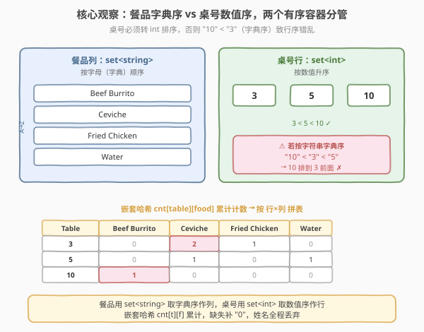
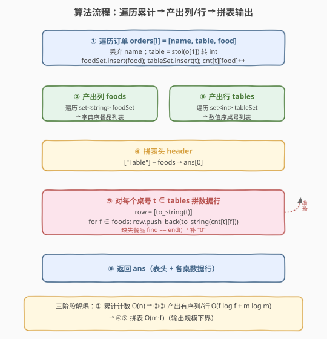
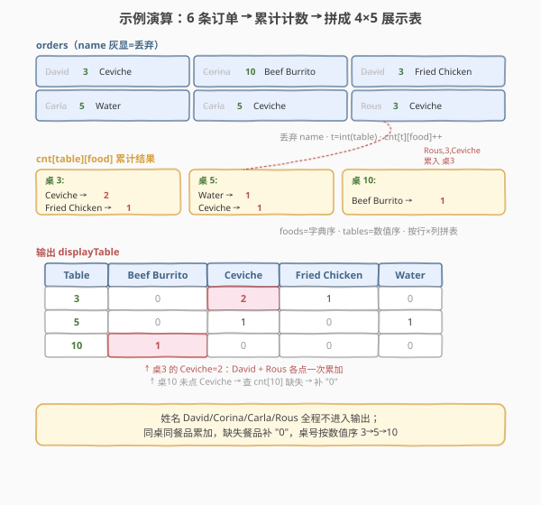

# 点菜展示表

- **题目名称**：点菜展示表
- **链接**：[1418. 点菜展示表](https://leetcode.cn/problems/display-table-of-food-orders-in-a-restaurant/)
- **难度**：中等
- **标签**：数组、哈希表、排序、模拟

## 1. 题目概述

给你一个数组 `orders`，表示客户在餐厅中完成的订单，其中 `orders[i] = [customerNamei, tableNumberi, foodItemi]`，分别是客户姓名、所在桌号、点的餐品名称。

请你返回该餐厅的**点菜展示表**：

- **第一行为标题**：第一列为 `"Table"`，后面每一列都是按**字母顺序**排列的餐品名称；
- **接下来每一行**：第一列为桌号（按**数字升序**排列），后面依次填写该桌下单的对应餐品**数量**（未点则填 `"0"`）；
- **客户姓名不出现在表中**。

**示例 1**：

```text
输入：orders = [["David","3","Ceviche"],["Corina","10","Beef Burrito"],["David","3","Fried Chicken"],["Carla","5","Water"],["Carla","5","Ceviche"],["Rous","3","Ceviche"]]
输出：[["Table","Beef Burrito","Ceviche","Fried Chicken","Water"],["3","0","2","1","0"],["5","0","1","0","1"],["10","1","0","0","0"]]
解释：
Table, Beef Burrito, Ceviche, Fried Chicken, Water
3    , 0           , 2      , 1            , 0
5    , 0           , 1      , 0            , 1
10   , 1           , 0      , 0            , 0
桌 3：David 点 Ceviche + Fried Chicken，Rous 点 Ceviche → Ceviche×2, Fried Chicken×1
桌 5：Carla 点 Water + Ceviche → 各 ×1
桌 10：Corina 点 Beef Burrito → ×1
```

**示例 2**：

```text
输入：orders = [["James","12","Fried Chicken"],["Ratesh","12","Fried Chicken"],["Amadeus","12","Fried Chicken"],["Adam","1","Canadian Waffles"],["Brianna","1","Canadian Waffles"]]
输出：[["Table","Canadian Waffles","Fried Chicken"],["1","2","0"],["12","0","3"]]
解释：桌 1 两人各点 Canadian Waffles → ×2；桌 12 三人各点 Fried Chicken → ×3。
```

**示例 3**：

```text
输入：orders = [["Laura","2","Bean Burrito"],["Jhon","2","Beef Burrito"],["Melissa","2","Soda"]]
输出：[["Table","Bean Burrito","Beef Burrito","Soda"],["2","1","1","1"]]
```

**约束条件**：

- $1 \le \text{orders.length} \le 5 \times 10^4$
- $\text{orders}[i].\text{length} == 3$
- $1 \le \text{customerNamei.length}, \text{foodItemi.length} \le 20$
- `customerNamei` 和 `foodItemi` 由大小写英文字母及空格组成
- `tableNumberi` 是 $1$ 到 $500$ 范围内的整数

> 💡 **关键点**：输出是一张二维表，需要确定**列**（餐品名按字典序）和**行**（桌号按数值升序），再把每条订单累加到对应「桌×餐品」格子里。姓名是干扰字段，直接丢弃。

---

## 2. 解题思路

### 2.1 暴力思路：按桌分组后逐格统计

最直观的做法：先把订单按桌号分组，对每张桌统计各餐品数量；再收集所有出现过的餐品名排序作列、所有桌号排序作行；最后按「行×列」遍历填表。

- 分组用哈希表 `桌号 → 餐品计数表`，每条订单 $O(1)$ 累加；
- 收集餐品名 / 桌号用集合去重再排序；
- 填表时对每个 `(桌, 餐品)` 查计数表，缺失记 `0`。

这其实已经接近最优——难点不在算法设计，而在**两个排序方向不同**和**类型转换**的细节。

> ⚠️ 暴力法唯一容易出错的点：**桌号是字符串形式的数字**。若按字符串排序，`"10" < "3"`（字典序），导致行序错乱。必须转成 `int` 排序，输出时再转回 `str`。

### 2.2 核心观察：两个有序容器分别管「列字典序」与「行数值序」



**关键洞察**：表的列（餐品名）要按**字母顺序**，行（桌号）要按**数字升序**——这是两种不同的排序规则。用两个**天然有序**的容器各管一头，可省去额外排序调用：

1. **餐品列**：用 `set<string>`（C++）或 `sorted({...})`（Python）——`set<string>` 内部按字典序维护，遍历即得到有序餐品名；
2. **桌号行**：用 `set<int>`——按数值升序维护，遍历即得到有序桌号；
3. **计数**：用嵌套哈希 `桌号(int) → (餐品 → 数量)`，每条订单 $O(1)$ 累加；
4. **拼表**：表头 `["Table"] + 餐品列表`；每行 `[str(桌号)] + 各餐品计数（缺失补 0）`。

> 以示例 1 为例：餐品集合 `{Ceviche, Beef Burrito, Fried Chicken, Water}` 经 `set<string>` 遍历得 `[Beef Burrito, Ceviche, Fried Chicken, Water]`；桌号集合 `{3,5,10}` 经 `set<int>` 遍历得 `[3,5,10]`；计数表 `{3:{Ceviche:2, Fried Chicken:1}, 5:{Water:1, Ceviche:1}, 10:{Beef Burrito:1}}`。拼表即得正确输出。

> ⚠️ **为什么桌号必须用 `int` 排序？** 桌号范围 $1\sim500$，若按字符串字典序排，`"10","100"` 会排在 `"2","3"` 前面（首字符 `'1' < '2'`）。示例 1 中桌号 `"3","5","10"` 按字典序为 `"10","3","5"`（错），按数值序为 `3,5,10`（对）。这是本题最高频的 WA 点。

### 2.3 算法流程图



**完整步骤**：

1. **遍历订单**：对每条 `[name, table, food]`，丢弃 `name`，把 `table` 转 `int`，插入 `foodSet`、`tableSet`，并 `cnt[table][food]++`；
2. **产出列**：遍历 `foodSet` 得字典序餐品列表 `foods`；
3. **产出行**：遍历 `tableSet` 得数值序桌号列表 `tables`；
4. **拼表头**：`["Table"] + foods`；
5. **拼数据行**：对每个桌号 `t`，`[to_string(t)] + [to_string(cnt[t][f]) for f in foods]`（缺失餐品补 `"0"`）；
6. **返回** 结果表。

> 💡 **三阶段解耦**：阶段 1 累计计数（$O(n)$），阶段 2-3 产出有序行列（$O(f \log f + m \log m)$），阶段 4 拼表（$O(m \cdot f)$ 即输出规模）。每阶段职责单一，调试时易于定位。

### 2.4 示例演算

以示例 1 `orders = [["David","3","Ceviche"],["Corina","10","Beef Burrito"],["David","3","Fried Chicken"],["Carla","5","Water"],["Carla","5","Ceviche"],["Rous","3","Ceviche"]]` 为例：



**阶段 1：遍历累计计数**

| 订单 | 桌号(int) | 餐品 | 计数表变化 |
|------|-----------|------|------------|
| David,3,Ceviche | 3 | Ceviche | `cnt[3][Ceviche] = 1` |
| Corina,10,Beef Burrito | 10 | Beef Burrito | `cnt[10][Beef Burrito] = 1` |
| David,3,Fried Chicken | 3 | Fried Chicken | `cnt[3][Fried Chicken] = 1` |
| Carla,5,Water | 5 | Water | `cnt[5][Water] = 1` |
| Carla,5,Ceviche | 5 | Ceviche | `cnt[5][Ceviche] = 1` |
| Rous,3,Ceviche | 3 | Ceviche | `cnt[3][Ceviche] = 2` |

**阶段 2-3：产出有序列/行**

| 容器 | 元素 | 排序结果 |
|------|------|----------|
| `foodSet` (字典序) | {Ceviche, Beef Burrito, Fried Chicken, Water} | `[Beef Burrito, Ceviche, Fried Chicken, Water]` |
| `tableSet` (数值序) | {3, 5, 10} | `[3, 5, 10]` |

**阶段 4-5：拼表**

| Table | Beef Burrito | Ceviche | Fried Chicken | Water |
|-------|-------------|---------|---------------|-------|
| 3     | 0           | 2       | 1             | 0     |
| 5     | 0           | 1       | 0             | 1     |
| 10    | 1           | 0       | 0             | 0     |

> 💡 注意桌 `3` 的 `Ceviche` 由 David 和 Rous 各点一次累加为 `2`；桌 `10` 未点 `Ceviche` 则补 `"0"`。姓名 David/Corina/Carla/Rous 全程不进入输出。

---

## 3. 参考代码

### C++

```cpp
class Solution {
public:
    vector<vector<string>> displayTable(vector<vector<string>>& orders) {
        set<string> foodSet;                 // 餐品名：字典序
        set<int> tableSet;                   // 桌号：数值序
        map<int, map<string, int>> cnt;      // 桌号 -> (餐品 -> 数量)
        for (const auto& o : orders) {
            int t = stoi(o[1]);
            foodSet.insert(o[2]);
            tableSet.insert(t);
            cnt[t][o[2]]++;
        }
        vector<string> foods(foodSet.begin(), foodSet.end());
        vector<vector<string>> ans;
        // 表头
        ans.push_back(vector<string>{"Table"});
        for (const auto& f : foods) ans[0].push_back(f);
        // 数据行：按桌号数值升序
        for (int t : tableSet) {
            vector<string> row;
            row.push_back(to_string(t));
            for (const auto& f : foods) {
                auto it = cnt[t].find(f);
                row.push_back(to_string(it == cnt[t].end() ? 0 : it->second));
            }
            ans.push_back(row);
        }
        return ans;
    }
};
```

### Python

```python
class Solution:
    def displayTable(self, orders: List[List[str]]) -> List[List[str]]:
        foods = sorted({o[2] for o in orders})          # 餐品列：字典序
        tables = sorted({int(o[1]) for o in orders})    # 桌号行：数值序
        cnt = defaultdict(lambda: defaultdict(int))     # 桌号 -> (餐品 -> 数量)
        for _, tbl, food in orders:
            cnt[int(tbl)][food] += 1
        ans = [["Table"] + foods]
        for t in tables:
            ans.append([str(t)] + [str(cnt[t][f]) for f in foods])
        return ans
```

> 💡 **实现要点**：① 桌号排序**必须转 `int`**——`set<int>` / `sorted({int(o[1])...})` 保证数值序，输出时再 `to_string` / `str` 转回。② 餐品排序用 `set<string>` / `sorted({...})` 得字典序。③ 计数用嵌套哈希，缺失餐品查不到时补 `"0"`。④ 姓名字段 `_`（Python）/ 直接忽略（C++）不参与任何计算。

---

## 4. 复杂度分析

| 维度 | 有序容器 + 嵌套哈希（推荐） | 暴力逐格统计 |
|------|----------------------------|-------------|
| **时间复杂度** | $O(n + f \log f + m \log m + m \cdot f)$ | $O(n \cdot m \cdot f)$ |
| **空间复杂度** | $O(m \cdot f)$ | $O(m \cdot f)$ |
| **实际运算量** | $n=5\times10^4, m\le500$ 时输出规模可控 | 重复扫描订单，效率低 |

- **$n$**：订单数（$\le 5\times10^4$）；**$m$**：不同桌号数（$\le 500$）；**$f$**：不同餐品数（$\le n$）。
- **遍历订单**：$O(n)$，每条 $O(1)$ 哈希插入 + `set` 插入 $O(\log)$。
- **产出列/行**：$O(f \log f + m \log m)$，由有序容器内部排序主导。
- **拼表**：$O(m \cdot f)$，即输出表的单元格数，这是**不可避免的下界**——输出本身就有这么多格。
- **空间**：计数表 $O(m \cdot f)$ + 输出表 $O(m \cdot f)$，总计 $O(m \cdot f)$。

> 💡 **复杂度下界**：输出表大小为 $(m+1) \times (f+1)$，故时间与空间均不低于 $O(m \cdot f)$。本题 $m \le 500$，$f$ 受餐品名种类限制，规模远小于 $n$，实际运行毫秒级。

---

## 5. 扩展：用 `Counter` + 元组键简化计数

Python 中可用单个 `Counter` 以 `(桌号, 餐品)` 元组为键，省去嵌套 `defaultdict`：

```python
from collections import Counter

class Solution:
    def displayTable(self, orders: List[List[str]]) -> List[List[str]]:
        foods = sorted({o[2] for o in orders})
        tables = sorted({int(o[1]) for o in orders})
        cnt = Counter((int(t), f) for _, t, f in orders)   # (桌, 餐品) -> 数量
        ans = [["Table"] + foods]
        for t in tables:
            ans.append([str(t)] + [str(cnt[(t, f)]) for f in foods])  # 缺失自动返回 0
        return ans
```

**原理**：`Counter` 查不存在的键返回 `0`（无需 `defaultdict` 嵌套），元组 `(t, f)` 作键天然对应二维坐标。代码更短，但元组哈希开销略高于嵌套字典，大规模数据时稍慢。

> ⚠️ 此写法中 `cnt[(t, f)]` 对缺失键返回 `0` 是 `Counter` 的特性，普通 `dict` 会抛 `KeyError`。若用普通 `dict` 需 `.get((t, f), 0)`。

> 💡 C++ 对应写法可用 `map<pair<int,string>, int>`，但 `pair` 哈希需自定义，不如嵌套 `map<int, map<string,int>>` 直观，故不推荐。

---

## 6. 面试要点

1. **桌号为什么要转成整数排序？**

   > 桌号以字符串形式给出，但题目要求按**数值升序**排列。若按字符串字典序，`"10" < "3"`（首字符 `'1' < '3'`），导致 `"10"` 排在 `"3"` 前面。转成 `int` 排序后 `3 < 10` 才正确。这是本题最高频的 WA 点，也是面试官最爱追问的细节。

2. **餐品名和桌号的排序规则为什么不同？**

   > 餐品名是字符串，按**字母（字典）顺序**排列，如 `"Beef Burrito" < "Ceviche"`。桌号虽以字符串给出，但语义是数字，按**数值升序**排列。两者排序方向不同，需分别用 `set<string>`（字典序）和 `set<int>`（数值序）处理，不能混用同一排序。

3. **如何处理某桌没点某餐品的情况？**

   > 计数表中该 `(桌, 餐品)` 键不存在，查表时需补 `"0"`。C++ 用 `find` 判断是否 `end()` 再取值；Python 的 `defaultdict(int)` 或 `Counter` 查缺失键自动返回 `0`。输出要求是**字符串** `"0"`，故最后要 `to_string` / `str` 转换。

4. **为什么客户姓名是干扰字段？**

   > 题目明确「客户姓名不是点菜展示表的一部分」。同一桌的不同客户点的餐品会累加到同一格（如示例 1 桌 3 的 Ceviche 由 David 和 Rous 各点一次得 2）。姓名仅用于区分不同订单条目，统计时直接丢弃。

5. **输出规模的下界是多少？能否优化到 $O(n)$？**

   > 输出表是 $(m+1) \times (f+1)$ 的二维数组，$m$ 为不同桌号数、$f$ 为不同餐品数。仅写输出就要 $O(m \cdot f)$，故时间下界即 $O(m \cdot f)$，无法降到 $O(n)$（除非 $m \cdot f = O(n)$）。本题 $m \le 500$、$f \le n$，输出规模可控，无需进一步优化。

> 💡 **一句话总结**：1418 的灵魂是「**两个有序容器分管两种排序 + 嵌套哈希计数 + 缺失补零**」。算法本身简单，难点全在桌号 `int` 排序的细节与字符串/数字的类型转换上。

---

## 7. 同类练习题

- [1088. 易混淆数](https://leetcode.cn/problems/confusing-number/)：同样是「字符串数字」需按数值语义处理，对照 1418 桌号转 `int` 的类型意识
- [1366. 通过投票对团队排名](https://leetcode.cn/problems/rank-teams-by-votes/)：多关键字排序 + 哈希计数，与 1418 同为「统计 + 排序产出表」家族，排序规则更复杂
- [1178. 猜字谜](https://leetcode.cn/problems/number-of-valid-words-for-each-puzzle/)：哈希计数 + 按键查询产出列表，对照 1418 的「计数表 + 按餐品列查表」模式
- [1854. 人口最多的年份](https://leetcode.cn/problems/maximum-population-year/)：区间累加计数后查询最值，与 1418 同属「遍历事件累计统计」思路，维度更简
- [1748. 唯一元素的和](https://leetcode.cn/problems/sum-of-unique-elements/)：哈希频次统计后按条件求和，对照 1418 的「哈希计数 + 按规则取值」基本范式
