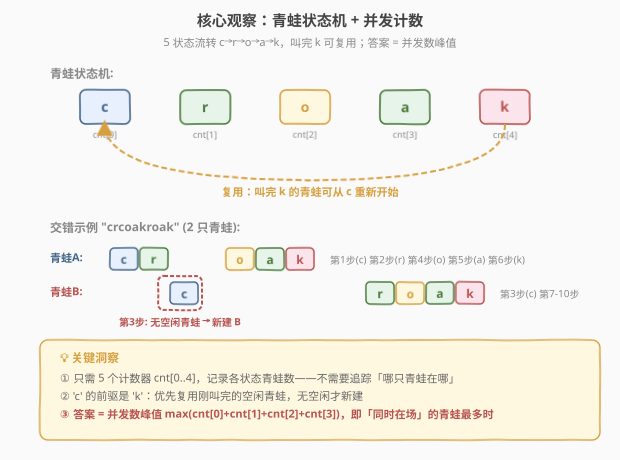
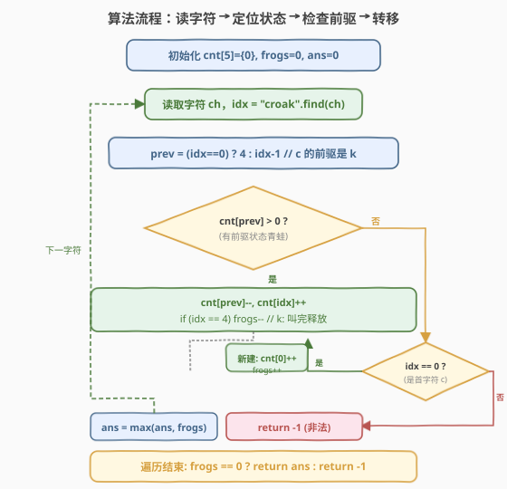
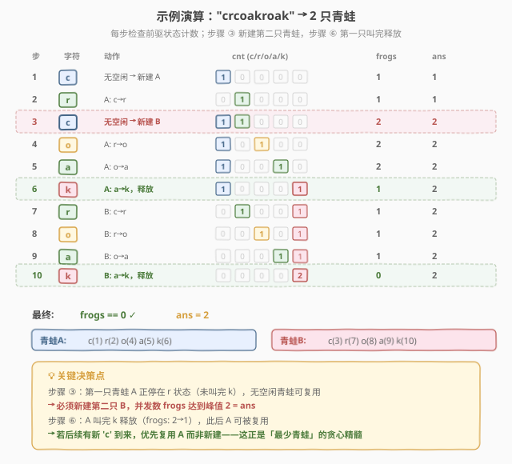

# LeetCode 数青蛙 题解

## 1. 题目概述

- **标题 / 题号**：数青蛙（#1419，medium）
- **链接**：https://leetcode.cn/problems/minimum-number-of-frogs-croaking/
- **难度**：中等
- **标签**：字符串、计数、贪心、模拟

**题意**：给定字符串 `croakOfFrogs`，表示多只青蛙发出的蛙鸣声组合。每只青蛙发出一声蛙鸣必须**依序**输出 `'c'`、`'r'`、`'o'`、`'a'`、`'k'` 五个字母。多只青蛙可同时鸣叫，它们的声音会**交错混合**在字符串中。

要求返回模拟该字符串所需**最少**的青蛙数量。若字符串不是由若干有效 `"croak"` 混合而成，返回 `-1`。

**示例 1**：

```text
输入：croakOfFrogs = "croakcroak"
输出：1
解释：一只青蛙 "呱呱" 两次（第二次复用同一只青蛙）
```

**示例 2**：

```text
输入：croakOfFrogs = "crcoakroak"
输出：2
解释：最少需要两只青蛙，鸣叫声用粗体标注
第一只青蛙 "crcoakroak"
第二只青蛙 "crcoakroak"
```

**示例 3**：

```text
输入：croakOfFrogs = "croakcrook"
输出：-1
解释：第二个 "croak" 的第三个字符应为 'a' 但出现了 'o'，不是有效组合。
```

**约束**：

- $1 \le \text{croakOfFrogs.length} \le 10^5$
- 字符串中只含 `'c'`、`'r'`、`'o'`、`'a'`、`'k'`

> 💡 **核心翻译**：每个字符属于某只青蛙的某个发音阶段。关键不是「哪只青蛙说了哪个字」，而是「此刻有多少只青蛙同时在叫」——峰值并发数即答案。

## 2. 解题思路

### 2.1 暴力思路：逐个字符分配青蛙

朴素地维护一个青蛙列表，每只青蛙记录「下一个期望输出的字符」。遍历字符串每个字符 `ch`：

1. 扫描所有青蛙，找一只期望字符恰好是 `ch` 的青蛙，将它的期望推进到下一字符；
2. 若 `ch == 'c'` 且无青蛙期望 `'c'`，则新建一只青蛙；
3. 若 `ch` 非首字符且无青蛙期望它，返回 `-1`。

最终青蛙列表的大小即为答案。

问题在于：每个字符需要扫描全部青蛙，时间 $O(n \cdot m)$，其中 $m$ 为青蛙数（最坏 $O(n)$），总体 $O(n^2)$，对 $10^5$ 规模不可接受。且存储每只青蛙的个体状态消耗 $O(m)$ 空间。

> 💡 暴力的核心浪费：**我们关心的是「每种状态有多少只青蛙」，而非「哪只青蛙在哪种状态」**。5 种状态只需要 5 个计数器，不需要逐个追踪。

### 2.2 核心观察：青蛙状态机 + 计数器



每只青蛙鸣叫一次就是一个 **5 状态机**的状态流转：`c → r → o → a → k`。叫完 `'k'` 后青蛙空闲，可以复用从 `'c'` 重新开始。

**关键洞察**：

| 观察 | 说明 |
|------|------|
| **只需计数，无需追踪个体** | 5 种状态各维护一个计数器 `cnt[0..4]`，记录当前处于各状态的青蛙数量。哪只青蛙在哪不重要，数量才决定答案 |
| **`'c'` 的前驱是 `'k'`** | 看到 `'c'` 时，优先复用刚叫完 `'k'` 的空闲青蛙；若无空闲，才新开一只 |
| **答案 = 峰值并发数** | 正在叫的青蛙数（已说 `'c'` 未说 `'k'`）在某一时刻达到最大值，该值就是最少青蛙数 |
| **复用不增总量** | 复用空闲青蛙不增加并发数，只是让同一只青蛙多次鸣叫 |

> 💡 **为什么复用是贪心最优的？** 每次 `'c'` 到来时优先复用空闲青蛙（已说 `'k'`），而非新建。复用不增加总数，新建才增加。这种「能复用就不新建」的策略使总青蛙数恰好等于峰值并发数——任何时刻所有青蛙都在忙时才不得不新开，此时已有青蛙数已达峰值，无法更少。

> ⚠️ **与 [1221. 分割平衡字符串](https://leetcode.cn/problems/split-a-string-in-balanced-amounts/) 的对比**：1221 中 `balance` 计数器在 `R` 与 `L` 之间增减，归零时刻即为一次完整分割；1419 中 5 个计数器在 5 个状态间传递，并发数（`cnt[0]+cnt[1]+cnt[2]+cnt[3]`）的峰值即为答案。两者都是「用计数器代替显式追踪」的思路。

### 2.3 算法流程图



**完整步骤**：

1. 初始化 `cnt[5] = {0}`（c/r/o/a/k 各状态青蛙数）、`frogs = 0`（当前并发数）、`ans = 0`（峰值）。
2. **遍历每个字符 `ch`**：
   - `idx` = `ch` 在 `"croak"` 中的下标（c=0, r=1, o=2, a=3, k=4）；
   - `prev` = `idx == 0 ? 4 : idx - 1`（前驱状态；`'c'` 的前驱是 `'k'`，即空闲青蛙）；
   - **若 `cnt[prev] > 0`**：有前驱状态的青蛙可用 → `cnt[prev]--`, `cnt[idx]++`；若 `idx == 4`（k），青蛙叫完释放，`frogs--`；
   - **否则若 `idx == 0`**（c）：无空闲青蛙 → 新建一只，`cnt[0]++`, `frogs++`；
   - **否则**：无可用青蛙发出此字符 → 返回 `-1`；
   - `ans = max(ans, frogs)`。
3. 遍历结束后，若 `frogs != 0`（仍有未叫完的青蛙）→ 返回 `-1`；否则返回 `ans`。

> 💡 **前驱映射的妙处**：把 `'c'` 的前驱设为 `'k'`（而非「无前驱」），使「复用空闲青蛙」和「新建青蛙」两种情况统一成同一套 `cnt[prev]--` / `cnt[idx]++` 逻辑，代码极度简洁。

### 2.4 示例演算

以示例 2 `"crcoakroak"` 为例，逐步演算：



| 步骤 | 字符 | 前驱状态 | cnt (c/r/o/a/k) | 动作 | frogs | ans |
|------|------|----------|-----------------|------|-------|-----|
| 1 | c | k(0) | 1/0/0/0/0 | 无空闲 → 新建青蛙A | 1 | 1 |
| 2 | r | c(1) | 0/1/0/0/0 | A: c→r | 1 | 1 |
| 3 | c | k(0) | 1/1/0/0/0 | 无空闲 → 新建青蛙B | 2 | **2** |
| 4 | o | r(1) | 1/0/1/0/0 | A: r→o | 2 | 2 |
| 5 | a | o(1) | 1/0/0/1/0 | A: o→a | 2 | 2 |
| 6 | k | a(1) | 1/0/0/0/1 | A: a→k，释放 | 1 | 2 |
| 7 | r | c(1) | 0/1/0/0/1 | B: c→r | 1 | 2 |
| 8 | o | r(1) | 0/0/1/0/1 | B: r→o | 1 | 2 |
| 9 | a | o(1) | 0/0/0/1/1 | B: o→a | 1 | 2 |
| 10 | k | a(1) | 0/0/0/0/2 | B: a→k，释放 | 0 | 2 |

最终 `frogs == 0`，`ans == 2` ✓。步骤 3 是关键决策点：第一只青蛙 A 正在叫（停在 r），没有空闲青蛙可复用，必须新开第二只 B，并发数达到峰值 2。

> 💡 **对比示例 1** `"croakcroak"`：前 5 步一只青蛙完整叫完（frogs: 1→0），第 6 步 `'c'` 到来时 `cnt[4] == 1`（有一只空闲青蛙），直接复用，frogs 回到 1。全程峰值 1，无需第二只。

## 3. 参考代码

### C++

```cpp
class Solution {
public:
    int minNumberOfFrogs(string croakOfFrogs) {
        int cnt[5] = {0};          // c, r, o, a, k 各状态青蛙数
        int frogs = 0;             // 当前正在叫的青蛙数（并发数）
        int ans = 0;
        const string s = "croak";
        for (char ch : croakOfFrogs) {
            int idx = s.find(ch);
            int prev = (idx == 0) ? 4 : idx - 1;  // c 的前驱是 k（空闲青蛙）
            if (cnt[prev] > 0) {
                cnt[prev]--;
                cnt[idx]++;
                if (idx == 4) frogs--;            // k: 叫完释放
            } else if (idx == 0) {
                cnt[0]++;
                frogs++;                         // 无空闲 → 新建
            } else {
                return -1;                       // 无可用青蛙发出此字符
            }
            ans = max(ans, frogs);
        }
        return frogs == 0 ? ans : -1;            // 仍有未叫完的青蛙 → 非法
    }
};
```

### Python

```python
class Solution:
    def minNumberOfFrogs(self, croakOfFrogs: str) -> int:
        cnt = [0] * 5              # c, r, o, a, k 各状态青蛙数
        frogs = 0                  # 当前并发数
        ans = 0
        idx_map = {'c': 0, 'r': 1, 'o': 2, 'a': 3, 'k': 4}
        for ch in croakOfFrogs:
            idx = idx_map[ch]
            prev = 4 if idx == 0 else idx - 1   # c 的前驱是 k（空闲青蛙）
            if cnt[prev] > 0:
                cnt[prev] -= 1
                cnt[idx] += 1
                if idx == 4:
                    frogs -= 1                  # k: 叫完释放
            elif idx == 0:
                cnt[0] += 1
                frogs += 1                      # 无空闲 → 新建
            else:
                return -1                       # 无可用青蛙发出此字符
            ans = max(ans, frogs)
        return ans if frogs == 0 else -1        # 仍有未叫完的青蛙 → 非法
```

> 💡 **实现要点**：① `prev = (idx == 0) ? 4 : idx - 1` 把 `'c'` 的前驱映射到 `'k'`，使复用与转移统一为同一套计数逻辑。② `frogs` 在 `'c'` 时 `++`、`'k'` 时 `--`，其余字符不变——它等价于 `cnt[0]+cnt[1]+cnt[2]+cnt[3]`（不含 k），但维护一个增量变量更简洁。③ 末尾 `frogs == 0` 检查防止 `"croakcroa"` 这类不完整串被误判为合法。

> ⚠️ **常见错误**：忘记末尾检查 `frogs == 0`。例如 `"croakcr"` 遍历过程中无非法字符，但最后一只青蛙停在 `'r'` 未叫完，应返回 `-1` 而非 `1`。

## 4. 复杂度分析

| 维度 | 复杂度 | 说明 |
|------|--------|------|
| 时间复杂度 | $O(n)$ | 单次遍历字符串，每个字符 $O(1)$ 查表 + 计数器增减 |
| 空间复杂度 | $O(1)$ | `cnt[5]` 固定 5 个计数器 + 3 个标量，与输入规模无关 |

> 💡 相比暴力 $O(n \cdot m)$ 的逐青蛙扫描，计数器法将「查找可用青蛙」从 $O(m)$ 降为 $O(1)$——因为只需检查前驱状态的计数是否 > 0，无需知道是哪一只。

## 5. 扩展：通用化的「多模式并发计数」

本题的模型可推广到任意长度为 $L$ 的模式串 $P$：

- 维护 $L$ 个计数器 `cnt[0..L-1]`，分别记录处于各阶段的「实例」数量；
- 字符 `P[i]` 的前驱为 `P[i-1]`（首字符 `P[0]` 的前驱为 `P[L-1]`，表示复用已完成实例）；
- 答案 = 并发数峰值。

**变体举例**：

| 场景 | 模式串 | 前驱映射 | 答案含义 |
|------|--------|----------|----------|
| 数青蛙 | `"croak"` ($L=5$) | c←k | 最少青蛙数 |
| 括号匹配 | `"()"` ($L=2$) | `(`←`)` | 最大嵌套深度 |
| 分割平衡串 | `"RL"` ($L=2$) | R←L | 最少分割数（[1221](https://leetcode.cn/problems/split-a-string-in-balanced-amounts/)） |

> 💡 括号匹配中 `balance` 计数器（`(` 时 `+1`、`)` 时 `-1`）的峰值即最大深度，本质就是 $L=2$ 的并发计数器——`cnt[0]` = 未闭合的 `(` 数量，`)` 的前驱是 `(`。

## 6. 面试要点

1. **为什么 `'c'` 的前驱是 `'k'` 而非「无前驱」？**

   > 把 `'c'` 的前驱设为 `'k'`，使得「复用空闲青蛙」和「状态转移」统一为同一套 `cnt[prev]--` / `cnt[idx]++` 逻辑。看到 `'c'` 时先查 `cnt[4]`（空闲青蛙数），有则复用、无则新建。若把 `'c'` 当作「无前驱」特判，代码需要分两支处理，不如统一映射简洁。

2. **为什么贪心复用是最优的？**

   > 复用空闲青蛙不增加并发数，新建才增加。每次 `'c'` 到来时优先复用，使总青蛙数恰好等于峰值并发数——只有所有已有青蛙都在忙时才新开，此时已无法更少。形式化地说，峰值并发数是任何策略的下界（那时刻确实需要那么多青蛙同时在场），贪心恰好达到这个下界。

3. **如何判断字符串非法？**

   > 两种情况返回 `-1`：① 遍历中遇到非首字符 `ch`，但其前驱状态 `cnt[prev] == 0`（无青蛙可发出此字符），如 `"co"` 中 `'o'` 找不到前驱 `'r'`；② 遍历结束后 `frogs != 0`（有青蛙未叫完 `k`），如 `"croakcr"` 末尾停在 `'r'`。

4. **`frogs` 变量和 `cnt` 数组的关系？**

   > `frogs == cnt[0] + cnt[1] + cnt[2] + cnt[3]`（处于 c/r/o/a 状态的青蛙数，不含已叫完 k 的）。维护增量变量避免每次求和，在 `'c'` 时 `++`、`'k'` 时 `--`。`ans = max(ans, frogs)` 记录峰值。

5. **和括号匹配/括号深度的联系？**

   > 括号匹配是 $L=2$ 的特例：`(` 对应 `'c'`（开始），`)` 对应 `'k'`（结束），`balance` 对应 `frogs`，最大嵌套深度对应 `ans`。本题是「5 字符版括号深度」，核心都是用计数器跟踪并发实例数的峰值。

## 同类练习题

| # | 题目 | 与本题的关联 |
|---|------|-------------|
| 1221 | [分割平衡字符串](https://leetcode.cn/problems/split-a-string-in-balanced-amounts/) | $L=2$ 的并发计数（R/L 平衡），`balance` 归零即一次完整分割，贪心计数求最少分割数 |
| 1003 | [检查替换后的词是否有效](https://leetcode.cn/problems/check-if-word-is-valid-after-substitutions/) | 验证字符串能否由 `"abc"` 不断插入得到，用栈/计数器模拟状态流转，与本题的「模式串合法性检查」同构 |
| 921 | [使括号有效的最少添加](https://leetcode.cn/problems/minimum-add-to-make-parentheses-valid/) | 括号版「并发计数 + 合法性检查」，`balance` 峰值与归零判定，$L=2$ 特例 |
| 20 | [有效的括号](https://leetcode.cn/problems/valid-parentheses/)（[题解](../0001-0100/20_有效的括号.md)） | 栈模拟多类型括号匹配，与本题「状态机驱动的合法性检查」思路相通，1419 是固定单模式的计数版 |
| 394 | [字符串解码](https://leetcode.cn/problems/decode-string/) | 栈处理嵌套字符串结构，与本题「状态流转 + 嵌套/并发」的建模思路相关 |
