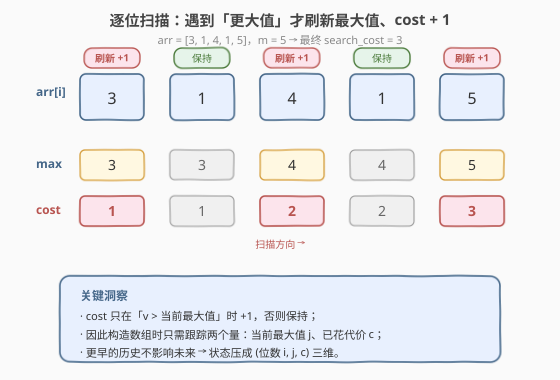
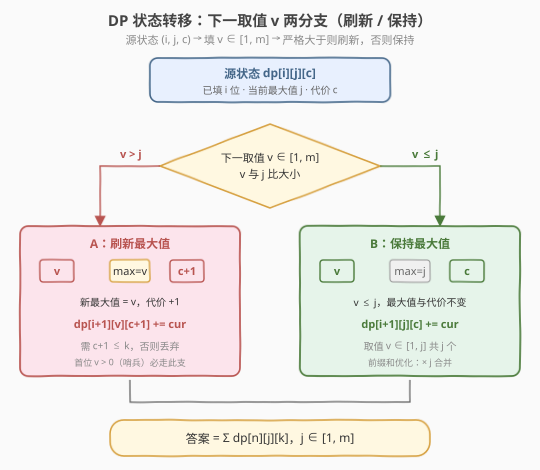

# LeetCode 生成数组 题解

## 1. 题目概述

- **标题 / 题号**：生成数组（#1420，hard）
- **链接**：https://leetcode.cn/problems/build-array-where-you-can-find-the-maximum-exactly-k-comparisons/
- **难度**：困难
- **标签**：动态规划、计数 DP、前缀和优化

**题意**：给你三个整数 `n`、`m`、`k`。定义如下「找最大值」算法对一个长度为 `n`、元素取值在 `[1, m]` 的正整数数组 `arr` 执行：

```text
maximum_value = -1
search_cost = 0
for i = 0 to n-1:
    if maximum_value < arr[i]:
        maximum_value = arr[i]
        search_cost += 1
```

即：从左到右扫描，每遇到一个**比当前最大值更大的元素**，就更新最大值并把 `search_cost` 加 1（第一个元素必然触发一次更新）。

请你统计：满足 `search_cost == k` 的数组 `arr` 的数目，答案对 $10^9+7$ 取模。

**示例 1**：

```text
输入：n = 2, m = 3, k = 1
输出：6
解释：cost=1 意味着首元素即为全局最大、之后不再更新。首元素 v∈{1,2,3}，
      第二个元素须 ≤ v：v=1→1 种，v=2→2 种，v=3→3 种，共 1+2+3=6。
      合法数组：[1,1],[2,1],[2,2],[3,1],[3,2],[3,3]。
```

**示例 2**：

```text
输入：n = 5, m = 2, k = 3
输出：0
解释：m=2 时最大值最多从 1 升到 2，cost 至多为 2，不可能达到 3。
```

**示例 3**：

```text
输入：n = 9, m = 1, k = 1
输出：1
解释：唯一数组 [1,1,...,1]，首元素触发 cost=1，之后不再更新。
```

**约束**：

- `1 <= n <= 50`
- `1 <= m <= 100`
- `0 <= k <= n`

> 💡 本题的灵魂是「**逐位构造 + 跟踪当前最大值与已花费代价**」——`search_cost` 只在「新最大值出现」时增长，因此构造数组时只需关心两个状态量：**当前最大值** `j` 和**已花代价** `c`。这是一个典型的**计数型 DP**：状态 `(已填位数 i, 当前最大值 j, 代价 c)`，转移按下一个元素是否刷新最大值分两支。

## 2. 解题思路

### 2.1 暴力思路：枚举所有数组

最直观：枚举所有 $m^n$ 个长度为 `n`、元素在 `[1, m]` 的数组，对每个数组模拟上述算法求 `search_cost`，统计等于 `k` 的个数。

问题在于——

- **方案数指数级**：$m^n$ 是天文数字（$n=50, m=100$ 时约 $10^{100}$），完全不可行；
- **大量重复计算**：不同数组共享相同前缀与相同「当前最大值/代价」状态，后续可填方案数完全一致，却被反复重算。

> ⚠️ 这种「枚举全体」的写法**完全没有利用「前缀的当前最大值与代价决定了后续填法数」这一性质**——前缀的所有历史信息被压缩进 `(当前最大值, 代价)` 两个量，后续填法数与具体前缀无关。这正是 DP 的切入点。

### 2.2 核心观察：三维计数 DP（位数 × 当前最大值 × 代价）



**状态定义**：`dp[i][j][c]` = 已填 `i` 个位置、**当前最大值**为 `j`、**已花代价**为 `c` 的方案数。其中：

- `i ∈ [0, n]`：已填位数；
- `j ∈ [0, m]`：当前最大值；约定 `j=0` 为「还没填任何数」的**哨兵**，由于元素取值 $\geq 1$，任何真实元素都 $> 0$，第一个数必然刷新最大值；
- `c ∈ [0, k]`：已花代价（`c` 不超过 `k`，超过的不再记录）。

**关键转移**：从状态 `(i, j, c)` 填下一个数 `v ∈ [1, m]`，分两支：

1. **`v > j`（刷新最大值）**：新最大值变为 `v`、代价 `+1` → 转移到 `dp[i+1][v][c+1]`；
2. **`v ≤ j`（保持最大值）**：最大值不变、代价不变 → 转移到 `dp[i+1][j][c]`。

> 为什么只需跟踪「当前最大值」而非整个前缀？因为 `search_cost` 的递推只依赖「当前最大值」这一个量——下一个数是否触发更新，只看它和当前最大值的大小关系，与更早的历史无关。前缀的全部影响被压缩进 `(j, c)` 两个维度，后续填法数与具体前缀无关。这是**最优子结构在计数问题上的体现**。

**基底与答案**：

- 基底：`dp[0][0][0] = 1`（0 个数、最大值哨兵 0、代价 0，唯一空方案）；其余为 0。
- 答案：$\sum_{j=1}^{m} dp[n][j][k] \bmod (10^9+7)$（填满 `n` 位、代价恰为 `k`、最大值任意）。

### 2.3 算法流程图



**`dp` 填充流程**（三重循环 + 内层枚举 `v`）：

1. **初始化**：`dp[0][0][0] = 1`；
2. **外层位数** `i = 0 → n-1`：从填了 `i` 位推进到 `i+1` 位；
3. **中层当前最大值** `j = 0 → m` 与**代价** `c = 0 → k`：枚举所有源状态 `(i, j, c)`；
4. **内层下一取值** `v = 1 → m`：
   - 若 `v > j` 且 `c+1 ≤ k`：`dp[i+1][v][c+1] += dp[i][j][c]`；
   - 否则（`v ≤ j`）：`dp[i+1][j][c] += dp[i][j][c]`；
   - 全程对 $10^9+7$ 取模。
5. **出口**：返回 $\sum_{j=1}^{m} dp[n][j][k]$。

> 💡 **`j=0` 哨兵的意义**：用 `j=0` 统一表示「尚未填数」的初始态，避免对 `i=0` 特判——任何 `v ∈ [1, m]` 都 `> 0`，于是首个数自然走「刷新最大值」分支，从 `dp[0][0][0]` 转移到 `dp[1][v][1]`。这把「第一个数必触发 cost+1」的边界吞进了通用转移式，是计数 DP 常见的**哨兵消除特判**技巧。

### 2.4 示例演算

以示例 1 `n=2, m=3, k=1` 为例，逐层填充 `dp`（仅列非零状态）：

![示例 1 的 dp 表填充：从 dp[0][0][0]=1 到答案 6](../images/1420_example_walkthrough.svg)

- **`i=0`**：`dp[0][0][0] = 1`（空方案）。
- **`i=0 → i=1`**：从 `(j=0, c=0)` 出发，`v ∈ {1,2,3}` 都 `> 0`，各走「刷新」分支：
  - `dp[1][1][1] = 1`、`dp[1][2][1] = 1`、`dp[1][3][1] = 1`。
- **`i=1 → i=2`**：对每个 `(j, c=1)` 填第二个数 `v`：
  - `j=1, c=1`（1 种）：`v=1` 走「保持」→ `dp[2][1][1] += 1`；`v=2,3` 走「刷新」→ `cost=2 > k=1`，**丢弃**；
  - `j=2, c=1`（1 种）：`v ∈ {1,2}` 走「保持」→ `dp[2][2][1] += 2`；`v=3` 刷新 → 丢弃；
  - `j=3, c=1`（1 种）：`v ∈ {1,2,3}` 全走「保持」→ `dp[2][3][1] += 3`。
- **答案**：`dp[2][1][1] + dp[2][2][1] + dp[2][3][1] = 1 + 2 + 3 = 6`。

> 💡 这正是示例 1 解释里 `1+2+3=6` 的来源：首元素 `v` 越大，其后能「保持不刷新」的取值越多（恰有 `v` 个 `≤ v` 的数），方案数随首元素线性累加。`k=1` 把所有「刷新」分支（`cost` 会变 2）全部丢弃，只留下「保持」分支——这就是「首元素即全局最大、之后不再更新」的 DP 视角。

## 3. 参考代码

### C++

```cpp
// 生成数组.cpp —— 三维计数 DP，O(n·m²·k)
// 编译: g++ -O2 -std=c++17 生成数组.cpp -o build_array
#include <vector>
using namespace std;

class Solution {
public:
    int numOfArrays(int n, int m, int k) {
        if (k == 0) return 0;                       // cost 至少为 1（首元素必刷新）
        const int MOD = 1'000'000'007;
        // dp[i][j][c]：填 i 位、当前最大值 j、代价 c 的方案数
        vector<vector<vector<long long>>> dp(
            n + 1, vector<vector<long long>>(m + 1, vector<long long>(k + 1, 0)));
        dp[0][0][0] = 1;                            // 空方案基底（j=0 哨兵）
        for (int i = 0; i < n; ++i) {               // ① 推进位数
            for (int j = 0; j <= m; ++j) {          // ② 当前最大值
                for (int c = 0; c <= k; ++c) {      // ③ 代价
                    long long cur = dp[i][j][c];
                    if (cur == 0) continue;
                    for (int v = 1; v <= m; ++v) {  // ④ 下一取值
                        if (v > j) {
                            if (c + 1 <= k)
                                dp[i + 1][v][c + 1] = (dp[i + 1][v][c + 1] + cur) % MOD;
                        } else {
                            dp[i + 1][j][c] = (dp[i + 1][j][c] + cur) % MOD;
                        }
                    }
                }
            }
        }
        long long ans = 0;
        for (int j = 1; j <= m; ++j) ans = (ans + dp[n][j][k]) % MOD;
        return (int)ans;
    }
};
```

### Python

```python
class Solution:
    def numOfArrays(self, n: int, m: int, k: int) -> int:
        if k == 0:
            return 0
        MOD = 1_000_000_007
        # dp[j][c]：当前位、当前最大值 j、代价 c 的方案数（滚动 i 维）
        dp = [[0] * (k + 1) for _ in range(m + 1)]
        dp[0][0] = 1                               # 空方案基底（j=0 哨兵）
        for _ in range(n):                         # ① 推进位数
            ndp = [[0] * (k + 1) for _ in range(m + 1)]
            for j in range(m + 1):                 # ② 当前最大值
                for c in range(k + 1):             # ③ 代价
                    cur = dp[j][c]
                    if cur == 0:
                        continue
                    for v in range(1, m + 1):      # ④ 下一取值
                        if v > j:
                            if c + 1 <= k:
                                ndp[v][c + 1] = (ndp[v][c + 1] + cur) % MOD
                        else:
                            ndp[j][c] = (ndp[j][c] + cur) % MOD
            dp = ndp
        return sum(dp[j][k] for j in range(1, m + 1)) % MOD
```

> 💡 两版等价。Python 版用**滚动数组**（`dp/ndp` 仅保留当前与下一层）把空间从 $O(nmk)$ 降到 $O(mk)$。`if cur == 0: continue` 跳过空状态，常数优化显著。注意 `j=0` 哨兵参与通用转移，避免对首位特判。

## 4. 复杂度分析

| 维度 | 三维计数 DP（主） | 前缀和优化（第 5 节） | 暴力枚举 |
|------|------------------|----------------------|----------|
| 时间复杂度 | $O(n \cdot m^2 \cdot k)$ | $O(n \cdot m \cdot k)$ | $O(m^n \cdot n)$ |
| 空间复杂度 | $O(m \cdot k)$（滚动） | $O(m \cdot k)$ | $O(n)$ |
| 实际运算量 | $n=50,m=100,k=50$ 约 $2.5 \times 10^7$，C++ 毫秒级 | 约 $2.5 \times 10^5$，Python 毫秒级 | 不可行 |

> ⚠️ **Python 注意**：$O(n m^2 k) \approx 2.5 \times 10^7$ 在纯 Python 中偏慢（约数秒），可能超时。若用 Python 提交，建议直接采用第 5 节的**前缀和优化**版本，$O(nmk) \approx 2.5 \times 10^5$，毫秒级通过。C++ 主版已足够快。

## 5. 扩展：前缀和优化 O(n·m·k)

瓶颈在于内层 `for v = 1..m`：对每个源状态 `(j, c)` 线性枚举所有取值。注意到转移可拆成两个**可前缀和加速**的部分。固定 `i` 与 `c`，令 $f[j] = dp[i][j][c]$：

1. **保持分支**（`v ≤ j`）：对当前最大值 `j`，有 $j$ 个取值（`v ∈ [1, j]`）保持不变，贡献到 `ndp[j][c]`：

   $$\text{ndp}[j][c] \mathrel{+}= j \cdot f[j]$$

   （`j=0` 时 $j \cdot f[0] = 0$，哨兵自然不产生保持分支。）

2. **刷新分支**（`v > j`）：取值 `v` 成为新最大值、代价 `+1`，贡献到 `ndp[v][c+1]`。把「所有 `j < v` 的源」合并，得到：

   $$\text{ndp}[v][c+1] \mathrel{+}= \sum_{j=0}^{v-1} f[j] = \text{prefix}[v]$$

   其中 $\text{prefix}[v] = \text{prefix}[v-1] + f[v-1]$ 是 $f$ 的前缀和，$O(m)$ 预处理后每个 `v` $O(1)$ 查询。

于是内层 `m` 重循环被替换为：一次 $O(m)$ 前缀和 + 两次 $O(m)$ 线性累加，总复杂度 $O(n \cdot k \cdot m)$。

```python
class Solution:
    def numOfArrays(self, n: int, m: int, k: int) -> int:
        if k == 0:
            return 0
        MOD = 1_000_000_007
        dp = [[0] * (k + 1) for _ in range(m + 1)]
        dp[0][0] = 1
        for _ in range(n):
            ndp = [[0] * (k + 1) for _ in range(m + 1)]
            for c in range(k + 1):
                f = [dp[j][c] for j in range(m + 1)]      # 固定 c 的一列
                # 前缀和 prefix[v] = sum_{j<v} f[j]
                prefix = [0] * (m + 2)
                for v in range(1, m + 2):
                    prefix[v] = (prefix[v - 1] + f[v - 1]) % MOD
                # ① 保持分支：ndp[j][c] += j * f[j]
                for j in range(m + 1):
                    ndp[j][c] = (ndp[j][c] + j * f[j]) % MOD
                # ② 刷新分支：ndp[v][c+1] += prefix[v]（v ∈ [1,m]，需 c+1<=k）
                if c + 1 <= k:
                    for v in range(1, m + 1):
                        ndp[v][c + 1] = (ndp[v][c + 1] + prefix[v]) % MOD
            dp = ndp
        return sum(dp[j][k] for j in range(1, m + 1)) % MOD
```

> ⚠️ **正确性要点**：保持分支系数是 $j$ 而非 $j-1$——取值 `v ∈ [1, j]` 共 $j$ 个，**含 $v=j$**，因为刷新条件是严格 `v > j`，`v == j` 不刷新、归入保持。刷新分支 `prefix[v] = sum_{j=0}^{v-1} f[j]` 汇集所有 `j < v` 的源，与「严格 `v > j`」一致。两者不重不漏：每个 `(源 j, 取值 v)` 恰被计入一支。

> 💡 这个「**按转移方向拆分 + 前缀和合并同向贡献**」的优化，是计数 DP 的通用提速范式——凡转移式形如 `new[v] += sum_{j<v} f[j]` 都可用前缀和把 $O(m^2)$ 降到 $O(m)$。与 [526. 优美的排列](../0501-0600/526_优美的排列.md) 中状态压缩 DP 的「子集和加速」同属一脉，只是这里维度连续用前缀和、那里维度离散用子集和（SOS DP）。

## 6. 面试要点

1. **为什么状态只需 (位数, 当前最大值, 代价) 三维？**

   > `search_cost` 的递推 `if max < arr[i]: max = arr[i]; cost++` 只依赖「当前最大值」这一个历史量——下一个数是否刷新最大值，只看它和当前最大值的大小关系，与更早的元素无关。因此前缀的全部影响被压缩进 `(当前最大值 j, 代价 c)`，加上位数 `i` 共三维。这是「**最优子结构在计数问题上的体现**」：状态只保留影响未来的最少信息。

2. **`j=0` 哨兵解决了什么问题？**

   > 用 `j=0` 表示「尚未填数」的初始态，使首个数的转移走通用「`v > j` 刷新」分支（因元素 $\geq 1 > 0$），自然从 `dp[0][0][0]` 转到 `dp[1][v][1]`，无需对 `i=0` 或「第一个数必 cost+1」特判。这是计数 DP 常见的**哨兵消除特判**技巧——把边界条件并进通用转移式，代码更简洁、不易漏判。

3. **`k=0` 和 `k > m` 为什么无解？**

   > `search_cost` 至少为 1（首元素必刷新最大值），故 `k=0` 时答案恒为 0（代码开头早返回）。同时 `search_cost` 至多为「最大值严格递增的次数」，而最大值取值在 `[1, m]`、最多严格递增 $m$ 次，所以 $k > m$ 时也无解——但 $k \leq n \leq 50$ 而 $m$ 可达 100，此边界由 DP 自然给出 0，无需特判。

4. **保持分支的系数为什么是 `j` 而不是 `j-1` 或 `m-j`？**

   > 保持分支对应 `v ≤ j`（**含 `v == j`**，因刷新条件是严格 `v > j`），取值 `v ∈ [1, j]` 共 $j$ 个整数，故对 `ndp[j][c]` 贡献 $j \cdot f[j]$。常错点：误以为 `v < j`（不含等于）得 $j-1$，或误把刷新当成 `v ≥ j`。务必对齐「严格大于才刷新」的题意。

5. **前缀和优化为什么能把 $O(m^2)$ 降到 $O(m)$？**

   > 刷新分支 `ndp[v][c+1] += sum_{j<v} f[j]` 中，对每个 `v` 求的是 $f$ 的前缀和。预处理 `prefix[v] = prefix[v-1] + f[v-1]` 后，每个 `v` $O(1)$ 取值，总 $O(m)$。关键洞察是「**贡献方向一致**」：所有源 `j < v` 都流向同一个目标 `ndp[v][c+1]`，可按 `v` 累加而非按 `(j, v)` 二重枚举。

> 💡 **一句话总结**：1420 的灵魂是「**把 `search_cost` 的递推压成 `(当前最大值, 代价)` 两维状态**」——逐位填数，下一个数严格大于当前最大值则刷新（代价+1），否则保持。朴素三维 DP $O(n m^2 k)$ 清晰直观，前缀和把刷新分支的同向贡献合并，降到 $O(nmk)$。这套「计数 DP + 前缀和合并同向转移」是所有「按位构造、转移含区间求和」问题的通用范式。

## 同类练习题

| # | 题目 | 与本题的关联 |
|---|------|-------------|
| 526 | [优美的排列](https://leetcode.cn/problems/beautiful-arrangement/)（[题解](../0501-0600/526_优美的排列.md)） | 状态压缩计数 DP，bitmask 记已用集合；与 1420 同为计数型 DP，但状态离散用子集和（SOS）加速，此处连续用前缀和——离散 vs 连续的同类加速 |
| 1411 | [给 Nx3 网格图涂色的方案数](https://leetcode.cn/problems/paint-house-iii/)（[题解](1411_给Nx3网格图涂色的方案数.md)） | 相邻不同色的计数 DP，状态为「当前行末尾颜色模式」，与 1420 同为「逐位/逐行构造 + 状态压缩」计数 |
| 940 | [不同的子序列 II](https://leetcode.cn/problems/distinct-subsequences-ii/) | 计数 DP + 以「末位字符」分桶去重，转移含「总和减同字符贡献」，与 1420 前缀和合并同向贡献同思想 |
| 1987 | [不同的好子序列数目](https://leetcode.cn/problems/number-of-unique-good-subsequences/) | 逐位计数 DP + 前缀和合并，承接 940 与 1420 的「同向转移前缀和加速」范式 |
| 2318 | [不同骰子序列的数目](https://leetcode.cn/problems/number-of-distinct-roll-sequences/) | 约束相邻的计数 DP，状态为「上一位与上上位」，与 1420 的「跟踪少量历史量」同构 |
