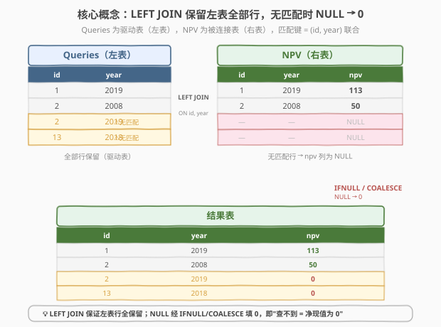
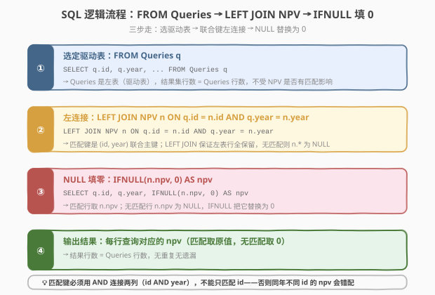
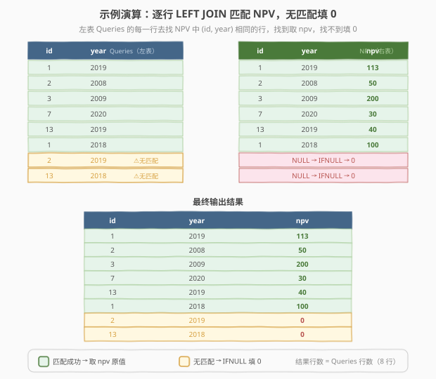

# 净现值查询

- **题目名称**：净现值查询
- **链接**：[1421. 净现值查询](https://leetcode.cn/problems/npv-queries/)
- **难度**：简单
- **标签**：SQL、LEFT JOIN、IFNULL、COALESCE、NULL 处理

## 1. 题目概述

给定 `NPV` 表和 `Queries` 表。`NPV` 表记录每个项目（`id`）在某一年（`year`）的净现值（`npv`）；`Queries` 表给出若干 `(id, year)` 查询对。编写 SQL 查询，为 `Queries` 表中的**每一行**返回对应的 `npv` 值。如果 `NPV` 表中**没有匹配的 `(id, year)` 记录**，则 `npv` 返回 `0`。

**表结构**：

```text
Table: NPV
+----------------+---------+
| Column Name    | Type    |
+----------------+---------+
| id             | int     |
| year           | int     |
| npv            | int     |
+----------------+---------+
（id, year）是该表的主键。

Table: Queries
+-------------+---------+
| Column Name | Type    |
+-------------+---------+
| id          | int     |
| year        | int     |
+-------------+---------+
（id, year）是该表的主键。
```

**示例 1**：

```text
NPV 表：
+------+--------+--------+
| id   | year   | npv    |
+------+--------+--------+
| 1    | 2018   | 100    |
| 7    | 2020   | 30     |
| 13   | 2019   | 40     |
| 1    | 2019   | 113    |
| 2    | 2008   | 50     |
| 3    | 2009   | 200    |
| 7    | 2019   | 100    |
| 3    | 2008   | 100    |
+------+--------+--------+

Queries 表：
+------+--------+
| id   | year   |
+------+--------+
| 1    | 2019   |
| 2    | 2008   |
| 3    | 2009   |
| 7    | 2020   |
| 13   | 2019   |
| 1    | 2018   |
| 2    | 2019   |
| 13   | 2018   |
+------+--------+

输出：
+------+--------+--------+
| id   | year   | npv    |
+------+--------+--------+
| 1    | 2019   | 113    |
| 2    | 2008   | 50     |
| 3    | 2009   | 200    |
| 7    | 2020   | 30     |
| 13   | 2019   | 40     |
| 1    | 2018   | 100    |
| 2    | 2019   | 0      |
| 13   | 2018   | 0      |
+------+--------+--------+
```

**解释**：

| 查询 (id, year) | NPV 中是否有匹配 | npv 取值 |
|-----------------|------------------|----------|
| (1, 2019) | ✅ 有 → npv = 113 | 113 |
| (2, 2008) | ✅ 有 → npv = 50 | 50 |
| (3, 2009) | ✅ 有 → npv = 200 | 200 |
| (7, 2020) | ✅ 有 → npv = 30 | 30 |
| (13, 2019) | ✅ 有 → npv = 40 | 40 |
| (1, 2018) | ✅ 有 → npv = 100 | 100 |
| (2, 2019) | ❌ 无匹配 | 0 |
| (13, 2018) | ❌ 无匹配 | 0 |

**约束条件**：

- `NPV.id` 和 `Queries.id` 为正整数
- `NPV.year` 和 `Queries.year` 为 2000 到 2050 之间的整数
- 结果可按任意顺序返回

> 💡 **关键点**：本题本质是 **LEFT JOIN + NULL 填零**。`Queries` 是驱动表（左表），对每行 `(id, year)` 去 `NPV` 表找匹配。`LEFT JOIN` 保证左表行全保留——找到匹配取 `npv` 原值，找不到则右表列为 `NULL`，再用 `IFNULL` / `COALESCE` 把 `NULL` 替换为 `0`。

---

## 2. 解题思路

### 2.1 暴力思路：INNER JOIN + UNION 补零

最直觉的思路是分两步走：

1. **INNER JOIN**：把 `Queries` 和 `NPV` 做内连接，取出所有有匹配的查询及其 `npv` 值；
2. **UNION 补零**：再写一个子查询，找出 `Queries` 中**没有匹配**的那些行，手动补 `npv = 0`，最后 `UNION` 合并。

```sql
-- 有匹配的行
SELECT q.id, q.year, n.npv
FROM Queries q JOIN NPV n ON q.id = n.id AND q.year = n.year
UNION
-- 无匹配的行补 0
SELECT q.id, q.year, 0 AS npv
FROM Queries q
WHERE NOT EXISTS (
    SELECT 1 FROM NPV n WHERE n.id = q.id AND n.year = q.year
)
```

这能 AC，但**冗长且低效**——需要两次扫描 `Queries`，且 `NOT EXISTS` 相关子查询对每行重复探测 `NPV`。问题的根源在于「**分两步处理匹配与不匹配**」的思维方式。

> ⚠️ **思路转换**：与其把「匹配」和「不匹配」分成两个分支处理，不如用 **LEFT JOIN** 统一处理——让数据库一次性把所有左表行保留下来，不匹配的右表列自动为 `NULL`，再用一个 `IFNULL` 函数统一替换。这是 SQL 中处理「**可能无匹配**」场景的标准范式。

### 2.2 核心观察：LEFT JOIN + IFNULL 统一处理



**LEFT JOIN（左连接）**的语义恰好契合本题需求：

$$\text{LEFT JOIN} = \underbrace{\text{匹配的行（取右表 npv）}}_{\text{INNER JOIN 部分}} \;\cup\; \underbrace{\text{不匹配的行（右表列为 NULL）}}_{\text{左表独有部分}}$$

具体而言：

| 情况 | LEFT JOIN 后右表 `n.npv` 的值 | `IFNULL(n.npv, 0)` 的结果 |
|------|-------------------------------|--------------------------|
| `Queries` 行在 `NPV` 中有匹配 | `n.npv` 的实际值（如 113） | 原值（113） |
| `Queries` 行在 `NPV` 中无匹配 | `NULL`（右表列全为 NULL） | `0` |

> 💡 **为什么用 LEFT JOIN 而非 INNER JOIN？** INNER JOIN 只保留两表都有匹配的行——`Queries` 中无匹配的行会被**丢弃**，导致结果少行。LEFT JOIN 则**保证左表行全保留**，无匹配的行右表列填 `NULL`——正好对应「查不到 → 净现值为 0」的语义。

**匹配键为何是 `(id, year)` 联合而非单列 `id`？**

`NPV` 表的主键是 `(id, year)`——同一个 `id` 在不同 `year` 有不同的 `npv`。如果只用 `id` 做 JOIN 条件，会导致同一查询行匹配到 `NPV` 中该 `id` 的**所有年份**行，产生**一对多笛卡尔积**，结果行数膨胀。因此必须用 `q.id = n.id AND q.year = n.year` 作为联合匹配条件，保证一对一精确匹配。

### 2.3 算法流程图



**完整步骤**：

| 步骤 | SQL 子句 | 作用 | 数据变化 |
|------|----------|------|----------|
| ① | `FROM Queries q` | 选定驱动表（左表） | 结果集 = `Queries` 全部行 |
| ② | `LEFT JOIN NPV n ON q.id = n.id AND q.year = n.year` | 联合键左连接 | 匹配行附加 `n.npv`；无匹配行 `n.*` = NULL |
| ③ | `SELECT q.id, q.year, IFNULL(n.npv, 0) AS npv` | NULL 填零 | NULL → 0，原值不变 |
| ④ | 输出结果 | 每行查询对应的 npv | 行数 = `Queries` 行数，无重复无遗漏 |

> 💡 **执行顺序**：① 确定左表 `Queries`（驱动表，结果行数由此决定）→ ② 对每行用 `(id, year)` 去 `NPV` 找匹配，LEFT JOIN 保证无匹配也保留 → ③ `IFNULL` 把 NULL 替换为 0。整条 SQL 只需一次 JOIN，数据库引擎自动选择哈希连接或嵌套循环。

### 2.4 示例演算

以题目示例逐步演算，`Queries` 共 8 行，`NPV` 共 8 行：



**逐行匹配过程**：

| 查询行 (id, year) | NPV 中查找 | 匹配结果 | npv 值 |
|-------------------|-----------|----------|--------|
| (1, 2019) | 找 (1, 2019) | ✅ 找到 npv=113 | 113 |
| (2, 2008) | 找 (2, 2008) | ✅ 找到 npv=50 | 50 |
| (3, 2009) | 找 (3, 2009) | ✅ 找到 npv=200 | 200 |
| (7, 2020) | 找 (7, 2020) | ✅ 找到 npv=30 | 30 |
| (13, 2019) | 找 (13, 2019) | ✅ 找到 npv=40 | 40 |
| (1, 2018) | 找 (1, 2018) | ✅ 找到 npv=100 | 100 |
| (2, 2019) | 找 (2, 2019) | ❌ 无匹配 → NULL | **0** |
| (13, 2018) | 找 (13, 2018) | ❌ 无匹配 → NULL | **0** |

> ⚠️ **注意 (2, 2019) 和 (13, 2018)**：`NPV` 表中有 `id=2` 的记录（年份 2008）和 `id=13` 的记录（年份 2019），但**没有** `(2, 2019)` 和 `(13, 2018)` 的组合记录。LEFT JOIN 后这两行的 `n.npv` 为 `NULL`，经 `IFNULL` 替换为 `0`。这就是为什么匹配键必须是 `(id, year)` **联合键**——只看 `id` 会误以为有匹配。

---

## 3. 参考代码

### SQL（解法 A：LEFT JOIN + IFNULL，推荐）

```sql
SELECT q.id, q.year, IFNULL(n.npv, 0) AS npv
FROM Queries q
LEFT JOIN NPV n
  ON q.id = n.id AND q.year = n.year;
```

> 💡 **写法要点**：
> - `FROM Queries q`：`Queries` 是**左表（驱动表）**，结果行数由它决定。
> - `LEFT JOIN NPV n`：`NPV` 是右表，LEFT JOIN 保证左表行全保留。
> - `ON q.id = n.id AND q.year = n.year`：**两列联合匹配**，用 `AND` 连接。不能用 `OR`，也不能只匹配一列。
> - `IFNULL(n.npv, 0)`：当 `n.npv` 为 `NULL`（无匹配）时返回 `0`，否则返回原值。

### SQL（解法 B：LEFT JOIN + COALESCE）

```sql
SELECT q.id, q.year, COALESCE(n.npv, 0) AS npv
FROM Queries q
LEFT JOIN NPV n
  ON q.id = n.id AND q.year = n.year;
```

> 💡 **`COALESCE` vs `IFNULL`**：`IFNULL(expr1, expr2)` 只接受两个参数——`expr1` 为 NULL 则返回 `expr2`。`COALESCE(expr1, expr2, ...)` 是 SQL 标准函数，接受**多个参数**，返回第一个非 NULL 值。本题只有一个列需要填零，两者完全等价。`COALESCE` 可移植性更好（PostgreSQL、SQL Server、SQLite 均支持），`IFNULL` 是 MySQL 方言。LeetCode 默认 MySQL，两者皆可。

### Python（pandas）

```python
import pandas as pd

def npv_queries(queries: pd.DataFrame, npv: pd.DataFrame) -> pd.DataFrame:
    result = queries.merge(npv, on=['id', 'year'], how='left')
    result['npv'] = result['npv'].fillna(0).astype(int)
    return result[['id', 'year', 'npv']]
```

> 💡 **pandas 对照**：`merge(on=['id', 'year'], how='left')` 对应 SQL 的 `LEFT JOIN NPV ON q.id = n.id AND q.year = n.year`；`fillna(0)` 对应 `IFNULL(n.npv, 0)`。`how='left'` 确保左表（`queries`）行全保留，无匹配的 `npv` 列为 `NaN`，经 `fillna(0)` 替换。逻辑与 SQL 解法 A 完全一致。

---

## 4. 复杂度分析

| 维度 | 复杂度 | 说明 |
|------|--------|------|
| **时间** | $O(n + m)$ | $n$ = `Queries` 行数，$m$ = `NPV` 行数。哈希连接：对 `NPV` 建哈希表 $O(m)$，再逐行扫描 `Queries` 查哈希 $O(n)$。若无索引且走嵌套循环则为 $O(n \times m)$ |
| **空间** | $O(m)$ | 哈希连接需对右表 `NPV` 建哈希表，空间 $O(m)$；若走嵌套循环则 $O(1)$ 额外空间 |
| **结果行数** | $O(n)$ | 恒等于 `Queries` 行数——LEFT JOIN 不增不减左表行 |

> ⚠️ 实际执行计划取决于数据库：若 `(id, year)` 有索引（本题为主键，天然有索引），NPV 侧可走索引查找，每行 $O(\log m)$，总时间 $O(n \log m)$。面试中说明「主键索引加速 → $O(n \log m)$；哈希连接 → $O(n + m)$」即可。

| 维度 | 解法 A（LEFT JOIN + IFNULL） | 暴力（INNER JOIN + UNION） |
|------|------------------------------|---------------------------|
| **时间** | $O(n + m)$ 或 $O(n \log m)$ | $O(n \times m)$（NOT EXISTS 相关子查询逐行探测） |
| **空间** | $O(m)$ | $O(1)$ |
| **扫描次数** | 1 次 JOIN | 2 次（JOIN + NOT EXISTS） |
| **可读性** | ★★★ 一条 JOIN 搞定 | ★★ 两段 UNION 拼接 |
| **推荐度** | ✅ 首选 | 备选 |

---

## 5. 扩展

### 5.1 LEFT JOIN vs INNER JOIN vs RIGHT JOIN

三种 JOIN 的区别在于「**如何处理无匹配行**」：

| JOIN 类型 | 无匹配行 | 结果行数 | 本题适用？ |
|-----------|----------|----------|------------|
| **INNER JOIN** | 丢弃 | $\le \min(n, m)$ | ❌ 无匹配的查询行被丢弃，结果少行 |
| **LEFT JOIN** | 左表行保留，右表列填 NULL | $= n$（左表行数） | ✅ 保证所有查询行都出现 |
| **RIGHT JOIN** | 右表行保留，左表列填 NULL | $= m$（右表行数） | ❌ 结果行数由 NPV 决定，多出非查询行 |
| **FULL JOIN** | 两表无匹配行都保留 | $\ge \max(n, m)$ | ❌ 多出 NPV 中未被查询的行 |

> 💡 **选择题**：驱动表（FROM 后的表）是需要**全保留**的那张表。本题需要保留 `Queries` 的所有行，所以 `Queries` 在左、用 LEFT JOIN。如果反过来 `FROM NPV LEFT JOIN Queries`，则结果行数由 `NPV` 决定，多出 NPV 中未被查询的行——不符合题意。

### 5.2 IFNULL / COALESCE / ISNULL / NVL 对比

不同数据库的 NULL 填默认值函数：

| 函数 | 数据库 | 语法 | 参数数 |
|------|--------|------|--------|
| `IFNULL(expr1, expr2)` | MySQL | `IFNULL(n.npv, 0)` | 2 |
| `COALESCE(expr1, expr2, ...)` | SQL 标准（MySQL / PG / SQL Server / SQLite） | `COALESCE(n.npv, 0)` | $\ge 2$ |
| `ISNULL(expr1, expr2)` | SQL Server | `ISNULL(n.npv, 0)` | 2 |
| `NVL(expr1, expr2)` | Oracle | `NVL(n.npv, 0)` | 2 |

> 💡 LeetCode 默认 MySQL 环境，`IFNULL` 和 `COALESCE` 均可用。面试中推荐用 `COALESCE`——它是 SQL 标准函数，跨数据库通用，且支持多参数链式回退（如 `COALESCE(a, b, c, 0)` 依次找第一个非 NULL）。

### 5.3 变体：如果要求「无匹配时返回 NULL 而非 0」？

去掉 `IFNULL` 即可——LEFT JOIN 无匹配时右表列天然为 NULL：

```sql
SELECT q.id, q.year, n.npv
FROM Queries q
LEFT JOIN NPV n
  ON q.id = n.id AND q.year = n.year;
```

这对应「**查询某项数据，不存在则明确返回空**」的语义。是否填默认值取决于业务需求：报表展示通常填 0（避免 NULL 参与运算的麻烦），而数据导出可能保留 NULL（区分「不存在」与「值为 0」）。

---

## 6. 面试要点

1. **为什么用 LEFT JOIN 而不是 INNER JOIN？**

   > INNER JOIN 只保留两表都有匹配的行，无匹配的 `Queries` 行会被丢弃，结果少行。LEFT JOIN 保证左表行全保留，无匹配的行右表列填 NULL——再用 `IFNULL` 替换为 0，恰好对应「查不到 = 净现值为 0」的语义。

2. **匹配键为什么是 `(id, year)` 联合而不是只用 `id`？**

   > `NPV` 表的主键是 `(id, year)`——同一 `id` 在不同 `year` 有不同 `npv`。若只用 `id` 匹配，同一查询行会匹配到该 `id` 的所有年份行，产生一对多笛卡尔积，结果行数膨胀。必须用 `q.id = n.id AND q.year = n.year` 联合匹配，保证一对一精确对应。

3. **`IFNULL` 和 `COALESCE` 有什么区别？**

   > `IFNULL(expr1, expr2)` 是 MySQL 方言，只接受两个参数。`COALESCE(expr1, expr2, ...)` 是 SQL 标准函数，接受多个参数，返回第一个非 NULL 值。本题单列填零两者等价，但 `COALESCE` 可移植性更好，推荐面试中使用。

4. **如果 NPV 表很大、Queries 也很大，如何优化？**

   > `NPV` 的 `(id, year)` 是主键，天然有索引。数据库会自动利用索引做嵌套循环连接（每行查询 $O(\log m)$ 索引查找）或哈希连接（$O(n + m)$）。如果 `Queries` 也有 `(id, year)` 索引，可走归并连接（$O(n + m)$，两表有序时）。面试中说明「主键索引加速 + 哈希连接」即可。

5. **LEFT JOIN 的结果行数由谁决定？**

   > 由**左表（FROM 后的表）**决定。LEFT JOIN 保留左表所有行，右表有匹配则附加列、无匹配则填 NULL。因此结果行数 $\ge$ 左表行数（若右表有多个匹配则可能更多）。本题 `FROM Queries`，结果行数 = `Queries` 行数，因为 `(id, year)` 是 NPV 主键，每个查询最多匹配一行 NPV。

> 💡 **一句话总结**：1421 是「**LEFT JOIN + IFNULL**」的经典应用——`Queries` 为左表保证全行保留，`ON (id, year)` 联合键精确匹配，`IFNULL(n.npv, 0)` 把无匹配的 NULL 替换为 0。一条 SQL 搞定「有匹配取原值，无匹配填零」的语义。

---

## 7. 同类练习题

- [183. 从不订购的客户](https://leetcode.cn/problems/customers-who-never-order/)（[题解](../0101-0200/183_从不订购的客户.md)）：LEFT JOIN + IS NULL 找「从未下单」的客户——与 1421 同为 LEFT JOIN 系列，但 1421 取匹配值填 0，183 利用 NULL 筛选不匹配行，对照理解 LEFT JOIN 的两种用法
- [181. 超过经理收入的员工](https://leetcode.cn/problems/employees-earning-more-than-their-managers/)（[题解](../0101-0200/181_超过经理收入的员工.md)）：Self JOIN（自连接）——同一张表做 JOIN，对照 1421 的两表 JOIN，理解 JOIN 的不同形态
- [184. 部门工资最高的员工](https://leetcode.cn/problems/department-highest-salary/)（[题解](../0101-0200/184_部门工资最高的员工.md)）：JOIN + GROUP BY + MAX——同样是两表 JOIN 但附带聚合，从 1421 的「取匹配列」升级为「取匹配组的极值」
- [175. 组合两个表](https://leetcode.cn/problems/combine-two-tables/)：LEFT JOIN 的母题——「无论是否有匹配都返回 Person 的所有行」，与 1421 的 LEFT JOIN 逻辑完全一致，是入门 LEFT JOIN 的最佳练习
- [570. 至少有5名直接下属的经理](https://leetcode.cn/problems/managers-with-at-least-5-direct-reports/)：JOIN + GROUP BY + HAVING COUNT——两表 JOIN 后做分组过滤，从 1421 的「单行匹配」扩展到「分组统计后筛选」
