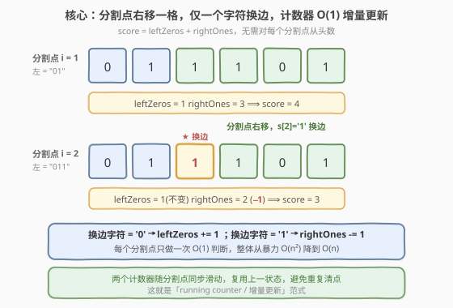
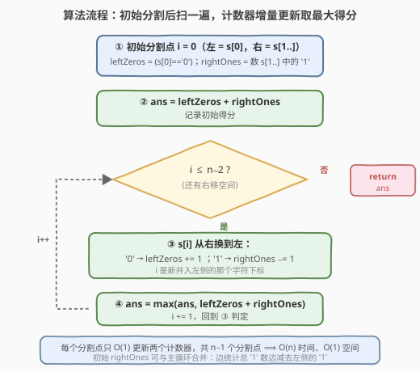
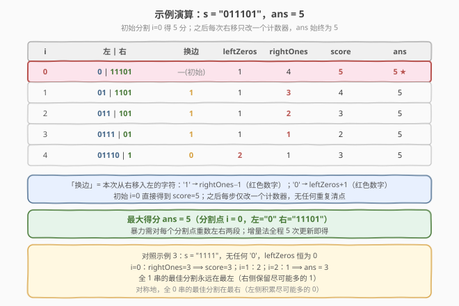

# LeetCode 分割字符串的最大得分 题解

## 1. 题目概述

- **标题 / 题号**：分割字符串的最大得分（#1422，easy）
- **链接**：https://leetcode.cn/problems/maximum-score-after-splitting-a-string/
- **难度**：简单
- **标签**：字符串、前缀和、枚举优化

**题意**：给你一个仅由 `0` 和 `1` 组成的字符串 `s`，将其分割成两个**非空**子字符串：左子串 `s[0..i]` 和右子串 `s[i+1..n-1]`（$i \in [0, n-2]$）。「得分」= 左子串中 `0` 的数量 + 右子串中 `1` 的数量。返回所有合法分割方案中的**最大得分**。

**示例 1**：

```text
输入：s = "011101"
输出：5
解释：
左="0"    右="11101"  得分 = 1 + 4 = 5  ★ 最大
左="01"   右="1101"   得分 = 1 + 3 = 4
左="011"  右="101"    得分 = 1 + 2 = 3
左="0111" 右="01"     得分 = 1 + 1 = 2
左="01110" 右="1"     得分 = 2 + 1 = 3
```

**示例 2**：

```text
输入：s = "00111"
输出：5
解释：左="00" 右="111"，得分 = 2 + 3 = 5。
```

**示例 3**：

```text
输入：s = "1111"
输出：3
解释：左="1" 右="111"，得分 = 0 + 3 = 3。串中无 '0'，leftZeros 恒为 0。
```

**约束**：

- $2 \le \text{s.length} \le 500$
- `s` 仅由字符 `'0'` 和 `'1'` 组成。

> 💡 **关键点**：合法分割点共 $n-1$ 个。朴素做法对每个分割点从头清点两段，$O(n^2)$。但相邻分割点只差**一个字符换边**——左段的 `0` 数与右段的 `1` 数都能 $O(1)$ 增量更新，整体降到 $O(n)$。这是一道典型的「**枚举优化 / running counter**」题。

## 2. 解题思路

### 2.1 暴力思路：每个分割点从头清点

最直观的做法：枚举每个分割点 $i \in [0, n-2]$，对每个 $i$ 扫一遍左段数 `0`、扫一遍右段数 `1`，得分取最大。

- **正确**：枚举了所有 $n-1$ 种合法分割，必然覆盖最优解。
- **低效**：每个分割点要 $O(n)$ 清点两段，共 $n-1$ 个分割点 ⟹ $O(n^2)$。本题 $n \le 500$，约 $2.5 \times 10^5$ 次操作能过，但完全没利用「相邻分割点几乎一样」这一结构。

> ⚠️ 暴力的浪费在于「**对每个分割点重算两段计数**」。其实从分割点 $i$ 滑到 $i+1$，只有 $s[i+1]$ 这一个字符从右侧搬到了左侧——左右两段的计数只需各动一下，无需重新清点。

### 2.2 核心观察：分割点右移一格，仅一个字符换边



把得分拆成两个独立计数器：

$$\text{score}(i) = \underbrace{\text{leftZeros}(i)}_{\text{左段 '0' 数}} + \underbrace{\text{rightOnes}(i)}_{\text{右段 '1' 数}}$$

当分割点从 $i$ 右移到 $i+1$ 时，字符 $s[i+1]$ 从**右段**搬到了**左段**。它对两个计数器的影响只取决于自身是 `0` 还是 `1`：

| 换边字符 $s[i+1]$ | leftZeros 变化 | rightOnes 变化 |
|------------------|----------------|----------------|
| `'0'` | $+1$（左段多一个 0） | 不变 |
| `'1'` | 不变 | $-1$（右段少一个 1） |

于是只需**维护 `leftZeros` 与 `rightOnes` 两个变量**，每移一格做一次 $O(1)$ 判断即可得到新得分，全程无需重新清点。

> 💡 **一句话**：相邻分割点之间是**增量关系**而非独立——复用上一状态的计数器，把 $O(n)$ 清点压成 $O(1)$ 更新，$n-1$ 个分割点合计 $O(n)$。这正是「**running counter / 增量更新**」范式。

> ⚠️ **初始状态怎么定？** 取最左分割点 $i=0$（左 = `s[0]`，右 = `s[1..n-1]`）：`leftZeros = (s[0]=='0') ? 1 : 0`，`rightOnes` = `s[1..n-1]` 中 `'1'` 的个数。随后从 $i=1$ 起逐格右移即可。

### 2.3 算法流程图



**完整步骤**：

1. **初始化**（分割点 $i=0$）：`leftZeros = (s[0]=='0')`，`rightOnes` = 统计 `s[1..n-1]` 中 `'1'` 的个数；
2. **记录初始得分** `ans = leftZeros + rightOnes`；
3. **遍历** $i$ 从 $1$ 到 $n-2$（把 $s[i]$ 从右段并入左段）：
   - 若 $s[i] ==$ `'0'`：`leftZeros += 1`；
   - 若 $s[i] ==$ `'1'`：`rightOnes -= 1`；
   - `ans = max(ans, leftZeros + rightOnes)`；
4. **返回** `ans`。

> 💡 注意循环范围：合法分割点 $i \in [0, n-2]$，$i=0$ 已在初始化处理，故主循环从 $i=1$ 起到 $n-2$ 止，共 $n-2$ 次增量更新。初始 `rightOnes` 也可与主循环合并——见第 5 节的合一写法。

### 2.4 示例演算

以示例 1 的 `s = "011101"` 为例（$n=6$，分割点 $i \in [0,4]$）：



| $i$ | 左 \| 右 | 换边 | leftZeros | rightOnes | score | ans |
|-----|----------|------|-----------|-----------|-------|-----|
| 0 | `"0"` \| `"11101"` | —（初始） | 1 | 4 | **5** ★ | 5 |
| 1 | `"01"` \| `"1101"` | `'1'` | 1 | 3 | 4 | 5 |
| 2 | `"011"` \| `"101"` | `'1'` | 1 | 2 | 3 | 5 |
| 3 | `"0111"` \| `"01"` | `'1'` | 1 | 1 | 2 | 5 |
| 4 | `"01110"` \| `"1"` | `'0'` | 2 | 1 | 3 | 5 |

初始 $i=0$ 即取得最大得分 5；之后每步仅改一个计数器（`'1'` 换边让 `rightOnes` 减 1，`'0'` 换边让 `leftZeros` 加 1），`ans` 始终保持 5。

> 以示例 2 的 `s = "00111"` 为例：初始 $i=0$（左=`"0"`，右=`"0111"`）score = 1+3 = 4；$i=1$（`'0'` 换边）leftZeros=2, rightOnes=3, score=5 ★；$i=2$（`'1'` 换边）leftZeros=2, rightOnes=2, score=4；$i=3$（`'1'`）score=3。`ans = 5` ✓。示例 3 的 `s = "1111"`：无 `'0'`，`leftZeros` 恒 0，初始 `rightOnes`=3 ⟹ `ans = 3` ✓。

## 3. 参考代码

### C++

```cpp
class Solution {
public:
    int maxScore(string s) {
        int n = s.size();
        int leftZeros = (s[0] == '0');
        int rightOnes = 0;
        for (int i = 1; i < n; ++i) rightOnes += (s[i] == '1');
        int ans = leftZeros + rightOnes;
        for (int i = 1; i < n - 1; ++i) {
            if (s[i] == '0') ++leftZeros;
            else             --rightOnes;
            ans = max(ans, leftZeros + rightOnes);
        }
        return ans;
    }
};
```

### Python

```python
class Solution:
    def maxScore(self, s: str) -> int:
        n = len(s)
        left_zeros = 1 if s[0] == '0' else 0
        right_ones = sum(1 for c in s[1:] if c == '1')
        ans = left_zeros + right_ones
        for i in range(1, n - 1):
            if s[i] == '0':
                left_zeros += 1
            else:
                right_ones -= 1
            ans = max(ans, left_zeros + right_ones)
        return ans
```

> 💡 **实现要点**：① 主循环范围 `i` 从 `1` 到 `n-2`——`i=0` 在初始化处理，`i=n-1` 会使右段为空（非法）。② 每次只对 `s[i]` 做一次分支：`'0'` 动 `leftZeros`，`'1'` 动 `rightOnes`，互斥不重叠。③ 初始 `rightOnes` 用一次扫描统计，也可与主循环合并为单趟（见第 5 节）。

## 4. 复杂度分析

| 维度 | 增量计数器 $O(n)$（推荐） | 暴力枚举 $O(n^2)$ |
|------|--------------------------|--------------------|
| **时间复杂度** | $O(n)$ | $O(n^2)$ |
| **空间复杂度** | $O(1)$ | $O(1)$ |
| **是否一次扫描** | 两趟（初始统计 + 主循环），可合一趟 | 否，每个分割点全量清点 |
| **数据敏感性** | 与字符分布无关 | 随 $n$ 平方增长 |

- **增量计数器**：初始统计 `rightOnes` 一趟 $O(n)$，主循环 $n-2$ 次 $O(1)$ 更新合计 $O(n)$；只额外用 `leftZeros`、`rightOnes`、`ans` 三个变量，空间 $O(1)$。是本题的最优解。
- **暴力枚举**：$n-1$ 个分割点每个 $O(n)$ 清点，合计 $O(n^2)$；$n \le 500$ 时约 $2.5 \times 10^5$ 次操作，毫秒级通过，但未利用相邻分割点的增量结构，理论劣于增量法。

> ⚠️ 本题 $n \le 500$，两种方法都能过。面试中写出增量版即体现对「相邻状态复用」这一结构的把握——这正是从 $O(n^2)$ 枚举优化到 $O(n)$ 的通用思路。

## 5. 扩展：代数化简与单趟合一写法

### 5.1 得分的代数变形

设全串 `'1'` 的总数为 $\text{totalOnes}$，左段（$s[0..i]$）中 `'0'` 数为 $z_i$、`'1'` 数为 $o_i$。则右段 `'1'` 数 = $\text{totalOnes} - o_i$，于是：

$$\text{score}(i) = z_i + (\text{totalOnes} - o_i) = \text{totalOnes} + (z_i - o_i)$$

$\text{totalOnes}$ 是与 $i$ 无关的常数，**最大化 $\text{score}(i)$ 等价于最大化 $z_i - o_i$**。这给出一个等价的单趟写法：先求 `totalOnes`，再随左段扩展维护 `diff = leftZeros - leftOnes`，取其最大值加 `totalOnes` 即可。

> 💡 这一变形把「两个计数器」压缩成「一个差值」`diff`，是 [724. 寻找数组的中心下标](../0701-0800/724_寻找数组的中心下标.md) 里「`rightSum = total - leftSum - nums[i]`」的同款手法——都用**总量减左段**消去右段，把双计数器化成单变量。

### 5.2 单趟合一实现

把「统计初始 `rightOnes`」与「主循环增量」合并为单趟：边读边维护 `leftZeros`、`leftOnes`，在尚未到末尾（$i < n-1$）时即更新得分。

```python
class Solution:
    def maxScore(self, s: str) -> int:
        total_ones = s.count('1')
        left_zeros = left_ones = 0
        ans = 0
        for i, c in enumerate(s):
            if c == '0':
                left_zeros += 1
            else:
                left_ones += 1
            if i < len(s) - 1:   # 右段非空才算合法分割
                ans = max(ans, left_zeros + total_ones - left_ones)
        return ans
```

> ⚠️ 注意 `if i < len(s) - 1` 的截断：$i = n-1$ 时右段为空，是非法分割，不得计入得分。这等价于「先并入左段再判定是否合法」，与 2.3 的「先更新计数器再算分」顺序一致。

## 6. 面试要点

1. **如何想到从 $O(n^2)$ 优化到 $O(n)$？**

   > 观察相邻分割点 $i$ 与 $i+1$ 的差异：左右两段只交换了 $s[i+1]$ 一个字符，其余完全不变。所以左段 `'0'` 数、右段 `'1'` 数都是**可增量表达**的——各只受那一个换边字符影响。一旦识别出「相邻状态 = 上一状态 + $O(1)$ 增量」，就从「每点重算」自然滑向「running counter」。

2. **为什么换边字符对两个计数器的影响是互斥的？**

   > `'0'` 换边只让左段 `'0'` 数 $+1$，右段 `'1'` 数不变（`'0'` 本来就不贡献 `'1'`）；`'1'` 换边只让右段 `'1'` 数 $-1$，左段 `'0'` 数不变。一个字符非 `'0'` 即 `'1'`，故两个计数器**每次恰有一个变动**，互斥不重叠——这是 $O(1)$ 更新的根本保证。

3. **初始状态为什么取最左分割点 $i=0$？**

   > 取 $i=0$（左 = `s[0]`，右 = `s[1..n-1]`）是最自然的起点：`leftZeros` 由 $s[0]$ 单字符决定，`rightOnes` 由剩余串一次性统计。随后主循环从 $i=1$ 起把 $s[i]$ 逐个并入左段，恰好覆盖所有合法分割点 $[0, n-2]$。也可取最右 $i=n-2$ 反向滑，对称等价。

4. **循环边界为什么是 $[1, n-2]$ 而不是 $[1, n-1]$？**

   > 合法分割要求左、右都非空，故 $i \in [0, n-2]$：$i=0$ 已在初始化处理，$i=n-1$ 会使右段为空（非法）。主循环因此只到 $n-2$。漏掉这一截断会多算一个右段为空的「分割」，得到错误的高分。

5. **代数变形 `score = totalOnes + (leftZeros - leftOnes)` 有何价值？**

   > 它把双计数器压缩成单差值 `diff = leftZeros - leftOnes`，最大化得分等价于最大化 `diff`。这既能写出更紧凑的单趟代码，也揭示了与 [724. 寻找数组的中心下标](../0701-0800/724_寻找数组的中心下标.md)「总量减左段消右段」同源的结构——遇到「左 + 右」型得分，先想想能否用总量把右段消掉。

> 💡 **一句话总结**：1422 的灵魂是「**相邻分割点只差一个字符换边**」——维护 `leftZeros`、`rightOnes` 两个计数器随分割点同步滑动，每步 $O(1)$ 更新取代 $O(n)$ 重算，$O(n)$ 时间、$O(1)$ 空间取最大得分。

## 同类练习题

| # | 题目 | 与本题的关联 |
|---|------|-------------|
| 724 | [寻找数组的中心下标](../0701-0800/724_寻找数组的中心下标.md) | 最佳镜像题，维护 `leftSum` 随中心点滑动、`rightSum = total − leftSum − nums[i]`，总量减左段消右段的手法与 1422 第 5 节同源 |
| 53 | [最大子数组和](../0001-0100/53_最大子数组和.md) | 维护「当前前缀和 − 历史最小前缀和」取最大，running max 的经典范式，对照 1422 维护计数器取最大 |
| 713 | [乘积小于K的子数组](../0701-0800/713_乘积小于K的子数组.md) | 滑动窗口 + 增量维护窗口乘积（右扩左缩），同样是「聚合量随窗口进出 $O(1)$ 更新」 |
| 11 | [盛最多水的容器](../0001-0100/11_盛最多水的容器.md) | 双指针从两端向内滑动，每步 $O(1)$ 重算容量，对照 1422 分割点单向滑动的增量更新 |
| 303 | [区域和检索 - 数组不可变](https://leetcode.cn/problems/range-sum-query-immutable/)（[题解](../0301-0400/303_区域和检索 - 数组不可变.md)） | 前缀和静态预处理母题，与 1422 的「在线增量」对照——前者预算前缀和数组支持 $O(1)$ 查询，后者边滑边更新无需存储 |
