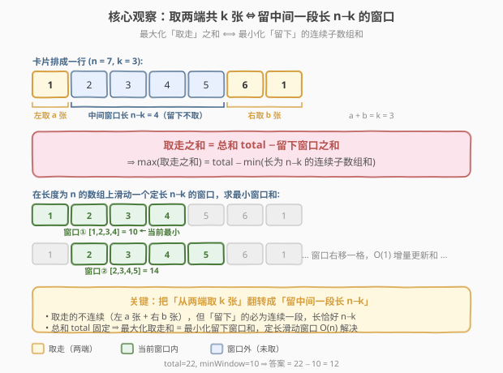
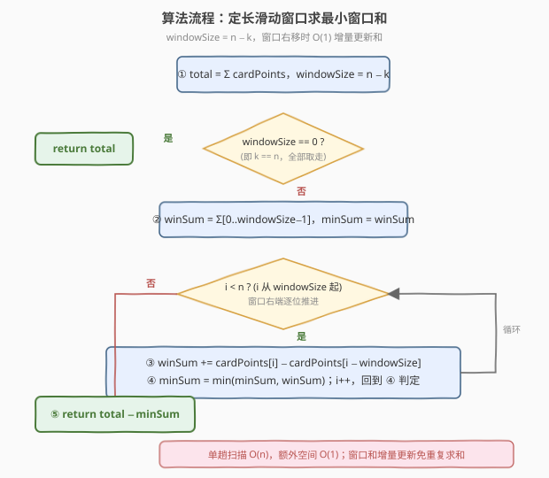
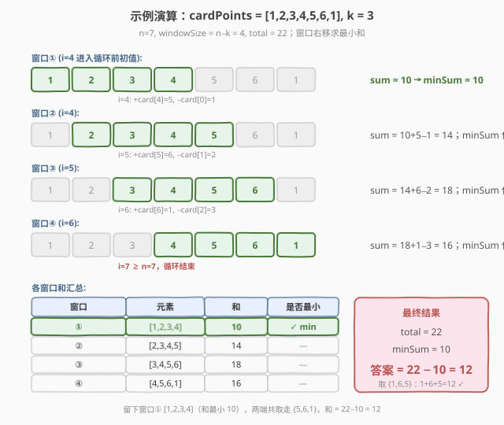

# LeetCode 可获得的最大点数 题解

## 1. 题目概述

- **标题 / 题号**：可获得的最大点数（#1423，medium）
- **链接**：https://leetcode.cn/problems/maximum-points-you-can-obtain-from-cards/
- **难度**：中等
- **标签**：数组、滑动窗口、前缀和

**题意**：几张卡牌排成一行，每张卡牌都有一个对应的点数（整数 `cardPoints[i]`）。每次行动可以从行的**开头**或**末尾**拿一张卡牌，**共拿 `k` 张**。你的得分是你拿到的卡牌点数之和。返回可以获得的最大分数。

**示例 1**：

```text
输入：cardPoints = [1,2,3,4,5,6,1], k = 3
输出：12
解释：第一次行动拿末尾的 1，再拿末尾的 6，最后拿末尾的 5，和 = 1 + 6 + 5 = 12。
```

**示例 2**：

```text
输入：cardPoints = [2,2,2], k = 2
输出：4
解释：拿两张 2，和 = 2 + 2 = 4。
```

**示例 3**：

```text
输入：cardPoints = [9,7,7,9,7,7,9], k = 7
输出：55
解释：k == n，所有卡牌都拿走，和 = 全部元素之和。
```

**约束**：

- $1 \le \text{cardPoints.length} \le 10^5$
- $1 \le \text{cardPoints[i]} \le 10^4$
- $1 \le k \le \text{cardPoints.length}$

> 💡 本题看似是"两端轮流取"的博弈/DP 题，但关键观察是：**从两端共取走 `k` 张后，剩下的必定是中间一段长度恰为 $n-k$ 的连续子数组**。把"最大化取走之和"翻转成"最小化留下窗口之和"，问题立刻退化为一个**定长滑动窗口求最小和**，$O(n)$ 一趟搞定。

## 2. 解题思路

### 2.1 暴力思路：枚举左右分配

共取 `k` 张，左侧取 `a` 张则右侧取 `b = k - a` 张（$0 \le a \le k$）。枚举所有 $a \in [0, k]$，计算前缀和 $a$ 张 + 后缀和 $b$ 张的总和取最大值。借助前缀和可做到 $O(k)$，但若直接每次重新求和则为 $O(k^2)$，且思路仍停留在"枚举两端分配"，没看到问题的连续结构。

> ⚠️ $O(k)$ 前缀和方案其实已可通过（$k \le n \le 10^5$），但下面的"翻转成中间窗口"思路更优雅，也更容易推广到"元素可能为负/前缀和不单调"等变体。

### 2.2 核心观察：取两端 k 张 ⇔ 留中间长 n−k 的窗口



**关键转换**：设左侧取走 `a` 张、右侧取走 `b` 张，$a + b = k$。那么"取走"的卡牌位于数组两端（`[0, a)` 和 `[n-b, n)`），而**没有被取走的卡牌恰好是中间一段连续子数组 `[a, n-b)`**，其长度为：

$$
n - b - a = n - (a + b) = n - k
$$

即无论怎么分配 $a, b$，**留下的连续段长度恒为 $n - k$**，只是起始位置不同。记数组总和为 $\text{total}$，留下窗口和为 $W$，则：

$$
\text{取走之和} = \text{total} - W
$$

由于 $\text{total}$ 固定，**最大化取走之和 ⟺ 最小化 $W$**。于是问题变成：**在长度为 $n$ 的数组上，求所有长度为 $n - k$ 的连续子数组和的最小值**——标准定长滑动窗口。

> ⚠️ **边界**：当 $k = n$ 时，$n - k = 0$，即没有留下任何卡牌，直接返回 $\text{total}$。代码中需特判 `windowSize == 0` 避免下标越界。

### 2.3 算法流程图



1. **预处理**：算 $\text{total} = \sum \text{cardPoints}$，令 $\text{windowSize} = n - k$。
2. **特判**：若 $\text{windowSize} == 0$，返回 $\text{total}$。
3. **初始化窗口**：令 $\text{winSum} = \sum_{i=0}^{\text{windowSize}-1} \text{cardPoints}[i]$，$\text{minSum} = \text{winSum}$。
4. **滑动**：让窗口右端 $i$ 从 $\text{windowSize}$ 走到 $n-1$，每步增量更新：
   - 进新元素 $\text{cardPoints}[i]$，出旧元素 $\text{cardPoints}[i - \text{windowSize}]$；
   - $\text{winSum} \mathrel{+}= \text{cardPoints}[i] - \text{cardPoints}[i - \text{windowSize}]$；
   - $\text{minSum} = \min(\text{minSum}, \text{winSum})$。
5. **返回**：$\text{total} - \text{minSum}$。

> 💡 **实现技巧**：滑动窗口的增量更新 `winSum += new - old` 是 $O(1)$ 的，无需每次重新求和；窗口恰好覆盖 $n - \text{windowSize} + 1 = k + 1$ 个位置（从全在左到全在右），对应 $a$ 从 $0$ 到 $k$ 的所有分配，一一对应不重不漏。

### 2.4 示例演算

以 `cardPoints = [1,2,3,4,5,6,1], k = 3` 为例。$n = 7$，$\text{windowSize} = 7 - 3 = 4$，$\text{total} = 22$。



| 步骤 | 窗口右端 $i$ | 窗口元素 | 窗口和 $\text{winSum}$ | $\text{minSum}$ | 增量更新 |
|------|-------------|----------|------------------------|-----------------|----------|
| 初值 | —（窗口 `[0,4)`） | `[1,2,3,4]` | 10 | 10 | 初始求和 |
| ① | 4 | `[2,3,4,5]` | 14 | 10 | +5 −1 |
| ② | 5 | `[3,4,5,6]` | 18 | 10 | +6 −2 |
| ③ | 6 | `[4,5,6,1]` | 16 | 10 | +1 −3 |

**最终**：$\text{minSum} = 10$（对应窗口 `[1,2,3,4]`），答案 $= 22 - 10 = 12$。✓

> 💡 **对应到原题**：留下 `[1,2,3,4]` 即取走两端 `{5, 6, 1}`（左 0 张 + 右 3 张），和 $= 5+6+1 = 12$。也可验证另一种最优分配：留 `[2,3,4,5]`（和 14）→ 取走 `{1,6,1}` $= 8$，更小；留 `[3,4,5,6]`（和 18）→ 取走 `{1,2,1}` $= 4$；留 `[4,5,6,1]`（和 16）→ 取走 `{1,2,3}` $= 6$。最大确实是 12，与窗口最小和 10 对应。✓

## 3. 参考代码

### C++

```cpp
// 可获得的最大点数.cpp —— 滑动窗口求最小窗口和
// 编译: g++ -O2 -std=c++17 可获得的最大点数.cpp -o maxpoints
class Solution {
public:
    int maxScore(vector<int>& cardPoints, int k) {
        int n = cardPoints.size();
        int total = accumulate(cardPoints.begin(), cardPoints.end(), 0);
        int windowSize = n - k;
        if (windowSize == 0) return total;          // k == n，全部取走
        int winSum = accumulate(cardPoints.begin(), cardPoints.begin() + windowSize, 0);
        int minSum = winSum;
        for (int i = windowSize; i < n; ++i) {
            winSum += cardPoints[i] - cardPoints[i - windowSize];
            minSum = min(minSum, winSum);
        }
        return total - minSum;
    }
};
```

### Python

```python
class Solution:
    def maxScore(self, cardPoints: List[int], k: int) -> int:
        n = len(cardPoints)
        total = sum(cardPoints)
        window_size = n - k
        if window_size == 0:
            return total
        win_sum = sum(cardPoints[:window_size])
        min_sum = win_sum
        for i in range(window_size, n):
            win_sum += cardPoints[i] - cardPoints[i - window_size]
            if win_sum < min_sum:
                min_sum = win_sum
        return total - min_sum
```

> 💡 **实现细节**：① `windowSize == 0` 特判避免 `cardPoints[:0]` 求和为 0 后再用 `i - windowSize` 越界（虽然 Python 切片安全，但 C++ 中 `cardPoints[i - 0]` 会重复减自身，逻辑错误，故必须特判）。② 滑动循环从 `windowSize` 开始到 `n-1`，共 `k` 次迭代，对应 `k+1` 个窗口位置（含初值）。③ 全程无需额外数组，`winSum` / `minSum` 两个变量即可。

## 4. 复杂度分析

| 维度 | 复杂度 | 说明 |
|------|--------|------|
| **时间** | $O(n)$ | 求 `total` 扫一遍 $O(n)$；初始化首窗口 $O(n-k)$；滑动循环 $k$ 次 $O(1)$ 增量更新。总和 $O(n)$ |
| **空间** | $O(1)$ | 仅用 `total`、`winSum`、`minSum` 等常数个变量，原地滑动不复制数组 |
| **思路** | 正难则反 / 定长滑动窗口 | 把"两端取 $k$ 张的最大和"翻转为"中间留 $n-k$ 张的最小和"，暴露连续结构后用滑动窗口 |

> ⚠️ **对比暴力**：直接枚举左右分配并用前缀和是 $O(k)$（$k \le n$），常数更小但思路不够通用；若题目改为"卡牌点数可能为负"或"留窗口需满足额外约束"，滑动窗口仍可扩展，而前缀和枚举不再适用。

## 5. 扩展：前缀和双端枚举解法

除滑动窗口外，也可用**前缀和 + 后缀和**直接枚举左右分配：

- 预处理前缀和 $\text{pre}[i] = \sum_{j=0}^{i-1} \text{cardPoints}[j]$，后缀和 $\text{suf}[i] = \sum_{j=n-i}^{n-1} \text{cardPoints}[j]$。
- 枚举左侧取 $a$ 张（$0 \le a \le k$），右侧取 $k - a$ 张，得分 $= \text{pre}[a] + \text{suf}[k - a]$。
- 取最大值即为答案。

```cpp
int maxScore(vector<int>& cardPoints, int k) {
    int n = cardPoints.size();
    vector<int> pre(k + 1, 0), suf(k + 1, 0);
    for (int i = 0; i < k; ++i) pre[i + 1] = pre[i] + cardPoints[i];
    for (int i = 0; i < k; ++i) suf[i + 1] = suf[i] + cardPoints[n - 1 - i];
    int ans = 0;
    for (int a = 0; a <= k; ++a) ans = max(ans, pre[a] + suf[k - a]);
    return ans;
}
```

**复杂度**：时间 $O(k)$，空间 $O(k)$（可压到 $O(1)$，只用一个后缀和变量配合前缀和滚动）。该方案直观对应"左右分配"的原意，但 $k$ 较大时与滑动窗口同为 $O(n)$；两种思路等价——滑动窗口的最小窗口和 $W_{\min}$ 恰好使 $\text{total} - W_{\min} = \max_a (\text{pre}[a] + \text{suf}[k-a])$。

> 💡 **两种思路的联系**：滑动窗口枚举的是"留下窗口的起点 $a \in [0, k]$"，窗口和 $= \text{total} - (\text{pre}[a] + \text{suf}[k-a])$，故"最小窗口和"与"最大前后缀和"严格对偶，是同一问题的两面。

## 6. 面试要点

1. **为什么从两端取 k 张，留下的必定是连续一段？**

   > 设左取 `a`、右取 `b`，$a+b=k$。取走的是前缀 `[0,a)` 和后缀 `[n-b,n)`，中间未被触碰的 `[a, n-b)` 必连续，长度 $n-b-a = n-k$ 恒定。这是把问题转化为滑动窗口的几何依据。

2. **为什么最大化取走和 = 最小化留下窗口和？**

   > 总和 $\text{total}$ 固定，取走和 $= \text{total} - W$（$W$ 为留下窗口和）。固定被减数，最大化差 ⟺ 最小化减数。故问题等价于"长 $n-k$ 的连续子数组最小和"。

3. **滑动窗口如何 O(1) 更新窗口和？**

   > 窗口右移一格：右端进新元素 `cardPoints[i]`，左端出旧元素 `cardPoints[i - windowSize]`，`winSum += cardPoints[i] - cardPoints[i - windowSize]`。无需重新求和，单次 $O(1)$。

4. **`windowSize == 0` 为什么要特判？**

   > $k = n$ 时窗口长为 0，意为"没有卡牌留下，全部取走"，直接返回 `total`。若不特判，C++ 中 `cardPoints[i - 0]` 会减去自身导致 `winSum` 恒为 0，逻辑错误；Python 切片虽安全但语义混乱。特判保证正确且清晰。

5. **时间空间复杂度？**

   > 时间 $O(n)$：求和 + 滑窗各扫一遍。空间 $O(1)$：仅常数变量。$n \le 10^5$ 下完全无压力。

> 💡 **一句话总结**：1423 是"正难则反"的招牌题——从两端取 `k` 张的最大和，翻转成留中间长 `n−k` 的最小窗口和，定长滑动窗口 $O(n)/O(1)$ 一趟搞定。

## 同类练习题

| # | 题目 | 与本题的关联 |
|---|------|-------------|
| 209 | [长度最小的子数组](https://leetcode.cn/problems/minimum-size-subarray-sum/)（[题解](../0201-0300/209_长度最小的子数组.md)） | 变长滑动窗口求最短子数组和 ≥ target，对照本题"定长窗口求最小和"的窗口长度固定 vs 可变 |
| 713 | [乘积小于K的子数组](https://leetcode.cn/problems/subarray-product-less-than-k/)（[题解](../0701-0800/713_乘积小于K的子数组.md)） | 滑动窗口 + 计数 `right−left+1`，同为窗口右移 O(1) 增量维护的套路 |
| 643 | [子数组最大平均数 I](https://leetcode.cn/problems/maximum-average-subarray-i/) | 定长滑动窗口求最大和，与本题"求最小和"方向相反、模板一致 |
| 239 | [滑动窗口最大值](https://leetcode.cn/problems/sliding-window-maximum/)（[题解](../0201-0300/239_滑动窗口最大值.md)） | 定长窗口求最大值需单调队列，对照本题求和只需 O(1) 增量，体会"和"可增量而"最值"需单调结构 |
| 1652 | [拆炸弹](https://leetcode.cn/problems/defuse-the-bomb/) | 环形数组定长窗口求和，承接本题滑动窗口模板并引入环形处理（首尾相接） |
