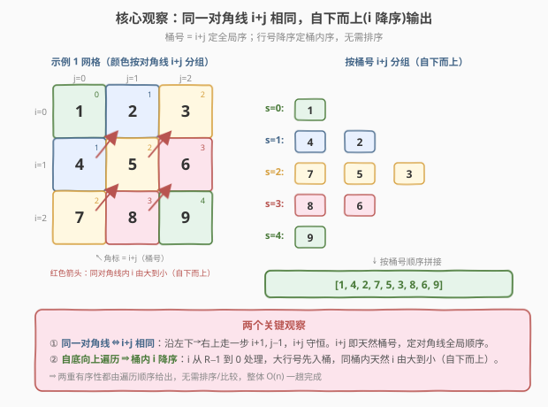
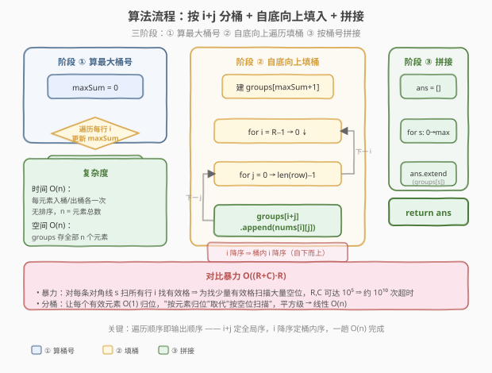
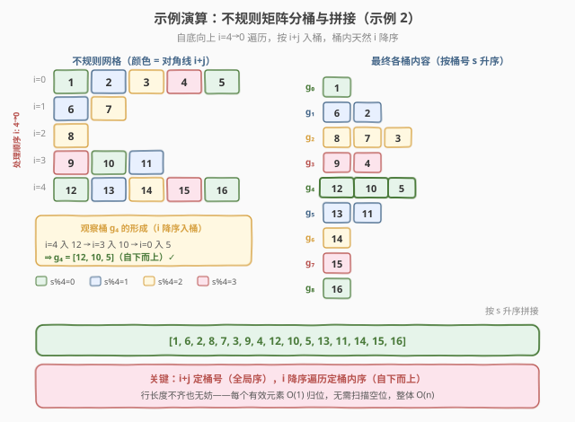

# 对角线遍历 II

- **题目名称**：对角线遍历 II
- **链接**：[1424. 对角线遍历 II](https://leetcode.cn/problems/diagonal-traverse-ii/)
- **难度**：中等
- **标签**：数组、哈希表、桶排序、BFS

## 1. 题目概述

给定一个二维列表 `nums`，其中每个元素是一个整数列表（**各行长度不一定相同**，即"锯齿/不规则矩阵"）。请按照对角线遍历规则，从左上到右下**逐条对角线**返回所有元素，且**同一条对角线上按"自下而上"（行号大的在前）的顺序**输出。

具体规则：位于同一条对角线上的元素满足 **行号 $i$ + 列号 $j$ 相同**；对角线按 $i+j$ 从小到大依次输出；同一条对角线内按 **$i$ 从大到小**（即从下往上）输出。

**示例 1**：

```text
输入：nums = [[1,2,3],[4,5,6],[7,8,9]]
输出：[1,4,2,7,5,3,8,6,9]
```

网格：

```text
1 2 3
4 5 6
7 8 9
```

对角线分组：`[1] / [4,2] / [7,5,3] / [8,6] / [9]`

**示例 2**：

```text
输入：nums = [[1,2,3,4,5],[6,7],[8],[9,10,11],[12,13,14,15,16]]
输出：[1,6,2,8,7,3,9,4,12,10,5,13,11,14,15,16]
```

**约束条件**：

- $1 \le \text{nums.length} \le 10^5$
- $1 \le \text{nums[i].length} \le 10^5$
- $1 \le \text{nums[i][j]} \le 10^9$
- `nums` 中最多有 $10^5$ 个数字

> 💡 本题核心：**同一对角线 ⇔ $i+j$ 相同**。难点在于各行长度不齐，且要求同对角线内"自下而上"输出。最优解是按 $i+j$ **分桶**，并按行号**自底向上**填入桶中，使每个桶天然满足 $i$ 降序，最终按桶序拼接即可，$O(n)$ 一趟完成。

---

## 2. 解题思路

### 2.1 暴力思路：逐条对角线扫描

最直观的模拟：对每条对角线编号 $s = i + j$（$s$ 从 $0$ 到 $\max_i + \max_j$），对每个 $s$ **从大行号往小行号**扫描 $i$，令 $j = s - i$，若 $0 \le j < \text{len}(\text{nums}[i])$ 则输出 $\text{nums}[i][j]$。

设行数 $R$、最大列数 $C$，对角线条数 $S \approx R + C$。时间复杂度 $O(S \cdot R) = O((R+C) \cdot R)$。本题 $R, C$ 均可达 $10^5$，最坏约 $10^{10}$ 次扫描，**严重超时**。瓶颈在于"为找少量有效格而扫描大量空位"。

### 2.2 核心观察：按 i+j 分桶 + 自底向上填入



**观察 1**：同一对角线上的元素 **$i + j$ 相同**。把 $i + j$ 作为"桶号"，所有元素按桶号归组，桶号从小到大拼接，即得到对角线的全局顺序。

**观察 2**：桶内需要 **$i$ 从大到小**（自下而上）。若按 **行号 $i$ 从大到小**遍历所有行（即从最后一行往第一行扫），并在每行内从左到右遍历列 $j$，把 $\text{nums}[i][j]$ 追加到桶 $i+j$ 中——由于大行号先处理，**同一桶内的元素天然按 $i$ 降序排列**，无需额外排序。

> 💡 **关键技巧**："遍历顺序即输出顺序"。利用 $i+j$ 作为桶号保证对角线全局有序，利用"自底向上遍历行"保证桶内 $i$ 降序——两个有序性都由遍历顺序自然给出，无需任何排序或比较，整体 $O(n)$。

### 2.3 算法流程图



1. **建桶**：用列表的列表 `groups`（或哈希表），`groups[i+j]` 存放该对角线的元素序列。
2. **自底向上遍历**：$i$ 从 $R-1$ 到 $0$；对第 $i$ 行，$j$ 从 $0$ 到 $\text{len}(\text{nums}[i]) - 1$。
3. **填桶**：`groups[i + j].append(nums[i][j])`。因 $i$ 降序处理，桶内自动 $i$ 降序。
4. **拼接**：按桶号 $s$ 从 $0$ 到 $\max$ 依次输出 `groups[s]` 中所有元素，即为答案。

### 2.4 示例演算

以示例 2 为例，不规则网格：



```text
row0: 1 2 3 4 5
row1: 6 7
row2: 8
row3: 9 10 11
row4: 12 13 14 15 16
```

自底向上（$i=4 \to 0$）遍历填桶：

| 行 i | 处理元素 (i,j → 值) | 桶号 i+j | 填入后桶内容 |
|------|---------------------|----------|--------------|
| 4 | (4,0)→12, (4,1)→13, (4,2)→14, (4,3)→15, (4,4)→16 | 4,5,6,7,8 | g4=[12], g5=[13], g6=[14], g7=[15], g8=[16] |
| 3 | (3,0)→9, (3,1)→10, (3,2)→11 | 3,4,5 | g3=[9], g4=[12,10], g5=[13,11] |
| 2 | (2,0)→8 | 2 | g2=[8] |
| 1 | (1,0)→6, (1,1)→7 | 1,2 | g1=[6], g2=[8,7] |
| 0 | (0,0)→1, (0,1)→2, (0,2)→3, (0,3)→4, (0,4)→5 | 0,1,2,3,4 | g0=[1], g1=[6,2], g2=[8,7,3], g3=[9,4], g4=[12,10,5] |

按桶号拼接：`g0 + g1 + g2 + g3 + g4 + g5 + g6 + g7 + g8`

$= [1] + [6,2] + [8,7,3] + [9,4] + [12,10,5] + [13,11] + [14] + [15] + [16]$

$= [1,6,2,8,7,3,9,4,12,10,5,13,11,14,15,16]$ ✓

> 💡 注意桶 $g_4$ 的形成过程：行 4 先填入 `12`，行 3 再填入 `10`，行 0 最后填入 `5`，得到 `[12, 10, 5]`——正好是 $i$ 降序（4, 3, 0），即自下而上。这正是"自底向上遍历"的妙处。

---

## 3. 参考代码

### C++

```cpp
// 对角线遍历II.cpp —— 按 i+j 分桶 + 自底向上遍历
// 编译: g++ -O2 -std=c++17 对角线遍历II.cpp -o diag2
class Solution {
public:
    vector<int> findDiagonalOrder(vector<vector<int>>& nums) {
        int n = nums.size();
        // 1. 先确定最大桶号 = max(i + j)
        int maxSum = 0;
        for (int i = 0; i < n; ++i) {
            maxSum = max(maxSum, i + (int)nums[i].size() - 1);
        }
        // 2. 建桶
        vector<vector<int>> groups(maxSum + 1);
        // 3. 自底向上遍历填桶：i 降序保证桶内 i 降序
        for (int i = n - 1; i >= 0; --i) {
            for (int j = 0; j < (int)nums[i].size(); ++j) {
                groups[i + j].push_back(nums[i][j]);
            }
        }
        // 4. 按桶号拼接
        vector<int> ans;
        for (int s = 0; s <= maxSum; ++s) {
            for (int v : groups[s]) ans.push_back(v);
        }
        return ans;
    }
};
```

### Python

```python
class Solution:
    def findDiagonalOrder(self, nums: List[List[int]]) -> List[int]:
        groups = defaultdict(list)
        max_sum = 0
        # 自底向上遍历：i 降序保证桶内 i 降序
        for i in range(len(nums) - 1, -1, -1):
            for j in range(len(nums[i])):
                groups[i + j].append(nums[i][j])
                max_sum = max(max_sum, i + j)
        # 按桶号拼接
        ans = []
        for s in range(max_sum + 1):
            ans.extend(groups[s])
        return ans
```

> 💡 **实现细节**：① C++ 需先扫一遍确定 `maxSum` 以预分配 `groups`（避免越界）；Python 用 `defaultdict(list)` 更省心，再单独记 `max_sum` 控制拼接范围。② 内层 $j$ 从左到右不影响桶内 $i$ 降序——同一行 $i$ 相同，$j$ 升序意味着 $i+j$ 升序，元素自然分散到不同桶。③ 用 `dict` 需排序键，`defaultdict` + `range(max_sum+1)` 保证 $O(n)$。

---

## 4. 复杂度分析

| 维度 | 复杂度 | 说明 |
|------|--------|------|
| **时间** | $O(n)$ | 每个元素恰好入桶一次、出桶一次；$n$ = `nums` 中元素总数 $\le 10^5$；建桶、填桶、拼接各一趟，无排序 |
| **空间** | $O(n)$ | 桶 `groups` 存放全部 $n$ 个元素；桶数 $\le R + C \le 2\times 10^5$，但元素总数仍 $O(n)$ |
| **思路** | 分桶 + 遍历序即输出序 | 利用 $i+j$ 作桶号定全局序，自底向上遍历定桶内序，两重有序性由遍历顺序天然给出 |

> ⚠️ 对比暴力 $O((R+C)\cdot R)$：分桶把"按对角线扫空位"改为"按元素归位"，每个元素 $O(1)$ 入桶，把平方级降为线性。

---

## 5. 扩展：BFS 解法

除分桶外，还可从 $(0,0)$ 出发做 **BFS 层序遍历**，每一层恰好对应一条对角线（$i+j$ 相同）：

- 队列初始 `[(0,0)]`，配合 `visited` 集合去重。
- 弹出 $(i,j)$ 加入答案，随后**先压入 $(i+1, j)$（下方），再压入 $(i, j+1)$（右方）**，越界或已访问则跳过。

**为什么"先下后右"能保证桶内 $i$ 降序？** BFS 按层处理，同层内先入队者先出队。当前层按 $i$ 降序处理时，先压入的 $(i+1,j)$ 比后压入的 $(i,j+1)$ 行号更大，自然排到下一层队首——归纳可知每层都保持 $i$ 降序。

```python
from collections import deque
class Solution:
    def findDiagonalOrder(self, nums: List[List[int]]) -> List[int]:
        ans = []
        q = deque([(0, 0)])
        visited = {(0, 0)}
        while q:
            i, j = q.popleft()
            ans.append(nums[i][j])
            # 先下后右，保证同层 i 降序
            for ni, nj in [(i + 1, j), (i, j + 1)]:
                if (0 <= ni < len(nums) and 0 <= nj < len(nums[ni])
                        and (ni, nj) not in visited):
                    visited.add((ni, nj))
                    q.append((ni, nj))
        return ans
```

BFS 同为 $O(n)$ 时间 / $O(n)$ 空间，但需要 `visited` 去重（同一格可由"上方来"和"左方来"两条路径到达）。相比之下**分桶法无需去重、常数更小**，是本题的首选。

---

## 6. 面试要点

1. **为什么同一对角线 $i+j$ 相同？**

   > 沿"左下→右上"方向走一步，行号 $+1$、列号 $-1$（或反过来），$i+j$ 守恒。故对角线即 $i+j$ 等值线，$i+j$ 就是天然的对角线编号。

2. **如何保证桶内"自下而上"（i 降序）的顺序？**

   > 自底向上遍历行（$i$ 从 $R-1$ 到 $0$），同一桶内大 $i$ 的元素先被追加，天然形成 $i$ 降序。无需排序，遍历序即输出序。

3. **为什么不直接按对角线号扫描每个格子？**

   > 那是 $O((R+C)\cdot R)$：为找少量有效格扫描大量空位。各行长度不齐时尤其浪费。分桶让每个有效元素 $O(1)$ 归位，把平方级降为线性 $O(n)$。

4. **BFS 解法为什么要"先压 $(i+1,j)$ 再压 $(i,j+1)$"？**

   > BFS 同层按入队顺序出队。先压行号更大的 $(i+1,j)$，使下一层队首是大 $i$ 格，归纳保证每层 $i$ 降序，恰好符合"自下而上"要求。

5. **时间空间复杂度？**

   > 分桶法时间 $O(n)$：每个元素入桶、出桶各一次，无排序。空间 $O(n)$：桶存全部 $n$ 个元素。$n \le 10^5$，毫秒级完成。

> 💡 **一句话总结**：1424 是"按 $i+j$ 分桶 + 自底向上遍历"——桶号定对角线全局序，行号降序定桶内序，两重有序性都由遍历顺序给出，$O(n)$ 一趟搞定不规则矩阵的对角线遍历。

---

## 7. 同类练习题

- [498. 对角线遍历](https://leetcode.cn/problems/diagonal-traverse/)：规则矩阵的对角线遍历，方向交替翻转；对照本题"方向固定自下而上"且"行长度不齐"的差异
- [54. 螺旋矩阵](https://leetcode.cn/problems/spiral-matrix/)（[题解](../0001-0100/54_螺旋矩阵.md)）：另一种矩阵遍历顺序，模拟边界收缩；对照本题"按数学不变量($i+j$)分组"的思路
- [73. 矩阵置零](https://leetcode.cn/problems/set-matrix-zeroes/)（[题解](../0001-0100/73_矩阵置零.md)）：矩阵原地标记，对照本题"用 $i+j$ 作键"的索引思维
- [378. 有序矩阵中第 K 小的元素](https://leetcode.cn/problems/kth-smallest-element-in-a-sorted-matrix/)（[题解](../0301-0400/378_有序矩阵中第K小的元素.md)）：有序矩阵的多路归并/二分，对照本题"按对角线索引分组"思想
- [1428. 至少有一个 1 的最左端列](https://leetcode.cn/problems/leftmost-column-with-at-least-a-one/)：特殊矩阵的二分查找，同为"利用矩阵结构优化遍历"
