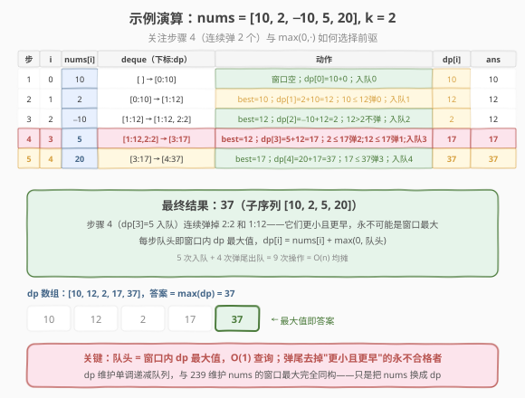

# 带限制的子序列和

- **题目名称**：带限制的子序列和
- **链接**：[1425. 带限制的子序列和](https://leetcode.cn/problems/constrained-subsequence-sum/)
- **难度**：困难
- **标签**：动态规划、单调队列、滑动窗口

## 1. 题目概述

给你一个整数数组 `nums` 和一个整数 `k`，请你返回**非空**子序列元素和的最大值，子序列需满足：子序列中每两个**相邻**的整数 `nums[i]` 和 `nums[j]`，它们在原数组中的下标满足 $i < j$ 且 $j - i \le k$。

数组的子序列：将数组中的若干个数字删除（可以删 0 个），剩下的数字按原本顺序排布。

**示例 1**：

```text
输入：nums = [10,2,-10,5,20], k = 2
输出：37
解释：子序列为 [10, 2, 5, 20] 。
```

**示例 2**：

```text
输入：nums = [-1,-2,-3], k = 1
输出：-1
解释：子序列必须非空，选择最大的单个数字。
```

**示例 3**：

```text
输入：nums = [10,-2,-10,-5,20], k = 2
输出：23
解释：子序列为 [10, -2, -5, 20] 。
```

**约束条件**：

- $1 \le k \le \text{nums.length} \le 10^5$
- $-10^4 \le \text{nums[i]} \le 10^4$

> 💡 本题的灵魂是「**子序列相邻元素在原数组中间距不超过 $k$**」——这把"任意子序列"限制为"跳跃步长 $\le k$ 的子序列"。把它翻译成 DP 语言：若子序列以 `nums[i]` 结尾，则它的前一个元素只能在 `nums[i-k .. i-1]` 中选。于是 `dp[i]` 的转移只依赖一个**长度为 $k$ 的滑动窗口内 `dp` 的最大值**——这正是 [239. 滑动窗口最大值](../0201-0300/239_滑动窗口最大值.md) 的单调队列场景，只是把"维护 `nums` 的窗口 max"换成"维护 `dp` 的窗口 max"。

---

## 2. 解题思路

### 2.1 暴力思路：DP + 线性扫描窗口

**状态定义**：`dp[i]` = 以 `nums[i]` **结尾**的合法子序列的最大和（必须包含 `nums[i]`）。

**转移**：子序列以 `nums[i]` 结尾时，前一个元素可选 `nums[j]`（$i-k \le j \le i-1$）。要么接在某个前驱 `j` 后面（取最大的 `dp[j]`），要么**从 `nums[i]` 单开一段**（前驱全为负时更优）。因此：

$$dp[i] = \text{nums}[i] + \max\bigl(0,\ \max_{i-k \le j \le i-1} dp[j]\bigr)$$

- $\max(0, \cdot)$ 中的 `0` 对应"不接前驱、从 `nums[i]` 另起一段"——当窗口内所有 `dp[j]` 为负时，接上去只会拖累和，不如单开。
- 边界：$i=0$ 时窗口为空，$\max(0, \text{空}) = 0$，故 $dp[0] = \text{nums}[0]$。
- 答案：$\max_{i} dp[i]$（子序列可从任意位置开始、任意位置结束）。

**暴力实现**：对每个 $i$，线性扫描窗口 $[i-k, i-1]$ 求 $\max dp[j]$：

```text
for i = 0..n-1:
    best = 0
    for j = max(0,i-k)..i-1:
        best = max(best, dp[j])
    dp[i] = nums[i] + best
return max(dp)
```

时间复杂度 $O(nk)$。本题 $n, k$ 均可达 $10^5$，最坏 $10^{10}$ 次运算，**严重超时**。

> ⚠️ 瓶颈在于"对每个 $i$ 重新求一遍窗口内 $dp$ 的最大值"。相邻 $i$ 的窗口只差一个元素（右端进一个、左端出一个），但暴力完全没复用——这正是 [239. 滑动窗口最大值](../0201-0300/239_滑动窗口最大值.md) 暴力 $O(nk)$ 的翻版。用**单调队列**维护窗口内 $dp$ 的最大值，可把每次查询降到均摊 $O(1)$。

### 2.2 核心观察：单调队列维护窗口内 dp 的最大值

![核心观察：dp[i] 依赖窗口内 dp 最大值，单调队列 O(1) 取最大](../images/1425_concept.svg)

**关键定义**：用一个**双端队列**存下标，对应 $dp$ 值从队头到队尾**单调递减**。队头始终是当前窗口 $[i-k, i-1]$ 内 $dp$ 值最大的下标。

**两个操作**（与 239 完全同构，只是把 `nums` 换成 `dp`）：

1. **过期出队（左端）**：队头下标 $< i - k$（已滑出窗口），从队头弹出。
2. **入队弹尾（右端）**：新算出的 $dp[i]$ 入队前，从队尾弹出所有 $dp[\cdot] \le dp[i]$ 的下标——它们**更小且更早**，只要 $dp[i]$ 还在窗口里，这些旧值永远不可能成为最大，可安全丢弃。

**查询**：队头对应的 $dp[\text{front}]$ 即窗口最大值，$O(1)$ 取得。于是：

$$dp[i] = \text{nums}[i] + \max\bigl(0,\ \text{deque 空则 } 0 \text{ 否则 } dp[\text{deque.front}]\bigr)$$

> 💡 **与 239 的同构关系**：239 维护的是"`nums` 的滑动窗口最大值"，本题维护的是"`dp` 的滑动窗口最大值"。两题的单调队列代码几乎一字不差——存下标、左端过期、右端弹尾、队头即最值。区别仅在于：239 的窗口是 $[i-k+1, i]$（含当前元素），本题的窗口是 $[i-k, i-1]$（不含当前，因为 $dp[i]$ 还没算出来），所以过期条件从 `front ≤ i - k` 变为 `front < i - k`。

### 2.3 算法流程图

![算法流程：遍历 → 过期出队 → 查询算 dp[i] → 入队弹尾 → 更新答案](../images/1425_algorithm_flow.svg)

**完整步骤**（遍历 $i$ 从 $0$ 到 $n-1$）：

1. **过期出队**：`while deque 非空 且 deque.front() < i - k：pop_front()`。
2. **查询并计算**：`best = deque 空 ? 0 : dp[deque.front()]`；`dp[i] = nums[i] + max(0, best)`。
3. **入队弹尾**：`while dp[deque.back()] ≤ dp[i]：pop_back()`；`push_back(i)`。
4. **更新答案**：`ans = max(ans, dp[i])`。

> ⚠️ **顺序不能反**：先过期出队（清理窗口），再查询（此时队头是合法窗口内的最大），再算 $dp[i]$，最后入队弹尾（$dp[i]$ 供后续 $i$ 使用，不能提前入队否则会把自己也算进窗口）。与 239 的"先过期、再弹尾、后取值"一脉相承。

### 2.4 示例演算

以示例 1 `nums = [10, 2, -10, 5, 20], k = 2` 为例：



| 步 | i | nums[i] | deque（下标:dp，入队后） | 动作 | dp[i] | ans |
|----|---|---------|-------------------------|------|-------|-----|
| 1 | 0 | 10 | `[0:10]` | 窗口空；$dp[0]=10+0$；入队 0 | 10 | 10 |
| 2 | 1 | 2 | `[1:12]` | best=$dp[0]$=10；$dp[1]=2+10=12$；$10 \le 12$ 弹 0；入队 1 | 12 | 12 |
| 3 | 2 | −10 | `[1:12, 2:2]` | best=$dp[1]$=12；$dp[2]=-10+12=2$；$12>2$ 不弹；入队 2 | 2 | 12 |
| 4 | 3 | 5 | `[3:17]` | best=$dp[1]$=12；$dp[3]=5+12=17$；$2 \le 17$ 弹 2；$12 \le 17$ 弹 1；入队 3 | 17 | 17 |
| 5 | 4 | 20 | `[4:37]` | best=$dp[3]$=17；$dp[4]=20+17=37$；$17 \le 37$ 弹 3；入队 4 | 37 | 37 |

**步骤 4 是关键**：`dp[3]=17` 入队时连续弹掉 `2:2` 和 `1:12`——它们都比 17 小且更早，只要下标 3 还在窗口内，这两个旧值永远不可能成为最大。弹掉后队头直接是 `[3:17]`，后续 $dp[4]$ 一查即得 17。

最终 $dp = [10, 12, 2, 17, 37]$，答案 $= \max(dp) = 37$，对应子序列 $[10, 2, 5, 20]$。

> 💡 每个下标入队 1 次、出队 1 次（弹尾或过期），总操作 $\le 2n$，与 239 的均摊分析完全一致。

---

## 3. 参考代码

### C++

```cpp
// 带限制的子序列和.cpp —— DP + 单调队列，O(n)
// 编译: g++ -O2 -std=c++17 带限制的子序列和.cpp -o css
#include <vector>
#include <deque>
#include <climits>
using namespace std;

class Solution {
public:
    int constrainedSubsetSum(vector<int>& nums, int k) {
        int n = nums.size();
        deque<int> dq;            // 存下标，对应 dp 值单调递减
        vector<int> dp(n);
        int ans = INT_MIN;

        for (int i = 0; i < n; ++i) {
            // ① 过期出队：队头下标滑出窗口 [i-k, i-1]
            while (!dq.empty() && dq.front() < i - k) {
                dq.pop_front();
            }
            // ② 查询窗口内 dp 最大值，计算 dp[i]
            int best = dq.empty() ? 0 : dp[dq.front()];
            dp[i] = nums[i] + max(0, best);
            // ③ 入队弹尾：弹出所有 dp ≤ dp[i] 的（更小且更早，永不可能是最大）
            while (!dq.empty() && dp[dq.back()] <= dp[i]) {
                dq.pop_back();
            }
            dq.push_back(i);
            // ④ 更新答案
            ans = max(ans, dp[i]);
        }
        return ans;
    }
};
```

### Python

```python
from collections import deque

class Solution:
    def constrainedSubsetSum(self, nums: list[int], k: int) -> int:
        n = len(nums)
        dq = deque()               # 存下标，对应 dp 值单调递减
        dp = [0] * n
        ans = float('-inf')

        for i in range(n):
            # ① 过期出队
            while dq and dq[0] < i - k:
                dq.popleft()
            # ② 查询窗口内 dp 最大值，计算 dp[i]
            best = 0 if not dq else dp[dq[0]]
            dp[i] = nums[i] + max(0, best)
            # ③ 入队弹尾
            while dq and dp[dq[-1]] <= dp[i]:
                dq.pop()
            dq.append(i)
            # ④ 更新答案
            ans = max(ans, dp[i])
        return ans
```

> 💡 **实现细节**：① 过期条件是 `front < i - k`（不是 `≤ i - k`），因为窗口是 $[i-k, i-1]$，下标 $i-k$ 仍合法，只有 $< i-k$ 才过期——对比 239 的窗口 $[i-k+1, i]$ 用 `front ≤ i - k`。② `best = 0 if not dq else dp[dq[0]]`：窗口空（$i=0$）时 best=0，配合 `max(0, best)` 得 $dp[i]=\text{nums}[i]$，自然处理边界，无需对 $i=0$ 特判。③ 弹尾用 `≤` 而非 `<`：相同 $dp$ 值只保留最新的（旧的同值先过期，留着无意义），队列更紧凑，与 239 一致。

---

## 4. 复杂度分析

| 维度 | 单调队列 DP（主） | 暴力 DP | 堆 + 懒惰删除（第 5 节） |
|------|------------------|---------|--------------------------|
| 时间复杂度 | $O(n)$ | $O(nk)$ | $O(n \log n)$ |
| 空间复杂度 | $O(n)$（dp 数组）/ $O(k)$（优化） | $O(n)$ | $O(n)$ |
| 实际运算量 | $n=10^5$ 约 $2 \times 10^5$ 次操作，毫秒级 | 最坏 $10^{10}$，超时 | 约 $10^5 \log 10^5 \approx 1.7 \times 10^6$，毫秒级 |

> ⚠️ **均摊分析**：`while` 嵌套在 `for` 里看似 $O(nk)$，但每个下标至多入队 1 次、出队 1 次（弹尾或过期），两个 `while` 的总弹出次数 $\le 2n$，故总时间 $O(n)$。与 [239. 滑动窗口最大值](../0201-0300/239_滑动窗口最大值.md) 的均摊论证完全一致——这是所有单调结构的共性。

> 💡 **空间优化**：`dp` 数组可省去——在 deque 中存 `(下标, dp值)` 二元组即可同时判断过期与维护单调，空间降为 $O(k)$（队列最多存 $k$ 个元素）。但可读性略降，主代码保留 `dp` 数组以便对照转移式。

---

## 5. 扩展：堆 + 懒惰删除的 $O(n \log n)$ 解法

若不熟悉单调队列，可用**大顶堆**维护窗口内 $dp$ 的最大值：堆中存 `(dp值, 下标)`，每次取堆顶前检查下标是否过期（$< i-k$），过期则弹出（懒惰删除）。

```python
import heapq

class Solution:
    def constrainedSubsetSum(self, nums: list[int], k: int) -> int:
        n = len(nums)
        dp = [0] * n
        heap = []           # 大顶堆（存 -dp, 下标）
        ans = float('-inf')
        for i in range(n):
            # 懒惰删除：弹出过期的堆顶
            while heap and heap[0][1] < i - k:
                heapq.heappop(heap)
            best = -heap[0][0] if heap else 0
            dp[i] = nums[i] + max(0, best)
            heapq.heappush(heap, (-dp[i], i))
            ans = max(ans, dp[i])
        return ans
```

堆的每次操作 $O(\log n)$，总 $O(n \log n)$。堆不利用"窗口连续滑动"的特性，过期元素只能堆积后批量清理，常数比单调队列大。但堆更通用（不要求窗口连续），适合"动态集合最值"场景。

> 💡 **单调队列 vs 堆**：当转移形如 $f(i) = g(i) + \max_{j \in \text{窗口}} f(j)$ 且窗口连续滑动时，单调队列 $O(n)$ 优于堆 $O(n \log n)$。若窗口不连续（如"满足某条件的所有历史状态"），则只能用堆或有序集合。本题窗口连续，单调队列是首选——这正是 239 的核心结论在 DP 上的直接应用。

---

## 6. 面试要点

1. **为什么状态定义为"以 `nums[i]` 结尾的最大和"而不是"前 $i$ 个的最大和"？**

   > 因为约束是"相邻元素间距 $\le k$"，这个限制作用于**子序列中相邻的两个元素**，而非前缀整体。定义 `dp[i]` = 以 `nums[i]` 结尾的合法子序列最大和，则前一个元素只能在 $[i-k, i-1]$ 中选，转移干净地依赖一个窗口。若定义"前 $i$ 个的最大和"则无法表达"最后一个选了哪个"的间距约束——缺少结尾信息，转移不成立。

2. **`max(0, ·)` 中的 0 代表什么？为什么不用 $-\infty$？**

   > `0` 代表"**不接任何前驱，从 `nums[i]` 单开一段**"。子序列非空，每个元素都可独立成段。当窗口内所有 `dp[j]` 为负时，接上去只会减少和，不如从 `nums[i]` 重新开始。这与 [53. 最大子数组和](../0001-0100/53_最大子数组和.md) 的 Kadane 算法里 `dp[i] = max(nums[i], dp[i-1] + nums[i])` 异曲同工——`max(nums[i], ...)` 即"单开 vs 续接"。本题把"续接"推广为"从窗口内挑最优前驱续接"。

3. **为什么用单调队列而不是堆或线段树？**

   > 单调队列 $O(n)$，堆 $O(n \log n)$，线段树 $O(n \log n)$。本题窗口**连续滑动**（$[i-k, i-1]$ 每步右移一位），单调队列能利用这一特性：新元素入队时批量弹掉比它小的旧元素，因为那些旧元素"更小且更早过期"，永不可能再成为最大。堆/线段树不利用窗口连续性，常数更大。当窗口连续滑动时，单调队列是最优选择。

4. **过期条件为什么是 `front < i - k` 而不是 `front ≤ i - k`？**

   > 窗口是 $[i-k, i-1]$，下标 $i-k$ 仍合法（距 $i$ 恰好 $k$）。只有 $< i-k$ 的才滑出窗口。对比 [239](../0201-0300/239_滑动窗口最大值.md) 的窗口 $[i-k+1, i]$（含当前元素），过期条件是 `front ≤ i - k`。两题窗口定义差 1，过期条件差一个等号——务必对齐自己代码里的窗口边界。

5. **弹尾条件为什么用 `≤` 而不是 `<`？**

   > 用 `≤`（弹掉"小或等"的）：相同 $dp$ 值只保留最新的一个，因为旧的同值下标先过期，留着它过期后还得再查下一个，不如现在弹掉。用 `<`（只弹严格更小）也能过，但队列更长。两种都正确，`≤` 更紧凑。与 239 一致。

> 💡 **一句话总结**：1425 的本质是"**DP 转移依赖滑动窗口内 $dp$ 的最大值**"——把 [53. 最大子数组和](../0001-0100/53_最大子数组和.md) 的 Kadane（续接前一位）推广为"续接窗口内最优前驱"，再用 [239. 滑动窗口最大值](../0201-0300/239_滑动窗口最大值.md) 的单调队列把窗口 max 查询从 $O(k)$ 降到均摊 $O(1)$，整体 $O(n)$。这套"单调队列优化 DP"是所有形如 $f(i) = g(i) + \max_{j \in \text{窗口}} f(j)$ 的转移的通用提速范式。

---

## 7. 同类练习题

- [239. 滑动窗口最大值](https://leetcode.cn/problems/sliding-window-maximum/)（[题解](../0201-0300/239_滑动窗口最大值.md)）：单调队列招牌题，维护 `nums` 的窗口 max；本题把 `nums` 换成 `dp`，代码几乎一字不差
- [53. 最大子数组和](https://leetcode.cn/problems/maximum-subarray/)（[题解](../0001-0100/53_最大子数组和.md)）：Kadane 算法，`max(0, ·)` 的无约束版——续接前一位 vs 本题续接窗口内最优前驱
- [1696. 跳跃游戏 VI](https://leetcode.cn/problems/jump-game-vi/)：几乎同题，从下标 0 跳 1~k 步到 n−1 求最大得分，转移完全一致，区别仅在必须从 0 出发到 n−1 结束（答案 $= dp[n-1]$）
- [918. 最大环形子数组和](https://leetcode.cn/problems/maximum-sum-circular-subarray/)（[题解](../0901-1000/918_最大环形子数组和.md)）：Kadane 环形变体，与本题共享"续接 vs 另起一段"的 `max(0, ·)` 思想
- [1499. 满足不等式的最大值](https://leetcode.cn/problems/max-value-of-equation/)：单调队列优化 DP，队列维护形如 $y_j - x_j$ 的最值，与本题"维护 $dp$ 窗口 max"同属单调队列优化 DP 范式
