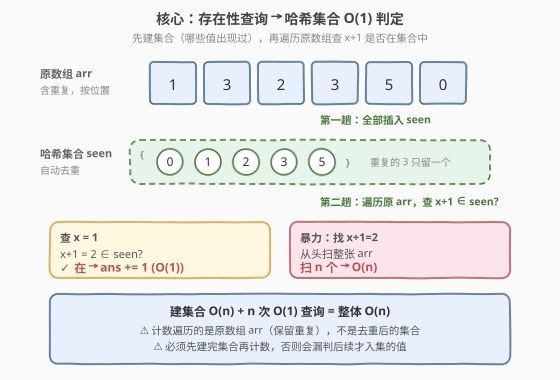
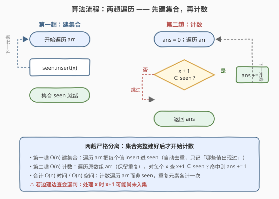
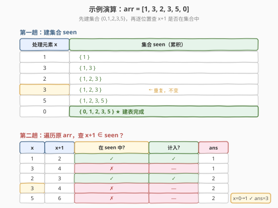

# 数元素

- **题目名称**：数元素
- **链接**：[1426. 数元素](https://leetcode.cn/problems/counting-elements/)
- **难度**：简单
- **标签**：数组、哈希表

> ⚠️ 本题为 **Plus 会员专享题**，题目描述据官方题意整理。

## 1. 题目概述

给定一个整数数组 `arr`，统计其中满足「$x + 1$ 也在 `arr` 中」的元素 $x$ 的**个数**。若 `arr` 中存在**重复元素**，每个重复元素都要**分别计数**（即按出现次数统计，而非按不同值统计）。

换句话说：对 `arr` 中每一个位置上的 $x$，只要 `arr` 里能找到 $x + 1$，这个 $x$ 就计入答案。

**示例 1**：

```text
输入：arr = [1, 2, 3]
输出：2
解释：1 和 2 都被计入 —— 因为 2 = 1+1 在 arr 中，3 = 2+1 在 arr 中；
     而 3 不被计入，因为 4 = 3+1 不在 arr 中。
```

**示例 2**：

```text
输入：arr = [1, 1, 3, 3, 5, 5, 7, 7]
输出：0
解释：没有任何元素被计入 —— arr 中没有 2、4、6、8，故 1、3、5、7 的 +1 都不在。
```

**示例 3**：

```text
输入：arr = [1, 3, 2, 3, 5, 0]
输出：3
解释：0、1、2 被计入 —— 1 = 0+1 在 arr 中，2 = 1+1 在 arr 中，3 = 2+1 在 arr 中；
     两个 3 不被计入（4 不在），5 不被计入（6 不在）。
```

**示例 4**：

```text
输入：arr = [1, 1, 2, 2]
输出：2
解释：两个 1 都被计入 —— 2 = 1+1 在 arr 中（重复的 1 各计一次）；
     两个 2 都不被计入 —— 3 不在 arr 中。
```

**约束条件**：

- $1 \le \text{arr.length} \le 1000$
- $0 \le \text{arr}[i] \le 1000$

> 💡 **关键点**：判定条件是「$x+1$ 是否存在于 `arr`」，这是一个**存在性查询**。把所有元素塞进哈希集合后，每次查询 $O(1)$；而「重复元素分别计数」意味着要**遍历原数组 `arr`**（而非遍历去重后的集合）来累加。两步合起来就是「先建集合，再扫一遍原数组计数」。

---

## 2. 解题思路

### 2.1 暴力思路：对每个元素全表扫描

最直观的做法：对 `arr` 中每一个 $x$，从头到尾扫一遍 `arr`，看有没有元素等于 $x + 1$。有则计数器 $+1$。

- **正确**：对每个位置都做了存在性判定，必然覆盖所有应计元素。
- **低效**：$n$ 个元素，每个 $O(n)$ 扫描 ⟹ $O(n^2)$。$n \le 1000$ 时约 $10^6$ 次操作能过，但每次查询都重复扫整张表，毫无复用。

> ⚠️ 暴力的浪费在于「**同一张表被反复线性扫描**」。其实「$x+1$ 在不在」是一个**集合成员判定**——只要把表预处理成哈希集合，每次查询就降到 $O(1)$。

### 2.2 核心观察：存在性查询 → 哈希集合 $O(1)$ 判定



把判定条件拆成两步：

1. **建表**：将 `arr` 全部元素插入哈希集合 `seen`（自动去重，只保留「哪些值出现过」）；
2. **计数**：遍历**原数组 `arr`**（保留重复，每个位置独立判定），对每个 $x$ 查 `seen.count(x + 1)`，命中则 `ans += 1`。

$$\text{ans} = \sum_{x \in \text{arr（按位置）}} \mathbb{1}[\,x + 1 \in \text{seen}\,]$$

> 💡 **为什么遍历原数组而不是遍历集合？** 因为题目要求「重复元素分别计数」。集合 `seen` 丢失了重复信息，遍历它只能得到「有多少个**不同值**满足条件」，而非「有多少个**位置**满足条件」。例 4 中 `arr = [1,1,2,2]`：集合是 `{1,2}`，遍历集合只得 1 个值（1）满足，但答案是 2（两个 1 都计）。必须遍历原数组才能正确累加重复。

> ⚠️ **建集合与计数的顺序**：必须**先完整建好集合，再开始计数**。若边建边查会漏判——例 3 中 `arr = [1,3,2,3,5,0]`，若处理到 `1` 时 `2` 尚未入集，会错误地不计 1。两趟遍历互不干扰，是本题正确性的关键。

### 2.3 算法流程图



**完整步骤**：

1. **第一趟——建集合**：遍历 `arr`，将每个元素插入 `seen`；
2. **第二趟——计数**：`ans = 0`，再次遍历 `arr`，对每个 $x$，若 `seen` 中存在 $x + 1$，则 `ans += 1`；
3. **返回** `ans`。

> 💡 两趟遍历合计 $O(n)$，集合查询均摊 $O(1)$。也可用 `seen` 同时承担「值域计数」职责（见第 5 节），但两趟分离写法最清晰、不易出错。

### 2.4 示例演算

以示例 3 的 `arr = [1, 3, 2, 3, 5, 0]` 为例：



**第一趟——建集合**：

| 处理元素 | 集合 seen（累积） |
|----------|-------------------|
| 1 | {1} |
| 3 | {1, 3} |
| 2 | {1, 2, 3} |
| 3 | {1, 2, 3} |
| 5 | {1, 2, 3, 5} |
| 0 | {0, 1, 2, 3, 5} |

**第二趟——计数**：

| 位置 | $x$ | $x+1$ | 在 seen 中? | 计入? | ans |
|------|-----|-------|-------------|-------|-----|
| 0 | 1 | 2 | ✓ | ✓ | 1 |
| 1 | 3 | 4 | ✗ | ✗ | 1 |
| 2 | 2 | 3 | ✓ | ✓ | 2 |
| 3 | 3 | 4 | ✗ | ✗ | 2 |
| 4 | 5 | 6 | ✗ | ✗ | 2 |
| 5 | 0 | 1 | ✓ | ✓ | 3 |

最终 `ans = 3` ✓。

> 以例 4 的 `arr = [1, 1, 2, 2]` 验证：集合 = {1, 2}。位置 0 的 1 → 2 在集合 ✓（ans=1）；位置 1 的 1 → 2 在集合 ✓（ans=2）；位置 2、3 的 2 → 3 不在集合 ✗。`ans = 2` ✓——两个重复的 1 各计一次，正是「遍历原数组」的价值。例 2 的 `arr = [1,1,3,3,5,5,7,7]`：集合 = {1,3,5,7}，每个值的 +1（2,4,6,8）都不在集合，`ans = 0` ✓。

---

## 3. 参考代码

### C++

```cpp
class Solution {
public:
    int countElements(vector<int>& arr) {
        unordered_set<int> seen(arr.begin(), arr.end());
        int ans = 0;
        for (int x : arr) {
            if (seen.count(x + 1)) ++ans;
        }
        return ans;
    }
};
```

### Python

```python
class Solution:
    def countElements(self, arr: List[int]) -> int:
        seen = set(arr)
        return sum(1 for x in arr if x + 1 in seen)
```

> 💡 **实现要点**：① `unordered_set<int>(arr.begin(), arr.end())` / `set(arr)` 用区间构造一趟建表，自动去重。② 计数循环遍历**原 `arr`**（非 `seen`），保证重复元素各计一次。③ 查询用 `seen.count(x + 1)` / `x + 1 in seen`，均摊 $O(1)$。④ 两趟严格分离：先建完集合再计数，避免漏判后续才出现的值。

---

## 4. 复杂度分析

| 维度 | 哈希集合 $O(n)$（推荐） | 暴力扫描 $O(n^2)$ |
|------|------------------------|--------------------|
| **时间复杂度** | $O(n)$ | $O(n^2)$ |
| **空间复杂度** | $O(n)$ | $O(1)$ |
| **单次查询代价** | 均摊 $O(1)$ | $O(n)$ |
| **是否支持重复计数** | ✓（遍历原数组） | ✓（遍历原数组） |

- **哈希集合**：建集合 $O(n)$，计数循环 $n$ 次每次 $O(1)$ 查询，合计 $O(n)$；集合最坏存 $n$ 个不同值，空间 $O(n)$。是本题的最优解。
- **暴力扫描**：$n$ 个元素每个 $O(n)$ 扫描，合计 $O(n^2)$；$n \le 1000$ 时约 $10^6$ 次操作，毫秒级通过，但每次查询重复扫表，理论劣于哈希法。

> ⚠️ 本题 $n \le 1000$、值域 $[0, 1000]$，三种做法（暴力、哈希集合、值域数组）都能过。面试中写哈希集合版即可体现对「存在性查询用哈希加速」这一通用思路的把握。

---

## 5. 扩展：值域数组法（值域小时更优）

由于本题值域 $[0, 1000]$ 非常小，可用一个定长布尔数组替代哈希集合，查询严格 $O(1)$（无哈希冲突、无再散列开销），且常数因子更小。

```cpp
class Solution {
public:
    int countElements(vector<int>& arr) {
        bool present[1002] = {false};   // 多留一位，x+1 最大到 1001
        for (int x : arr) present[x] = true;
        int ans = 0;
        for (int x : arr) if (present[x + 1]) ++ans;
        return ans;
    }
};
```

```python
class Solution:
    def countElements(self, arr: List[int]) -> int:
        present = [False] * 1002
        for x in arr:
            present[x] = True
        return sum(1 for x in arr if present[x + 1])
```

**要点**：

- 数组大小取 `1002` 而非 `1001`：因为 $x$ 最大为 1000 时要查 `present[1001]`（即 $x+1$），下标 1001 必须合法。
- 查询 `present[x+1]` 是数组下标访问，严格 $O(1)$ 且无哈希开销，在值域小时比 `unordered_set` 更快。
- 空间 $O(V)$（$V$ 为值域大小），当 $V \ll n$ 时优于哈希集合的 $O(n)$；当值域很大（如 $10^9$）则不可用，必须退回哈希集合。

> 💡 **选择准则**：值域小且密集 → 值域数组（桶）；值域大或稀疏 → 哈希集合。这是「[448. 找到所有数组中消失的数字](../0001-0100/448_找到所有数组中消失的数字.md)」用下标当哈希键、「[41. 缺失的第一个正数](https://leetcode.cn/problems/first-missing-positive/)」原地标记的同源思想——只要值域可控，数组永远比哈希更紧凑更快。

---

## 6. 面试要点

1. **为什么必须遍历原数组而不是遍历集合来计数？**

   > 题目要求「重复元素分别计数」，即按**出现次数**而非**不同值个数**统计。集合 `seen` 已去重，遍历它只能得到「多少个不同值满足条件」。例 4 `arr = [1,1,2,2]`：集合是 `{1,2}`，遍历集合只得 1，但答案应为 2（两个 1 各计一次）。必须遍历原 `arr` 才能正确累加重复。

2. **为什么必须先建完集合再计数，不能边建边查？**

   > 判定条件是「$x+1$ 在 `arr` 中」——只要 $x+1$ 在**整张表**任意位置出现即可，与位置无关。若边建边查，处理到 $x$ 时 $x+1$ 可能尚未入集，会漏判。例 3 中 `1` 出现在 `2` 之前，若处理 `1` 时 `2` 还没入集就会错误地不计。两趟分离保证查询时集合已包含全部元素。

3. **哈希集合查询是严格 $O(1)$ 吗？**

   > 是**均摊** $O(1)$，最坏单次可退化到 $O(n)$（哈希冲突 / 再散列）。但对整数键、良好哈希函数下，实际近常数。若需严格 $O(1)$ 且值域小，用值域数组（第 5 节）。面试中提一句「均摊 $O(1)$、值域小时可用数组替代」即可体现严谨。

4. **如果值域很大（如 $10^9$）怎么办？**

   > 值域数组不可用（空间爆炸），必须用哈希集合 `unordered_set` / `set`。`unordered_set` 均摊 $O(1)$ 查询但有冲突风险；`set`（红黑树）严格 $O(\log n)$ 查询但有序。本题值域 $[0,1000]$ 小，两种都可行，哈希集合是默认选择。

5. **「$x+1$ 存在」与「最长连续序列」有何关联？**

   > 本题只判**单步** $x \to x+1$ 是否存在；[128. 最长连续序列](../0001-0100/128_最长连续序列.md) 判**多步** $x, x+1, x+2, \dots$ 的最长链。两者都用哈希集合做存在性查询，但 128 还需「只从序列起点开始延伸」的剪枝（$x-1$ 不在集合才作为起点）。1426 是 128 的单步退化版——理解 1426 后再看 128 会很自然。

> 💡 **一句话总结**：1426 的灵魂是「**存在性查询用哈希集合 $O(1)$ 加速**」——先一趟建集合，再一趟遍历原数组按 $x+1$ 是否在集合中计数。遍历原数组（非集合）是处理重复计数的关键，两趟分离是正确性的保证。

---

## 7. 同类练习题

- [128. 最长连续序列](../0001-0100/128_最长连续序列.md)：本题的多步延伸版——用哈希集合判存在性 + 只从序列起点（$x-1$ 不在集合）开始向 $x+1, x+2$ 延伸统计最长链，对照 1426 的单步判定
- [448. 找到所有数组中消失的数字](../0001-0100/448_找到所有数组中消失的数字.md)：值域小且密集时用下标当哈希键（原地取负标记存在性），与 1426 第 5 节的值域数组法同源——值域可控时数组比哈希更紧凑
- [1. 两数之和](../0001-0100/1_两数之和.md)：哈希表一次遍历做「补数存在性查询」的经典母题，与 1426「$x+1$ 存在性查询」同为哈希加速查询的范式
- [219. 存在重复元素 II](https://leetcode.cn/problems/contains-duplicate-ii/)（[题解](../0201-0300/219_存在重复元素II.md)）：哈希表记录上次出现下标做存在性 + 距离判定，对照 1426 只判存在性不判距离——同为「哈希记录存在信息」的变体
- [349. 两个数组的交集](https://leetcode.cn/problems/intersection-of-two-arrays/)：把一个数组入集合、遍历另一个数组查集合做交集，与 1426「入集合 + 遍历查集合」两段式结构完全一致，只是判定条件不同
