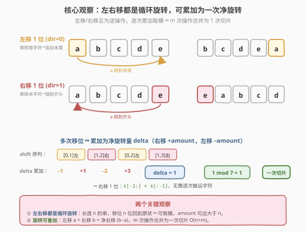
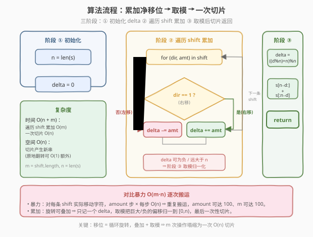
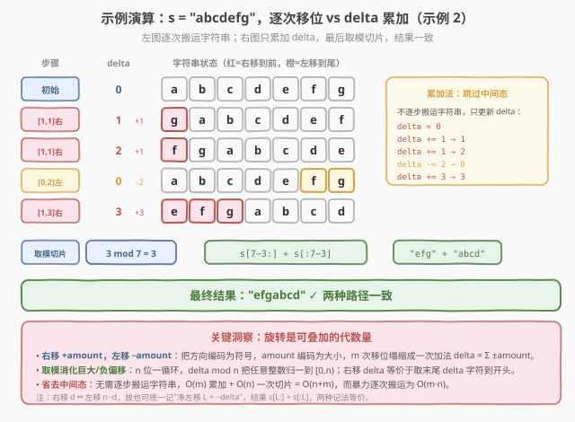

# 字符串的左右移

- **题目名称**：字符串的左右移
- **链接**：[1427. 字符串的左右移](https://leetcode.cn/problems/perform-string-shifts/)
- **难度**：简单
- **标签**：数组、字符串、数学

## 1. 题目概述

给定一个包含小写英文字母的字符串 `s` 以及一个矩阵 `shift`，其中 `shift[i] = [direction, amount]`：

- `direction` 可为 `0`（表示左移）或 `1`（表示右移）。
- `amount` 表示 `s` 左右移的位数。
- **左移 1 位**：移除 `s` 的第一个字符，并将该字符插入到 `s` 的结尾。
- **右移 1 位**：移除 `s` 的最后一个字符，并将该字符插入到 `s` 的开头。

对这个字符串进行所有操作后，返回最终结果。

**示例 1**：

```text
输入：s = "abc", shift = [[0,1],[1,2]]
输出："cab"
解释：
[0,1] 表示左移 1 位。 "abc" -> "bca"
[1,2] 表示右移 2 位。 "bca" -> "cab"
```

**示例 2**：

```text
输入：s = "abcdefg", shift = [[1,1],[1,1],[0,2],[1,3]]
输出："efgabcd"
解释：
[1,1] 表示右移 1 位。 "abcdefg" -> "gabcdef"
[1,1] 表示右移 1 位。 "gabcdef" -> "fgabcde"
[0,2] 表示左移 2 位。 "fgabcde" -> "abcdefg"
[1,3] 表示右移 3 位。 "abcdefg" -> "efgabcd"
```

**约束条件**：

- $1 \le \text{s.length} \le 100$
- `s` 只包含小写英文字母
- $1 \le \text{shift.length} \le 100$
- $\text{shift[i].length} == 2$
- $0 \le \text{shift[i][0]} \le 1$
- $0 \le \text{shift[i][1]} \le 100$

> 💡 本题核心：**左移和右移都是"循环旋转"**——把字符串看成首尾相接的环，左移 1 位即环逆时针转一格（首字符补到尾），右移 1 位即顺时针转一格（尾字符补到首）。既然是旋转，就**可叠加**：左移 $a$ 再右移 $b$，等价于净右移 $b-a$。把 $m$ 次操作累加成一个偏移量并取模，最后只做一次切片，$O(n+m)$ 完成。

---

## 2. 解题思路

### 2.1 暴力思路：逐次搬运字符

最直观的模拟：对 `shift` 中每一条 `[direction, amount]`，按字面意思**实际搬运字符**——左移就把前 `amount` 个字符切下来接到末尾，右移就把后 `amount` 个字符切下来接到开头。每条操作花费 $O(n)$（切片 + 拼接），共 $m$ 条，总时间 $O(m \cdot n)$。

本题 $n, m \le 100$，$O(m \cdot n) \le 10^4$ 完全可过。但若把规模放大（$n, m$ 到 $10^5$），逐次搬运就会超时。瓶颈在于**重复搬运**：每次都把整个字符串搬一遍，却没有利用"旋转可叠加"这一结构。

> ⚠️ 还有一个隐藏坑：`amount` 可以大于 $n$（题目允许 $\text{amount} \le 100$ 而 $n$ 可小到 1）。若逐位搬运而忘记取模，左移 100 位在长度 3 的串上等价于左移 1 位——暴力法若不取模也会做大量无用功。

### 2.2 核心观察：左右移都是循环旋转，可累加为一次净旋转



**观察 1**：左移、右移都是**循环旋转**。长度为 $n$ 的字符串无论怎么移位，都只是把字符在环上重新对齐——移位 $n$ 位回到原状。因此任意 `amount` 都可对 $n$ 取模：$\text{amount} \bmod n$ 即真实有效的位移。

**观察 2**：旋转是**可叠加的代数量**。把方向编码为符号——**右移记 $+\text{amount}$，左移记 $-\text{amount}$**——那么 $m$ 次移位等价于一次净右移：

$$\text{delta} = \sum_{i} \sigma_i \cdot \text{amount}_i, \quad \sigma_i = \begin{cases} +1, & \text{direction}_i = 1 \text{（右）} \\ -1, & \text{direction}_i = 0 \text{（左）} \end{cases}$$

**观察 3**：取模消化一切。$\text{delta}$ 可能是负数（左移多于右移）或远大于 $n$（累加大量右移），但由观察 1，只需 $\text{delta} \bmod n$ 归一到 $[0, n)$。最终结果就是把 `s` **右移 `delta` 位**：取末尾 `delta` 个字符补到开头。

> 💡 **统一记法**：右移 $d$ 位 $\Leftrightarrow$ 左移 $n - d$ 位。也可反过来记"净左移量 $L = -\text{delta}$"，则结果为 $s[L:] + s[:L]$。两种记法完全等价，本文统一用"净右移 `delta`"，结果为 `s[-delta:] + s[:-delta]`（即 `s[n-delta:] + s[:n-delta]`）。

### 2.3 算法流程图



1. **初始化**：`n = len(s)`，`delta = 0`。
2. **遍历累加**：对每条 `[direction, amount]`：`direction == 1`（右移）则 `delta += amount`，否则（左移）`delta -= amount`。
3. **取模归一**：`delta = ((delta % n) + n) % n`，保证落在 $[0, n)$（C++ 需手动处理负数；Python `%` 天然非负）。
4. **一次切片**：返回 `s[n - delta:] + s[:n - delta]`（把末尾 `delta` 个字符移到开头）。

### 2.4 示例演算

以示例 2 为例，对照"逐次搬运"与"delta 累加"两条路径：



```text
s = "abcdefg"  (n = 7)
shift = [[1,1],[1,1],[0,2],[1,3]]

逐次搬运（左）          delta 累加（右）
"abcdefg"            delta = 0
[1,1]右 → "gabcdef"    delta += 1 → 1
[1,1]右 → "fgabcde"    delta += 1 → 2
[0,2]左 → "abcdefg"    delta -= 2 → 0
[1,3]右 → "efgabcd"    delta += 3 → 3
```

两条路径终点一致：`delta = 3`，$3 \bmod 7 = 3$，右移 3 位 $\Rightarrow$ `s[7-3:] + s[:7-3]` = `"efg" + "abcd"` = `"efgabcd"` ✓

> 💡 注意第 3 步 `[0,2]` 左移 2 把字符串**还原**回 `"abcdefg"`——这正是"旋转可叠加"的直观体现：连续两次右移 1（共右移 2）被一次左移 2 完全抵消，`delta` 从 2 归零。逐次搬运要搬 3 趟字符串，累加法只做两次整数加减。

---

## 3. 参考代码

### C++

```cpp
// 字符串的左右移.cpp —— 累加净移位 + 取模 + 一次切片
// 编译: g++ -O2 -std=c++17 字符串的左右移.cpp -o shift
class Solution {
public:
    string stringShift(string s, vector<vector<int>>& shift) {
        int n = s.size();
        int delta = 0;                       // 净右移量：右移 +amount，左移 −amount
        for (auto& sh : shift) {
            if (sh[0] == 1) delta += sh[1];  // 右移
            else            delta -= sh[1];  // 左移
        }
        delta = ((delta % n) + n) % n;       // 归一到 [0, n)，处理负数
        return s.substr(n - delta) + s.substr(0, n - delta);  // 末尾 delta 个移到开头
    }
};
```

### Python

```python
class Solution:
    def stringShift(self, s: str, shift: List[List[int]]) -> str:
        n = len(s)
        delta = 0  # 净右移量：右移 +amount，左移 −amount
        for direction, amount in shift:
            if direction == 1:
                delta += amount  # 右移
            else:
                delta -= amount  # 左移
        delta %= n               # Python % 天然非负，归一到 [0, n)
        return s[-delta:] + s[:-delta]  # 末尾 delta 个移到开头（delta=0 时返回原串）
```

> 💡 **实现细节**：① C++ 中 `delta % n` 对负数可能为负，需 `((delta % n) + n) % n` 二次归一；Python 的 `%` 对负数直接返回非负结果，一步即可。② Python 的 `s[-delta:] + s[:-delta]` 在 `delta == 0` 时：`-0 == 0`，故 `s[0:] + s[:0]` = `s + ""` = `s`，原串返回正确。③ 若想避免 `-0` 的心智负担，可写更直白的 `s[n - delta:] + s[:n - delta]`，`delta=0` 时 `s[n:] + s[:n]` = `"" + s` = `s`，同样正确。

---

## 4. 复杂度分析

| 维度 | 复杂度 | 说明 |
|------|--------|------|
| **时间** | $O(n + m)$ | 遍历 `shift` 累加 $O(m)$；取模 $O(1)$；一次切片拼接 $O(n)$。$m = \text{shift.length}$，$n = \text{s.length}$ |
| **空间** | $O(n)$ | 切片产生长度 $n$ 的新字符串返回；不计输出则额外 $O(1)$（可用三次翻转原地完成） |
| **思路** | 代数累加 + 取模归一 | 把 $m$ 次旋转化简为一个净旋转量 $\text{delta} = \sum \pm\text{amount}$，取模后一次切片 |

> ⚠️ 对比暴力 $O(m \cdot n)$：累加法把"每条操作都搬一遍字符串"改为"只记一个整数偏移量"，把 $m$ 倍的字符串搬运压缩成一次，乘积项 $m \cdot n$ 降为加和 $m + n$。当 $n, m$ 升到 $10^5$ 时，差距从 $10^{10}$ 降到 $2\times10^5$。

---

## 5. 扩展：三次翻转原地实现（O(1) 额外空间）

若要求**原地**修改、不分配新串（如面试官追问"能否 $O(1)$ 额外空间"），可用经典的**三次翻转**实现右移 `delta` 位：

1. 翻转整个串 `s[0:n]`；
2. 翻转前 `delta` 个 `s[0:delta]`；
3. 翻转后 `n - delta` 个 `s[delta:n]`。

```python
class Solution:
    def stringShift(self, s: str, shift: List[List[int]]) -> str:
        n = len(s)
        delta = sum(b if a else -b for a, b in shift) % n
        t = list(s)
        def rev(i, j):
            while i < j:
                t[i], t[j] = t[j], t[i]
                i += 1; j -= 1
        rev(0, n - 1)
        rev(0, delta - 1)
        rev(delta, n - 1)
        return "".join(t)
```

三次翻转各 $O(n)$，总 $O(n)$ 时间、$O(n)$ 空间（`list(t)` 持有字符数组；若输入本身是可变数组则为 $O(1)$ 额外空间）。原理：整体翻转后，原本应在末尾的 `delta` 个字符被翻到了最前面但顺序倒置，分段再翻一次各自恢复正序。这与 [189. 轮转数组](https://leetcode.cn/problems/rotate-array/) 的原地解法同源。

---

## 6. 面试要点

1. **为什么左右移可以累加成一个数？**

   > 因为它们都是**循环旋转**——环上的旋转构成一个可交换的加法群：右移 $a$ + 右移 $b$ = 右移 $a+b$；左移 $a$ = 右移 $-a$ = 右移 $n-a$。把方向编码为符号（右 $+$，左 $-$），$m$ 次操作就塌缩成 $\text{delta} = \sum \pm\text{amount}$。

2. **`amount` 比 $n$ 大怎么办？`delta` 是负数怎么办？**

   > 取模。旋转 $n$ 位回到原状，所以 $\text{delta} \bmod n$ 即真实位移。负数代表净左移，取模后等价于一次右移 $n - (-\text{delta} \bmod n)$。C++ 中 `%` 对负数保留负号，需 `((delta % n) + n) % n` 二次归一；Python `%` 天然非负。

3. **最终切片为什么是 `s[n-delta:] + s[:n-delta]`？**

   > 右移 `delta` 位 = 把末尾 `delta` 个字符搬到开头。末尾 `delta` 个是 `s[n-delta:]`，其余前 `n-delta` 个是 `s[:n-delta]`，拼接即得。等价写法 `s[-delta:] + s[:-delta]`。

4. **暴力逐次搬运和累加法的复杂度差别？**

   > 暴力每条操作 $O(n)$，共 $O(m \cdot n)$，且 `amount` 大时若无取模会做大量无用搬运；累加法 $O(m)$ 累加 + $O(n)$ 一次切片 = $O(n+m)$，把乘积降为加和。本题数据小（$n,m \le 100$）两者都能过，但累加法展示了对"旋转可叠加"这一结构的洞察。

5. **能否 $O(1)$ 额外空间原地完成？**

   > 可以，三次翻转：整体翻转 → 翻前 `delta` 个 → 翻后 `n-delta` 个。各 $O(n)$，总 $O(n)$ 时间。前提是输入为可变字符数组；Python 中 `str` 不可变，需先转 `list`。

> 💡 **一句话总结**：1427 是"循环旋转可叠加"的招牌题——把方向编码为符号累加成 `delta`，取模归一后一次切片，$m$ 次操作塌缩为 $O(n+m)$。

---

## 7. 同类练习题

- [189. 轮转数组](https://leetcode.cn/problems/rotate-array/)：单次右移 $k$ 位的原型题，三次翻转原地解法，对照本题"累加后取模再切片"的思路
- [61. 旋转链表](https://leetcode.cn/problems/rotate-list/)（[题解](../0001-0100/61_旋转链表.md)）：链表版右移 $k$ 位，先成环再断开，同样需对长度取模消化大 $k$
- [796. 旋转字符串](https://leetcode.cn/problems/rotate-string/)：判定两串是否互为旋转，`s + s` 包含法 / KMP，对照本题"旋转 = 取模切片"的等价视角
- [396. 旋转函数](https://leetcode.cn/problems/rotate-function/)：数组每次右移 1 求旋转后加权和最大，用相邻旋转的差分递推，对照本题"旋转可叠加/可递推"思想
- [13. 罗马数字转整数](https://leetcode.cn/problems/roman-to-integer/)（[题解](../0001-0100/13_罗马数字转整数.md)）：同样是"把符号编码为正负代数量再求和"的思路（左小右大则减），对照本题方向符号化
