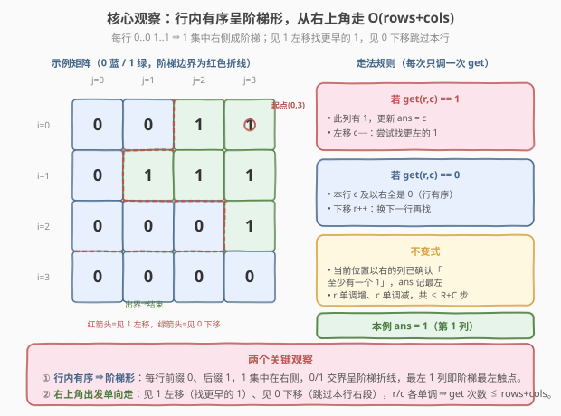
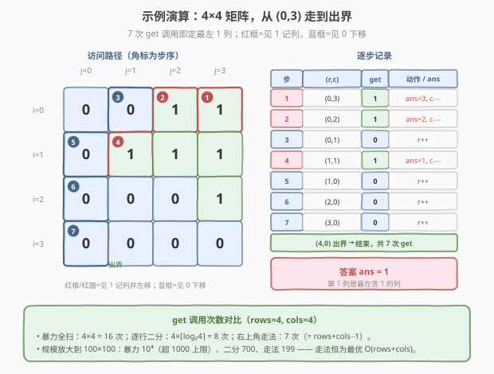

# LeetCode 至少有一个 1 的最左端列 题解

## 1. 题目概述

- **标题 / 题号**：至少有一个 1 的最左端列（#1428，medium）
- **链接**：https://leetcode.cn/problems/leftmost-column-with-at-least-a-one/
- **难度**：中等
- **标签**：数组、二分查找、矩阵、交互题

**题意**：本题是一道**交互题**。给定一个**二进制矩阵** `BinaryMatrix`，其中每个元素为 `0` 或 `1`，且**每一行按非递减顺序排序**（即每行形如 `0..0 1..1`，前缀 0、后缀 1）。请返回**最左端含有至少一个 1 的列的下标**；若整个矩阵没有 1，返回 `-1`。

你不能直接访问矩阵，只能通过给定的 `BinaryMatrix` 接口读取：

- `BinaryMatrix.get(row, col)`：返回 `(row, col)` 位置的值（`0` 或 `1`）。
- `BinaryMatrix.dimensions()`：返回 `[rows, cols]`，即矩阵的行数与列数。

**约束**：

- `rows == mat.length`，`cols == mat[i].length`
- $1 \le \text{rows}, \text{cols} \le 100$
- `mat[i][j]` 为 `0` 或 `1`
- 每行 `mat[i]` 按非递减顺序排序
- 评测系统调用 `get` 的**总次数不得超过 1000 次**；`dimensions()` 可任意次调用

> ⚠️ 关键限制是「`get` 调用次数 ≤ 1000」。最坏 $100 \times 100 = 10^4$ 的暴力全扫会**超限**，必须利用「每行有序」压缩查询次数。最优解可做到 $O(\text{rows} + \text{cols})$ 次调用，远低于上限。

**示例 1**：

```text
输入：mat = [[0,0],[1,1]]
输出：0
解释：第 0 列含 1（位置 (1,0)），是最左含 1 的列。
```

**示例 2**：

```text
输入：mat = [[0,0],[0,1]]
输出：1
解释：第 0 列全是 0，第 1 列含 1。
```

**示例 3**：

```text
输入：mat = [[0,0],[0,0]]
输出：-1
解释：矩阵无 1。
```

> 💡 **进阶**：若矩阵很大（行数/列数远大于 100），能否仍保持线性于 `rows + cols` 的调用次数？答案是可以——本文的最优解天然适用。

## 2. 解题思路

### 2.1 暴力思路：全矩阵扫描

最直白的做法：逐格调用 `get`，记录出现 `1` 的最小列号。时间与 `get` 次数均为 $O(\text{rows} \cdot \text{cols})$，最坏 $10^4$ 次，**超过 1000 次上限**，会被判失败。瓶颈在于「为找 1 而把 0 也逐一查了」，完全没用上「行内有序」。

稍好一点的做法是「每行从左到右扫到首个 1 即停」，最坏仍 $O(\text{rows} \cdot \text{cols})$，于事无补。

### 2.2 核心观察：行内有序成阶梯，从右上角单向走



**观察 1（阶梯形）**：每行前缀 `0`、后缀 `1`，意味着 `1` 集中在矩阵右侧，`0/1` 交界处呈一条**阶梯折线**。「最左含 1 的列」就是这条阶梯折线**最左触点的列号**。

**观察 2（右上角出发的单向走法）**：从**右上角** $(0, \text{cols}-1)$ 出发，每步只调用一次 `get`：

- 若 `get(r,c) == 1`：此列确有 1，**记 `ans = c`**，并**左移 `c--`**——去更左的列寻找更早的 1；
- 若 `get(r,c) == 0`：由于本行有序，`c` 及以右**全是 0**，本行此列无戏，**下移 `r++`**——换下一行继续。

由于 `r` 只单调增、`c` 只单调减，二者在网格上走出一条**只向左、向下的折线**，总步数 $\le \text{rows} + \text{cols}$。

> 💡 **关键不变式**：当前位置以右的列已确认为「至少含一个 1」，`ans` 始终是其中最左者。每次遇 `1` 收紧 `ans`、向左探索；遇 `0` 说明本行此列无 1，只能向下换行——两种移动都**不丢解**，且每步排除「一整行右段」或「一整列左段」。

### 2.3 算法流程图


1. 调 `dimensions()` 取 `rows, cols`；初始化 `r = 0`，`c = cols - 1`，`ans = -1`。
2. 当 `r < rows` 且 `c >= 0` 时循环：
   - `v = get(r, c)`；
   - 若 `v == 1`：`ans = c`，`c -= 1`；
   - 否则：`r += 1`。
3. 越界即结束，返回 `ans`（无 1 时仍为 `-1`）。

### 2.4 示例演算

以一个 $4 \times 4$ 矩阵为例（官方示例偏小，此处用更大矩阵展示阶梯走法）：



```text
     j=0 j=1 j=2 j=3
i=0   0   0   1   1
i=1   0   1   1   1
i=2   0   0   0   1
i=3   0   0   0   0
```

从 $(0,3)$ 出发逐步执行：

| 步 | $(r,c)$ | `get` | 动作 | `ans` |
|----|---------|-------|------|-------|
| 1 | $(0,3)$ | 1 | 记列、`c--` | 3 |
| 2 | $(0,2)$ | 1 | 记列、`c--` | 2 |
| 3 | $(0,1)$ | 0 | `r++` | 2 |
| 4 | $(1,1)$ | 1 | 记列、`c--` | 1 |
| 5 | $(1,0)$ | 0 | `r++` | 1 |
| 6 | $(2,0)$ | 0 | `r++` | 1 |
| 7 | $(3,0)$ | 0 | `r++` | 1 |
| — | $(4,0)$ | 出界 | 结束 | **1** |

共 **7 次** `get` 调用（$= \text{rows} + \text{cols} - 1$），即定最左含 1 的列为第 1 列。注意第 3 步遇 `0` 后下移到 $(1,1)$ 直接命中 `1`，把 `ans` 从 2 收紧到 1——这正是「下移跳过本行 0 段、立刻在新行继续向左探测」的妙处。

## 3. 参考代码

### C++

```cpp
// 至少有一个1的最左端列.cpp —— 右上角出发，见1左移/见0下移
// 编译: g++ -O2 -std=c++17 至少有一个1的最左端列.cpp -o lmc
/**
 * // 这是 BinaryMatrix 的 API 接口，不应自行实现。
 * class BinaryMatrix {
 *   public:
 *     int get(int row, int col);
 *     vector<int> dimensions();
 * };
 */
class Solution {
public:
    int leftMostColumnWithOne(BinaryMatrix &binaryMatrix) {
        auto dims = binaryMatrix.dimensions();
        int rows = dims[0], cols = dims[1];
        int r = 0, c = cols - 1, ans = -1;
        // r 单调增、c 单调减，至多 rows+cols 次 get
        while (r < rows && c >= 0) {
            if (binaryMatrix.get(r, c) == 1) {
                ans = c;      // 此列有 1，记下并尝试更左
                --c;
            } else {
                ++r;          // 本行此列及以右全 0，换下一行
            }
        }
        return ans;
    }
};
```

### Python

```python
# """
# 这是 BinaryMatrix 的 API 接口，不应自行。
# class BinaryMatrix(object):
#    def get(self, row: int, col: int) -> int:
#    def dimensions(self) -> List[int]:
# """
class Solution:
    def leftMostColumnWithOne(self, binaryMatrix: 'BinaryMatrix') -> int:
        rows, cols = binaryMatrix.dimensions()
        r, c, ans = 0, cols - 1, -1
        # r 单调增、c 单调减，至多 rows+cols 次 get
        while r < rows and c >= 0:
            if binaryMatrix.get(r, c) == 1:
                ans = c       # 此列有 1，记下并尝试更左
                c -= 1
            else:
                r += 1        # 本行此列及以右全 0，换下一行
        return ans
```

> 💡 **实现细节**：① `dimensions()` 返回 `[rows, cols]`，调用次数不限，放心取。② 起点 `c = cols - 1`（最右列）；若最右列全 0，走法会一路下移到出界，`ans` 保持 `-1`，正确返回。③ 不需要额外判空矩阵——约束保证 `rows, cols >= 1`。

## 4. 复杂度分析

| 维度 | 复杂度 | 说明 |
|------|--------|------|
| **get 调用次数** | $O(\text{rows} + \text{cols})$ | 每轮一次 `get`；`r` 从 $0$ 单调增到 $\text{rows}$、`c` 从 $\text{cols}-1$ 单调减到 $-1$，总轮数 $\le \text{rows} + \text{cols}$ |
| **时间** | $O(\text{rows} + \text{cols})$ | 与 `get` 次数同级，每次循环 $O(1)$ |
| **空间** | $O(1)$ | 仅用 `r, c, ans` 三个变量 |

> ⚠️ 对比暴力 $O(\text{rows} \cdot \text{cols})$：$100 \times 100 = 10^4 > 10^3$ 上限；走法 $100 + 100 = 200 \ll 10^3$，从容通过。走法把「逐格排查」改为「按行列单调移动，每步排除一行右段或一列左段」，把平方级降为线性。

## 5. 扩展：逐行二分查找

若想不到右上角走法，可对**每一行**用二分查找定位首个 `1`，取所有行首个 `1` 列号的最小值。每行二分 $O(\log \text{cols})$，共 $O(\text{rows} \log \text{cols})$ 次调用。$100 \times \lceil \log_2 100 \rceil = 100 \times 7 = 700 < 1000$，**同样可通过**。

```cpp
class Solution {
public:
    int leftMostColumnWithOne(BinaryMatrix &binaryMatrix) {
        auto dims = binaryMatrix.dimensions();
        int rows = dims[0], cols = dims[1];
        int ans = -1;
        for (int r = 0; r < rows; ++r) {
            // 在 [0, cols) 内找首个 1：标准 lower_bound 模板
            int lo = 0, hi = cols;
            while (lo < hi) {
                int mid = lo + (hi - lo) / 2;
                if (binaryMatrix.get(r, mid) == 1) hi = mid;
                else lo = mid + 1;
            }
            if (lo < cols) {            // 该行存在 1
                ans = (ans == -1) ? lo : min(ans, lo);
            }
        }
        return ans;
    }
};
```

> ⚠️ 注意二分区间用 $[0, \text{cols})$ 半开写法：`lo == hi` 退出时，`lo` 即首个 `1` 的列号；若 `lo == cols` 说明该行全 0。这与 [704. 二分查找](https://leetcode.cn/problems/binary-search/)（[题解](../0701-0800/704_二分查找.md)）的 `lower_bound` 谓词版一致。

| 解法 | get 次数 | 空间 | 备注 |
|------|----------|------|------|
| 右上角走法 | $O(\text{rows} + \text{cols})$ | $O(1)$ | 最优，无需二分细节 |
| 逐行二分 | $O(\text{rows} \log \text{cols})$ | $O(1)$ | 易想到，常数略高但同样过限 |

当 $\text{cols}$ 远大于 $\text{rows}$ 时（如行少列多），二分的 $O(\text{rows} \log \text{cols})$ 可能优于走法的 $O(\text{rows} + \text{cols})$；反之走法更优。本题规模下两者均可，**走法代码更简洁、是面试首选**。

## 6. 面试要点

1. **为什么从右上角而不是左上角出发？**

   > 左上角 `get` 得 `0` 时无法区分「应右移还是下移」——右方、下方都可能藏 1。右上角则不同：行内向左是「更左的列」（可能更早的 1），列向下是「下一行」；遇 `1` 必左移、遇 `0` 必下移，方向唯一确定。本质是利用「行内有序」给每步一个无歧义的决策。

2. **为什么遇 0 下移是安全的，不会漏掉更左的 1？**

   > 本行有序 ⇒ `get(r,c)==0` 时 `(r, c)` 及以右全为 0，本行不可能在 `≥ c` 的列贡献 1。但更左的列 `< c` 本行可能仍有 1——不过这些更左列的 1 必然会被**后续某行**探到（因为 `ans` 只在遇 1 时收紧，且 `c` 还会继续左移）。下移只是「暂时放弃本行的右段」，并未缩小对最左 1 的搜索范围。

3. **总步数为什么不超过 rows + cols？**

   > `r` 从 $0$ 单调增到 $\text{rows}$、`c` 从 $\text{cols}-1$ 单调减到 $-1$。每步要么 `r++`、要么 `c--`，故总步数 $\le \text{rows} + \text{cols}$。更紧的界是 $\text{rows} + \text{cols} - 1$（起点已占一格）。

4. **如果矩阵全 0，算法返回什么？**

   > 起点 `(0, cols-1)` 若为 0 就一路 `r++` 下移，直到 `r == rows` 出界，`ans` 始终保持初始值 `-1`，正确返回 `-1`。无需特判。

5. **逐行二分和走法各在什么时候更优？**

   > 走法 $O(\text{rows} + \text{cols})$，二分 $O(\text{rows} \log \text{cols})$。当列数远大于行数时，$\log \text{cols}$ 可能小于 $\text{cols}$，二分更优；当行数、列数相近时走法更优且代码更简。本题两者都能通过 1000 次上限。

> 💡 **一句话总结**：1428 是「行内有序 ⇒ 阶梯形 ⇒ 右上角单向走」的招牌题——见 1 左移收紧答案、见 0 下移跳过本行 0 段，每步一次 `get`，$O(\text{rows} + \text{cols})$ 次调用搞定交互题的查询次数限制。

## 同类练习题

| # | 题目 | 与本题的关联 |
|---|------|-------------|
| 240 | [搜索二维矩阵 II](https://leetcode.cn/problems/search-a-2d-matrix-ii/)（[题解](../0201-0300/240_搜索二维矩阵II.md)） | 行、列皆升序矩阵里找目标值，最优解同样是「右上角出发，大则左移、小则下移」，与本题走法同源 |
| 74 | [搜索二维矩阵](https://leetcode.cn/problems/search-a-2d-matrix/)（[题解](../0001-0100/74_搜索二维矩阵.md)） | 每行首列也升序的「展开成一维」有序矩阵，二分即可；对照本题「仅行内有序」需用走法 |
| 1351 | [统计有序矩阵中的负数](https://leetcode.cn/problems/count-negative-numbers-in-a-sorted-matrix/)（[题解](../1301-1400/1351_统计有序矩阵中的负数.md)） | 行、列皆降序矩阵数负数，左下角/右上角单向走法计数，与本题同为「利用有序走阶梯」 |
| 378 | [有序矩阵中第 K 小的元素](https://leetcode.cn/problems/kth-smallest-element-in-a-sorted-matrix/)（[题解](../0301-0400/378_有序矩阵中第K小的元素.md)） | 行列皆升序矩阵找第 k 小，二分值域时用左下角计数，对照本题「右上角定位」的方向变体 |
| 704 | [二分查找](https://leetcode.cn/problems/binary-search/)（[题解](../0701-0800/704_二分查找.md)） | 二分母题，本题扩展解法的「逐行二分找首个 1」即其 `lower_bound` 谓词版 |
