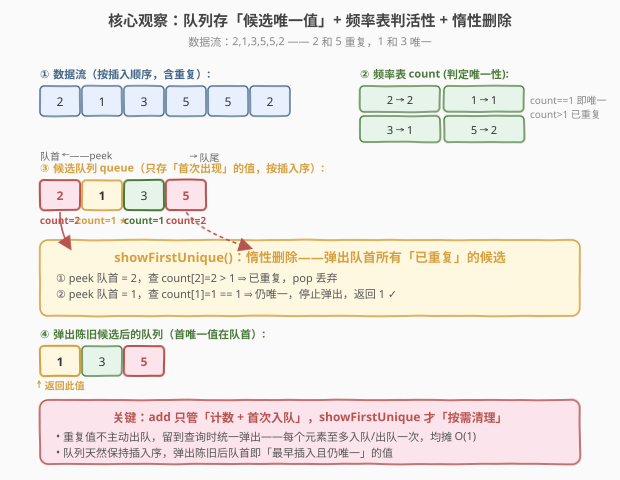
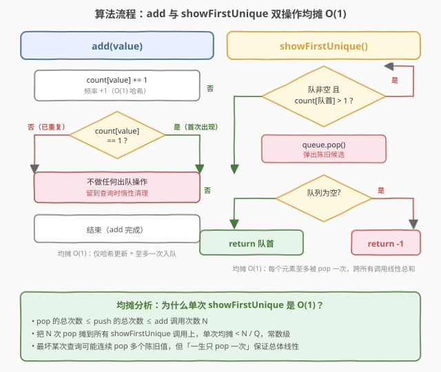
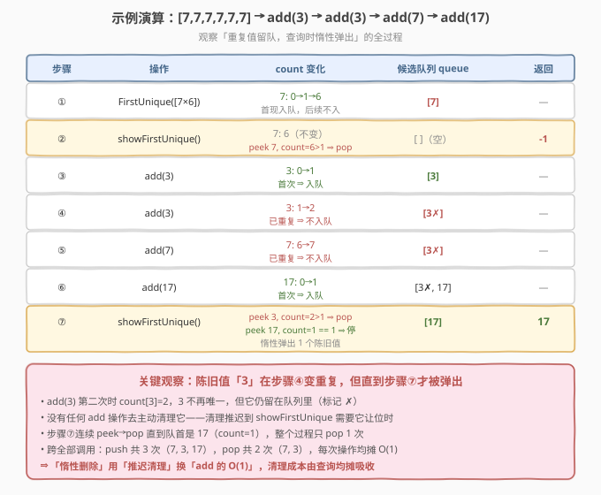

# 第一个唯一数字

- **题目名称**：第一个唯一数字
- **链接**：[1429. 第一个唯一数字](https://leetcode.cn/problems/first-unique-number/)
- **难度**：中等
- **标签**：设计、队列、哈希表

## 1. 题目概述

给定一个整数队列，要求设计数据结构 `FirstUnique`，支持三种操作：

- `FirstUnique(int[] nums)`：用初始数组 `nums` 初始化对象（数组中的数依次进入队列）
- `int showFirstUnique()`：返回队列中**第一个唯一整数**（出现次数恰好为 1 且最早出现的那个），若无唯一整数则返回 `-1`
- `void add(int value)`：将 `value` 追加到队列末尾

「唯一」指该值在**当前**整个队列中出现次数恰好为 1；「第一个」指所有唯一值中**最早被加入**的那个。

**示例 1**：

```text
输入：
["FirstUnique","showFirstUnique","add","showFirstUnique"]
[[[2,3,5]],[],[5],[]]
输出：[null,2,null,2]
解释：
FirstUnique fu = new FirstUnique([2,3,5]);   // 队列 [2,3,5]，三者皆唯一
fu.showFirstUnique();                         // 返回 2
fu.add(5);                                    // 队列 [2,3,5,5]，5 不再唯一，2 仍唯一
fu.showFirstUnique();                         // 返回 2
```

**示例 2**：

```text
输入：
["FirstUnique","showFirstUnique","add","add","add","add","add","showFirstUnique"]
[[[7,7,7,7,7,7]],[],[7],[3],[3],[7],[17],[]]
输出：[null,-1,null,null,null,null,null,17]
解释：
FirstUnique fu = new FirstUnique([7,7,7,7,7,7]);  // 队列全是 7，无唯一值
fu.showFirstUnique();                               // 返回 -1
fu.add(7); fu.add(3); fu.add(3); fu.add(7); fu.add(17);
// 队列 [7×7, 3, 3, 17]，唯一值只有 17
fu.showFirstUnique();                               // 返回 17
```

**约束条件**：

- $1 \le \text{nums.length} \le 10^5$
- $1 \le \text{nums[i]}, \text{value} \le 10^8$
- 最多调用 $5 \times 10^4$ 次 `showFirstUnique` 和 `add`

> 💡 本题核心：**队列 + 频率哈希表 + 惰性删除**。队列维护「按插入序排列的候选唯一值」，哈希表记录每个值的出现次数。`add` 只负责计数与「首次入队」；`showFirstUnique` 在查询时才弹出队首所有已重复的陈旧候选，露出第一个仍唯一的值。每个元素至多入队、出队各一次，单次操作均摊 $O(1)$。

---

## 2. 解题思路

### 2.1 暴力思路

每次 `showFirstUnique` 时，用一个哈希表统计当前队列中所有元素的频率，再从队首到队尾扫描，返回第一个频率为 1 的值。`add` 直接把值追加到队列尾部。

- `add`：$O(1)$（尾部追加）
- `showFirstUnique`：$O(n)$（遍历统计 + 扫描），$n$ 为队列长度

最坏 $5 \times 10^4$ 次查询 × 每次 $10^5$ 元素 $\approx 5 \times 10^9$，严重超时。瓶颈在于「每次查询都全量重算频率」，没有复用历史信息。

### 2.2 核心观察：候选队列 + 频率表 + 惰性删除



**观察 1**：唯一性只取决于「该值当前出现次数」。用一个哈希表 `count` 维护每个值的频率，`add(value)` 时 `count[value]++` 即可 $O(1)$ 更新，无需全量重算。

**观察 2**：唯一值的「先后顺序」就是它们的**插入顺序**。若用一个队列只存「首次出现」的值，队列天然保持插入序——队首即最早的候选。

**观察 3**：当某个值第二次出现（`count` 从 1 变 2），它在队列中的副本**不再唯一**，但**不必立刻删除**。可以推迟到 `showFirstUnique` 查询时：只要队首对应的 `count > 1`，就弹出丢弃，直到队首 `count == 1`（或队空）。

> 💡 **关键技巧——惰性删除**：与其在 `add` 时主动搜索并删除已重复的候选（链表删除需 $O(n)$ 定位），不如把它「标记为陈旧」留于队中，等查询需要它让位时再弹出。每个元素一生只被 `pop` 一次，总删除成本线性，均摊到每次查询为 $O(1)$。这与 [239. 滑动窗口最大值](https://leetcode.cn/problems/sliding-window-max-value/)（[题解](../0201-0300/239_滑动窗口最大值.md)）的单调队列「过期元素惰性弹出」同构。

两个数据结构分工：

| 数据结构 | 职责 | 复杂度 |
|---------|------|--------|
| 哈希表 `count` | 值 → 出现次数，判定唯一性 | `O(1)` 更新 / 查询 |
| 队列 `queue` | 存「首次出现」的候选，保持插入序 | `O(1)` push / peek / pop |

### 2.3 算法流程图



**`FirstUnique(int[] nums)`**：对每个 `num` 调用 `add(num)`。

**`add(value)`**：
1. `count[value]++`
2. 若 `count[value] == 1`（首次出现）→ `queue.push(value)`
3. 若 `count[value] > 1`（已重复）→ 不做任何出队操作（留待查询时惰性清理）

**`showFirstUnique()`**：
1. 循环：当队列非空且 `count[queue.peek()] > 1` → `queue.pop()`（弹出陈旧候选）
2. 队列空 → 返回 `-1`
3. 否则 → 返回 `queue.peek()`

### 2.4 示例演算

以示例 2 为例，初始 `[7,7,7,7,7,7]`，随后 `add(7)`、`add(3)`、`add(3)`、`add(7)`、`add(17)`，最后 `showFirstUnique()`：



```text
① FirstUnique([7,7,7,7,7,7])
   count[7]=6; 首次入队 → queue=[7]（后续 7 因 count>1 不再入队）
② showFirstUnique(): peek 7, count[7]=6>1 ⇒ pop → 队空 → 返回 -1
③ add(3):  count[3]=1 ⇒ queue=[3]
④ add(3):  count[3]=2 ⇒ 不入队，queue 仍 [3]（3 已陈旧，标记 ✗）
⑤ add(7):  count[7]=7 ⇒ 不入队
⑥ add(17): count[17]=1 ⇒ queue=[3✗, 17]
⑦ showFirstUnique(): peek 3, count[3]=2>1 ⇒ pop; peek 17, count[17]=1 ⇒ 返回 17
```

> 💡 注意步骤④：`3` 在第二次 `add(3)` 时已变为重复，但**没有任何操作主动清理它**——它一直留在队列里，直到步骤⑦查询时才被弹出。这正是「惰性删除」的精髓：用「推迟清理」换取 `add` 的 $O(1)$，清理成本由 `showFirstUnique` 均摊吸收。

---

## 3. 参考代码

### C++

```cpp
// 第一个唯一数字.cpp —— 队列 + 频率哈希 + 惰性删除
// 编译: g++ -O2 -std=c++17 第一个唯一数字.cpp -o funiq
class FirstUnique {
    unordered_map<int, int> cnt;   // 值 -> 出现次数
    queue<int> q;                  // 候选唯一值（按插入序）
public:
    FirstUnique(vector<int>& nums) {
        for (int x : nums) add(x);
    }

    int showFirstUnique() {
        // 惰性删除：弹出队首所有已重复的陈旧候选
        while (!q.empty() && cnt[q.front()] > 1) {
            q.pop();
        }
        if (q.empty()) return -1;
        return q.front();
    }

    void add(int value) {
        if (++cnt[value] == 1) {   // 首次出现 -> 入候选队列
            q.push(value);
        }
        // 已重复时不做任何出队，留到查询时惰性清理
    }
};
```

### Python

```python
from collections import deque, defaultdict


class FirstUnique:
    def __init__(self, nums: List[int]):
        self.cnt = defaultdict(int)   # 值 -> 出现次数
        self.q = deque()              # 候选唯一值（按插入序）
        for x in nums:
            self.add(x)

    def showFirstUnique(self) -> int:
        # 惰性删除：弹出队首所有已重复的陈旧候选
        while self.q and self.cnt[self.q[0]] > 1:
            self.q.popleft()
        return self.q[0] if self.q else -1

    def add(self, value: int) -> None:
        self.cnt[value] += 1
        if self.cnt[value] == 1:      # 首次出现 -> 入候选队列
            self.q.append(value)
        # 已重复时不做任何出队，留到查询时惰性清理
```

> 💡 **实现细节**：① `add` 中 `++cnt[value] == 1` 利用前置自增的返回值，一行完成「计数 + 判首次」，无需先查后更。② Python 用 `defaultdict(int)` 省去键存在性判断；`deque.popleft()` 是 $O(1)$。③ `showFirstUnique` 的 `while` 循环看似可能 $O(n)$，但每次 `pop` 的元素「一生只 pop 一次」，跨所有调用总 pop 次数 $\le$ 总 push 次数，均摊 $O(1)$。

---

## 4. 复杂度分析

| 维度 | 复杂度 | 说明 |
|------|--------|------|
| **时间（均摊）** | $O(1)$ | `add`：哈希计数 + 至多一次入队，$O(1)$；`showFirstUnique`：每次 `pop` 的元素此后不再入队，总 pop $\le$ 总 push $\le$ 操作数 $N$，均摊到每次查询为 $O(1)$ |
| **空间** | $O(N)$ | `count` 存所有不同值的频率，`queue` 存每个值首次出现的副本，合计 $O(N)$，$N$ 为 `add` 总调用次数（含初始化） |
| **思路** | 队列 + 惰性删除 | 队列保插入序，频率表判活性；查询时按需清理陈旧候选，把「删除成本」从 `add` 转移到「真正需要让位」的时刻 |

> ⚠️ 对比暴力 `showFirstUnique` $O(n)$：惰性删除把「每次查询全量重算」改为「增量维护 + 按需清理」，单次查询均摊降到 $O(1)$。关键在于陈旧候选「不主动删、查询时才删」，且每个候选至多被删一次。

---

## 5. 扩展：有序集合 / 双链表主动删除法

若坚持「实时维护」而非惰性删除，可用 **哈希表 + 双向链表 + 有序指针**：

- `count`：频率哈希表
- `nodes`：值 → 双链表节点指针（仅当该值唯一时存在）
- 双向链表按插入序维护「当前唯一的值」，`showFirstUnique` 直接返回链表头

`add(value)` 时若 `count[value]` 由 1 变 2，则从链表摘除该节点并从 `nodes` 删除（$O(1)$，已知指针）。这样 `showFirstUnique` 严格 $O(1)$（无清理循环），`add` 仍 $O(1)$。

代价是双向链表实现复杂、常数更大。**惰性删除用「查询时的一次 while」换「add 的简洁」**，在查询频率不极端高于 add 时更优。两种方案总复杂度同为均摊 $O(1)$。

> 💡 这一权衡与 [146. LRU 缓存](https://leetcode.cn/problems/lru-cache/)（[题解](../0101-0200/146_LRU缓存.md)）的「双向链表实时维护」 vs [239. 滑动窗口最大值](https://leetcode.cn/problems/sliding-window-max-value/)（[题解](../0201-0300/239_滑动窗口最大值.md)）的「单调队列惰性弹出」是同一对设计哲学：**实时维护（结构复杂、查询轻） vs 惰性清理（结构简单、查询带清理）**。

---

## 6. 面试要点

1. **为什么 `showFirstUnique` 的 `while` 循环是均摊 $O(1)$？**

   > 每个元素至多被 `push` 一次、`pop` 一次。设总操作数为 $N$，则总 `pop` 次数 $\le N$。把 $N$ 次 pop 摊到所有 `showFirstUnique` 调用上，单次均摊为 $O(1)$。最坏某次查询可能连续 pop 多个陈旧值，但「一生只 pop 一次」保证总体线性，不会出现反复清理。

2. **为什么不直接用哈希表 + 每次扫描队首？那样也是 $O(1)$ 吧？**

   > 不行。若每次 `showFirstUnique` 都从原始队列队首线性扫描找第一个 `count==1` 的值，最坏要扫到队尾，$O(n)$。瓶颈在于「原始队列含大量重复值，每次都要跳过它们」。候选队列 + 惰性删除把「跳过重复」的成本分摊到各次查询，避免重复扫描同一段。

3. **重复值为什么不主动从队列删除？**

   > 队列只支持队首弹出，删除队中任意位置需 $O(n)$。若改用双向链表则能 $O(1)$ 删任意节点，但实现复杂、常数更大（见第 5 节扩展）。惰性删除用「推迟到查询时弹队首」绕开了「定位删除」的难题，结构最简。

4. **队列里会不会积压大量陈旧值导致内存爆炸？**

   > 不会。陈旧值每个至多占队列一个槽位（只在首次出现时入队一次），队列大小 $\le$ 不同值的个数 $\le N$。且每次 `showFirstUnique` 都会清理队首所有连续陈旧值。最坏情况是「从不查询，只 add 重复值」，此时队列退化到 $O(N)$——但这也正是空间上界 $O(N)$，与 `count` 表同级，不会更糟。

5. **本题和 239 滑动窗口最大值的惰性弹出有什么共同点？**

   > 都是「队列存候选 + 查询时弹出无效队首」。239 的单调队列在查询窗口最大值时弹出「已滑出窗口」的过期队首；本题弹出「已变重复」的陈旧队首。两者的核心都是**惰性删除 + 均摊分析**：无效元素不主动删，留到查询挡路时才弹，每个元素至多入队出队一次。

> 💡 **一句话总结**：1429 是「候选队列 + 频率表 + 惰性删除」——`add` 只计数与首次入队，`showFirstUnique` 才弹出陈旧队首露出第一个唯一值，单次均摊 $O(1)$，是 [239 单调队列](https://leetcode.cn/problems/sliding-window-max-value/)惰性思想在「流式去重」场景的直接应用。

---

## 7. 同类练习题

- [239. 滑动窗口最大值](https://leetcode.cn/problems/sliding-window-max-value/)（[题解](../0201-0300/239_滑动窗口最大值.md)）：单调队列 + 惰性弹出过期队首，同一套「队列存候选、查询时清理」均摊 $O(1)$ 范式
- [146. LRU 缓存](https://leetcode.cn/problems/lru-cache/)（[题解](../0101-0200/146_LRU缓存.md)）：哈希表 + 双向链表实时维护顺序，对照本题「实时维护 vs 惰性删除」的设计权衡
- [387. 字符串中的第一个唯一字符](https://leetcode.cn/problems/first-unique-character-in-a-string/)：静态版「第一个唯一」，两趟扫描（先建频率表再找首个 count==1），对照本题流式版的增量维护
- [460. LFU 缓存](https://leetcode.cn/problems/lfu-cache/)（[题解](../0401-0500/460_LFU缓存.md)）：频率桶 + 双向链表，按访问频率分层淘汰，对照本题按频率判定唯一性
- [380. O(1) 时间插入、删除和获取随机元素](https://leetcode.cn/problems/insert-delete-getrandom-o1/)：哈希表 + 数组的 $O(1)$ 设计题，对照本题「哈希 + 队列」的设计组合
