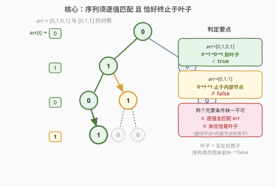
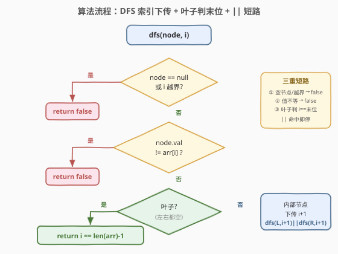
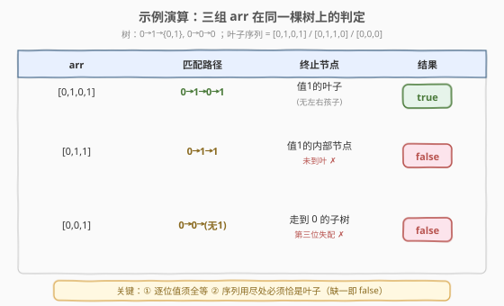

# LeetCode 判断给定的序列是否是二叉树从根到叶的路径 题解

## 1. 题目概述

- **标题 / 题号**：判断给定的序列是否是二叉树从根到叶的路径（#1430，medium）
- **链接**：https://leetcode.cn/problems/check-if-a-string-is-a-valid-sequence-from-root-to-leaves-path-in-a-binary-tree/
- **难度**：中等
- **标签**：树、深度优先搜索、二叉树

**题意**：给定一棵二叉树的根节点 `root`（每个节点值是 $0\sim9$ 的数字）和一个整数序列 `arr`。判断 `arr` 是否是树中某条「从根节点到叶子节点」路径上节点值组成的序列。是则返回 `true`，否则返回 `false`。

> 💡 **合法序列的两个充要条件**：① 路径上各节点值**从根到叶逐位等于** `arr` 的对应元素；② 路径**必须终止于叶子节点**，且 `arr` 恰好在这片叶子处用尽——既不能在内部节点就停（序列用尽但未到叶），也不能到叶时序列还有剩余（路径短于序列）。

**示例 1**：

```text
输入：root = [0,1,0,0,1,0,null,null,1,0,0], arr = [0,1,0,1]
输出：true
解释：路径 0 → 1 → 0 → 1 是一条到叶子的路径，逐值匹配 arr。
            0
          /   \
         1     0
        / \      \
       0   1     0
        \  / \
        1 0  0
```

**示例 2**：

```text
输入：root = [0,1,0,0,1,0,null,null,1,0,0], arr = [0,1,1]
输出：false
解释：0 → 1 → 1 虽然逐值匹配，但末位节点 1 不是叶子（它还有孩子 0、0），
      序列用尽时未到叶 → false。
```

**示例 3**：

```text
输入：root = [0,1,0,0,1,0,null,null,1,0,0], arr = [0,0,1]
输出：false
解释：0 → 0 后走到值 0 的子树，第三位找不到 1（值失配）→ false。
```

**约束**：

- 树中节点数目在范围 $[1, 10^4]$ 内
- $0 \le \text{Node.val} \le 9$
- $1 \le \text{arr.length} \le 10^4$
- $0 \le \text{arr}[i] \le 9$

> 💡 本题是 [112. 路径总和](../0101-0200/112_路径总和.md)（判定版，`||` 短路）的「**序列匹配版**」：112 把目标 `targetSum` 一路「减」下去到叶子判等，本题把**序列索引 `i` 一路「加」下去**到叶子判 `i == len(arr)-1`。同样是「存在性判定」，同样用 `||` 短路；区别只在于「下传的状态」从「剩余目标和」换成「当前匹配下标」，以及多了「序列长度必须等于路径长度」的耦合约束。

## 2. 解题思路

### 2.1 暴力思路

枚举每一条「根到叶」路径，把路径上的值拼成序列，再与 `arr` 逐位比较。本质就是一次完整的 DFS。优化点有两个：**如何在递归中高效推进对 `arr` 的匹配进度**，以及**如何尽早短路返回**。

### 2.2 核心观察：索引下传 —— i 一路「+1」下去



关键观察是**序列匹配的本质**：从根走到当前节点时，已经匹配了 `arr` 的前 `i` 个元素（`arr[0..i-1]`）。每深入一层，只需比较当前节点值是否等于 `arr[i]`，相等则把 `i+1` 下传给子树。

- 进入根节点时，`i = 0`，比较 `root.val == arr[0]`；
- 每往子节点走一层，匹配下标 `+1`；
- **走到叶子时**，需要 `i` 恰好是 `arr` 的最后一个下标 `len(arr)-1`——说明序列在这片叶子处刚好用尽，且逐位全等，返回 `true`。

> 💡 这是一种「**索引递进**」写法：`dfs(node, i)` 表示「在以 `node` 为根的子树里，是否存在一条到叶路径，使路径值序列恰好等于 `arr[i:]`」。子问题定义清晰，`i` 作为参数随递归下传，无需额外数组、无需回溯——与 [129. 求根节点到叶节点数字之和](../0101-0200/129_求根节点到叶节点数字之和.md) 中 `cur` 免回溯同理，因为 `int` 按值传递。

### 2.3 关键易错点：三个「必须返回 false」的短路点

> ⚠️ 本题有**三处**必须立即返回 `false` 的失败条件，缺一不可：

1. **空节点 / 索引越界**：`node == null` 或 `i >= len(arr)`。空节点说明路径已走到树外却还没匹配完（或树为空）；索引越界说明序列已用尽但当前节点还有值要匹配（序列短于已走路径）。
2. **值失配**：`node.val != arr[i]`。当前位对不上，整条路径作废。
3. **序列用尽但未到叶**：当 `i == len(arr)-1`（序列只剩最后一个元素且当前已匹配）但当前节点**不是叶子**时，序列会在内部节点处提前用尽——这是示例 2 的反例。此情形在代码中由「叶子判末位」与「内部节点下传 `i+1` 后子调用索引越界返回 `false`」自然覆盖，无需单独分支。

> ⚠️ **必须判叶子**：判定条件是「叶子节点**且** `i == len(arr)-1`」。不能只判 `i == len(arr)-1` 而不判叶子——否则当某内部节点恰好使序列在此用尽时会被误判 `true`，但它还有孩子、没到叶（正是示例 2）。判叶子即 `node.left == null && node.right == null`。

### 2.4 算法流程图



**DFS 递归逻辑**：

| 情况 | 处理 |
|------|------|
| `node == null` 或 `i >= len(arr)` | 返回 `false`（空子树 / 序列越界，无合法路径） |
| `node.val != arr[i]` | 返回 `false`（当前位失配） |
| 叶子（左右都空） | 返回 `i == len(arr) - 1`（序列恰在此叶用尽才 true） |
| 否则（内部节点） | 返回 `dfs(left, i+1) || dfs(right, i+1)` |

> 💡 **短路优势**：`||` 一旦左侧为 `true` 就不再递归右侧。当命中路径在左子树时，可直接跳过右子树的整段搜索。这与 [112](../0101-0200/112_路径总和.md) 的 `||` 短路完全一致——**存在性判定可短路，枚举/求和必须全搜**。

> ⚠️ **「序列用尽但未到叶」如何被代码自然挡住？** 当内部节点处 `i == len(arr)-1` 时，代码不会进入叶子分支（因为它不是叶子），而是走到最后一行 `dfs(child, i+1)`。此时 `i+1 == len(arr)`，子调用在第一步 `i >= len(arr)` 即返回 `false`。左右都 `false`，整体返回 `false`——示例 2 正是如此被挡下，无需额外判支。

### 2.5 示例演算

以示例 1 的树为统一测试床，追踪三组 `arr` 的判定过程：



| arr | 匹配路径 | 终止节点 | 是否叶子 | 结果 |
|-----|----------|----------|----------|------|
| `[0,1,0,1]` | 0→1→0→1 | 值 1 的叶子 | 是 | `true` |
| `[0,1,1]` | 0→1→1 | 值 1 的内部节点 | 否（有孩子 0、0） | `false` |
| `[0,0,1]` | 0→0→（无 1） | 值 0 的子树 | 第三位失配 | `false` |

> 💡 注意第一组沿 `dfs(0,0)→dfs(1,1)→dfs(0,2)→dfs(1,3)`：在叶子 `1` 处 `i=3==len(arr)-1`，返回 `true` 并逐层 `||` 短路上传。第二组走到内部节点 `1` 时 `i=2==len(arr)-1`，但它不是叶子，下传 `dfs(child,3)` 因 `3>=len(arr)` 全部 `false`，整体 `false`——这正是「索引越界挡住未到叶」的体现。

## 3. 参考代码

### C++

```cpp
/**
 * Definition for a binary tree node.
 * struct TreeNode {
 *     int val;
 *     TreeNode *left;
 *     TreeNode *right;
 *     TreeNode() : val(0), left(nullptr), right(nullptr) {}
 *     TreeNode(int x) : val(x), left(nullptr), right(nullptr) {}
 *     TreeNode(int x, TreeNode *left, TreeNode *right) : val(x), left(left), right(right) {}
 * };
 */
class Solution {
  public:
    bool isValidSequence(TreeNode* root, vector<int>& arr) {
        return dfs(root, arr, 0);
    }
  private:
    bool dfs(TreeNode* node, const vector<int>& arr, int i) {
        if (node == nullptr || i >= (int)arr.size()) return false;        // 空节点 / 序列越界
        if (node->val != arr[i]) return false;                            // 当前位失配
        if (node->left == nullptr && node->right == nullptr)             // 叶子：序列须恰在此用尽
            return i == (int)arr.size() - 1;
        // 内部节点：下传 i+1，左右任一命中即 true（|| 短路）
        return dfs(node->left, arr, i + 1) || dfs(node->right, arr, i + 1);
    }
};
```

### Python

```python
class Solution:
    def isValidSequence(self, root: Optional[TreeNode], arr: List[int]) -> bool:
        def dfs(node: Optional[TreeNode], i: int) -> bool:
            if node is None or i >= len(arr):                  # 空节点 / 序列越界
                return False
            if node.val != arr[i]:                              # 当前位失配
                return False
            if node.left is None and node.right is None:        # 叶子：序列须恰在此用尽
                return i == len(arr) - 1
            # 内部节点：下传 i+1，左右任一命中即 True（or 短路）
            return dfs(node.left, i + 1) or dfs(node.right, i + 1)

        return dfs(root, 0)
```

> 💡 **实现细节**：① 三个 `return false` 缺一不可——空/越界、失配、（隐式）未到叶，分别守住「路径长度」「值匹配」「终止于叶」三个约束。② `i` 按值传递，子调用修改 `i+1` 不影响当前层，天然免回溯。③ C++ 中 `arr.size()` 返回 `size_t`（无符号），与 `int i` 比较前需 `(int)` 转换，避免 `i` 为负时被隐式转成大无符号数导致误判（本题 `i` 从 0 起不会为负，但养成习惯更安全）。

## 4. 复杂度分析

| 维度 | 复杂度 | 说明 |
|------|--------|------|
| **时间复杂度** | $O(n)$ | 最坏遍历所有节点；`||` 短路常能提前返回，但最坏（无命中或命中在最后/不存在）仍为 $O(n)$。$n$ 为树节点数 |
| **空间复杂度** | $O(h)$ | 递归调用栈深度 = 树高 $h$。平衡树 $h = O(\log n)$；链状树 $h = O(n)$ |

> ⚠️ 本题 $n \le 10^4$，链状树栈深可达 $10^4$，Python 默认递归上限 1000 会 `RecursionError`。可改用显式栈的迭代写法（见下扩展），或临时 `sys.setrecursionlimit(20000)`。面试中递归写法为主，迭代写法作为「能否转非递归」的追问准备。

## 5. 扩展：迭代写法（显式栈）

把递归栈显式化，栈里存 `(node, i)`，`i` 表示「当前要匹配的 `arr` 下标」：

```python
class Solution:
    def isValidSequence(self, root: Optional[TreeNode], arr: List[int]) -> bool:
        if not root:
            return False
        stack = [(root, 0)]
        while stack:
            node, i = stack.pop()
            if i >= len(arr) or node.val != arr[i]:
                continue                       # 失配：丢弃此分支
            if not node.left and not node.right:
                if i == len(arr) - 1:          # 叶子且序列恰用尽
                    return True
                continue                       # 叶子但序列未用尽：丢弃
            # 内部节点：把匹配下标 +1 压给孩子
            if node.left:
                stack.append((node.left, i + 1))
            if node.right:
                stack.append((node.right, i + 1))
        return False
```

> 💡 这是把递归的「调用栈」换成「手动栈」，逻辑完全对应。注意失配时用 `continue` 跳过而非 `return False`——因为栈里可能还有其他兄弟分支待探索（这是存在性判定，只要有一条路径命中即可）。这与 [112](../0101-0200/112_路径总和.md) 迭代版「栈存 `(node, remain)`」同构，只是把「剩余目标」换成「匹配下标」。

## 6. 面试要点

1. **为什么用「索引下传」而不是「维护 path 列表再比较」？**

   - 两者等价，但「索引下传」更高效更简洁：每步只做 `node.val == arr[i]` 的 $O(1)$ 比较，且 `i` 按值传递、免回溯。若维护 `path` 列表到叶子再 `path == arr` 比较，需 $O(\text{路径长})$ 拷贝/比较，且要手动 `pop` 回溯（如 [257. 二叉树的所有路径](https://leetcode.cn/problems/binary-tree-paths/)）。存在性判定用「索引下传 + `||` 短路」最优。

2. **为什么必须判叶子，而不能只判 `i == len(arr)-1`？**

   - 题目要求路径终止于**叶子**。若只判 `i == len(arr)-1` 而不判叶子，当某内部节点恰好使序列在此用尽时会被误判 `true`，但它还有孩子、没到叶（正是示例 2 的 `[0,1,1]`）。必须加 `node.left == null && node.right == null` 保证终止于叶子。

3. **「序列用尽但未到叶」这种反例，代码是怎么挡住的？**

   - 当内部节点处 `i == len(arr)-1` 时，它不是叶子，不进叶子分支，而走最后一行 `dfs(child, i+1)`。此时 `i+1 == len(arr)`，子调用在第一步 `i >= len(arr)` 立即返回 `false`。左右都 `false`，整体 `false`。无需单独写一个 `if (i == len(arr)-1) return false` 分支——索引越界检查已自然覆盖。

4. **`||` 短路在本题有什么实际意义？**

   - `||` 左侧为 `true` 时不再求值右侧。当命中路径在左子树时，右子树整段递归被跳过。最坏情况（无命中或命中在右侧最深处）仍遍历全部 $n$ 个节点，但平均/最好情况常数大幅降低。这是「存在性判定」相较「枚举收集」的本质优势——和 [112](../0101-0200/112_路径总和.md) 一脉相承。

5. **这题和 112 路径总和、129 求根到叶数字之和的关系？**

   - 三题共享同一套「DFS 一路下传」骨架，区别只在「下传的状态」与「叶子处的判定」：112 下传 `target-val`、叶子判 `target==val`；129 下传 `cur*10+val`、叶子返回 `cur` 求和；1430 下传 `i+1`、叶子判 `i==len(arr)-1`。112 与 1430 都是存在性判定用 `||` 短路，129 是求和必须全搜用 `+`。掌握 112 再看 1430，相当于把「目标和」换成「目标序列」。

> 💡 **一句话总结**：1430 是树 DFS「序列匹配判定」的母题——「索引 `i` 一路 `+1` 下传 + 三重短路（空/越界、失配、未到叶）+ 叶子判末位 + `||` 短路」。掌握它，再看 [112](../0101-0200/112_路径总和.md)（目标和判定）、[129](../0101-0200/129_求根节点到叶节点数字之和.md)（拼数求和）、[257](https://leetcode.cn/problems/binary-tree-paths/)（路径枚举），都是从同一骨架换「下传状态」与「汇总方式」的自然变体。

## 同类练习题

| # | 题目 | 与本题的关联 |
|---|------|-------------|
| 112 | [路径总和](https://leetcode.cn/problems/path-sum/)（[题解](../0101-0200/112_路径总和.md)） | 把「序列逐位匹配」换成「目标和递减」，同样是 `\|\|` 短路的存在性判定，DFS 骨架完全一致 |
| 129 | [求根节点到叶节点数字之和](https://leetcode.cn/problems/sum-root-to-leaf-numbers/)（[题解](../0101-0200/129_求根节点到叶节点数字之和.md)） | 把「下传索引」换成「下传前缀数字 `cur*10+val`」，从判定升级为求和（`+` 全搜） |
| 257 | [二叉树的所有路径](https://leetcode.cn/problems/binary-tree-paths/)（[题解](../0201-0300/257_二叉树的所有路径.md)） | 枚举所有根到叶路径的字符串形式，对照本题「只判定存在性」与「枚举收集」的差异 |
| 113 | [路径总和 II](https://leetcode.cn/problems/path-sum-ii/) | 要求列出所有和等于目标的路径，从 `\|\|` 短路升级为回溯收集 |
| 988 | [从叶结点开始的最小字符串](https://leetcode.cn/problems/smallest-string-starting-from-leaf/) | 根到叶路径拼字符串求最小，DFS + 路径维护的综合应用 |
