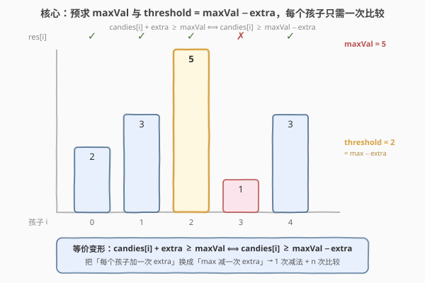
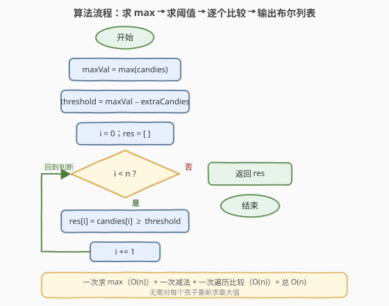

# LeetCode 拥有最多糖果的孩子 题解

## 1. 题目概述

- **标题 / 题号**：拥有最多糖果的孩子（#1431，easy）
- **链接**：https://leetcode.cn/problems/kids-with-the-greatest-number-of-candies/
- **难度**：简单
- **标签**：数组、模拟、预处理最大值

**题意**：有 `n` 个孩子，第 `i` 个孩子拥有 `candies[i]` 颗糖果。另有整数 `extraCandies` 表示你手里的额外糖果。对于每个孩子，判断：**若把全部 `extraCandies` 都给他**，他是否拥有**不少于**任何其他孩子的糖果数（即「拥有最多糖果的孩子」之一，并列最多也算）。返回一个长度为 `n` 的布尔列表 `answer`，`answer[i] = true` 表示第 `i` 个孩子给糖后能成为最多。

> ⚠️ 注意是「**最多之一**」而非「严格最多」：只要给糖后 $\ge$ 其他人（即 $\ge$ 原数组的最大值）就算 `true`，因此用 $\ge$ 而非 $>$。另外，给某个孩子额外糖后，**其他孩子的糖果数不变**。

**示例 1**：

```text
输入：candies = [2,3,5,1,3], extraCandies = 3
输出：[true,true,true,false,true]
解释：
孩子 0：2 + 3 = 5 ≥ max(5) → true
孩子 1：3 + 3 = 6 ≥ 5      → true
孩子 2：5 + 3 = 8 ≥ 5      → true
孩子 3：1 + 3 = 4 < 5      → false
孩子 4：3 + 3 = 6 ≥ 5      → true
```

**示例 2**：

```text
输入：candies = [4,2,1,1,2], extraCandies = 1
输出：[true,false,false,false,false]
解释：max = 4。仅孩子 0 满足 4 + 1 = 5 ≥ 4；其余孩子 +1 后仍 < 4。
```

**示例 3**：

```text
输入：candies = [12,1,12], extraCandies = 10
输出：[true,false,true]
解释：max = 12。孩子 0：22 ≥ 12 → true；孩子 1：11 < 12 → false；孩子 2：22 ≥ 12 → true。
```

**约束**：

- $n = \text{candies.length}$
- $2 \le n \le 100$
- $1 \le \text{candies}[i] \le 100$
- $1 \le \text{extraCandies} \le 50$

> 💡 **关键点**：给某个孩子加糖后，**其他孩子不变**，所以要超越的「标杆」始终是原数组的最大值 $\max(\text{candies})$——它不会因为给糖而改变。于是判定可化简为 $\text{candies}[i] + \text{extraCandies} \ge \max$，再把 `extraCandies` 移到右边一次，得到阈值 $\text{candies}[i] \ge \max - \text{extraCandies}$。

## 2. 解题思路

### 2.1 暴力思路：每个孩子单独判定时重新求最大

最直观的做法：对每个孩子 `i`，先算出 `candies[i] + extraCandies`，再**重新遍历整个数组**看是否 $\ge$ 所有其他孩子（或每次重新求一次最大值），据此填 `answer[i]`。

- **正确**：枚举每个孩子并逐一比对，必然覆盖正确结论。
- **低效**：每个孩子都要 $O(n)$ 重算/比对，$n$ 个孩子合计 $O(n^2)$。本题 $n \le 100$，约 $10^4$ 次操作毫无压力，但完全没利用「标杆不变」这一结构。

> ⚠️ 暴力的浪费在于「**对每个孩子重复求最大值**」。其实无论把糖给谁，要超越的最大值始终是 $\max(\text{candies})$——这个值在所有孩子的判定里是**同一个常数**，求一次就够。

### 2.2 核心观察：max 不变 + 阈值预处理



两步观察把 $O(n^2)$ 压成 $O(n)$：

**观察一（max 不变）**：把 `extraCandies` 给孩子 `i` 后，只有第 `i` 个值变大，其余值不动；所以「能否成为最多」等价于

$$\text{candies}[i] + \text{extraCandies} \ge \max(\text{candies})$$

右侧的 $\max(\text{candies})$ 是原数组最大值，与 `i` 无关，**只需在开始时求一次**。

**观察二（阈值等价）**：把 `extraCandies` 移到右边（两边同时减去一个常数不改变不等号方向）：

$$\text{candies}[i] \ge \underbrace{\max(\text{candies}) - \text{extraCandies}}_{\text{threshold}}$$

于是只需求一次 `maxVal`、做一次减法得到 `threshold`，随后每个孩子**只做一次比较** `candies[i] >= threshold`。原本「每个孩子加一次 `extraCandies` 再比 `max`」（$n$ 次加法 + $n$ 次比较）变成「`max` 减一次 `extraCandies` + $n$ 次比较」。

> 💡 **一句话**：识别出「标杆 $\max$ 是常数」⟹ 预求一次；再用等价变形把「逐元素加 `extra`」转成「`max` 减一次 `extra`」⟹ 阈值法。这是「**预处理不变量 + 不等式移项**」的最朴素范例。

> ⚠️ 本题数值范围极小（$\le 100$），`candies[i] + extraCandies` 不会溢出，两种写法都安全。但当 `candies[i]`、`extraCandies` 接近 `INT_MAX` 时，阈值法 `candies[i] >= maxVal - extraCandies` **天然规避加法溢出**——这是它比「先加再比」更稳健的工程价值。

### 2.3 算法流程图



**完整步骤**：

1. **求最大值** `maxVal = max(candies)`（一次遍历，$O(n)$）；
2. **求阈值** `threshold = maxVal - extraCandies`（$O(1)$）；
3. **初始化** `res = []`，遍历 `i` 从 `0` 到 `n-1`：
   - `res[i] = (candies[i] >= threshold)`；
4. **返回** `res`。

> 💡 也可在求 `maxVal` 的同一趟循环里顺便填 `res`——先扫一遍拿到 `maxVal`，再扫一遍填布尔值，仍是两趟 $O(n)$；或先求 `maxVal` 再单趟填 `res`。无论哪种，整体 $O(n)$。

### 2.4 示例演算

以示例 1 的 `candies = [2,3,5,1,3]`、`extraCandies = 3` 为例：

![示例演算：candies = [2,3,5,1,3]，extraCandies = 3](../images/1431_example_walkthrough.svg)

| $i$ | $\text{candies}[i]$ | $\ge$ 阈值 2 ? | $\text{candies}[i]+3$ | $\ge$ maxVal 5 ? | $\text{res}[i]$ |
|-----|---------------------|----------------|------------------------|-------------------|------------------|
| 0 | 2 | ✓ | 5 | ✓ | true |
| 1 | 3 | ✓ | 6 | ✓ | true |
| 2 | 5 | ✓ | 8 | ✓ | true |
| 3 | 1 | ✗ | 4 | ✗ | false |
| 4 | 3 | ✓ | 6 | ✓ | true |

- **第 ① 步**：`maxVal = 5`（孩子 2 是原数组最大）。
- **第 ② 步**：`threshold = 5 - 3 = 2`。
- **第 ③ 步**：逐个比较 `candies[i] >= 2`。孩子 3 的 `1 < 2`，是唯一不满足的；即便给它全部 3 颗也只到 4，仍 $< 5$。

> 以示例 2 `[4,2,1,1,2]`、`extra=1` 为例：`maxVal=4`，`threshold=3`。仅孩子 0 的 `4 >= 3` ⟹ `true`，其余 `2,1,1,2` 均 $<3$ ⟹ 全 `false`，结果 `[true,false,false,false,false]` ✓。示例 3 `[12,1,12]`、`extra=10`：`threshold=2`，`12>=2`（孩子 0、2）→ `true`，`1<2`（孩子 1）→ `false` ✓。

## 3. 参考代码

### C++

```cpp
class Solution {
public:
    vector<bool> kidsWithCandies(vector<int>& candies, int extraCandies) {
        int maxVal = *max_element(candies.begin(), candies.end());
        int threshold = maxVal - extraCandies;
        vector<bool> res;
        res.reserve(candies.size());
        for (int c : candies) {
            res.push_back(c >= threshold);
        }
        return res;
    }
};
```

### Python

```python
class Solution:
    def kidsWithCandies(self, candies: List[int], extraCandies: int) -> List[bool]:
        max_val = max(candies)
        threshold = max_val - extraCandies
        return [c >= threshold for c in candies]
```

> 💡 **实现要点**：① 用 `*max_element` / `max()` 一次拿到 `maxVal`，不必手写循环。② 阈值 `threshold = maxVal - extraCandies` 只算一次，循环内只做一次比较 `c >= threshold`，**不做加法**。③ C++ 返回 `vector<bool>` 注意它按位压缩，`reserve` + `push_back` 即可；Python 用列表推导一行解决。

## 4. 复杂度分析

| 维度 | 阈值预处理 $O(n)$（推荐） | 暴力逐个重算 $O(n^2)$ |
|------|--------------------------|------------------------|
| **时间复杂度** | $O(n)$ | $O(n^2)$ |
| **空间复杂度** | $O(1)$（不含返回的 `res`） | $O(1)$（不含返回的 `res`） |
| **是否求最大值** | 全程一次 | 每个孩子一次（或每次全量比对） |
| **每元素操作** | 一次比较 | 一次加法 + 一次比较（或 $O(n)$ 比对） |
| **溢出风险** | 无（只做减法/比较） | 加法可能溢出（大数据时） |

- **阈值预处理**：求 `maxVal` 一趟 $O(n)$，求阈值 $O(1)$，填 `res` 一趟 $O(n)$，合计 $O(n)$；额外只用 `maxVal`、`threshold` 两个变量，空间 $O(1)$（输出数组按题意不计）。是本题的最优解。
- **暴力逐个重算**：$n$ 个孩子每个 $O(n)$ 比对，合计 $O(n^2)$；$n \le 100$ 时约 $10^4$ 次操作，毫秒级通过，但未识别「max 是常数」这一结构，理论劣于阈值法。

> ⚠️ 本题 $n \le 100$，两种方法都能过。面试中写出阈值版即体现对「不变量提取 + 不等式移项」的把握——这是把 $O(n^2)$ 降到 $O(n)$ 的通用思路。

## 5. 扩展：$\ge$ 还是 $>$，以及「阈值法」的来源

### 5.1 并列最多为什么用 $\ge$

题目原文是「拥有**最多**糖果的孩子」，并明确「there can be multiple kids with the greatest number of candies」。即允许**并列最多**：给糖后只要 $\ge$ 原最大值就算成功，故用 $\ge$。若误用 $>$（严格大于），示例 1 的孩子 0 会因 `5 > 5` 不成立而错判为 `false`，与答案矛盾。

> 💡 判定「成为最大值之一」用 $\ge$，「成为唯一最大值」才用 $>$。这是审题细节，面试时值得主动澄清。

### 5.2 等价变形的代数本质

阈值法来自一个平凡但通用的等价变形：对任意常数 $k$，

$$a + k \ge m \iff a \ge m - k$$

减去常数不改变不等号方向。它把「**逐元素加 $k$ 再与 $m$ 比**」转换为「**$m$ 减一次 $k$ 得阈值，逐元素与阈值比**」——把 $n$ 次加法压成 1 次减法。该手法在求最值/计数的预处理题中反复出现：把「动态改变每个元素」化归为「静态调整一次标杆」。

> ⚠️ 减法 `$m - k$` 要求 $m \ge k$ 时阈值为非负，但即便 $m < k$（本题不会，因 `extraCandies` 可大于 `maxVal`）阈值变负，所有 `candies[i] >= 负数` 恒真，结论「人人 true」也正确——代数等价性保证无论阈值符号如何，结果一致。

### 5.3 一趟合一写法

求 `maxVal` 与填 `res` 也可合一为单趟（两次遍历的紧凑写法）：

```python
class Solution:
    def kidsWithCandies(self, candies: List[int], extraCandies: int) -> List[bool]:
        threshold = max(candies) - extraCandies
        return [c >= threshold for c in candies]
```

> 💡 Python 的 `max(candies)` 内部已是一趟 $O(n)$，再接列表推导一趟 $O(n)$，共两趟；逻辑等价于 C++ 版。无需为「单趟」强行把求 max 与填 res 揉进一个显式循环——可读性优先。

## 6. 面试要点

1. **如何想到从 $O(n^2)$ 优化到 $O(n)$？**

   > 观察给糖后的格局：只有被给糖的孩子变大，其余不变 ⟹ 要超越的「最大值」始终是原数组的 $\max(\text{candies})$，与 `i` 无关。一旦识别出这个**不变量**，就把「每个孩子重算最大值」压缩成「全局求一次最大值」，从 $O(n^2)$ 降到 $O(n)$。

2. **阈值 `threshold = maxVal - extraCandies` 是怎么来的，为什么等价？**

   > 由不等式 `candies[i] + extraCandies >= maxVal` 两边同时减去 `extraCandies` 得 `candies[i] >= maxVal - extraCandies`。减常数不改变不等号方向，故两式等价。它把「逐元素加 extra 再比 max」换成「max 减一次 extra 得阈值，逐元素比阈值」，省掉 $n$ 次加法。

3. **为什么用 $\ge$ 而不是 $>$？**

   > 题目允许「并列最多」——给糖后达到原最大值就算成功。示例 1 的孩子 0 恰好 `2+3=5 == max`，需判 `true`，故必须 $\ge$。面试时应主动确认「最大值之一」还是「唯一最大」，避免审题失误。

4. **阈值法相比「先加再比」有何工程价值？**

   > 一是常数更优：$n$ 次加法压成 1 次减法。二是抗溢出：当 `candies[i]`、`extraCandies` 接近 `INT_MAX` 时，`candies[i] + extraCandies` 可能溢出，而 `maxVal - extraCandies` 与 `candies[i] >= threshold` 只做减法/比较，无加法溢出风险。本题范围小不体现，但这是大数场景下的稳健写法。

5. **如果不只给一个孩子，而是把 `extraCandies` 分给多个孩子呢？**

   > 那是另一道题（分配型/贪心）。本题关键是 `extraCandies` **全部给某一个孩子**——每个孩子的判定互相独立，且都基于同一个不变的 $\max$。一旦分配可拆分，独立判定前提失效，需重新建模。面试遇到可主动澄清「是否必须全部给一个人」。

> 💡 **一句话总结**：1431 的灵魂是「**标杆 $\max$ 是常数**」——预求一次 `maxVal`，再用不等式移项得阈值 `maxVal - extraCandies`，每个孩子一次比较即可，$O(n)$ 时间、$O(1)$ 额外空间。

## 同类练习题

| # | 题目 | 与本题的关联 |
|---|------|-------------|
| 747 | [至少是其他数字两倍的最大数](../0701-0800/747_至少是其他数字两倍的最大数.md) | 最佳镜像题，同款「先求 max 再比较」——找到最大值后判定它是否 $\ge$ 次大值的 2 倍，预处理最值再逐元素比较的范式与 1431 同源 |
| 1365 | [有多少小于当前数字的数字](../1301-1400/1365_有多少小于当前数字的数字.md) | 预处理一个结构（值域计数）后对每个元素 $O(1)$ 回答，与 1431「预求 max 后对每个元素 $O(1)$ 判定」同属「预处理 + 逐元素查询」范式 |
| 414 | [第三大的数](../0401-0500/414_第三大的数.md) | 求最值家族，需维护前三大值，对照 1431 只需第一大（max）的简化情形，理解求最值的边界处理 |
| 628 | [三个数的最大乘积](../0601-0700/628_三个数的最大乘积.md) | 用数组中的最大/最小值做决策（三最大或两最小乘一最大），对照 1431 直接用单一 max 做判定，体会「最值驱动决策」的不同形态 |
