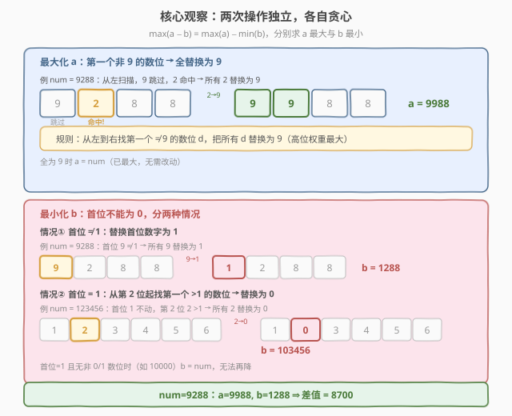
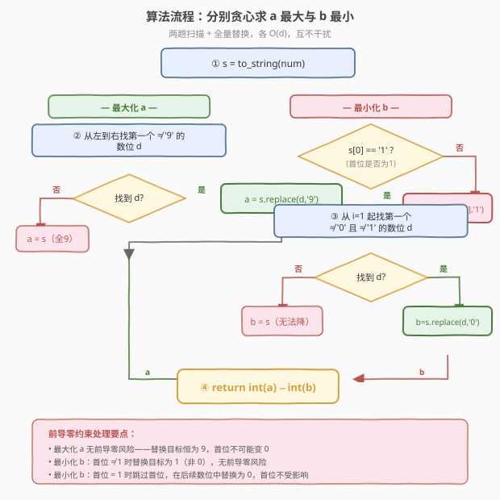
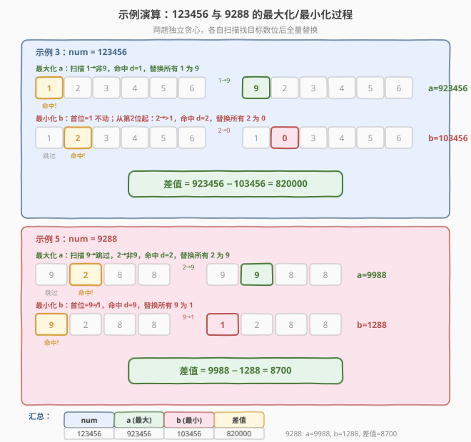

# 改变一个整数能得到的最大差值

- **题目名称**：改变一个整数能得到的最大差值
- **链接**：[1432. 改变一个整数能得到的最大差值](https://leetcode.cn/problems/max-difference-you-can-get-from-changing-an-integer/)
- **难度**：中等
- **标签**：贪心、数学、字符串

## 1. 题目概述

给你一个整数 `num`。你可以对它进行以下操作共计**两次**：

- 选择一个数字 `x (0 <= x <= 9)`。
- 选择另一个数字 `y (0 <= y <= 9)`，`y` 可以等于 `x`。
- 将 `num` 中所有出现 `x` 的数位都用 `y` 替换。

令两次操作得到的结果分别为 `a` 和 `b`。请你返回 `a` 和 `b` 的**最大差值**。

注意，`a` 和 `b` **必须不能**含有前导 0，并且**不为** 0。

**示例 1**：

```text
输入：num = 555
输出：888
解释：第一次选 x=5, y=9，得 a=999；第二次选 x=5, y=1，得 b=111。
最大差值 = 999 − 111 = 888。
```

**示例 2**：

```text
输入：num = 9
输出：8
解释：第一次选 x=9, y=9，得 a=9；第二次选 x=9, y=1，得 b=1。
最大差值 = 9 − 1 = 8。
```

**示例 3**：

```text
输入：num = 123456
输出：820000
```

**示例 4**：

```text
输入：num = 10000
输出：80000
```

**示例 5**：

```text
输入：num = 9288
输出：8700
```

**约束条件**：

- $1 \le \text{num} \le 10^{8}$

> 💡 本题两次操作互相独立，要最大化 $a - b$，只需**各自贪心**：让 $a$ 尽量大、让 $b$ 尽量小。关键在于操作是「替换所有相同数位」，且 $b$ 不能有前导零——这一约束使最小化策略需分首位的两种情况讨论。

---

## 2. 解题思路

### 2.1 暴力思路：枚举所有替换对

对原数 `num` 的每一位数字 $x$ 和目标数字 $y$（$0 \le y \le 9$），执行替换得到一个新数。两次操作各从这些候选中取一个作为 $a$ 和 $b$，枚举所有 $(a, b)$ 组合求最大 $a - b$。

一个 $d$ 位数最多有 $10$ 种不同数位值，每种可替换为 $10$ 种目标，故候选集规模 $O(10 \times 10) = O(100)$，两两组合 $O(100^2) = O(10^4)$。$d \le 8$ 时完全可以暴力通过，但思路未提炼出「最大化」与「最小化」各自的最优结构，且前导零过滤容易遗漏。

> ⚠️ 暴力的真正陷阱在于**前导零判定**：若替换后首位变 0，该候选非法，必须跳过。枚举时需逐一校验，稍有不慎就会出错。

### 2.2 核心观察：两次操作独立，各自贪心



由于两次操作互不影响（各自从原始 `num` 出发），最大化 $a - b$ 等价于**分别求 $a$ 的最大值与 $b$ 的最小值**，再相减。

**最大化 $a$（让数尽量大）**：

- 高位的改动收益远大于低位——把第 $k$ 位的数字 $d$ 改成 9，增量 $= (9 - d) \times 10^{k}$，$k$ 越大增量越大。
- 操作替换**所有**相同数位，所以只需找**从左到右第一个不为 9 的数位** $d$，把所有 $d$ 替换为 9。这样最高位的非 9 数位被提升到 9，收益最大。
- 若所有数位都是 9，则 $a = \text{num}$（已最大，无需改动）。

**最小化 $b$（让数尽量小，但不能有前导零）**：

这里需分首位是否为 1 两种情况，因为首位不能变成 0：

| 首位情况 | 策略 | 替换目标 | 原因 |
|----------|------|----------|------|
| 首位 $\ne 1$ | 替换首位数字为 **1** | 所有首位数字 → 1 | 首位最小可取 1（不能取 0），把首位及所有相同数位降到 1，高位降幅最大 |
| 首位 $= 1$ | 从第 2 位起找第一个**既非 0 又非 1** 的数位 $d$，替换为 **0** | 所有 $d$ → 0 | 首位已是 1（最小非零），无法再降；从次高位起把第一个 $> 1$ 的数位降到 0，次高位降幅最大 |

> ⚠️ **首位为 1 时为何替换第一个 $>1$ 的数位而非任意数位？** 因为高位权重大：把次高位的可降数位降到 0，比把更低位的数位降到 0 收益更大。例如 `1929`：替换 9→0 得 `1020`，而替换 2→0 得 `1909`，显然 `1020 < 1909`。扫描时从左到右遇到的第一个 $>1$ 数位即是次高位中可降的最左位置，替换它最优。

> 💡 **首位为 1 且找不到 $>1$ 的数位时**（如 `10000`、`1110`），说明所有非首位数位都是 0 或 1，已无法降低（0 不能再降，1 降为 0 虽可行但首位也是 1 会被连带降为 0 导致前导零），故 $b = \text{num}$。

### 2.3 算法流程图



**完整步骤**（字符串视角）：

1. 将 `num` 转为字符串 `s`。
2. **求 $a$（最大化）**：从左到右扫描 `s`，找第一个不为 `'9'` 的字符 $d$。若找到，把 `s` 中所有 $d$ 替换为 `'9'`；若全是 `'9'`，$a = s$。
3. **求 $b$（最小化）**：
   - 若 $s[0] \ne $ `'1'`：把 `s` 中所有 $s[0]$ 替换为 `'1'`，得 $b$。
   - 若 $s[0] = $ `'1'`：从 $i = 1$ 起扫描，找第一个既非 `'0'` 又非 `'1'` 的字符 $d$。若找到，把 `s` 中所有 $d$ 替换为 `'0'`；若未找到，$b = s$。
4. 返回 $\text{int}(a) - \text{int}(b)$。

> 💡 **实现技巧**：① 替换「所有相同数位」用 `replace(old, new)` 一步到位（Python）或遍历替换（C++）。② 求 $a$ 和求 $b$ 各自只需一趟扫描找目标数位 + 一次全量替换，互不干扰。③ 注意求 $b$ 时**从原串 `s` 出发**重新替换，不要在 $a$ 的结果上操作。

### 2.4 示例演算

以 `num = 123456` 和 `num = 9288` 为例，展示两个贪心方向的完整推演：



**示例 3：num = 123456**

| 方向 | 扫描过程 | 目标数位 $d$ | 替换 | 结果 |
|------|----------|-------------|------|------|
| 最大化 $a$ | 1→非9，命中 | $d = 1$ | 所有 1→9 | $a = 923456$ |
| 最小化 $b$ | 首位=1；从第 2 位起：2→既非0又非1，命中 | $d = 2$ | 所有 2→0 | $b = 103456$ |

差值 $= 923456 - 103456 = 820000$。✓

**示例 5：num = 9288**

| 方向 | 扫描过程 | 目标数位 $d$ | 替换 | 结果 |
|------|----------|-------------|------|------|
| 最大化 $a$ | 9→跳过，2→非9，命中 | $d = 2$ | 所有 2→9 | $a = 9988$ |
| 最小化 $b$ | 首位=9≠1，命中 | $d = 9$ | 所有 9→1 | $b = 1288$ |

差值 $= 9988 - 1288 = 8700$。✓

**示例 4：num = 10000（首位为 1 的边界）**

| 方向 | 扫描过程 | 目标数位 $d$ | 替换 | 结果 |
|------|----------|-------------|------|------|
| 最大化 $a$ | 1→非9，命中 | $d = 1$ | 所有 1→9 | $a = 90000$ |
| 最小化 $b$ | 首位=1；从第 2 位起：全为 0，未命中 | 无 | 不替换 | $b = 10000$ |

差值 $= 90000 - 10000 = 80000$。✓

---

## 3. 参考代码

### C++

```cpp
// 改变一个整数能得到的最大差值.cpp —— 贪心：分别最大化 a 与最小化 b
// 编译: g++ -O2 -std=c++17 改变一个整数能得到的最大差值.cpp -o maxdiff
class Solution {
public:
    int maxDiff(int num) {
        string s = to_string(num);

        // —— 最大化 a：第一个非 '9' 的数位 → 全替换为 '9' ——
        string a = s;
        for (int i = 0; i < (int)a.size(); ++i) {
            if (a[i] != '9') {
                char d = a[i];
                for (char& c : a) if (c == d) c = '9';
                break;
            }
        }

        // —— 最小化 b：首位 != '1' → 首位数字全替换为 '1'；
        //    首位 == '1' → 从第 2 位起找第一个非 '0'/'1' 的数位，全替换为 '0' ——
        string b = s;
        if (b[0] != '1') {
            char d = b[0];
            for (char& c : b) if (c == d) c = '1';
        } else {
            for (int i = 1; i < (int)b.size(); ++i) {
                if (b[i] != '0' && b[i] != '1') {
                    char d = b[i];
                    for (char& c : b) if (c == d) c = '0';
                    break;
                }
            }
        }

        return stoi(a) - stoi(b);
    }
};
```

### Python

```python
class Solution:
    def maxDiff(self, num: int) -> int:
        s = str(num)

        # —— 最大化 a：第一个非 '9' 的数位 → 全替换为 '9' ——
        a = s
        for c in s:
            if c != '9':
                a = s.replace(c, '9')
                break

        # —— 最小化 b ——
        b = s
        if s[0] != '1':
            b = s.replace(s[0], '1')
        else:
            for c in s[1:]:
                if c not in '01':
                    b = s.replace(c, '0')
                    break

        return int(a) - int(b)
```

> 💡 **实现细节**：① Python 的 `str.replace(old, new)` 默认替换**所有**匹配，天然对应题目「所有相同数位都替换」的语义，一行搞定。② C++ 没有全量 replace 字符的便捷方法，用手写 `for (char& c : s) if (c == d) c = '9'` 遍历替换。③ 求 `a` 和 `b` 都从原始 `s` 出发，互不干扰——不要在 `a` 的结果上求 `b`。④ `break` 保证只替换第一个找到的目标数位（而非多个不同数位），符合「一次操作只选一个 $x$」的题意。

---

## 4. 复杂度分析

| 维度 | 复杂度 | 说明 |
|------|--------|------|
| **时间** | $O(d)$ | $d = \lfloor \log_{10} \text{num} \rfloor + 1$ 为数字位数（$d \le 8$）。求 $a$：一趟扫描 + 一次全量替换，各 $O(d)$。求 $b$：同理 $O(d)$。总计 $O(d)$ |
| **空间** | $O(d)$ | 存放字符串 `s`、`a`、`b`，各 $O(d)$；$d \le 8$，实际常数级 |
| **思路** | 贪心 | 两次操作独立 ⇒ 分别贪心。最大化改最高位非 9 数位为 9；最小化按首位是否为 1 分两情况，高位优先降到最低合法值 |

> ⚠️ **对比暴力**：暴力枚举所有替换对是 $O(d \times 10 \times 10)$ 候选 + 两两配对 $O(10^4)$，$d \le 8$ 时虽也能过，但贪心将问题拆解为两个独立的一趟扫描，逻辑清晰且常数更小，还能自然处理前导零约束。

---

## 5. 扩展：为何最小化时首位为 1 要特殊处理

最小化 $b$ 的核心矛盾是：**想让数尽量小，但首位不能为 0**。

- **首位 $\ne 1$ 时**：直接把首位数字替换为 1（最小合法首位）。此时替换目标是 1 而非 0，绝不会产生前导零。例如 `555` → `111`、`9288` → `1288`。
- **首位 $= 1$ 时**：首位已是 1，无法再降。若把首位 1 替换为 0 则前导零非法。故只能从次高位入手，把某个 $> 1$ 的数位替换为 0。例如 `123456` → 把 2 替换为 0 → `103456`。
- **首位 $= 1$ 且无非 0/1 数位时**（如 `10000`、`1111`）：所有数位都是 0 或 1。把 0 替换为 0 无意义；把 1 替换为 0 会使首位变 0（非法）。故 $b = \text{num}$，无法再降。

> 💡 也可统一理解：**最小化时，替换目标为 0 是最优（降幅最大），但首位所在数位不能替换为 0**。因此当首位数字就是想要替换为 0 的那个数位时，改用 1 作为替换目标；若首位已是 1，则跳过首位，在后续数位中寻找替换为 0 的机会。

---

## 6. 面试要点

1. **为什么两次操作可以独立贪心？**

   > 两次操作都从原始 `num` 出发，互不影响（题目说「对它进行以下操作两次」，每次独立替换）。因此 $\max(a - b) = \max(a) - \min(b)$，可分别贪心求 $a$ 的最大值和 $b$ 的最小值，无需联合枚举。

2. **最大化 $a$ 时为什么替换第一个非 9 数位？**

   > 把第 $k$ 位（从右起 0 索引）的 $d$ 改成 9，增量 $= (9 - d) \times 10^{k}$。$k$ 越大增量越大，故优先改最高位（最左）。若最高位已是 9，跳过找次高位。第一个非 9 数位即位权最高的可提升位置，替换它（及所有相同数位）收益最大。

3. **最小化 $b$ 时为什么要分首位是否为 1 讨论？**

   > 首位不能为 0（前导零约束）。首位 $\ne 1$ 时，把首位数字替换为 1（最小合法首位）即可，不涉及前导零。首位 $= 1$ 时，首位已是 1 无法再降，只能从次高位找可降为 0 的数位。两种情况替换目标不同（1 vs 0），故需分支。

4. **首位为 1 时，为什么替换第一个 $>1$ 的数位而非任意 $>1$ 的数位？**

   > 高位权重最大。把次高位的 $d$ 降为 0，减量 $= d \times 10^{k}$，$k$ 越大减量越大。从左到右第一个 $>1$ 的数位即次高位中可降的最左位置，替换它（及所有相同数位）使数降幅最大。例如 `1929`：替换 9→0 得 `1020`，比替换 2→0 得 `1909` 更小。

5. **所有数位都是 9 时 $a$ 怎么办？首位为 1 且全为 0/1 时 $b$ 怎么办？**

   > 全为 9：$a = \text{num}$，已是最大值，替换 9→9 是 no-op。首位为 1 且后续全为 0/1：$b = \text{num}$，无法再降（1→0 导致前导零，0→0 无意义）。两种边界都不需特殊代码——扫描不命中目标数位时自然返回原串。

> 💡 **一句话总结**：1432 是「分治贪心」的招牌题——两次操作独立，各自一趟扫描找最高位可改数位替换到极值（$a$→9，$b$→0 或 1），前导零约束使 $b$ 的最小化需按首位是否为 1 分支，$O(d)/O(d)$ 一趟搞定。

---

## 7. 同类练习题

- [1323. 6 和 9 组成的最大数字](https://leetcode.cn/problems/maximum-69-number/)（[题解](../1301-1400/1323_6和9组成的最大数字.md)）：把最左 6 改成 9 最大化数字，是本题「最大化 $a$」的单操作退化版（只改一位、只涉及 6/9），巩固高位优先贪心
- [7. 整数反转](https://leetcode.cn/problems/reverse-integer/)：逐位取余 + 重新累加位权，与本题按位拆解数字的思路同源，是位权操作的基础模板
- [9. 回文数](https://leetcode.cn/problems/palindrome-number/)（[题解](../0001-0100/9_回文数.md)）：反转一半数字判回文，同为「按位拆解整数」的数学题，练位权与取余技巧
- [168. Excel表列名称](https://leetcode.cn/problems/excel-sheet-column-title/)（[题解](../0101-0200/168_Excel表列名称.md)）：1-indexed 进制转换（先减 1 再取余），与本题同为「字符串 ↔ 数值」转换家族，巩固数位映射思维
- [507. 完美数](https://leetcode.cn/problems/perfect-number/)：数学枚举因数求和判定，虽套路不同但同为小规模数学模拟题，练整数拆解与边界处理
