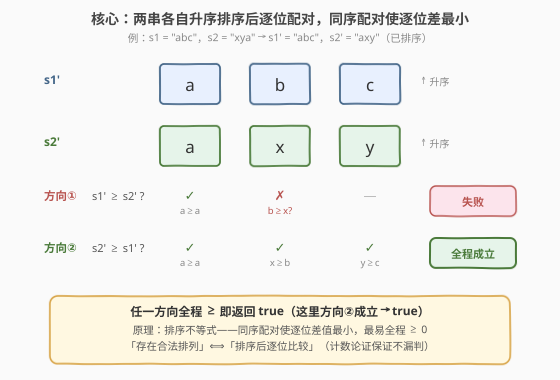
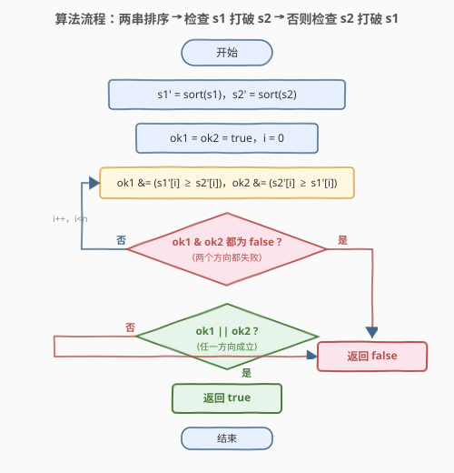
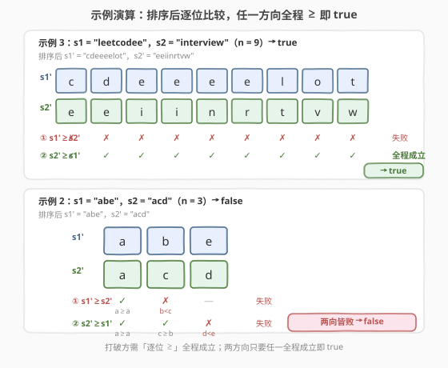

# LeetCode 检查一个字符串是否可以打破另一个字符串 题解

## 1. 题目概述

- **标题 / 题号**：检查一个字符串是否可以打破另一个字符串（#1433，medium）
- **链接**：https://leetcode.cn/problems/check-if-a-string-can-break-another-string/
- **难度**：中等
- **标签**：贪心、字符串、排序

**题意**：给你两个**长度相等**的字符串 `s1` 和 `s2`，检查是否存在 `s1` 的某个排列可以打破 `s2` 的某个排列，或者 `s2` 的某个排列可以打破 `s1` 的某个排列。

字符串 `x` 可以打破字符串 `y`（长度均为 $n$）需满足：对所有 $i \in [0, n-1]$ 都有 $x[i] \ge y[i]$（字典序意义下的顺序）。

**示例 1**：

```text
输入：s1 = "abc", s2 = "xya"
输出：true
解释："ayx" 是 s2 的一个排列，"abc" 是 s1 的一个排列，且 "ayx" 打破 "abc"：
     a >= a, y >= b, x >= c，逐位成立。
```

**示例 2**：

```text
输入：s1 = "abe", s2 = "acd"
输出：false
解释：s1 的排列有 "abe","aeb","bae",...；s2 的排列有 "acd","adc","cad",...
     没有任何 s1 的排列能打破 s2 的排列，也没有任何 s2 的排列能打破 s1 的排列。
```

**示例 3**：

```text
输入：s1 = "leetcodee", s2 = "interview"
输出：true
解释：两串各自排序得 s1'="cdeeeelot"，s2'="eeiinrtvw"，
     s2' 逐位 >= s1'：e>=c, e>=d, i>=e, i>=e, n>=e, r>=e, t>=l, v>=o, w>=t ✓
```

**约束**：

- $\text{s1.length} = \text{s2.length} = n$
- $1 \le n \le 10^5$
- 字符串只包含小写英文字母。

> 💡 **关键点**：题目问的是「**存在性**」——是否*存在*一对排列使打破关系成立。排列总数是 $n!$，枚举不可能。但「能否打破」只取决于两串的**字符多重集**（与顺序无关）——排序后逐位比较即可判定，把 $n!$ 的搜索压成 $O(n \log n)$。

## 2. 解题思路

### 2.1 暴力思路：枚举所有排列对

最直观的做法：生成 `s1` 的全部 $n!$ 个排列与 `s2` 的全部 $n!$ 个排列，对每对 $(p_1, p_2)$ 检查 $p_1$ 打破 $p_2$ 或 $p_2$ 打破 $p_1$。

- **正确但完全不可行**：$n = 10^5$ 时排列数是天文数字；
- **未利用结构**：打破关系 $x[i] \ge y[i]$ 是**逐位**的，只关心「能否配对」而非「具体哪种排列」。

> ⚠️ 暴力的盲点在于「**逐位比较**」与「**可任意重排**」叠加后，问题等价于「能否把两组字符配对使一组逐位不小于另一组」——这正是**排序 + 逐位匹配**的经典信号。

### 2.2 核心观察：排序后逐位比较即最优配对



**关键洞察**：把 `s1`、`s2` 各自升序排序，得到 `s1'`、`s2'`。则：

- `s1` 存在排列打破 `s2` 的某排列 $\iff$ $s1'[i] \ge s2'[i]$ 对所有 $i$ 成立；
- `s2` 存在排列打破 `s1` 的某排列 $\iff$ $s2'[i] \ge s1'[i]$ 对所有 $i$ 成立。

只要**任一方向全程成立**，即返回 `true`。

> 💡 **为什么排序配对最优？** 直觉：要让 `x` 打破 `y`，应把 `x` 中较小的字符去匹配 `y` 中较小的字符，把大的留给大的——「**同序配对**」最不容易出现「小对大」的破绽。这本质是**排序不等式 / 重排不等式**（rearrangement inequality）：两组数同序配对时逐位差值最小，最可能全程 $\ge 0$。

> ⚠️ **严格证明（计数论证）**：`x` 能打破 `y`（经排列）$\iff$ 对任意阈值 $t$，`x` 中 $\ge t$ 的字符数 $\ge$ `y` 中 $\ge t$ 的字符数。这等价于排序后 $x'[i] \ge y'[i]$ 对所有 $i$ 成立（详见第 5 节）。因此「存在排列」与「排序后逐位比较」完全等价，不会漏判。

### 2.3 算法流程图



**完整步骤**：

1. **排序**：`s1' = sort(s1)`，`s2' = sort(s2)`（升序）；
2. **方向一**：遍历 $i \in [0, n-1]$，若有任意 $s1'[i] < s2'[i]$，则 `s1 打破 s2` 不成立；
3. **方向二**：遍历 $i \in [0, n-1]$，若有任意 $s2'[i] < s1'[i]$，则 `s2 打破 s1` 不成立；
4. **返回**：两个方向任一全程成立则 `true`，否则 `false`。

> 💡 两个方向的检查可合并为**一趟**：维护两个布尔 `ok1 = true, ok2 = true`，遍历中 `ok1 &= (s1'[i] >= s2'[i])`、`ok2 &= (s2'[i] >= s1'[i])`，一旦两个都变 `false` 即提前 `break`。一趟 $O(n)$ 完成双向判定。

### 2.4 示例演算

以示例 3（`s1 = "leetcodee"`，`s2 = "interview"`，$n=9$）与示例 2（`s1 = "abe"`，`s2 = "acd"`，$n=3$）演算：



**示例 3**（$n=9$）：

| $i$ | 0 | 1 | 2 | 3 | 4 | 5 | 6 | 7 | 8 |
|-----|---|---|---|---|---|---|---|---|---|
| `s1'` | c | d | e | e | e | e | l | o | t |
| `s2'` | e | e | i | i | n | r | t | v | w |
| `s1'≥s2'`? | ✗ | ✗ | ✗ | ✗ | ✗ | ✗ | ✗ | ✗ | ✗ |
| `s2'≥s1'`? | ✓ | ✓ | ✓ | ✓ | ✓ | ✓ | ✓ | ✓ | ✓ |

方向二（`s2' ≥ s1'`）全程成立 $\implies$ 返回 `true`。

**示例 2**（$n=3$）：

| $i$ | 0 | 1 | 2 |
|-----|---|---|---|
| `s1'` | a | b | e |
| `s2'` | a | c | d |
| `s1'≥s2'`? | ✓ | ✗(b&lt;c) | — |
| `s2'≥s1'`? | ✓ | ✓ | ✗(d&lt;e) |

方向一在 $i=1$ 失败，方向二在 $i=2$ 失败 $\implies$ 返回 `false`。

> 以示例 1（`s1="abc"`，`s2="xya"`）验证：`s1'="abc"`，`s2'="axy"`。方向一 `s1'≥s2'`：a≥a ✓, b≥x ✗（失败）；方向二 `s2'≥s1'`：a≥a ✓, x≥b ✓, y≥c ✓（全程成立）$\implies$ `true` ✓。

## 3. 参考代码

### C++

```cpp
class Solution {
public:
    bool checkIfCanBreak(string s1, string s2) {
        sort(s1.begin(), s1.end());
        sort(s2.begin(), s2.end());
        int n = s1.size();
        bool ok1 = true, ok2 = true;
        for (int i = 0; i < n; ++i) {
            ok1 = ok1 && (s1[i] >= s2[i]);
            ok2 = ok2 && (s2[i] >= s1[i]);
            if (!ok1 && !ok2) break;   // 两个方向都失败，提前结束
        }
        return ok1 || ok2;
    }
};
```

### Python

```python
class Solution:
    def checkIfCanBreak(self, s1: str, s2: str) -> bool:
        s1 = sorted(s1)
        s2 = sorted(s2)
        ok1 = all(a >= b for a, b in zip(s1, s2))
        ok2 = all(b >= a for a, b in zip(s1, s2))
        return ok1 or ok2
```

> 💡 **实现要点**：① C++ 中 `string` 可直接 `sort`（原地排序），Python 中 `sorted` 返回新列表。② 双向判定合并为一趟：`ok1` 跟踪 `s1≥s2`，`ok2` 跟踪 `s2≥s1`，两者都 `false` 即可 `break`，最坏仍 $O(n)$。③ Python 的 `all(...)` 写法简洁但内部两趟；追求单趟可换成与 C++ 同款的短路循环。

## 4. 复杂度分析

| 维度 | 排序 + 逐位比较 $O(n \log n)$（推荐） | 计数排序 $O(n)$ | 暴力枚举排列 |
|------|--------------------------------------|-----------------|--------------|
| **时间复杂度** | $O(n \log n)$ | $O(n + 26) = O(n)$ | $O((n!)^2 \cdot n)$ |
| **空间复杂度** | $O(\log n)$（排序栈）/ $O(n)$（Python 新串） | $O(1)$（26 长数组） | $O(n)$ |
| **数据规模** | $n \le 10^5$ 毫秒级 | 更快，常数优势 | 不可行 |

- **排序主导**：两趟排序 $O(n \log n)$，逐位比较 $O(n)$，整体 $O(n \log n)$；$n = 10^5$ 时约 $1.7 \times 10^6$ 次比较，毫秒级通过。
- **计数排序优化**：字符只有 26 种，可用频次数组（见第 5 节）将排序降到 $O(n)$，空间 $O(1)$，是理论最优。

> ⚠️ 本题 $n \le 10^5$，$O(n \log n)$ 足够。计数排序版仅在追求极致常数或 $n$ 更大时有意义，面试中写出排序版后主动提及计数优化即可。

## 5. 扩展：排序配对最优性的证明与 O(n) 计数法

### 5.1 排序配对最优性证明

要证：`s1` 存在排列打破 `s2` 的某排列 $\iff$ 排序后 $s1'[i] \ge s2'[i]$ 对所有 $i$ 成立。

**（$\Longleftarrow$）** 若 $s1'[i] \ge s2'[i]$ 全程成立，则排序后的 `s1'` 本身就是打破 `s2'` 的排列，存在性得证。

**（$\Longrightarrow$）** 设 `s1` 有排列 $p$ 打破 `s2` 的排列 $q$，即 $p[i] \ge q[i]$ 对所有 $i$。记 $c_x(\ge t)$ 为串 $x$ 中 $\ge t$ 的字符个数。在任意合法配对中，`s2` 里 $\ge t$ 的每个字符都要配一个 $\ge$ 它的 `s1` 字符，故：

$$c_{s1}(\ge t) \ge c_{s2}(\ge t), \quad \forall\, t$$

这一「**逐阈值计数优势**」与具体排列无关，只取决于字符多重集。而 $c_{s1}(\ge t) \ge c_{s2}(\ge t)$ 对所有 $t$ 成立 $\iff$ 排序后 $s1'[i] \ge s2'[i]$ 对所有 $i$ 成立（取 $t = s2'[i]$：此时 `s2` 至少有 $n-i$ 个字符 $\ge s2'[i]$，故 `s1` 也至少有 $n-i$ 个 $\ge s2'[i]$ 的字符，即 $s1'[i] \ge s2'[i]$）。故排序逐位比较不漏判。$\square$

> 💡 这与 [455. 分发饼干](../0401-0500/455_分发饼干.md)「用尽量小的饼干满足尽量小胃口」、[881. 救生艇](../0801-0900/881_救生艇.md)「最重+最轻配对」同属「**排序后贪心配对**」家族——能用排序消除顺序搜索的，都先排序。

### 5.2 O(n) 计数排序法

字符仅 26 种，用频次数组代替比较排序。由 5.1 节的等价条件，`s1` 打破 `s2` $\iff$ 对每个阈值 $t$，`s1` 中 $\le t$ 的字符数 $\le$ `s2` 中 $\le t$ 的字符数（即「**打破方的小字符更少**」）。遍历 26 个字母累积前缀即可判定，无需构造排序串：

```cpp
class Solution {
public:
    bool checkIfCanBreak(string s1, string s2) {
        int c1[26] = {0}, c2[26] = {0};
        for (char ch : s1) ++c1[ch - 'a'];
        for (char ch : s2) ++c2[ch - 'a'];
        bool ok1 = true, ok2 = true;   // ok1: s1 打破 s2; ok2: s2 打破 s1
        int p1 = 0, p2 = 0;            // 前缀计数：<= 当前字母的字符数
        for (int k = 0; k < 26 && (ok1 || ok2); ++k) {
            p1 += c1[k];
            p2 += c2[k];
            if (p1 > p2) ok1 = false;  // s1 小字符更多 → s1 无法打破 s2
            if (p2 > p1) ok2 = false;  // s2 小字符更多 → s2 无法打破 s1
        }
        return ok1 || ok2;
    }
};
```

> ⚠️ 方向对应容易写反：「$s1 \ge s2$ 逐位」等价于「$s1$ 的小字符**不比** $s2$ **多**」（前缀 $\le$），而非 $\ge$。记住**打破方的小字符更少**——它有更多大字符去压制对方。

> 💡 时间 $O(n + 26) = O(n)$，空间 $O(1)$。这是本题的理论最优解，但 $n \le 10^5$ 时排序版已毫秒级，计数版主要体现对「值域有界 $\to$ 计数排序」这一优化意识的把握。

## 6. 面试要点

1. **怎么想到排序的？**

   > 题目允许「任意排列」，意味着字符顺序无关、只看多重集。一旦识别出「顺序无关 + 逐位比较」，就应想到排序把「配对存在性」化为「同序逐位比较」——这是**排序消除搜索空间**的典型信号，与 455/881 同源。

2. **为什么要检查两个方向？**

   > 题目问「s1 打破 s2 *或* s2 打破 s1」，两个方向不对称：可能只有一方能打破（如示例 3 只有 s2 打破 s1）。故需各检查一次。两者可合并为一趟：同时维护 `ok1`、`ok2`，都失败即停。

3. **排序后逐位比较为什么不会漏判？**

   > 第 5.1 节用计数论证证明：「存在合法排列配对」$\iff$「排序后逐位 $\ge$」。排序配对是**同序配对**，由排序不等式知它使逐位差值最小，最有可能全程 $\ge 0$；若连它都不成立，任何重排都不会更好。

4. **计数排序版的前缀条件为什么是 $\le$ 而不是 $\ge$？**

   > `s1 打破 s2` 要求 $s1'[i] \ge s2'[i]$，等价于「$s1$ 的小字符不能比 $s2$ 多」——即对每个阈值 $t$，$s1$ 中 $\le t$ 的字符数 $\le$ $s2$ 中 $\le t$ 的字符数。故前缀比较用 $\le$。写反会得到相反结论，是常见思维陷阱。

5. **和 455. 分发饼干 有何异同？**

   > 455 是「用饼干满足小孩、最大化满足数」——排序后贪心配对，能配就配，关心**数量**；1433 是「判定能否全程配对」——排序后逐位比较，关心**全程是否成立**。两者都靠排序把配对问题化为线性扫描，但 455 求最大数量、1433 求布尔判定。

> 💡 **一句话总结**：1433 的灵魂是「**排列无关 $\implies$ 排序后逐位比较**」——两串各自升序排序，检查 $s1' \ge s2'$ 全程或 $s2' \ge s1'$ 全程，任一成立即 `true`。排序把 $n!$ 的存在性判定压成 $O(n \log n)$，计数排序可进一步到 $O(n)$。

## 同类练习题

| # | 题目 | 与本题的关联 |
|---|------|-------------|
| 455 | [分发饼干](https://leetcode.cn/problems/assign-cookies/)（[题解](../0401-0500/455_分发饼干.md)） | 排序后贪心配对（小饼干配小胃口）最大化满足数；对照 1433 的「排序后逐位判定全程成立」——同源排序配对，一个求数量一个求布尔 |
| 881 | [救生艇](https://leetcode.cn/problems/boats-to-save-people/)（[题解](../0801-0900/881_救生艇.md)） | 排序后双指针配对（最重+最轻），对照 1433 的「同序逐位配对」——排序配对的两种典型模式 |
| 945 | [使数组唯一的最小增量](https://leetcode.cn/problems/minimum-increment-to-make-array-unique/)（[题解](../0901-1000/945_使数组唯一的最小增量.md)） | 排序后贪心调整使相邻不重复，对照 1433 的「排序后逐位比较」——排序把配对/调整问题线性化 |
| 899 | [有序队列](https://leetcode.cn/problems/orderly-queue/)（[题解](../0801-0900/899_有序队列.md)） | $k \ge 2$ 时任意排列可达 $\implies$ 排序即最优，与 1433 的「排列无关 $\implies$ 排序判定」同构 |
| 56 | [合并区间](https://leetcode.cn/problems/merge-intervals/)（[题解](../0001-0100/56_合并区间.md)） | 排序消除顺序依赖后线性扫描，与 1433 的「排序把存在性问题化为线性判定」思路一致 |
