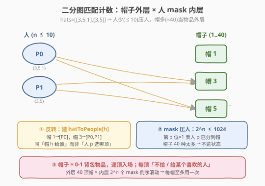
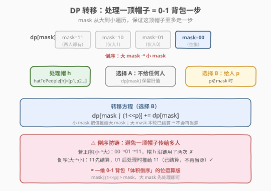

# 每个人戴不同帽子的方案数

- **题目名称**：每个人戴不同帽子的方案数
- **链接**：[1434. 每个人戴不同帽子的方案数](https://leetcode.cn/problems/number-of-ways-to-wear-different-hats-to-each-other/)
- **难度**：困难
- **标签**：动态规划、状态压缩、位运算、计数

## 1. 题目概述

总共有 `n` 个人和 `40` 种不同的帽子，帽子编号从 `1` 到 `40`。给定整数列表的列表 `hats`，其中 `hats[i]` 是第 `i` 个人喜欢的所有帽子。请给每个人安排一顶他喜欢的帽子，确保每个人戴的帽子跟别人都不一样，返回方案数。答案对 $10^9 + 7$ 取余。

**示例 1**：

```text
输入：hats = [[3,4],[4,5],[5]]
输出：1
解释：只有一种方法：人 0 选帽 3，人 1 选帽 4，人 2 选帽 5。
```

**示例 2**：

```text
输入：hats = [[3,5,1],[3,5]]
输出：4
解释：4 种安排：(3,5)、(5,3)、(1,3)、(1,5)
```

**示例 3**：

```text
输入：hats = [[1,2,3,4],[1,2,3,4],[1,2,3,4],[1,2,3,4]]
输出：24
解释：4 人从 4 顶帽中各取一顶，4! = 24 种排列。
```

**约束条件**：

- `n == hats.length`
- $1 \le n \le 10$
- $1 \le \text{hats[i].length} \le 40$
- $1 \le \text{hats[i][j]} \le 40$
- `hats[i]` 中的数字互不相同

> 💡 这是一道**把物品当外层、状态当内层**的状压计数 DP。关键观察：`n ≤ 10`（人少）而帽子多达 `40` 种（物品多），所以** bitmask 压在「人」这一侧**（$2^{10}=1024$ 个状态），再让 `40` 顶帽子像 0-1 背包的物品一样逐个入场、用**倒序滚动**保证每顶帽子至多用一次。它和 [526. 优美的排列](../0501-0600/526_优美的排列.md) 是同一套「bitmask 计数 DP」骨架，区别仅在于 526 是「逐位置选数」、本题是「逐帽子选人」——外层枚举的方向不同，但内层 mask 转移完全同构。

---

## 2. 解题思路

### 2.1 暴力思路：全排列枚举

最朴素的做法：对每个人从其喜欢列表里挑一顶帽子，DFS 枚举所有组合，遇到同一顶帽子被两人选中则剪枝，`n` 人都分到则计数 +1。

```text
dfs(已分配帽子集合, 当前人):
    if 当前人 == n: 计数 +1; return
    for 帽 h in hats[当前人]:
        if h not in 已分配:
            dfs(已分配 ∪ {h}, 当前人 + 1)
```

最坏情况每人 40 选 1，分支因子高达 $40^n$，`n=10` 时约 $40^{10} \approx 10^{16}$，**严重超时**。

> ⚠️ 暴力法的根因：**帽子集合用哈希/数组记录，状态空间随帽子数爆炸**（最多 $2^{40}$），且无法复用子问题——「剩下的人能否分到帽子」与「具体哪些帽子已用」强耦合，没有可重叠的子结构。突破口是反过来想：人只有 10 个，把**状态压在人的子集上**，让帽子逐个进场更新这个小的状态空间。

### 2.2 核心观察：mask 压人 + 帽子当 0-1 背包外层

**第一步：反转视角——从「逐人选帽」改成「逐帽选人」。** 与其问「人 0 选哪顶帽」，不如问「帽子 1 给谁」：要么不给任何人，要么给某个喜欢它且尚未分到帽的人。这样每顶帽子只做一次决策（给或不给、给谁），天然对应 0-1 背包的「物品至多用一次」。

**第二步：状态定义压在「人」侧。** 人只有 $n \le 10$，用一个 `n` 位二进制数 `mask` 表示「已分到帽子的人的集合」：第 `p` 位为 1 表示人 `p` 已有帽。状态总数 $2^n \le 1024$，极小。帽子多达 40 种但**不进状态**——它们作为外层物品逐个被处理。



**第三步：建反向索引 `hatToPeople[h]`。** 给定 `hats`（人 → 喜欢的帽子列表），反转为「帽子 → 喜欢它的人列表」：

```text
hats = [[3,5,1],[3,5]]      # 人 0 喜欢 {3,5,1}，人 1 喜欢 {3,5}
hatToPeople[1] = [0]         # 帽 1 仅人 0 喜欢
hatToPeople[3] = [0,1]       # 帽 3 人 0、1 都喜欢
hatToPeople[5] = [0,1]       # 帽 5 人 0、1 都喜欢
```

> 💡 **为什么需要反向索引？** 外层按帽子 `h=1..40` 遍历，每一步要快速知道「谁喜欢这顶帽」。若不建索引，每次得扫一遍 `hats` 全表（$O(40n)$）。反向索引把这一步降到 $O(\text{喜欢 h 的人数})$，且让转移代码读起来与「帽子选人」的直觉一致。

**第四步：转移方程（0-1 背包式倒序滚动）。** 设 `dp[mask]` = 当前已处理的帽子能凑出「恰好分给 `mask` 中这些人」的方案数。处理帽子 `h` 时，对每个 `mask` 有两个选择：

1. **不给任何人**：`dp[mask]` 不变（保留旧值）。
2. **给某个喜欢它的人 `p`（要求 `p ∉ mask`）**：`dp[mask | (1<<p)] += dp[mask]`。

为保证帽子 `h` 至多用一次，`mask` **从大到小**遍历——更新 `dp[mask|(1<<p)]`（更大）时它本轮还没被当作源读取，避免一顶帽子沿链路传给多人。



> ⚠️ **倒序的本质**：与一维 0-1 背包「体积从大到小」完全同构。`mask|(1<<p) > mask`，大 mask 先处理、小 mask 后处理，这样小 mask 把值「推给」大 mask 时，大 mask 本轮已结算完毕、不会再被当源读取。若用正序，同一顶帽子会被沿 `mask → mask|(1<<p) → mask|(1<<p)|(1<<q)` 链多次使用——答案会爆炸偏大。

### 2.3 算法流程图

套用「外层物品 + 内层倒序 mask 滚动」骨架：

**四步法**：

1. **建索引**：`hatToPeople[1..40]`，由 `hats` 反转得到。
2. **初始化**：`dp[0..2^n-1] = 0`，`dp[0] = 1`（空集方案数为 1，作为递推起点）。
3. **外层帽子** `h = 1 → 40`：
   - **内层 mask 倒序** `mask = 2^n-1 → 0`：
     - **枚举喜欢 h 的人** `p ∈ hatToPeople[h]`：若 `p ∉ mask`，`dp[mask|(1<<p)] += dp[mask]`（取模）。
4. **答案**：`dp[2^n - 1]`（全分完的方案数）。

> 💡 **复杂度账**：外层 40 × 内层 $2^n \le 1024$ × 每步至多 $n \le 10$ 人 → 总操作约 $40 \times 1024 \times 10 \approx 4 \times 10^5$，常数极小。空间仅一个 $2^n$ 的 `dp` 数组。

### 2.4 示例演算

以 `hats = [[3,5,1],[3,5]]`（`n=2`，`mask` 用 2 位、高位为人 1、低位为人 0）为例：

![示例演算：3 顶帽子逐个入场，dp[11] 从 0 涨到 4](../images/hat_assign_example_walkthrough.svg)

| 处理帽子 | 喜欢它的人 | mask=00 | mask=01 | mask=10 | mask=11 |
|----------|-----------|---------|---------|---------|---------|
| 初始     | —         | **1**   | 0       | 0       | 0       |
| 帽 1     | {0}       | 1       | **1**   | 0       | 0       |
| 帽 3     | {0,1}     | 1       | 2       | 1       | 1       |
| 帽 5     | {0,1}     | 1       | 3       | 2       | **4**   |

逐步验证（关键看 `dp[11]=4` 怎么累积）：

- **帽 1**（人 0 喜欢）：`mask=00` 推给 `mask=01`，得 `dp[01]=1`。此时只有「人 0 拿帽 1」一种。
- **帽 3**（人 0、1 都喜欢）：
  - `mask=01`（人 0 已有帽）→ 人 1 拿帽 3 → `dp[11] += dp[01]=1`，`dp[11]=1`。
  - `mask=00` → 人 0 拿帽 3 → `dp[01] += 1=2`；人 1 拿帽 3 → `dp[10] += 1=1`。
- **帽 5**（人 0、1 都喜欢）：
  - `mask=10`（人 1 已有帽）→ 人 0 拿帽 5 → `dp[11] += dp[10]=1`，`dp[11]=2`。
  - `mask=01`（人 0 已有帽）→ 人 1 拿帽 5 → `dp[11] += dp[01]=2`，`dp[11]=4`。
  - `mask=00` → 人 0 拿帽 5（`dp[01]+=1=3`）；人 1 拿帽 5（`dp[10]+=1=2`）。

最终 `dp[11]=4`，对应 `(3,5)、(5,3)、(1,3)、(1,5)` 四种 ✓。

> 💡 注意「帽 3」一步里 `mask=00` 同时把人 0 和人 1 都推出去——但这表示「帽 3 给人 0」**或**「帽 3 给人 1」两条互斥分支，不是「同时给两人」。倒序遍历保证帽 3 只走一步：`mask=01`（已含人 0）本轮在 `mask=00` 之前处理，不会被 `mask=00` 再推一次，故帽 3 不会沿 `00→01→11` 链传给两人。

---

## 3. 参考代码

### C++

```cpp
// 每个人戴不同帽子的方案数.cpp —— 帽子当外层 + mask 压人 + 倒序滚动
// 编译: g++ -O2 -std=c++17 每个人戴不同帽子的方案数.cpp -o hats
#include <vector>
using namespace std;

class Solution {
  public:
    int numberWays(vector<vector<int>>& hats) {
        const int MOD = 1e9 + 7;
        int n = hats.size();
        // 反向索引：帽子 -> 喜欢它的人列表
        vector<vector<int>> hatToPeople(41);
        for (int p = 0; p < n; ++p)
            for (int h : hats[p])
                hatToPeople[h].push_back(p);

        int full = 1 << n;
        vector<long long> dp(full, 0);
        dp[0] = 1; // 空集方案数为 1

        // 外层：每顶帽子像 0-1 背包的物品逐个入场
        for (int h = 1; h <= 40; ++h) {
            // 内层：mask 倒序，保证这顶帽子至多用一次
            for (int mask = full - 1; mask >= 0; --mask) {
                for (int p : hatToPeople[h]) {
                    if (mask & (1 << p)) continue;      // 人 p 已有帽
                    int nxt = mask | (1 << p);
                    dp[nxt] = (dp[nxt] + dp[mask]) % MOD;
                }
            }
        }
        return (int)dp[full - 1];
    }
};
```

### Python

```python
class Solution:
    def numberWays(self, hats: list[list[int]]) -> int:
        MOD = 10**9 + 7
        n = len(hats)
        # 反向索引：帽子 -> 喜欢它的人列表
        hat_to_people = [[] for _ in range(41)]
        for p, hs in enumerate(hats):
            for h in hs:
                hat_to_people[h].append(p)

        full = 1 << n
        dp = [0] * full
        dp[0] = 1  # 空集方案数为 1

        # 外层：每顶帽子像 0-1 背包的物品逐个入场
        for h in range(1, 41):
            # 内层：mask 倒序，保证这顶帽子至多用一次
            for mask in range(full - 1, -1, -1):
                for p in hat_to_people[h]:
                    if mask & (1 << p):
                        continue            # 人 p 已有帽
                    nxt = mask | (1 << p)
                    dp[nxt] = (dp[nxt] + dp[mask]) % MOD
        return dp[full - 1]
```

> 💡 **两处易错点**：① `range(full - 1, -1, -1)` 的终值要写 `-1`（不是 `0`），否则漏掉 `mask=0`；② 必须**先判 `mask & (1<<p)` 再算 `nxt`**——若人 `p` 已在 `mask` 中，给他再分一顶帽是无意义且会重复计数。`dp` 用 `long long`（C++）避免加法中途溢出：两数都 `< MOD < 2^{30}`，和 `< 2^{31}`，`int` 也勉强够，但 `long long` 更稳妥。

---

## 4. 复杂度分析

| 维度 | 复杂度 | 说明 |
|------|--------|------|
| **时间复杂度** | $O(H \cdot 2^n \cdot n)$ | $H=40$ 顶帽子 × $2^n$ 个 mask × 每步至多 $n$ 人；$n{=}10$ 时约 $4\times10^5$ |
| **空间复杂度** | $O(2^n + H)$ | 一个 $2^n$ 的 `dp` 数组 + 反向索引 $O(H\cdot n)$；$n{=}10$ 时约 $1$ KB |
| **建索引耗时** | $O(\sum |hats[i]|)$ | 扫一遍输入反转，至多 $40n$ |

> ⚠️ 时间复杂度对 `n` **指数敏感**但与帽子数 `H` 线性。这正是状压 DP 的甜区判据：**指数维度取小的一侧**。本题 `n ≤ 10`（$2^{10}=1024$）远小于 `H = 40`（$2^{40}$ 不可行），所以必须压人而非压帽。若把题面换成「10 顶帽、40 人」，则应反过来压帽。

---

## 5. 扩展：二维写法与「压哪一侧」的抉择

### 5.1 显式二维 dp[i][mask]

若不放心倒序滚动的正确性，可写出显式二维版本自证：

$$
dp[i][\text{mask}] = \text{用前 } i \text{ 顶帽恰好分给 mask 中这些人的方案数}
$$

转移分「不用帽 `i`」与「把帽 `i` 给某个喜欢它且在 `mask` 中的人 `p`」两支：

$$
dp[i][\text{mask}] = dp[i{-}1][\text{mask}] + \sum_{\substack{p \in \text{mask} \\ p \in \text{hatToPeople}[i]}} dp[i{-}1][\text{mask} \setminus \{p\}]
$$

初始 `dp[0][0] = 1`，答案 `dp[40][2^n - 1]`。空间 $O(H \cdot 2^n)$，用滚动数组降为 $O(2^n)$——而滚动时「新 `dp` 的 `mask` 只依赖旧 `dp` 的更小 `mask`」，于是**自然要求倒序遍历**，这正是第 2.2 节倒序的来源。两版完全等价，一维版只是把「不用帽 `i`」这一支隐式合并进了「旧值保留」。

### 5.2 状压 DP 的「甜区判据」

| 题面参数 | 压哪侧 | 判据 |
|----------|--------|------|
| $n{\le}10$ 人，$H{=}40$ 帽（本题） | 压人 | $2^n=1024 \ll 2^{40}$ |
| 10 顶帽、40 人 | 压帽 | $2^{10} \ll 2^{40}$ |
| $n{=}15$ 人、帽不限 | 压人 | $2^{15}=32768$ 仍可接受 |
| $n{=}20$ 人 | 换法 | $2^{20}\approx10^6$ 边界，需配 Meet-in-the-Middle 或轮廓线 |

> 💡 **口诀**：状压 DP 只对「$\le 20$ 的维度」友好（$2^{20} \approx 10^6$ 是实操上限），多维度时压最小的那一维。本题 $n \le 10$ 是典型甜区，与 [526. 优美的安排](../0501-0600/526_优美的安排.md)（$n \le 15$）同处一个家族。

---

## 6. 面试要点

1. **为什么把 mask 压在「人」而不是「帽子」上？**

   > 状压 DP 的状态数是 $2^{\text{维度}}$，只对 $\le 20$ 的维度可行。本题 $n \le 10$（$2^{10}=1024$）而帽子 $40$ 种（$2^{40}$ 天文数字），所以必须压人。判据很简单：**看哪个维度 $\le 20$**。

2. **为什么 mask 要倒序遍历？正序会怎样？**

   > 这是 0-1 背包「体积倒序」的位运算版。转移把 `dp[mask]` 推给更大的 `dp[mask|(1<<p)]`；若正序（小 mask 先），小 mask 更新后会立刻被当作源再推一次，同一顶帽子就会沿 `00→01→11` 链传给两人，答案爆炸偏大。倒序（大 mask 先）保证每顶帽子至多走一步。

3. **「帽子当外层、人当内层」和「人当外层、帽子当内层」有何区别？**

   > 前者（本题写法）：外层 40 顶帽子逐个决策「给谁」，内层 mask 倒序滚动，每帽至多用一次——天然 0-1 背包。后者（526 式）：外层逐个位置/人选帽，内层 mask 表示「已用帽子集合」——但帽子 40 种导致 mask 需 40 位，不可行。所以**外层取「数量多」的一侧、mask 压「数量少」的一侧**。

4. **`dp[0] = 1` 这个初始条件的含义？**

   > `dp[mask]` 是「恰好分给 mask 中这些人」的方案数。`mask=0`（谁都没分到）对应空方案，恰有 1 种（什么都不做）。它是所有转移的源头——任何非空 `mask` 都由 `mask=0` 经若干步累积而来。若初值设 0，所有转移加 0，永远得 0。

5. **若某顶帽子没人喜欢（`hatToPeople[h]` 为空）会怎样？**

   > 内层循环 `for p in hatToPeople[h]` 直接跳过，`dp` 数组整体不变——等价于「这顶帽子没人要，自动跳过」。无需特判，代码天然正确。这也是外层固定 `h=1..40` 全扫一遍而不用只扫「有人喜欢的帽子」的原因：多扫几个空帽零代价。

> 💡 **一句话总结**：本题是「外层物品 + 内层 mask 倒序滚动」状压计数 DP 的招牌题——抓住 $n \le 10$ 把 mask 压在人侧，让 40 顶帽子像 0-1 背包物品逐个进场，倒序遍历保证每帽至多用一次，$O(H \cdot 2^n \cdot n)$ 解决。与 [526](../0501-0600/526_优美的安排.md) 同骨架，仅外层枚举方向不同。

---

## 7. 同类练习题

- [526. 优美的排列](https://leetcode.cn/problems/beautiful-arrangement/)（[题解](../0501-0600/526_优美的安排.md)）：同胞骨架题，bitmask 计数 DP，外层「逐位置选数」、mask 记已用数；1434 是其「外层换成逐物品选人」的镜像
- [1655. 分配重复整数](https://leetcode.cn/problems/distribute-repeating-integers/)：同结构，外层逐种整数（可重复分配）、mask 压顾客，倒序滚动；1434 的「物品可重复」升级版
- [1799. N 次操作后的最大分数和](https://leetcode.cn/problems/maximize-score-after-n-operations/)：状压 DP，mask 记已用数对，外层逐轮配对；同为 $n \le 14$ 甜区
- [691. 贴纸拼词](https://leetcode.cn/problems/stickers-to-spell-word/)：状压 DP，mask 记已覆盖字符位，外层逐贴纸贪心更新；另一类「外层物品 + mask 内层」范本
- [1411. 给 N x 3 网格图涂色的方案数](https://leetcode.cn/problems/number-of-ways-to-paint-n-3-grid/)（[题解](../1401-1500/1411_给Nx3网格图涂色的方案数.md)）：同属 1400 段计数 DP，状态机式 2 状态滚动；对照「常量小状态机」与「bitmask 大状态」两种计数 DP 形态
