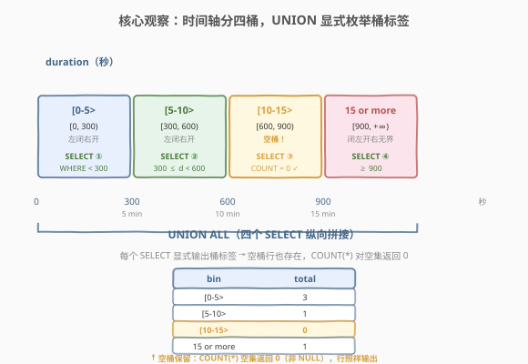
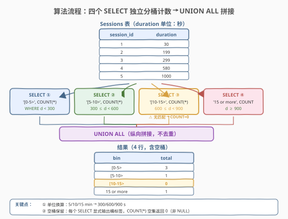
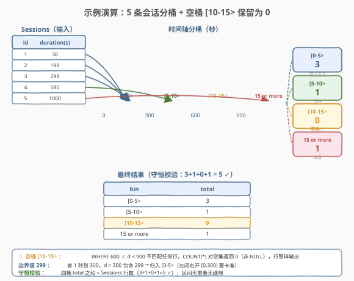

# 制作会话柱状图

- **题目名称**：制作会话柱状图
- **链接**：[1435. 制作会话柱状图](https://leetcode.cn/problems/create-a-session-bar-chart/)
- **难度**：简单
- **标签**：数据库、SQL、UNION、CASE/IF、GROUP BY、分桶、LEFT JOIN、区间统计

## 1. 题目概述

给定 `Sessions` 表，每行记录一次会话的 `session_id` 与 `duration`（**以秒为单位**的访问时长）。现在想把会话时长按**分钟**分到四个桶里，统计每个桶的会话数，画一张「柱状图」的底层数据表：

| 桶标签 | 区间（分钟） | 区间（秒） |
|--------|-------------|-----------|
| `[0-5>` | $[0, 5)$ | $[0, 300)$ |
| `[5-10>` | $[5, 10)$ | $[300, 600)$ |
| `[10-15>` | $[10, 15)$ | $[600, 900)$ |
| `15 or more` | $\ge 15$ | $\ge 900$ |

编写 SQL，输出 `(bin, total)` 两列，**任意顺序**均可。

> ⚠️ **两个核心陷阱**：
> 1. **单位换算**：`duration` 存的是**秒**，桶边界是**分钟**。必须把 5/10/15 分钟换算成 300/600/900 秒再比较，否则会全部分到错误的桶。
> 2. **空桶不能丢**：若某个桶内一个会话都没有（如示例中的 `[10-15>`），`total` 应为 `0`，**这一行仍然要出现在结果里**。直接 `GROUP BY` 现有数据会漏掉空桶——这是本题与普通「分组计数」的关键区别。

**表结构**：

```text
Table: Sessions
+---------------------+---------+
| Column Name         | Type    |
+---------------------+---------+
| session_id          | int     |  ← 主键（唯一）
| duration            | int     |  ← 会话时长，单位：秒
+---------------------+---------+
```

- `session_id` 是该表主键。
- `duration` 为用户访问应用的时长，**单位是秒**（不是分钟）。

**示例 1**：

```text
输入：
Sessions 表：
+-------------+---------------+
| session_id  | duration      |
+-------------+---------------+
| 1           | 30            |
| 2           | 199           |
| 3           | 299           |
| 4           | 580           |
| 5           | 1000          |
+-------------+---------------+

输出：
+--------------+--------------+
| bin          | total        |
+--------------+--------------+
| [0-5>        | 3            |
| [5-10>       | 1            |
| [10-15>      | 0            |
| 15 or more   | 1            |
+--------------+--------------+
```

**解释**：

| session_id | duration（秒） | duration（分钟） | 所属桶 | 判定 |
|------------|---------------|-----------------|--------|------|
| 1 | 30 | 0.5 | `[0-5>` | $0 \le 30 < 300$ ✓ |
| 2 | 199 | 3.3 | `[0-5>` | $0 \le 199 < 300$ ✓ |
| 3 | 299 | 4.98 | `[0-5>` | $0 \le 299 < 300$ ✓（差 1 秒就进下一桶） |
| 4 | 580 | 9.67 | `[5-10>` | $300 \le 580 < 600$ ✓ |
| 5 | 1000 | 16.67 | `15 or more` | $1000 \ge 900$ ✓ |
| — | — | — | `[10-15>` | **无会话落入，total = 0** |

> 💡 **关键观察**：`[10-15>` 桶里一个会话都没有，但结果必须保留这一行且 `total = 0`。这决定了我们不能简单地对现有数据 `GROUP BY`——因为 `GROUP BY` 只对**出现过的值**分组，没出现过的桶自然消失。`UNION` 写法天然解决这个问题：每个 `SELECT` 显式输出桶标签，`COUNT` 为 0 时行依然存在。

**约束条件**：

- `session_id` 是 `Sessions` 表的主键。
- `duration` 为非负整数，单位是秒。
- 结果列：`bin`（桶标签字符串）、`total`（该桶会话数）。
- 四个桶的标签固定为 `[0-5>`、`[5-10>`、`[10-15>`、`15 or more`。
- 返回顺序**任意**。

---

## 2. 解题思路

### 2.1 暴力思路：CASE 分桶 + GROUP BY

最直觉的做法：用 `CASE` 把每条会话的 `duration` 映射成桶标签，再 `GROUP BY` 桶标签计数。

```sql
SELECT
    CASE
        WHEN duration < 300 THEN '[0-5>'
        WHEN duration < 600 THEN '[5-10>'
        WHEN duration < 900 THEN '[10-15>'
        ELSE '15 or more'
    END AS bin,
    COUNT(*) AS total
FROM Sessions
GROUP BY bin;
```

- **致命问题**：`[10-15>` 桶里没有会话，`GROUP BY` 不会为它产生一行——结果只有 3 行，缺了 `[10-15> / 0` 这一行，判题失败。

> ⚠️ **`GROUP BY` 只对出现过的值分组**。这是 SQL 的根本语义：分组键来自数据本身，数据里没有的值不会凭空出现。这与 1407 题「`LEFT JOIN` 保留无行程用户」是同一类问题——都需要一种「**保住空集行**」的机制。本题的解法是 `UNION`（每个 `SELECT` 强制输出一个桶标签）或「派生桶表 + `LEFT JOIN`」。

### 2.2 核心观察：UNION 显式枚举桶 + 单位换算



**关键洞察**：本题的两个考点都不是「怎么计数」（`COUNT` 是最基础的聚合），而是两个容易被忽略的细节：

1. **单位换算**：`duration` 是秒，桶边界是分钟。$5 \text{ min} = 300 \text{ s}$，$10 \text{ min} = 600 \text{ s}$，$15 \text{ min} = 900 \text{ s}$。比较时必须用秒，否则 5 当成 5 秒会让几乎所有会话都落进 `15 or more`。

2. **空桶保留**：四个桶的标签是**题目固定的**，不随数据变化。`UNION` 写法里每个 `SELECT` 显式写死一个桶标签作为常量列，`COUNT` 对空集返回 `0`（注意 `COUNT(*)` 对空集返回 `0`，不是 `NULL`）——这一行照样输出。

> 💡 **`COUNT` 与 `SUM` 的空集行为差异**：`COUNT(*)` 对空集返回 `0`（非 `NULL`），而 `SUM`/`MAX`/`MIN` 对空集返回 `NULL`（参见 1407 题的扩展讨论）。本题用 `COUNT` 而非 `SUM`，因此空桶天然得到 `0`，**不需要 `IFNULL` 兜底**——这是本题比 1407 简单的原因。

**区间约定**：桶标签 `[a-b>` 表示**左闭右开**区间 $[a, b)$。即 `[0-5>` = $[0, 5)$ 分钟 = $[0, 300)$ 秒，包含 0 但不包含 300。`15 or more` 是 $[15, +\infty)$ 分钟 = $[900, +\infty)$ 秒。`WHEN duration < 300` 的短路求值天然实现了左闭右开——前一个 `WHEN` 已经过滤掉 `< 300` 的，到 `WHEN duration < 600` 时隐含了 `>= 300`。

### 2.3 算法流程图



**UNION 四步流水线**：

1. **`SELECT '[0-5>', COUNT(*) FROM Sessions WHERE duration < 300`**：统计 $[0, 300)$ 秒的会话数，显式输出桶标签 `[0-5>`。即使无会话满足，`COUNT(*)` 返回 `0`，行仍存在。
2. **`SELECT '[5-10>', COUNT(*) FROM Sessions WHERE 300 <= duration AND duration < 600`**：统计 $[300, 600)$ 秒。
3. **`SELECT '[10-15>', COUNT(*) FROM Sessions WHERE 600 <= duration AND duration < 900`**：统计 $[600, 900)$ 秒——示例中此桶为空，`COUNT` 返回 `0`。
4. **`SELECT '15 or more', COUNT(*) FROM Sessions WHERE 900 <= duration`**：统计 $\ge 900$ 秒。
5. **`UNION`**：把四个 `SELECT` 的结果纵向拼接。`UNION` 会去重，但四个桶标签互不相同，去重无副作用；也可用 `UNION ALL` 省去去重开销（推荐）。

> 💡 **`UNION` vs `UNION ALL`**：`UNION` 会对结果去重（内部排序/哈希），`UNION ALL` 直接拼接不去重。本题四个桶标签互不相同，不可能有重复行，用 `UNION ALL` 更高效（省去去重代价）。LeetCode 上两者都能过，但工程实践中**确定无重复时首选 `UNION ALL`**。

### 2.4 示例演算

以示例 1 的 5 条会话为例，跟踪 `UNION` 四个 `SELECT` 的执行：



| SELECT | WHERE 条件（秒） | 命中的 session_id | COUNT(*) | 输出行 |
|--------|-----------------|-------------------|----------|--------|
| ① `[0-5>` | `duration < 300` | 1(30), 2(199), 3(299) | 3 | `('[0-5>', 3)` |
| ② `[5-10>` | `300 <= duration < 600` | 4(580) | 1 | `('[5-10>', 1)` |
| ③ `[10-15>` | `600 <= duration < 900` | （无） | **0** | `('[10-15>', 0)` |
| ④ `15 or more` | `duration >= 900` | 5(1000) | 1 | `('15 or more', 1)` |

**关键验证点**：

- **空桶保留**：`SELECT ③` 的 `WHERE 600 <= duration AND duration < 900` 不匹配任何行，但 `COUNT(*)` 对空结果集返回 `0`（不是 `NULL`，也不是「不输出」）——这一行 `('[10-15>', 0)` 照常出现在 `UNION` 结果中。这是 `UNION` 写法相比 `GROUP BY` 写法的核心优势。
- **边界值 299**：session 3 的 `duration = 299` 秒（4 分 59 秒），差 1 秒就到 300。`WHERE duration < 300` 包含 299，正确归入 `[0-5>`。若误写 `duration <= 300`，会把 300 秒（正好 5 分钟）错分到 `[0-5>` 而非 `[5-10>`——左闭右开的边界要卡准。
- **单位换算守恒**：四个桶的 `total` 之和应等于 `Sessions` 总行数。示例中 $3 + 1 + 0 + 1 = 5$ ✓，与 `Sessions` 的 5 行一致——这验证了「无遗漏、无重复」。

> 💡 **守恒校验通用技巧**：分桶统计后，所有桶的 `total` 之和必须等于原始行数。若不等，说明桶边界有重叠（重复计数）或缝隙（漏计数）。本题四个区间 $[0,300) + [300,600) + [600,900) + [900,+\infty)$ 恰好无重叠地覆盖 $[0, +\infty)$，守恒必然成立。

---

## 3. 参考代码

### MySQL（解法 A：`UNION ALL` 四个 `SELECT`，推荐）

```sql
# 1435. 制作会话柱状图
# 思路：四个 SELECT 显式枚举桶标签 + WHERE 按秒分桶 + COUNT 对空集返回 0 + UNION ALL 拼接
SELECT '[0-5>' AS bin, COUNT(*) AS total FROM Sessions WHERE duration < 300
UNION ALL
SELECT '[5-10>' AS bin, COUNT(*) AS total FROM Sessions WHERE duration >= 300 AND duration < 600
UNION ALL
SELECT '[10-15>' AS bin, COUNT(*) AS total FROM Sessions WHERE duration >= 600 AND duration < 900
UNION ALL
SELECT '15 or more' AS bin, COUNT(*) AS total FROM Sessions WHERE duration >= 900;
```

> 💡 **写法要点**：
> - **桶标签作为常量列**：`SELECT '[0-5>' AS bin` 显式写出桶标签，不依赖数据中是否存在该值——这是「空桶保留」的根本保证。
> - **`COUNT(*)` 对空集返回 `0`**：`SELECT ③` 的 `WHERE` 不匹配任何行，`COUNT(*)` 返回 `0`（不是 `NULL`），行照样输出。无需 `IFNULL` 兜底（对比 1407 的 `SUM` 空集得 `NULL` 需要 `IFNULL`）。
> - **`UNION ALL` 而非 `UNION`**：四个桶标签互不相同，不可能重复，`UNION ALL` 省去去重开销。`UNION` 也能过但多一次无意义的排序/哈希。
> - **`WHERE` 用秒**：`300/600/900` 是 5/10/15 分钟换算成秒的值。`duration < 300` 实现左闭右开 $[0, 300)$。
> - **`>=` 与 `<` 搭配**：`duration >= 300 AND duration < 600` 实现 $[300, 600)$。也可写 `BETWEEN 300 AND 599`，但 `BETWEEN` 是**闭区间**（含两端），`BETWEEN 300 AND 599` 等价于 $[300, 599] \subset [300, 600)$，凑巧正确但不直观——`>=` + `<` 更直白地表达左闭右开。

### MySQL（解法 B：派生桶表 + `LEFT JOIN` + `GROUP BY`）

```sql
# 思路：构造包含全部四个桶的派生表，LEFT JOIN Sessions 保证空桶出现，GROUP BY 桶标签计数
SELECT b.bin, COUNT(s.session_id) AS total
FROM (
    SELECT '[0-5>' AS bin, 0 AS lo, 300 AS hi
    UNION ALL SELECT '[5-10>', 300, 600
    UNION ALL SELECT '[10-15>', 600, 900
    UNION ALL SELECT '15 or more', 900, 999999
) b
LEFT JOIN Sessions s
    ON s.duration >= b.lo AND s.duration < b.hi
GROUP BY b.bin, b.lo
ORDER BY b.lo;
```

> 💡 **解法 B 的思路**：把「桶定义」抽成一张派生表 `b`（含 `bin` 标签、下界 `lo`、上界 `hi`），再用 `LEFT JOIN` 把 `Sessions` 按 `duration` 落到对应桶。空桶（如 `[10-15>`）在 `Sessions` 中无匹配，`LEFT JOIN` 保留该桶行且 `s.session_id` 为 `NULL`，`COUNT(s.session_id)` 对全 `NULL` 组返回 `0`。
> - **`COUNT(s.session_id)` 而非 `COUNT(*)`**：`LEFT JOIN` 后空桶那一行是 `(桶, NULL)`，`COUNT(*)` 会数成 `1`（因为 `LEFT JOIN` 产生了一行），而 `COUNT(s.session_id)` 只数非 `NULL` 的 `session_id`，空桶得 `0`——这是 `LEFT JOIN` 计数的经典陷阱（与 1407 的 `COUNT(r.distance)` 同理）。
> - **`GROUP BY b.bin, b.lo`**：按桶标签分组，`b.lo` 一并写出便于 `ORDER BY b.lo` 保证桶按时间顺序输出（题面允许任意序，但有序更直观）。
> - **与解法 A 的对比**：解法 A 是「**先分桶后计数**」（每个 `SELECT` 独立 `COUNT`），解法 B 是「**先连接后分组**」（`LEFT JOIN` 展开再 `GROUP BY`）。解法 A 更简洁、更易读，面试首选；解法 B 展示了「派生维度表 + `LEFT JOIN` 保空集」的通用范式，适合桶数量多或桶定义需要复用的场景。
> - **`999999` 作为 `hi`**：`15 or more` 桶无上界，用一个大数近似 $+\infty$。也可用 `NULL` 配合特殊判定，但大数更简单直白。

### MySQL（解法 C：`CASE` 分桶 + 派生桶表 `LEFT JOIN`，最优雅）

```sql
# 思路：派生桶表保空集 + CASE 把 duration 映射成桶标签 + LEFT JOIN 对齐 + GROUP BY 计数
SELECT b.bin, COUNT(s.session_id) AS total
FROM (
    SELECT '[0-5>' AS bin UNION ALL SELECT '[5-10>'
    UNION ALL SELECT '[10-15>' UNION ALL SELECT '15 or more'
) b
LEFT JOIN Sessions s
    ON b.bin = CASE
        WHEN s.duration < 300 THEN '[0-5>'
        WHEN s.duration < 600 THEN '[5-10>'
        WHEN s.duration < 900 THEN '[10-15>'
        ELSE '15 or more'
    END
GROUP BY b.bin;
```

> 💡 **解法 C 的思路**：派生表 `b` 只列桶标签（不含边界），`LEFT JOIN` 的 `ON` 条件用 `CASE` 把 `s.duration` 映射成桶标签再与 `b.bin` 比较。`CASE` 的短路求值天然实现左闭右开（`WHEN duration < 300` 先拦截 `[0-5>`，剩余的到 `WHEN duration < 600` 隐含 `>= 300`）。
> - **优点**：桶定义（`CASE`）与桶枚举（派生表）分离，逻辑清晰；`CASE` 只写一处，边界改动只改 `CASE`，派生表只管枚举标签。
> - **缺点**：`ON` 条件里用 `CASE` 做连接条件，优化器难以走索引（连接条件不是简单的等值/范围），大数据量时性能差于解法 B（`BETWEEN` 范围连接可走索引）。本题数据量小，三种解法均可。
> - **适用场景**：桶数量多、桶边界不规则（非等距）时，`CASE` 比手写多个 `WHERE` 更紧凑。

### Python（pandas）

```python
import pandas as pd

def create_bar_chart(sessions: pd.DataFrame) -> pd.DataFrame:
    bins = ['[0-5>', '[5-10>', '[10-15>', '15 or more']
    edges = [0, 300, 600, 900, float('inf')]
    if sessions.empty:
        counts = [0] * 4
    else:
        idx = pd.cut(sessions['duration'], bins=edges, labels=bins, right=False, include_lowest=True)
        counts = idx.value_counts().reindex(bins, fill_value=0).tolist()
    return pd.DataFrame({'bin': bins, 'total': counts})
```

> 💡 **pandas 对照**：
> - `pd.cut(..., bins=edges, labels=bins, right=False)` 对应 SQL 的 `CASE`/`WHERE` 分桶——`right=False` 表示**左闭右开**（$[a, b)$），与桶标签 `[a-b>` 的语义一致；`include_lowest=True` 保证左端点 0 包含在内。
> - `value_counts().reindex(bins, fill_value=0)` 对应 `UNION` 的空桶保留——`value_counts` 只统计出现过的桶（类似 `GROUP BY`），`reindex(bins, fill_value=0)` 把缺失的桶补上 `0`，正是「派生桶表 + `LEFT JOIN`」的 pandas 翻译。
> - `sessions.empty` 特判：空表时 `pd.cut` 返回空，`value_counts` 也空，`reindex` 仍能补出 4 个 `0`——特判可省，但写出更清晰。

---

## 4. 复杂度分析

| 维度 | 解法 A（UNION ALL） | 解法 B（派生表+LEFT JOIN） | 解法 C（CASE+LEFT JOIN） |
|------|---------------------|--------------------------|--------------------------|
| **时间** | $O(4n) = O(n)$（4 次全表扫描） | $O(n + 4)$（1 次 JOIN 扫描） | $O(n \cdot 4)$（ON 条件 CASE 逐行算） |
| **空间** | $O(1)$（每次 COUNT 只产 1 行） | $O(n)$（JOIN 中间结果） | $O(n)$（JOIN 中间结果） |
| **可读性** | ✓ 最简洁直白 | △ 多一层派生表 | △ CASE 在 ON 里略绕 |
| **推荐度** | ✓ **首选** | △ 展示 LEFT JOIN 范式 | △ 不规则桶时用 |

> - $n$ = `Sessions` 行数。
> - **解法 A**：4 个 `SELECT` 各全表扫描一次，共 $4n$ 次比较。常数因子为 4，渐近 $O(n)$。每次 `COUNT` 只输出 1 行，空间 $O(1)$。
> - **解法 B**：派生表 `b` 只有 4 行，`LEFT JOIN` 对 `Sessions` 的每行做一次范围判定（$O(1)$），总 $O(n)$。`JOIN` 中间结果最多 $n + 4$ 行。
> - **解法 C**：`ON` 条件的 `CASE` 对 `Sessions` 每行求值一次（$O(1)$），但 `LEFT JOIN` 的连接条件非等值/范围，优化器可能退化为嵌套循环 $O(4n)$。数据量大时最差。
> - **本题数据量小**（示例级），三种解法性能无差异。复杂度分析的价值在**可扩展性**：若 `Sessions` 达千万行，解法 A 的 4 次全表扫描可优化为 1 次扫描 + `CASE` 分组（解法 B/C 思路），但需配合派生桶表保空集。

> ⚠️ **解法 A 的 4 次全表扫描**：严格说解法 A 扫了 4 遍 `Sessions`，常数因子是 4。对于千万级大表，4 次全扫的开销不可忽视。优化方案：改用解法 B 的「1 次扫描 + 范围 JOIN」，或在应用层一次扫描用 `CASE` 分组后补空桶。本题 Easy 难度、数据量小，4 次扫描完全可接受。

---

## 5. 扩展：分桶统计的空集保留范式

### 5.1 三种「保空桶」策略对比

分桶统计中「空桶不丢」是高频需求，有三种通用策略：

| 策略 | 实现 | 适用场景 | 优缺点 |
|------|------|---------|--------|
| **UNION 枚举** | 每个 `SELECT` 显式输出桶标签 + `COUNT` | 桶数量少（≤ 5-8 个） | ✓ 简洁直白；✗ 桶多时 SQL 冗长 |
| **派生桶表 + LEFT JOIN** | 构造含全部桶的派生表，`LEFT JOIN` 数据表 | 桶数量多或桶定义需复用 | ✓ 通用；✗ 多一层子查询 |
| **GROUP BY + 事后补空桶** | 先 `GROUP BY` 现有数据，再用 `UNION` 补缺失桶 | 桶定义动态、无法预先枚举 | ✓ 灵活；✗ 需两步、易遗漏 |

> 💡 **选择口诀**：桶少且固定 → `UNION` 枚举（本题）；桶多或复用 → 派生桶表 + `LEFT JOIN`；桶动态 → `GROUP BY` 后补缺。核心都是「**让桶定义独立于数据存在**」——桶是维度，数据是事实，维度表全量保留是 OLAP 的基本范式。

### 5.2 COUNT(*) vs COUNT(col) 的空集与 NULL 行为

本题解法 B 中 `COUNT(s.session_id)` 而非 `COUNT(*)` 是关键，两者对 `LEFT JOIN` 空匹配行的行为不同：

| 函数 | 空集（0 行） | `LEFT JOIN` 空匹配行（1 行，右表列全 NULL） |
|------|-------------|---------------------------------------------|
| `COUNT(*)` | `0` | **`1`**（数行不数值，有 1 行就算 1） |
| `COUNT(col)` | `0` | **`0`**（`col` 为 `NULL` 不计入） |

> 💡 **记忆要点**：`COUNT(*)` 数**行**（物理行存在即 +1），`COUNT(col)` 数**非 NULL 值**。`LEFT JOIN` 的空匹配行物理上存在（左表行 + 右表 NULL），`COUNT(*)` 会误数成 1。凡 `LEFT JOIN` 后对右表列计数，**必须用 `COUNT(右表列)` 而非 `COUNT(*)`**——这是 SQL 的经典陷阱，本题解法 B 与 1407 题（`COUNT(r.distance)` 对无行程用户返回 0）共享同一考点。

### 5.3 左闭右开区间与 BETWEEN 的陷阱

桶标签 `[a-b>` 表示左闭右开 $[a, b)$。SQL 中实现左闭右开有两种方式：

| 写法 | 语义 | 示例 |
|------|------|------|
| `>= a AND < b` | $[a, b)$ 左闭右开 | `duration >= 300 AND duration < 600` |
| `BETWEEN a AND b` | $[a, b]$ **闭区间** | `BETWEEN 300 AND 600`（含 600，错误！） |
| `BETWEEN a AND b-1` | $[a, b)$ 凑巧等价（整数） | `BETWEEN 300 AND 599`（正确但依赖整数假设） |

> 💡 **`BETWEEN` 是闭区间**，含两端。对于 $[300, 600)$ 的左闭右开，`BETWEEN 300 AND 600` 会把 600 秒（正好 10 分钟）错分到 `[5-10>` 而非 `[10-15>`。整数场景下 `BETWEEN 300 AND 599` 正确但依赖「`duration` 是整数」的假设（若 `duration` 是浮点则失效）。**工程实践中推荐 `>=` + `<` 显式表达左闭右开**，不依赖数据类型假设。

---

## 6. 面试要点

1. **`duration` 的单位是什么？桶边界用什么单位比较？**

   > `duration` 存的是**秒**，桶边界是**分钟**。比较时必须统一单位——把 5/10/15 分钟换算成 300/600/900 秒，用秒比较。若直接用 `duration < 5`，5 秒远小于所有合理会话时长，几乎所有会话都会落进 `15 or more`——单位错误是最容易犯的低级失误。

2. **为什么 `GROUP BY` 写法会漏掉 `[10-15>` 桶？**

   > `GROUP BY` 只对**数据中出现过的分组键**产生行。`[10-15>` 桶里没有会话，`CASE` 不会产生这个标签，`GROUP BY` 自然不为它输出行。要保留空桶，必须让桶定义**独立于数据**——`UNION` 写法里每个 `SELECT` 显式输出桶标签（不依赖数据中是否有该值），或用派生桶表 `LEFT JOIN` 保住空桶行。

3. **`UNION` 和 `UNION ALL` 用哪个？**

   > 本题用 `UNION ALL` 更优。四个桶标签互不相同，`UNION` 的去重是多余的（内部排序/哈希开销）。`UNION ALL` 直接拼接不去重，更高效。**确定无重复行时首选 `UNION ALL`**——这是 SQL 性能优化的常识。LeetCode 上两者都能过，但工程实践中 `UNION ALL` 是更好的习惯。

4. **解法 B 中为什么用 `COUNT(s.session_id)` 而非 `COUNT(*)`？**

   > `LEFT JOIN` 后空桶（如 `[10-15>`）那一行是 `(桶标签, NULL)`——左表（派生桶表）的行保留，右表（`Sessions`）无匹配填 `NULL`。`COUNT(*)` 数物理行，这一行存在，数成 `1`；`COUNT(s.session_id)` 数非 `NULL` 值，`session_id` 为 `NULL`，数成 `0`。凡 `LEFT JOIN` 后对右表列计数，必须用 `COUNT(右表列)`——这是 `LEFT JOIN` 计数的经典陷阱。

5. **桶边界是左闭右开还是闭区间？`BETWEEN` 能用吗？**

   > 桶标签 `[a-b>` 表示**左闭右开** $[a, b)$，如 `[0-5>` = $[0, 300)$ 秒，含 0 不含 300。`BETWEEN a AND b` 是**闭区间**含两端，`BETWEEN 300 AND 600` 会把 600 秒（正好 10 分钟）错分到 `[5-10>`。整数场景下 `BETWEEN 300 AND 599` 正确但依赖整数假设。推荐 `>= a AND < b` 显式表达左闭右开，不依赖数据类型。

6. **如果桶有 100 个，还用 `UNION` 写 100 个 `SELECT` 吗？**

   > 不现实。桶多时改用解法 B 的「派生桶表 + `LEFT JOIN`」——把桶定义（标签 + 边界）存成一张表（临时表或 `WITH` CTE），`LEFT JOIN Sessions` 后 `GROUP BY` 桶标签。桶定义与计数逻辑分离，桶数量可任意扩展。若桶边界等距，还可在应用层生成桶定义表，或用 `WIDTH_BUCKET`（PostgreSQL/Oracle 的内置分桶函数，MySQL 不支持）。

> 💡 **一句话总结**：1435 是 SQL **「分桶统计 + 空桶保留」** 的招牌题——核心不在计数（`COUNT` 是最基础聚合），而在两个细节：**单位换算**（秒 vs 分钟）与**空桶不丢**（`UNION` 显式枚举桶标签或派生桶表 `LEFT JOIN`）。记住「桶定义独立于数据 + `COUNT` 空集返回 0 无需兜底 + 左闭右开用 `>=`/`<`」，所有分桶统计类 SQL 题都能套用。

---

## 7. 同类练习题

- [1407. 排名靠前的旅行者](https://leetcode.cn/problems/top-travellers/)（[题解](../1401-1500/1407_排名靠前的旅行者.md)）：`LEFT JOIN` 保留无行程用户 + `IFNULL` 兜底 `SUM` 空集 `NULL`——同为「保空集」范式，对比 1435 的 `COUNT` 空集返回 `0` 无需兜底，理解 `COUNT` 与 `SUM` 的空集行为差异
- [1211. 查询结果质量与占比](https://leetcode.cn/problems/queries-quality-and-percentage/)：`GROUP BY + AVG + IF`——单表分组聚合 + 条件计数，对比 1435 理解「分组计数」与「分桶计数」的层级关系
- [185. 部门工资前三高的所有员工](https://leetcode.cn/problems/department-top-three-salaries/)：`DENSE_RANK() OVER (PARTITION BY ...)` + `LEFT JOIN`——窗口函数分排名桶，对比 1435 的固定区间分桶，理解「排名桶」与「区间桶」的区别
- [1075. 项目员工 I](https://leetcode.cn/problems/project-employees-i/)：`GROUP BY + AVG + ROUND`——多表 JOIN 后分组聚合，对比 1435 的单表分桶，理解「外键聚合」与「区间分桶」的 JOIN 范式差异
- [608. 树节点](https://leetcode.cn/problems/tree-node/)：`CASE WHEN` 三分支分类输出——`CASE` 分类的另一种用法（分类输出而非分类计数），对比 1435 理解 `CASE` 在「打标签」与「分桶」中的不同角色
