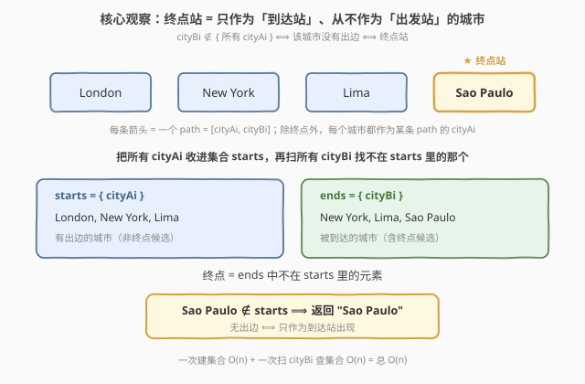
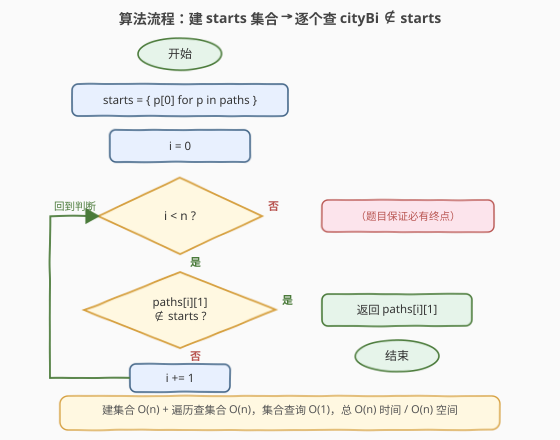
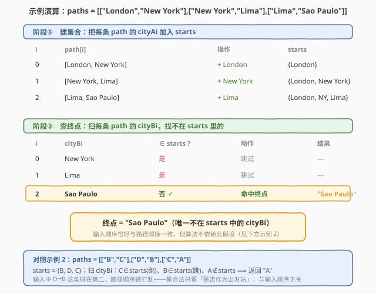

# 旅行终点站

- **题目名称**：旅行终点站
- **链接**：[1436. 旅行终点站](https://leetcode.cn/problems/destination-city/)
- **难度**：简单
- **标签**：数组、哈希表、字符串

## 1. 题目概述

给你一份旅游线路 `paths`，其中 `paths[i] = [cityAi, cityBi]` 表示存在一条从 `cityAi` 到 `cityBi` 的直接路径。每个城市名是一个字符串。**所有路径串成一条不含环的旅行线**，且**恰好有一个终点站**——即那个**没有任何出边**的城市。请返回该终点站的城市名。

> ⚠️ 关键约束：整张图是一条**线**（每个中间城市恰好一进一出），且**有且仅有一个终点**。因此每个城市在 `cityAi` 列出现 0 或 1 次：起点 0 次，中间城市 1 次，终点 0 次但必然在 `cityBi` 列出现 1 次。终点就是那个「作为到达站出现、却从不作为出发站出现」的城市。

**示例 1**：

```text
输入：paths = [["London","New York"],["New York","Lima"],["Lima","Sao Paulo"]]
输出："Sao Paulo"
解释：旅行路线 London → New York → Lima → Sao Paulo，Sao Paulo 没有出边，是终点。
```

**示例 2**：

```text
输入：paths = [["B","C"],["D","B"],["C","A"]]
输出："A"
解释：旅行路线 D → B → C → A，A 没有出边，是终点。
      注意输入中第二条 [D,B] 打乱了路径顺序，但终点判定与输入顺序无关。
```

**示例 3**：

```text
输入：paths = [["A","Z"]]
输出："Z"
解释：只有一条边 A → Z，Z 没有出边。
```

**约束条件**：

- $1 \le \text{paths.length} \le 100$
- $\text{paths}[i]\text{.length} = 2$
- $1 \le \text{cityAi.length},\ \text{cityBi.length} \le 10$
- 所有字符串仅含大小写英文字母
- 给定测试数据保证存在且仅存在一个终点站

> 💡 **关键点**：终点站的本质特征是「**没有出边**」，即在所有 `cityAi`（出发站）中找不到它。把所有 `cityAi` 装进哈希集合，终点就是那个不在集合里的 `cityBi`。

---

## 2. 解题思路

### 2.1 暴力思路：对每个到达站逐一查验出边

最直观的做法：枚举每条 path 的到达站 `cityBi`，再**遍历所有 path** 看 `cityBi` 是否出现在某个 `cityAi` 中。若全程没出现，它就是终点。

- **正确**：终点的定义就是「不出现在任何 `cityAi` 中」，逐一枚举必然命中。
- **低效**：对每个 `cityBi` 都要 $O(n)$ 扫一遍所有 `cityAi`，合计 $O(n^2)$。本题 $n \le 100$，约 $10^4$ 次操作毫无压力，但完全没利用「出发站集合可一次预建」这一结构。

> ⚠️ 暴力的浪费在于「**对每个到达站重复扫出发站列表**」。其实所有 `cityAi` 在判定前就已知，且对每个 `cityBi` 的查验都基于**同一个出发站集合**——预建一次即可。

### 2.2 核心观察：终点 = 不在出发站集合里的到达站



两步观察把 $O(n^2)$ 压成 $O(n)$：

**观察一（终点无出边）**：终点站没有任何出边，等价于它**不出现在任何 `cityAi` 里**。反过来说，凡出现在某个 `cityAi` 里的城市都有出边，必非终点。

**观察二（集合判定 $O(1)$）**：把所有 `cityAi` 预先塞进一个**哈希集合** `starts`，那么「`cityBi` 是否有出边」就退化成一次集合查询 `cityBi ∈ starts ?`，$O(1)$ 完成。于是只需扫一遍建集合、再扫一遍查到达站，总 $O(n)$。

形式化地，设 $S = \{\,\text{cityAi} \mid \text{每条 path}\,\}$，则

$$\text{终点} = \text{那个满足 } \text{cityBi} \notin S \text{ 的 cityBi}$$

题目保证恰好一个，找到即返回。

> 💡 **一句话**：识别出「终点 ⟺ 不在出发站集合」⟹ 预建 `starts` 集合，把「每个到达站 $O(n)$ 扫一遍出发站」换成「每个到达站 $O(1)$ 查集合」。这是「**预处理不变量 + 集合加速查询**」的最朴素范例。

> ⚠️ 此判定**与输入顺序无关**——示例 2 中 `[D,B]` 排在第二条、路径顺序被打乱，但集合法只看「是否作为出发站」，扫到即可。这正是它优于「按路径顺序模拟跟随」之处。

### 2.3 算法流程图



**完整步骤**：

1. **建集合** `starts = { paths[i][0] for i in range(n) }`（一趟 $O(n)$）；
2. **初始化** `i = 0`；
3. **遍历**每条 path，对 `cityBi = paths[i][1]`：
   - 若 `cityBi ∉ starts`：返回 `cityBi`（找到终点）；
   - 否则 `i += 1` 继续；
4. 题目保证必命中，无需处理「找不到」分支。

> 💡 也可换一种等价写法：先建 `starts`，再用集合差 `ends − starts` 一步求出终点——`ends` 为所有 `cityBi` 的集合，`ends - starts` 中唯一元素即终点。两段都是 $O(n)$，写法更声明式（见扩展 5.2）。

### 2.4 示例演算

以示例 1 的 `paths = [["London","New York"],["New York","Lima"],["Lima","Sao Paulo"]]` 为例：



**阶段①　建集合**：扫每条 path，把 `cityAi` 加入 `starts`。

| $i$ | path$[i]$ | 操作 | starts（处理后） |
|-----|-----------|------|------------------|
| 0 | [London, New York] | + London | {London} |
| 1 | [New York, Lima] | + New York | {London, New York} |
| 2 | [Lima, Sao Paulo] | + Lima | {London, New York, Lima} |

**阶段②　查终点**：扫每条 path 的 `cityBi`，查是否 $\in$ starts。

| $i$ | cityBi | $\in$ starts ? | 动作 | 结果 |
|-----|--------|----------------|------|------|
| 0 | New York | 是 | 跳过 | — |
| 1 | Lima | 是 | 跳过 | — |
| 2 | Sao Paulo | **否 ✓** | 命中终点 | "Sao Paulo" |

- **第 ① 步**：`starts = {London, New York, Lima}`（三个出发站）。
- **第 ② 步**：`New York`、`Lima` 都在 starts 里（有出边，跳过）；`Sao Paulo` 不在 starts 里 ⟹ 它没有出边 ⟹ 终点。

> 以示例 2 `[["B","C"],["D","B"],["C","A"]]` 为例：`starts = {B, D, C}`；扫 `cityBi`：`C∈starts`（跳）、`B∈starts`（跳）、`A∉starts` ⟹ 返回 `"A"` ✓。注意 `D` 虽不是任何 `cityBi`（它是整条路线的起点），但集合法不需要先找起点，只关心「到达站里谁没有出边」。示例 3 `[["A","Z"]]`：`starts = {A}`，`Z∉starts` ⟹ 返回 `"Z"` ✓。

---

## 3. 参考代码

### 方法一：哈希集合（推荐）

### C++

```cpp
class Solution {
public:
    string destCity(vector<vector<string>>& paths) {
        unordered_set<string> starts;
        for (const auto& p : paths) {
            starts.insert(p[0]);
        }
        for (const auto& p : paths) {
            if (!starts.count(p[1])) {
                return p[1];
            }
        }
        return "";
    }
};
```

### Python

```python
class Solution:
    def destCity(self, paths: List[List[str]]) -> str:
        starts = {p[0] for p in paths}
        for p in paths:
            if p[1] not in starts:
                return p[1]
        return ""
```

> 💡 **实现要点**：① 用集合推导 / `unordered_set` 一次预建 `starts`。② 第二趟只需对每个 `cityBi` 做 `not in` / `!count` 判定，命中即返回。③ 题目保证有解，末尾的 `return ""` 仅作编译兜底，实际不会执行。

### 方法二：集合差（声明式写法）

### Python

```python
class Solution:
    def destCity(self, paths: List[List[str]]) -> str:
        starts = {p[0] for p in paths}
        ends   = {p[1] for p in paths}
        return (ends - starts).pop()
```

### C++

```cpp
class Solution {
public:
    string destCity(vector<vector<string>>& paths) {
        unordered_set<string> starts, ends;
        for (const auto& p : paths) {
            starts.insert(p[0]);
            ends.insert(p[1]);
        }
        for (const auto& city : ends) {
            if (!starts.count(city)) {
                return city;
            }
        }
        return "";
    }
};
```

> 💡 `ends − starts` 直接给出「只作为到达站、从不作为出发站」的城市，语义即终点。C++ 标准库无集合差运算符，需手写一次遍历；Python 的 `set - set` 一行表达更直观。两趟 $O(n)$，与方法一同复杂度，仅风格差异。

---

## 4. 复杂度分析

| 维度 | 哈希集合 $O(n)$（推荐） | 暴力双扫 $O(n^2)$ |
|------|------------------------|--------------------|
| **时间复杂度** | $O(n)$ | $O(n^2)$ |
| **空间复杂度** | $O(n)$（`starts` 集合） | $O(1)$ |
| **每到达站判定** | 一次哈希查询 $O(1)$ | 一次线性扫描 $O(n)$ |
| **是否预建结构** | 是（`starts` 集合） | 否 |

- **哈希集合**：建 `starts` 一趟 $O(n)$，查到达站一趟 $O(n)$，每次查询均摊 $O(1)$，合计 $O(n)$；额外存一个至多 $n$ 元素的集合，空间 $O(n)$。是本题的最优解。
- **暴力双扫**：对每个 `cityBi` 线性扫所有 `cityAi`，$n$ 个到达站合计 $O(n^2)$；$n \le 100$ 时约 $10^4$ 次操作，毫秒级通过，但未识别「出发站集合可预建」这一结构，理论劣于哈希集合法。

> ⚠️ 本题 $n \le 100$、字符串长度 $\le 10$，两种方法都能过。面试中写出哈希集合版即体现对「不变量提取 + 集合加速查询」的把握——这是把 $O(n^2)$ 降到 $O(n)$ 的通用思路。

---

## 5. 扩展：为什么不「按路径顺序模拟跟随」？

### 5.1 顺链跟随法及其代价

另一种思路是「模拟旅行」：先找到**起点**（那个不出现在任何 `cityBi` 里的 `cityAi`），然后用哈希表 `from → to` 一路跟随，直到某个 `to` 不在哈希表里，即为终点。

```python
def destCity(self, paths: List[List[str]]) -> str:
    nxt = {p[0]: p[1] for p in paths}
    # 找起点：不在任何 cityBi 里的 cityAi
    ends = {p[1] for p in paths}
    cur = next(p[0] for p in paths if p[0] not in ends)
    while cur in nxt:
        cur = nxt[cur]
    return cur
```

- **正确**：沿唯一路径走到无出边者，必然到终点。
- **代价**：需要先建 `nxt` 表（$O(n)$）、再找起点（又要一个 `ends` 集合 $O(n)$）、再跟随（$O(n)$）。三趟 $O(n)$，常数更大，且**多此一举**——终点判定本就不依赖起点。

> 💡 顺链跟随是「**把图当成链表遍历**」的视角，适合需要输出**整条路线**的变体题；本题只要终点，无需找起点，集合法直接命中更省。

### 5.2 集合差法的代数本质

设 $S_a = \{\text{cityAi}\}$、$S_b = \{\text{cityBi}\}$。终点满足「在 $S_b$ 但不在 $S_a$」，即

$$\text{终点} \in S_b \setminus S_a$$

由于图是一条线，$|S_b \setminus S_a| = 1$（恰好一个终点），且 $|S_a \setminus S_b| = 1$（恰好一个起点）。集合差运算 $O(n)$ 一次给出答案，无需跟随、无需找起点。这与方法一「扫 `cityBi` 查 `starts`」等价，只是把「逐个查」换成「整体做一次差」。

> ⚠️ 若题目不保证唯一终点（变体），$|S_b \setminus S_a|$ 可能 $>1$，此时 `.pop()` 取其一不再合法，应返回整个集合；而方法一的「首个命中即返回」也只给其一。需按题意调整。

### 5.3 若图可能有环

本题保证无环且为单链。若变体允许环，则可能**没有终点**（每个城市都有出边），$S_b \setminus S_a$ 为空集。此时集合法自然返回空（C++ 末尾 `return ""` / Python 返回 `None`），而顺链跟随法会**死循环**——除非额外维护访问集合判环。这也是集合法在健壮性上的隐性优势。

---

## 6. 面试要点

1. **如何想到从 $O(n^2)$ 优化到 $O(n)$？**

   > 观察终点的定义：「没有出边」⟺「不出现在任何 `cityAi` 中」。所有 `cityAi` 在判定前已知，且对每个 `cityBi` 的查验都基于**同一个出发站集合**。一旦识别出这个**可预建的不变量**，就把「每个到达站扫一遍出发站」换成「预建集合 + 逐个 $O(1)$ 查询」，从 $O(n^2)$ 降到 $O(n)$。

2. **为什么用哈希集合而不是排序 + 二分？**

   > 字符串排序需 $O(n \log n \cdot L)$（$L$ 为串长），且二分查询单次 $O(\log n \cdot L)$；哈希集合建表 $O(n \cdot L)$、查询均摊 $O(L)$，整体更优且常数小。字符串哈希在本题规模下完全可靠。

3. **集合差法 `ends - starts` 与「扫 cityBi 查 starts」有何异同？**

   > 两者等价：集合差法先建 `ends`、`starts` 两个集合再做一次差（$O(n)$），整体 $O(n)$；扫查法只建 `starts` 再逐个查（$O(n)$）。复杂度相同，集合差法更声明式（语义即「只作为到达站的城市」），扫查法更省一趟建表、且可「首个命中即返回」提前退出。

4. **为什么不「按路径顺序模拟跟随」？**

   > 顺链跟随需先找起点（额外一个集合）、建 `from→to` 表、再跟随，三趟 $O(n)$ 常数更大，且多此一举——终点判定不依赖起点。跟随法适合「输出整条路线」的变体；只要终点时集合法直接命中更省。

5. **如果题目改成「可能有多个终点」或「可能有环」呢？**

   > 多终点：$|S_b \setminus S_a| > 1$，应返回整个集合而非 `.pop()`。有环：可能 $S_b \setminus S_a = \emptyset$（每个城市都有出边），集合法自然返回空；而顺链跟随法会死循环，需额外判环。集合法在变体下更健壮。

> 💡 **一句话总结**：1436 的灵魂是「**终点 ⟺ 不在出发站集合**」——预建 `starts` 哈希集合，扫到达站做 $O(1)$ 查询，首个不在集合里的 `cityBi` 即终点，$O(n)$ 时间、$O(n)$ 空间。

---

## 7. 同类练习题

- [1. 两数之和](https://leetcode.cn/problems/two-sum/)（[题解](../0001-0100/1_两数之和.md)）：哈希表一次遍历查「互补数是否已在表里」，与 1436 同属「预建哈希 + $O(1)$ 查询」范式，把 $O(n^2)$ 双重循环降到 $O(n)$
- [136. 只出现一次的数字](https://leetcode.cn/problems/single-number/)（[题解](../0101-0200/136_只出现一次的数字.md)）：在群体里找「与众不同的那一个」，与 1436「在到达站里找没有出边的那一个」同构；本题用集合差，136 用异或，都是「找唯一异类」的典型
- [349. 两个数组的交集](https://leetcode.cn/problems/intersection-of-two-arrays/)（[题解](../0301-0400/349_两个数组的交集.md)）：哈希集合做集合运算（交），与 1436 的集合差 $S_b \setminus S_a$ 同源，体会「集合运算」一招通吃交/并/差
- [202. 快乐数](https://leetcode.cn/problems/happy-number/)（[题解](../0201-0300/202_快乐数.md)）：用哈希集合检测「是否重复出现」以判圈，与 1436「用哈希集合判定是否出现」同属集合成员查询的最基本用法
- [290. 单词规律](https://leetcode.cn/problems/word-pattern/)（[题解](../0201-0300/290_单词规律.md)）：双向哈希双射判定，与 1436 单向集合成员判定对照，理解「集合查存在性」vs「哈希表查映射」的适用边界
