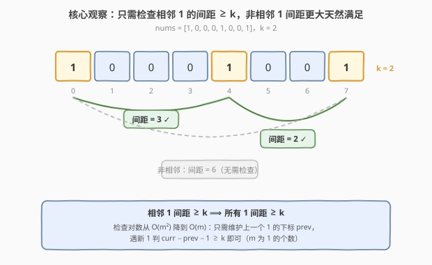
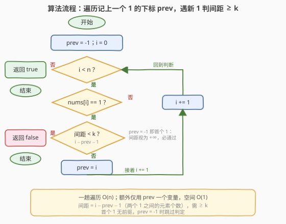
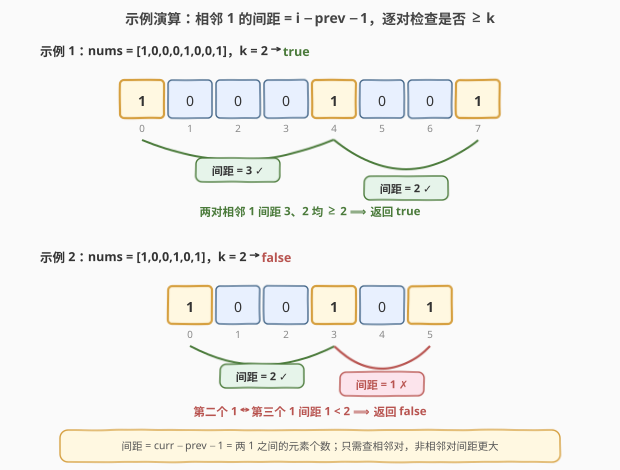

# LeetCode 是否所有1都至少相隔k个元素 题解

## 1. 题目概述

- **标题 / 题号**：是否所有1都至少相隔k个元素（#1437，easy）
- **链接**：https://leetcode.cn/problems/check-if-all-1s-are-at-least-length-k-places-away/
- **难度**：简单
- **标签**：数组、一次遍历

**题意**：给你一个由若干 `0` 和 `1` 组成的数组 `nums` 以及整数 `k`。如果所有 `1` 都**至少相隔 `k` 个元素**，则返回 `true`；否则返回 `false`。

> 💡 **「相隔 k 个元素」的精确含义**：对任意两个 `1`（下标 $i < j$），它们之间的元素个数 $j - i - 1$ 必须 $\ge k$。即两个 `1` 中间至少夹着 $k$ 个 `0`（因为中间若再出现 `1`，那一对间距更近，必先违规）。

**示例 1**：

```text
输入：nums = [1,0,0,0,1,0,0,1], k = 2
输出：true
解释：每个 1 都至少相隔 2 个元素。
      1 的下标为 0、4、7：
      0→4 间距 = 4−0−1 = 3 ≥ 2 ✓
      4→7 间距 = 7−4−1 = 2 ≥ 2 ✓
```

**示例 2**：

```text
输入：nums = [1,0,0,1,0,1], k = 2
输出：false
解释：第二个 1 和第三个 1 之间只隔了 1 个元素。
      1 的下标为 0、3、5：
      0→3 间距 = 3−0−1 = 2 ≥ 2 ✓
      3→5 间距 = 5−3−1 = 1 < 2 ✗
```

**约束**：

- $1 \le \text{nums.length} \le 10^5$
- $0 \le k \le \text{nums.length}$
- $\text{nums}[i] \in \{0, 1\}$

> 💡 **关键点**：只需关注 `1` 的下标，`0` 仅仅是「间隔填充物」。问题等价于——把所有 `1` 的下标取出 $p_1 < p_2 < \dots < p_m$，判定**每对相邻下标** $p_{t+1} - p_t - 1 \ge k$ 是否全部成立。

## 2. 解题思路

### 2.1 暴力思路：检查所有 1 的两两组合

最直观的做法：先收集所有 `1` 的下标，然后对**每一对** `1` 检查其间距是否 $\ge k$。若有任何一对违规即返回 `false`。

- **正确**：两两枚举必然覆盖所有间距约束；
- **低效**：设共有 $m$ 个 `1`，需检查 $\binom{m}{2} = O(m^2)$ 对。当 `1` 较密集时（如全 `1` 数组 $m = n = 10^5$），约 $5 \times 10^9$ 次比较，超时。

> ⚠️ 暴力的盲点在于：**非相邻的 `1` 间距一定比相邻的更大**——若相邻对都不违规，隔着更远的对天然安全。因此真正需要检查的只有**下标序列上相邻的** $m-1$ 对，$O(m^2)$ 可直接压成 $O(m)$。

### 2.2 核心观察：只需检查相邻 1 的间距



**关键洞察**：把所有 `1` 的下标按序排列为 $p_1 < p_2 < \dots < p_m$。定义相邻间距 $g_t = p_{t+1} - p_t - 1$。则：

- **只需检查** 每个 $g_t \ge k$ 是否成立（共 $m-1$ 个检查）；
- **非相邻对** $(p_i, p_j),\, j > i+1$ 的间距为 $p_j - p_i - 1 = \sum_{t=i}^{j-1} g_t + (j-i-1)$，它**严格大于**路径上每个 $g_t$（多出中间 `1` 的占位 $(j-i-1) \ge 1$），故相邻对全过则非相邻对必过。

于是 $O(m^2)$ 对检查降为 $O(m)$ 次相邻检查，而 $m \le n$，整体一趟 $O(n)$。

> 💡 **实现上无需显式存下标数组**：只要在遍历时记住「上一个 `1` 的下标 `prev`」，遇到新 `1` 即可立即算出间距 $i - \text{prev} - 1$ 并判定，判定后再更新 `prev`。这是「**单趟能处理就不存中间结构**」的典型——把收集 + 配对压缩成边扫描边比较。

> ⚠️ **首个 `1` 的处理**：第一个 `1` 没有前驱，无间距可言，必通过。用 `prev = -1` 作哨兵，当 `prev == -1` 时跳过判定（详见 2.3 流程与第 5 节的哨兵消除法）。

### 2.3 算法流程图



**完整步骤**：

1. **初始化** `prev = -1`（哨兵，表示尚未见过 `1`）；
2. **遍历** $i$ 从 $0$ 到 $n-1$：
   - 若 $\text{nums}[i] == 1$：
     - 若 `prev ≠ -1` **且** $i - \text{prev} - 1 < k$ → 返回 `false`；
     - 否则更新 `prev = i`；
3. **遍历结束** 未违规 → 返回 `true`（含「没有 `1`」或「只有一个 `1`」的情形，天然成立）。

> 💡 一趟遍历 $O(n)$，额外只用 `prev` 一个变量，空间 $O(1)$。提前返回：一旦发现违规对立即 `return false`，不必扫完整个数组。

### 2.4 示例演算

以示例 1（`nums = [1,0,0,0,1,0,0,1]`，$k=2$）与示例 2（`nums = [1,0,0,1,0,1]`，$k=2$）演算：



**示例 1**（$n=8$，`1` 在下标 0、4、7）：

| 相邻 1 对 | `prev` | `i` | 间距 $i-\text{prev}-1$ | $\ge k=2$ ? |
|-----------|--------|-----|------------------------|-------------|
| 1st → 2nd | 0 | 4 | 3 | ✓ |
| 2nd → 3rd | 4 | 7 | 2 | ✓ |

两对均 $\ge 2$ $\implies$ 返回 `true`。

**示例 2**（$n=6$，`1` 在下标 0、3、5）：

| 相邻 1 对 | `prev` | `i` | 间距 $i-\text{prev}-1$ | $\ge k=2$ ? |
|-----------|--------|-----|------------------------|-------------|
| 1st → 2nd | 0 | 3 | 2 | ✓ |
| 2nd → 3rd | 3 | 5 | 1 | ✗ |

第二对间距 $1 < 2$ $\implies$ 立即返回 `false`。

> 以 $k=0$ 验证：任意排布都应返回 `true`（间距只需 $\ge 0$，恒成立）。代码中 `i - prev - 1 < 0` 永不成立（因 $i > \text{prev}$），故必返回 `true` ✓。再以全 `0` 数组验证：遍历中遇不到 `1`，`prev` 始终 `-1`，循环结束返回 `true` ✓。

## 3. 参考代码

### C++

```cpp
class Solution {
public:
    bool kLengthApart(vector<int>& nums, int k) {
        int prev = -1;
        for (int i = 0; i < (int)nums.size(); ++i) {
            if (nums[i] == 1) {
                if (prev != -1 && i - prev - 1 < k) return false;
                prev = i;
            }
        }
        return true;
    }
};
```

### Python

```python
class Solution:
    def kLengthApart(self, nums: List[int], k: int) -> bool:
        prev = -1
        for i, num in enumerate(nums):
            if num == 1:
                if prev != -1 and i - prev - 1 < k:
                    return False
                prev = i
        return True
```

> 💡 **实现要点**：① `prev = -1` 作哨兵，遇首个 `1` 时跳过间距判定、只更新 `prev`，避免「无前驱」误判。② 间距公式 $i - \text{prev} - 1$——下标差再减 1 才是中间元素个数。③ 发现违规立即 `return false` 提前剪枝；全程未违规则 `return true`。

## 4. 复杂度分析

| 维度 | 相邻对检查 $O(n)$（推荐） | 暴力两两检查 $O(m^2)$ |
|------|--------------------------|------------------------|
| **时间复杂度** | $O(n)$ | $O(m^2)$（$m$ 为 `1` 的个数） |
| **空间复杂度** | $O(1)$（仅 `prev`） | $O(m)$（存下标） |
| **检查对数** | $m-1$（相邻对） | $\binom{m}{2}$（所有对） |
| **数据规模** | $n \le 10^5$ 毫秒级 | 全 `1` 时 $m=n$，约 $5 \times 10^9$ 次超时 |

- **相邻对检查**：一趟遍历 $O(n)$，每遇 `1` 做 $O(1)$ 判定，合计 $O(n)$；额外仅 `prev` 一个变量，空间 $O(1)$。是本题最优解。
- **暴力两两**：需存 $m$ 个下标再 $O(m^2)$ 配对；$m$ 密集时不可行。即便先存下标再只查相邻对也是 $O(n)$，但多耗 $O(m)$ 空间，不如边扫描边判定。

> ⚠️ 本题 $n \le 10^5$，$O(n)$ 足够。核心是识别「相邻对足够」把 $O(m^2)$ 降到 $O(m)$，这是间距/距离类判定题的通用降维思路。

## 5. 扩展：哨兵消除法与相邻对充分性证明

### 5.1 消除 `prev != -1` 哨兵的零计数法

`prev = -1` 哨兵虽清晰，但需额外判断。换一个视角——**数两个 `1` 之间的 `0` 的个数**，即可优雅消去哨兵：用一个计数器 `zeros` 累积 `0`，遇 `1` 时检查 `zeros >= k`，并把 `zeros` 归零。关键是**初始化 `zeros = k`**，使首个 `1`（前面没有需要满足的间距）天然通过：

```cpp
class Solution {
public:
    bool kLengthApart(vector<int>& nums, int k) {
        int zeros = k;            // 首个 1 无前驱，预置 k 使其必通过
        for (int num : nums) {
            if (num == 1) {
                if (zeros < k) return false;
                zeros = 0;
            } else {
                ++zeros;
            }
        }
        return true;
    }
};
```

> 💡 **为何 `zeros = k` 能消哨兵？** 首个 `1` 出现时 `zeros` 至少为 `k`（初始值），`zeros < k` 不成立，直接通过并归零——等价于「无前驱不判定」。后续每个 `1` 检查的是与上一个 `1` 之间累计的 `0` 数，正好就是间距 $i - \text{prev} - 1$。两种写法完全等价，零计数法省去了 `prev != -1` 分支，更简洁。

> ⚠️ `k = 0` 时 `zeros` 初始为 0，`0 < 0` 恒假，任意排布都返回 `true`——与「间距 $\ge 0$ 恒成立」一致 ✓。

### 5.2 「只需检查相邻对」的充分性证明

设 `1` 的下标序列 $p_1 < p_2 < \dots < p_m$，相邻间距 $g_t = p_{t+1} - p_t - 1 \ge 0$。对任意非相邻对 $(p_i, p_j),\, j \ge i + 2$，其间距为：

$$p_j - p_i - 1 = \sum_{t=i}^{j-1} g_t \;+\; \underbrace{(j - i - 1)}_{\text{中间夹的 1 的个数}}$$

因每个 $g_t \ge 0$ 且 $(j - i - 1) \ge 1$，故 $p_j - p_i - 1 \ge g_t + 1 > g_t$ 对路径上任意相邻间距成立。**若所有相邻间距 $g_t \ge k$，则非相邻间距 $> g_t \ge k$，必也 $\ge k$。** 因此只需检查 $m-1$ 个相邻对。$\square$

> 💡 这与 [849. 到最近的人的最大距离](../0801-0900/849_到最近的人的最大距离.md)「只需关心相邻 `1` 之间的距离」同源——任何「两两距离」的极值/判定问题，往往都能靠「相邻对足够」把 $O(m^2)$ 降到 $O(m)$。

## 6. 面试要点

1. **怎么想到从 $O(m^2)$ 优化到 $O(m)$？**

   > 观察间距的单调性：非相邻 `1` 的间距 = 路径上各相邻间距之和 + 中间 `1` 的占位，**严格大于**每个相邻间距。所以相邻对全过则非相邻对必过——只需检查相邻对，把两两组合 $O(m^2)$ 压成相邻 $m-1$ 对 $O(m)$。

2. **`prev = -1` 哨兵的作用是什么？能否去掉？**

   > 第一个 `1` 没有前驱，无间距可判。`prev = -1` 表示「尚未见过 `1`」，此时跳过判定只更新 `prev`，避免对首个 `1` 误算间距。可用第 5.1 节的零计数法（初始化 `zeros = k`）消去哨兵，逻辑更简洁。

3. **间距公式为什么是 $i - \text{prev} - 1$ 而不是 $i - \text{prev}$？**

   > 「相隔 k 个元素」指两个 `1` **之间**的元素个数。下标 $i$ 与 $\text{prev}$ 之间的元素位于 $\text{prev}+1, \dots, i-1$，共 $i - \text{prev} - 1$ 个。若用 $i - \text{prev}$ 会把一个 `1` 自身计入，少减 1 导致判定偏松（如相邻 `1` 下标 0、1，正确间距 0，$i-\text{prev}$ 却得 1）。

4. **边界情形 $k=0$、全 `0`、单个 `1` 分别返回什么？**

   > $k=0$：间距只需 $\ge 0$，恒成立，返回 `true`（代码中 `i-prev-1 < 0` 对 $i>\text{prev}$ 永不成立）。全 `0`：遇不到 `1`，`prev` 始终 `-1`，返回 `true`。单个 `1`：无相邻对，返回 `true`。三者均符合题意——没有两个 `1` 就不存在违规。

5. **零计数法和下标法哪个更好？**

   > 两者都 $O(n)$/$O(1)$，完全等价。下标法（`prev`）语义直白、贴近「相邻下标差」的思路；零计数法（`zeros=k`）消去哨兵分支、更简洁。面试写下标法后主动提及零计数法，体现对「视角切换简化代码」的把握即可。

> 💡 **一句话总结**：1437 的灵魂是「**相邻对足够**」——记上一个 `1` 的下标 `prev`，遇新 `1` 判 $i - \text{prev} - 1 \ge k$，把 $O(m^2)$ 两两检查压成 $O(n)$ 一趟扫描，空间 $O(1)$。

## 同类练习题

| # | 题目 | 与本题的关联 |
|---|------|-------------|
| 849 | [到最近的人的最大距离](https://leetcode.cn/problems/maximize-distance-to-closest-person/)（[题解](../0801-0900/849_到最近的人的最大距离.md)） | 同为 `0/1` 数组的距离问题，但求「到最近 `1` 的最大距离」——同样只需考察相邻 `1` 之间的间距（含端点），与 1437「判定最小间距 $\ge k$」是同源的双向极值视角 |
| 485 | [最大连续 1 的个数](https://leetcode.cn/problems/max-consecutive-ones/)（[题解](../0401-0500/485_最大连续1的个数.md)） | `0/1` 数组单趟扫描，统计**连续 `1` 的最长长度**；对照 1437 统计**`1` 之间 `0` 的个数**——一个看 `1` 的连段、一个看 `1` 的间隔，对偶视角 |
| 26 | [删除有序数组中的重复项](https://leetcode.cn/problems/remove-duplicates-from-sorted-array/)（[题解](../0001-0100/26_删除有序数组中的重复项.md)） | 维护「上一个有效位置」的单趟扫描思维，与 1437 维护 `prev` 同属「边扫描边与上一状态比较」的快慢游标范式 |
| 283 | [移动零](https://leetcode.cn/problems/move-zeroes/)（[题解](../0201-0300/283_移动零.md)） | `0/1` 数组上的双指针操作，对照 1437 对 `0/1` 的分类处理——本题只读判定，283 原地改写 |
| 228 | [汇总区间](https://leetcode.cn/problems/summary-ranges/)（[题解](../0201-0300/228_汇总区间.md)） | 连续下标段的扫描归纳，与 1437「按下标顺序处理 `1`、关心相邻间距」同属「有序序列相邻关系」的一趟扫描 |
