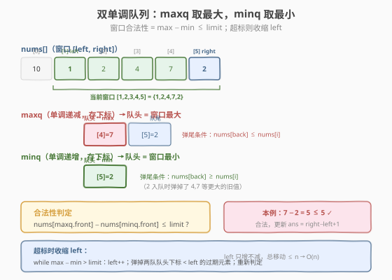
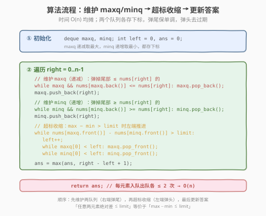
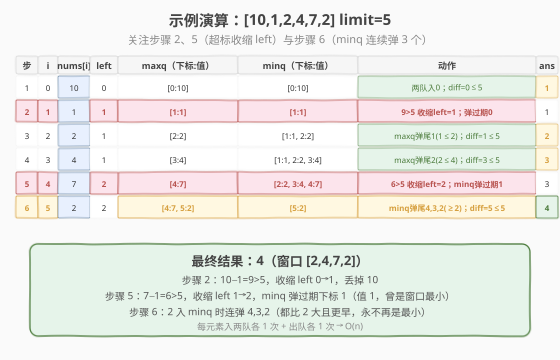

# 绝对差不超过限制的最长连续子数组

- **题目名称**：绝对差不超过限制的最长连续子数组
- **链接**：[1438. 绝对差不超过限制的最长连续子数组](https://leetcode.cn/problems/longest-continuous-subarray-with-absolute-diff-less-than-or-equal-to-limit/)
- **难度**：中等
- **标签**：数组、滑动窗口、单调队列、双指针

## 1. 题目概述

给定一个整数数组 `nums` 和一个整数 `limit`，请你返回**最长**的**非空连续子数组**的长度，使得该子数组中**任意两个元素**之间的绝对差**小于或等于** `limit`。

**示例 1**：

```text
输入：nums = [8,2,4,7], limit = 4
输出：2
解释：所有满足条件的子数组及最大−最小差：
     [8]      diff=0   ✓  len=1
     [8,2]    diff=6   ✗
     [2]      diff=0   ✓  len=1
     [2,4]    diff=2   ✓  len=2
     [2,4,7]  diff=5   ✗
     [4,7]    diff=3   ✓  len=2
     最长长度为 2。
```

**示例 2**：

```text
输入：nums = [10,1,2,4,7,2], limit = 5
输出：4
解释：最长合法子数组为 [2,4,7,2]，max−min = 7−2 = 5 ≤ 5。
```

**示例 3**：

```text
输入：nums = [4,2,2,2,4,4,2,2], limit = 0
输出：3
解释：limit=0 要求所有元素相等，最长等值连续段为 [2,2,2]，长度 3。
```

**约束条件**：

- $1 \le \text{nums.length} \le 10^5$
- $1 \le \text{nums[i]} \le 10^9$
- $0 \le \text{limit} \le 10^9$

> 💡 关键化简：「子数组中**任意两个元素**的绝对差 $\le \text{limit}$」等价于「子数组的 $\max - \min \le \text{limit}$」。因为任意两元素之差的上确界就是最大值与最小值之差——只要极差不超标，所有两两之差都不会超标。于是问题归约为：**维护窗口内的最大值与最小值**，这正是 [239. 滑动窗口最大值](../0201-0300/239_滑动窗口最大值.md) 的单调队列场景，只是同时需要 max 和 min，用**两个**单调队列即可。

---

## 2. 解题思路

### 2.1 暴力思路：枚举所有子数组

枚举所有连续子数组 $[i, j]$，对每个子数组线性扫描求 $\max$ 与 $\min$，判断 $\max - \min \le \text{limit}$。共有 $O(n^2)$ 个子数组，每个判断 $O(n)$，总复杂度 $O(n^3)$（边扩展边维护极值可降到 $O(n^2)$），$n = 10^5$ 时严重超时。

> ⚠️ 暴力的浪费在于：相邻子数组大量重叠，却每次重新求 $\max/\min$。需要一种结构**动态维护窗口内的最值**——单调队列正好胜任。

### 2.2 核心观察：双单调队列维护窗口极值



用**两个双端队列**同时维护窗口 $[\text{left}, \text{right}]$ 内的极值：

- **`maxq`（单调递减）**：存下标，对应值从队头到队尾**递减**。队头 = 窗口**最大值**。新元素 `nums[right]` 入队前，从队尾弹出所有 $\le \text{nums[right]}$ 的（它们更小且更早，永不再成为最大）。
- **`minq`（单调递增）**：存下标，对应值从队头到队尾**递增**。队头 = 窗口**最小值**。新元素入队前，从队尾弹出所有 $\ge \text{nums[right]}$ 的（它们更大且更早，永不再成为最小）。

合法性判定只需 $O(1)$ 比较：

$$\text{合法} \iff \text{nums}[\text{maxq.front()}] - \text{nums}[\text{minq.front()}] \le \text{limit}$$

一旦超标（$\max - \min > \text{limit}$），就收缩左端：`left++`，并把两个队列队头中下标 $< \text{left}$ 的过期元素弹出，直到重新合法。

> 💡 **为什么需要两个队列而不是一个？** 一个单调队列只能维护「一个方向」的最值——递减队列给最大值，递增队列给最小值。极差需要 max 和 min 两个端点，所以各用一个队列。两个队列**独立维护**、互不干扰：`maxq` 只关心谁最大，`minq` 只关心谁最小，弹出条件互不影响。

### 2.3 算法流程图



**完整步骤**（遍历 `right` 从 $0$ 到 $n-1$）：

1. **维护 maxq**（右端弹尾保递减）：`while maxq 非空 且 nums[maxq.back()] ≤ nums[right]：maxq.pop_back()`；`maxq.push_back(right)`。
2. **维护 minq**（右端弹尾保递增）：`while minq 非空 且 nums[minq.back()] ≥ nums[right]：minq.pop_back()`；`minq.push_back(right)`。
3. **超标收缩**：`while nums[maxq.front()] - nums[minq.front()] > limit`：
   - `left++`
   - `while maxq.front() < left：maxq.pop_front()`（过期出队）
   - `while minq.front() < left：minq.pop_front()`
4. **更新答案**：`ans = max(ans, right - left + 1)`。

> ⚠️ **顺序**：先维护两个队列（右端入队弹尾），再判超标收缩（左端过期出队），最后更新答案。收缩时两队的过期检查都做——`maxq` 队头过期则弹 `maxq`，`minq` 队头过期则弹 `minq`，互不影响。

### 2.4 示例演算

以示例 2 `nums = [10,1,2,4,7,2], limit = 5` 为例：



| 步 | right | nums[right] | left | maxq（下标:值） | minq（下标:值） | 动作 | ans |
|----|-------|-------------|------|-----------------|-----------------|------|-----|
| 1 | 0 | 10 | 0 | `[0:10]` | `[0:10]` | 两队入 0；diff=0≤5 | 1 |
| 2 | 1 | 1 | 1 | `[1:1]` | `[1:1]` | minq 弹尾 0(10≥1)入 1；maxq 入 1；9>5 收缩 left=1，maxq 弹过期 0 | 1 |
| 3 | 2 | 2 | 1 | `[2:2]` | `[1:1, 2:2]` | maxq 弹尾 1(1≤2)入 2；minq 入 2；diff=1≤5 | 2 |
| 4 | 3 | 4 | 1 | `[3:4]` | `[1:1, 2:2, 3:4]` | maxq 弹尾 2(2≤4)入 3；minq 入 3；diff=3≤5 | 3 |
| 5 | 4 | 7 | 2 | `[4:7]` | `[2:2, 3:4, 4:7]` | maxq 弹尾 3(4≤7)入 4；6>5 收缩 left=2，minq 弹过期 1；diff=5≤5 | 3 |
| 6 | 5 | 2 | 2 | `[4:7, 5:2]` | `[5:2]` | maxq 入 5(2<7)；minq 弹尾 4,3,2(≥2)入 5；diff=5≤5 | 4 |

**步骤 2 是关键**：`1` 入队后窗口极差 $10-1=9>5$，必须收缩。`left` 从 0 推到 1，丢掉 `nums[0]=10`——此时 `maxq` 队头下标 0 过期被弹出，窗口最大值随之更新为 1。

**步骤 5 同理**：`7` 入队后极差 $7-1=6>5$，收缩 `left` 到 2。被丢掉的 `nums[1]=1` 恰是窗口最小值，它在 `minq` 队头，过期后被弹出，窗口最小值更新为 `nums[2]=2`，极差降为 $7-2=5$ 恰好合法。

**步骤 6 演示 minq 批量弹尾**：`2` 入 `minq` 时连续弹掉下标 4(7)、3(4)、2(2)——它们都 $\ge 2$ 且更早，只要下标 5 还在窗口里，这些旧值永远不可能再成为最小。

> 💡 每个元素在两个队列中**各入队 1 次、出队 1 次**（弹尾或过期），总操作 $\le 4n$，整体 $O(n)$。与 [239](../0201-0300/239_滑动窗口最大值.md) 的均摊分析完全一致——只是队列从一个变成两个。

---

## 3. 参考代码

### C++

```cpp
// 绝对差不超过限制的最长连续子数组.cpp —— 双单调队列 + 滑动窗口，O(n)
// 编译: g++ -O2 -std=c++17 绝对差不超过限制的最长连续子数组.cpp -o lcd
#include <vector>
#include <deque>
using namespace std;

class Solution {
  public:
    int longestSubarray(vector<int>& nums, int limit) {
        deque<int> maxq;   // 单调递减，队头 = 窗口最大
        deque<int> minq;   // 单调递增，队头 = 窗口最小
        int left = 0, ans = 0;
        for (int right = 0; right < (int)nums.size(); ++right) {
            // ① 维护 maxq：弹掉尾部 ≤ nums[right] 的
            while (!maxq.empty() && nums[maxq.back()] <= nums[right]) {
                maxq.pop_back();
            }
            maxq.push_back(right);
            // ② 维护 minq：弹掉尾部 ≥ nums[right] 的
            while (!minq.empty() && nums[minq.back()] >= nums[right]) {
                minq.pop_back();
            }
            minq.push_back(right);
            // ③ 超标收缩：max − min > limit 时左端推进
            while (nums[maxq.front()] - nums[minq.front()] > limit) {
                ++left;
                while (!maxq.empty() && maxq.front() < left) {
                    maxq.pop_front();
                }
                while (!minq.empty() && minq.front() < left) {
                    minq.pop_front();
                }
            }
            // ④ 更新答案
            ans = max(ans, right - left + 1);
        }
        return ans;
    }
};
```

### Python

```python
from collections import deque

class Solution:
    def longestSubarray(self, nums: list[int], limit: int) -> int:
        maxq = deque()   # 单调递减，队头 = 窗口最大
        minq = deque()   # 单调递增，队头 = 窗口最小
        left = 0
        ans = 0
        for right, x in enumerate(nums):
            # ① 维护 maxq
            while maxq and nums[maxq[-1]] <= x:
                maxq.pop()
            maxq.append(right)
            # ② 维护 minq
            while minq and nums[minq[-1]] >= x:
                minq.pop()
            minq.append(right)
            # ③ 超标收缩
            while nums[maxq[0]] - nums[minq[0]] > limit:
                left += 1
                while maxq and maxq[0] < left:
                    maxq.popleft()
                while minq and minq[0] < left:
                    minq.popleft()
            # ④ 更新答案
            ans = max(ans, right - left + 1)
        return ans
```

> 💡 **实现细节**：① 两个队列都**存下标**而非值——既要维护单调性，又要判断是否过期（下标 $< \text{left}$）。② 收缩时对两个队列**分别**做过期出队，因为被丢掉的 `nums[left-1]` 可能是最大值（在 `maxq` 队头）、也可能是最小值（在 `minq` 队头）、甚至两者都不是（在队列中部，无需处理——它会在后续弹尾或过期时自然消失）。③ `left` 只增不减，总移动 $\le n$，收缩的 `while` 均摊 $O(1)$。

---

## 4. 复杂度分析

| 维度 | 复杂度 | 说明 |
|------|--------|------|
| **时间复杂度** | $O(n)$ | 每个下标在 `maxq`、`minq` 中各入队 1 次、出队 1 次（弹尾或过期），总操作 $\le 4n$；`left` 累计右移 $\le n$ |
| **空间复杂度** | $O(n)$ | 两个队列最坏各存 $n$ 个下标（如数组单调时） |

> ⚠️ 虽然收缩用了嵌套 `while`，但**均摊分析**：每个下标至多从每个队列的右端入队 1 次、从左端或右端出队 1 次，两个队列的总操作 $\le 4n$，故总时间 $O(n)$。这是所有单调结构的共性——与 [239. 滑动窗口最大值](../0201-0300/239_滑动窗口最大值.md) 的论证一致，只是队列翻倍。

---

## 5. 扩展：有序集合的 $O(n \log n)$ 解法

若不熟悉单调队列，可用**有序容器**维护窗口内的元素，$O(\log n)$ 取最大最小：

- **C++**：`std::multiset`，`*s.rbegin()` 取最大、`*s.begin()` 取最小，`s.erase(s.find(x))` 删除指定元素。
- **Python**：`sortedcontainers.SortedList`（非标准库，力扣可用），`s[-1]` 取最大、`s[0]` 取最小。

```cpp
#include <set>
#include <vector>
class Solution {
  public:
    int longestSubarray(vector<int>& nums, int limit) {
        multiset<int> s;
        int left = 0, ans = 0;
        for (int right = 0; right < (int)nums.size(); ++right) {
            s.insert(nums[right]);
            while (*s.rbegin() - *s.begin() > limit) {
                s.erase(s.find(nums[left]));
                ++left;
            }
            ans = max(ans, right - left + 1);
        }
        return ans;
    }
};
```

有序集合每次插入/删除 $O(\log n)$，总 $O(n \log n)$。它不利用「窗口连续滑动」的特性（不知道哪些元素该弹），需显式按值删除。单调队列利用了窗口连续性，新元素入队时批量弹掉「更弱且更早」的旧元素，把单次操作降到均摊 $O(1)$，总 $O(n)$ 更优。

> 💡 **何时选有序集合？** 当窗口的「合法性条件」不是简单的极值差，而是任意值域约束（如 [220. 存在重复元素 III](../0201-0300/220_存在重复元素III.md) 的「存在差值 ≤ t 的两元素」），单调队列难以维护时，有序集合的 `lower_bound` 查询更通用。本题只需 $\max - \min$，单调队列是首选。

---

## 6. 面试要点

1. **「任意两元素绝对差 ≤ limit」为什么等价于「max − min ≤ limit」？**

   > 子数组中任意两元素之差的上确界就是最大值与最小值之差。若 $\max - \min \le \text{limit}$，则对任意 $a, b$ 有 $|a - b| \le \max - \min \le \text{limit}$；反之若存在 $|a - b| > \text{limit}$，则 $\max - \min \ge |a - b| > \text{limit}$。这一化简把「检查所有两两组合」降为「维护两个极值」。

2. **为什么用两个单调队列而不是两个堆或有序集合？**

   > 单调队列 $O(n)$，堆 $O(n \log n)$（需懒惰删除），有序集合 $O(n \log n)$（需按值删除）。本题窗口**连续滑动**，单调队列能利用这一特性：新元素入队时批量弹掉「更弱且更早」的旧元素，单次均摊 $O(1)$。堆/有序集合不利用窗口连续性，常数更大。当窗口连续滑动且只需极值时，单调队列最优。

3. **收缩时为什么要对两个队列都做过期检查？**

   > 被丢掉的 `nums[left-1]` 可能是当前窗口的最大值（在 `maxq` 队头）、最小值（在 `minq` 队头），或两者都不是。若它是极值，对应队列的队头会过期（下标 $< \text{left}$）需弹出；若不是极值，它在队列中部，不影响队头，会在后续弹尾或自然过期时消失。对两队都检查 `< left` 是最安全的做法，且均摊 $O(1)$。

4. **`left` 只增不减，为什么总移动是 $O(n)$？**

   > `left` 从 0 出发单调递增，最多到 $n-1$，全程累计移动 $\le n$。虽然写在 `while` 里，但均摊到每轮 `right` 是 $O(1)$——这是「双指针/滑窗」的标准均摊分析，与 [713. 乘积小于 K 的子数组](../0701-0800/713_乘积小于K的子数组.md) 一致。

5. **如果 `limit = 0`，本题退化成什么？**

   > 退化成「最长等值连续段」——$\max - \min \le 0$ 要求窗口内所有元素相等。两个单调队列仍正确工作：窗口内一旦出现两个不同值，极差 $>0$ 即触发收缩，最终只保留等值段。也可用一次遍历计数最长等值段，但单调队列解法无需特判，天然覆盖。

> 💡 **一句话总结**：1438 的本质是「**滑动窗口 + 双单调队列维护极值差**」——把「任意两元素绝对差 ≤ limit」化简为「$\max - \min \le \text{limit}$」，再用 [239. 滑动窗口最大值](../0201-0300/239_滑动窗口最大值.md) 的单调队列模板同时维护 max 和 min 两个队列，超标时收缩左端，整体 $O(n)$。这是单调队列从「单最值」到「双极值差」的自然推广。

---

## 7. 同类练习题

- [239. 滑动窗口最大值](https://leetcode.cn/problems/sliding-window-maximum/)（[题解](../0201-0300/239_滑动窗口最大值.md)）：单调队列招牌题，维护窗口 max；本题把它复制一份维护 min，双队列协同
- [220. 存在重复元素 III](https://leetcode.cn/problems/contains-duplicate-iii/)（[题解](../0201-0300/220_存在重复元素III.md)）：同为滑动窗口值域约束，用桶分桶或有序集合的 `lower_bound` 查近似值
- [713. 乘积小于 K 的子数组](https://leetcode.cn/problems/subarray-product-less-than-k/)（[题解](../0701-0800/713_乘积小于K的子数组.md)）：正数滑窗 + 左端收缩，共享「left 只增不减均摊 $O(n)$」的分析
- [209. 长度最小的子数组](https://leetcode.cn/problems/minimum-size-subarray-sum/)（[题解](../0201-0300/209_长度最小的子数组.md)）：正数滑窗求最短长度，与本题求最长长度方向相反但套路相同
- [1425. 带限制的子序列和](https://leetcode.cn/problems/constrained-subsequence-sum/)（[题解](../1401-1500/1425_带限制的子序列和.md)）：单调队列优化 DP，维护 `dp` 的窗口 max，与本题同属单调队列家族
