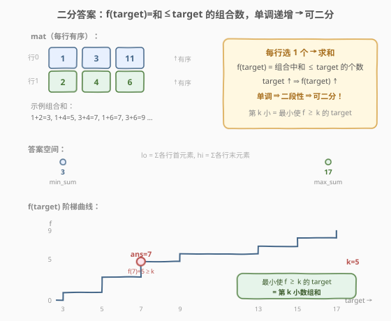
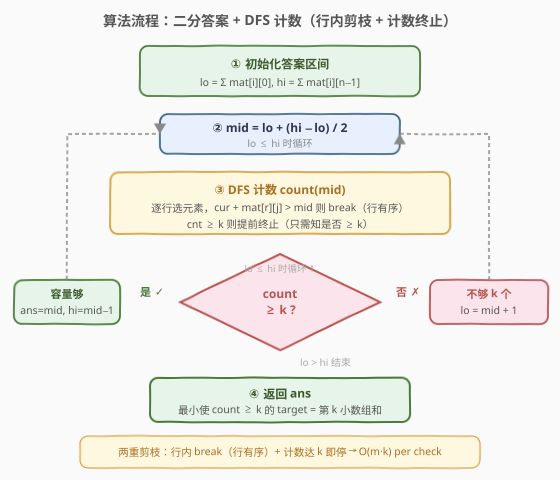

# 有序矩阵中的第k个最小数组和

- **题目名称**：有序矩阵中的第k个最小数组和
- **链接**：[1439. 有序矩阵中的第 k 个最小数组和](https://leetcode.cn/problems/find-the-kth-smallest-sum-of-a-matrix-with-sorted-rows/)
- **难度**：困难
- **标签**：数组、二分查找、矩阵、堆

## 1. 题目概述

给定一个 $m \times n$ 的矩阵 `mat`，其中**每一行**都按**非递减**顺序排列，以及一个整数 `k`。你可以从每一行中选出**恰好 1 个**元素形成一个数组。返回所有可能数组中的**第 `k` 个最小**数组和。

**示例 1**：

```text
输入：mat = [[1,3,11],[2,4,6]], k = 5
输出：7
解释：从每一行中选出一个元素，前 k 个和最小的数组分别是：
     [1,2], [1,4], [3,2], [3,4], [1,6]。其中第 5 个的和是 7。
```

**示例 2**：

```text
输入：mat = [[1,3,11],[2,4,6]], k = 9
输出：17
```

**示例 3**：

```text
输入：mat = [[1,10,10],[1,4,5],[2,3,6]], k = 7
输出：9
解释：从每一行中选出一个元素，前 k 个和最小的数组分别是：
     [1,1,2], [1,1,3], [1,4,2], [1,4,3], [1,1,6], [1,5,2], [1,5,3]。其中第 7 个的和是 9。
```

**约束条件**：

- `m == mat.length`
- `n == mat[i].length`
- `1 <= m, n <= 40`
- `1 <= k <= min(200, n^m)`
- `1 <= mat[i][j] <= 5000`
- `mat[i]` 是非递减数组

> ⚠️ 注意：$n^m$ 可达 $40^{40}$，**枚举所有组合不可行**。但 $k \le 200$ 是破题关键——不需要排序所有组合，只需找到第 k 小。

---

## 2. 解题思路

### 2.1 暴力思路

最直接的想法是**枚举所有 $n^m$ 个组合**，计算每个组合的和，排序后取第 $k$ 个。$m = n = 40$ 时 $n^m$ 是天文数字，完全不可行。

注意到答案（第 k 小的数组和）一定落在 $[\sum \text{各行首元素},\ \sum \text{各行末元素}]$ 之间——前者是全选每行最小值的和，后者是全选每行最大值的和。能否**不枚举组合，而是二分枚举答案**？对每个候选值 `target`，判断「有多少个组合的和 $\le$ `target`」。若能高效计数，就能二分定位答案。

### 2.2 核心观察：二分答案 + DFS 计数



关键直觉是：**和 $\le$ `target` 的组合数 `f(target)` 关于 `target` 单调递增**。

- `target` 越大，满足条件的组合越多。
- `target = min_sum`（各行首元素之和）时，只有 1 个组合满足（全选首元素），`f = 1`。
- `target = max_sum`（各行末元素之和）时，所有 $n^m$ 个组合都满足，`f = n^m`。

于是存在一个**分界点** `target*`：

```text
target < target* → f(target) < k   (不够 k 个)
target >= target* → f(target) >= k  (至少 k 个)
```

这个 `target*` 就是第 k 小的数组和——它是**最小的使 `f(target) >= k` 的值**，且必是某个实际组合的和（因为 `f` 只在组合和处跳变）。

> 💡 **识别信号**：题目求「第 k 小」且候选值域可二分、计数可剪枝 → 想「二分答案」。本题与 [719. 找出第 K 小的数对距离](../0701-0800/719_找出第K小的数对距离.md) 同骨架——都是「二分答案 + 计数验证」的第 k 小问题，只是 `count()` 换成了「DFS 逐行选 + 行内剪枝」。

**计数的关键剪枝**：DFS 逐行选元素，利用**行有序**做两重剪枝：

1. **行内剪枝**：在行 `r` 中从左到右尝试，一旦 `cur + mat[r][j] > target` 就 `break`（后续更大，必超）。
2. **计数提前终止**：一旦计数达到 `k` 就停止（只需知道「是否 $\ge$ k」，不需要精确值）。

### 2.3 算法流程图



注意判定为「`count >= k`」时**先记录 `ans = mid` 再收缩右界**（`hi = mid - 1`），保证最终保留的是「最小的可行 `target`」。

### 2.4 示例演算

![示例演算：mat = [[1,3,11],[2,4,6]], k = 5](../images/1439_example_walkthrough.svg)

以 `mat = [[1,3,11],[2,4,6]]`、`k = 5` 为例，`min_sum = 1+2 = 3`、`max_sum = 11+6 = 17`，在 `[3, 17]` 上二分：

| 轮次 | 区间 | mid | count(mid)（和≤mid 的组合数） | 判定 | 操作 |
|------|------|-----|-------------------------------|------|------|
| 1 | [3,17] | 10 | 6（3,5,5,7,7,9） | 6≥5 ✓ | ans=10, hi=9 |
| 2 | [3,9] | 6 | 3（3,5,5） | 3<5 ✗ | lo=7 |
| 3 | [7,9] | 8 | 5（3,5,5,7,7） | 5≥5 ✓ | ans=8, hi=7 |
| 4 | [7,7] | 7 | 5（3,5,5,7,7） | 5≥5 ✓ | ans=7, hi=6 |
| — | lo=7>hi=6 | — | — | 结束 | 返回 7 |

> 💡 **为什么 `count(7) = 5` 而非 4？** 因为和等于 7 的组合有两个：`1+6` 和 `3+4`，它们都 $\le 7$。第 k 小的值是 7，意味着前 5 个和为 `[3, 5, 5, 7, 7]`，第 5 个恰是 7。二分找到的是「使 `f(target) >= 5` 的最小 `target`」，即 7。

---

## 3. 参考代码

### 方法一：二分答案 + DFS 计数（推荐）

### C++

```cpp
class Solution {
  public:
    int m, n;
    int kthSmallest(vector<vector<int>>& mat, int k) {
        m = mat.size(), n = mat[0].size();
        int lo = 0, hi = 0;
        for (int i = 0; i < m; ++i) {
            lo += mat[i][0];       // 各行首元素之和 = 最小和
            hi += mat[i][n - 1];   // 各行末元素之和 = 最大和
        }
        int ans = hi;
        while (lo <= hi) {
            int mid = lo + (hi - lo) / 2;
            if (countLE(mat, 0, 0, mid, k) >= k) {
                ans = mid;
                hi = mid - 1;
            } else {
                lo = mid + 1;
            }
        }
        return ans;
    }

  private:
    int countLE(vector<vector<int>>& mat, int row, int cur, int target, int k) {
        if (row == m) return 1;
        int cnt = 0;
        for (int j = 0; j < n; ++j) {
            if (cur + mat[row][j] > target) break;
            cnt += countLE(mat, row + 1, cur + mat[row][j], target, k);
            if (cnt >= k) break;
        }
        return cnt;
    }
};
```

### Python

```python
class Solution:
    def kthSmallest(self, mat: List[List[int]], k: int) -> int:
        m, n = len(mat), len(mat[0])
        lo = sum(row[0] for row in mat)
        hi = sum(row[-1] for row in mat)

        def count_le(row: int, cur: int, target: int) -> int:
            if row == m:
                return 1
            cnt = 0
            for j in range(n):
                if cur + mat[row][j] > target:
                    break
                cnt += count_le(row + 1, cur + mat[row][j], target)
                if cnt >= k:
                    break
            return cnt

        ans = hi
        while lo <= hi:
            mid = (lo + hi) // 2
            if count_le(0, 0, mid) >= k:
                ans = mid
                hi = mid - 1
            else:
                lo = mid + 1
        return ans
```

> ⚠️ **三个关键点**：
> 1. **下界取各行首元素之和**：这是最小可能的数组和，保证二分区间紧凑。
> 2. **计数提前终止**：`cnt >= k` 即 `break`，避免深搜遍历所有组合。最坏情况计数不超过 $k$ 次完整路径，$k \le 200$。
> 3. **行内剪枝**：`cur + mat[row][j] > target` 即 `break`，利用行有序跳过更大元素。

---

## 4. 复杂度分析

| 维度 | 方法 | 复杂度 | 说明 |
|------|------|--------|------|
| 时间复杂度 | 二分答案 + DFS | $O(m \cdot k \cdot \log(\text{sum}))$ | 二分 $O(\log(\text{max\_sum}))$ 次，每次 DFS 计数至多访问 $k$ 条完整路径，每条 $O(m)$ |
| 空间复杂度 | 二分答案 + DFS | $O(m)$ | DFS 递归深度为行数 $m$ |
| 时间复杂度 | 逐行归并 | $O(m \cdot n \cdot k \cdot \log(n \cdot k))$ | 每行与当前前 k 和做笛卡尔积后排序取前 k |
| 空间复杂度 | 逐行归并 | $O(n \cdot k)$ | 中间归并数组 |

> 💡 $m, n \le 40$、$k \le 200$、$\text{max\_sum} \le 40 \times 5000 = 2 \times 10^5$。二分答案：$40 \times 200 \times \log(2 \times 10^5) \approx 40 \times 200 \times 18 \approx 1.4 \times 10^5$，极快。逐行归并：$40 \times 40 \times 200 \times \log(8000) \approx 1.7 \times 10^6$，同样高效。**面试首选二分答案**——思路更通用，且能解释第 k 小的本质。

---

## 5. 扩展：逐行归并保留前 k 小

除二分答案外，本题也可用**逐行归并**——类似 k 路归并的思想，逐行累加，每步只保留前 k 小的和：

1. 初始 `sums = [0]`（空选和为 0）；
2. 对每一行 `row`，将 `sums` 中每个元素与 `row` 中每个元素相加，得到新候选集；
3. 排序后只取前 `k` 个，作为新的 `sums`；
4. 处理完所有行后，`sums[k-1]` 即答案。

### C++

```cpp
class Solution {
  public:
    int kthSmallest(vector<vector<int>>& mat, int k) {
        vector<int> sums = {0};
        for (auto& row : mat) {
            vector<int> next;
            for (int s : sums) {
                for (int x : row) {
                    next.push_back(s + x);
                }
            }
            sort(next.begin(), next.end());
            sums.assign(next.begin(), next.begin() + min((int)next.size(), k));
        }
        return sums[k - 1];
    }
};
```

### Python

```python
class Solution:
    def kthSmallest(self, mat: List[List[int]], k: int) -> int:
        sums = [0]
        for row in mat:
            sums = sorted(a + b for a in sums for b in row)[:k]
        return sums[k - 1]
```

> 💡 **两种方法的取舍**：逐行归并思路直观、实现极简（Python 一行核心逻辑），但 $O(m \cdot n \cdot k \cdot \log(n \cdot k))$ 稍慢。二分答案利用行有序剪枝，复杂度与 $k$ 而非 $n^m$ 挂钩，且揭示了「第 k 小 = 最小使计数达 k 的值」的本质。**面试中先讲二分答案展现实力，再提归并作为简洁替代**。

---

## 6. 面试要点

1. **为什么能二分？二段性体现在哪？**

   - 和 $\le$ `target` 的组合数 `f(target)` 随 `target` 单调递增。存在分界点 `target*`，使 `target < target*` 时 `f < k`（不够）、`target >= target*` 时 `f >= k`（够）。这种「左不够 / 右够」的结构就是二段性。

2. **DFS 计数为什么不会超时？**

   - 两重剪枝：① 行内剪枝——行有序，`cur + mat[row][j] > target` 即 `break`，跳过更大元素；② 计数提前终止——`cnt >= k` 即停，不深搜剩余组合。最坏情况访问 $k$ 条完整路径，每条 $O(m)$，总计 $O(m \cdot k)$。

3. **答案为什么一定是某个实际组合的和？**

   - `f(target)` 是阶梯函数，只在「实际组合和」处跳变。二分找到的「最小使 `f >= k` 的 `target`」恰是某个跳变点，即实际组合和。若 `target` 不是组合和，`f(target) = f(target-1)`，`target` 不会是最小值。

4. **k 的约束（$k \le 200$）如何被利用？**

   - 计数提前终止依赖 `k` 小——一旦数到 `k` 就停，避免遍历 $n^m$ 个组合。若 $k$ 很大（如 $n^m$），DFS 计数退化为枚举，二分答案失效。

5. **和 [378. 有序矩阵中第K小的元素](../0301-0400/378_有序矩阵中第K小的元素.md) 有何异同？**

   - 378 是在矩阵中找第 k 小的**单个元素**（行列皆有序，小顶堆 k 路归并）；1439 是找第 k 小的**行选组合和**（仅行有序，组合爆炸）。378 用堆归并，1439 用二分答案 + DFS 计数——区别在于 1439 的候选空间是组合和而非矩阵元素，无法直接归并。

---

## 7. 同类练习题

- [719. 找出第 K 小的数对距离](https://leetcode.cn/problems/find-k-th-smallest-pair-distance/)：同骨架——二分答案 + 双指针计数，求第 k 小的数对距离
- [410. 分割数组的最大值](../0401-0500/410_分割数组的最大值.md)：同模板——二分答案 + 贪心验证，求最小化最大段和
- [378. 有序矩阵中第K小的元素](../0301-0400/378_有序矩阵中第K小的元素.md)：矩阵第 k 小的另一形态——堆 k 路归并（行列皆有序）
- [668. 乘法表中第k小的数](https://leetcode.cn/problems/kth-smallest-number-in-multiplication-table/)：二分答案 + 计数验证，求乘法表第 k 小
- [373. 查找和最小的K对数字](../0301-0400/373_查找和最小的K对数字.md)：堆归并取前 k 小和，1439 逐行归并的二维版
