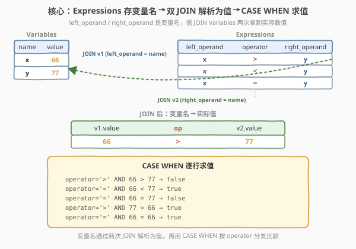
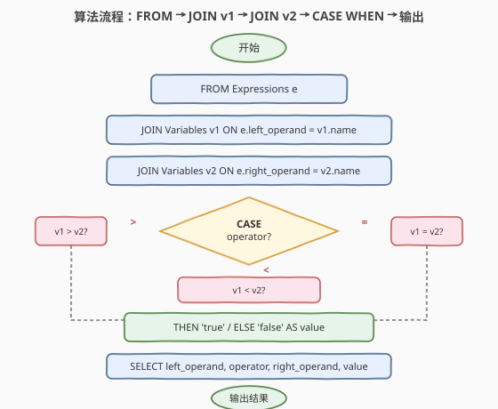
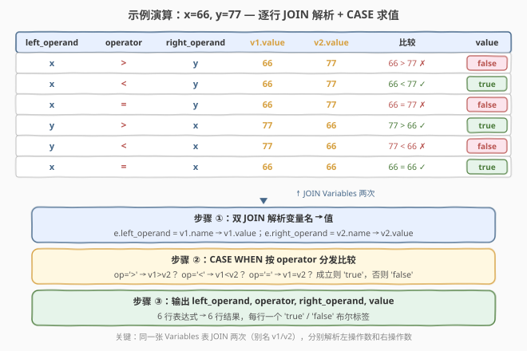

# 计算布尔表达式的值

- **题目名称**：计算布尔表达式的值
- **链接**：[1440. 计算布尔表达式的值](https://leetcode.cn/problems/evaluate-boolean-expression/)
- **难度**：中等
- **标签**：SQL、JOIN、CASE WHEN、自连接

## 1. 题目概述

给定两张表：`Variables` 存储变量名及其数值，`Expressions` 存储由变量名和运算符组成的布尔表达式。编写 SQL 查询，对 `Expressions` 表中的每行表达式求值，输出原三列并追加一列 `value`（取值 `"true"` / `"false"`），结果顺序不限。

**表结构**：

```text
Table: Variables
+-------------+------------+
| Column Name | Type       |
+-------------+------------+
| name        | varchar(3) |
| value       | int        |
+-------------+------------+
name 是主键

Table: Expressions
+-------------+-----------------------------------+
| Column Name | Type                              |
+-------------+-----------------------------------+
| left_operand| varchar(3)                        |
| operator    | enum('>', '<', '=')               |
| right_operand| varchar(3)                       |
+-------------+-----------------------------------+
(left_operand, operator, right_operand) 是主键
```

> 💡 **关键点**：`Expressions` 表中的 `left_operand` 和 `right_operand` 存的是**变量名**（如 `'x'`、`'y'`），而非数值本身。要求值，必须先通过 JOIN 从 `Variables` 表中查出对应变量的实际值，再做比较。

**示例 1**：

```text
输入：
Variables 表:
+------+-------+
| name | value |
+------+-------+
| x    | 66    |
| y    | 77    |
+------+-------+

Expressions 表:
+--------------+----------+--------------+
| left_operand | operator | right_operand|
+--------------+----------+--------------+
| x            | >        | y            |
| x            | <        | y            |
| x            | =        | y            |
| y            | >        | x            |
| y            | <        | x            |
| x            | =        | x            |
+--------------+----------+--------------+

输出：
+--------------+----------+--------------+-------+
| left_operand | operator | right_operand| value |
+--------------+----------+--------------+-------+
| x            | >        | y            | false |
| x            | <        | y            | true  |
| x            | =        | y            | false |
| y            | >        | x            | true  |
| y            | <        | x            | false |
| x            | =        | x            | true  |
+--------------+----------+--------------+-------+
```

**解释**：

- `x > y`：66 > 77 → `false`
- `x < y`：66 < 77 → `true`
- `x = y`：66 = 77 → `false`
- `y > x`：77 > 66 → `true`
- `y < x`：77 < 66 → `false`
- `x = x`：66 = 66 → `true`

**约束条件**：

- `Variables.name` 为 `varchar(3)`，是主键
- `Expressions` 的 `(left_operand, operator, right_operand)` 为复合主键
- `operator` 是 ENUM 类型，取值仅为 `'>'`、`'<'`、`'='`
- `left_operand` 和 `right_operand` 一定能在 `Variables` 表中找到对应变量
- 结果以任意顺序返回，新增列名为 `value`

> 💡 **核心考点**：同一张表 JOIN 两次（别名 v1 / v2），分别解析左操作数和右操作数的变量名到实际值，再用 `CASE WHEN` 按 `operator` 分发不同的比较逻辑。这是 SQL「自连接 + 条件派生列」的经典组合。

---

## 2. 解题思路

### 2.1 暴力思路：三个子查询 UNION ALL

最直觉的做法：按 `operator` 分成三组，每组单独写一个 SELECT，分别处理 `>`、`<`、`=`，最后 `UNION ALL` 拼起来。每个子查询都 JOIN 两次 `Variables` 取值，再用 `IF` 判断。

```sql
SELECT left_operand, '>', right_operand,
       IF(v1.value > v2.value, 'true', 'false') AS value
FROM Expressions e
JOIN Variables v1 ON e.left_operand = v1.name
JOIN Variables v2 ON e.right_operand = v2.name
WHERE e.operator = '>'
UNION ALL
SELECT left_operand, '<', right_operand,
       IF(v1.value < v2.value, 'true', 'false') AS value
FROM Expressions e
JOIN Variables v1 ON e.left_operand = v1.name
JOIN Variables v2 ON e.right_operand = v2.name
WHERE e.operator = '<'
UNION ALL
SELECT left_operand, '=', right_operand,
       IF(v1.value = v2.value, 'true', 'false') AS value
FROM Expressions e
JOIN Variables v1 ON e.left_operand = v1.name
JOIN Variables v2 ON e.right_operand = v2.name
WHERE e.operator = '=';
```

- **正确**：每种运算符独立处理，逻辑清晰无误。
- **冗长**：JOIN 逻辑重复三遍，若新增运算符（如 `>=`、`!=`）需再加一段，扩展性差。

> ⚠️ 暴力的浪费在于「**重复 JOIN**」。三段子查询的 JOIN 逻辑完全相同，只是比较运算不同——JOIN 结果应只算一次，用 `CASE WHEN` 在同一行内按 `operator` 分发即可。

### 2.2 核心观察：双 JOIN + CASE WHEN 统一分发



两步观察把三段 UNION 压成一条查询：

**观察一（双 JOIN 解析变量名）**：`Expressions` 存的是变量名而非值，需 JOIN `Variables` 两次——一次用 `left_operand` 匹配（别名 `v1`），一次用 `right_operand` 匹配（别名 `v2`）。同一张表 JOIN 两次是 SQL 解析「两侧引用同一字典」的标准手法。

**观察二（CASE WHEN 按运算符分发）**：JOIN 后每行已拿到 `v1.value` 和 `v2.value`，只需按 `operator` 选择比较方式。用 `CASE WHEN` 在一行内三分支判定，避免拆成三个子查询：

$$\text{value} = \begin{cases} v_1.\text{value} > v_2.\text{value} & \text{if operator} = \text{'>'} \\ v_1.\text{value} < v_2.\text{value} & \text{if operator} = \text{'<'} \\ v_1.\text{value} = v_2.\text{value} & \text{if operator} = \text{'='} \end{cases}$$

> 💡 **一句话**：识别出「JOIN 逻辑与运算符无关」⟹ JOIN 只做一次；再用 `CASE WHEN` 在同一行按 `operator` 分发比较。这是「**公共子结构提取 + 条件分发**」的 SQL 范式——类似代码中提取公共前缀再用 switch 分支。

> ⚠️ **为何是 JOIN 而非 LEFT JOIN**：题目保证 `left_operand` 和 `right_operand` 一定能在 `Variables` 中找到，故用内 JOIN 即可。若可能存在未定义变量，应改用 `LEFT JOIN` 并对 `NULL` 值做 `COALESCE` 兜底。

### 2.3 算法流程图



| 步骤 | SQL 子句 | 作用 |
|------|----------|------|
| ① | `FROM Expressions e` | 逐行读取表达式 `(left_operand, operator, right_operand)` |
| ② | `JOIN Variables v1 ON e.left_operand = v1.name` | 用左操作数变量名匹配 `Variables`，拿到 `v1.value` |
| ③ | `JOIN Variables v2 ON e.right_operand = v2.name` | 用右操作数变量名匹配 `Variables`，拿到 `v2.value` |
| ④ | `CASE WHEN ... THEN 'true' ELSE 'false' END` | 按 `operator` 分发比较，成立则 `'true'`，否则 `'false'` |

> 💡 **执行顺序**：`FROM` + `JOIN` 先解析变量名 → 每行获得 `(left_operand, operator, right_operand, v1.value, v2.value)` 五列 → `CASE` 在 `SELECT` 阶段对每行求值 → 输出四列。JOIN 是行扩展（横向拼值），CASE 是行内派生（纵向计算），两者正交。

### 2.4 示例演算

以示例 1 的 `x = 66`、`y = 77` 为例，逐行展开 JOIN + CASE 的求值过程：



| 行 | left | op | right | v1.value | v2.value | 比较 | value |
|----|------|----|-------|----------|----------|------|-------|
| 1 | x | > | y | 66 | 77 | 66 > 77 ✗ | **false** |
| 2 | x | < | y | 66 | 77 | 66 < 77 ✓ | **true** |
| 3 | x | = | y | 66 | 77 | 66 = 77 ✗ | **false** |
| 4 | y | > | x | 77 | 66 | 77 > 66 ✓ | **true** |
| 5 | y | < | x | 77 | 66 | 77 < 66 ✗ | **false** |
| 6 | x | = | x | 66 | 66 | 66 = 66 ✓ | **true** |

- **第 ① 步**：双 JOIN 后每行获得左右操作数的实际值（如行 1 的 `x→66`、`y→77`）。
- **第 ② 步**：`CASE WHEN` 按 `operator` 选择比较：行 1 的 `operator = '>'` ⟹ 判 `66 > 77` → `false`；行 2 的 `'<'` ⟹ 判 `66 < 77` → `true`。
- **第 ③ 步**：输出原三列 + `value` 列，6 行表达式 → 6 行结果。

> 💡 **自引用特例**：行 6 的 `x = x`，左操作数和右操作数都是 `'x'`，JOIN 时 `v1` 和 `v2` 都指向 `Variables` 中 `name='x'` 的行（`value=66`），故 `66 = 66 → true`。这体现了 JOIN 两次的必要性——即使左右变量名相同，也需要两次独立匹配。

---

## 3. 参考代码

### SQL（解法 A：CASE WHEN + 双 JOIN，推荐）

```sql
SELECT e.left_operand,
       e.operator,
       e.right_operand,
       CASE
           WHEN e.operator = '>' AND v1.value >  v2.value THEN 'true'
           WHEN e.operator = '<' AND v1.value <  v2.value THEN 'true'
           WHEN e.operator = '=' AND v1.value =  v2.value THEN 'true'
           ELSE 'false'
       END AS value
FROM Expressions e
JOIN Variables v1 ON e.left_operand  = v1.name
JOIN Variables v2 ON e.right_operand = v2.name;
```

> 💡 **写法要点**：
> - 同一张 `Variables` 表 JOIN 两次，用别名 `v1`（左操作数）和 `v2`（右操作数）区分——SQL「同一表多次引用」的标准写法。
> - `CASE WHEN` 三个分支分别处理 `>`、`<`、`=`，每个分支同时检查 `operator` 值和比较结果，`ELSE 'false'` 兜底。
> - `operator` 是 ENUM 类型，比较时用字符串字面量 `'>'` / `'<'` / `'='`。

### SQL（解法 B：IF 简写 + ELT 分发）

```sql
SELECT e.left_operand,
       e.operator,
       e.right_operand,
       IF(
           (e.operator = '>' AND v1.value >  v2.value)
        OR (e.operator = '<' AND v1.value <  v2.value)
        OR (e.operator = '=' AND v1.value =  v2.value),
           'true', 'false'
       ) AS value
FROM Expressions e
JOIN Variables v1 ON e.left_operand  = v1.name
JOIN Variables v2 ON e.right_operand = v2.name;
```

> 💡 **IF vs CASE**：`IF(cond, a, b)` 是 MySQL 专有函数，等价于 `CASE WHEN cond THEN a ELSE b END`。这里用 `OR` 串联三个条件合并为单一布尔表达式，再交给 `IF` 二选一。写法更短但分支不如 `CASE` 清晰；多分支场景推荐 `CASE`。

### Python（pandas）

```python
import pandas as pd

def eval_expression(variables: pd.DataFrame, expressions: pd.DataFrame) -> pd.DataFrame:
    v1 = variables.rename(columns={'name': 'left_operand', 'value': 'left_val'})
    v2 = variables.rename(columns={'name': 'right_operand', 'value': 'right_val'})
    merged = expressions.merge(v1, on='left_operand').merge(v2, on='right_operand')

    op_map = {'>': 'gt', '<': 'lt', '=': 'eq'}
    results = []
    for _, row in merged.iterrows():
        lv, rv = row['left_val'], row['right_val']
        if row['operator'] == '>':
            results.append('true' if lv >  rv else 'false')
        elif row['operator'] == '<':
            results.append('true' if lv <  rv else 'false')
        elif row['operator'] == '=':
            results.append('true' if lv == rv else 'false')
    merged['value'] = results
    return merged[['left_operand', 'operator', 'right_operand', 'value']]
```

> 💡 **pandas 对照**：`merge` 对应 SQL 的 `JOIN`，两次 `merge` 分别用 `left_operand` 和 `right_operand` 作为键——与 SQL 双 JOIN 完全同构。`op_map` + 循环分发对应 `CASE WHEN` 的三分支判定。也可用 `np.select(conditions, choices, default='false')` 向量化，但本题行数少，`iterrows` 足够清晰。

---

## 4. 复杂度分析

| 维度 | 双 JOIN + CASE $O(n)$（推荐） | 三段 UNION ALL $O(n)$ |
|------|-------------------------------|------------------------|
| **时间复杂度** | $O(n)$ | $O(n)$ |
| **空间复杂度** | $O(n)$（中间 JOIN 结果） | $O(n)$（三个子查询结果） |
| **JOIN 次数** | 2 次（v1 + v2），扫描一次 Expressions | 6 次（每个子查询各 2 次），扫描三次 Expressions |
| **代码行数** | 12 行 | 21 行 |
| **扩展性** | 新增运算符只需加一个 WHEN 分支 | 新增运算符需加一段完整子查询 |

- **双 JOIN + CASE**：JOIN 两次 `Variables` 后每行获得左右值，`CASE` 在行内 $O(1)$ 求值，整体 $O(n)$（$n$ = `Expressions` 行数）。JOIN 利用 `Variables.name` 主键索引，单次查找 $O(1)$。
- **三段 UNION ALL**：逻辑等价但 JOIN 逻辑重复三遍，扫描 `Expressions` 三次。虽然渐近复杂度同为 $O(n)$，但常数因子大三倍——且代码冗长、维护性差。

> ⚠️ 本题数据量小，两种写法都能秒过。面试中写双 JOIN + CASE 体现对「公共子结构提取」的把握——把重复的 JOIN 提到外面，用条件分发处理差异，是 SQL 简洁性的核心思维。

---

## 5. 扩展：同一张表 JOIN 多次的场景

### 5.1 为什么需要 JOIN 两次

`Expressions` 的 `left_operand` 和 `right_operand` 都引用 `Variables` 表——相当于**外键指向同一张字典表的两列**。解析时需要分别匹配：

```text
Expressions.left_operand  → Variables.name  (别名 v1，取 v1.value)
Expressions.right_operand → Variables.name  (别名 v2，取 v2.value)
```

若只 JOIN 一次，只能解析一侧的变量值，另一侧仍是变量名字符串，无法做数值比较。这是「**同一表被多列引用**」时的标准解法——类似图查询中「同一节点表被 from/to 两列引用」需 JOIN 两次。

### 5.2 自连接 vs 双 JOIN

本题严格说是「同一张表被 JOIN 两次」而非「自连接」。区别在于：

- **自连接**：一张表 JOIN 自己（如 `Employee e1 JOIN Employee e2 ON e1.manager_id = e2.id`），表与自身有关联。
- **双 JOIN 同一字典表**：主表的两列分别引用同一张字典表（如 `Expressions JOIN Variables v1 ... JOIN Variables v2 ...`），字典表本身无自关联。

两者语法相同（都需要别名区分），但语义不同。本题属于后者——`Variables` 是无内部关联的字典表。

### 5.3 NULL 与缺失变量的处理

题目保证 `left_operand` 和 `right_operand` 一定能在 `Variables` 中找到。若放宽这一假设，内 JOIN 会丢弃未匹配的行（静默丢失数据）。更稳健的写法用 `LEFT JOIN` + `COALESCE`：

```sql
SELECT e.left_operand, e.operator, e.right_operand,
       CASE
           WHEN v1.value IS NULL OR v2.value IS NULL THEN 'false'
           WHEN e.operator = '>' AND v1.value >  v2.value THEN 'true'
           WHEN e.operator = '<' AND v1.value <  v2.value THEN 'true'
           WHEN e.operator = '=' AND v1.value =  v2.value THEN 'true'
           ELSE 'false'
       END AS value
FROM Expressions e
LEFT JOIN Variables v1 ON e.left_operand  = v1.name
LEFT JOIN Variables v2 ON e.right_operand = v2.name;
```

> 💡 缺失变量视为 `NULL`，`NULL` 参与任何比较结果为 `UNKNOWN`（视同 `false`），故走 `ELSE 'false'`。显式判 `IS NULL` 可提前短路，避免 `UNKNOWN` 语义的隐式传播。

---

## 6. 面试要点

1. **为什么需要 JOIN 两次 Variables？**

   > `Expressions` 的 `left_operand` 和 `right_operand` 存的是变量名（如 `'x'`、`'y'`），不是数值。要求值必须通过变量名查找 `Variables` 表获取实际值。左右两侧各需一次匹配，故 JOIN 两次——分别用别名 `v1` 和 `v2` 区分。这是「主表多列引用同一字典表」的标准解法。

2. **CASE WHEN 的三分支为什么比 UNION ALL 更优？**

   > 三段 UNION ALL 中每段都重复相同的双 JOIN 逻辑，只是比较运算不同。提取公共 JOIN 做一次，再用 `CASE WHEN` 按 `operator` 分发比较，把 3 段子查询压成 1 条查询。代码更短、JOIN 只做一次、扩展运算符只需加一个 `WHEN` 分支——这是「公共子结构提取 + 条件分发」的 SQL 简洁性范式。

3. **operator 是 ENUM 类型，比较时要注意什么？**

   > ENUM 在 MySQL 内部以整数索引存储（按定义顺序 1, 2, 3...），但比较时用字符串字面量 `'>'`、`'<'`、`'='` 最安全——避免依赖枚举顺序。`CASE WHEN e.operator = '>'` 直接做字符串比较，语义清晰且不受 ENUM 内部表示影响。

4. **如果 left_operand 和 right_operand 是同一个变量（如 x = x），JOIN 会怎样？**

   > 两次 JOIN 独立执行：`v1` 匹配 `name='x'` 得 `value=66`，`v2` 也匹配 `name='x'` 得 `value=66`。即使变量名相同，`v1` 和 `v2` 是两次独立的查找，结果可能指向同一行但互不影响。这正体现了 JOIN 两次的必要性——不能假设左右变量名不同。

5. **为什么用 INNER JOIN 而非 LEFT JOIN？**

   > 题目保证 `left_operand` 和 `right_operand` 一定能在 `Variables` 中找到，故用 INNER JOIN 不会丢行。若可能存在未定义变量，应改用 LEFT JOIN 并处理 NULL——NULL 参与比较结果为 UNKNOWN（视同 false），需显式判 `IS NULL` 兜底。

> 💡 **一句话总结**：1440 的灵魂是「**同一字典表 JOIN 两次**」——`Expressions` 的左右操作数各引用一次 `Variables`，解析出实际值后用 `CASE WHEN` 按 `operator` 分发比较。核心是「公共 JOIN 提取 + 条件分发」，避免 UNION ALL 的重复扫描。

---

## 7. 同类练习题

- [610. 判断三角形](../0601-0700/610_判断三角形.md)：SQL `CASE WHEN` 条件派生列的入门题——逐行判三角形不等式，对照 1440 的 `CASE WHEN` 按 `operator` 分发，理解同一语法的不同应用形态
- [608. 树节点](https://leetcode.cn/problems/tree-node/)：SQL `CASE WHEN` 多分支分类——按 `p_id` 判 Root / Inner / Leaf，对照 1440 的三分支判定，体会 `CASE` 的多分支用法
- [1068. 产品销售分析 I](https://leetcode.cn/problems/product-sales-analysis-i/)：SQL JOIN 基础题——主表 JOIN 字典表取名称，对照 1440 的 JOIN 取变量值，理解「JOIN 字典表解析外键」的通用模式
- [1581. 顾客在店内访问次数](https://leetcode.cn/problems/customer-visiting-the-shop/)：SQL 多表 JOIN + CASE WHEN 派生——JOIN + 条件统计，对照 1440 的 JOIN + 条件判定，体会 JOIN 后行内计算的组合
