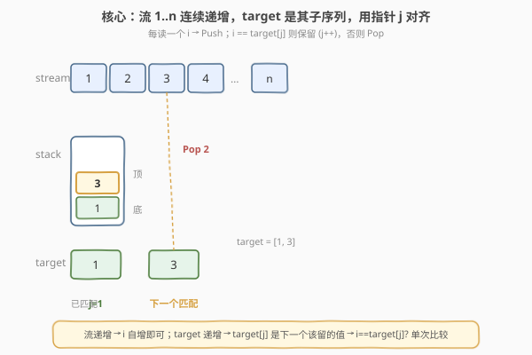

# 用栈操作构建数组

- **题目名称**：用栈操作构建数组
- **链接**：[1441. 用栈操作构建数组](https://leetcode.cn/problems/build-an-array-with-stack-operations/)
- **难度**：简单
- **标签**：栈、数组、模拟、双指针

## 1. 题目概述

存在一个不含重复元素的整数流 `stream = 1, 2, 3, …, n`（按升序逐个读出）。另有一个**严格递增**的目标数组 `target`，其中元素都取自 `[1, n]`。初始时栈为空，且只允许两种操作：

- `"Push"`：从流中读出下一个整数并压入栈顶；
- `"Pop"`：弹出栈顶元素（仅能在栈非空时使用）。

请你返回一个操作序列，使得按顺序执行后，**栈中从底到顶的元素恰好等于 `target`**。题目保证答案存在且**操作序列最短**（即对每个读出但不在 `target` 中的数，立即 Push 后再 Pop）。

> ⚠️ 三点审题关键：① 流是从 `1` 开始连续递增的，不是任意集合，所以「不在 target 里的数」是确定的连续段；② `target` **严格递增**，意味着 target 自身就是流的一个子序列，天然可被「读到一个留一个」地拼出；③ 题目要求**最短操作序列**——只对那些最终要留在栈里的数 Push 一次，其余读到的数必须 Push 后立刻 Pop（否则栈里会残留多余元素）。

**示例 1**：

```text
输入：target = [1,3], n = 3
输出：["Push","Push","Pop","Push"]
解释：
  读 1 → Push（1 在 target，保留）    栈: [1]
  读 2 → Push（2 不在 target，立即 Pop）栈: [1] → []
                                实际栈: [1]（Push 2 后 Pop，栈回到 [1]）
  读 3 → Push（3 在 target，保留）    栈: [1,3]
```

**示例 2**：

```text
输入：target = [1,2,3], n = 3
输出：["Push","Push","Push"]
解释：1、2、3 全在 target，无需 Pop。
```

**示例 3**：

```text
输入：target = [1,2], n = 4
输出：["Push","Push"]
解释：target 末元素为 2，读到 2 即已集齐，无需继续读 3、4。
```

**约束条件**：

- $1 \le \text{target.length} \le 100$
- $1 \le \text{target[i]} \le n \le 100$
- `target` 严格递增
- `target` 中元素互不相同

> 💡 **关键点**：流是连续的 $1,2,\dots,n$，而 `target` 是它的递增子序列。因此只需用一个指针 `j` 扫描 `target`，对 `stream` 的每个值 `i`（从 $1$ 到 `target` 的末元素 `target[-1]`）做：**先 Push**；若 `i == target[j]` 则保留并 `j++`，否则立即 Pop。集齐 `target` 即停。

---

## 2. 解题思路

### 2.1 暴力思路：把流全读进来再筛选

最直白的模拟：从 `1` 到 `n` 逐个读取，每个数先 `"Push"`；随后检查「栈顶是否等于 `target` 的下一个待匹配元素」，相等则保留并推进 target 指针，否则 `"Pop"`。一直读满 `n` 个数。

- **正确**：覆盖了流中所有数，target 必然能在中途被集齐。
- **低效且不满足「最短」**：当 `target = [1,2]`、`n = 100` 时，集齐 target 后仍继续读 `3..100`，每个都要 Push 后 Pop，产生约 196 条多余操作——虽最终栈不变，但违反题目「最短操作序列」要求，判题会错。

> ⚠️ 暴力的两个问题：一是**停得太晚**（应读到 `target[-1]` 即停，而非读满 `n`）；二是**没利用 target 严格递增**这一结构——其实 `target[j]` 就是下一个该被保留的值，流中比它小的非 target 数全是连续的，逐个 Push+Pop 即可。

### 2.2 核心观察：流连续递增 + target 是子序列 → 单指针对齐



两个观察把模拟变得线性且最短：

**观察一（流连续递增）**：`stream = 1,2,3,…,n` 是公差为 1 的等差数列。所以「当前读到的值 `i`」始终等于 `i` 本身，无需存储流——只要维护一个自增计数器 `i`（从 `1` 起，每次 `+1`）。

**观察二（target 是子序列 + 严格递增）**：`target` 严格递增且元素互异，所以它是 `stream` 的一个**子序列**。用一个指针 `j` 指向 `target` 中下一个待匹配位置（初始 `0`）。对每个 `i`：

- **必先 Push**（流的语义要求「读出一个数就 Push」）；
- 若 `i == target[j]`：这个数要保留，`j += 1`；
- 否则（`i < target[j]`，因流递增而不会出现 `i > target[j]`）：立即 `"Pop"` 丢弃。

**停止条件**：当 `j == len(target)` 时，target 已全部集齐，立即停止——不必读到 `n`。这保证了**操作序列最短**：恰好为「`target[-1]` 个 Push + (target[-1] − len(target)) 个 Pop」」。

> 💡 **一句话**：流的连续性让 `i` 自增即可；target 的递增性让 `target[j]` 成为「下一个该保留的值」，于是判定化为 `i == target[j] ?` 的单次比较。**读到 `target[-1]` 即停**保证最短。

> ⚠️ 由于流递增、target 也递增，**只会出现 `i ≤ target[j]`**——`i < target[j]` 时 Pop，`i == target[j]` 时保留。不会出现 `i > target[j]`（那意味着漏掉了某个 target 元素，与 target 是流的子序列矛盾）。这把判定简化为单一等号比较。

### 2.3 算法流程图

![算法流程：i=1, j=0 → 循环 j&lt;len → Push i → i==target[j]? → 保留/Pop → i++ → 返回](../images/1441_algorithm_flow.svg)

**完整步骤**：

1. **初始化** `res = []`（操作序列），`j = 0`（target 指针），`i = 1`（流计数器）；
2. **循环** 当 `j < len(target)`：
   - `res.append("Push")`；
   - 若 `i == target[j]`：`j += 1`（保留）；
   - 否则：`res.append("Pop")`（丢弃）；
   - `i += 1`（读下一个流元素）；
3. **返回** `res`。

> 💡 循环条件用 `j < len(target)` 而非 `i <= n`：前者在集齐 target 时立即退出，天然保证最短；后者会读满 `n` 导致多余操作。`n` 仅作为上界保证答案存在，实际不必显式用到。

### 2.4 示例演算

以示例 1 的 `target = [1,3]`、`n = 3` 为例：

![示例演算：target = [1,3]，stream 读 1,2,3](../images/1441_example_walkthrough.svg)

| 轮次 | 流值 $i$ | target[j] | 操作 | 栈（底→顶） | $j$ | 说明 |
|------|----------|-----------|------|--------------|-----|------|
| 1 | 1 | 1 | Push | [1] | 0→1 | $i=$ target[0]，保留 |
| 2 | 2 | 3 | Push, Pop | [1] | 1 | $2 < 3$，丢弃 |
| 3 | 3 | 3 | Push | [1,3] | 1→2 | $i=$ target[1]，保留 |

- **第 1 轮**：读 `1`，`1 == target[0]=1`，Push 后保留，`j` 推进到 `1`。
- **第 2 轮**：读 `2`，`2 < target[1]=3`，Push 后立即 Pop，`j` 不动。
- **第 3 轮**：读 `3`，`3 == target[1]=3`，Push 后保留，`j` 推进到 `2 == len(target)`，循环结束。

结果 `["Push","Push","Pop","Push"]` ✓。

> 以示例 2 `target=[1,2,3]`、`n=3` 为例：每轮 $i$ 都等于 `target[j]`，三轮均只 Push 不 Pop，结果 `["Push","Push","Push"]` ✓。示例 3 `target=[1,2]`、`n=4`：第 2 轮集齐后 `j=2==len` 立即停，只输出 `["Push","Push"]`，不读 `3、4` ✓。

---

## 3. 参考代码

### C++

```cpp
class Solution {
public:
    vector<string> buildArray(vector<int>& target, int n) {
        vector<string> res;
        int j = 0, m = target.size();
        for (int i = 1; j < m; ++i) {
            res.push_back("Push");
            if (i == target[j]) {
                ++j;
            } else {
                res.push_back("Pop");
            }
        }
        return res;
    }
};
```

### Python

```python
class Solution:
    def buildArray(self, target: List[int], n: int) -> List[str]:
        res = []
        j = 0
        i = 1
        while j < len(target):
            res.append("Push")
            if i == target[j]:
                j += 1
            else:
                res.append("Pop")
            i += 1
        return res
```

> 💡 **实现要点**：① 循环条件 `j < len(target)` 而非 `i <= n`，集齐即停保证最短；② `n` 仅是上界，代码里不必显式判断 `i <= n`（题目保证答案存在，`target[-1] ≤ n`）；③ 每轮**必先 Push** 再判等——流的语义要求「读一个数就 Push」，不能因为「不在 target」就跳过 Push 只写 Pop。

---

## 4. 复杂度分析

| 维度 | 单指针对齐 $O(target[-1])$（推荐） | 读满 $n$ 的暴力 $O(n)$ |
|------|-----------------------------------|------------------------|
| **时间复杂度** | $O(\text{target}[-1])$ | $O(n)$ |
| **空间复杂度** | $O(\text{target}[-1])$（输出序列） | $O(n)$（输出序列） |
| **是否最短序列** | ✅ 读到 target[-1] 即停 | ✗ 读满 n，含多余 Push/Pop |
| **是否利用流连续性** | ✅ i 自增 | ✅ 仍按流读 |
| **是否利用 target 递增** | ✅ target[j] 对齐 | ✗ 每次重查栈顶 |

- **单指针对齐**：循环恰好执行 `target[-1]` 轮（每轮读一个流值 `i` 从 `1` 到 `target[-1]`），每轮 $O(1)$，合计 $O(\text{target}[-1])$；输出序列长度为 `target[-1]`（Push）+ `(target[-1] − len(target))`（Pop）`= 2·target[-1] − len(target)`，空间即输出本身 $O(\text{target}[-1])$。是最优解。
- **读满 $n$ 的暴力**：读满 `n` 个数，时间 $O(n)$；当 `target[-1] << n` 时远慢于最优解，且操作序列非最短，不满足题意。

> ⚠️ 本题 $n \le 100$，两者都能 AC，但只有「读到 `target[-1]` 即停」满足**最短操作序列**要求。面试中应主动说明为何不必读满 `n`——`target` 末元素之后的流值与 target 无关，读了只会徒增 Push/Pop。

---

## 5. 扩展：为何不必读满 `n`，以及「子序列对齐」的通用性

### 5.1 停止条件的正确性

设 `target = [t_0, t_1, …, t_{m-1}]` 严格递增，`t_{m-1} = target[-1]`。当流读到 `i = t_{m-1}` 时，由于 target 是流的子序列，`t_{m-1}` 必在某一轮被匹配（该轮 `i == target[j]` 且 `j == m-1`），匹配后 `j` 推进到 `m == len(target)`，循环退出。此后流中 `t_{m-1}+1, …, n` 这些数**都不在 target 中**（target 最大元素就是 `t_{m-1}`），对它们做 Push+Pop 只会让栈在「Push 临时多一元素、Pop 又去掉」之间空转，最终栈状态不变但操作序列变长。因此读到 `target[-1]` 即停既是正确的，也是**最短的**。

> 💡 形式上，最短操作序列长度 = `target[-1]` 个 Push + `(target[-1] − m)` 个 Pop（每个非 target 的 `i ∈ [1, target[-1]]` 贡献一个 Pop），共 $2\,\text{target}[-1] - m$。任何更长的序列都含可删除的「Push 后立即 Pop」冗余对。

### 5.2 子序列对齐：双指针的退化形式

本题的 `j` 指针本质是「**在递增序列 A（stream）中按序匹配递增序列 B（target）**」的双指针。一般的双指针需要 `i`、`j` 都显式推进并比较；但这里 A 是公差为 1 的等差数列，`A[i] = i`，于是 `i` 自增即等价于「A 的指针推进」，判定退化为 `i == target[j] ?` 的单次比较。这是双指针在「一侧为已知等差数列」时的极简特例。

> ⚠️ 若把流换成任意集合（非连续递增），则需先排序流再双指针，或用哈希集合判 `i ∈ target`——本题流天然有序，故无需排序/哈希，$O(1)$ 额外空间即可。

### 5.3 用哈希集合的写法（对照理解）

虽非最优，但用集合判存在可帮助理解「target 是子序列」的本质：

```python
class Solution:
    def buildArray(self, target: List[int], n: int) -> List[str]:
        s = set(target)
        res = []
        for i in range(1, target[-1] + 1):
            res.append("Push")
            if i not in s:
                res.append("Pop")
        return res
```

> 💡 此写法把 `i` 从 `1` 枚举到 `target[-1]`，用集合 $O(1)$ 判 `i ∈ target`。与指针版等价但多用 $O(m)$ 空间存集合。指针版利用了 target 的有序性，无需集合——体现了「有序数据用指针、无序数据用哈希」的取舍。

---

## 6. 面试要点

1. **为什么循环条件用 `j < len(target)` 而不是 `i <= n`？**

   > 因为 `target` 末元素之后的流值（`target[-1]+1 … n`）都不在 target 中，对它们 Push 后必 Pop，最终栈不变但操作序列变长，违反「最短」要求。用 `j < len(target)` 作条件，集齐 target 即停，天然保证最短。`n` 只是上界，保证流足够长能覆盖 target。

2. **如何保证操作序列最短？**

   > 每个读出的数恰好贡献一次 Push；不在 target 的数额外贡献一次 Pop。我们只读到 `target[-1]` 为止，不读多余数，故 Push 数 = `target[-1]`（最小，因为 target 的最大元素就必须被 Push），Pop 数 = `target[-1] − len(target)`（每个非 target 的 `i ∈ [1, target[-1]]` 必须被 Pop，无法更少）。二者都已达到下界，故最短。

3. **为什么不会出现 `i > target[j]`？**

   > 流 `i` 从 `1` 递增，`target` 也严格递增。若某轮 `i > target[j]`，说明 `target[j]` 这个值在流中已被跳过（从未在某轮等于 `i`），即 target 含流中不存在的元素——与「target 元素取自 `[1,n]` 且流为 `1..n`」矛盾。故恒有 `i ≤ target[j]`，判定只需处理 `<`（Pop）和 `==`（保留）。

4. **如果流不是连续的 `1..n` 而是任意集合，怎么做？**

   > target 仍是流的子序列，但流无序时不能靠 `i` 自增对齐。需先把流排序（或target与流都已排序则直接双指针），再用 `i`、`j` 双指针比较；或用哈希集合判 `stream[i] ∈ target`。本题流天然有序，是最简特例。

5. **`n` 在最优解里起什么作用？**

   > 仅作为「流足够长」的存在性保证——题目用 `target[i] ≤ n` 保证 target 的每个元素都能在流 `1..n` 中被读到。代码中无需显式检查 `i ≤ n`，因为循环在 `j == len(target)` 时已退出，而退出时 `i = target[-1] + 1 ≤ n + 1`，恒满足流范围。

> 💡 **一句话总结**：1441 的灵魂是「**流连续递增 + target 是其子序列**」——用指针 `j` 对齐 target，`i` 自增扫流，读到 `target[-1]` 即停，每轮 Push 后按 `i == target[j] ?` 决定保留或 Pop，$O(\text{target}[-1])$ 时间、最短序列。

---

## 7. 同类练习题

- [232. 用栈实现队列](../0201-0300/232_用栈实现队列.md)：同属「栈模拟」家族，用双栈倒换实现队列，对照 1441 直接用 Push/Pop 模拟流的读取，体会栈操作作为底层原语的不同用法
- [946. 验证栈序列](../0901-1000/946_验证栈序列.md)：栈模拟判定的镜像题——给定 pushed 和 popped 判定是否合法，与 1441「构造操作序列使栈状态等于 target」互为正反问题，均依赖栈的 LIFO 语义
- [682. 棒球比赛](../0601-0700/682_棒球比赛.md)：栈模拟逐操作求值，对照 1441 逐流值生成操作，同属「按规则操作栈」的模拟题，体会栈作为状态载器的用法
- [392. 判断子序列](../0301-0400/392_判断子序列.md)：子序列对齐的双指针母题——在长串中按序匹配短串，与 1441「stream 中按序匹配 target」同源，1441 因 stream 连续递增退化为单指针
