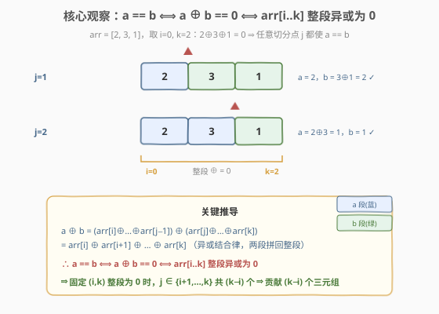

# LeetCode 形成两个异或相等数组的三元组数目 题解

## 1. 题目概述

- **标题 / 题号**：形成两个异或相等数组的三元组数目（#1442，medium）
- **链接**：https://leetcode.cn/problems/count-triplets-that-can-form-two-arrays-of-equal-xor/
- **难度**：中等
- **标签**：位运算、数组、前缀异或、哈希表

**题意**：给定整数数组 `arr`，需要选出三个下标 `(i, j, k)` 满足 `0 <= i < j <= k < arr.length`，定义：

- $a = arr[i] \oplus arr[i+1] \oplus \dots \oplus arr[j-1]$
- $b = arr[j] \oplus arr[j+1] \oplus \dots \oplus arr[k]$

返回能使 $a == b$ 成立的三元组数目（`^` 表示按位异或）。

**示例 1**：

```text
输入：arr = [2,3,1,6,7]
输出：4
解释：满足条件的三元组为 (0,1,2), (0,2,2), (2,3,4), (2,4,4)
```

**示例 2**：

```text
输入：arr = [1,1,1,1,1]
输出：10
```

**示例 3**：

```text
输入：arr = [2,3]
输出：0
```

**示例 4**：

```text
输入：arr = [1,3,5,7,9]
输出：3
```

**约束**：

- $1 \le arr.length \le 300$
- $1 \le arr[i] \le 10^8$

> 💡 这是一道披着「计数三元组」外衣的**前缀异或**题。突破口只有一个等式：$a == b \iff a \oplus b == 0 \iff arr[i..k]$ 整段异或为 0。一旦想通这点，三元组里的 `j` 就被「解放」了——只要整段异或为 0，`j` 在 $[i+1, k]$ 中随便取都成立，每对 $(i, k)$ 直接贡献 $(k - i)$ 个答案。它和 [525. 连续数组](../0501-0600/525_连续数组.md)、[560. 和为 K 的子数组](../0501-0600/560_和为K的子数组.md) 是同一套「前缀 + 哈希存下标聚合」骨架，只是把「前缀和」换成了「前缀异或」。

## 2. 解题思路

### 2.1 暴力思路：枚举三个下标

最朴素的做法：三重循环枚举 $(i, j, k)$，对每组分别计算 $a = arr[i..j-1]$ 的异或、$b = arr[j..k]$ 的异或，相等则计数 +1。

```text
ans = 0
for i in range(n):
    for j in range(i+1, n):
        for k in range(j, n):
            a = xor(arr[i..j-1])
            b = xor(arr[j..k])
            if a == b: ans += 1
```

最坏 $O(n^4)$（三重循环 × 每次区间异或 $O(n)$），$n=300$ 时约 $8 \times 10^9$，**严重超时**。

> ⚠️ 暴力法的根因：把 `j` 当成一个必须枚举的独立维度，没有意识到 $a == b$ 这一条件可以**消去 `j`**——只要整段异或为 0，`j` 取哪个都行。突破口是反过来问：「什么样的 $(i, k)$ 能让**存在**一个 `j` 使 $a == b$？」

### 2.2 核心观察：消去 j —— 整段异或为 0

利用异或的结合律与自消性（$x \oplus x = 0$）：

$$
a \oplus b = \big(arr[i] \oplus \dots \oplus arr[j-1]\big) \oplus \big(arr[j] \oplus \dots \oplus arr[k]\big) = arr[i] \oplus \dots \oplus arr[k]
$$

即 $a \oplus b$ 恰好等于**整段 $arr[i..k]$ 的异或**，与切分点 $j$ 无关！于是：

$$
a == b \iff a \oplus b == 0 \iff arr[i..k] \text{ 整段异或为 } 0
$$



**关键推论**：一旦固定了整段异或为 0 的 $(i, k)$，$j$ 可取 $i+1, i+2, \dots, k$ 共 $(k - i)$ 个值，每个都使 $a == b$。于是问题从「数三元组」降维成「数满足整段异或为 0 的下标对 $(i, k)$，并把 $(k - i)$ 累加进答案」。

> 💡 这一步把 $O(n^3)$ 的三元组枚举压缩成 $O(n^2)$ 的下标对枚举：固定 $i$，向右扩展 $k$ 并滚动维护异或，一旦归零就把 $(k - i)$ 加进答案。$n=300$ 时约 $9 \times 10^4$，轻松通过。这是本题的**预期解法**。

### 2.3 进一步：前缀异或 + 哈希聚合 O(n)

定义前缀异或 $s[t] = arr[0] \oplus arr[1] \oplus \dots \oplus arr[t-1]$，$s[0] = 0$。由前缀异或性质：

$$
arr[i..k] \text{ 的异或} = s[k+1] \oplus s[i]
$$

所以「整段异或为 0」$\iff s[k+1] \oplus s[i] == 0 \iff s[i] == s[k+1]$。

![前缀异或转化：s[i]==s[k+1] 即整段异或为 0，每对下标贡献 (k−i)](../images/cntxor_prefix_concept.svg)

于是问题再降一维：**统计前缀值相同的下标对 $(i, k+1)$**，每对贡献 $(k - i) = (k+1 - 1 - i)$。这正是 [560. 和为 K 的子数组](../0501-0600/560_和为K的子数组.md) 的异或版——用哈希表聚合「同前缀值」的下标，一边遍历一边算贡献：

对每个右端下标 $p = k+1$（从 $1$ 到 $n$），设当前前缀值 $v = s[p]$，则之前所有 $s[i] == v$（$i \le p-2$）的下标都贡献 $(p - 1 - i)$。求和：

$$
\sum_{i:\, s[i]=v,\, i \le p-2} (p-1-i) = \text{cnt}[v] \cdot (p-1) - \text{tot}[v]
$$

其中 $\text{cnt}[v]$ 是同值下标个数、$\text{tot}[v]$ 是这些下标之和。维护这两个量即可 $O(1)$ 查询、$O(1)$ 入账，总复杂度 $O(n)$。

![O(n) 哈希聚合演算：cnt[v]·k − tot[v] = Σ(k−i)](../images/cntxor_hash_walkthrough.svg)

> ⚠️ **下标边界**：合法的 $i$ 必须 $\le k-1$（即 $i \le p-2$），保证 $j \in [i+1, k]$ 非空。实现时**先查询、后入账**：用「之前已入账」的下标查询，把当前下标 $(k+1)$ 入账留给后续。注意题目保证 $arr[i] \ge 1$，故 $s[k] \ne s[k+1]$，即便不刻意延迟也不会误把 $i = k$ 算入；但「先查后入」的写法天然规避了这一边界，更稳健。

### 2.4 算法流程图（O(n^2) 主解）

**O(n^2) 三步法**：

1. **外层固定左端 $i$**：从 $0$ 到 $n-1$。
2. **内层滚动异或**：$x$ 初始为 0，$k$ 从 $i$ 到 $n-1$，每步 $x \oplus= arr[k]$。
3. **归零即累加**：若 $x == 0$，`ans += (k - i)`（$k == i$ 时 $arr[i] \ge 1$ 必不为 0，故天然 $k > i$）。

> 💡 **复杂度账**：外层 $n$ × 内层至多 $n$ → $O(n^2)$，$n=300$ 时约 $4.5 \times 10^4$ 次异或，常数极小。空间 $O(1)$。这是**结合约束 $n \le 300$ 的最优性价比解法**；$O(n)$ 哈希版见第 5 节扩展。

## 3. 参考代码

### C++

```cpp
// 形成两个异或相等数组的三元组数目.cpp —— 整段异或为 0 ⇒ j 任取，每对 (i,k) 贡献 (k-i)
// 编译: g++ -O2 -std=c++17 形成两个异或相等数组的三元组数目.cpp -o cntxor
#include <vector>
using namespace std;

class Solution {
  public:
    int countTriplets(vector<int>& arr) {
        int n = arr.size();
        int ans = 0;
        for (int i = 0; i < n; ++i) {
            int x = 0;
            for (int k = i; k < n; ++k) {
                x ^= arr[k];          // x = arr[i..k] 的异或
                if (x == 0) {
                    ans += (k - i);   // j ∈ [i+1, k] 共 (k-i) 个
                }
            }
        }
        return ans;
    }
};
```

### Python

```python
class Solution:
    def countTriplets(self, arr: list[int]) -> int:
        n = len(arr)
        ans = 0
        for i in range(n):
            x = 0
            for k in range(i, n):
                x ^= arr[k]          # x = arr[i..k] 的异或
                if x == 0:
                    ans += (k - i)   # j ∈ [i+1, k] 共 (k-i) 个
        return ans
```

> 💡 **两处细节**：① 内层用滚动变量 `x` 累积异或，**不要**每个 `k` 都重新算一遍 $arr[i..k]$（否则退化成 $O(n^3)$）；② `k == i` 时 `x = arr[i] >= 1` 必不为 0，所以 `ans += (k - i)` 永远在 `k > i` 时触发，无需特判 `k - i == 0` 的空段。

## 4. 复杂度分析

| 维度 | 复杂度 | 说明 |
|------|--------|------|
| **时间复杂度** | $O(n^2)$ | 外层 $n$ × 内层至多 $n$，每步一次异或 + 一次比较；$n{=}300$ 时约 $4.5\times10^4$ |
| **空间复杂度** | $O(1)$ | 仅滚动变量 `x` 与累加器 `ans`，无需额外数组 |
| **可优化到** | $O(n)$ | 前缀异或 + 哈希聚合（见第 5 节），$n$ 更大时必要 |

> ⚠️ 本题 $n \le 300$，$O(n^2)$ 完全够用且常数极小。$O(n)$ 哈希版虽更优，但引入哈希表常数与边界细节，**面试中应先讲清 $O(n^2)$ 的核心观察，再主动给出 $O(n)$ 优化作为进阶**——展示从「消去 $j$」到「前缀配对」的两步思维链。

## 5. 扩展：前缀异或 + 哈希聚合 O(n) 解法

### 5.1 思路与公式

把第 2.3 节的公式落地。遍历 $k = 0 \dots n-1$，维护两张哈希表：

- `cnt[v]`：前缀值 $v$ 已入账的下标个数
- `tot[v]`：这些下标之和

每一步先算 $s_{k+1} = s_k \oplus arr[k]$，**查询** `cnt[s] * k - tot[s]` 累加进答案（注意贡献里乘的是 $k = (k+1) - 1$），**再入账**当前下标 $(k+1)$：`cnt[s] += 1; tot[s] += (k + 1)`。

### 5.2 参考代码

```cpp
// O(n) 版：前缀异或 + 哈希聚合 cnt/tot
#include <vector>
#include <unordered_map>
using namespace std;

class Solution {
  public:
    int countTripletOpt(vector<int>& arr) {
        unordered_map<int, int> cnt, tot;
        int s = 0, ans = 0;
        cnt[0] = 1;       // s[0] = 0 已在下标 0 入账
        tot[0] = 0;
        for (int k = 0; k < (int)arr.size(); ++k) {
            s ^= arr[k];                       // s = s_{k+1}
            auto it = cnt.find(s);
            if (it != cnt.end()) {
                ans += it->second * k - tot[s];  // Σ (k - i)
            }
            cnt[s] += 1;
            tot[s] += (k + 1);                 // 当前下标 (k+1) 入账
        }
        return ans;
    }
};
```

```python
class Solution:
    def countTripletOpt(self, arr: list[int]) -> int:
        cnt, tot = {0: 1}, {0: 0}   # s[0]=0 在下标 0 入账
        s = 0
        ans = 0
        for k, x in enumerate(arr):
            s ^= x                  # s = s_{k+1}
            if s in cnt:
                ans += cnt[s] * k - tot[s]   # Σ (k - i)
            cnt[s] = cnt.get(s, 0) + 1
            tot[s] = tot.get(s, 0) + (k + 1)  # 当前下标 (k+1) 入账
        return ans
```

### 5.3 O(n^2) 与 O(n) 的取舍

| 维度 | $O(n^2)$ 滚动异或 | $O(n)$ 前缀 + 哈希 |
|------|-------------------|--------------------|
| 时间 | $O(n^2)$，$n{=}300$ 约 $4.5\times10^4$ | $O(n)$，$n{=}300$ 约 $300$ |
| 空间 | $O(1)$ | $O(n)$ 哈希表 |
| 思维链 | 一步：消去 $j$ | 两步：消去 $j$ → 前缀配对 |
| 适用场景 | $n \le 10^3$ 的约束题 | $n$ 上 $10^5$ 时必选 |
| 易错点 | 无 | 下标边界（先查后入）、`k` vs `k+1` |

> 💡 **一句话**：$O(n^2)$ 是「观察到位、实现极简」的性价比解；$O(n)$ 是「前缀 + 哈希」通用模板的异或实例。面试讲题时两者都给出，能完整展示「降维 → 配对聚合」的思路演化。

## 6. 面试要点

1. **为什么 $a == b$ 等价于整段异或为 0？**

   > 因为 $a \oplus b$ 恰好等于 $arr[i..k]$ 整段的异或——异或满足结合律，两段拼起来就是整段，且切分点 $j$ 在拼回时被自消（$arr[j..k]$ 接上 $arr[i..j-1]$ 不重叠不遗漏）。所以 $a == b \iff a \oplus b == 0 \iff arr[i..k] \oplus == 0$，与 $j$ 无关。

2. **为什么每个合法 $(i, k)$ 贡献 $(k - i)$ 而不是 1？**

   > 整段异或为 0 时，$j$ 可取 $i+1, i+2, \dots, k$ 中任意一个，每个都让 $a == b$ 成立。共 $(k - i)$ 个选择，所以贡献 $(k - i)$ 个三元组。这是「消去 $j$」后自然得到的红利——不用真的枚举 $j$。

3. **$O(n)$ 版里为什么用 `cnt * k - tot` 而不是逐个累加？**

   > 对所有同前缀值的下标 $i$，贡献和 $\sum (k - i) = \sum k - \sum i = \text{cnt} \cdot k - \text{tot}$。把「个数」和「下标和」两个聚合量维护好，就能 $O(1)$ 算出整批贡献，避免遍历所有同值下标。这正是 [560. 和为 K 的子数组](../0501-0600/560_和为K的子数组.md) 的同款技巧。

4. **为什么要「先查询、后入账」？**

   > 合法的 $i$ 必须 $\le k-1$（保证 $j \in [i+1, k]$ 非空）。若先把当前下标 $(k+1)$ 入账再查询，就会把 $i = k+1$ 这种非法下标也算进去。先查后入账保证查询时只用「之前」的下标。退一步说，题目保证 $arr[i] \ge 1$，故 $s_k \ne s_{k+1}$，即便顺序写反也未必出错，但「先查后入」是无需依赖该约束的稳健写法。

5. **本题和 [525. 连续数组](../0501-0600/525_连续数组.md) 有什么异同？**

   > 同：都是「前缀 + 哈希存下标聚合」骨架，都是统计满足某等价关系的前缀对。异：525 把 0 当 $-1$ 把「0/1 个数相等」转成「前缀和为 0」，再找同值前缀对；本题直接用异或的自消性把 $a == b$ 转成「整段异或为 0 = 同前缀值配对」。两者本质都是「把区间条件归约成前缀等值」。

> 💡 **一句话总结**：本题是「异或结合律消去切分点 $j$」的招牌题——$a == b \iff arr[i..k]$ 整段异或为 0，每对 $(i, k)$ 贡献 $(k - i)$；$O(n^2)$ 滚动异或即可，$O(n)$ 则套用 [560](../0501-0600/560_和为K的子数组.md) 的前缀 + 哈希聚合模板。

## 同类练习题

| # | 题目 | 与本题的关联 |
|---|------|-------------|
| 560 | [和为 K 的子数组](https://leetcode.cn/problems/subarray-sum-equals-k/)（[题解](../0501-0600/560_和为K的子数组.md)） | 同胞骨架题，前缀和 + 哈希聚合 `cnt/tot`，把「区间和为 K」归约成「前缀差为 K」；1442 是其异或版 |
| 525 | [连续数组](https://leetcode.cn/problems/contiguous-array/)（[题解](../0501-0600/525_连续数组.md)） | 前缀和 + 哈希存最早下标，0 当 $-1$ 把「0/1 等个数」转成「前缀和为 0」；与本题「前缀等值配对」同构 |
| 1310 | [子数组异或查询](https://leetcode.cn/problems/xor-queries-of-a-subarray/)（[题解](../1301-1400/1310_子数组异或查询.md)） | 前缀异或最直接的应用，$arr[i..j] \oplus = s[j+1] \oplus s[i]$，区间查询 $O(1)$，承接 1442 的前缀异或基础 |
| 421 | [数组中两个数的最大异或值](https://leetcode.cn/problems/maximum-xor-of-two-numbers-in-an-array/)（[题解](../0401-0500/421_数组中两个数的最大异或值.md)） | 异或计数/最值的另一方向，0-1 Trie 逐位贪心；对照本题「同前缀值配对计数」与「逐位贪心求最值」两种异或套路 |
| 1738 | [找出第 K 大的异或坐标值](https://leetcode.cn/problems/find-kth-largest-xor-coordinate-value/) | 二维前缀异或，把一维 $s[i]$ 推广到二维 $s[i][j]$，前缀异或的二维延伸 |
