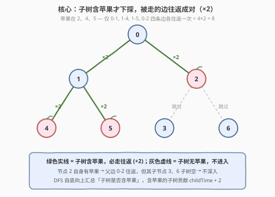
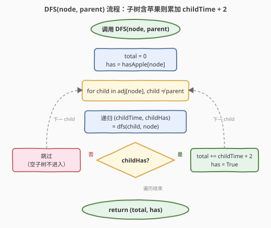
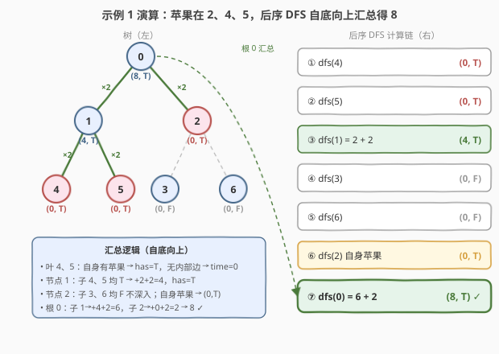

# 收集树上所有苹果的最小时间

- **题目名称**：收集树上所有苹果的最小时间
- **链接**：[1443. 收集树上所有苹果的最小时间](https://leetcode.cn/problems/minimum-time-to-collect-all-apples-in-a-tree/)
- **难度**：中等
- **标签**：树、深度优先搜索、无向图建图

## 1. 题目概述

给定一棵 **无向树**，由 `n` 个编号为 `0` 到 `n-1` 的节点构成，**根节点为 `0`**。`edges` 给出 `n-1` 条无向边，`hasApple[i]` 表示节点 `i` 是否有苹果。你从节点 `0` 出发，每经过一条边耗时 1 秒，**必须收集所有苹果并最终回到节点 `0`**。返回所需的最小时间（秒数）。

> ⚠️ 关键约束：① 是**树**（连通无环），任意两点恰有一条路径；② 必须从 `0` 出发并**回到 `0`**，即所有走过的边最终都要「去 + 回」成对出现；③ 没有苹果的子树**完全不必进入**——进入空子树只会白跑往返，不收集任何苹果。

**示例 1**：

```text
输入：n = 7, edges = [[0,1],[0,2],[1,4],[1,5],[2,3],[2,6]], hasApple = [false,false,true,false,true,true,false]
输出：8
解释：苹果在节点 2、4、5。需走边 0-1, 1-4, 1-5, 0-2（各往返一次）共 4 条边 × 2 = 8 秒。
```

**示例 2**：

```text
输入：n = 7, edges = [[0,1],[0,2],[1,4],[1,5],[2,3],[2,6]], hasApple = [false,false,true,false,false,true,false]
输出：6
解释：苹果在节点 2、5。需走边 0-1, 1-5, 0-2（各往返）共 3 条边 × 2 = 6 秒。
```

**示例 3**：

```text
输入：n = 7, edges = [[0,1],[0,2],[1,4],[1,5],[2,3],[2,6]], hasApple = [false,false,false,false,false,false,false]
输出：0
解释：无苹果，原地不动。
```

**约束条件**：

- $1 \le n \le 10^5$
- $\text{edges.length} = n - 1$
- $\text{edges}[i] = [\text{from}_i, \text{to}_i]$，$0 \le \text{from}_i, \text{to}_i \le n - 1$
- $\text{hasApple.length} = n$

> 💡 **数据规模提示**：$n$ 可达 $10^5$，必须 $O(n)$ 一次 DFS 遍历，且需用邻接表建图（不能用邻接矩阵）。递归深度最坏 $O(n)$（链状树），C++/Python 默认栈可能不够，需手动扩栈或改迭代。

---

## 2. 解题思路

### 2.1 暴力思路：枚举每个苹果独立往返

最朴素的设想：对每个有苹果的节点，独立地「从 `0` 走到它再回到 `0`」，时间为其深度 $\times 2$，最后求和。

- **错误**：这会**重复计算公共边**。例 1 中苹果 4 和 5 都要经过边 `0-1`，独立往返会把 `0-1` 算两遍往返（4 秒），但实际只需走一次往返（2 秒）。
- 即便「去重」——把所有苹果到根路径上的边并集起来，每条边算一次往返——也需要逐个苹果向上爬到根标记边，最坏 $O(n^2)$（链状树时每个苹果路径长 $O(n)$）。

> ⚠️ 暴力的两层缺陷：① 独立往返导致公共边重复；② 自底向上爬根路径效率低。正确思路应**自顶向下 DFS 一次**，让子树把「是否有苹果」的信息向上汇总，自然完成公共边的合并。

### 2.2 核心观察：子树有苹果才下探 + 往返成对



两个观察把问题规约成一次 DFS：

**观察一（子树有苹果才下探）**：从根 `0` 出发并回到 `0`，意味着**每条被走的边必然走偶数次**（去 + 回）。对于节点 `u` 的某个子节点 `v`，是否要进入 `v` 的子树？**当且仅当 `v` 的子树里存在苹果**（含 `v` 自身）。若子树无苹果，进入它纯属浪费——不收集任何苹果还要原路返回。

**观察二（往返成对，子树时间累加）**：一旦决定进入子节点 `v` 的子树，则边 `u-v` 必然走一次往返（**+2 秒**），再加上 `v` 子树内部为收集苹果所走的所有往返边（即递归结果 `childTime`）。于是对每个子节点 `v`：

$$\text{若 } v \text{ 子树有苹果} \Rightarrow \text{total} \mathrel{+}= \text{childTime} + 2$$

把每个子节点是否含苹果的信息**向上汇总**：`u` 子树含苹果 ⟺ `hasApple[u]` 为真 **或** 某个子节点的子树含苹果。这样根 `0` 的累计时间即为答案。

> 💡 **一句话**：DFS 返回 `(子树内往返总时间, 子树是否含苹果)`；对每个子节点，子树含苹果则 `total += childTime + 2`，并把自己的「含苹果」状态向上传。空子树不进入、不加分，自然合并公共边。

### 2.3 算法流程图



**完整步骤**：

1. **建图**：把无向边 `edges` 转成邻接表 `adj`（双向）。
2. **DFS(node, parent)**，返回 `(time, hasAppleInSubtree)`：
   - `total = 0`；`has = hasApple[node]`；
   - 遍历 `adj[node]` 中每个 `child`，跳过 `parent`（防止回头）；
   - 递归 `(childTime, childHas) = dfs(child, node)`；
   - **若 `childHas` 为真**：`total += childTime + 2`，并令 `has = True`；
   - 返回 `(total, has)`。
3. **答案** = `dfs(0, -1)` 的 `time` 分量。

> ⚠️ 跳过 `parent` 是无向图 DFS 的关键——树以邻接表存储后每条边在两端各出现一次，不跳父节点会死循环。也可改为「父节点数组 + 已访问标记」，但传 `parent` 参数最简洁。

### 2.4 示例演算

以示例 1 的树（苹果在 2、4、5）为例：



| 节点 | 子节点递归结果 | 子树含苹果？ | 返回 `(time, has)` |
|------|----------------|--------------|---------------------|
| 4 | （无子节点） | `hasApple[4]=T` → T | `(0, T)` |
| 5 | （无子节点） | `hasApple[5]=T` → T | `(0, T)` |
| 1 | 4→`(0,T)`：+0+2=2；5→`(0,T)`：+0+2=2 | `hasApple[1]=F` 但子树 T → T | `(4, T)` |
| 3 | （无子节点） | `hasApple[3]=F` → F | `(0, F)` |
| 6 | （无子节点） | `hasApple[6]=F` → F | `(0, F)` |
| 2 | 3→`(0,F)`：不加分；6→`(0,F)`：不加分 | `hasApple[2]=T` → T | `(0, T)` |
| **0** | 1→`(4,T)`：+4+2=6；2→`(0,T)`：+0+2=2 | T | **`(8, T)`** |

- **叶节点 4、5**：自身有苹果 ⟹ `has=True`，但子树内无更多边 ⟹ `time=0`。
- **节点 1**：两个子节点子树都含苹果，各加一条往返边 `1-4`、`1-5`（各 +2），合计 `4`。
- **节点 2**：自身有苹果但子节点 3、6 子树都空 ⟹ 不进入，`time=0`，`has=True`（自身就是苹果）。
- **根 0**：子节点 1 子树含苹果 ⟹ `+4+2=6`（子树内 4 + 边 0-1 往返 2）；子节点 2 子树含苹果 ⟹ `+0+2=2`（边 0-2 往返）。合计 **8**。

> 💡 注意节点 2：它自己就是苹果，所以「子树含苹果」为真，根必须下探到 2 取苹果（往返边 0-2 = 2 秒），但 2 的子节点 3、6 子树都空 ⟹ 不再深入。这正体现「**自身有苹果也算子树含苹果**」，会触发父边往返但不必继续往下。

---

## 3. 参考代码

### C++

```cpp
class Solution {
public:
    int minTime(int n, vector<vector<int>>& edges, vector<bool>& hasApple) {
        vector<vector<int>> adj(n);
        for (auto& e : edges) {
            adj[e[0]].push_back(e[1]);
            adj[e[1]].push_back(e[0]);
        }
        int total, has;
        dfs(0, -1, adj, hasApple, total, has);
        return total;
    }
private:
    void dfs(int node, int parent, vector<vector<int>>& adj,
             vector<bool>& hasApple, int& total, int& has) {
        total = 0;
        has = hasApple[node];
        for (int child : adj[node]) {
            if (child == parent) continue;
            int childTime, childHas;
            dfs(child, node, adj, hasApple, childTime, childHas);
            if (childHas) {
                total += childTime + 2;
                has = 1;
            }
        }
    }
};
```

### Python

```python
class Solution:
    def minTime(self, n: int, edges: List[List[int]], hasApple: List[bool]) -> int:
        adj = [[] for _ in range(n)]
        for u, v in edges:
            adj[u].append(v)
            adj[v].append(u)

        def dfs(node: int, parent: int) -> tuple[int, bool]:
            total = 0
            has = hasApple[node]
            for child in adj[node]:
                if child == parent:
                    continue
                child_time, child_has = dfs(child, node)
                if child_has:
                    total += child_time + 2
                    has = True
            return total, has

        return dfs(0, -1)[0]
```

> 💡 **实现要点**：① 建图务必**双向加边**（无向树），DFS 时用 `parent` 参数防回头。② 递归返回 `(时间, 是否含苹果)` 两个值，C++ 用引用传出、Python 用元组。③ 只在 `child_has` 为真时累加 `childTime + 2` 并置 `has=True`——空子树既不加分也不影响 `has`。④ Python `tuple[int, bool]` 类型注解需 3.9+，旧版可去注解或用 `Tuple`。

---

## 4. 复杂度分析

| 维度 | DFS 一次遍历 $O(n)$（推荐） | 暴力逐苹果爬根 $O(n^2)$ |
|------|----------------------------|--------------------------|
| **时间复杂度** | $O(n)$ | $O(n^2)$（链状树退化） |
| **空间复杂度** | $O(n)$（邻接表 + 递归栈） | $O(n)$（边集合） |
| **建图** | 邻接表 $O(n)$ | 不必显式建图 |
| **公共边处理** | 子树汇总自然合并 | 需去重，易错 |
| **是否一次遍历** | 是 | 否（每苹果一次） |

- **DFS 一次遍历**：每个节点访问一次、每条边查两次（双向邻接表），合计 $O(n)$；邻接表 $O(n)$ 空间，递归栈最深 $O(n)$（链状树）。是本题最优解。
- **暴力逐苹果爬根**：每个苹果沿父链向上标记边到根，链状树时单苹果路径长 $O(n)$，苹果数可达 $O(n)$，合计 $O(n^2)$；且需对边集合去重，实现繁琐。

> ⚠️ $n = 10^5$ 时递归深度可达 $10^5$，Python 默认递归上限 1000 必爆栈，需 `sys.setrecursionlimit(200000)`；C++ 也可能栈溢出，可改显式栈迭代 DFS（后序遍历用栈 + 二次访问标记）。

---

## 5. 扩展：迭代版 DFS 与「不必回到根」的变体

### 5.1 迭代后序 DFS（防栈溢出）

递归改迭代的关键是**后序**：先处理完所有子节点再汇总父节点。用栈记录 `(node, parent, state)`，`state=0` 表示首次入栈（待处理子节点），`state=1` 表示子节点已处理完（汇总）。配合两个数组 `time[]`、`has[]` 缓存各节点结果：

```python
def minTime(n, edges, hasApple):
    adj = [[] for _ in range(n)]
    for u, v in edges:
        adj[u].append(v); adj[v].append(u)
    time = [0] * n
    has = list(hasApple)
    stack = [(0, -1, 0)]
    order = []
    while stack:
        node, parent, state = stack.pop()
        if state == 0:
            stack.append((node, parent, 1))
            for child in adj[node]:
                if child != parent:
                    stack.append((child, node, 0))
        else:
            for child in adj[node]:
                if child != parent and has[child]:
                    time[node] += time[child] + 2
                    has[node] = True
    return time[0]
```

> 💡 该写法显式模拟后序：首次弹出压「汇总态」再压子节点，子节点全部处理完后弹出「汇总态」累加。逻辑等价递归，但栈在堆上，无系统栈限制。

### 5.2 变体：不必回到根

若题目改为「收集所有苹果后**不必回到根**」，可停在任意苹果处。则答案 = （所有必走边的往返总和）−（从根到最远苹果的单程距离）。即先按本题算出往返总时间 `T`，再求根到各苹果的最远深度 `D`，答案为 `T - D`（把最远那条路径的回程省掉）。本题要求回到根，故不适用。

---

## 6. 面试要点

1. **为什么不能对每个苹果独立算往返深度再求和？**

   > 会**重复计算公共边**。多个苹果共享到根的路径前缀（如苹果 4、5 共享边 `0-1`），独立往返会把公共边算多次。正确做法是让子树把「含苹果」信息向上汇总，子树内所有苹果的公共边只在该子树的递归中算一次往返。

2. **DFS 返回值为什么是 `(时间, 是否含苹果)` 两个量？**

   > 父节点需要知道子节点子树**是否含苹果**来决定是否下探（是否加 `+2` 的父边往返）；同时需要子树内部已累计的往返时间 `childTime`。两个信息缺一不可：只有「是否含苹果」无法累加内部时间，只有时间无法判断空子树（空子树 `childTime=0` 与「有苹果但子树内无额外边」的 `childTime=0` 无法区分）。

3. **节点自身有苹果但子节点子树都空（如示例 1 的节点 2），为什么 `time=0` 但 `has=True`？**

   > `time` 统计的是**子树内部**走的往返边数。节点 2 的子节点 3、6 子树都无苹果 ⟹ 不进入 ⟹ 内部 0 边；但 2 自身有苹果 ⟹ `has=True`，这会触发**父节点 0** 把边 `0-2` 的往返（+2）加进去。即「自身苹果」由父边承担往返，不由自身 `time` 承担。

4. **为什么必须跳过 `parent`？不跳会怎样？**

   > 无向树以双向邻接表存储，边 `u-v` 在 `adj[u]` 和 `adj[v]` 各出现一次。若不跳父节点，DFS 会从 `v` 走回 `u`，形成无限循环（栈溢出）。传 `parent` 参数是最简洁的防回头方式，等价于「已访问标记」。

5. **$n = 10^5$ 时递归会爆栈吗？如何处理？**

   > 链状树递归深度达 $10^5$，Python 默认上限 1000 必爆，需 `sys.setrecursionlimit(300000)`；C++ 默认栈也可能不够，可改迭代后序 DFS（显式栈 + 二次访问标记，见第 5 节）。面试中应主动提及栈溢出风险并给出迭代方案，体现工程意识。

> 💡 **一句话总结**：1443 的灵魂是「**子树含苹果才下探，往返边成对累加**」——DFS 自底向上汇总「子树是否含苹果」，含苹果的子树贡献 `childTime + 2`（子树内部往返 + 父边往返），空子树不进入，一次 $O(n)$ 遍历完成公共边自然合并。

---

## 7. 同类练习题

- [310. 最小高度树](../0201-0300/310_最小高度树.md)：同样以无向树建邻接表 + DFS/BFS，体会无向图去环与多源 BFS 拓扑剥叶的对照
- [236. 二叉树的最近公共祖先](../0201-0300/236_二叉树最近公共祖先.md)：后序 DFS 向上汇总「子树是否含目标节点」，与 1443「子树是否含苹果」同款信息回传范式
- [872. 叶子相似的树](https://leetcode.cn/problems/leaf-similar-trees/)：DFS 收集叶序列并向上回传，练习「子树特征汇总到根」的递归返回值设计
- [1519. 子树中标签相同的节点数](https://leetcode.cn/problems/number-of-nodes-in-the-sub-tree-with-the-same-label/)：后序 DFS 把子树标签计数向上合并，与 1443「子树苹果状态汇总」结构同源，规模更大的子树信息聚合题
