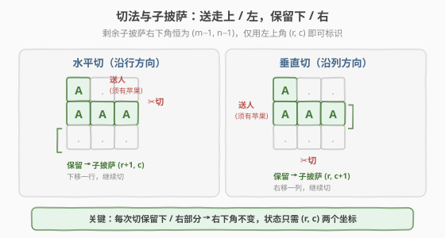
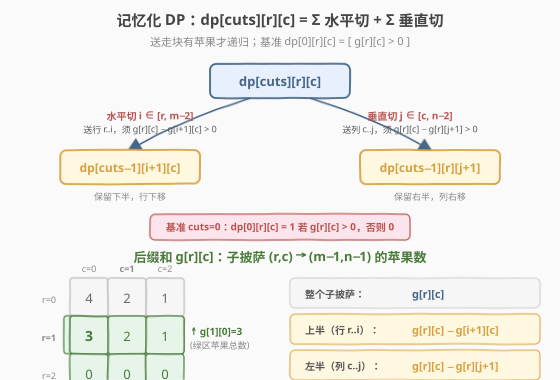
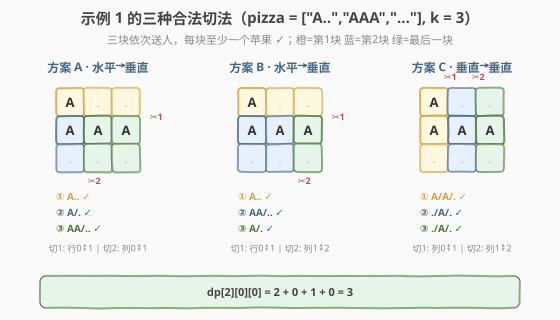

# LeetCode 切披萨的方案数 题解

## 1. 题目概述

- **标题 / 题号**：切披萨的方案数（#1444，hard）
- **链接**：https://leetcode.cn/problems/number-of-ways-of-cutting-a-pizza/
- **难度**：困难
- **标签**：动态规划、记忆化搜索、二维前缀和、分割型 DP

**题意**：给你一个 `rows x cols` 大小的矩形披萨（矩阵）和一个整数 `k`，矩阵只含两种字符：`'A'`（苹果）和 `'.'`（空格）。需要切 `k-1` 刀，把披萨分成 `k` 块依次送人。

每一刀的规则：

- 先选**方向**——**垂直切**（沿列方向切一刀，把矩形一分为左右两半）或**水平切**（沿行方向切一刀，分为上下两半）；
- 再在边界上选一个**切的位置**；
- **垂直切**：把**左边**那块送人，保留**右边**继续切；
- **水平切**：把**上面**那块送人，保留**下面**继续切；
- 切完最后一刀后，剩下的最后一块送给最后一个人。

要求：**每一块披萨都至少含一个苹果**。返回方案数对 $10^9 + 7$ 取余的结果。

**示例 1**：

```text
输入：pizza = ["A..","AAA","..."], k = 3
输出：3
解释：上图展示了三种切披萨的方案。注意每一块披萨都至少包含一个苹果。
```

**示例 2**：

```text
输入：pizza = ["A..","AA.","..."], k = 3
输出：1
```

**示例 3**：

```text
输入：pizza = ["A..","A..","..."], k = 1
输出：1
```

**约束**：

- `1 <= rows, cols <= 50`
- `rows == pizza.length`
- `cols == pizza[i].length`
- `1 <= k <= 10`
- `pizza` 只包含字符 `'A'` 和 `'.'`
- 每个测试用例中披萨至少有一个苹果

> 💡 本题是「**分割型记忆化 DP**」招牌题：刀刀递归地把「当前剩余子披萨」一分为二，每一步只需保证「送走的那块有苹果」。把子披萨用**左上角坐标** $(r, c)$ 唯一标识（右下角恒为 $(m{-}1, n{-}1)$），状态空间塌缩到 $O(k \cdot m \cdot n)$；再用一张**二维后缀和**把「某块有没有苹果」的查询降到 $O(1)$，整体 $O(k \cdot m \cdot n \cdot (m{+}n))$ 解决。

## 2. 解题思路

### 2.1 暴力思路：枚举每一刀的所有切法

最直观的做法是 DFS：从完整披萨开始，每一刀枚举所有方向（水平/垂直）与所有位置，只要「送走的那块有苹果」就递归切剩余部分；切满 $k{-}1$ 刀时检查最后一块是否也有苹果，是则计数 +1。

第 $t$ 刀的候选切法约 $m+n$ 种，递归 $k{-}1$ 层，最坏时间 $O((m{+}n)^{k-1})$。$m{=}n{=}50,\ k{=}10$ 时约为 $100^{9} = 10^{18}$，**完全不可行**。

> ⚠️ 暴力法的问题在于**没有合并相同子问题**：无论前面是怎么切到「左上角为 $(r,c)$、还需切 $c$ 刀」这一步的，后续的切法数都完全相同——历史切法不影响剩余子披萨的形状。这一「**无后效性**」正是记忆化 DP 的入场券。

### 2.2 核心观察：子披萨用左上角标识 + 后缀和 O(1) 查苹果

**观察一：子披萨 = 左上角坐标。** 由于每次切完保留的是**右下部分**（水平切保留下半、垂直切保留右半），剩余子披萨的右下角恒为 $(m{-}1, n{-}1)$，只需用左上角 $(r, c)$ 就能唯一确定当前披萨。于是状态从「披萨形状」降维成 $(r, c)$ 两个整数。



**观察二：苹果查询用后缀和 $O(1)$ 完成。** 判断「送走的那块有没有苹果」是高频操作（每次切都要判一次）。预处理一张二维**后缀和** $g[r][c]$，表示子矩阵 $(r,c) \to (m{-}1, n{-}1)$ 内的苹果总数：

$$
g[r][c] = \mathbb{1}[pizza[r][c]{=}\text{'A'}] + g[r{+}1][c] + g[r][c{+}1] - g[r{+}1][c{+}1]
$$

边界补一行一列零（$g[m][\cdot] = g[\cdot][n] = 0$），从右下向左上递推。于是：

| 要查的块 | 范围 | 苹果数 | 有苹果？ |
|----------|------|--------|----------|
| 当前整个子披萨 | $(r,c) \to (m{-}1,n{-}1)$ | $g[r][c]$ | $> 0$ |
| 水平切送走的**上半**（行 $r..i$，列 $c..n{-}1$） | 上半 $\cup$ 下半 $=$ 当前 | $g[r][c] - g[i{+}1][c]$ | $> 0$ |
| 垂直切送走的**左半**（行 $r..m{-}1$，列 $c..j$） | 左半 $\cup$ 右半 $=$ 当前 | $g[r][c] - g[r][j{+}1]$ | $> 0$ |

> 💡 **为什么用「后缀和」而不是前缀和？** 因为子披萨的右下角固定在 $(m{-}1,n{-}1)$、只有左上角在变，后缀和 $g[r][c]$ 直接给出当前子披萨的苹果总数，查询上半/左半只需减去「保留下半/右半」的后缀和，一次减法搞定。若用前缀和则每次要做「四角容斥」两次减一次加，写起来更啰嗦也更容易错。这与 [304. 二维区域和检索](../0301-0400/304_二维区域和检索-数组不可变.md) 的前缀和思路是对称的镜像——一个固定左上角查右下区域，一个固定右下角查左上区域。

**观察三：状态定义与转移。** 设 $dp[c][r][col]$ = 子披萨 $(r,col) \to (m{-}1,n{-}1)$ **还需切 $c$ 刀**（即再分成 $c{+}1$ 块）的合法方案数。

- **基准**：$c = 0$（不再切），只剩这一块 → $dp[0][r][col] = 1$ 若 $g[r][col] > 0$，否则 $0$。
- **转移**：枚举这一刀的方向与位置，**送走的那块有苹果**才递归保留下半/右半：

$$
dp[c][r][col] = \underbrace{\sum_{i=r}^{m-2} \big[ g[r][col] - g[i{+}1][col] > 0 \big] \cdot dp[c{-}1][i{+}1][col]}_{\text{水平切：送行 } r..i \text{，保留 }(i{+}1, col)} + \underbrace{\sum_{j=col}^{n-2} \big[ g[r][col] - g[r][j{+}1] > 0 \big] \cdot dp[c{-}1][r][j{+}1]}_{\text{垂直切：送列 } col..j \text{，保留 }(r, j{+}1)}
$$

- **答案**：$dp[k{-}1][0][0]$（从整张披萨切 $k{-}1$ 刀）。

> ⚠️ **两个易错点**：①切的位置范围是 $i \in [r, m{-}2]$（不能切在最后一行下方，否则送走整块、保留空），垂直同理 $j \in [col, n{-}2]$；②每一步**只判「送走的那块」有没有苹果**，最后一块的苹果性由基准 $dp[0]$ 的 $g[r][col] > 0$ 兜底——切勿在转移里重复检查保留下半。

### 2.3 算法流程图

记忆化搜索四步走：预处理后缀和 → 自顶向下 DFS(cuts, r, c) → 命中基准返回 → 枚举两方向切法累加并取模。



**四步法**：

1. **预处理**：从 $(m{-}1, n{-}1)$ 向左上递推后缀和 $g$，$O(mn)$。
2. **状态**：`memo[c][r][col]`，初值 $-1$ 表示未算；维度 $k \times m \times n$。
3. **DFS(cuts, r, col)**：
   - `cuts == 0`：返回 $g[r][col] > 0 ? 1 : 0$。
   - 否则枚举水平切 $i \in [r, m{-}2]$、垂直切 $j \in [col, n{-}2]$，送走块有苹果则累加 `DFS(cuts-1, ...)`。
   - 取模后写入 `memo` 返回。
4. **答案**：`DFS(k-1, 0, 0)`。

> 💡 **自顶向下 vs 自顶向上**：记忆化（top-down）只计算**实际可达**的状态，且转移方程直接照搬数学递推、不易写错边界；自底向上（bottom-up）需把 `cuts` 放最外层、内层 `(r,col)` 顺序任意（依赖均在 `cuts-1` 层）。本题 $k,m,n$ 都不大，两者性能相当；面试推荐先讲记忆化版，再提一句可改迭代省去递归栈。

### 2.4 示例演算

以示例 1 `pizza = ["A..","AAA","..."]`，$k=3$（切 2 刀）为例，展示 3 种合法方案。披萨坐标（行,列），苹果位于 $(0,0),(1,0),(1,1),(1,2)$：



| 方案 | 第 1 刀 | 送走块（须有苹果 ✓） | 第 2 刀（在剩余上） | 送走块 ✓ | 最后一块 ✓ |
|------|---------|----------------------|---------------------|----------|------------|
| **A** | 水平切 行 0↕1 | 行 0 `A..`（有 A） | 垂直切 列 0↕1 | 行 1-2 列 0 `A`/`.`（有 A） | 行 1-2 列 1-2 `AA`/`..`（有 A） |
| **B** | 水平切 行 0↕1 | 行 0 `A..`（有 A） | 垂直切 列 1↕2 | 行 1-2 列 0-1 `AA`/`..`（有 A） | 行 1-2 列 2 `A`/`.`（有 A） |
| **C** | 垂直切 列 0↕1 | 列 0 `A`/`A`/`.`（有 A） | 垂直切 列 1↕2 | 列 1 `.`/`A`/`.`（有 A） | 列 2 `.`/`A`/`.`（有 A） |

用 DP 验证（$g[r][c]$ 为 $(r,c) \to (2,2)$ 的苹果数）：

- $dp[0][r][c] = [g>0]$：$(0,0){=}1,(0,1){=}1,(0,2){=}1,\ (1,0){=}1,(1,1){=}1,(1,2){=}1,\ (2,\cdot){=}0$。
- $dp[1][1][0]$（子披萨行 1-2、列 0-2）：水平切 $i{=}1$ 送行 1「AAA」有苹果 → $dp[0][2][0]{=}0$；垂直切 $j{=}0$ 送列 0「A/.」有苹果 → $dp[0][1][1]{=}1$，$j{=}1$ 送列 0-1「AA/..」有苹果 → $dp[0][1][2]{=}1$；合计 $0{+}1{+}1 = 2$。
- $dp[1][0][1]$（子披萨行 0-2、列 1-2）：水平切 $i{=}0$ 送行 0 列 1-2「. .」**无苹果**跳过，$i{=}1$ 送行 0-1 列 1-2「. . / A A」有苹果 → $dp[0][2][1]{=}0$；垂直切 $j{=}1$ 送列 1「. / A / .」有苹果 → $dp[0][0][2]{=}1$；合计 $0{+}0{+}1 = 1$。
- $dp[1][0][2]$（子披萨行 0-2、列 2）：水平切 $i{=}0$ 送行 0 列 2「.」无苹果跳过，$i{=}1$ 送行 0-1 列 2「. / A」有苹果 → $dp[0][2][2]{=}0$；无垂直切位置；合计 $0$。
- $dp[2][0][0]$：水平切 $i{=}0$ 送行 0「A..」有苹果 → $dp[1][1][0]{=}2$；$i{=}1$ 送行 0-1 有苹果 → $dp[1][2][0]{=}0$；垂直切 $j{=}0$ 送列 0「A/A/.」有苹果 → $dp[1][0][1]{=}1$；$j{=}1$ 送列 0-1 有苹果 → $dp[1][0][2]{=}0$；合计 $2{+}0{+}1{+}0 = \mathbf{3}$ ✓。

> 💡 三种方案恰好对应「先水平切行 0」派生出的 2 条 +「先垂直切列 0」派生出的 1 条。注意方案 C 中**两刀都是垂直切**——切完第一刀后保留的右半部分仍可继续垂直切，这正是状态只用左上角 $(r,c)$ 描述的妙处：列坐标 $c$ 从 0 推进到 1 再到 2，行坐标不变。

## 3. 参考代码

### C++

```cpp
// 1444. 切披萨的方案数.cpp —— 记忆化 DP + 二维后缀和
// 编译: g++ -O2 -std=c++17 切披萨的方案数.cpp -o pizza
class Solution {
    int m, n;
    vector<vector<int>> g;               // 后缀和 g[r][c]
    vector<vector<vector<int>>> memo;    // memo[c][r][col]

    int dfs(int cuts, int r, int c) {
        if (cuts == 0) return g[r][c] > 0 ? 1 : 0;     // 基准：最后一块须有苹果
        int& res = memo[cuts][r][c];
        if (res != -1) return res;
        const int MOD = 1e9 + 7;
        res = 0;
        // 水平切：送行 r..i，保留 (i+1, c)；送走块须有苹果
        for (int i = r; i < m - 1; ++i)
            if (g[r][c] - g[i + 1][c] > 0)
                res = (res + dfs(cuts - 1, i + 1, c)) % MOD;
        // 垂直切：送列 c..j，保留 (r, j+1)；送走块须有苹果
        for (int j = c; j < n - 1; ++j)
            if (g[r][c] - g[r][j + 1] > 0)
                res = (res + dfs(cuts - 1, r, j + 1)) % MOD;
        return res;
    }

public:
    int ways(vector<string>& pizza, int k) {
        m = pizza.size();
        n = pizza[0].size();
        g.assign(m + 1, vector<int>(n + 1, 0));
        for (int r = m - 1; r >= 0; --r)
            for (int c = n - 1; c >= 0; --c)
                g[r][c] = (pizza[r][c] == 'A') + g[r + 1][c] + g[r][c + 1] - g[r + 1][c + 1];
        memo.assign(k, vector<vector<int>>(m, vector<int>(n, -1)));
        return dfs(k - 1, 0, 0);
    }
};
```

### Python

```python
class Solution:
    def ways(self, pizza: list[str], k: int) -> int:
        m, n = len(pizza), len(pizza[0])
        MOD = 10**9 + 7

        # 后缀和 g[r][c] = 子披萨 (r,c) -> (m-1,n-1) 的苹果数
        g = [[0] * (n + 1) for _ in range(m + 1)]
        for r in range(m - 1, -1, -1):
            for c in range(n - 1, -1, -1):
                g[r][c] = (
                    (pizza[r][c] == "A")
                    + g[r + 1][c]
                    + g[r][c + 1]
                    - g[r + 1][c + 1]
                )

        memo = [[[-1] * n for _ in range(m)] for _ in range(k)]

        def dfs(cuts: int, r: int, c: int) -> int:
            if cuts == 0:
                return 1 if g[r][c] > 0 else 0
            if memo[cuts][r][c] != -1:
                return memo[cuts][r][c]
            res = 0
            # 水平切：送行 r..i，保留 (i+1, c)
            for i in range(r, m - 1):
                if g[r][c] - g[i + 1][c] > 0:
                    res += dfs(cuts - 1, i + 1, c)
            # 垂直切：送列 c..j，保留 (r, j+1)
            for j in range(c, n - 1):
                if g[r][c] - g[r][j + 1] > 0:
                    res += dfs(cuts - 1, r, j + 1)
            res %= MOD
            memo[cuts][r][c] = res
            return res

        return dfs(k - 1, 0, 0)
```

> 💡 **取模位置**：C++ 在每次累加后立即 `% MOD`（`res` 始终在 `int` 范围，因为 `dfs` 返回值 $< MOD$，相加 $< 2 \times MOD$ 安全）；Python 大数不溢出，循环内可裸加、最后统一取模，写法更简洁。两种语言思路完全一致。

## 4. 复杂度分析

| 维度 | 复杂度 | 说明 |
|------|--------|------|
| **时间复杂度** | $O(k \cdot m \cdot n \cdot (m{+}n))$ | 共 $k \cdot m \cdot n$ 个状态，每状态枚举至多 $(m{-}r) + (n{-}c) \le m{+}n$ 个切位，每次查询后缀和 $O(1)$ |
| **空间复杂度（记忆化）** | $O(k \cdot m \cdot n)$ | `memo` 三维表 $k \times m \times n$，另加后缀和 $O(mn)$ |
| **空间复杂度（滚动迭代）** | $O(m \cdot n)$ | 自底向上只保留 `cuts-1` 层，见第 5 节 |
| **递归深度** | $O(k)$ | 最多切 $k{-}1$ 刀，递归栈深 $k$ |

> 💡 $k{\le}10,\ m,n{\le}50$ 时状态数至多 $10 \times 50 \times 50 = 25000$，单状态约 100 次操作，总操作量约 $2.5 \times 10^{6}$，毫秒级通过。

## 5. 扩展：自底向上迭代 + 滚动数组 $O(mn)$ 空间

记忆化版依赖递归栈且 `memo` 占 $O(kmn)$。注意到 $dp[c]$ 只依赖 $dp[c{-}1]$，可改为自底向上迭代，仅保留相邻两层：

```cpp
int ways(vector<string>& pizza, int k) {
    int m = pizza.size(), n = pizza[0].size();
    const int MOD = 1e9 + 7;
    vector<vector<int>> g(m + 1, vector<int>(n + 1, 0));
    for (int r = m - 1; r >= 0; --r)
        for (int c = n - 1; c >= 0; --c)
            g[r][c] = (pizza[r][c] == 'A') + g[r+1][c] + g[r][c+1] - g[r+1][c+1];

    auto has = [&](int r, int c) { return g[r][c] > 0; };
    // dp0 = dp[0], dp1 = dp[cuts]
    vector<vector<int>> dp0(m, vector<int>(n, 0));
    for (int r = 0; r < m; ++r)
        for (int c = 0; c < n; ++c)
            dp0[r][c] = has(r, c);

    for (int cuts = 1; cuts < k; ++cuts) {
        vector<vector<int>> dp1(m, vector<int>(n, 0));
        for (int r = 0; r < m; ++r)
            for (int c = 0; c < n; ++c) {
                if (!has(r, c)) continue;            // 当前子披萨无苹果，方案数必为 0
                for (int i = r; i < m - 1; ++i)
                    if (g[r][c] - g[i+1][c] > 0)
                        dp1[r][c] = (dp1[r][c] + dp0[i+1][c]) % MOD;
                for (int j = c; j < n - 1; ++j)
                    if (g[r][c] - g[r][j+1] > 0)
                        dp1[r][c] = (dp1[r][c] + dp0[r][j+1]) % MOD;
            }
        dp0 = move(dp1);
    }
    return dp0[0][0];
}
```

空间从 $O(kmn)$ 降到 $O(mn)$，时间不变。**外层按 `cuts` 递增、内层 `(r,c)` 顺序任意**——因为 $dp[c]$ 读取的全是 $dp[c{-}1]$ 的值（已完整算好），不存在相互覆盖。

> 💡 这套「滚动两层降维」与 [174. 地下城游戏](../0101-0200/174_地下城游戏.md) 的反向网格 DP、[132. 分割回文串 II](../0101-0200/132_分割回文串II.md) 的两阶段 DP 同属「依赖固定在相邻层」的滚动套路——只要能确认**当前层只读上一层**，就可放心用 `dp0/dp1` 两个表交替。

## 6. 面试要点

1. **为什么子披萨只需用左上角 $(r,c)$ 标识？**

   > 题目规定水平切保留下半、垂直切保留右半，所以无论怎么切，剩余部分的右下角永远固定在 $(m{-}1, n{-}1)$，只有左上角在变。于是「披萨形状」退化为两个整数 $(r,c)$，状态空间从指数级降到 $O(mn)$。

2. **为什么用后缀和而非前缀和？**

   > 子披萨右下角固定，后缀和 $g[r][c]$ 恰好就是当前子披萨的苹果总数；查上半/左半的苹果数只需「当前总数 − 保留下半/右半的后缀和」一次减法。前缀和需四角容斥（两个前缀相减再加一个），多一次运算且更易写错边界。

3. **基准 $dp[0]$ 为什么是 $g[r][c] > 0$ 而转移里只判送走块？**

   > 一刀切下去产生两块：送走块 + 保留块。送走块「**当下**」必须立即有苹果（否则这一刀不合法）；保留块还要继续切，它的苹果性最终由递归到 $dp[0]$ 时的 $g > 0$ 兜底。若在转移里再查保留块苹果性，会和后续递归**重复检查**且过早剪枝（保留块此时无苹果不代表切完若干刀后无苹果——其实若保留块无苹果后续必为 0，但交给基准判断更统一、不易漏）。

4. **记忆化 vs 自底向上，面试怎么选？**

   > 先讲记忆化：递推式直接照搬、只算可达状态、边界天然清晰，便于白板书写与讲解。再提自底向上 + 滚动数组可把空间从 $O(kmn)$ 降到 $O(mn)$，作为优化点。两者时间相同，本题规模下记忆化的递归开销可忽略。

5. **若 $k$ 很大（如 $k = 100$）怎么办？**

   > 状态数 $k \cdot mn$ 随 $k$ 线性增长，$k{=}100,\ m{=}n{=}50$ 时约 $2.5 \times 10^{5}$ 状态、$2.5 \times 10^{7}$ 操作，仍可接受；但 $k$ 接近 $m{+}n$ 时许多切位必为空（每刀至少送走一行或一列，至多切 $m{+}n{-}2$ 刀），可据此提前返回 0。题目限定 $k \le 10$，无需过度优化。

> 💡 **一句话总结**：本题 = 「**分割型记忆化 DP**」+「**二维后缀和 O(1) 查苹果**」。子披萨用左上角 $(r,c)$ 标识消除后效性，$dp[cuts][r][c]$ 枚举两方向切法、送走块有苹果才递归，$O(kmn(m{+}n))$ 解决；可滚动数组把空间压到 $O(mn)$。

## 同类练习题

| # | 题目 | 与本题的关联 |
|---|------|-------------|
| 304 | [二维区域和检索 - 数组不可变](https://leetcode.cn/problems/range-sum-query-2d-immutable/)（[题解](../0301-0400/304_二维区域和检索-数组不可变.md)） | 二维前缀和母题，本题后缀和是其「右下角固定」的镜像，四角容斥 vs 一次减法的对照练习 |
| 132 | [分割回文串 II](https://leetcode.cn/problems/palindrome-partitioning-ii/)（[题解](../0101-0200/132_分割回文串II.md)） | 分割型 DP + 预处理表（回文表 vs 后缀和），同属「预处理 $O(1)$ 查询 + 线性/网格 DP 切分」两阶段骨架 |
| 174 | [地下城游戏](https://leetcode.cn/problems/dungeon-game/)（[题解](../0101-0200/174_地下城游戏.md)） | 反向网格 DP + 滚动数组降维，与本题自底向上迭代版同属「依赖固定在相邻层→两层滚动」套路 |
| 1388 | [3n 块披萨](https://leetcode.cn/problems/pizza-with-3n-slices/)（[题解](../1301-1400/1388_3n块披萨.md)） | 同是「披萨」背景的困难 DP，但模型为环形打家劫舍（选一块跳两块），与本题的切分割模型互为对照，体会「同题材不同模型」 |
