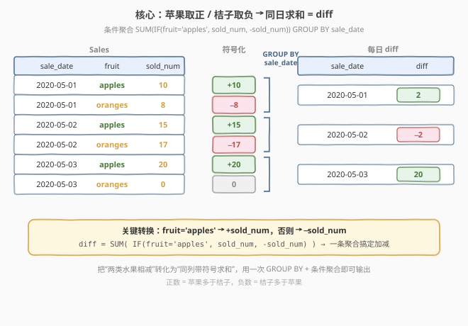
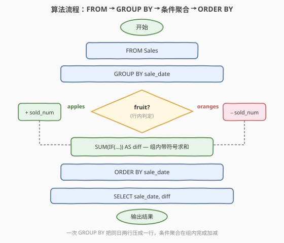
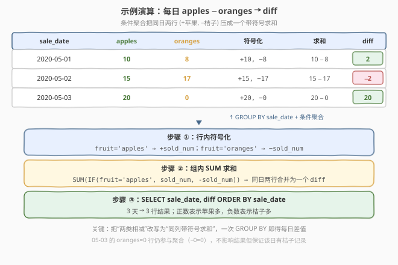

# 苹果和桔子

- **题目名称**：苹果和桔子
- **链接**：[1445. 苹果和桔子](https://leetcode.cn/problems/apples-oranges/)
- **难度**：中等
- **标签**：SQL、GROUP BY、条件聚合、SUM、IF/CASE、聚合减法

## 1. 题目概述

给定 `Sales` 表，每行记录某天某种水果的销量。`fruit` 是枚举类型，取值仅为 `'apples'` 或 `'oranges'`。编写 SQL 查询，报告**每天苹果销量与桔子销量之差**（`diff = apples − oranges`），结果按 `sale_date` 升序返回。

**表结构**：

```text
Table: Sales
+---------------+---------+
| Column Name   | Type    |
+---------------+---------+
| sale_date     | date    |
| fruit         | enum    |   ← 枚举，仅 'apples' / 'oranges'
| sold_num      | int     |
+---------------+---------+
(sale_date, fruit) 是该表主键
```

> 💡 **关键点**：每天最多两行——一行苹果、一行桔子。要把「同日的两行」压缩成「一行差值」，本质是**分组聚合**问题。难点不在聚合本身，而在「**如何在一次聚合里同时完成加法和减法**」——苹果取正、桔子取负，再 `SUM` 即得差值。

**示例 1**：

```text
输入：
Sales 表:
+------------+---------+----------+
| sale_date  | fruit   | sold_num |
+------------+---------+----------+
| 2020-05-01 | apples  | 10       |
| 2020-05-01 | oranges | 8        |
| 2020-05-02 | apples  | 15       |
| 2020-05-02 | oranges | 17       |
| 2020-05-03 | apples  | 20       |
| 2020-05-03 | oranges | 0        |
+------------+---------+----------+

输出：
+------------+------+
| sale_date  | diff |
+------------+------+
| 2020-05-01 | 2    |
| 2020-05-02 | -2   |
| 2020-05-03 | 20   |
+------------+------+
```

**解释**：

- `2020-05-01`：苹果 10，桔子 8 ⟹ $10 - 8 = 2$
- `2020-05-02`：苹果 15，桔子 17 ⟹ $15 - 17 = -2$（桔子更多，差为负）
- `2020-05-03`：苹果 20，桔子 0 ⟹ $20 - 0 = 20$

**约束条件**：

- `(sale_date, fruit)` 为复合主键，同一天不会有两条相同 `fruit` 的记录
- `fruit` 是 ENUM，取值仅为 `'apples'`、`'oranges'`
- `sold_num` 为非负整数（可为 0，如示例中 `05-03` 的桔子）
- 结果按 `sale_date` 升序排列，输出列为 `(sale_date, diff)`

> 💡 **核心考点**：把「两类水果相减」转化为「**同一列带符号求和**」——这是 SQL「**条件聚合**」的经典套路。用 `IF(fruit='apples', sold_num, −sold_num)` 在行内决定符号，再用 `SUM` 在组内聚合，一条 `GROUP BY` 即可输出每日差值，无需 JOIN 两份子查询。

---

## 2. 解题思路

### 2.1 暴力思路：两个子查询 JOIN

最直觉的做法：分别筛出苹果和桔子两张子表，再按 `sale_date` JOIN 起来，把两列相减。

```sql
SELECT a.sale_date,
       a.sold_num - b.sold_num AS diff
FROM (SELECT sale_date, sold_num FROM Sales WHERE fruit = 'apples')  a
JOIN (SELECT sale_date, sold_num FROM Sales WHERE fruit = 'oranges') b
  ON a.sale_date = b.sale_date
ORDER BY a.sale_date;
```

- **正确**：先分流再合并，逻辑直观无误。
- **冗长**：扫描 `Sales` 两次，且 `JOIN` 一份中间结果；若某天只有苹果或只有桔子（缺行），内 JOIN 会**丢掉这一天**。
- **不通用**：把「相减」硬编码为 `a.sold_num - b.sold_num`，若再加一类水果（如香蕉）需重写 JOIN 结构。

> ⚠️ 暴力的浪费在于「**先分流再拼接**」。其实苹果与桔子本就在同一张表里，分流成两份再 JOIN 是把「同组内的运算」拆成了「跨表的运算」——本可一次 `GROUP BY` 在组内直接完成加减。

### 2.2 核心观察：条件聚合 SUM(IF) 带符号求和



两步观察把双子查询 JOIN 压成一条聚合：

**观察一（行内符号化）**：苹果贡献 $+\text{sold\_num}$，桔子贡献 $-\text{sold\_num}$。用 `IF` 在每行决定符号，把「两类相减」改写为「同一列带符号求和」：

$$\text{signed}(row) = \begin{cases} +\text{sold\_num} & \text{if fruit} = \text{'apples'} \\ -\text{sold\_num} & \text{if fruit} = \text{'oranges'} \end{cases}$$

**观察二（组内 SUM 聚合）**：按 `sale_date` 分组后，组内各行已带符号，`SUM` 直接把同日的 $+\text{apples}$ 与 $-\text{oranges}$ 合并为一个差值：

$$\text{diff}(\text{day}) = \sum_{\text{row} \in \text{day}} \text{signed}(row) = \text{apples} - \text{oranges}$$

> 💡 **一句话**：识别出「苹果与桔子在同表、只需在聚合时区分符号」⟹ 用 `IF` 在行内取符号，`GROUP BY` + `SUM` 一次完成。这是「**相减 ⟹ 带符号求和**」的转化——把双值比较问题映射成单列代数和，是条件聚合的灵魂。

> ⚠️ **为何 `IF` 的「否则」分支能直接写 `−sold_num`**：题目保证 `fruit` 是仅含 `'apples'`/`'oranges'` 的 ENUM，非苹果即桔子，故 `ELSE` 分支等价于 `fruit='oranges'`。若 `fruit` 可能取其它值，应改用显式 `CASE WHEN fruit='apples' THEN sold_num WHEN fruit='oranges' THEN -sold_num ELSE 0 END` 兜底（见第 5 节）。

### 2.3 算法流程图



| 步骤 | SQL 子句 | 作用 |
|------|----------|------|
| ① | `FROM Sales` | 逐行读取 `(sale_date, fruit, sold_num)` |
| ② | `GROUP BY sale_date` | 按天分组，同日两行归入一组 |
| ③ | `SUM(IF(fruit='apples', sold_num, -sold_num))` | 行内按 `fruit` 取符号，组内求和得 `diff` |
| ④ | `ORDER BY sale_date` | 结果按日期升序输出 |

> 💡 **执行顺序**：`FROM` 取全表 → `GROUP BY` 切分到天 → 聚合函数 `SUM` 在**每个组内**逐行调用 `IF` 取符号后累加 → `SELECT` 输出 `(sale_date, diff)` → `ORDER BY` 排序。聚合函数内的 `IF` 是**行级**判定，`SUM` 是**组级**累加，两层正交。

### 2.4 示例演算

以示例 1 的三天数据为例，逐日展开「符号化 → 求和」的过程：



| sale_date | apples | oranges | 符号化 | 求和 | diff |
|-----------|--------|---------|--------|------|------|
| 2020-05-01 | 10 | 8 | +10, −8 | 10 − 8 | **2** |
| 2020-05-02 | 15 | 17 | +15, −17 | 15 − 17 | **−2** |
| 2020-05-03 | 20 | 0 | +20, −0 | 20 − 0 | **20** |

- **第 ① 步**：`GROUP BY sale_date` 把 6 行归为 3 组，每组恰好一行苹果、一行桔子。
- **第 ② 步**：组内 `IF` 给苹果行加号、桔子行减号，`SUM` 累加得差值。如 `05-02` 组：$+15 + (-17) = -2$。
- **第 ③ 步**：`ORDER BY sale_date` 输出 3 行结果。

> 💡 **零值行也参与聚合**：`05-03` 的桔子 `sold_num = 0`，符号化得 $-0 = 0$，对 `SUM` 无影响但仍计入分组。这保证「有桔子记录但销量为 0」与「无桔子记录」语义一致——只要行存在，条件聚合就能正确处理；这正是它比双子查询 JOIN 更稳健的原因之一。

---

## 3. 参考代码

### SQL（解法 A：SUM(IF) 条件聚合，推荐）

```sql
SELECT sale_date,
       SUM(IF(fruit = 'apples', sold_num, -sold_num)) AS diff
FROM Sales
GROUP BY sale_date
ORDER BY sale_date;
```

> 💡 **写法要点**：
> - `IF(fruit='apples', sold_num, -sold_num)` 在**每行**决定符号——苹果取原值，桔子取相反数。
> - 外层 `SUM` 在**每个 `sale_date` 分组内**累加带符号值，等价于 `apples − oranges`。
> - 一次扫描、一次分组，无需 JOIN 子查询。`ORDER BY sale_date` 保证题目要求的升序输出。

### SQL（解法 B：两次 SUM(CASE WHEN) 相减）

```sql
SELECT sale_date,
       SUM(CASE WHEN fruit = 'apples'  THEN sold_num ELSE 0 END)
     - SUM(CASE WHEN fruit = 'oranges' THEN sold_num ELSE 0 END) AS diff
FROM Sales
GROUP BY sale_date
ORDER BY sale_date;
```

> 💡 **解法 A vs B**：B 把「加苹果、减桔子」拆成两个独立的 `SUM` 再相减，逻辑等价但需调用两次聚合函数。A 用单次 `SUM` + 行内正负号，更简洁。B 的好处是**显式枚举**每种水果，若 `fruit` 可能取其它值，`ELSE 0` 自然忽略未知值，鲁棒性更强——代价是每多一类水果就要多写一个 `SUM`。

### SQL（解法 C：双子查询 JOIN，暴力）

```sql
SELECT a.sale_date,
       a.sold_num - b.sold_num AS diff
FROM (SELECT sale_date, sold_num FROM Sales WHERE fruit = 'apples')  a
JOIN (SELECT sale_date, sold_num FROM Sales WHERE fruit = 'oranges') b
  ON a.sale_date = b.sale_date
ORDER BY a.sale_date;
```

> ⚠️ **暴力陷阱**：内 JOIN 要求同一天**同时**有苹果行和桔子行。若某天只有苹果（缺桔子行），该天会被静默丢弃。题目示例中每天两行齐全，故能过；但条件聚合解法 A/B 不受此限制（缺行视为 0 贡献）。面试中应优先写 A。

### Python（pandas）

```python
import pandas as pd

def apples_oranges(sales: pd.DataFrame) -> pd.DataFrame:
    sign = sales['fruit'].map({'apples': 1, 'oranges': -1})
    signed = sales['sold_num'] * sign
    tmp = sales.assign(signed=signed)
    result = (
        tmp.groupby('sale_date', as_index=False)['signed']
           .sum()
           .rename(columns={'signed': 'diff'})
    )
    return result.sort_values('sale_date').reset_index(drop=True)[['sale_date', 'diff']]
```

> 💡 **pandas 对照**：`fruit.map({'apples':1,'oranges':-1})` 对应 SQL 的 `IF(fruit='apples', ...)` 行内符号化；`groupby('sale_date').sum()` 对应 `GROUP BY + SUM`；`sort_values` 对应 `ORDER BY`。`map` 向量化而非逐行 `apply`，效率更高。也可用 `np.where(sales['fruit']=='apples', sales['sold_num'], -sales['sold_num'])` 实现符号化。

---

## 4. 复杂度分析

| 维度 | 条件聚合 SUM(IF) $O(n)$（推荐） | 双子查询 JOIN $O(n)$ |
|------|-------------------------------|------------------------|
| **时间复杂度** | $O(n)$ | $O(n)$ |
| **空间复杂度** | $O(d)$（$d$ = 不同日期数，即分组哈希表大小） | $O(n)$（两个子查询中间结果 + JOIN 结果） |
| **扫描次数** | 1 次（单次全表扫描 + 分组） | 2 次（分别筛苹果、桔子）+ 1 次 JOIN |
| **缺行处理** | 缺一类水果视为 0 贡献，该天仍输出 | 内 JOIN 丢弃缺行的那一天 |
| **扩展性** | 新增水果类只需改 `IF`/`CASE` 的符号映射 | 新增水果类需重写 JOIN 结构 |

- **条件聚合**：一次全表扫描，`GROUP BY` 用 `sale_date` 建哈希分组，组内 `SUM` 逐行调用 `IF`（$O(1)$）累加。整体 $O(n)$，$n$ = `Sales` 行数。
- **双子查询 JOIN**：两次过滤扫描 $O(n)$ + 按 `sale_date` 等值 JOIN $O(n)$，渐近同为 $O(n)$，但常数因子约两倍，且缺行即丢数据。

> ⚠️ 本题数据量小，三种写法都能秒过。面试中写条件聚合（解法 A）体现对「**相减 ⟹ 带符号求和**」转化的把握——把双值比较映射成单列代数和，用一次分组聚合搞定，是 SQL 简洁性与鲁棒性的核心思维。

---

## 5. 扩展：缺行与多类水果的鲁棒写法

### 5.1 缺行的语义

题目示例中每天恰好有苹果、桔子两行。但若放宽假设——某天可能**只有苹果**（无桔子行）——不同解法表现迥异：

- **条件聚合（A/B）**：缺桔子行 ⟹ 该类贡献为 0（`SUM` 不累加），`diff = apples − 0 = apples`，该天**正常输出**。
- **双子查询 JOIN（C）**：内 JOIN 找不到桔子行 ⟹ 该天**被丢弃**。

故条件聚合天然容忍缺行。若题目改为「**只输出两天都有记录的日期**」，反而需显式用 JOIN；本题要求输出所有有销售的日期，条件聚合正合适。

### 5.2 多类水果的显式 CASE

若 `fruit` 可能取 `'apples'`、`'oranges'` 之外的值（如 `'bananas'`），解法 A 的 `IF(fruit='apples', sold_num, −sold_num)` 会**错误地把非苹果都当桔子取负**。更稳健的写法显式枚举：

```sql
SELECT sale_date,
       SUM(CASE
             WHEN fruit = 'apples'  THEN  sold_num
             WHEN fruit = 'oranges' THEN -sold_num
             ELSE 0
           END) AS diff
FROM Sales
GROUP BY sale_date
ORDER BY sale_date;
```

> 💡 `ELSE 0` 让未知水果不参与差值计算（贡献 0）。这与解法 B 的「两次 SUM 相减」等价但更紧凑——单次 `SUM` 内用多分支 `CASE` 完成符号映射，避免重复聚合。

### 5.3 IF 与 CASE 的取舍

- `IF(cond, a, b)` 是 MySQL 专有函数，等价于 `CASE WHEN cond THEN a ELSE b END`，**仅两分支**时更简短。
- `CASE WHEN` 是 SQL 标准，支持**多分支**，跨数据库可移植（PostgreSQL/SQLite/Oracle 均支持）。
- 面试中若只需二选一（如本题），`IF` 简洁；若需多分支或追求可移植性，用 `CASE`。

---

## 6. 面试要点

1. **为什么用条件聚合而不是 JOIN 两份子查询？**

   > 苹果和桔子本就在同一张 `Sales` 表里，分流成两份子查询再 JOIN 是把「同组内的运算」拆成了「跨表的运算」，多一次扫描且需 JOIN 中间结果。条件聚合用 `IF` 在行内决定符号（苹果正、桔子负），`GROUP BY sale_date` + `SUM` 一次完成，扫描一次、无需 JOIN。这是「**相减 ⟹ 带符号求和**」的转化——把双值比较映射成单列代数和。

2. **`IF(fruit='apples', sold_num, -sold_num)` 的「否则」分支为什么能直接取负？**

   > 题目保证 `fruit` 是仅含 `'apples'`/`'oranges'` 的 ENUM，非苹果即桔子，故 `ELSE` 等价于 `fruit='oranges'`，直接取 `−sold_num` 正确。若 `fruit` 可能取其它值，应改用显式 `CASE WHEN fruit='apples' THEN sold_num WHEN fruit='oranges' THEN -sold_num ELSE 0 END`，避免把未知水果误当桔子。

3. **如果某天只有苹果没有桔子行，三种解法表现如何？**

   > 条件聚合（A/B）中缺桔子行 ⟹ 该类贡献为 0，`diff = apples − 0 = apples`，该天正常输出。双子查询 JOIN（C）用内 JOIN，找不到桔子行会**丢弃该天**。故条件聚合天然容忍缺行——这也是面试中应优先写 A 的理由之一。若题目要求「只输出两行齐全的日期」，才需显式 JOIN。

4. **`SUM(IF(...))` 里的 `IF` 是在哪一层执行的？**

   > `IF` 是**行级**判定——在 `GROUP BY` 分组后，聚合函数 `SUM` 对组内**每一行**调用一次 `IF` 取符号，再累加。`SUM` 是**组级**累加。两层正交：`IF` 决定每行贡献的正负，`SUM` 把组内所有贡献合并。理解这点才能正确写出「组内条件求和」类查询。

5. **为什么 `ORDER BY sale_date` 不能省？**

   > 题目明确要求结果按 `sale_date` 升序返回。`GROUP BY` 本身**不保证**输出顺序（虽然某些数据库实现中按分组键排序，但 SQL 标准不保证）。省略 `ORDER BY` 可能导致乱序被判错。涉及「按某列排序输出」的 SQL 题目，`ORDER BY` 是必须显式写出的收尾步骤。

> 💡 **一句话总结**：1445 的灵魂是「**相减 ⟹ 带符号求和**」——用 `IF`/`CASE` 在行内给苹果加号、桔子减号，再用 `GROUP BY` + `SUM` 一次聚合出每日差值。核心是「**条件聚合**」范式，把双值比较映射成单列代数和，比 JOIN 子查询更简洁、更鲁棒。

---

## 7. 同类练习题

- [1193. 每月交易 I](https://leetcode.cn/problems/monthly-transactions-i/)：`SUM(IF(state='approved', amount, 0))` 按月条件聚合——与 1445 同为「组内 `IF` 取值再 `SUM`」范式，理解条件聚合在计数/求和上的不同形态
- [1440. 计算布尔表达式的值](../1401-1500/1440_计算布尔表达式的值.md)：同区间 SQL 题，`CASE WHEN` **行内**条件分发求布尔值，对照 1445 的「**聚合内**条件分发求差值」，体会条件判定在行级 vs 组级的两种应用
- [1174. 即时食物配送 II](https://leetcode.cn/problems/immediate-food-delivery-ii/)：`AVG(IF(order_date = customer_pref_delivery_date, 1, 0))` 条件聚合求占比——承接 1445 的条件聚合思想，从求和升级到求均值
- [1581. 顾客在店内访问次数](https://leetcode.cn/problems/customer-visiting-the-shop/)：多表 JOIN + `COUNT(IF(...))` 条件统计——对照 1445 的单表条件聚合，体会 JOIN 后行内条件计数的组合
