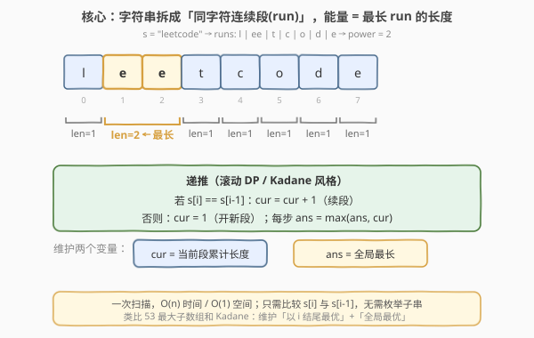
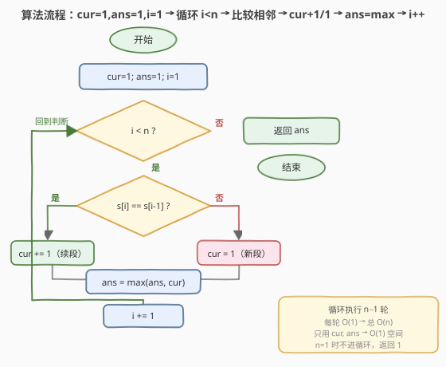
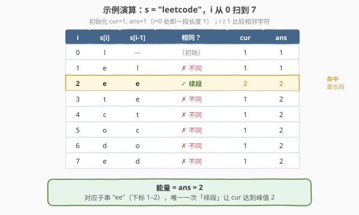

# LeetCode 连续字符 题解

## 1. 题目概述

- **标题 / 题号**：连续字符（#1446，easy）
- **链接**：https://leetcode.cn/problems/consecutive-characters/
- **难度**：简单
- **标签**：字符串、一次遍历、动态规划

**题意**：给定字符串 `s`，定义其**「能量」**为：**只包含一种字符的最长非空子字符串的长度**。请返回 `s` 的能量。

实质上，这就是求字符串中**最长同字符连续段（run）**的长度——即字符相同的、最长的连续片段有多长。

> ⚠️ 审题关键：求的是**子字符串（连续子串）**而非子序列；「只包含一种字符」意味着整段子串里所有字符都相同，即一个「run」。因此问题等价于「最长 run 的长度」。

**示例 1**：

```text
输入：s = "leetcode"
输出：2
解释：子字符串 "ee" 长度为 2，只包含字符 'e'。
```

**示例 2**：

```text
输入：s = "abbcccddddeeeeedcba"
输出：5
解释：子字符串 "eeeee" 长度为 5，只包含字符 'e'。
```

**约束**：

- $1 \le \text{s.length} \le 500$
- `s` 只包含小写英文字母

> 💡 **关键点**：字符串被「字符变化点」天然切分成若干个 run，能量就是这些 run 中最长的那个的长度。只需一次扫描、比较相邻字符即可。

## 2. 解题思路

### 2.1 暴力思路：枚举所有子串

最直白的做法：枚举所有非空子串 $s[i..j]$（$O(n^2)$ 个），对每个子串检查是否「只含一种字符」（$O(n)$），取合法子串的最大长度，整体 $O(n^3)$。

稍优的暴力：枚举每个起点 $i$，向右扩展 $j$ 直到 $s[j] \neq s[i]$，记录该 run 的长度 $j-i$。每个起点扩展的总工作量为 $O(n)$，合计 $O(n^2)$。

- **正确**：覆盖所有 run，必然能取到最长。
- **低效**：同一段 run 会被多个起点重复扫描。例如 `"eeeee"`，从下标 0 扩展会走 5 步，从下标 1 扩展又走 4 步……大量重复比较。

> ⚠️ 暴力的问题在于**没利用「run 内部字符全同」这一结构**——一旦确认 $s[i]$ 与 $s[i-1]$ 相同，那么「以 $i$ 结尾的 run」就一定是「以 $i-1$ 结尾的 run」再延长一格，长度可直接递推，无需重新从起点扩展。

### 2.2 核心观察：相邻比较 + 滚动累计



两个观察把扫描降到线性、$O(1)$ 空间：

**观察一（run 可递推）**：设 `cur` 为「以下标 $i$ 结尾的最长同字符连续段长度」。若 $s[i] == s[i-1]$，则 $i$ 接在了同一段后面，`cur = cur + 1`；否则 $i$ 自成新段，`cur = 1`。这样 `cur` 只依赖前一个位置的 `cur`，可滚动维护，无需回看整段。

**观察二（全局最优取 max）**：能量是所有 run 长度的最大值。每算出一个新的 `cur`，就用 `ans = max(ans, cur)` 更新答案。扫完一遍，`ans` 即为最长 run。

> 💡 **一句话**：维护两个变量 `cur`（当前段累计长度）与 `ans`（全局最长），比较相邻字符决定 `cur` 续段还是重置，每步用 `cur` 刷新 `ans`。这正是 [53. 最大子数组和](../0001-0100/53_最大子数组和.md) 的 Kadane 模板——「以 $i$ 结尾的最优」+「全局最优」——只是把「子和最大」换成「同字符段最长」。

> ⚠️ **边界**：$n=1$ 时循环不执行，`cur=ans=1` 直接返回，正确（单个字符即长度为 1 的 run）。因此初始化 `cur=ans=1`、循环从 $i=1$ 起是安全的。

### 2.3 算法流程图



**完整步骤**：

1. **初始化** `cur = 1`，`ans = 1`，`i = 1`（下标 0 自成一段，长度 1）；
2. **循环** 当 `i < n`：
   - 若 `s[i] == s[i-1]`：`cur += 1`（续段）；
   - 否则：`cur = 1`（开新段）；
   - `ans = max(ans, cur)`；
   - `i += 1`；
3. **返回** `ans`。

> 💡 循环共 $n-1$ 轮，每轮 $O(1)$，合计 $O(n)$；全程只用 `cur`、`ans` 两个标量，$O(1)$ 额外空间。

### 2.4 示例演算

以示例 1 的 `s = "leetcode"` 为例：



| 轮次 $i$ | $s[i]$ | $s[i-1]$ | 相邻相同？ | `cur` | `ans` | 说明 |
|----------|--------|----------|------------|-------|-------|------|
| 0 | l | — | —（初始） | 1 | 1 | 下标 0 自成一段 |
| 1 | e | l | ✗ | 1 | 1 | 不同 → 开新段 |
| 2 | e | e | ✓ | 2 | 2 | 续段，`cur` 达峰值 2 |
| 3 | t | e | ✗ | 1 | 2 | 不同 → 重置为 1 |
| 4 | c | t | ✗ | 1 | 2 | 不同 → 重置为 1 |
| 5 | o | c | ✗ | 1 | 2 | 不同 → 重置为 1 |
| 6 | d | o | ✗ | 1 | 2 | 不同 → 重置为 1 |
| 7 | e | d | ✗ | 1 | 2 | 不同 → 重置为 1 |

- **第 2 轮**是唯一的「续段」时刻：`s[2]=='e' == s[1]=='e'`，`cur` 从 1 升到 2，`ans` 同步刷新为 2。
- 其余各轮字符均与前一个不同，`cur` 反复重置为 1，`ans` 维持 2 不变。

最终返回 `ans = 2` ✓，对应子串 `"ee"`（下标 1–2）。

> 以示例 2 `"abbcccddddeeeeedcba"` 为例：run 依次为 `a(1) b(2) c(3) d(4) e(5) d(1) c(1) b(1) a(1)`，`cur` 在 `e` 段爬升到 5，`ans = 5` ✓。

## 3. 参考代码

### C++

```cpp
class Solution {
public:
    int maxPower(string s) {
        int ans = 1, cur = 1;
        for (int i = 1; i < (int)s.size(); ++i) {
            if (s[i] == s[i - 1]) {
                ++cur;
            } else {
                cur = 1;
            }
            ans = max(ans, cur);
        }
        return ans;
    }
};
```

### Python

```python
class Solution:
    def maxPower(self, s: str) -> int:
        ans = cur = 1
        for i in range(1, len(s)):
            if s[i] == s[i - 1]:
                cur += 1
            else:
                cur = 1
            ans = max(ans, cur)
        return ans
```

> 💡 **实现要点**：① 初始化 `cur = ans = 1`，循环从 `i = 1` 起，天然处理 $n=1$ 的边界；② 每轮**先更新 `cur` 再刷新 `ans`**——`ans` 必须看到本轮的 `cur`，否则会漏掉当前段；③ 只用 `cur`、`ans` 两个标量，无额外数组。

## 4. 复杂度分析

| 维度 | 一次遍历 $O(n)$（推荐） | 枚举起点扩展 $O(n^2)$ |
|------|------------------------|------------------------|
| **时间复杂度** | $O(n)$ | $O(n^2)$ |
| **空间复杂度** | $O(1)$ | $O(1)$ |
| **是否利用 run 可递推** | ✅ `cur` 滚动累计 | ✗ 每个起点重新扩展 |
| **重复比较** | 无，每对相邻字符比较一次 | 有，同一段被多个起点重复扫 |
| **能否 AC** | ✅ | ✅（$n \le 500$ 也能过，但非最优） |

- **一次遍历**：循环 $n-1$ 轮，每轮一次相邻比较 + 一次 `max`，合计 $O(n)$；仅用两个标量，$O(1)$ 空间。是最优解。
- **枚举起点扩展**：对每个 $i$ 向右扩展到 run 末尾，最坏情况（整串同字符）每个起点扩展 $O(n)$，合计 $O(n^2)$。本题 $n \le 500$ 仍可 AC，但未利用递推结构。

> ⚠️ 面试中应主动给出 $O(n)$ 解法并说明**为何 `cur` 可递推**——因为「以下标 $i$ 结尾的最长同字符段」要么是「以 $i-1$ 结尾的那段」延长一格（当 $s[i]==s[i-1]$），要么退化为单字符段（当不同），状态只依赖前一个位置，符合无后效性。

## 5. 扩展：DP 视角与分组循环写法

### 5.1 DP 视角：滚动数组降维

定义 $dp[i]$ = 以下标 $i$ 结尾的最长同字符连续段长度。状态转移：

$$
dp[i] = \begin{cases} dp[i-1] + 1, & s[i] == s[i-1] \\ 1, & s[i] \neq s[i-1] \end{cases}
$$

答案为 $\max_{i} dp[i]$。由于 $dp[i]$ 只依赖 $dp[i-1]$，可用一个变量 `cur` 滚动替代整个数组，空间从 $O(n)$ 降到 $O(1)$——这正是第 3 节的代码。这与 [53. 最大子数组和](../0001-0100/53_最大子数组和.md) 的 Kadane 如出一辙：$dp[i]$ = 「以 $i$ 结尾的最优」，全局取 max。

> 💡 这种「以 $i$ 结尾」的状态定义是无后效性 DP 的经典范式：当前状态只由前一个状态 + 当前输入决定，天然可滚动数组优化。

### 5.2 分组循环写法

当题目不止要「最长段长度」，还要**每段本身的信息**（如下标范围、字符）时，用「分组循环」更直观——外层 `i` 控总进度，内层 `while` 一次性跳过整段同字符：

```python
class Solution:
    def maxPower(self, s: str) -> int:
        ans, i, n = 0, 0, len(s)
        while i < n:
            j = i
            while j < n and s[j] == s[i]:
                j += 1
            ans = max(ans, j - i)   # 本段长度
            i = j                    # 跳到下一段起点
        return ans
```

> 💡 此写法同样 $O(n)$（每个字符被内层访问一次，外层 `i` 直接跳到段尾，无重复扫描），但更易扩展——例如 [228. 汇总区间](../0201-0300/228_汇总区间.md) 需要把每段输出成 `"起->终"` 区间串，分组循环天然产出每段的 `[i, j)` 范围。本题只需最长长度，故递推版更简洁。

## 6. 面试要点

1. **为什么初始化 `cur = ans = 1` 而不是 0？**

   > 字符串非空（$n \ge 1$），下标 0 自成一段长度为 1 的 run，因此 `cur`、`ans` 起点至少为 1。若初始化为 0，遇到 $n=1$ 或全不同字符（如 `"abc"`）时会返回 0 而非 1，出错。

2. **`cur` 和 `ans` 各自的语义是什么？**

   > `cur` = 以下标 $i$ 结尾的最长同字符连续段长度（局部状态）；`ans` = 扫描到目前位置所见 run 长度的最大值（全局最优）。每步先用相邻比较更新 `cur`，再用 `cur` 刷新 `ans`。

3. **为什么可以递推 `cur`，不用回看整段？**

   > 因为「以 $i$ 结尾的同字符段」具有无后效性：若 $s[i]==s[i-1]$，它就是「以 $i-1$ 结尾的段」+1；否则退化为单字符段。状态只依赖前一个位置，无需知道段的起点在哪里。

4. **如果要返回最长同字符子串本身（而非长度），怎么做？**

   > 在更新 `ans` 时记录对应的段起点 `start` 和长度：当 `cur > ans` 时令 `best_start = i - cur + 1`（或分组循环里记 `i`）。最后返回 `s[best_start : best_start + ans]`。若存在多个等长段，按更新条件决定取首个还是末个。

5. **本题与 [53. 最大子数组和](../0001-0100/53_最大子数组和.md) 的 Kadane 有何异同？**

   > 同：都维护「以 $i$ 结尾的局部最优」+「全局最优」，每步 $O(1)$ 递推，$O(n)$ 时间 $O(1)$ 空间。异：53 的递推是 $dp[i] = \max(dp[i-1]+nums[i],\, nums[i])$（涉及加法与取舍），而本题递推是「相同则 +1 否则置 1」的布尔分支，更简单。可视为 Kadane 在「同字符段」场景下的退化特例。

> 💡 **一句话总结**：1446 的灵魂是「**相邻比较 + 滚动累计**」——`cur` 续段或重置，`ans` 取 max，一次扫描 $O(n)$/$O(1)$ 即得最长同字符连续段长度，是 Kadane 模板的最简应用。

## 同类练习题

| # | 题目 | 与本题的关联 |
|---|------|-------------|
| 485 | [最大连续 1 的个数](../0401-0500/485_最大连续1的个数.md) | 同一套一次遍历累计模板，把「同字符」换成「等于 1」，`cur` 续段条件改为 `nums[i]==1`，对照 1446 体会模板的复用 |
| 674 | [最长连续递增序列](../0601-0700/674_最长连续递增序列.md) | 相邻比较改为 `nums[i] > nums[i-1]`，`cur` 累计递增段长度，与 1446 仅差一个比较谓词，同源套路 |
| 228 | [汇总区间](../0201-0300/228_汇总区间.md) | 分组循环把连续同值/等差段汇总成区间串，1446 是其「只求最长段长度」的极简版，分组循环写法直接互通 |
| 1180 | [统计只含单一字母的子串](../1101-1200/1180_统计只含单一字母的子串.md) | 在每段同字符长度 $\ell$ 上统计子串数 $\ell(\ell+1)/2$，1446 正是其前置——先求各 run 长度，再在段内做组合计数 |
| 53 | [最大子数组和](../0001-0100/53_最大子数组和.md) | Kadane 模板母题——「以 $i$ 结尾最优」+「全局最优」的滚动 DP，1446 是其在「同字符段」场景下的退化特例 |
