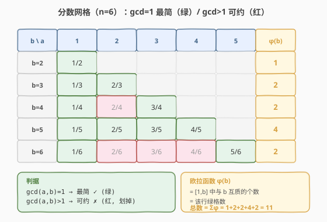
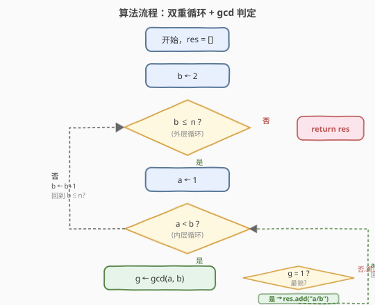
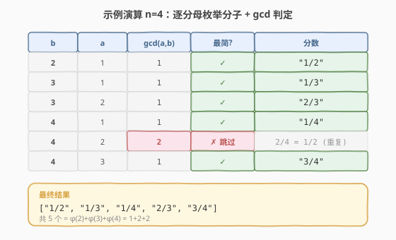

# LeetCode 最简分数 题解

## 1. 题目概述

- **标题 / 题号**：最简分数（#1447，medium）
- **链接**：https://leetcode.cn/problems/simplified-fractions/
- **难度**：中等
- **标签**：数学、最大公约数、欧拉函数

**题意**：给定一个整数 `n`，返回所有 **0 到 1 之间（不包括 0 和 1）** 满足分母小于等于 `n` 的 **最简分数**。分数可以以任意顺序返回。

**最简分数**定义为分子和分母的最大公约数为 1 的分数（即不可再约分）。

**示例 1**：

```text
输入：n = 2
输出：["1/2"]
解释："1/2" 是唯一一个分母小于等于 2 的最简分数。
```

**示例 2**：

```text
输入：n = 3
输出：["1/2","1/3","2/3"]
```

**示例 3**：

```text
输入：n = 4
输出：["1/2","1/3","1/4","2/3","3/4"]
解释："2/4" 不是最简分数，因为它可以化简为 "1/2"。
```

**示例 4**：

```text
输入：n = 1
输出：[]
```

**约束**：

- `1 <= n <= 100`

> 💡 本题是**数论 + GCD** 的招牌入门题。核心就一句话：分数 $\frac{a}{b}$ 是最简的 $\iff \gcd(a, b) = 1$。于是对每个分母 $b$ 枚举分子 $a \in [1, b{-}1]$，用辗转相除法判定即可。更深一层，每个分母 $b$ 对应的最简分数个数恰为**欧拉函数** $\varphi(b)$——即 $[1, b]$ 中与 $b$ 互质的整数个数。

## 2. 解题思路

### 2.1 暴力思路：枚举所有分数 + 试除判简

最直观的做法：枚举所有满足 $1 \le a < b \le n$ 的分数 $\frac{a}{b}$，对每个分数检查是否存在 $d \ge 2$ 同时整除 $a$ 和 $b$——若有则可约分（非最简），若无则最简。

```text
ans = []
for b in 2..n:
    for a in 1..b-1:
        simplified = True
        for d in 2..a:              # 试除找公因子
            if a % d == 0 and b % d == 0:
                simplified = False
                break
        if simplified:
            ans.append("a/b")
```

三重循环：$O(n^2)$ 个分数 × 每个至多试除 $O(n)$ 次 = $O(n^3)$。$n=100$ 时约 $5 \times 10^5$，虽能通过，但试除法完全没有利用「最大公约数」这一结构。

> ⚠️ 暴力法的根因：逐个试除 $d$ 等价于「手算 $\gcd$ 的笨办法」。与其一个个试因子，不如直接用**辗转相除法**一步求出 $\gcd(a, b)$——若结果为 1 即最简，否则非最简。这正是数论中「最大公约数」概念的直接应用。

### 2.2 核心观察：gcd(a,b)==1 是最简的充要条件



**关键定理**：分数 $\frac{a}{b}$ 不可约分 $\iff \gcd(a, b) = 1$。

- **必要性**：若 $\gcd(a, b) = d > 1$，则 $\frac{a}{b} = \frac{a/d}{b/d}$，可约分，非最简。
- **充分性**：若 $\gcd(a, b) = 1$，则不存在 $d \ge 2$ 同时整除 $a$ 和 $b$，无法约分，故最简。

于是判简问题转化为**一次 $\gcd$ 计算**。用辗转相除法（欧几里得算法），$\gcd(a, b)$ 的时间为 $O(\log(\min(a, b)))$——每一步至少把较大数减半。

**欧拉函数的连接**：对固定分母 $b$，合法分子 $a$ 的个数恰好是欧拉函数 $\varphi(b)$，即 $[1, b]$ 中与 $b$ 互质的整数个数。这给出一个理论计数公式：

$$
\text{最简分数总数} = \sum_{b=2}^{n} \varphi(b)
$$

例如 $n=6$ 时，$\varphi(2){+}\varphi(3){+}\varphi(4){+}\varphi(5){+}\varphi(6) = 1{+}2{+}2{+}4{+}2 = 11$。不过本题要求**列出**所有分数而非仅计数，所以仍需逐个枚举。

> 💡 辗转相除法求 $\gcd$ 的核心是 $\gcd(a, b) = \gcd(b, a \bmod b)$，基准 $\gcd(a, 0) = a$。这是 [149. 直线上最多的点数](../0101-0200/149_直线上最多的点数.md) 中用 GCD 化简斜率分数的同一技巧——「分数 → 最简分数」的精确表示都靠 $\gcd$。

### 2.3 算法流程图



**三步法**：

1. **外层分母**：$b$ 从 $2$ 到 $n$（$b=1$ 时无合法分子，因为 $a \in [1, 0]$ 为空）。
2. **内层分子**：$a$ 从 $1$ 到 $b-1$（$a < b$ 保证分数 $< 1$；$a \ge 1$ 保证分数 $> 0$）。
3. **gcd 判定**：若 $\gcd(a, b) == 1$，将 `"{a}/{b}"` 加入结果列表。

> ⚠️ **边界**：$n = 1$ 时外层循环不执行（$b$ 从 $2$ 到 $1$ 为空），返回空列表，与示例 4 一致。无需特判。

### 2.4 示例演算

以 $n = 4$ 为例，逐步展示每个分母 $b$ 下的枚举与 $\gcd$ 判定：



| 分母 $b$ | 分子 $a$ | $\gcd(a, b)$ | 最简？ | 分数 |
|----------|---------|-------------|--------|------|
| 2 | 1 | 1 | ✓ | "1/2" |
| 3 | 1 | 1 | ✓ | "1/3" |
| 3 | 2 | 1 | ✓ | "2/3" |
| 4 | 1 | 1 | ✓ | "1/4" |
| 4 | 2 | 2 | ✗ 跳过 | — |
| 4 | 3 | 1 | ✓ | "3/4" |

最终结果：`["1/2", "1/3", "1/4", "2/3", "3/4"]`，共 $5$ 个（$= \varphi(2){+}\varphi(3){+}\varphi(4) = 1{+}2{+}2$）。

> 💡 注意 $b=4$ 时 $a=2$ 的 $\gcd(2,4)=2$，$\frac{2}{4} = \frac{1}{2}$ 已在 $b=2$ 时出现，故跳过——这正是「最简」保证不重复的机制：每个分数只在其最简形式下被唯一的分母 $b$ 收录。

## 3. 参考代码

### C++

```cpp
// 1447. 最简分数.cpp —— 双重循环 + gcd 判定
// 编译: g++ -O2 -std=c++17 最简分数.cpp -o frac
#include <vector>
#include <string>
#include <numeric>
using namespace std;

class Solution {
  public:
    vector<string> simplifiedFractions(int n) {
        vector<string> res;
        for (int b = 2; b <= n; ++b)
            for (int a = 1; a < b; ++a)
                if (gcd(a, b) == 1)
                    res.push_back(to_string(a) + "/" + to_string(b));
        return res;
    }
};
```

### Python

```python
from math import gcd

class Solution:
    def simplifiedFractions(self, n: int) -> list[str]:
        res = []
        for b in range(2, n + 1):
            for a in range(1, b):
                if gcd(a, b) == 1:
                    res.append(f"{a}/{b}")
        return res
```

> 💡 **语言差异**：C++17 起 `<numeric>` 提供 `std::gcd`，直接调用；Python 3.5+ `math.gcd` 同样内置。两者都是辗转相除法的标准库实现，无需手写。若面试要求手写 $\gcd$，给出递归版 `int gcd(int a, int b) { return b ? gcd(b, a % b) : a; }` 即可。

## 4. 复杂度分析

| 维度 | 复杂度 | 说明 |
|------|--------|------|
| **时间复杂度** | $O(n^2 \log n)$ | 枚举 $O(n^2)$ 个分数对，每对 $\gcd$ 为 $O(\log(\min(a,b))) = O(\log n)$ |
| **空间复杂度** | $O(n^2)$ | 结果列表存储约 $\sum_{b=2}^{n} \varphi(b) \approx \frac{3}{\pi^2} n^2 \approx 0.304\, n^2$ 个字符串 |
| **最优时间** | $\Theta(n^2)$ | 输出本身有 $\Theta(n^2)$ 个分数（互质对密度 $6/\pi^2$），算法已最优 |

> 💡 互质对的渐近密度为 $\frac{6}{\pi^2} \approx 0.608$，故 $n=100$ 时最简分数约 $0.608 \times \frac{100^2}{2} \approx 3040$ 个。输出规模 $\Theta(n^2)$ 决定了任何算法都至少 $O(n^2)$，$\gcd$ 的 $O(\log n)$ 因子已是极小常数（$n \le 100$ 时 $\log n \le 7$）。

## 5. 扩展：欧拉函数筛 O(n) 计数

若题目只问**最简分数的个数**而非列出所有分数，可用**欧拉函数筛**在 $O(n)$ 内预处理 $\varphi(b)$，再求前缀和。

### 5.1 埃氏筛版（简洁，O(n log log n)）

对每个质数 $p$，将其所有倍数 $j$ 的 $\varphi(j)$ 乘以 $(1 - 1/p)$，即 $\varphi(j) \mathrel{-}= \varphi(j) / p$。写法类似 [204. 计数质数](../0201-0300/204_计数质数.md) 的埃氏筛。

```cpp
// 埃氏筛预处理欧拉函数 φ，O(n log log n)
vector<int> eulerPhiSieve(int n) {
    vector<int> phi(n + 1);
    iota(phi.begin(), phi.end(), 0);      // φ(i) 初始 = i
    for (int i = 2; i <= n; ++i)
        if (phi[i] == i)                  // i 是质数（未被任何更小质数触及）
            for (int j = i; j <= n; j += i)
                phi[j] -= phi[j] / i;     // φ(j) *= (1 - 1/i)
    return phi;
}
// 最简分数个数 = Σ_{b=2}^{n} phi[b]
```

### 5.2 线性筛版（O(n)）

利用 $\varphi$ 的积性：若 $\gcd(i, p) = 1$ 则 $\varphi(ip) = \varphi(i)\varphi(p)$；若 $p \mid i$ 则 $\varphi(ip) = \varphi(i) \cdot p$。

```cpp
// 线性筛预处理欧拉函数 φ，O(n)
vector<int> eulerPhiLinear(int n) {
    vector<int> phi(n + 1), primes;
    vector<bool> isComp(n + 1, false);
    iota(phi.begin(), phi.end(), 0);
    for (int i = 2; i <= n; ++i) {
        if (!isComp[i]) {
            primes.push_back(i);
            phi[i] = i - 1;               // φ(p) = p - 1
        }
        for (int p : primes) {
            if (i * p > n) break;
            isComp[i * p] = true;
            if (i % p == 0) {
                phi[i * p] = phi[i] * p;  // p | i
                break;
            } else {
                phi[i * p] = phi[i] * (p - 1);  // gcd(i,p)=1
            }
        }
    }
    return phi;
}
```

### 5.3 验算

$n=6$ 时 $\varphi = [0,1,1,2,2,4,2]$（下标 0–6），$\sum_{b=2}^{6} \varphi(b) = 1+2+2+4+2 = 11$ ✓。

> 💡 这套「筛法预处理数论函数」与 [204. 计数质数](../0201-0300/204_计数质数.md) 的埃氏筛同构——一个是划掉合数数质数个数，一个是按质因子累乘算 $\varphi$，骨架都是「外层质数 × 内层倍数」。

## 6. 面试要点

1. **为什么 gcd(a,b)==1 等价于最简分数？**

   > 若 $\gcd(a,b)=d>1$，则 $a/d$ 和 $b/d$ 都是整数且 $d \ge 2$，$\frac{a}{b}=\frac{a/d}{b/d}$ 可约分，非最简。反之 $\gcd=1$ 时不存在任何 $d \ge 2$ 同时整除 $a$、$b$，无法约分。因此最简 $\iff \gcd=1$ 是充要的。

2. **辗转相除法为什么是 O(log n)？**

   > 每一步 $\gcd(a,b) \to \gcd(b, a \bmod b)$，余数 $a \bmod b < b$，且下一步的较大数变成原来的较小数 $b$。更精确地，$a \bmod b \le a/2$（当 $b > a/2$ 时余数 $a-b < a/2$；当 $b \le a/2$ 时余数 $< b \le a/2$），故每两步较大数至少减半，总步数 $O(\log(\min(a,b)))$。

3. **每个最简分数是否唯一出现？会不会重复？**

   > 不会重复。每个有理数 $\frac{a}{b} \in (0,1)$ 有唯一的**最简形式** $\frac{a'}{b'}$（$\gcd(a',b')=1$），且 $b' \le b$。本题枚举时只在 $b=b'$（最简分母）处收录 $\frac{a'}{b'}$，其他等价分数（如 $\frac{2}{4}$）因 $\gcd \ne 1$ 被跳过。所以结果集天然无重复。

4. **n=1 为什么返回空列表？**

   > 分母 $b \ge 2$ 才有合法分子（$a \in [1, b-1]$ 非空需 $b \ge 2$）。$n=1$ 时 $b$ 从 $2$ 到 $1$ 循环体不执行，自然返回空。无需特判。

5. **若 n 很大（如 $10^5$）只问个数，怎么优化？**

   > 列出分数需 $\Theta(n^2)$ 输出，$n=10^5$ 时约 $3 \times 10^9$ 个，不可行。但**计数**可用欧拉函数筛 $O(n)$ 预处理 $\varphi$，再求前缀和 $O(1)$ 查询任意 $n$ 的答案（见第 5 节）。渐近公式 $\sum_{b=2}^{n} \varphi(b) \approx \frac{3}{\pi^2} n^2$。

> 💡 **一句话总结**：本题 = 「$\gcd(a,b)=1 \iff$ 最简分数」的直接应用。双重循环枚举 $a < b$，$\gcd$ 判定一步到位，$O(n^2 \log n)$ 列出全部；若只计数则用欧拉函数筛 $O(n)$。

## 同类练习题

| # | 题目 | 与本题的关联 |
|---|------|-------------|
| 149 | [直线上最多的点数](https://leetcode.cn/problems/max-points-on-a-line/)（[题解](../0101-0200/149_直线上最多的点数.md)） | 用 GCD 化简斜率分数 $(\Delta y, \Delta x)$ 为最简形式作哈希键，同一套「分数 → gcd → 最简」技巧 |
| 204 | [计数质数](https://leetcode.cn/problems/count-primes/)（[题解](../0201-0300/204_计数质数.md)） | 埃氏筛模板，与欧拉函数筛同属「筛法预处理数论函数」骨架 |
| 172 | [阶乘后的零](https://leetcode.cn/problems/factorial-trailing-zeroes/)（[题解](../0101-0200/172_阶乘后的零.md)） | 勒让德公式数质因子，与欧拉函数同为「数论函数计数」家族 |
| 166 | [分数到小数](https://leetcode.cn/problems/fraction-to-recurring-decimal/)（[题解](../0101-0200/166_分数到小数.md)） | 分数运算的另一方向（分数→小数 + 循环节检测），对照本题「判定分数最简性」 |
