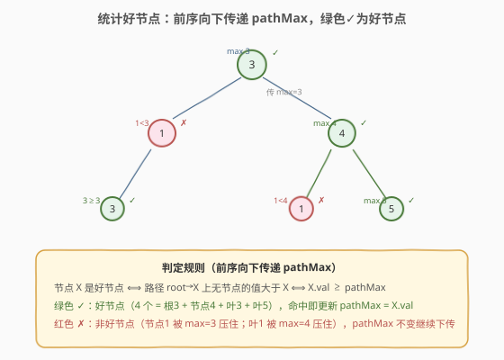
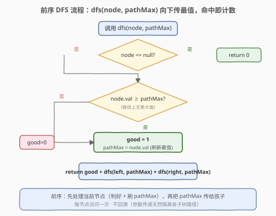
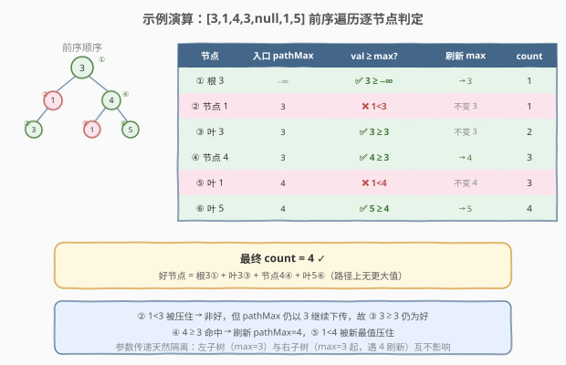

# 统计二叉树中好节点的数目

- **题目名称**：统计二叉树中好节点的数目
- **链接**：[1448. 统计二叉树中好节点的数目](https://leetcode.cn/problems/count-good-nodes-in-binary-tree/)
- **难度**：中等
- **标签**：树、二叉树、深度优先搜索、前序遍历

## 1. 题目概述

给定一棵二叉树的根节点 `root`，统计其中**好节点**的数量。

> **好节点**：在从根到该节点 `X` 的路径上，**没有任何节点的值大于** `X.val`（即 `X` 是该路径上的最大值，等值不算「更大」）。

**示例 1**：

```text
输入：root = [3,1,4,3,null,1,5]
输出：4

        3
       / \
      1   4
     /   / \
    3   1   5
```

4 个好节点：根 `3`（路径 `[3]`，最大）、节点 `4`（路径 `[3,4]`，4 是最大）、节点 `5`（路径 `[3,4,5]`，5 是最大）、左下叶 `3`（路径 `[3,1,3]`，3 是最大）。节点 `1`（路径 `[3,1]`，3 > 1）与叶 `1`（路径 `[3,4,1]`，4 > 1）不是好节点。

**示例 2**：

```text
输入：root = [3,3,null,4,2]
输出：3

        3
       /
      3
     / \
    4   2
```

好节点：根 `3`、节点 `3`（路径 `[3,3]`，3 ≥ 3）、节点 `4`（路径 `[3,3,4]`，4 最大）。叶 `2` 不是（路径 `[3,3,2]`，3 > 2）。

**示例 3**：

```text
输入：root = [1]
输出：1
```

**约束条件**：

- 二叉树中节点数目范围 `[1, 10^5]`
- `-10^4 <= Node.val <= 10^4`

> 💡 本题是「**前序遍历 + 路径最值向下传递**」的招牌题。一个节点是否为「好节点」**只取决于它祖先链上的最大值**——与后代无关。因此只需一次**前序 DFS**，把「从根到当前节点的路径最大值 `pathMax`」作为参数向下传递：当前节点 `val ≥ pathMax` 即为好节点，命中后刷新 `pathMax` 继续传给孩子。这与 [250. 统计同值子树](../0201-0300/250_统计同值子树.md) 的「后序向上传递子树结论」恰是**镜像**——一个信息向下流，一个信息向上流。

---

## 2. 解题思路

### 2.1 暴力思路：逐节点回溯路径找最大

最直观的做法：遍历每个节点，对每个节点 `X` 从根出发重新走一遍到 `X` 的路径，记录路径上的最大值，再与 `X.val` 比较。时间 $O(n^2)$（每个节点都要重走一遍祖先链），空间 $O(h)$。

更聪明的暴力是「DFS + 维护路径数组 + 回溯」：用一条栈记录当前路径，进入节点时压栈、退出时弹栈，判定时扫描整条路径求最大。这样每个节点只访问一次，但**每次判定仍需 $O(h)$ 扫描路径**求最大值，总时间 $O(n \cdot h)$，退化链时仍是 $O(n^2)$。

> ⚠️ 暴力法的浪费在于：路径最大值本是**可增量维护**的——从父节点传到子节点时，只需把「父的 pathMax」与「父的 val」取较大即可得到子的入口 pathMax，根本不必重新扫描整条路径。把这一增量维护显式化，就得到 $O(n)$ 的最优解。

### 2.2 核心观察：前序向下传递 pathMax



**关键洞察**：好节点的判定具有「**只看祖先、不看后代**」的单向性——

> 节点 `X` 是好节点 ⟺ 路径 `root → X` 上无节点的值大于 `X.val` ⟺ $X.val \geq \max\limits_{\text{路径}}$

而路径最大值可以**自顶向下增量维护**：设父节点传给子节点的入口 `pathMax` 为「根到父节点（含）路径上的最大值」，则子节点只需比较 `child.val` 与 `pathMax`：

- `child.val ≥ pathMax` → 子是好节点，计数 +1，并把新的 `pathMax = child.val` 继续向下传；
- `child.val < pathMax` → 子不是好节点，`pathMax` 不变继续向下传。

这天然对应**前序遍历**（先处理当前节点，再递归左右子树）：处理当前节点时它祖先链的 `pathMax` 已经由父节点算好传下来了。每个节点只访问一次，每次 $O(1)$ 比较。

> ⚠️ **「≥」还是「>」？** 题目说「没有节点的值**大于** X」，即 X 是路径上的**严格最大或并列最大**。等值不算「更大」，所以用 `≥`：路径上已有与 X 相等的值时，X 仍是好节点（示例 2 的节点 `3`，路径 `[3,3]`，第二个 3 是好节点）。

> 💡 **为什么用参数传递而非全局变量 + 回溯？** 全局 `pathMax` 也能做（进入节点先比对、若命中则更新，递归回来再恢复旧值），但**参数传递天然隔离各子树的路径**：左子树与右子树各自收到独立的 `pathMax` 副本，无需手动回溯，代码更简洁且不易出错。本质上是把「状态」从「边效应」变成了「不可变输入」。

### 2.3 算法流程图



**DFS 完整步骤**（函数 `dfs(node, pathMax)` 返回以 `node` 为根的子树中好节点数）：

1. **空节点**：返回 `0`；
2. **判定好节点**：若 `node.val ≥ pathMax`，则 `good = 1` 并更新 `pathMax = node.val`；否则 `good = 0`，`pathMax` 不变；
3. **递归左右**：`return good + dfs(node.left, pathMax) + dfs(node.right, pathMax)`——把（可能刷新后的）`pathMax` 传给两个孩子。

> 💡 **递归返回值的设计**：与 [250](../0201-0300/250_统计同值子树.md) 用 `nonlocal count` 做副作用不同，本题 `dfs` 直接**返回子树的好节点数**，把当前节点自身的 `good` 与左右子树的结果相加。原因是本题的判定信息**自顶向下流**，子树的好节点数与父节点无关（父的判定不依赖子树结论），所以可以「先判定自己、再累加子树返回值」。250 则是自底向上，父的判定依赖子树结论，故用布尔返回值 + 副作用计数更自然。

### 2.4 示例演算

以示例 1 `root = [3,1,4,3,null,1,5]` 为例，前序遍历顺序与计数过程：



| 前序访问节点 | 入口 pathMax | 判定 | 刷新 pathMax | count |
|-------------|-------------|------|-------------|-------|
| ① 根 3 | $-\infty$ | ✅ $3 \geq -\infty$ | → 3 | 1 |
| ② 节点 1（左） | 3 | ❌ $1 < 3$ | 不变 3 | 1 |
| ③ 叶 3（左下） | 3 | ✅ $3 \geq 3$ | 不变 3 | 2 |
| ④ 节点 4（右） | 3 | ✅ $4 \geq 3$ | → 4 | 3 |
| ⑤ 叶 1（4 的左子） | 4 | ❌ $1 < 4$ | 不变 4 | 3 |
| ⑥ 叶 5（4 的右子） | 4 | ✅ $5 \geq 4$ | → 5 | 4 |

最终 `count = 4` ✓。注意 ② 的 `1` 虽非好节点，但 `pathMax=3` 继续下传，使 ③ 的 `3` 仍满足 $3 \geq 3$ 成为好节点——**非好节点不阻断 `pathMax` 传播**，只阻断「刷新」。

> 💡 **左右子树互不影响**：根的左子树入口 `pathMax=3`（②③），右子树入口也是 `pathMax=3`（④⑤⑥），但右子树在 ④ 处把 `pathMax` 刷新为 4。参数传递让 ④ 的刷新只作用于 ⑤⑥，不波及左子树已完成的计算——这正是「参数即不可变副本」的好处。

---

## 3. 参考代码

### C++

```cpp
// 1448. 统计二叉树中好节点的数目.cpp —— 前序 DFS + pathMax 向下传递
class Solution {
public:
    int goodNodes(TreeNode* root) {
        return dfs(root, INT_MIN);
    }
private:
    int dfs(TreeNode* node, int pathMax) {
        if (!node) return 0;
        int good = 0;
        if (node->val >= pathMax) {        // 当前是路径最大（含等值）
            good = 1;
            pathMax = node->val;           // 刷新最值继续下传
        }
        return good + dfs(node->left, pathMax) + dfs(node->right, pathMax);
    }
};
```

### Python

```python
class Solution:
    def goodNodes(self, root: TreeNode) -> int:
        def dfs(node: TreeNode, path_max: int) -> int:
            if not node:
                return 0
            good = 0
            if node.val >= path_max:        # 当前是路径最大（含等值）
                good = 1
                path_max = node.val          # 刷新最值继续下传
            return good + dfs(node.left, path_max) + dfs(node.right, path_max)

        return dfs(root, float("-inf"))
```

> 💡 **初始 `pathMax` 的取值**：节点值范围 $[-10^4, 10^4]$，C++ 用 `INT_MIN`、Python 用 `float("-inf")` 保证根节点必然满足 `val ≥ pathMax`（根节点路径上无其他节点，天然是好节点）。也可传 `root.val` 作为初始值并先给根计数 +1，但统一用极小值更简洁、省去特判。

> 💡 两版逻辑完全一致：`dfs` 返回子树好节点数，当前节点的 `good` 与左右子树递归结果相加。`path_max` 作为函数参数按值传递，左子树的刷新不影响右子树收到的副本——无需回溯。

---

## 4. 复杂度分析

| 维度 | 复杂度 | 说明 |
|------|--------|------|
| 时间复杂度 | $O(n)$ | 每个节点只访问一次，每次做 $O(1)$ 比较与赋值 |
| 空间复杂度 | $O(h)$ | 递归栈深度 = 树高 $h$；平衡树 $O(\log n)$，退化链状 $O(n)$ |
| 最坏情况 | $O(n)$ 空间 | 树退化为单侧链时递归深度达 $n$ |

> ⚠️ 暴力法 $O(n \cdot h)$ 的浪费在于：每次判定重新扫描路径求最大值，而路径最大值本可由父节点增量传给子节点。前序传递法把「路径最大值」压缩成一个参数向下流动，把 $O(h)$ 的扫描降为 $O(1)$ 的比较——本质是**把重复计算的状态显式化为不可变输入**。

---

## 5. 扩展：迭代法（栈/队列 + pathMax）

递归写法在树极深（如 $n = 10^5$ 退化链）时有栈溢出风险。用显式栈做前序遍历，把 `(node, pathMax)` 一起压栈即可，无需回溯：

```python
class Solution:
    def goodNodes(self, root: TreeNode) -> int:
        count = 0
        stack = [(root, float("-inf"))]
        while stack:
            node, path_max = stack.pop()
            if node.val >= path_max:
                count += 1
                path_max = node.val
            if node.right:                    # 先压右，弹出时先处理左（前序）
                stack.append((node.right, path_max))
            if node.left:
                stack.append((node.left, path_max))
        return count
```

```cpp
int goodNodes(TreeNode* root) {
    int count = 0;
    stack<pair<TreeNode*, int>> st;
    st.push({root, INT_MIN});
    while (!st.empty()) {
        auto [node, pathMax] = st.top(); st.pop();
        if (node->val >= pathMax) {
            ++count;
            pathMax = node->val;
        }
        if (node->right) st.push({node->right, pathMax});
        if (node->left)  st.push({node->left, pathMax});
    }
    return count;
}
```

> 💡 **迭代 vs 递归**：迭代版用显式栈替代递归调用，把 `pathMax` 与节点捆绑压栈，时间同样 $O(n)$，空间 $O(h)$（栈最多存一层节点）。逻辑与递归完全等价——`pathMax` 仍是「按值传递」，每个栈帧持有独立副本，无需回溯恢复。面试推荐先讲递归版（体现对前序向下传递的理解），再提迭代版作为防栈溢出的工程备选。BFS（队列）同理，把 `(node, pathMax)` 入队即可。

---

## 6. 面试要点

1. **为什么用前序遍历而不是后序或中序？**

   > 好节点的判定只依赖**祖先链**上的信息（路径最大值），与后代无关。前序（根左右）在处理当前节点时，祖先链已完整确定，`pathMax` 可由父节点直接传下。后序/中序在处理节点时虽也能拿到祖先信息（若传参），但语义上「先处理父再处理子」的前序最自然——本题不需要子树的任何结论。这与 [250](../0201-0300/250_统计同值子树.md) 恰相反：250 的同值性依赖子树结论，必须后序向上传递。

2. **「≥」还是「>」？为什么等值算好节点？**

   > 题目定义「路径上没有节点的值**大于** X」。等值不算「更大」，所以路径上已有与 X 相等的值时，X 仍是好节点——用 `≥`。示例 2 的节点 `3`（路径 `[3,3]`）即印证：第二个 3 与根相等，是好节点。若误用 `>` 会漏掉所有等值节点。

3. **为什么 `pathMax` 用参数传递而非全局变量 + 回溯？**

   > 参数传递让每个子树收到独立的 `pathMax` 副本——左子树在内部刷新 `pathMax` 不会影响右子树收到的值，无需「进入时更新、退出时恢复」的回溯。代码更简洁、不易漏恢复。全局变量方案也能做（且空间略省），但当树形变复杂（如多状态传递）时回溯易写错，参数法更稳健。

4. **本题和 250 统计同值子树的核心区别是什么？**

   > **信息流向相反**。1448 的判定信息**自顶向下流**：好节点只看祖先，`pathMax` 由父传子，前序遍历，`dfs` 返回子树计数并向上累加。250 的判定信息**自底向上流**：子树同值性由孩子传父，后序遍历，`dfs` 返回布尔判定、用副作用计数。二者合起来覆盖了「树形传递题」的两种范式——看到「只看祖先」就前序向下传，看到「依赖子树」就后序向上传。

5. **如果树退化为长度 $10^5$ 的单链，递归会栈溢出吗？怎么办？**

   > 会。Python 默认递归深度约 1000，C++ 也受栈大小限制。改用第 5 节的显式栈迭代版，把 `(node, pathMax)` 压栈，空间 $O(h)$ 但无递归调用，可安全处理 $10^5$ 深度。也可在递归版外层 `sys.setrecursionlimit(200000)` 临时放宽，但迭代更稳妥。

> 💡 **一句话总结**：1448 的灵魂是「**前序遍历 + 路径最值向下传递**」——`dfs(node, pathMax)` 把祖先链最大值作为参数传下，当前 `val ≥ pathMax` 即好节点并刷新最值，一次遍历 $O(n)$ 完成计数。与 250 的「后序向上传递」互为镜像，共同构成树形传递题的两种基本范式。

---

## 7. 同类练习题

- [250. 统计同值子树](https://leetcode.cn/problems/count-univalue-subtrees/)（[题解](../0201-0300/250_统计同值子树.md)）：后序**向上**传递子树同值性，与本题前序**向下**传递路径最值互为镜像，体会信息流向决定遍历顺序
- [112. 路径总和](https://leetcode.cn/problems/path-sum/)（[题解](../0101-0200/112_路径总和.md)）：前序向下传递「剩余目标和」，同套「参数传状态、前序DFS」模板，叶节点处判定
- [129. 求根节点到叶节点数字之和](https://leetcode.cn/problems/sum-root-to-leaf-numbers/)（[题解](../0101-0200/129_求根节点到叶节点数字之和.md)）：前序向下传递前缀累积值 `cur = cur*10 + val`，本题传 `max` 是同框架的另一聚合
- [1022. 从根到叶的二进制数之和](https://leetcode.cn/problems/sum-of-root-to-leaf-binary-numbers/)（[题解](../1001-1100/1022_从根到叶的二进制数之和.md)）：前序向下传递路径数值 `cur = cur<<1 | val`，与 129 同构，强化「前序传参」肌肉记忆
- [1372. 二叉树中的最长交错路径](https://leetcode.cn/problems/longest-zigzag-path-in-a-binary-tree/)（[题解](../1301-1400/1372_二叉树中的最长交错路径.md)）：DFS 传递「方向 + 已走长度」，前序向下传状态、后序返回子树最优，本题的进阶复合版
