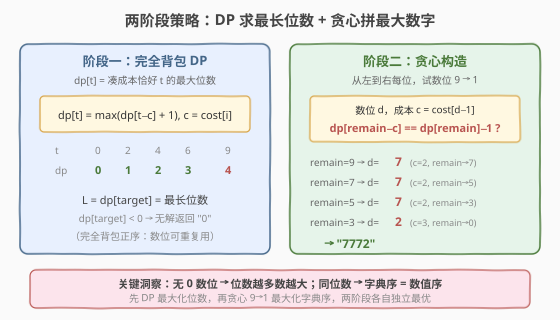
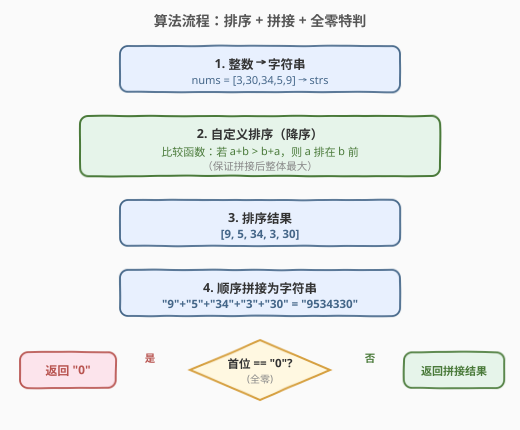
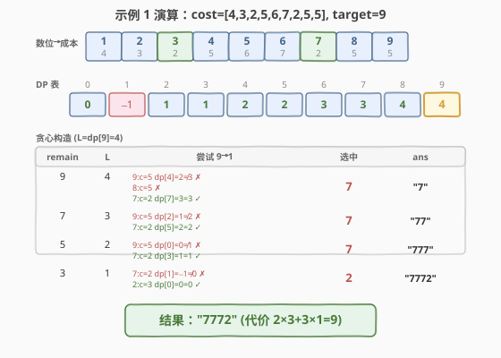

# 数位成本和为目标值的最大数字

- **题目名称**：数位成本和为目标值的最大数字
- **链接**：[1449. 数位成本和为目标值的最大数字](https://leetcode.cn/problems/form-largest-integer-with-digits-that-add-up-to-target/)
- **难度**：困难
- **标签**：动态规划、完全背包、贪心

## 1. 题目概述

给定整数数组 `cost`（长度 9）和整数 `target`。添加数位 `i + 1`（`i` 从 0 开始）的成本为 `cost[i]`。要求总成本**恰好**等于 `target`，且不使用数字 0，求能得到的**最大**整数（以字符串形式返回）。无法凑出则返回 `"0"`。

**示例 1**：

```text
输入：cost = [4,3,2,5,6,7,2,5,5], target = 9
输出："7772"
解释：数位 7 的成本为 2，数位 2 的成本为 3。"7772" 的代价为 2×3 + 3×1 = 9。
     "977" 代价也是 9，但 "7772" 位数更多（4 > 3），故更大。
```

**示例 2**：

```text
输入：cost = [7,6,5,5,5,6,8,7,8], target = 12
输出："85"
解释：数位 8 的成本是 7，数位 5 的成本是 5。"85" 的代价为 7 + 5 = 12。
```

**示例 3**：

```text
输入：cost = [2,4,6,2,4,6,4,4,4], target = 5
输出："0"
解释：总成本恰好为 target 的条件下，无法生成任何整数。
```

**示例 4**：

```text
输入：cost = [6,10,15,40,40,40,40,40,40], target = 47
输出："32211"
解释：数位 3 成本 15，数位 2 成本 10，数位 1 成本 6。"32211" = 15+10+10+6+6 = 47，位数 5。
```

**约束条件**：

- `cost.length == 9`
- `1 <= cost[i] <= 5000`
- `1 <= target <= 5000`

> 💡 本题是「**完全背包 + 贪心构造**」招牌题：目标不是求最少硬币数（如 [322. 零钱兑换](../0301-0400/322_零钱兑换.md)），而是求**最大数字**。关键洞察——没有数位 0，所以**位数越多数越大**；同位数时**字典序 = 数值序**。于是分两阶段：先用完全背包 DP 求**最长位数**，再从左到右**贪心 9→1** 选取满足可行性检查的数位，拼出字典序最大的答案。

---

## 2. 解题思路

### 2.1 暴力思路：枚举所有数位组合

最直观的做法是 DFS：从 target 出发，每次尝试添加一个数位（1..9），递归搜索剩余成本。到达成本 0 时比较生成的数字大小。但数位可重复使用、target 可达 5000，搜索树深度可达数千层，每层 9 分支，完全不可行。

> ⚠️ 暴力法的问题在于**没有利用子问题结构**：无论前面选了哪些数位，「剩余成本 `r` 能凑出的最大位数」只取决于 `r` 本身，与历史选择无关。这一**无后效性**正是 DP 的入场券。

### 2.2 核心观察：两阶段——DP 求最长位数 + 贪心拼最大数字



**观察一：位数优先。** 由于不使用数位 0，任何合法数字的每一位都是 1..9。因此一个 $k$ 位数必定大于任何 $k{-}1$ 位数（最小 $k$ 位数 $11\cdots1$ 仍大于最大 $k{-}1$ 位数 $99\cdots9$）。所以**第一步目标是最大化位数**。

**观察二：完全背包求最大物品数。** 设 $dp[t]$ = 凑成本恰好 $t$ 的最大位数。转移方程：

$$
dp[t] = \max_{\substack{0 \le i < 9 \\ cost[i] \le t \\ dp[t - cost[i]] \ge 0}} \big(dp[t - cost[i]] + 1\big)
$$

- 基准：$dp[0] = 0$（成本为 0 → 空数字，0 位）
- 不可达用 $-1$ 标记
- 每个数位可无限次使用 → **完全背包**，外层遍历成本 $t$（正序），内层遍历数位 1..9
- 这与 [322. 零钱兑换](../0301-0400/322_零钱兑换.md) 的 $dp[t] = \min(dp[t{-}c]+1)$ **完全同构**，只是 $\min$ 换成了 $\max$

> 💡 **为什么是 max 不是 min？** 零钱兑换求**最少**硬币数（每枚硬币面值固定，用越少越好）；本题求**最多**位数（每位成本固定，位数越多数字越大）。两者背包框架相同，优化方向相反。

**观察三：贪心构造同位数最大字典序。** 知道最长位数 $L = dp[\text{target}]$ 后，从左到右逐位选取。对每个位置，从 $9$ 到 $1$ 依次尝试数位 $d$（成本 $c = cost[d{-}1]$），检查可行性：

$$
dp[\text{remain} - c] \stackrel{?}{=} dp[\text{remain}] - 1
$$

若成立，说明放置 $d$ 后剩余成本仍能凑出 $L{-}1$ 位，选 $d$ 并 $\text{remain} \mathrel{-}= c$，进入下一位。

**贪心正确性**：在每一位选最大的合法数位，因为：
1. 后续位数已由 DP 保证可填满（可行性检查 $dp[\text{remain}{-}c] = dp[\text{remain}]{-}1$ 确保剩余可凑满）
2. 同位数下，左边数位越大数字越大（字典序 = 数值序）

### 2.3 算法流程图



**三步法**：

1. **初始化**：`dp[0] = 0`，`dp[1..target] = -1`
2. **完全背包填表**：外层 $t = 1..\text{target}$，内层 $i = 0..8$，若 $dp[t - cost[i]] \ge 0$ 则 $dp[t] = \max(dp[t],\ dp[t - cost[i]] + 1)$
3. **贪心构造**：`remain = target`，循环 $L = dp[\text{target}]$ 次，每次从 $d = 9$ 到 $1$ 找到第一个满足 $dp[\text{remain} - cost[d{-}1]] == dp[\text{remain}] - 1$ 的数位，拼入答案

> ⚠️ **两个易错点**：① `dp` 初始化用 `-1`（不可达）而非 `INT_MAX`，因为求 max；② 贪心时必须检查 `cost[d-1] <= remain`，否则 `remain - cost[d-1]` 为负、数组越界。

### 2.4 示例演算

以示例 1 `cost = [4,3,2,5,6,7,2,5,5], target = 9` 为例。



**数位→成本映射**：

| 数位 | 1 | 2 | 3 | 4 | 5 | 6 | 7 | 8 | 9 |
|------|---|---|---|---|---|---|---|---|---|
| 成本 | 4 | 3 | 2 | 5 | 6 | 7 | 2 | 5 | 5 |

注意数位 7 和 3 的成本都是 2（成本最低），数位 9 和 8 的成本都是 5。

**DP 表**（$dp[t]$ = 凑成本 $t$ 的最大位数，$-1$ = 不可达）：

| t  | 0 | 1 | 2 | 3 | 4 | 5 | 6 | 7 | 8 | **9** |
|----|---|---|---|---|---|---|---|---|---|-------|
| dp | 0 | −1 | 1 | 1 | 2 | 2 | 3 | 3 | 4 | **4** |

关键推导：
- $dp[2] = 1$：数位 7 或 3（成本 2），1 位
- $dp[4] = dp[2] + 1 = 2$：两个成本 2 的数位
- $dp[9] = dp[7] + 1 = 4$：数位 7（成本 2）+ $dp[7] = 3$ → 共 4 位

**贪心构造**（$L = dp[9] = 4$）：

| remain | L | 尝试 9→1 | 选中 | 累积 |
|--------|---|----------|------|------|
| 9 | 4 | 9(c=5): dp[4]=2≠3 ✗ → 8(c=5): dp[4]=2≠3 ✗ → **7(c=2): dp[7]=3=3 ✓** | 7 | "7" |
| 7 | 3 | 9(c=5): dp[2]=1≠2 ✗ → **7(c=2): dp[5]=2=2 ✓** | 7 | "77" |
| 5 | 2 | 9(c=5): dp[0]=0≠1 ✗ → **7(c=2): dp[3]=1=1 ✓** | 7 | "777" |
| 3 | 1 | 7(c=2): dp[1]=−1≠0 ✗ → **2(c=3): dp[0]=0=0 ✓** | 2 | "7772" |

> 💡 为什么第 1 位不选 9？数位 9 成本 5，选后 `remain = 4`，`dp[4] = 2`，但需要 $dp[9] - 1 = 3$ 位，$2 \ne 3$ → 不可行。数位 7 成本 2，选后 `remain = 7`，$dp[7] = 3 = dp[9] - 1$ ✓。这说明**贪心不是选成本最低的数位**，而是选最大的满足可行性检查的数位。

---

## 3. 参考代码

### C++

```cpp
// 1449. 数位成本和为目标值的最大数字.cpp —— 完全背包 DP + 贪心构造
class Solution {
public:
    string largestNumber(vector<int>& cost, int target) {
        vector<int> dp(target + 1, -1);
        dp[0] = 0;
        for (int t = 1; t <= target; ++t)
            for (int i = 0; i < 9; ++i)
                if (cost[i] <= t && dp[t - cost[i]] >= 0)
                    dp[t] = max(dp[t], dp[t - cost[i]] + 1);
        if (dp[target] < 0) return "0";
        string ans;
        int remain = target;
        for (int len = dp[target]; len > 0; --len)
            for (int d = 9; d >= 1; --d) {
                int c = cost[d - 1];
                if (c <= remain && dp[remain - c] == dp[remain] - 1) {
                    ans.push_back('0' + d);
                    remain -= c;
                    break;
                }
            }
        return ans;
    }
};
```

### Python

```python
class Solution:
    def largestNumber(self, cost: list[int], target: int) -> str:
        dp = [-1] * (target + 1)
        dp[0] = 0
        for t in range(1, target + 1):
            for i in range(9):
                if cost[i] <= t and dp[t - cost[i]] >= 0:
                    dp[t] = max(dp[t], dp[t - cost[i]] + 1)
        if dp[target] < 0:
            return "0"
        ans = []
        remain = target
        for _ in range(dp[target]):
            for d in range(9, 0, -1):
                c = cost[d - 1]
                if c <= remain and dp[remain - c] == dp[remain] - 1:
                    ans.append(str(d))
                    remain -= c
                    break
        return "".join(ans)
```

> 💡 **C++ vs Python 差异**：C++ 用 `string` + `push_back` 拼接，Python 用 `list` + `join`（避免字符串反复拷贝）。两者 DP 逻辑完全一致——先 `max` 求最长位数，再 `9→1` 贪心选最大合法数位。

---

## 4. 复杂度分析

| 维度 | 复杂度 | 说明 |
|------|--------|------|
| **时间复杂度** | $O(\text{target} \times 9 + L \times 9)$ | DP 填表 $O(\text{target} \times 9)$，贪心构造 $O(L \times 9)$，$L \le \text{target}$ |
| **空间复杂度** | $O(\text{target})$ | dp 数组长度 target + 1 |

> 💡 $\text{target} \le 5000$，DP 约 $4.5 \times 10^4$ 次操作，毫秒级通过。贪心阶段 $L \le \text{target} / \min(\text{cost}) \le 2500$，每次至多试 9 个数位，也极快。

---

## 5. 扩展：为何贪心正确

贪心在每位选最大合法数位，为何全局最优？直接论证：

贪心的可行性检查 $dp[\text{remain} - c] = dp[\text{remain}] - 1$ 保证了**放置 $d$ 后剩余部分仍可凑满** $L - k$ 位（$k$ 为当前位置）。因此在每位选最大的合法 $d$，等价于在所有长度为 $L$ 的合法串中选字典序最大的——这正是数值最大的。

更形式化地，设最优解为 $S^* = d_1^* d_2^* \cdots d_L^*$，贪心解为 $G = g_1 g_2 \cdots g_L$（位数 $L$ 已由 DP 确定）。设第一个不同的位置为 $k$：$g_k > d_k^*$。由于 $g_k$ 通过了可行性检查（放置后剩余可凑满），将 $S^*$ 的位置 $k$ 替换为 $g_k$ 后仍能凑出 $L$ 位且第 $k$ 位更大 → 新串 $> S^*$，与 $S^*$ 最优矛盾。故 $G = S^*$。

> ⚠️ **关键前提**：没有数位 0。若有 0，则位数多不一定更大（如 `"10" < "99"`），两阶段策略失效，需改用其他方法。

---

## 6. 面试要点

1. **为什么先求位数再贪心，而不是直接 DP 求最大数字？**

   > 直接 DP 求最大数字需要存储字符串比较，状态空间巨大且比较代价高。拆成两阶段：DP 只存整数（位数），$O(\text{target})$ 空间；贪心利用 DP 表做可行性检查，$O(L \times 9)$ 构造。两者各自独立最优，组合起来仍全局最优。

2. **贪心的可行性检查 `dp[remain-c] == dp[remain]-1` 为什么成立？**

   > DP 保证 `dp[remain]` 是 remain 成本下的最大位数。若 `dp[remain-c] == dp[remain] - 1`，说明放置数位 $d$（成本 $c$）后，剩余成本 `remain-c` 恰好能凑出 `dp[remain]-1` 位，加上当前的 1 位 = `dp[remain]` 位，达到最优。若不等，说明放置 $d$ 会损失位数，不可取。

3. **本题和 [322. 零钱兑换](../0301-0400/322_零钱兑换.md) 的异同？**

   > 同：都是完全背包，外层金额、内层物品，正序遍历。异：322 求 `min`（最少硬币数），本题求 `max`（最多位数）；322 直接返回 dp 值，本题还需贪心构造答案字符串。两者是同一背包框架的 min/max 镜像。

4. **如果允许数位 0 会怎样？**

   > 位数多不再保证更大（如 `"10" < "99"`），两阶段策略失效。需重新定义状态——可能要用字符串比较的 DP，或在贪心阶段额外处理前导零。题目限定无 0，巧妙地让「位数优先 + 字典序」成立。

5. **初始化为什么用 `-1` 而不是 `INT_MIN`？**

   > `-1` 表示不可达，语义清晰且不会溢出（`dp[t-c] + 1` 在 `dp[t-c] >= 0` 时才计算）。用 `INT_MIN` 则 `+1` 可能溢出，需额外防护。求 max 时用 `-1` 作为「不可能」哨兵是常见技巧。

> 💡 **一句话总结**：本题 = 「**完全背包求最大物品数**」+「**贪心 9→1 + DP 可行性检查**」。先 $dp[t] = \max(dp[t{-}c]+1)$ 求最长位数，再从左到右选最大的满足 $dp[\text{remain}{-}c] = dp[\text{remain}]{-}1$ 的数位。$O(\text{target} \times 9)$ 时间、$O(\text{target})$ 空间。

---

## 7. 同类练习题

- [322. 零钱兑换](https://leetcode.cn/problems/coin-change/)（[题解](../0301-0400/322_零钱兑换.md)）：完全背包求最少硬币数，本题是其 `max` 镜像（求最多位数），对照 min/max 两种优化方向
- [377. 组合总和 IV](https://leetcode.cn/problems/combination-sum-iv/)（[题解](../0301-0400/377_组合总和IV.md)）：完全背包求排列数，对照不同优化目标（计数 vs 最值）
- [1049. 最后一块石头的重量 II](https://leetcode.cn/problems/last-stone-weight-ii/)（[题解](../1001-1100/1049_最后一块石头的重量II.md)）：0-1 背包求最值，对照完全背包（物品无限 vs 一次）
- [279. 完全平方数](https://leetcode.cn/problems/perfect-squares/)：完全背包求最少物品数，与 322 同构，作为完全背包的基础练习
